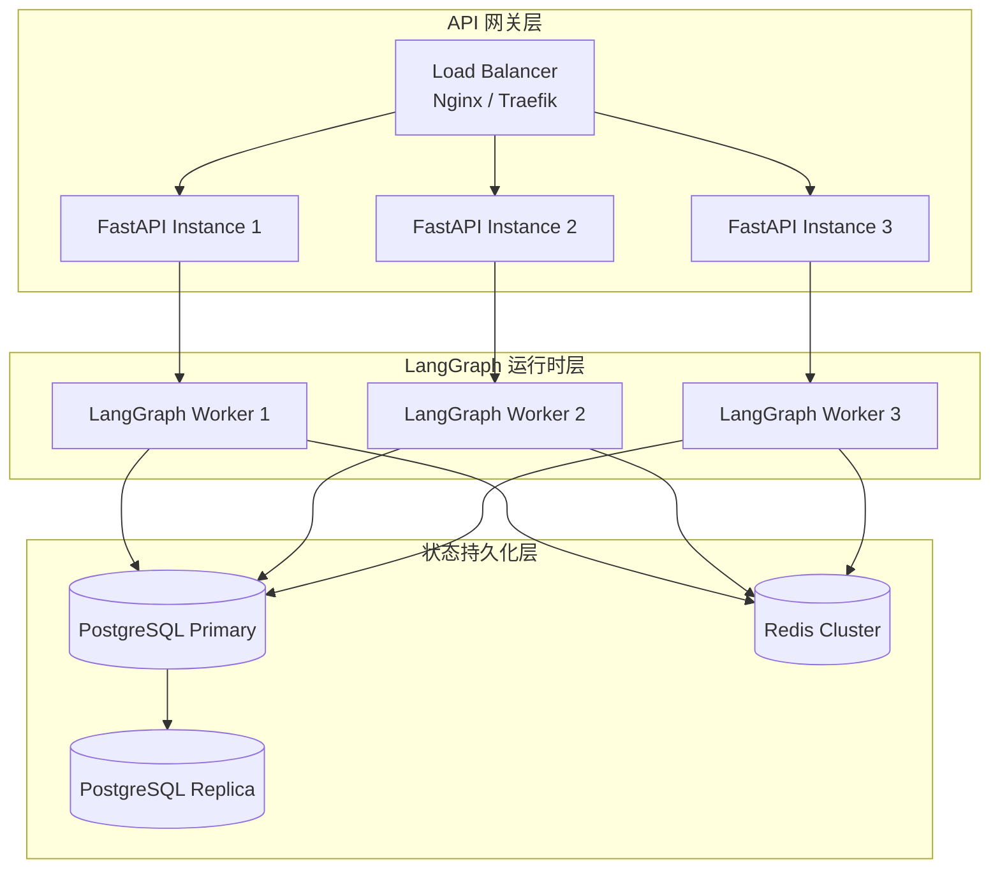
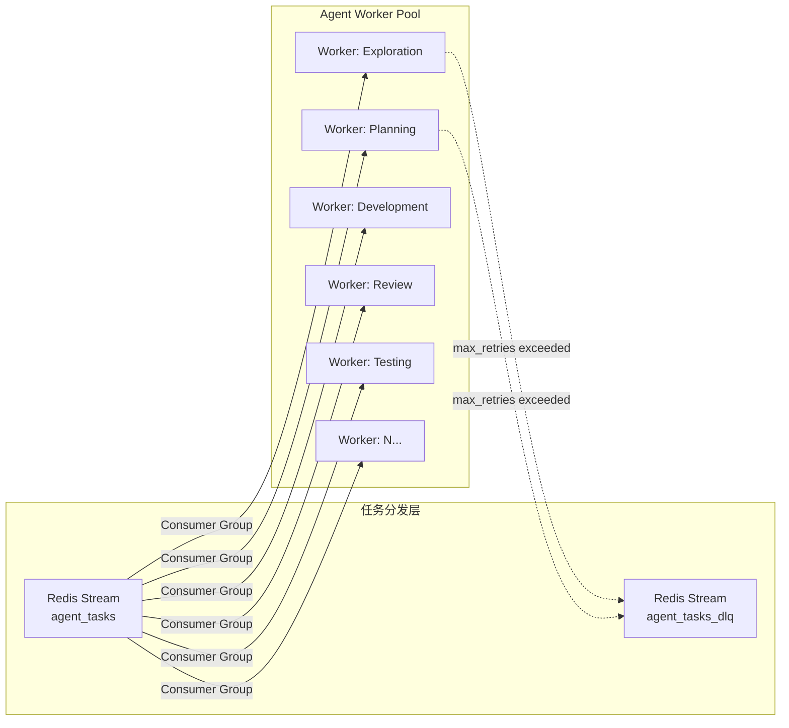
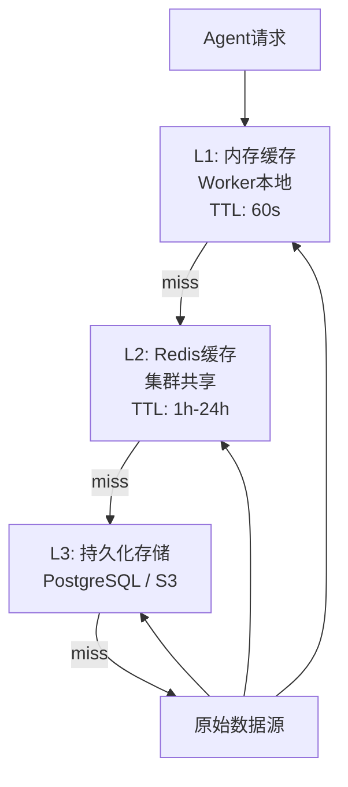
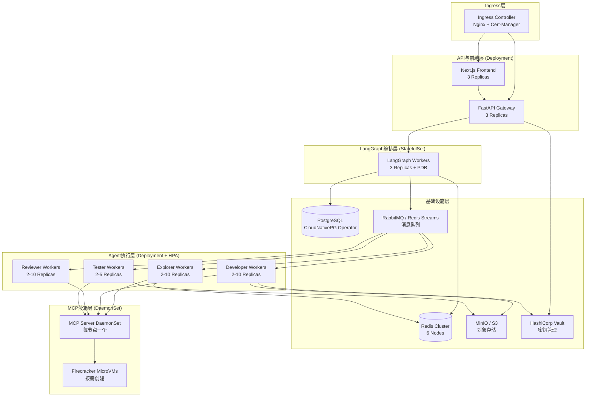

# RV-Insights: 系统架构与非功能性需求深化设计

**版本**: v1.0  
**日期**: 2026-04-21  
**定位**: 本文档是 `rv-insights-design.md` 第 2 章（系统总体架构）的细化与扩展，覆盖组件交互协议、非功能性需求及生产部署拓扑。

---

## 1. 各层组件详细交互协议

### 1.1 API 网关 ↔ LangGraph 编排引擎

API 网关（FastAPI）作为所有外部流量的唯一入口，与 LangGraph 运行时通过内部 gRPC + REST 双协议通信。

**关键端点规范**

| 方法 | 路径 | 请求体 | 响应体 | 说明 |
|------|------|--------|--------|------|
| `POST` | `/api/v1/sessions` | `CreateSessionRequest` | `SessionSummary` | 创建新会话，触发 `initialize_session` |
| `GET`  | `/api/v1/sessions/{id}` | - | `SessionDetail` | 查询会话完整状态与产物 |
| `POST` | `/api/v1/sessions/{id}/decisions` | `HumanDecisionRequest` | `SessionSummary` | 提交人工审核决策，恢复中断工作流 |
| `GET`  | `/api/v1/sessions/{id}/stream` | - | `SSE: WorkflowEvent` | 实时推送阶段状态与Agent日志 |
| `GET`  | `/api/v1/sessions/{id}/artifacts/{name}` | - | `ArtifactDownload` | 下载产物（Patch、测试报告） |
| `POST` | `/api/v1/sessions/{id}/cancel` | - | `SessionSummary` | 取消会话，触发优雅终止 |
| `GET`  | `/api/v1/agents/health` | - | `AgentsHealthReport` | 各Agent后端健康检查 |

**请求/响应格式（OpenAPI 3.1）**

```yaml
components:
  schemas:
    CreateSessionRequest:
      type: object
      required: [tenant_id, target_repos]
      properties:
        tenant_id:
          type: string
          description: 多租户隔离标识
        user_query:
          type: string
          description: 用户给定的贡献方向（可选）
        target_repos:
          type: array
          items:
            type: object
            properties:
              owner: { type: string }
              repo: { type: string }
              base_commit: { type: string }
        exploration_depth:
          type: string
          enum: [quick, standard, deep]
          default: standard
        max_budget_usd:
          type: number
          description: 会话Token预算上限（美元等值）
          default: 5.0

    HumanDecisionRequest:
      type: object
      required: [stage, decision]
      properties:
        stage:
          type: string
          enum: [EXPLORATION, PLANNING, CODE, TESTING]
        decision:
          type: string
          enum: [APPROVE, REJECT, REQUEST_CHANGES, ADD_NOTES]
        comment:
          type: string
          description: Markdown格式注释

    WorkflowEvent:
      type: object
      required: [event_type, session_id, timestamp]
      properties:
        event_type:
          type: string
          enum:
            - stage_started
            - agent_thinking
            - human_review_required
            - stage_completed
            - error_occurred
            - token_consumed
            - heartbeat
            - ack                 # WebSocket 专用：客户端确认
            - connection_established  # WebSocket 专用：连接建立
            - state_sync          # WebSocket 专用：全量状态同步
        session_id: { type: string }
        stage: { type: string }
        payload: { type: object }
        timestamp: { type: string, format: date-time }
```

**SSE 推送协议**

```http
GET /api/v1/sessions/{id}/stream HTTP/1.1
Accept: text/event-stream
Authorization: Bearer <JWT>

HTTP/1.1 200 OK
Content-Type: text/event-stream
Cache-Control: no-cache
Connection: keep-alive

event: stage_started
data: {"stage":"EXPLORATION","timestamp":"2026-04-21T10:00:00Z"}

event: agent_thinking
data: {"agent":"Explorer","message":"Scanning linux-riscv mailing list...","timestamp":"..."}

event: human_review_required
data: {"stage":"EXPLORATION","artifact_url":"/artifacts/exploration_report.json","summary":"Found 3 opportunities"}
```

### 1.2 LangGraph ↔ Agent 能力层

LangGraph 运行时通过**异步任务队列**调用各Agent，而非直接同步调用LLM API。这确保了：
1. LangGraph 状态机不被长时LLM调用阻塞
2. Agent执行节点可独立扩展
3. 单阶段失败不影响编排器稳定性

**调用契约**

```python
class AgentExecutor(Protocol):
    async def invoke(
        self,
        agent_id: str,
        session_id: str,
        input_state: Dict[str, Any],
        config: AgentConfig,
    ) -> AgentResult:
        """
        调用Agent执行节点。

        Args:
            agent_id: 注册在Agent Registry中的唯一标识
            session_id: 关联的RV-Insights会话ID
            input_state: 当前LangGraph状态的子集（按需序列化）
            config: 包含超时、重试、模型选择等参数

        Returns:
            AgentResult: 包含输出状态更新、产物引用、日志

        Raises:
            AgentTimeoutError: 执行超过 config.timeout
            AgentRetryableError: 可重试错误（如LLM API限流）
            AgentFatalError: 不可恢复错误（如代码编译持续失败）
        """
        ...
```

**消息信封格式（Agent间内部通信）**

```json
{
  "message_id": "msg_01J8XQ3R9K2L",
  "correlation_id": "sess_abc123_dev_review_iter_2",
  "agent_id": "reviewer_codex",
  "session_id": "sess_abc123",
  "payload_type": "ReviewResult",
  "payload": { ... },
  "reasoning_log": "自然语言推理过程，供人类审计",
  "token_usage": { "prompt": 15234, "completion": 4892 },
  "timestamp": "2026-04-21T10:15:32Z"
}
```

### 1.3 MCP Server RPC 接口规范

MCP Server 作为所有Agent的安全执行代理，暴露标准化的 JSON-RPC 2.0 接口。

**核心方法**

| 方法 | 参数 | 返回值 | 说明 |
|------|------|--------|------|
| `tools/list` | - | `List[Tool]` | 列出当前可用的工具（沙箱内可执行命令） |
| `tools/call` | `tool_name, arguments, session_id` | `ToolResult` | 在指定会话的隔离环境中执行工具 |
| `sandbox/create` | `session_id, image, resources` | `SandboxInfo` | 为会话创建隔离沙箱 |
| `sandbox/destroy` | `session_id, force` | `bool` | 销毁会话沙箱，释放资源 |
| `filesystem/read` | `session_id, path` | `FileContent` | 在沙箱内读取文件（受限路径） |
| `filesystem/write` | `session_id, path, content` | `bool` | 在沙箱内写入文件 |

**工具执行请求示例**

```json
{
  "jsonrpc": "2.0",
  "id": 42,
  "method": "tools/call",
  "params": {
    "tool_name": "git_clone",
    "arguments": {
      "repo_url": "https://github.com/torvalds/linux.git",
      "target_dir": "/workspace/linux",
      "depth": 1
    },
    "session_id": "sess_abc123",
    "timeout_ms": 300000
  }
}
```

**安全约束**
- 每个 `session_id` 只能访问属于自己的沙箱命名空间
- `filesystem/read` 和 `filesystem/write` 禁止访问 `/etc`、`/proc`、`/sys` 等敏感路径
- 网络出站默认关闭，仅对预配置的GitHub/GitLab API地址开放（通过egress proxy）

---

## 2. 非功能性需求

### 2.1 性能指标（SLO/SLA）

| 指标 | 目标值 | 硬超时上限 | 测量方式 | 告警阈值 |
|------|--------|------------|----------|----------|
| **探索阶段延迟** | P90 < 30min | 2h | 从触发到输出报告 | > 45min 触发告警 |
| **规划阶段延迟** | P90 < 15min | 1h | 从触发到输出方案 | > 25min 触发告警 |
| **开发阶段延迟** | P90 < 10min | 4h | 从触发到代码变更输出 | > 20min 触发告警 |
| **审核阶段延迟** | P90 < 5min | 30min | 从代码提交到审核报告 | > 15min 触发告警 |
| **测试阶段延迟** | P90 < 60min（QEMU）| 3h | 从触发到测试报告 | > 90min 触发告警 |
| **端到端（单迭代）** | P90 < 2h | 24h（整体会话）| 探索→测试（人工审核时间不计入）| > 3h 触发告警 |
| **系统并发会话数** | ≥ 20 个并行会话 | - | 同时处于 running 状态的会话 | < 15 触发扩容 |
| **API 响应延迟** | P99 < 200ms | 10s | 健康检查与状态查询端点 | > 500ms 触发告警 |
| **SSE 推送延迟** | P99 < 1s | 30s | 从Agent事件产生到前端收到 | > 3s 触发告警 |

**Token 消耗预算（按会话级别）**

| 深度模式 | 预算上限 | 典型消耗分布 |
|----------|----------|--------------|
| Quick | $0.50 | 探索 40% / 规划 30% / 开发+审核 30% |
| Standard | $5.00 | 探索 20% / 规划 15% / 开发+审核 50% / 测试 15% |
| Deep | $20.00 | 探索 15% / 规划 10% / 开发+审核 55% / 测试 20% |

### 2.2 高可用设计

**LangGraph 编排器多实例部署**



- **无状态API网关**: FastAPI实例完全无状态，JWT认证信息不依赖本地存储，可任意水平扩展。
- **LangGraph Worker**: 每个Worker独立运行StateGraph实例，通过PostgreSQL Checkpointer实现状态共享。同一会话的后续请求可能被路由到不同Worker，通过checkpoint无缝恢复。
- **PostgreSQL主从**: 写操作走Primary，读操作（状态查询、审计日志）可分散到Replica。启用流复制（Streaming Replication），RPO < 1s。
- **Redis Cluster**: 缓存、分布式锁、任务队列使用Redis Cluster（6节点，3主3从），支持自动故障转移。

### 2.3 水平扩展策略

**Agent Worker Pool 架构**



- **队列隔离**: 每个Agent类型拥有独立的Redis Stream（`rv:queue:agent_tasks:exploration`、`rv:queue:agent_tasks:development`等），避免某一Agent类型拥塞影响全局。
- **Consumer Group**: 同一类型的Worker组成Consumer Group，消息被负载均衡分发到组内成员，支持故障时自动重新分配Pending消息。
- **弹性伸缩**: 基于队列长度（`XLEN`）的HPA（Horizontal Pod Autoscaler）策略：
  - 当 `rv:queue:agent_tasks:development` 长度 > 10 时，扩容Development Worker至最多10个实例
  - 当队列长度 < 3 持续5分钟，缩容至最少2个实例

### 2.4 多租户隔离

| 隔离维度 | 实现机制 | 说明 |
|----------|----------|------|
| **数据隔离** | PostgreSQL RLS (Row Level Security) | `sessions`、`checkpoints` 等表按 `tenant_id` 过滤，确保跨租户数据不可见 |
| **资源配额** | Redis计数器 + 准入控制 | 每租户最大并发会话数（默认5）、最大Token预算、最大QEMU实例数 |
| **Git仓库权限** | 租户级Git凭证 | 每个租户拥有独立的GitHub/GitLab App安装凭证，Agent只能访问租户授权的组织/仓库 |
| **工作区隔离** | 文件系统命名空间 | `{WORKSPACE_BASE}/{tenant_id}/{session_id}/`，禁止跨租户目录访问 |
| **网络隔离** | 租户级Egress规则 | 不同租户可配置不同的出站网络策略（如企业租户只允许访问内网GitLab） |

**准入控制伪代码**

```python
async def admission_control(tenant_id: str, requested_budget: float) -> bool:
    pipe = redis.pipeline()
    pipe.get(f"tenant:{tenant_id}:concurrent_sessions")
    pipe.get(f"tenant:{tenant_id}:monthly_budget_consumed")
    results = await pipe.execute()

    concurrent = int(results[0] or 0)
    budget_consumed = float(results[1] or 0.0)

    config = await load_tenant_config(tenant_id)

    if concurrent >= config.max_concurrent_sessions:
        raise AdmissionDenied("Concurrent session limit exceeded")

    if budget_consumed + requested_budget > config.monthly_budget_cap:
        raise AdmissionDenied("Monthly budget cap would be exceeded")

    return True
```

### 2.5 缓存策略

**多级缓存架构**



| 缓存类型 | 存储 | 键设计 | TTL | 命中率目标 |
|----------|------|--------|-----|------------|
| **RAG检索结果** | Redis String | `rag:{tenant_id}:{hash(query+filters)}` | 24h | 40-60% |
| **LLM代码审核结果** | Redis String | `review:{ast_fingerprint(patch)}` | 7d | 25-40% |
| **Git裸仓库** | 本地SSD | `/cache/git/{owner}/{repo}.git` | 持久（增量fetch）| 90%+ |
| **构建产物** | 本地SSD + S3 | `ccache/{compiler}/{arch}/{hash}` | 30d | 60-80% |
| **向量Embedding** | PostgreSQL + pgvector | `emb:{chunk_id}` | 持久 | 100% |

**Git裸仓库缓存**
- 首次克隆使用 `--mirror` 模式拉取完整裸仓库到共享缓存目录
- 后续会话通过 `git clone --reference /cache/git/{repo}.git` 加速，仅拉取差异
- 每小时执行 `git remote update` 保持缓存新鲜
- 缓存淘汰：LRU策略，当磁盘使用率 > 80% 时淘汰最久未访问的仓库

**ccache集成**
- 开发Agent和测试Agent的Docker镜像预装ccache
- 缓存目录挂载为HostPath PVC，跨会话共享编译产物
- 对于RISC-V交叉编译（`riscv64-linux-gnu-gcc`），ccache可显著减少内核编译时间（从20min降至3-5min）

---

## 3. 部署架构

### 3.1 生产环境 Kubernetes 拓扑



**关键Kubernetes资源配置**

```yaml
# LangGraph Worker (StatefulSet，需要稳定的网络标识和本地缓存盘)
apiVersion: apps/v1
kind: StatefulSet
metadata:
  name: langgraph-worker
spec:
  serviceName: langgraph-worker
  replicas: 3
  podManagementPolicy: Parallel
  template:
    spec:
      containers:
        - name: worker
          image: rv-insights/langgraph-worker:v1.0
          resources:
            requests: { cpu: "2", memory: "4Gi" }
            limits: { cpu: "4", memory: "8Gi" }
          env:
            - name: DATABASE_URL
              valueFrom: { secretKeyRef: { name: db-secret, key: url } }
            - name: REDIS_URL
              valueFrom: { secretKeyRef: { name: redis-secret, key: url } }
          volumeMounts:
            - name: git-cache
              mountPath: /cache/git
            - name: ccache
              mountPath: /cache/ccache
  volumeClaimTemplates:
    - metadata: { name: git-cache }
      spec:
        accessModes: ["ReadWriteOnce"]
        resources: { requests: { storage: 100Gi } }
    - metadata: { name: ccache }
      spec:
        accessModes: ["ReadWriteOnce"]
        resources: { requests: { storage: 50Gi } }

---
# Agent Worker (Deployment + HPA)
apiVersion: apps/v1
kind: Deployment
metadata:
  name: agent-worker-development
spec:
  replicas: 2
  template:
    spec:
      containers:
        - name: worker
          image: rv-insights/agent-worker:v1.0
          resources:
            requests: { cpu: "1", memory: "2Gi" }
            limits: { cpu: "2", memory: "4Gi" }
---
apiVersion: autoscaling/v2
kind: HorizontalPodAutoscaler
metadata:
  name: agent-worker-development-hpa
spec:
  scaleTargetRef:
    apiVersion: apps/v1
    kind: Deployment
    name: agent-worker-development
  minReplicas: 2
  maxReplicas: 10
  metrics:
    - type: External
      external:
        metric:
          name: redis_stream_length
          selector:
            matchLabels:
              stream: agent_tasks:development
        target:
          type: AverageValue
          averageValue: "5"
```

### 3.2 多环境隔离

| 环境 | 用途 | 数据隔离 | 规模 |
|------|------|----------|------|
| **Development** | 功能开发与本地联调 | 共享测试数据库（定期重置）| 1-2副本 |
| **Staging** | 集成测试与发布验证 | 独立数据库（模拟生产数据量）| 生产规模的30% |
| **Production** | 正式服务 | 完全独立，严格备份策略 | 完整规模 |

**环境配置管理**
- 使用 Helm Chart 统一管理所有环境的Kubernetes资源
- 环境差异通过 `values-{env}.yaml` 文件控制（副本数、资源限制、域名、密钥引用）
- 非生产环境使用独立的LLM API密钥池，防止测试流量影响生产配额

---

## 4. 监控与告警

### 4.1 黄金指标仪表盘

| 指标类别 | 具体指标 | 采集方式 |
|----------|----------|----------|
| **延迟** | 各阶段P50/P90/P99延迟、API响应时间 | Prometheus Histogram + Grafana |
| **流量** | 并发会话数、QPS、Agent任务队列深度 | Prometheus Counter/Gauge |
| **错误** | Agent失败率、LLM API错误率、沙箱逃逸告警 | Prometheus + AlertManager |
| **饱和度** | CPU/内存/磁盘使用率、Token预算消耗比例 | Prometheus + Kubernetes Metrics |

### 4.2 关键告警规则

```yaml
groups:
  - name: rv-insights-critical
    rules:
      - alert: HighAgentFailureRate
        expr: rate(agent_task_failures_total[5m]) / rate(agent_task_total[5m]) > 0.1
        for: 5m
        labels: { severity: critical }
        annotations:
          summary: "Agent失败率超过10%"

      - alert: TokenBudgetExhaustion
        expr: session_token_consumed_usd / session_token_budget_usd > 0.9
        for: 1m
        labels: { severity: warning }
        annotations:
          summary: "会话Token预算即将耗尽"

      - alert: SandboxEscapeAttempt
        expr: increase(mcp_sandbox_forbidden_syscall_total[1m]) > 0
        for: 0m
        labels: { severity: critical }
        annotations:
          summary: "检测到沙箱逃逸尝试"
```

---

## 5. 附录：与主方案的衔接对照表

| 主方案章节 | 本文档对应章节 | 补充内容 |
|------------|----------------|----------|
| 2.2 总体架构图 | 全部 | 细化各层组件交互协议 |
| 2.3 技术选型矩阵 | 1.1-1.3 | API规范、Agent契约、MCP RPC |
| 3.x Agent节点设计 | 1.2 | 输入输出序列化格式 |
| 4.x 工作流设计 | 2.2, 2.3 | 高可用与水平扩展 |
| 5.x 人工审核 | 1.1 SSE协议 | 实时推送JSON Schema |
| 7.x 安全设计 | 1.3 MCP安全约束 | 沙箱RPC安全边界 |
| 8.x 数据持久化 | 2.2 | 主从复制与缓存策略 |
