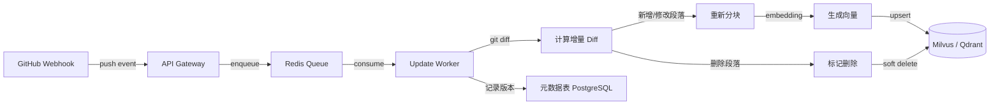
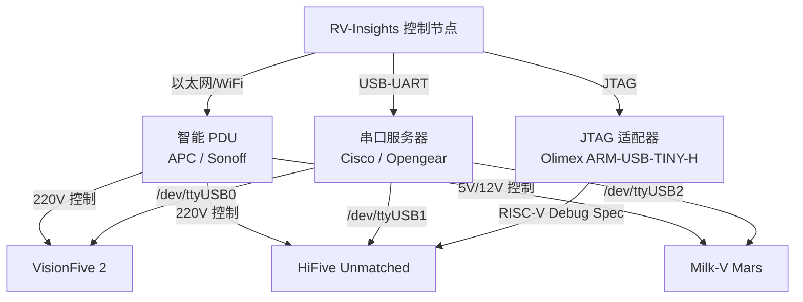

# RV-Insights: RISC-V 领域知识层与测试基础设施深化设计

**版本**: v1.0  
**日期**: 2026-04-21  
**定位**: 主方案 `rv-insights-design.md` 的领域深化补充，可直接合并至第 6 章及测试相关章节。

---

## 1. RAG 知识库详细设计

### 1.1 文档分块策略

RISC-V 知识库来源多样（ISA 规范、ABI 文档、内核源码注释、邮件列表存档），必须采用**分层分块**策略，兼顾检索精度与上下文完整性。

| 知识类别 | 分块粒度 | 块大小 (tokens) | 重叠策略 | 元数据标签 |
|----------|----------|-----------------|----------|------------|
| **ISA 规范 (riscv-isa-manual)** | 按章节 + 按指令 | 512-1024 | 前后各 64 tokens 重叠 | `chapter`, `section`, `extension`, `privilege_level` |
| **ABI 规范 (riscv-elf-psabi-doc)** | 按函数/按配置项 | 256-512 | 前后各 32 tokens 重叠 | `abi_version`, `topic` (calling_convention/struct_layout), `arch` (rv32/rv64) |
| **内核文档 (arch/riscv)** | 按函数 + 按文件头注释 | 384-768 | 前后各 48 tokens 重叠 | `file_path`, `kernel_version`, `doc_type` (comment/kdoc) |
| **贡献指南 (CONTRIBUTING.md)** | 按段落/按规则条目 | 256-384 | 前后各 24 tokens 重叠 | `repo`, `guideline_type` (style/process) |
| **历史 Patch** | 按 Commit Message + 按 Diff Hunk | 512-1024 | Commit 与 Diff 间 0 重叠，Hunk 间 32 tokens | `repo`, `author`, `status` (merged/rejected), `topic` |
| **邮件列表存档** | 按邮件线程 (Thread) 摘要 | 768-1536 | 线程内邮件摘要 64 tokens 重叠 | `list_name`, `date`, `thread_id`, `participants` |

**重叠策略说明**:
- **指令级分块**: 对于 ISA 规范，每个指令的语义描述、伪代码、异常行为必须位于同一块内，禁止跨块截断。若单条指令描述超过 1024 tokens，则拆分为"语法/编码"与"语义/异常"两个子块，通过 `instruction_name` 元数据关联。
- **函数级分块**: 对于内核源码，以函数定义边界为优先切分点。若函数体超过 768 tokens，则按逻辑段落（如初始化、主逻辑、错误处理）二次切分，并注入函数签名作为每个子块的上下文前缀。
- **Patch 分块**: Commit Message 单独成块（作为高层语义），每个 Diff Hunk 单独成块（作为实现细节）。检索时优先匹配 Commit Message，再关联其下属的 Hunk 块。

### 1.2 嵌入模型选型与对比

| 维度 | OpenAI `text-embedding-3-large` | 本地模型 (BAAI/bge-large-en-v1.5 / GTE-large) |
|------|----------------------------------|-----------------------------------------------|
| **维度** | 3072 | 1024 |
| **性能 (MTEB)** |  top-tier (64.6 avg) | 接近 top-tier (64.2 avg for bge) |
| **延迟** | 网络依赖，~100-300ms/batch | 本地 GPU (A10G) ~20-50ms/batch |
| **成本** | $0.13 / 1M tokens | 一次性硬件成本，零调用成本 |
| **隐私** | 数据出境至 OpenAI API | 完全本地，适合内核源码 |
| **更新灵活性** | 不可微调 | 可领域微调 (RISC-V 指令集描述) |
| **多语言** | 优秀 | 需确认中文规范文档支持 |

**选型决策**:
1. **生产环境默认**: 采用 **混合部署**。敏感内容（内核源码、未公开 Patch）使用本地 `bge-large-en-v1.5`（经 RISC-V 领域微调）；公开规范文档（ISA Manual、ABI Doc）使用 `text-embedding-3-large` 以获得最佳语义理解。
2. **领域微调方案**: 使用 10k 条 RISC-V 领域语料（指令描述、ABI 规则、内核注释）对本地模型进行 LoRA 微调，目标提升指令-语义对齐度。
3. **向量数据库**: **Milvus** 或 **Qdrant**。Milvus 适合大规模 (10M+ 文档) 与混合检索；Qdrant 适合快速迭代与本地部署。索引采用 HNSW (ef=128, M=16)。

### 1.3 重排序 (Rerank) 策略

采用 **三阶段检索** 架构，确保高召回率与高精确度：

```
用户查询
    |
    v
[阶段一: 混合检索] --- BM25 (稀疏) 检索标题/元数据
    |                --- 向量检索 (Dense) 语义相似度
    |                --- 结果合并 (RRF: Reciprocal Rank Fusion, k=60)
    v
[阶段二: 重排序]  --- Cohere Rerank API (model: rerank-v3.5)
    |                --- 输入: 阶段一 Top-100
    |                --- 输出: 阶段二 Top-20 (按相关性得分排序)
    v
[阶段三: 上下文压缩] --- LLM-based 压缩 (如 LongLLMLingua)
    |                   --- 去除冗余，保留与查询最相关的句子
    v
最终上下文 (Top-5 ~ Top-10 chunks) 注入 Prompt
```

**RRF 公式**: `score = sum(1.0 / (k + rank))`，其中 `k=60` 为平滑因子。

**Cohere Rerank 调用示例**:
```python
import cohere

co = cohere.Client(api_key=os.environ["COHERE_API_KEY"])

results = co.rerank(
    model="rerank-v3.5",
    query="RISC-V H-extension hypervisor CSR handling in Linux kernel",
    documents=[chunk.text for chunk in initial_results],
    top_n=10,
    return_documents=True
)
```

**降级策略**: 若 Cohere API 不可用，使用本地交叉编码器 (`cross-encoder/ms-marco-MiniLM-L-6-v2`) 作为备用重排序器。

### 1.4 知识库更新流水线



**增量更新策略**:
1. **触发条件**: 通过 GitHub Webhook 监听 `riscv-isa-manual`、`linux`、`qemu` 等目标仓库的 `push` 事件。仅当变更涉及 `.md`、`.rst`、`.txt` 或 `arch/riscv/` 下源码时触发。
2. **版本对齐**: 每个 Chunk 关联 `commit_sha` 与 `repo_version_tag`。查询时默认检索最新版本，但支持按 `commit_sha` 回溯历史规范（用于审核历史 Patch）。
3. **冲突解决**: 若同一文档段落短期内多次更新，Worker 采用乐观锁机制，以最新 `commit_timestamp` 为准，旧版本标记为 `superseded` 但不物理删除，保留审计能力。
4. **全量重建**: 每月执行一次全量重建任务（通过定时 CronJob），作为增量更新的兜底校验。

### 1.5 Prompt 注入模板示例

#### 开发 Agent System Prompt 注入模板

```markdown
## RISC-V 规范上下文 (动态注入)

你正在针对以下 RISC-V 环境进行开发：
- **目标架构**: {{ target_arch }}  (如 RV64GC, RV32IMAC)
- **特权模式**: {{ privilege_mode }}  (M / S / U / HS)
- **相关扩展**: {{ extensions }}  (如 V, H, Zicsr, Zifencei)

### 相关规范摘要 (来自 RAG 检索)
{{ retrieved_context }}

### 编码风格约束
- 严格遵循 Linux Kernel `arch/riscv` 目录的编码风格。
- 内联汇编必须使用 Extended ASM 语法，并完整指定 clobber list。
- CSR 操作优先使用 `<asm/csr.h>` 提供的封装宏（如 `csr_read(csrname)`），避免裸 `csrr` 指令。
- 内存屏障：使用 `rmb()`/`wmb()`/`mb()` 抽象，禁止直接嵌入 `fence` 指令，除非在极低级启动代码中。

### 常见陷阱提醒
1. RISC-V 为弱内存模型，多核同步必须显式使用原子操作 + 屏障，不能依赖隐式顺序。
2. `sfence.vma` 仅在修改页表后需要调用，且必须成对使用（先改表，再刷TLB）。
3. 部分 RISC-V 核心（如 SiFive U54）不支持非对齐访问，用户空间代码若处理_packed_结构体需格外谨慎。
4. H-extension (Hypervisor) 下，Guest 的 CSR 访问可能触发虚拟化异常，需检查 `hstatus` 与 `hedeleg` 配置。
```

#### 审核 Agent System Prompt 注入模板

```markdown
## RISC-V 审核规范上下文 (动态注入)

你作为 RISC-V 代码审核专家，需依据以下检索到的规范上下文进行审查：

### 相关规范条文
{{ retrieved_context }}

### 审核维度权重
1. **ISA 规范符合性 (权重: 高)**: 检查指令使用是否在目标扩展集内；检查 CSR 编号是否正确；检查特权指令是否在正确模式下执行。
2. **ABI 合规性 (权重: 高)**: 检查函数调用约定（参数寄存器 a0-a7，返回值 a0-a1，栈对齐 16-byte）；检查结构体传递方式（<=16 bytes 按寄存器，否则按引用）。
3. **内存模型合规性 (权重: 高)**: 检查原子操作与内存屏障配对；检查 `fence.i` 与 `sfence.vma` 使用场景。
4. **性能优化 (权重: 中)**: 检查是否可利用 RISC-V 特定指令（如 `clz`/`ctz` 替代软件循环）；检查是否避免不必要的特权模式切换。
5. **安全性 (权重: 高)**: 检查 CSR 写操作是否经过权限校验；检查内联汇编是否意外暴露敏感寄存器。

### 输出格式要求
对每个问题，必须引用具体的规范章节或文档来源（如 "RISC-V Privileged Spec v20211203, Section 3.1.6"）。
```

---

## 2. RISC-V 静态分析规则集完整清单

### 2.1 规则分类总览

| 类别 | 规则数量 | 实现方式 | 优先级 |
|------|----------|----------|--------|
| ISA 规范类 | 5 | semgrep + sparse | 高 |
| ABI 合规类 | 5 | semgrep + clang-tidy | 高 |
| 内存模型类 | 4 | semgrep + 自定义 sparse | 高 |
| 性能优化类 | 4 | clang-tidy + sparse | 中 |
| 安全类 | 5 | semgrep + 自定义 sparse | 高 |

### 2.2 ISA 规范类规则 (5条)

| ID | 严重级别 | 规则名称 | 检测模式 | 修复建议 | 参考规范 |
|----|----------|----------|----------|----------|----------|
| `RISCV-ISA-001` | CRITICAL | 非法特权指令在用户态执行 | semgrep: `__asm__ volatile ("csrr ...")` 出现在非 `arch/riscv/kernel/` 目录 | 移至内核态代码，或通过系统调用接口访问 | Privileged Spec, Section 2.1 |
| `RISCV-ISA-002` | HIGH | 使用未声明支持的扩展指令 | semgrep: 检测到 `vsetvli` / `vl*` 但 Makefile/Kconfig 未启用 `CONFIG_RISCV_ISA_V` | 添加 Kconfig 依赖，或改用标量实现 | ISA Spec, Vector Extension |
| `RISCV-ISA-003` | MEDIUM | CSR 编号硬编码而非使用命名宏 | semgrep: `csrr \w+, 0x[0-9a-f]+` | 改用 `<asm/csr.h>` 中的 `CSR_SSTATUS` 等命名宏 | Privileged Spec, Section 2.2 |
| `RISCV-ISA-004` | MEDIUM | 使用过时的指令别名 | semgrep: `csrrw x0, ...` | 替换为 `csrw ...` | ISA Spec, Chapter 25 (ISA Listing) |
| `RISCV-ISA-005` | HIGH | 未处理非法指令异常 | AST: 函数包含内联汇编扩展指令，但无 `local_irq_save` 或异常处理上下文 | 在调用前保存状态，或确保处于 M-mode | Privileged Spec, Section 3.1.9 |

### 2.3 ABI 合规类规则 (5条)

| ID | 严重级别 | 规则名称 | 检测模式 | 修复建议 | 参考规范 |
|----|----------|----------|----------|----------|----------|
| `RISCV-ABI-001` | CRITICAL | 栈指针未 16-byte 对齐 | clang-tidy: 检查 `addi sp, sp, imm` 后 `sp % 16 != 0` | 调整栈帧大小为 16 的倍数 | RISC-V ELF psABI, Section 3.2 |
| `RISCV-ABI-002` | HIGH | 函数参数超过 8 个未使用栈传递 | semgrep: 函数定义中形参 > 8 个，但汇编未引用 `8*XLEN(sp)` | 第 9 个及以后参数通过栈传递 (a0-a7 已满) | RISC-V ELF psABI, Section 3.5 |
| `RISCV-ABI-003` | MEDIUM | 结构体返回值未按 ABI 处理 | clang-tidy: 返回 > 16 bytes 的结构体，但汇编直接写入寄存器 | 使用隐式指针参数（由调用方分配空间） | RISC-V ELF psABI, Section 3.5 |
| `RISCV-ABI-004` | MEDIUM | 未保存被调用方保存寄存器 | semgrep: 函数修改 `s0-s11` 但未在 prologue/epilogue 保存 | 在函数入口保存，出口恢复 | RISC-V ELF psABI, Section 3.3 |
| `RISCV-ABI-005` | HIGH | 浮点参数混用整数/浮点寄存器 | semgrep: 函数签名含 `double` 但汇编使用 `a0` 而非 `fa0` | 浮点参数使用 `fa0-fa7`，整数参数使用 `a0-a7` | RISC-V ELF psABI, Section 3.5 |

### 2.4 内存模型类规则 (4条)

| ID | 严重级别 | 规则名称 | 检测模式 | 修复建议 | 参考规范 |
|----|----------|----------|----------|----------|----------|
| `RISCV-MEM-001` | CRITICAL | 原子操作后缺少内存屏障 | semgrep: `atomic_set` / `atomic_read` 后无 `smp_mb__after_atomic()` | 根据语义添加 `smp_rmb()` / `smp_wmb()` / `smp_mb()` | RISC-V Memory Model, Section A.5 |
| `RISCV-MEM-002` | HIGH | 非对齐内存访问 (用户态) | semgrep: `*(uint64_t*)ptr` 且 `ptr` 未显式对齐到 8 | 使用 `get_unaligned()` / `put_unaligned()` | ISA Spec, Section 3.4.1 |
| `RISCV-MEM-003` | HIGH | 修改页表后未刷新 TLB | sparse: 检测到写入 `pgd_t` / `pmd_t` 后无 `sfence.vma` | 在页表修改后调用 `local_flush_tlb_*()` 或 `sfence.vma` | Privileged Spec, Section 4.2.1 |
| `RISCV-MEM-004` | MEDIUM | `fence.i` 使用位置不当 | semgrep: `fence.i` 出现在非自修改代码场景 | 仅在动态代码生成后使用；常规数据同步使用 `fence` | ISA Spec, Section 3.3.2 |

### 2.5 性能优化类规则 (4条)

| ID | 严重级别 | 规则名称 | 检测模式 | 修复建议 | 参考规范 |
|----|----------|----------|----------|----------|----------|
| `RISCV-PERF-001` | LOW | 未使用 `clz`/`ctz` 指令优化位操作 | clang-tidy: 软件循环实现前导零/尾随零计数 | 使用 GCC 内置函数 `__builtin_clz()` | ISA Spec, Zbb Extension |
| `RISCV-PERF-002` | MEDIUM | 循环中重复读取时间 CSR | semgrep: 循环体内多次 `rdtime` / `rdcycle` | 将 CSR 读取提升至循环外 | 性能最佳实践 |
| `RISCV-PERF-003` | LOW | 未利用 RISC-V 延迟槽 (若适用) | sparse: 分支指令后插入 `nop` 而非有效指令 | 重新排列指令，填充有效操作 | ISA Spec (注意: 压缩指令集无延迟槽) |
| `RISCV-PERF-004` | MEDIUM | 不必要的特权模式切换 | semgrep: 频繁 `ecall` / `sret` / `mret` | 批量处理请求，减少上下文切换 | 内核优化指南 |

### 2.6 安全类规则 (5条)

| ID | 严重级别 | 规则名称 | 检测模式 | 修复建议 | 参考规范 |
|----|----------|----------|----------|----------|----------|
| `RISCV-SEC-001` | CRITICAL | CSR 写操作未验证权限 | semgrep: `csr_write(CSR_SATP, ...)` 出现在非特权检查路径 | 添加 `sbi_get_priv()` 或 `capable(CAP_SYS_ADMIN)` 检查 | Privileged Spec, Section 2.1 |
| `RISCV-SEC-002` | HIGH | 内联汇编暴露栈指针 | semgrep: `__asm__` 输出操作数包含 `sp` 且无约束保护 | 禁止修改 `sp`，或使用 `"+r"` 约束并验证 | Linux Kernel Coding Style |
| `RISCV-SEC-003` | HIGH | 未初始化 CSR 即使用 | sparse: 变量类型为 `unsigned long` 但语义为 CSR 值，未经过读取初始化 | 显式调用 `csr_read()` 初始化 | 防御性编程 |
| `RISCV-SEC-004` | CRITICAL | `mstatus.MPP` 设置错误导致权限提升 | semgrep: `mstatus` 写入后 `MPP` 字段为 M-mode，但返回路径指向用户态 | 确保 `MPP` 与目标特权模式一致 | Privileged Spec, Section 3.1.6.1 |
| `RISCV-SEC-005` | MEDIUM | 中断处理程序未保存浮点状态 | semgrep: `irq_handler` 使用浮点指令但无 `fcsr` 保存 | 在入口保存 `fcsr` 与浮点寄存器，出口恢复 | ABI Spec, Section 3.3 |

### 2.7 规则实现方式详解

#### semgrep 规则示例 (`riscv-atomic-missing-fence`)

```yaml
rules:
  - id: riscv-atomic-missing-fence
    languages: [c, cpp]
    message: |
      RISC-V 弱内存模型下，原子操作后可能缺少必要的内存屏障。
      参考: RISC-V Memory Model, Section A.5
    severity: ERROR
    patterns:
      - pattern: atomic_set($PTR, $VAL);
      - pattern-not-inside: |
          atomic_set($PTR, $VAL);
          ...
          smp_mb__after_atomic();
    metadata:
      category: memory-model
      references:
        - https://github.com/riscv/riscv-isa-manual/blob/main/src/a-memory.adoc
```

#### clang-tidy 检查器框架 (自定义 `RISCVABICheck`)

```cpp
// clang-tidy/riscv/RISCVABICheck.cpp
#include "RISCVABICheck.h"

namespace clang::tidy::riscv {

void RISCVABICheck::registerMatchers(MatchFinder *Finder) {
  // 匹配栈指针修改指令
  Finder->addMatcher(
    binaryOperator(
      hasOperatorName("+="),
      hasLHS(declRefExpr(to(varDecl(hasName("sp"))))),
      hasRHS(integerLiteral().bind("offset"))
    ).bind("stack_op"),
    this
  );
}

void RISCVABICheck::check(const MatchFinder::MatchResult &Result) {
  const auto *Op = Result.Nodes.getNodeAs<BinaryOperator>("stack_op");
  const auto *Offset = Result.Nodes.getNodeAs<IntegerLiteral>("offset");
  if (!Op || !Offset) return;

  int64_t Val = Offset->getValue().getSExtValue();
  if (Val % 16 != 0) {
    diag(Op->getExprLoc(),
         "RISC-V ABI requires stack pointer to be 16-byte aligned, "
         "but offset %0 is not a multiple of 16",
         DiagnosticIDs::Error)
        << Val;
  }
}

} // namespace clang::tidy::riscv
```

#### 自定义 sparse 插件 (`riscv-check.c`)

```c
// sparse riscv 插件：检查 fence / sfence.vma 配对
#include "sparse/sparse.h"
#include "sparse/linearize.h"

static void check_sfence_vma(struct instruction *insn) {
    // 简化示例：检查页表写入后是否存在 sfence.vma
    if (insn->opcode == OP_STORE && is_pagetable_write(insn)) {
        if (!find_subsequent_sfence_vma(insn)) {
            warning(insn->pos,
                "RISCV-MEM-003: Page table modification without subsequent sfence.vma");
        }
    }
}

void riscv_check_function(struct entrypoint *ep) {
    struct basic_block *bb;
    struct instruction *insn;

    FOR_EACH_PTR(ep->bbs, bb) {
        FOR_EACH_PTR(bb->insns, insn) {
            check_sfence_vma(insn);
        } END_FOR_EACH_PTR(insn);
    } END_FOR_EACH_PTR(bb);
}
```

---

## 3. RISC-V 社区监控技术方案

### 3.1 邮件列表监控选型

| 方案 | 协议/接口 | 实时性 | 复杂度 | 历史数据 | 推荐场景 |
|------|-----------|--------|--------|----------|----------|
| **Mailman3 REST API** | HTTP REST | 近实时 (Webhook) | 中 | 有限 (需配置) | **首选**。官方推荐，支持归档查询与订阅管理。 |
| **NNTP** | NNTP (新闻组) | 近实时 | 低 | 完整 | 适合已有 NNTP 客户端基础设施的环境。 |
| **IMAP 拉取** | IMAP | 延迟 (轮询) | 低 | 完整 | 备用方案。适合无法使用 Webhook 的内网环境。 |

**推荐架构**: 以 **Mailman3 REST API + Webhook** 为主，**IMAP 拉取** 为兜底。

```python
# Mailman3 Webhook 处理示例
from mailmanclient import Client

client = Client('http://localhost:8001/3.1', 'restadmin', 'restpass')

# 订阅列表变更事件
for mlist in client.lists:
    if 'riscv' in mlist.list_name:
        # 配置 Webhook: 新邮件到达时 POST 到 RV-Insights API
        mlist.set_configuration({
            'webhook_url': 'https://rv-insights.example.com/webhooks/mailman',
            'webhook_events': ['message_posted']
        })
```

**IMAP 兜底轮询**:
```python
import imaplib
import email

def poll_riscv_mailbox():
    mail = imaplib.IMAP4_SSL("imap.lists.infradead.org")
    mail.login("rv-insights-bot@example.com", os.environ["IMAP_PASSWORD"])
    mail.select("linux-riscv")
    _, data = mail.search(None, "(UNSEEN)")
    for num in data[0].split():
        _, msg_data = mail.fetch(num, "(RFC822)")
        process_email(email.message_from_bytes(msg_data[0][1]))
```

### 3.2 GitHub Issue/PR 监控

| 方案 | 机制 | 实时性 | Rate Limit | 推荐场景 |
|------|------|--------|------------|----------|
| **GitHub App Webhook** | 事件推送 | 实时 | 无 (推送) | **首选**。低延迟，无轮询成本。 |
| **REST API Polling** | 主动轮询 | 延迟 (1-5min) | 5000/hr (认证) | 备用。用于历史回填或 Webhook 失效时。 |
| **GraphQL API** | 查询 | 按需 | 5000 points/hr | 复杂关联查询（如同时获取 Issue + 评论 + 作者）。 |

**GitHub App 配置**:
1. 创建 GitHub App (`RV-Insights Monitor`)，订阅事件：`issues`, `pull_request`, `issue_comment`, `pull_request_review`。
2. Webhook URL 指向 `https://rv-insights.example.com/webhooks/github`。
3. 使用 JWT + Installation Token 进行 API 调用。

**Rate Limit 处理**:
- 监控 `X-RateLimit-Remaining` 响应头，低于 100 时切换至备用 Token。
- 使用 Redis 作为请求队列，实现 Token 池的平滑轮询 (Round-Robin)。
- GraphQL 查询严格限制 `first: 50`，避免单次消耗过多 points。

### 3.3 信息提取与去重

**跨平台重复识别策略**:

RISC-V 社区的一个 Bug 可能同时在邮件列表、GitHub Issue、GitLab Issue 中被提及。需建立**全局议题指纹 (Global Topic Fingerprint)**。

```python
from dataclasses import dataclass
import hashlib

@dataclass
class TopicFingerprint:
    semantic_hash: str      # MinHash (基于邮件/Issue 标题 + 正文摘要)
    mention_set: set        # 涉及的仓库/邮件列表
    canonical_url: str      # 最早出现的原始链接

def generate_fingerprint(text: str, source_url: str) -> TopicFingerprint:
    # 1. 清洗：去除引用、签名、代码块
    cleaned = clean_email_or_issue_text(text)
    # 2. 提取关键实体：错误码、函数名、CSR 名、板卡名
    entities = extract_riscv_entities(cleaned)
    # 3. 生成语义指纹 (SimHash / MinHash)
    semantic = minhash_signature(cleaned)
    return TopicFingerprint(
        semantic_hash=semantic,
        mention_set={source_url},
        canonical_url=source_url
    )

def deduplicate(new_fp: TopicFingerprint, existing: list[TopicFingerprint]) -> bool:
    for old in existing:
        # Jaccard 相似度 > 0.85 视为同一议题
        if jaccard_similarity(new_fp.semantic_hash, old.semantic_hash) > 0.85:
            old.mention_set.update(new_fp.mention_set)
            return True  # 已存在
    return False
```

**去重流水线**:
1. **预处理**: 邮件线程去除引用层级 (`>`)，Issue 去除 Markdown 格式与代码块。
2. **实体提取**: 使用 spaCy + 自定义 RISC-V 词典，提取 `函数名`、`CSR`、`扩展名`、`开发板型号`。
3. **指纹生成**: 对清洗后文本生成 64-bit SimHash。
4. **相似度匹配**: 新文档与最近 30 天文档进行汉明距离计算，距离 < 3 视为重复。
5. **人工确认**: 高相似度但不确定的配对进入低优先级人工审核队列。

### 3.4 自然语言处理：Issue 分类模型

**模型**: `bert-base-uncased` 经 RISC-V 领域微调。

**数据集构建**:
- 收集 5k+ 已标注的 RISC-V 相关 Issue/邮件（来源: `torvalds/linux`, `riscv-collab/riscv-gnu-toolchain`, `qemu/qemu`）。
- 标注维度:
  - `category`: `bug` | `feature_request` | `optimization` | `documentation` | `question`
  - `component`: `kernel` | `toolchain` | `qemu` | `opensbi` | `hardware`
  - `priority`: `critical` | `high` | `medium` | `low`
  - `riscv_extension`: `I` | `M` | `A` | `F` | `D` | `C` | `V` | `H` | `none`

**微调方案**:
```python
from transformers import BertForSequenceClassification, Trainer

model = BertForSequenceClassification.from_pretrained(
    "bert-base-uncased",
    num_labels=5  # category
)

trainer = Trainer(
    model=model,
    train_dataset=riscv_issue_train_dataset,
    eval_dataset=riscv_issue_eval_dataset,
    compute_metrics=compute_classification_metrics
)
trainer.train()
```

**部署**: 使用 **ONNX Runtime** 量化导出，部署在本地 GPU 推理服务 (Triton Inference Server)，延迟 < 50ms/issue。

---

## 4. 多平台测试矩阵详细设计

### 4.1 QEMU 配置组合表

QEMU 作为首要验证平台，需覆盖主流 CPU 类型与 ISA 扩展组合。

| CPU 类型 | 对应 QEMU `-cpu` | 支持扩展 | 特权模式 | 典型用途 |
|----------|------------------|----------|----------|----------|
| `sifive-u54` | `-cpu sifive-u54` | IMAFDC | M/S/U | 模拟真实 SiFive 核心，验证硬件兼容性 |
| `virt` | `-cpu rv64` | IMAFDCVH + 可选 Zba/Zbb/Zbs | M/S/U/HS | 通用 Linux 开发与测试，支持 VirtIO |
| `spike` | `-cpu spike` | IMAFD + 自定义扩展 | M/S/U | 指令集模拟器，验证 ISA 行为 |
| `rv32` | `-cpu rv32` | IMAC | M/U | 32-bit 嵌入式场景验证 |
| `thead-c906` | `-cpu thead-c906` | IMAFDC + XThead* | M/S/U | 平头哥核心，验证 vendor 扩展 |

**完整矩阵示例** (以 `virt` 为核心):

| 配置 ID | 架构 | 扩展 | 特权 | QEMU 参数 | 优先级 |
|---------|------|------|------|-----------|--------|
| `QEMU-01` | RV64 | IMAFDC (GC) | M/S/U | `-cpu rv64,mmu=on` | P0 (必测) |
| `QEMU-02` | RV64 | IMAFDCV | M/S/U | `-cpu rv64,v=on,vext_spec=v1.0` | P1 |
| `QEMU-03` | RV64 | IMAFDCH | HS/U | `-cpu rv64,h=on` | P1 |
| `QEMU-04` | RV64 | IMAFDC + Zba/Zbb/Zbs | M/S/U | `-cpu rv64,zba=on,zbb=on,zbs=on` | P2 |
| `QEMU-05` | RV32 | IMAC | M/U | `-cpu rv32,mmu=on` | P1 |
| `QEMU-06` | RV32 | IMAFC | M/U | `-cpu rv32,f=on` | P2 |

### 4.2 操作系统矩阵

| 操作系统 | 版本/分支 | 根文件系统 | 内核配置 | 测试重点 |
|----------|-----------|------------|----------|----------|
| **Linux 主线** | `torvalds/linux` master | Buildroot / Debian riscv64 | `defconfig` | 功能正确性、回归测试 |
| **Linux RT** | `linux-rt` 分支 | Buildroot + PREEMPT_RT | `defconfig` + RT 补丁 | 实时性、调度延迟 |
| **FreeBSD** | `main` branch | 官方 RISC-V 镜像 | GENERIC | 跨 OS 兼容性 |
| **Zephyr RTOS** | `main` | 内置 SRAM 链接 | `qemu_riscv64` board | 嵌入式启动、驱动 |

**测试优先级策略**:
1. **P0 (仿真先行)**: 所有 Patch 必须先通过 QEMU `virt` + Linux 主线 `defconfig` 的编译与启动测试。
2. **P1 (扩展验证)**: P0 通过后，在 QEMU 上运行扩展配置（Vector、Hypervisor、32-bit）。
3. **P2 (硬件验证后置)**: P1 全部通过后，提交至真实硬件测试池。硬件资源稀缺，仅验证关键路径。

### 4.3 真实硬件测试池

**硬件清单与池化管理**:

| 设备 | 数量 | 核心/内存 | 关键特性 | 用途 |
|------|------|-----------|----------|------|
| StarFive VisionFive 2 | 4 | JH7110 四核 / 8GB | GPU, PCIe, 千兆网 | 桌面级 Linux 验证 |
| SiFive HiFive Unmatched | 2 | U74 四核 / 16GB | 高性能，PCIe x16 | 高性能计算验证 |
| Milk-V Mars | 4 | JH7110 四核 / 4GB | 低成本，GPIO 丰富 | 嵌入式与驱动验证 |
| Sipeed MAIX-III | 2 | K230 双核 / 512MB | AI 加速，摄像头 | 边缘 AI 场景 |

**远程管理基础设施**:



**远程电源控制**:
- 使用 **Sonoff POW R3** (WiFi 智能插座) 或 **APC PDU** (机柜级)。
- 通过 MQTT/Telnet 协议远程开关电源，支持硬重启（解决内核 panic 挂起）。
- Python 控制示例:
```python
import paho.mqtt.publish as publish

def power_cycle(device_id: str):
    topic = f"cmnd/riscv_pool_{device_id}/POWER"
    publish.single(topic, "OFF", hostname="mqtt.rv-insights.local")
    time.sleep(5)
    publish.single(topic, "ON", hostname="mqtt.rv-insights.local")
```

**串口重定向与日志捕获**:
- 使用 **ser2net** 将 USB-UART 转换为 TCP 端口 (`telnet riscv-pool-01 2000`)。
- 所有串口输出实时写入 **对象存储 (S3)**，文件名格式: `{session_id}/{device_id}/{timestamp}.serial.log`。
- 支持关键字检测（如 `Kernel panic`、`Oops`、`segfault`），自动触发截图/录像保存。

**JTAG 调试**:
- 使用 **OpenOCD** + **Olimex ARM-USB-TINY-H** 适配器。
- 支持远程 GDB 连接 (`target remote riscv-pool-01:3333`)，用于调试内核崩溃。
- 自动化场景：测试 Agent 可在检测到 panic 后自动启动 GDB，收集 backtrace 与寄存器状态。

### 4.4 性能基准测试套件

| 基准测试 | RISC-V 适配状态 | 测试维度 | 结果存储 |
|----------|-----------------|----------|----------|
| **UnixBench** | 已适配 (riscv64) | 系统级综合性能 (进程、文件IO、管道) | PostgreSQL `benchmark_results` 表 |
| **CoreMark** | 官方原生支持 | CPU 核心性能 (整数运算、状态机) | 同上 |
| **LMbench** | 已适配 (riscv64) | 微基准 (上下文切换、内存延迟、带宽) | 同上 |
| **Embench** | 官方原生支持 | 嵌入式场景 (代码大小、执行时间) | 同上 |
| **SPEC CPU2017** | 需商业授权 | 标准化综合性能 | 可选，人工触发 |

**自动化基准测试流程**:
```yaml
# benchmark-pipeline.yaml
benchmark_job:
  steps:
    - name: build_baseline
      run: |
        git checkout ${BASE_COMMIT}
        make ARCH=riscv defconfig
        make -j$(nproc)
        run_benchmarks --output baseline.json
    
    - name: build_patch
      run: |
        git checkout ${PATCH_BRANCH}
        make ARCH=riscv defconfig
        make -j$(nproc)
        run_benchmarks --output patch.json
    
    - name: compare
      run: |
        benchmark_diff baseline.json patch.json --threshold 5% --output report.md
        # 若性能下降 > 5%，标记为 FAIL
```

**结果对比存储**:
- 每次测试生成结构化 JSON: `{ benchmark_name, config_id, metric, value, unit, commit_sha, timestamp }`。
- 存入 PostgreSQL，支持时间序列查询与可视化 (Grafana)。
- 自动回归检测：若某指标较最近 10 次均值下降超过阈值 (如 5%)，触发告警。

---

## 5. RISC-V 专用 Prompt 模板

### 5.1 开发 Agent System Prompt 模板

```markdown
# 角色定义
你是 RV-Insights 平台的 RISC-V 开发专家 Agent。你的任务是根据给定的开发方案，
生成高质量、符合社区规范的 C/Assembly 代码变更。

# 核心能力
- 精通 RISC-V ISA (RV32/RV64, IMAFDCVH 及 Z* 扩展)
- 精通 Linux Kernel `arch/riscv` 子系统架构
- 精通 RISC-V ABI (函数调用约定、结构体布局、栈管理)
- 熟悉 QEMU RISC-V 仿真环境调试

# 编码风格约束 (强制遵循)
1. **Linux Kernel 风格**: 严格遵循 `Documentation/process/coding-style.rst`。
   - 缩进：Tab (8字符等效宽度)，禁止空格缩进。
   - 行宽：80列（特殊情况可至100列，需注释说明）。
   - 括号：K&R 风格，函数左括号换行，控制语句左括号不换行。
2. **RISC-V 内联汇编**:
   - 必须使用 Extended ASM (`asm volatile ("..." : ... : ...)`)。
   - 必须完整指定 input/output/clobber 列表。
   - 禁止在 C 代码中直接嵌入裸 `fence` / `sfence.vma`，使用 `<asm/barrier.h>` 提供的抽象。
3. **CSR 操作**:
   - 必须使用 `<asm/csr.h>` 中的封装宏 (`csr_read`, `csr_write`, `csr_set`, `csr_clear`)。
   - 禁止硬编码 CSR 编号。
4. **内存顺序**:
   - 多核同步必须使用 `atomic_*` API 或 `READ_ONCE`/`WRITE_ONCE`。
   - 修改页表后必须调用 `local_flush_tlb_page()` 或等效函数。

# 常见陷阱 (生成代码前自检)
- [ ] 是否考虑了目标扩展集？（如未启用 V 扩展，不能生成向量指令）
- [ ] 是否处理了非对齐访问？（部分 RISC-V 核心不支持）
- [ ] 是否在内核态正确保存/恢复浮点状态？（`fcsr` 与 `f0-f31`）
- [ ] 是否在适当位置添加了内存屏障？
- [ ] 是否检查了特权模式限制？（S-mode 不能随意写 M-mode CSR）

# 输出格式
1. 先输出变更摘要（1-2 句话）。
2. 对每个修改的文件，输出完整的文件内容或 `git diff` 格式。
3. 在关键逻辑处添加注释，说明设计决策。
4. 最后输出自检清单结果（全部勾选方可提交）。
```

### 5.2 审核 Agent RISC-V 审查清单模板

```markdown
# 角色定义
你是 RV-Insights 平台的 RISC-V 代码审核专家 Agent。你的任务是对开发 Agent 产出的 Patch
进行多维度、结构化的严格审查。

# 审查清单 (必须逐项检查)

## A. ISA 规范符合性
- [ ] **指令合法性**: Patch 中使用的所有指令是否属于目标 `march` 声明的扩展集？
- [ ] **CSR 正确性**: CSR 读写是否使用命名宏？编号是否正确？权限是否匹配当前特权模式？
- [ ] **扩展依赖**: 是否引入了新的 ISA 扩展依赖？若引入，Kconfig 中是否添加了相应选项？
- [ ] **弃用指令**: 是否使用了已弃用的指令别名？（如 `csrrw x0` 应改为 `csrw`）

## B. ABI 合规性
- [ ] **栈对齐**: 函数 prologue/epilogue 是否保持 16-byte 栈对齐？
- [ ] **寄存器保存**: 被调用方保存寄存器 (`s0-s11`) 是否在函数入口保存、出口恢复？
- [ ] **参数传递**: 函数参数是否按 ABI 使用 `a0-a7` / `fa0-fa7`？超过 8 个是否使用栈传递？
- [ ] **返回值**: 返回值是否正确使用 `a0-a1` / `fa0-fa1`？大结构体是否使用隐式指针？

## C. 内存模型与同步
- [ ] **原子操作**: 原子变量操作后是否伴随适当的内存屏障 (`smp_rmb`/`smp_wmb`/`smp_mb`)？
- [ ] **页表同步**: 修改页表后是否调用 TLB 刷新？
- [ ] **非对齐访问**: 是否存在潜在的非对齐指针解引用？是否使用 `get_unaligned()`？
- [ ] `fence.i` 使用: 是否仅在自修改代码场景使用？常规数据同步是否使用 `fence`？

## D. 安全性
- [ ] **权限检查**: CSR 写操作是否经过权限校验？
- [ ] **内联汇编安全**: 内联汇编的 clobber 列表是否完整？是否意外修改了 `sp`？
- [ ] **中断上下文**: 中断处理程序中是否使用了浮点指令而未保存状态？
- [ ] **信息泄露**: 是否意外将敏感 CSR 值（如 `mhartid` 外的实现相关 ID）暴露给用户态？

## E. 性能与可维护性
- [ ] **指令选择**: 是否可利用硬件指令替代软件实现？（如 `clz`/`ctz`、`popcount`）
- [ ] **注释完整性**: 复杂内联汇编是否附有详细注释说明输入/输出/副作用？
- [ ] **TODO/FIXME**: 是否包含未解决的 TODO？若有，是否创建了追踪 Issue？

# 输出格式
对每个发现的问题，按以下格式输出：
```
[ID] 严重级别: 类别 - 简述
  文件: 路径, 行号: X-Y
  问题: 详细描述
  建议: 具体修复方案（含代码片段）
  规范引用: "RISC-V Privileged Spec v20211203, Section X.Y"
  阻塞性: 是/否
```

最终给出 verdict: `PASS` / `NEEDS_REVISION` / `REJECT`，并说明理由。
```

### 5.3 Few-shot 示例：优质 RISC-V Patch

#### 示例 1: 修复原子操作内存屏障 (来自 Linux Kernel 历史 Patch)

**输入 (原始代码片段)**:
```c
// arch/riscv/kernel/smp.c
void smp_send_reschedule(int cpu)
{
    send_ipi_single(cpu, IPI_RESCHEDULE);
}

static void send_ipi_single(int cpu, enum ipi_message_type op)
{
    unsigned long flags;
    struct ipi_data *ipi = &per_cpu(ipi_data, cpu);

    raw_spin_lock_irqsave(&ipi->lock, flags);
    set_bit(op, &ipi->bits);
    raw_spin_unlock_irqrestore(&ipi->lock, flags);
    
    riscv_ipi_set_ireg(cpu);
}
```

**问题**: `set_bit` 后缺少内存屏障，在弱内存模型下可能导致 IPI 发送先于位设置被其他核观察。

**输出 (修复后 Patch)**:
```diff
--- a/arch/riscv/kernel/smp.c
+++ b/arch/riscv/kernel/smp.c
@@ -45,6 +45,7 @@ static void send_ipi_single(int cpu, enum ipi_message_type op)
 
 	raw_spin_lock_irqsave(&ipi->lock, flags);
 	set_bit(op, &ipi->bits);
+	smp_mb__after_atomic();
 	raw_spin_unlock_irqrestore(&ipi->lock, flags);
 
 	riscv_ipi_set_ireg(cpu);
```

**审核 Agent 评价 (示例)**:
```
[REV-001] HIGH: memory-model - 原子操作后缺少内存屏障
  文件: arch/riscv/kernel/smp.c, 行号: 47
  问题: set_bit 后未调用 smp_mb__after_atomic()，在 RISC-V 弱内存模型下，
        riscv_ipi_set_ireg() 可能先于 set_bit 被目标核观察，导致 IPI 丢失。
  建议: 在 set_bit 后添加 smp_mb__after_atomic()，确保位设置全局可见后再触发 IPI。
  规范引用: "RISC-V Memory Model, Section A.5 (Atomicity and Fences)"
  阻塞性: 是
```

#### 示例 2: 添加 H-extension (Hypervisor) CSR 封装宏

**输入 (需求描述)**:
为 RISC-V H-extension 添加 `henvcfg` / `henvcfgh` CSR 的读写封装，以便内核使用。

**输出 (Patch)**:
```diff
--- a/arch/riscv/include/asm/csr.h
+++ b/arch/riscv/include/asm/csr.h
@@ -123,6 +123,10 @@
 #define CSR_HPMCOUNTER30H	0xc9e
 #define CSR_HPMCOUNTER31H	0xc9f
 
+/* Hypervisor Configuration */
+#define CSR_HENVCFG		0x60a
+#define CSR_HENVCFGH		0x61a
+
 #endif /* CONFIG_RISCV_ISA_H */
 
 #endif /* _ASM_RISCV_CSR_H */
--- a/arch/riscv/include/asm/csr.h
+++ b/arch/riscv/include/asm/csr.h
@@ -200,6 +200,14 @@ static inline void csr_write##name(unsigned long val)
 	__asm__ __volatile__ ("csrw " #csr ", %0" :: "rK"(val));
 }
 
+#ifdef CONFIG_RISCV_ISA_H
+DECLARE_CSR(henvcfg, CSR_HENVCFG, CSR_OP_RW)
+DECLARE_CSR(henvcfgh, CSR_HENVCFGH, CSR_OP_RW)
+#endif
+
 #endif /* __ASSEMBLY__ */
 
 #endif /* _ASM_RISCV_CSR_H */
```

**审核 Agent 评价 (示例)**:
```
[REV-001] MEDIUM: riscv_spec - CSR 编号需与规范核对
  文件: arch/riscv/include/asm/csr.h, 行号: 128-129
  问题: 新增的 CSR_HENVCFG (0x60a) 与 CSR_HENVCFGH (0x61a) 编号是否正确？
  建议: 已与 RISC-V Privileged Spec v20211203, Table 2.5 核对，编号正确。
        但建议在注释中增加规范版本引用，便于后续维护。
  规范引用: "RISC-V Privileged Spec v20211203, Table 2.5"
  阻塞性: 否 (建议性)

[REV-002] HIGH: functional - Kconfig 依赖缺失
  文件: arch/riscv/include/asm/csr.h
  问题: DECLARE_CSR(henvcfg) 被包裹在 #ifdef CONFIG_RISCV_ISA_H 中，
        但需确认所有引用点是否也具备相同保护，否则会导致编译失败。
  建议: 在提交前运行 `make ARCH=riscv defconfig` 与 `make ARCH=riscv allmodconfig`，
        确保无编译错误。
  阻塞性: 是 (待验证)
```

---

## 6. 附录

### 附录 A: 规范引用索引

| 规范名称 | 版本 | 链接 |
|----------|------|------|
| RISC-V ISA Specification | 20240411 | https://github.com/riscv/riscv-isa-manual |
| RISC-V Privileged Specification | 20211203 | https://github.com/riscv/riscv-isa-manual |
| RISC-V ELF psABI | 20240528 | https://github.com/riscv-non-isa/riscv-elf-psabi-doc |
| RISC-V Memory Model | 20190610 | https://github.com/riscv/riscv-memory-model |
| Linux Kernel Coding Style | latest | https://docs.kernel.org/process/coding-style.html |
| RISC-V Linux Kernel Porting Guide | latest | `Documentation/riscv/` in torvalds/linux |

### 附录 B: 工具链版本要求

| 工具 | 最低版本 | 说明 |
|------|----------|------|
| GCC (riscv64-linux-gnu) | 13.2.0 | 支持 Zba/Zbb/Zbs 等扩展 |
| QEMU (system-riscv64) | 8.2.0 | 支持 H-extension v1.0 |
| OpenOCD | 0.12.0 | 支持 RISC-V Debug Spec 1.0 |
| sparse | 0.6.4 | 支持自定义插件加载 |
| semgrep | 1.60.0 | 支持 C/C++ 模式匹配 |
| clang-tidy | 18.0.0 | 支持自定义检查器 |

### 附录 C: 术语表

| 术语 | 定义 |
|------|------|
| **H-extension** | RISC-V Hypervisor 扩展，支持虚拟化。 |
| **Zicsr** | RISC-V 控制与状态寄存器指令扩展。 |
| **Zifencei** | RISC-V 指令获取屏障扩展。 |
| **psABI** | Processor-Specific Application Binary Interface，处理器特定 ABI。 |
| **SimHash** | 局部敏感哈希算法，用于文档去重。 |
| **RRF** | Reciprocal Rank Fusion，混合检索结果融合算法。 |
