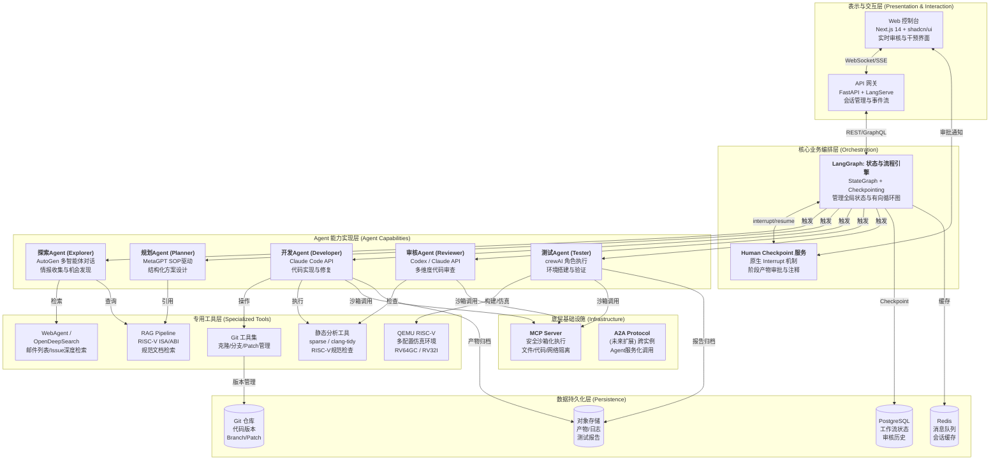
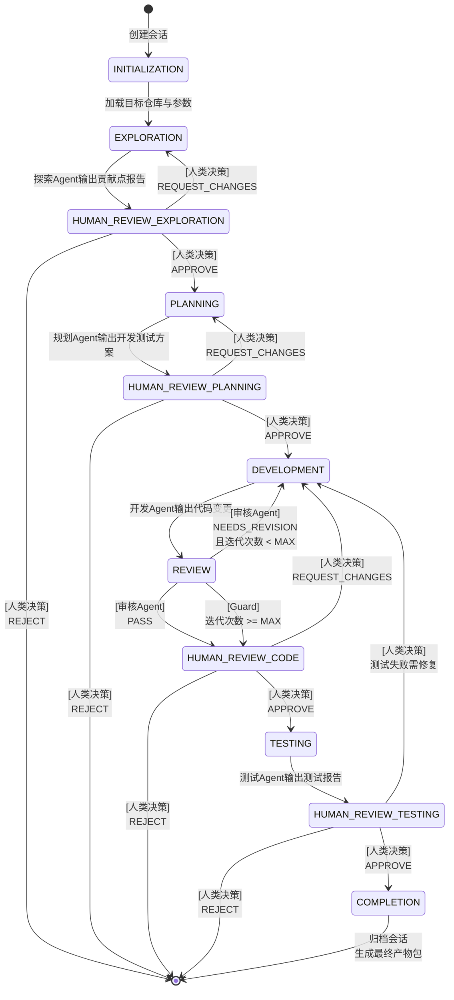
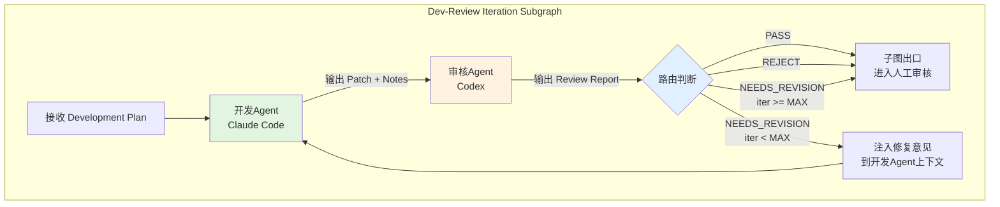
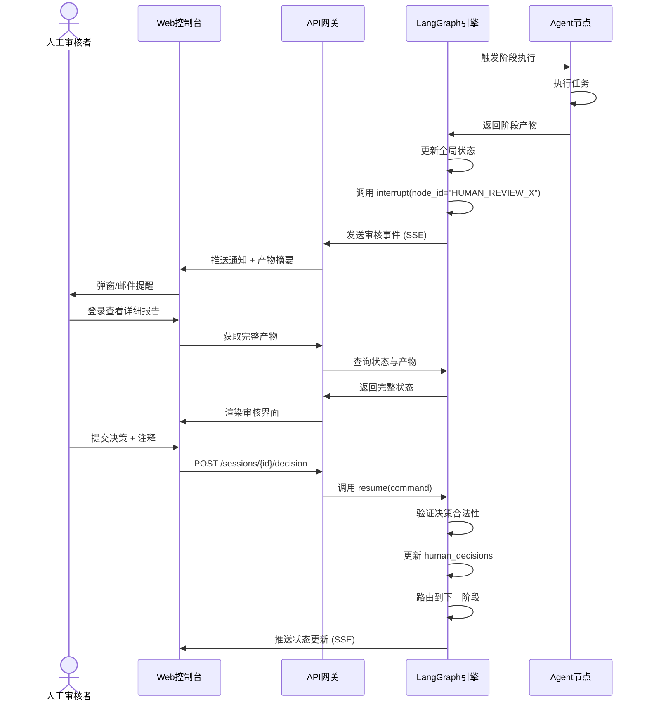
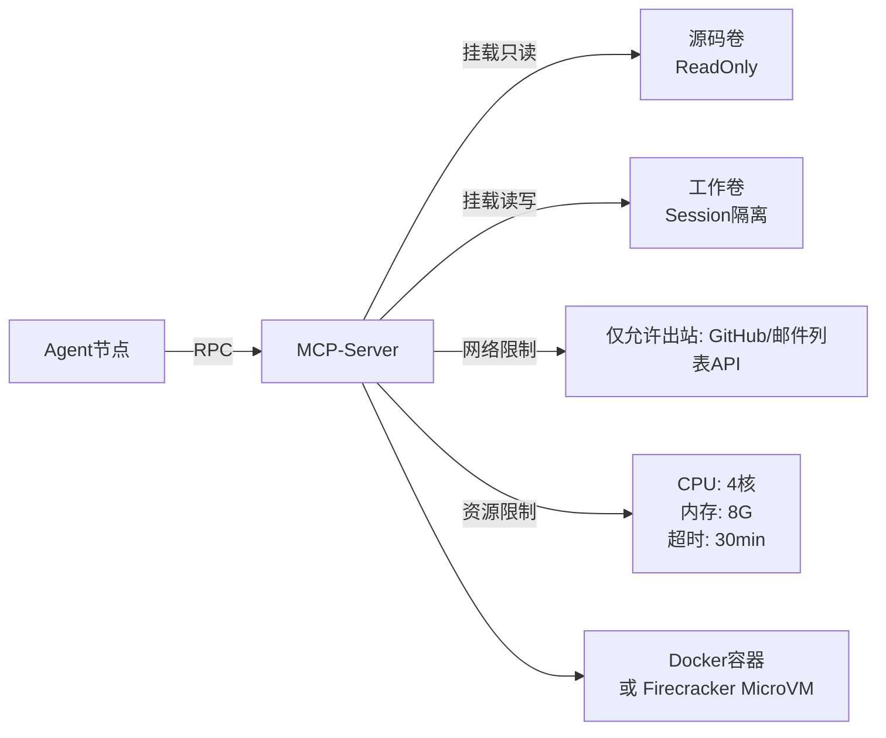

# RV-Insights: 大模型驱动的多Agent RISC-V开源贡献平台

## 详细项目设计方案

**版本**: v1.1  
**日期**: 2026-04-21  
**目标**: 面向 RISC-V 开源软件生态，构建一个由大模型驱动的、人机协作的多Agent贡献平台。平台覆盖从机会发现到测试验证的完整贡献链路，在关键决策节点强制引入人工审核，确保质量与可控性。

---

## 文档地图（Document Map）

本方案由 **1个主方案 + 7个深化专题** 构成，总篇幅约 1000+ 行，覆盖从宏观架构到代码级实现的完整设计空间。

| 文档 | 定位 | 核心内容 |
|------|------|----------|
| **`rv-insights-design.md`** (本文档) | 主方案 / 总纲 | 项目概述、总体架构、Agent节点定义、工作流状态机、人工审核机制、领域知识层、安全基础、数据持久化、扩展路线 |
| `architecture-deep-dive.md` | 架构深化 | 组件交互协议（API/MCP RPC）、非功能性需求（SLO/SLA）、高可用与水平扩展、多租户隔离、缓存策略、K8s部署拓扑 |
| `security-deep-dive.md` | 安全深化 | 零信任网络、Vault密钥管理、沙箱逃逸多层防护（seccomp/AppArmor/Firecracker）、供应链攻击防护、代码审计自动化、GDPR合规 |
| `data-model-deep-dive.md` | 数据深化 | 完整PostgreSQL Schema（含RLS、分区、索引）、Redis数据结构、对象存储规范、SQL DDL、ER图、会话恢复伪代码 |
| `riscv-domain-deep-dive.md` | 领域深化 | RAG知识库分块与嵌入策略、25条RISC-V静态分析规则、社区监控技术方案、多平台测试矩阵（QEMU×ISA×OS）、真实硬件测试池、专用Prompt模板 |
| `ui-design-deep-dive.md` | UI深化 | Web控制台路由与布局、会话详情页、人工审核界面（Monaco Diff查看器）、WebSocket/SSE协议规范、离线断线处理、响应式设计 |
| `llm-engineering-deep-dive.md` | LLM工程深化 | 5个Agent的System Prompt模板、多模型路由策略（Haiku/Sonnet/Opus）、Token预算与配额控制、缓存与去重、幻觉检测、Agent间JSON通信协议 |
| `workflow-deep-dive.md` | 编排深化 | LangGraph 14个节点的伪代码级定义、Edge条件表达式、错误分类与重试策略、并发控制（分布式锁）、会话生命周期管理、子图接口契约 |

**阅读建议**: 先通读本文档建立全局认知，再根据关注维度深入各专题文档。

---

## 1. 项目概述与定位

### 1.1 核心目标

RV-Insights 旨在解决 RISC-V 开源生态中贡献门槛高、领域知识密集、人工验证成本大的痛点。通过编排多个专业化 AI Agent，平台能够：

- **自主发现**: 持续监控 RISC-V 邮件列表、Issue 跟踪器、代码库，识别潜在贡献机会。
- **智能规划**: 将模糊的贡献机会转化为结构化的开发与测试方案。
- **自动实现**: 生成符合社区规范的高质量代码变更。
- **多轮审核**: 在代码生成者与审核者之间进行迭代优化，逼近人类专家水准。
- **环境验证**: 在仿真或真实硬件上执行测试，输出可验证的结果。

### 1.2 核心约束

本系统遵循以下不可违背的设计约束：

1. **人类在环（Human-in-the-Loop）**: 每个主要阶段（探索、规划、开发-审核、测试）完成后必须停顿，等待人类审批后方可进入下一阶段。
2. **迭代收敛**: 开发与审核阶段必须支持多轮迭代，直到审核Agent认定合理或达到最大迭代上限。
3. **可追溯性**: 所有产物（报告、代码、审核意见）必须完整持久化，支持审计与复盘。
4. **安全隔离**: 所有自动化代码执行必须在沙箱环境中进行，禁止直接操作生产基础设施。

### 1.3 设计依据

本方案深度融合了《AI Agent 技术版图研究报告》（`agents.md`）中提出的**分层融合架构建议**：

- 以 **LangGraph** 作为核心编排骨架，管理复杂、有状态的、包含循环和条件分支的全局工作流。
- 以 **AutoGen** 实现探索节点（多智能体头脑风暴发现贡献点）。
- 以 **MetaGPT** 实现规划节点（SOP驱动生成高度结构化的开发测试方案）。
- 以 **crewAI** 实现开发与审核的迭代协作（角色明确的任务执行与审查）。
- 以 **MCP Server** 作为底层基础设施，提供安全的本地代码执行与文件系统访问。

---

## 2. 系统总体架构

### 2.1 架构设计原则

1. **分层解耦**: 表示层、编排层、Agent能力层、工具层、基础设施层严格分离。
2. **状态驱动**: 以 LangGraph 的 `StateGraph` 作为单一事实来源（Single Source of Truth），所有Agent节点通过读写共享状态进行协作。
3. **循环原生支持**: 开发与审核的迭代循环不是外部补丁，而是编排图的一等公民（First-class Citizen）。
4. **人工中断内建**: 人工审核不是外部Webhook，而是LangGraph原生支持的 `interrupt` 机制，确保流程的原子性。

### 2.2 总体架构图



### 2.3 技术选型矩阵

| 层级 | 组件 | 选型 | 选型依据（基于技术版图分析） |
|------|------|------|------------------------|
| 编排核心 | 流程引擎 | **LangGraph** | 唯一原生支持循环的图模型，StateGraph完美契合Agent“思考-行动-观察-再思考”循环；持久化与人工中断机制成熟。 |
| 探索节点 | 应用框架 | **AutoGen** | 探索阶段需要多个不同视角的Agent（代码分析师、社区观察者、规范专家）进行“头脑风暴”，AutoGen的群聊模式最灵活。 |
| 规划节点 | 应用框架 | **MetaGPT** | 规划需要输出高度结构化的产物（开发方案、测试方案、风险评估），MetaGPT的SOP驱动流程可预测、文档质量高。 |
| 开发-审核 | 应用框架 | **crewAI** | 开发与审核是角色明确、步骤清晰的协作任务，crewAI的声明式Task/Agent API最直观，易于实现迭代循环。 |
| 测试节点 | 应用框架 | **crewAI** + 专用Agent | 测试需要严格按测试方案执行，crewAI的顺序任务流适合，同时可内嵌专用硬件仿真Agent。 |
| 信息检索 | 专用Agent | **WebAgent / OpenDeepSearch** | 对RISC-V邮件列表和Issue进行深度网页研究，模拟人类“搜索-阅读-判断”过程。 |
| 代码执行 | 基础设施 | **MCP Server** | 将代码执行与Agent核心解耦，通过RPC方式提供沙箱化、标准化的工具接口，确保安全可控。 |
| 前端 | UI框架 | **Next.js** | 全栈能力，支持Server-Sent Events实现审核状态的实时推送。 |
| 状态存储 | 数据库 | **PostgreSQL** | LangGraph官方推荐的Checkpointer后端，支持复杂状态JSONB存储与查询。 |

> **深化设计**: 系统架构的组件交互协议（REST/gRPC/MCP RPC）、非功能性需求（SLO/SLA）、高可用与水平扩展策略、多租户隔离、缓存策略及Kubernetes部署拓扑详见 `architecture-deep-dive.md`。

---

## 3. Agent 节点详细设计

### 3.1 探索Agent (Explorer)

**核心职责**: 自主扫描 RISC-V 开源生态，结合用户意图，发现、验证并排序潜在贡献机会。

**实现框架**: AutoGen（多智能体对话模式）

**子Agent构成**:
| 子Agent | 角色 | 职责 |
|---------|------|------|
| `MailScanner` | 社区观察者 | 扫描 RISC-V 邮件列表（linux-riscv, qemu-riscv等），识别未解决的痛点、TODO、维护者请求 |
| `IssueMiner` | 数据分析师 | 挖掘 GitHub/GitLab Issue/PR，筛选 `good first issue`、`help wanted`、长期悬而未决的RISC-V相关Bug |
| `CodeAnalyst` | 代码架构师 | 静态分析目标代码库（Linux Kernel, QEMU, GCC等），发现RISC-V相关代码的TODO/FIXME、未实现扩展、优化机会 |
| `FeasibilityJudge` | 可行性评估员 | 综合其他Agent的输出，评估技术可行性、影响范围、工作量，并给出量化评分 |

**输入规格**:
```typescript
interface ExplorationInput {
  session_id: string;
  user_query?: string;           // 用户给定的方向，如"优化RISC-V内存屏障性能"
  target_repos: Repository[];    // 目标仓库列表，如 [{owner: "torvalds", repo: "linux"}]
  exploration_depth: "quick" | "standard" | "deep";
  time_range?: string;           // 扫描时间范围，如 "last_30_days"
}
```

**输出规格**:
```typescript
interface ExplorationResult {
  opportunities: ContributionOpportunity[];
  summary: string;               // 人类可读的总结
  data_sources: string[];        // 所有引用来源
}

interface ContributionOpportunity {
  id: string;
  title: string;
  description: string;
  target_repo: Repository;
  category: "bugfix" | "feature" | "optimization" | "documentation" | "testing";
  feasibility_score: number;     // 0-10，基于静态分析验证
  impact_score: number;          // 0-10，对生态的影响
  estimated_effort: "hours" | "days" | "weeks";
  evidence: Evidence[];          // 支撑证据（邮件链接、Issue链接、代码位置）
  risks: Risk[];                 // 风险列表
  related_specs: string[];       // 相关的RISC-V规范章节
}
```

**自主验证机制**:
探索Agent不能仅基于LLM幻觉输出机会，必须通过以下方式验证：
1. **代码存在性校验**: 通过GitHub API或本地Git操作，确认引用的代码路径、函数、TODO注释真实存在。
2. **交叉验证**: 至少两个子Agent独立发现同一机会，或一个Agent发现另一个Agent通过代码分析确认。
3. **规范引用校验**: 涉及RISC-V ISA扩展的机会，必须能引用到RISC-V官方规范的具体章节（通过RAG检索确认）。

**失败处理**: 如果所有子Agent在限定时间内未发现任何有效机会，返回空结果并附带详细扫描日志，不编造虚假机会。

---

### 3.2 规划Agent (Planner)

**核心职责**: 将人类审核通过的贡献机会，转化为可执行的、高保真的开发与测试方案。

**实现框架**: MetaGPT（SOP驱动工作流）

**SOP流程**:
1. **架构师（Architect）**: 分析目标代码库结构，确定修改范围，绘制变更影响图。
2. **产品经理（Product Manager）**: 将技术需求转化为用户故事与验收标准（即使贡献者是开发者，也需明确“完成定义”）。
3. **项目经理（Project Manager）**: 拆解任务，制定实现步骤（Work Breakdown Structure），识别依赖项与阻塞点。
4. **测试工程师（QA Engineer）**: 设计测试策略，包括单元测试、集成测试、仿真测试、性能基准测试。
5. **技术文档（Tech Writer）**: 输出完整的开发与测试方案文档。

**输入规格**:
```typescript
interface PlanningInput {
  approved_opportunity: ContributionOpportunity;  // 人工审核通过的贡献点
  target_commit: string;                          // 基于哪个commit进行开发
  contributor_profile?: ContributorProfile;       // 贡献者技能画像（可选，用于调整方案难度）
}
```

**输出规格**:
```typescript
interface PlanningResult {
  development_plan: DevelopmentPlan;
  testing_plan: TestingPlan;
  risk_mitigation: RiskMitigationStrategy;
  rollback_plan: RollbackProcedure;
}

interface DevelopmentPlan {
  architecture_changes: string;      // 架构变更描述
  affected_files: AffectedFile[];    // 预期修改的文件列表
  implementation_steps: Step[];      // 编号实现步骤，支持check-off
  dependencies: string[];            // 外部依赖
  estimated_lines_changed: { added: number; removed: number };
}

interface TestingPlan {
  unit_test_strategy: string;
  integration_test_strategy: string;
  emulation_configs: EmulationConfig[];  // QEMU配置列表
  performance_benchmarks?: Benchmark[];
  hardware_test_requirements?: string[]; // 如需真实硬件
  success_criteria: string[];        // 明确的通过标准
}
```

**RISC-V领域增强**:
规划Agent的提示词（Prompt）中必须注入以下领域知识：
- 目标仓库的 `CONTRIBUTING.md` 与代码风格指南
- RISC-V ISA扩展的依赖关系（如某些扩展需要基础指令集的支持）
- RISC-V ABI规范（函数调用约定、结构体布局等）
- 目标子项目的RISC-V特定约定（如Linux内核的 `arch/riscv` 目录组织）

---

### 3.3 开发Agent (Developer)

**核心职责**: 根据规划Agent的方案，在隔离环境中完成代码实现与单元测试编写。

**角色绑定**: Claude Code（通过Anthropic API调用，或集成Claude Code CLI）

**工作环境**:
- 每个会话拥有独立的Git工作目录（通过 `git worktree` 或独立Clone）。
- 代码执行在由 MCP Server 提供的 Docker/Firecracker MicroVM 沙箱中。
- 沙箱内预装目标项目的构建依赖（交叉编译器、QEMU等）。

**输入规格**:
```typescript
interface DevelopmentInput {
  development_plan: DevelopmentPlan;
  workspace_path: string;            // 沙箱内的工作目录
  base_branch: string;               // 基于哪个分支开发
}
```

**执行流程**:
1. **环境准备**: 在沙箱中克隆/检出目标仓库到指定commit，创建特性分支 `rv-insights/<session_id>`。
2. **代码实现**: 按照 `implementation_steps` 依次修改文件。
3. **静态检查**: 每修改一个文件，运行 `sparse`、`clang-tidy`（针对C/C++）或项目自身的Lint工具。
4. **编译验证**: 在沙箱中执行项目构建（如 `make ARCH=riscv`），确保变更不会引入编译错误。
5. **单元测试**: 编写并运行单元测试（若规划方案要求）。
6. **产物打包**: 生成 `git diff` Patch文件，记录实现笔记。

**输出规格**:
```typescript
interface DevelopmentResult {
  patch_content: string;             // 完整的git diff
  branch_name: string;
  implementation_notes: string;      // 实现过程中的决策记录
  build_log: string;                 // 构建日志
  static_analysis_log: string;       // 静态分析结果
  unit_test_results?: TestResult[];
  files_modified: string[];
}
```

**失败处理**:
- 如果编译失败，开发Agent拥有最多3次自修复机会（根据编译错误日志修改代码）。
- 如果3次自修复后仍失败，将当前状态、错误日志和已做尝试报告给人类，请求干预。

---

### 3.4 审核Agent (Reviewer)

**核心职责**: 对开发Agent产出的代码变更进行多维度、结构化的严格审查，输出可执行的修复意见。

**角色绑定**: Codex（或同等代码理解能力的模型）

**审查维度**:
| 维度 | 检查项 | 权重 |
|------|--------|------|
| **功能符合性** | 代码是否准确实现了规划方案中的需求？是否遗漏了任何步骤？ | 高 |
| **RISC-V规范符合性** | 是否正确使用RISC-V指令？是否符合RISC-V ABI？是否考虑了不同扩展的组合？ | 高 |
| **代码质量** | 命名是否清晰？逻辑是否简洁？是否存在重复代码？是否符合目标项目的编码风格？ | 中 |
| **安全性** | 是否存在内存安全漏洞（UAF、越界访问）？是否存在并发问题（竞态条件）？输入是否已校验？ | 高 |
| **性能** | 是否引入了不必要的开销？算法复杂度是否合理？是否考虑了RISC-V的缓存结构？ | 中 |
| **测试覆盖** | 变更是否包含足够的测试？边界条件是否被覆盖？ | 中 |
| **可维护性** | 是否添加了必要的注释？TODO/FIXME是否合理且有追踪？ | 低 |

**输入规格**:
```typescript
interface ReviewInput {
  development_result: DevelopmentResult;
  development_plan: DevelopmentPlan; // 作为验收基准
  target_repo: Repository;
  iteration_count: number;           // 当前迭代次数
}
```

**输出规格**:
```typescript
interface ReviewResult {
  overall_verdict: "PASS" | "NEEDS_REVISION" | "REJECT";
  confidence_score: number;          // 审核Agent对自身判断的确信度 0-1
  confidence_breakdown?: ConfidenceBreakdown; // 各维度置信度细项
  issues: ReviewIssue[];
  positive_feedback: string[];       // 优点列表，用于强化学习
  summary: string;                   // 人工可读的总结
}

interface ReviewIssue {
  id: string;
  severity: "CRITICAL" | "HIGH" | "MEDIUM" | "LOW";
  category: "functional" | "riscv_spec" | "security" | "performance" | "style" | "testing";
  file_path: string;
  line_start?: number;
  line_end?: number;
  description: string;               // 问题描述
  suggestion: string;                // 具体的修复建议（尽可能包含代码片段）
  blocking: boolean;                 // 是否阻塞通过
}
```

**通过标准**:
- `overall_verdict == "PASS"` 且不存在任何 `blocking == true` 的Issue。
- 或 `iteration_count >= MAX_ITERATIONS`（如5次），此时强制转交人工审核。

---

### 3.5 测试Agent (Tester)

**核心职责**: 根据规划Agent的测试方案，搭建环境并执行全面的验证，输出可信的测试报告。

**实现框架**: crewAI（角色执行模式）

**子Agent构成**:
| 子Agent | 角色 | 职责 |
|---------|------|------|
| `EnvSetupEngineer` | 环境工程师 | 根据测试方案配置QEMU、编译工具链、准备根文件系统 |
| `UnitTestRunner` | 单元测试执行员 | 运行所有单元测试，收集结果 |
| `IntegrationTestRunner` | 集成测试执行员 | 在QEMU中启动系统，执行集成测试用例 |
| `PerformanceAnalyst` | 性能分析师 | 运行基准测试，对比变更前后的性能指标 |
| `ReportCompiler` | 报告编译员 | 汇总所有结果，生成标准化测试报告 |

**输入规格**:
```typescript
interface TestingInput {
  testing_plan: TestingPlan;
  approved_code: DevelopmentResult;  // 人工审核通过的代码
  workspace_path: string;
}
```

**输出规格**:
```typescript
interface TestingResult {
  environment_setup_log: string;     // 环境搭建详细记录
  unit_test_results: TestSuiteResult;
  integration_test_results: TestSuiteResult;
  emulation_results: EmulationResult[]; // 不同QEMU配置的结果
  performance_report?: PerformanceReport;
  coverage_report?: CoverageReport;
  overall_status: "PASS" | "FAIL" | "PARTIAL";
  conclusion: string;                // 测试结论与建议
  artifacts: string[];               // 指向对象存储的产物链接（日志、截图等）
}

interface TestSuiteResult {
  total: number;
  passed: number;
  failed: number;
  skipped: number;
  failures: TestFailure[];
}
```

**环境管理**:
- 使用预构建的Docker镜像作为QEMU RISC-V环境的基础，减少环境搭建时间。
- 支持多种RISC-V配置：RV64GC、RV32I、带/不带特定扩展（如V扩展、H扩展）。
- 测试超时机制：单个测试用例超时自动标记为FAIL，防止死锁拖垮系统。

> **深化设计**:  
> - 5个Agent的完整System Prompt模板、多模型路由策略（Haiku/Sonnet/Opus）、Token预算控制、缓存与去重、幻觉检测及Agent间JSON通信协议详见 `llm-engineering-deep-dive.md`。  
> - RISC-V专用RAG知识库分块策略、25条静态分析规则、社区监控技术方案、多平台测试矩阵（QEMU×ISA×OS）、真实硬件测试池及专用Prompt模板详见 `riscv-domain-deep-dive.md`。

---

## 4. 工作流与状态机设计

### 4.1 全局工作流状态机

全局工作流由 LangGraph 的 `StateGraph` 定义。状态机在以下节点之间流转，人工审核节点作为不可自动跳过的 `interrupt` 点。



### 4.2 LangGraph 状态定义

```typescript
interface RVInsightsState {
  // 会话元数据
  session_id: string;
  created_at: string;
  current_stage: Stage;
  status: "running" | "interrupted" | "completed" | "failed";

  // 各阶段产物（nullable表示尚未到达该阶段）
  exploration_result?: ExplorationResult;
  planning_result?: PlanningResult;
  development_result?: DevelopmentResult;
  review_result?: ReviewResult;
  testing_result?: TestingResult;

  // 迭代控制
  dev_review_iteration_count: number;
  max_dev_review_iterations: number;  // 默认 5

  // 人工审核记录
  human_decisions: HumanDecision[];
  human_notes: string[];

  // 审计与追踪
  agent_logs: AgentLog[];             // 每个Agent的详细执行日志
  timestamps: StageTimestamp[];       // 各阶段进入/退出时间
}

type Stage = 
  | "INITIALIZATION" 
  | "EXPLORATION" 
  | "HUMAN_REVIEW_EXPLORATION"
  | "PLANNING"
  | "HUMAN_REVIEW_PLANNING"
  | "DEVELOPMENT"
  | "REVIEW"
  | "HUMAN_REVIEW_CODE"
  | "TESTING"
  | "HUMAN_REVIEW_TESTING"
  | "COMPLETION";

interface HumanDecision {
  stage: Stage;
  decision: "APPROVE" | "REJECT" | "REQUEST_CHANGES" | "ADD_NOTES";
  decided_by: string;               // 用户ID
  timestamp: string;
  comment?: string;
}
```

### 4.3 开发-审核迭代子图（内部循环）

开发-审核循环是系统中最复杂的子图，作为LangGraph的一个子图（Subgraph）嵌入全局图。其内部状态继承全局状态，但拥有独立的局部迭代计数器。



**关键设计点**:
1. **上下文保持**: 开发Agent在每次迭代中不仅接收审核意见，还接收之前所有迭代的代码变更历史，确保修复不会回退已解决的问题。
2. **增量审核**: 审核Agent在后续迭代中只需关注变更部分（`git diff` 与上一版本的diff），而非完整代码库，减少Token消耗和幻觉。
3. **强制退出**: 达到 `MAX_ITERATIONS` 时，无论审核Agent verdict 如何，强制退出循环并将所有历史审核报告一并提交人类，由人类做最终裁决。

> **深化设计**: LangGraph 14个节点的伪代码级定义、Edge条件表达式、错误分类与指数退避重试、死信队列、并发控制（分布式锁与资源配额）、会话生命周期管理（超时/优雅终止/孤儿检测）及子图接口契约详见 `workflow-deep-dive.md`。

---

## 5. 人工审核集成设计

### 5.1 审核交互流程

人工审核不是被动等待，而是系统工作流的原生组成部分。



### 5.2 人工审核界面规格

对于每个审核阶段，Web控制台必须展示：

| 信息类别 | 内容 | 交互 |
|----------|------|------|
| **上下文摘要** | 当前阶段名称、前置阶段结果摘要、已耗时 | 只读 |
| **完整产物** | 根据阶段不同展示：贡献点报告 / 开发方案 / 代码Diff / 审核报告 / 测试报告 | 可展开、可搜索、语法高亮 |
| **Agent执行日志** | 该Agent的详细思考过程与工具调用链 | 可折叠的时间线 |
| **决策面板** | APPROVE / REJECT / REQUEST_CHANGES / ADD_NOTES | 按钮组 |
| **注释输入** | 多行文本框，支持Markdown | 当选择REQUEST_CHANGES或ADD_NOTES时必填 |
| **历史决策** | 本会话所有过往的人工决策记录 | 只读时间线 |

### 5.3 决策语义

- **APPROVE**: 完全接受当前产物，工作流进入下一阶段。
- **REJECT**: 终止整个会话，已产生的所有代码变更将被丢弃（或归档到 `rejected/` 命名空间），释放资源。
- **REQUEST_CHANGES**: 不接受当前产物，将注释返回给当前阶段的Agent，要求重做或修改。
- **ADD_NOTES**: 接受当前产物并进入下一阶段，但附带注释供后续Agent参考（如“测试阶段请重点关注内存泄漏”）。

> **深化设计**: Web控制台路由与权限矩阵、会话详情页（阶段时间线+实时日志流）、人工审核核心界面（Monaco Diff查看器+内联注释+四按钮决策工作流）、WebSocket/SSE实时通信协议规范（含8种事件类型JSON Schema）、离线断线处理及响应式设计详见 `ui-design-deep-dive.md`。

---

## 6. 领域知识层（RISC-V 专用基础设施）

RISC-V 贡献平台与其他通用代码生成平台的核心差异在于领域知识的深度注入。必须构建专用的 RISC-V 知识层，而非仅依赖基础模型的预训练知识。

### 6.1 RISC-V RAG 知识库

构建向量数据库，索引以下内容：

| 知识类别 | 来源 | 更新频率 | 用途 |
|----------|------|----------|------|
| RISC-V ISA 规范 | riscv-isa-manual (GitHub) | 每月 | 审核Agent检查指令使用合法性 |
| RISC-V ABI 规范 | riscv-elf-psabi-doc | 每月 | 检查函数调用约定、结构体布局 |
| Linux RISC-V Porting | arch/riscv 目录下的Documentation | 每周 | 开发Agent遵循内核约定 |
| 目标项目贡献指南 | CONTRIBUTING.md, CodingStyle | 每周 | 确保代码风格符合社区要求 |
| 历史优质Patch | 已合并的RISC-V相关Patch | 实时 | 作为Few-shot示例注入开发Agent |

### 6.2 RISC-V 静态分析规则集

为标准静态分析工具补充RISC-V特定规则：

```yaml
# 示例：RISC-V专用检查规则
rules:
  - id: riscv-atomic-missing-fence
    pattern: "<atomic_op> without subsequent __asm__ volatile(\"fence ...\")"
    severity: HIGH
    message: "RISC-V弱内存模型下，原子操作后可能缺少必要的内存屏障"
  
  - id: riscv-misaligned-access
    pattern: "*(uint64_t*)ptr where ptr is not 8-byte aligned"
    severity: CRITICAL
    message: "部分RISC-V实现不支持非对齐访问，可能导致SIGBUS"
  
  - id: riscv-deprecated-insn
    pattern: "csrrw x0, ..."
    replacement: "csrw ..."
    severity: MEDIUM
    message: "使用推荐的CSR指令别名"
```

> **深化设计**: RAG知识库分层分块策略（6类知识源×不同粒度）、嵌入模型混合部署（本地bge+OpenAI text-embedding-3-large）、三阶段检索（BM25+向量+Cohere Rerank）、25条完整静态分析规则（semgrep/clang-tidy/sparse）、邮件列表/GitHub监控技术方案、多平台测试矩阵（QEMU×ISA×OS）、真实硬件测试池（VisionFive2/HiFive/Milk-V）及专用Prompt模板详见 `riscv-domain-deep-dive.md`。

---

## 7. 安全与隔离设计

### 7.1 沙箱化执行策略

所有Agent的代码执行操作必须通过 MCP-Server 提供的隔离接口完成：



### 7.2 代码安全审查流水线

审核Agent之外，系统级安全扫描必须运行：
1. **Secret扫描**: 确保Patch中无硬编码API密钥、私钥、密码。
2. **依赖扫描**: 若引入新依赖，检查已知CVE。
3. **行为分析**: 在沙箱中运行测试时，监控系统调用（strace），检测异常行为（如尝试访问 `/etc/passwd`、建立反向shell连接）。

### 7.3 人工安全闸口

即使在自动化审核通过后，以下变更必须附带显式安全警告供人类特别注意：
- 修改了与权限、认证相关的代码
- 引入了新的外部依赖
- 包含内联汇编（尤其是不熟悉的指令序列）
- 修改了构建系统（Makefile、Kconfig等）

> **深化设计**: 零信任网络架构（Istio mTLS + Envoy Gateway JWT/OIDC）、HashiCorp Vault密钥生命周期管理、沙箱四层纵深防御（seccomp-bpf/AppArmor/Firecracker）、供应链攻击防护（SBOM+Cosign+Kyverno）、代码安全审计自动化（含RISC-V专用Semgrep规则）、GDPR合规与审计日志不可篡改存储（S3 WORM+区块链锚定）及应急响应Playbook详见 `security-deep-dive.md`。

---

## 8. 数据持久化与可观测性

### 8.1 状态持久化策略

LangGraph 的 `Checkpointer` 使用 PostgreSQL 实现持久化：

```sql
-- 核心状态表（由LangGraph管理）
CREATE TABLE checkpoints (
    thread_id UUID NOT NULL,       -- 与 session_id 同值，LangGraph 分区键
    checkpoint_ns TEXT NOT NULL,
    checkpoint_id TEXT NOT NULL,
    parent_checkpoint_id TEXT,
    type TEXT,
    checkpoint JSONB NOT NULL,     -- 完整的RVInsightsState
    metadata JSONB,
    PRIMARY KEY (thread_id, checkpoint_ns, checkpoint_id)
);

-- 人工审核记录表（应用层管理）
CREATE TABLE human_decisions (
    id UUID PRIMARY KEY DEFAULT gen_random_uuid(),
    session_id TEXT REFERENCES checkpoints(thread_id),
    stage TEXT NOT NULL,
    decision TEXT NOT NULL CHECK (decision IN ('APPROVE','REJECT','REQUEST_CHANGES','ADD_NOTES')),
    comment TEXT,
    decided_by TEXT NOT NULL,
    created_at TIMESTAMPTZ DEFAULT NOW()
);
```

### 8.2 会话恢复机制

系统崩溃或重启后：
1. 读取 PostgreSQL 中所有 `status == "interrupted"` 的会话。
2. 根据 `current_stage` 判断中断点。
3. 若中断于人工审核节点，恢复WebSocket连接，等待人类继续决策。
4. 若中断于Agent执行中，从上一个 `checkpoint` 重放该节点。

### 8.3 可观测性架构

| 层级 | 工具 | 监控内容 |
|------|------|----------|
| Agent | LangSmith / Langfuse | LLM调用链、Token消耗、延迟、幻觉检测 |
| 系统 | Prometheus + Grafana | 会话数量、阶段耗时、队列深度、错误率 |
| 日志 | Loki / ELK | Agent执行日志、沙箱输出、API访问日志 |
| 产物 | MinIO/S3 + 索引 | Patch文件、测试报告、构建产物 |

> **深化设计**: 完整PostgreSQL Schema（含分区、RLS、BRIN/GIN索引）、Redis 8种数据结构（Hash/Stream/分布式锁/布隆过滤器）、对象存储组织规范、可直接执行的SQL DDL脚本、ER关系图及会话恢复伪代码详见 `data-model-deep-dive.md`。

---

## 9. 扩展性与演进路线

### 9.1 Agent 注册表（Agent Registry）

未来支持新的RISC-V子项目时，无需修改核心编排代码，通过注册表声明式添加Agent：

```yaml
# agents/optee-riscv.yaml
agent_id: optee-riscv-explorer
base_framework: autogen
specialization: trusted_execution
knowledge_bases:
  - optee-documentation
  - riscv-smccc-spec
tools:
  - web_search
  - github_api
  - static_analyzer:optee
```

### 9.2 A2A 协议扩展

未来平台可部署为多个实例（如专注于Linux内核的实例、专注于QEMU的实例），实例间通过 **A2A (Agent-to-Agent) 协议** 协作：
- 当探索Agent发现的机会涉及多个子项目时，可将任务拆分为子任务，通过A2A分发给其他实例的Agent。
- 审核Agent可调用外部安全审计服务的Agent进行专项审查。

### 9.3 演进路线图

| 阶段 | 目标 | 关键特性 |
|------|------|----------|
| **MVP** (1-2月) | 单仓库支持 | 支持Linux Kernel `arch/riscv`，完成探索→规划→开发→审核→测试的端到端通路 |
| **v1.0** (3-4月) | 多仓库扩展 | 支持QEMU、OpenSBI；引入RAG知识库；完善人工审核UI |
| **v1.5** (5-6月) | 质量提升 | 引入审核-开发强化学习微调（RLHF）；支持真实RISC-V硬件测试池 |
| **v2.0** (7-12月) | 生态网络 | 支持A2A跨实例协作；开放Agent Registry供社区贡献新Agent |

---

## 10. 附录

### 附录A: 术语表

| 术语 | 定义 |
|------|------|
| **LangGraph** | 由LangChain团队开发的、用于构建有状态多Agent应用的图模型编排框架，原生支持循环。 |
| **MCP** | Model Context Protocol，Anthropic提出的开放协议，用于标准化AI模型与外部数据源、工具的连接。 |
| **AutoGen** | Microsoft开发的Multi-Agent对话框架，支持Agent间通过自然语言协作。 |
| **MetaGPT** | 基于SOP（标准作业程序）的多Agent框架，将软件公司角色映射为Agent。 |
| **crewAI** | 角色扮演驱动的多Agent框架，通过Task和Agent抽象实现团队式任务执行。 |
| **RAG** | Retrieval-Augmented Generation，检索增强生成，通过外部知识库减少LLM幻觉。 |
| **Checkpoint** | LangGraph的持久化机制，允许在工作流任意节点保存和恢复状态。 |

### 附录B: 关键架构图索引

1. **总体架构图**: 第2.2节 — 展示五层融合架构（表示层、编排层、Agent层、工具层、基础设施层）。
2. **全局状态机图**: 第4.1节 — 展示从探索到完成的完整状态流转及人工审核决策分支。
3. **开发-审核迭代子图**: 第4.3节 — 展示LangGraph子图内部的迭代循环机制。
4. **人工审核序列图**: 第5.1节 — 展示从Agent完成到人类决策再到工作流恢复的完整交互链。
5. **沙箱隔离图**: 第7.1节 — 展示MCP-Server如何为Agent提供安全的执行环境。

### 附录C: 风险与缓解

| 风险 | 可能性 | 影响 | 缓解措施 |
|------|--------|------|----------|
| LLM生成不符合RISC-V规范的代码 | 中 | 高 | 审核Agent增加RISC-V规范维度；引入RAG知识库；强制人工审核 |
| 沙箱逃逸 | 低 | 极高 | 使用Firecracker MicroVM（VM级隔离而非容器级）；最小权限原则；禁用网络出站（除白名单外） |
| 无限迭代循环 | 中 | 中 | 设置MAX_ITERATIONS硬上限；迭代成本监控；达到上限强制人工介入 |
| 代码库并发冲突 | 中 | 中 | 每个会话独立Git worktree；基于特定commit开发；不直接操作主分支 |
| API成本失控 | 中 | 低 | Token使用量监控与告警；探索阶段设置深度限制；缓存常见查询结果 |
