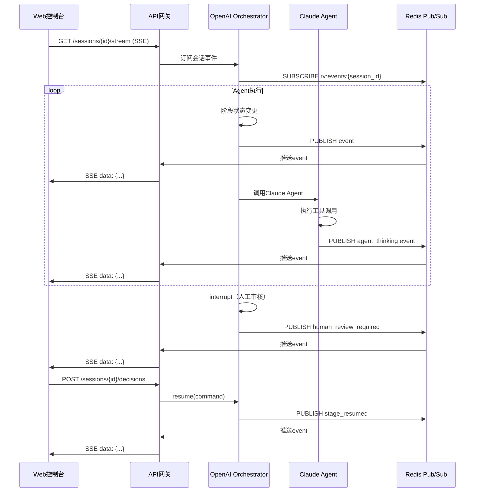
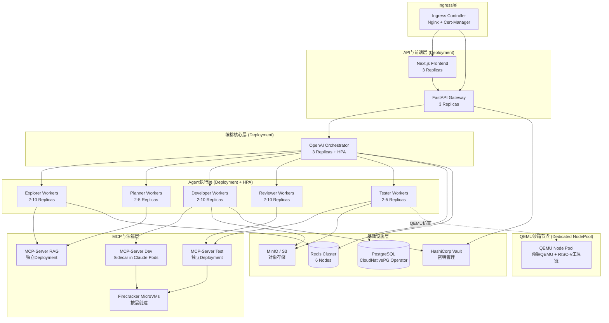
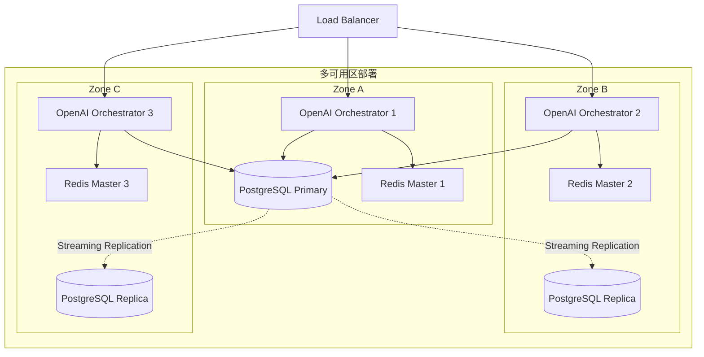
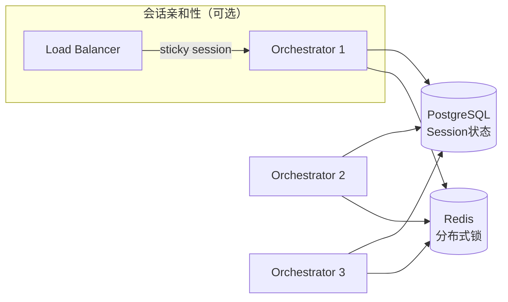
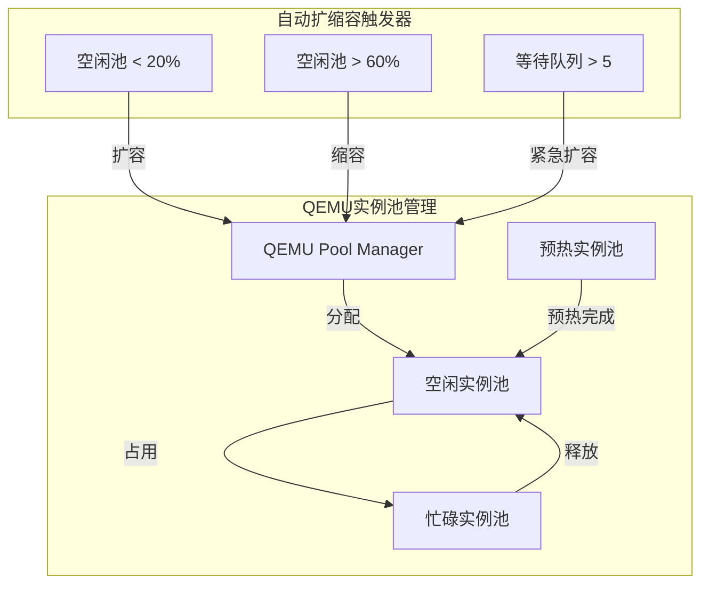
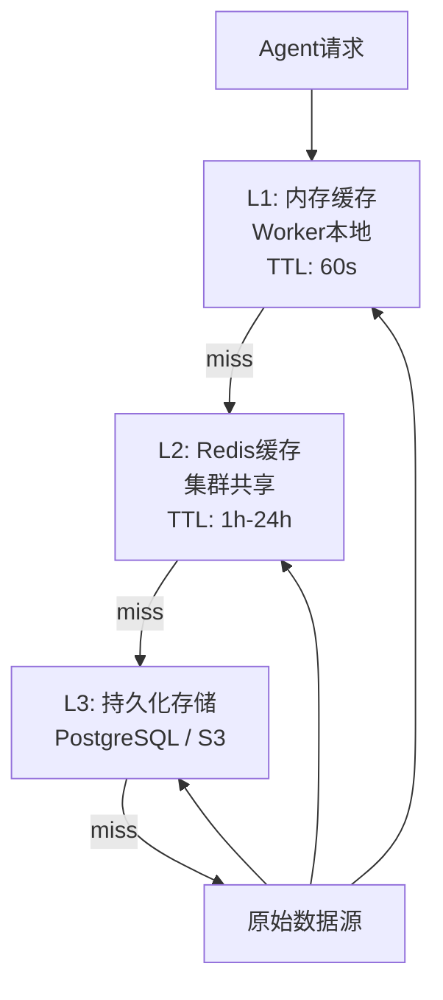

# RV-Insights v2: 系统架构与非功能性需求深化设计

**版本**: v2.0
**日期**: 2026-04-23
**定位**: 本文档是 `rv-insights-v2-design.md` 第3章（系统总体架构）的细化与扩展，覆盖组件交互协议、K8s部署拓扑、非功能性需求、多租户隔离、水平扩展策略及v1到v2的部署变更。

---

## 1. 组件交互协议

### 1.1 API 网关（FastAPI）与 OpenAI Orchestrator 的交互

API 网关作为所有外部流量的唯一入口，与 OpenAI Orchestrator 通过内部 REST + SSE 双协议通信。OpenAI Orchestrator 作为编排核心，暴露标准化的会话管理端点。

**REST 端点规范**

| 方法 | 路径 | 请求体 | 响应体 | 说明 |
|------|------|--------|--------|------|
| `POST` | `/api/v2/sessions` | `CreateSessionRequest` | `SessionSummary` | 创建新会话，触发 OpenAI Orchestrator 初始化 |
| `GET`  | `/api/v2/sessions/{id}` | - | `SessionDetail` | 查询会话完整状态与产物 |
| `POST` | `/api/v2/sessions/{id}/decisions` | `HumanDecisionRequest` | `SessionSummary` | 提交人工审核决策，调用 OpenAI SDK `session.resume()` |
| `GET`  | `/api/v2/sessions/{id}/stream` | - | `SSE: WorkflowEvent` | 实时推送阶段状态、Agent日志、审核通知 |
| `POST` | `/api/v2/sessions/{id}/cancel` | - | `SessionSummary` | 取消会话，触发优雅终止并释放资源 |
| `GET`  | `/api/v2/agents/health` | - | `AgentsHealthReport` | 各Agent后端健康检查（OpenAI + Claude） |
| `GET`  | `/api/v2/sessions/{id}/artifacts/{name}` | - | `ArtifactDownload` | 下载产物（Patch、测试报告、截图） |

**请求/响应格式（OpenAPI 3.1）**

```yaml
components:
  schemas:
    CreateSessionRequest:
      type: object
      required: [tenant_id, target_repos]
      properties:
        tenant_id:
          type: string
          description: 多租户隔离标识
        user_query:
          type: string
          description: 用户给定的贡献方向（可选）
        target_repos:
          type: array
          items:
            type: object
            properties:
              owner: { type: string }
              repo: { type: string }
              base_commit: { type: string }
        exploration_depth:
          type: string
          enum: [quick, standard, deep]
          default: standard
        max_budget_usd:
          type: number
          description: 会话Token预算上限（美元等值）
          default: 5.0
        preferred_sdk:
          type: string
          enum: [auto, openai, claude]
          default: auto
          description: 强制使用指定SDK（调试用）

    HumanDecisionRequest:
      type: object
      required: [stage, decision]
      properties:
        stage:
          type: string
          enum: [EXPLORATION, PLANNING, CODE, TESTING]
        decision:
          type: string
          enum: [APPROVE, REJECT, REQUEST_CHANGES, ADD_NOTES]
        comment:
          type: string
          description: Markdown格式注释

    WorkflowEvent:
      type: object
      required: [event_type, session_id, timestamp]
      properties:
        event_type:
          type: string
          enum:
            - stage_started
            - agent_thinking
            - human_review_required
            - stage_completed
            - error_occurred
            - token_consumed
            - heartbeat
            - sdk_handoff          # v2新增：SDK间切换事件
            - sandbox_created      # v2新增：沙箱创建事件
            - sandbox_destroyed    # v2新增：沙箱销毁事件
        session_id: { type: string }
        stage: { type: string }
        sdk_source:               # v2新增：产生事件的SDK
          type: string
          enum: [openai, claude]
        payload: { type: object }
        timestamp: { type: string, format: date-time }
```

**SSE 推送协议**

```http
GET /api/v2/sessions/{id}/stream HTTP/1.1
Accept: text/event-stream
Authorization: Bearer <JWT>

HTTP/1.1 200 OK
Content-Type: text/event-stream
Cache-Control: no-cache
Connection: keep-alive

event: stage_started
data: {"stage":"EXPLORATION","sdk_source":"openai","timestamp":"2026-04-23T10:00:00Z"}

event: agent_thinking
data: {"agent":"Explorer","sdk_source":"openai","message":"Scanning linux-riscv mailing list...","timestamp":"..."}

event: sdk_handoff
data: {"from":"openai","to":"claude","reason":"feasibility_judge","timestamp":"..."}

event: human_review_required
data: {"stage":"EXPLORATION","artifact_url":"/artifacts/exploration_report.json","summary":"Found 3 opportunities"}
```

### 1.2 OpenAI Orchestrator 与 Claude Agent 的交互协议

当 OpenAI Orchestrator 需要调用 Claude Agent（如规划阶段的 Planner、开发阶段的 Developer、探索阶段的 FeasibilityJudge）时，采用 **HTTP API + MCP 双通道** 混合协议。

**协议选择矩阵**

| 场景 | 协议 | 理由 |
|------|------|------|
| 单次深度推理（规划、可行性判断） | Claude HTTP API (`/v1/messages`) | 简单、无状态、延迟低；Claude SDK 提供标准客户端 |
| 多轮工具调用（开发、Computer Use） | Claude Agent SDK + MCP | 需要原生工具循环、状态保持、Computer Use 能力 |
| 跨 SDK 状态同步 | PostgreSQL + Redis | 两套 SDK 共享状态存储，无需实时 RPC |

**OpenAI → Claude 调用流程**

```
OpenAI Orchestrator
    ├── 需要调用 Claude Agent（如 Planner）
    ├── 从 PostgreSQL 读取当前 session 状态
    ├── 构造 Claude API 请求（包含上下文、工具列表）
    ├── 调用 Claude HTTP API /v1/messages
    ├── 接收 Claude 响应（文本 + tool_use）
    ├── 如需工具调用，通过 MCP Server 代理执行
    └── 将结果写回 PostgreSQL，更新 OpenAI Session 状态
```

**Claude Agent 调用契约**

```python
class ClaudeAgentExecutor:
    """封装 Claude Agent SDK 调用，供 OpenAI Orchestrator 使用。"""

    async def invoke(
        self,
        agent_role: Literal["planner", "developer", "feasibility_judge", "failure_analyzer"],
        session_id: str,
        input_context: Dict[str, Any],
        mcp_tools: List[MCPTool],
        timeout_seconds: int = 600,
    ) -> ClaudeAgentResult:
        """
        调用 Claude Agent 执行深度任务。

        Args:
            agent_role: 预定义的Claude Agent角色
            session_id: 关联的RV-Insights会话ID
            input_context: 包含用户请求、历史状态、产物引用
            mcp_tools: 该Agent可用的MCP工具列表
            timeout_seconds: 最大执行时间

        Returns:
            ClaudeAgentResult: 包含输出内容、工具调用历史、Token消耗

        Raises:
            ClaudeTimeoutError: 执行超时
            ClaudeRateLimitError: API限流，需指数退避重试
            ClaudeContentFilteredError: 内容被安全过滤器拦截
        """
        ...
```

**消息信封格式（跨SDK内部通信）**

```json
{
  "message_id": "msg_01J8XQ3R9K2L",
  "correlation_id": "sess_abc123_dev_review_iter_2",
  "sdk_source": "claude",
  "sdk_target": "openai",
  "agent_role": "planner",
  "session_id": "sess_abc123",
  "payload_type": "PlanResult",
  "payload": { ... },
  "reasoning_log": "自然语言推理过程，供人类审计",
  "token_usage": {
    "claude_input_tokens": 45234,
    "claude_output_tokens": 8921,
    "claude_cache_creation_tokens": 12000,
    "claude_cache_read_tokens": 34000
  },
  "tool_calls": [
    {"tool": "bash", "input": "git log --oneline -20", "output": "..."}
  ],
  "timestamp": "2026-04-23T10:15:32Z"
}
```

### 1.3 MCP-Server 部署拓扑

MCP-Server 作为两套 SDK 的共用工具层，采用 **Sidecar + 独立服务混合部署** 模式。

**部署拓扑决策**

| 组件 | 部署模式 | 理由 |
|------|----------|------|
| MCP-Server (Dev) | Sidecar（每个 Claude Agent Pod） | 开发Agent需要低延迟的文件系统访问；Unix Socket共享避免网络开销 |
| MCP-Server (Test) | 独立 Service | 测试Agent通过 OpenAI 原生沙箱调用，MCP仅提供辅助工具（RAG、静态分析），可独立扩缩容 |
| MCP-Server (RAG) | 独立 Service | RAG查询是读密集型，独立部署可单独缓存和扩展 |

**双SDK共用 MCP Server 机制**

```mermaid
graph TB
    subgraph "OpenAI Agent Pod"
        OA[OpenAI Agent Worker]
        OA -->|HTTP| MCP_TEST[MCP-Server Test<br/>localhost:8081]
        OA -->|HTTP| MCP_RAG[MCP-Server RAG<br/>mcp-rag:8082]
    end

    subgraph "Claude Agent Pod"
        CA[Claude Agent Worker]
        MCP_DEV[MCP-Server Dev<br/>Sidecar localhost:8080]
        CA -->|Unix Socket| MCP_DEV
        MCP_DEV -->|HostPath| GIT_CACHE[/cache/git]
        MCP_DEV -->|HostPath| CCACHE[/cache/ccache]
    end

    subgraph "共享服务层"
        MCP_RAG_SVC[MCP-Server RAG Service]
        PG_RAG[(PostgreSQL pgvector)]
        MCP_RAG_SVC --> PG_RAG
    end

    MCP_TEST -->|HTTP| MCP_RAG_SVC
    MCP_DEV -->|HTTP| MCP_RAG_SVC
```

**MCP Server RPC 接口规范（v2 扩展）**

在 v1 基础上增加双SDK适配层：

| 方法 | 参数 | 返回值 | 说明 |
|------|------|--------|------|
| `tools/list` | `sdk_type: "openai" \| "claude"` | `List[Tool]` | 根据SDK类型返回适配的工具Schema |
| `tools/call` | `tool_name, arguments, session_id, sdk_type` | `ToolResult` | 执行工具，返回格式自动适配目标SDK |
| `sandbox/create` | `session_id, image, resources, provider` | `SandboxInfo` | 创建隔离沙箱（支持OpenAI原生沙箱或Firecracker） |
| `sandbox/destroy` | `session_id, force` | `bool` | 销毁会话沙箱 |
| `rag/query` | `session_id, query, filters, top_k` | `RAGResult` | v2新增：统一RAG查询接口 |
| `git/clone` | `session_id, repo_url, reference_cache` | `GitCloneResult` | v2新增：带缓存引用的Git克隆 |
| `static/analyze` | `session_id, file_path, ruleset` | `AnalysisResult` | v2新增：RISC-V静态分析 |

### 1.4 事件流协议：SSE vs WebSocket

v2 采用 **SSE（Server-Sent Events）为主、WebSocket为辅** 的混合事件流策略。

**选择理由**

| 维度 | SSE | WebSocket | v2 决策 |
|------|-----|-----------|---------|
| 方向 | 单向（服务器→客户端） | 双向 | Agent日志是单向推送，SSE足够 |
| 协议复杂度 | 低（基于HTTP） | 高（需升级握手） | SSE更易穿透防火墙/代理 |
| 自动重连 | 原生支持（EventSource） | 需手动实现 | SSE断线重连更简单 |
| 二进制数据 | 需Base64编码 | 原生支持 | 产物下载走独立HTTP端点 |
| 实时双向交互 | 不支持 | 支持 | 人工审核决策走REST POST，无需双向 |
| 心跳机制 | 原生（注释行） | 需手动ping/pong | SSE心跳更简单 |

**v2 事件流架构**



**Redis Pub/Sub 频道设计**

```
rv:events:{session_id}     # 会话级事件流（所有Agent事件）
rv:events:global          # 全局事件（系统告警、维护通知）
rv:events:tenant:{id}     # 租户级事件（配额告警）
```

---

## 2. K8s 部署拓扑

### 2.1 整体部署架构图



### 2.2 OpenAI Agents SDK 服务的 Deployment/Service/HPA 配置

```yaml
# OpenAI Orchestrator Deployment
apiVersion: apps/v1
kind: Deployment
metadata:
  name: openai-orchestrator
  namespace: rv-insights
spec:
  replicas: 3
  selector:
    matchLabels:
      app: openai-orchestrator
  template:
    metadata:
      labels:
        app: openai-orchestrator
    spec:
      containers:
        - name: orchestrator
          image: rv-insights/openai-orchestrator:v2.0
          ports:
            - containerPort: 8000
              name: http
          env:
            - name: DATABASE_URL
              valueFrom:
                secretKeyRef:
                  name: db-secret
                  key: url
            - name: REDIS_URL
              valueFrom:
                secretKeyRef:
                  name: redis-secret
                  key: url
            - name: OPENAI_API_KEY
              valueFrom:
                secretKeyRef:
                  name: openai-secret
                  key: api-key
            - name: ANTHROPIC_API_KEY
              valueFrom:
                secretKeyRef:
                  name: anthropic-secret
                  key: api-key
            - name: S3_ENDPOINT
              valueFrom:
                configMapKeyRef:
                  name: rv-insights-config
                  key: s3-endpoint
          resources:
            requests:
              cpu: "1"
              memory: "2Gi"
            limits:
              cpu: "2"
              memory: "4Gi"
          livenessProbe:
            httpGet:
              path: /health
              port: 8000
            initialDelaySeconds: 30
            periodSeconds: 10
          readinessProbe:
            httpGet:
              path: /ready
              port: 8000
            initialDelaySeconds: 5
            periodSeconds: 5
---
apiVersion: v1
kind: Service
metadata:
  name: openai-orchestrator
  namespace: rv-insights
spec:
  selector:
    app: openai-orchestrator
  ports:
    - port: 80
      targetPort: 8000
      name: http
  type: ClusterIP
---
# OpenAI Orchestrator HPA
apiVersion: autoscaling/v2
kind: HorizontalPodAutoscaler
metadata:
  name: openai-orchestrator-hpa
  namespace: rv-insights
spec:
  scaleTargetRef:
    apiVersion: apps/v1
    kind: Deployment
    name: openai-orchestrator
  minReplicas: 3
  maxReplicas: 10
  metrics:
    - type: Resource
      resource:
        name: cpu
        target:
          type: Utilization
          averageUtilization: 70
    - type: Pods
      pods:
        metric:
          name: active_sessions
        target:
          type: AverageValue
          averageValue: "20"
  behavior:
    scaleUp:
      stabilizationWindowSeconds: 60
      policies:
        - type: Percent
          value: 100
          periodSeconds: 60
    scaleDown:
      stabilizationWindowSeconds: 300
      policies:
        - type: Percent
          value: 10
          periodSeconds: 60
```

### 2.3 Claude Managed Agents 运行时配置

**方案A：Anthropic 托管（首选）**

当使用 Claude Managed Agents Beta 时，Agent 运行在 Anthropic 托管的基础设施上，本地仅需配置网络出口白名单。

```yaml
# NetworkPolicy：允许 Claude Agent Worker 访问 Anthropic API
apiVersion: networking.k8s.io/v1
kind: NetworkPolicy
metadata:
  name: claude-agent-egress
  namespace: rv-insights
spec:
  podSelector:
    matchLabels:
      app: claude-agent-worker
  policyTypes:
    - Egress
  egress:
    # Anthropic API
    - to:
        - namespaceSelector: {}
      ports:
        - protocol: TCP
          port: 443
    # 内部服务
    - to:
        - podSelector: {}
      ports:
        - protocol: TCP
          port: 8080
        - protocol: TCP
          port: 8081
        - protocol: TCP
          port: 8082
    # DNS
    - to:
        - namespaceSelector: {}
          podSelector:
            matchLabels:
              k8s-app: kube-dns
      ports:
        - protocol: UDP
          port: 53
---
# ConfigMap：Anthropic API 配置
apiVersion: v1
kind: ConfigMap
metadata:
  name: claude-config
  namespace: rv-insights
data:
  ANTHROPIC_BASE_URL: "https://api.anthropic.com"
  ANTHROPIC_API_VERSION: "2026-04-01"
  MANAGED_AGENTS_ENABLED: "true"
  MANAGED_AGENTS_TIMEOUT: "600"
```

**方案B：自建运行时（降级方案）**

当 Managed Agents 不可用时，使用自建 Docker/Firecracker 运行时。

```yaml
# Claude Agent Worker Deployment（自建运行时）
apiVersion: apps/v1
kind: Deployment
metadata:
  name: claude-agent-worker
  namespace: rv-insights
spec:
  replicas: 2
  selector:
    matchLabels:
      app: claude-agent-worker
  template:
    metadata:
      labels:
        app: claude-agent-worker
    spec:
      runtimeClassName: firecracker  # 使用 Firecracker MicroVM
      containers:
        - name: worker
          image: rv-insights/claude-agent-worker:v2.0
          env:
            - name: ANTHROPIC_API_KEY
              valueFrom:
                secretKeyRef:
                  name: anthropic-secret
                  key: api-key
            - name: MCP_SERVER_SOCKET
              value: "/var/run/mcp/mcp.sock"
            - name: RUNTIME_MODE
              value: "self-hosted"
          resources:
            requests:
              cpu: "2"
              memory: "4Gi"
            limits:
              cpu: "4"
              memory: "8Gi"
          volumeMounts:
            - name: mcp-socket
              mountPath: /var/run/mcp
            - name: git-cache
              mountPath: /cache/git
            - name: ccache
              mountPath: /cache/ccache
        # MCP-Server Sidecar
        - name: mcp-server
          image: rv-insights/mcp-server-dev:v2.0
          volumeMounts:
            - name: mcp-socket
              mountPath: /var/run/mcp
          resources:
            requests:
              cpu: "0.5"
              memory: "512Mi"
            limits:
              cpu: "1"
              memory: "1Gi"
      volumes:
        - name: mcp-socket
          emptyDir: {}
        - name: git-cache
          hostPath:
            path: /var/cache/rv-insights/git
            type: DirectoryOrCreate
        - name: ccache
          hostPath:
            path: /var/cache/rv-insights/ccache
            type: DirectoryOrCreate
```

### 2.4 MCP-Server Sidecar 模式

每个 Claude Agent Pod 挂载 MCP-Server Sidecar，通过 Unix Socket 共享通信。

```mermaid
graph TB
    subgraph "Claude Agent Pod"
        CA[Claude Agent Worker<br/>Container]
        MCP[MCP-Server Dev<br/>Sidecar Container]
        SHARED[EmptyDir Volume<br/>Unix Socket]

        CA <-->|/var/run/mcp/mcp.sock| SHARED
        MCP <-->|/var/run/mcp/mcp.sock| SHARED
    end

    subgraph "Node 资源"
        HOST_GIT[/var/cache/rv-insights/git<br/>HostPath]
        HOST_CCACHE[/var/cache/rv-insights/ccache<br/>HostPath]
    end

    MCP -->|ReadOnly| HOST_GIT
    MCP -->|ReadWrite| HOST_CCACHE
```

**Sidecar 配置要点**

| 配置项 | 值 | 说明 |
|--------|-----|------|
| Socket 路径 | `/var/run/mcp/mcp.sock` | Unix Domain Socket，零网络开销 |
| 共享卷类型 | `emptyDir` | Pod 内共享，Pod 销毁后清理 |
| Git 缓存卷 | `hostPath` | 节点级共享，跨 Pod 复用裸仓库 |
| ccache 卷 | `hostPath` | 节点级共享，跨会话复用编译产物 |
| MCP-Server 资源 | 0.5 CPU / 512Mi | 轻量Sidecar，不成为瓶颈 |

### 2.5 QEMU 沙箱节点（专用 Node Pool）

用于测试的专用 Node Pool，预装 QEMU 和 RISC-V 工具链。

```yaml
# QEMU Node Pool 配置（GKE 示例）
apiVersion: karpenter.sh/v1beta1
kind: NodePool
metadata:
  name: qemu-riscv-nodepool
spec:
  template:
    spec:
      requirements:
        - key: node.kubernetes.io/instance-type
          operator: In
          values: ["n2-standard-8", "n2-standard-16"]
        - key: topology.kubernetes.io/zone
          operator: In
          values: ["us-central1-a", "us-central1-b"]
      taints:
        - key: "rv-insights/qemu"
          value: "true"
          effect: NoSchedule
      startupTaints:
        - key: "rv-insights/initializing"
          value: "true"
          effect: NoSchedule
  limits:
    cpu: 100
    memory: 400Gi
  disruption:
    consolidationPolicy: WhenEmpty
    expireAfter: 720h
---
# Tester Worker  toleration 配置
apiVersion: apps/v1
kind: Deployment
metadata:
  name: tester-worker
spec:
  template:
    spec:
      tolerations:
        - key: "rv-insights/qemu"
          operator: Equal
          value: "true"
          effect: NoSchedule
      nodeSelector:
        rv-insights/node-type: qemu
      containers:
        - name: tester
          image: rv-insights/tester-worker:v2.0
          resources:
            requests:
              cpu: "4"
              memory: "8Gi"
            limits:
              cpu: "8"
              memory: "16Gi"
          volumeMounts:
            - name: qemu-images
              mountPath: /var/lib/qemu/images
      volumes:
        - name: qemu-images
          persistentVolumeClaim:
            claimName: qemu-images-pvc
```

**QEMU 镜像预装内容**

```dockerfile
FROM ubuntu:24.04

RUN apt-get update && apt-get install -y \
    qemu-system-riscv64 \
    qemu-user-static \
    gcc-riscv64-linux-gnu \
    g++-riscv64-linux-gnu \
    build-essential \
    libncurses-dev \
    bison \
    flex \
    libssl-dev \
    libelf-dev \
    ccache

# 预下载常用RISC-V镜像
COPY rv64gc-rootfs.ext4 /var/lib/qemu/images/
COPY rv64gc-vmlinux /var/lib/qemu/images/
COPY opensbi-riscv64-generic-fw_dynamic.bin /var/lib/qemu/images/
```

---

## 3. 非功能性需求

### 3.1 SLO/SLA 定义

| 指标 | 目标值 | 硬超时上限 | 测量方式 | 告警阈值 |
|------|--------|------------|----------|----------|
| **会话启动延迟** | P90 < 5s | 30s | 从API请求到OpenAI Session创建完成 | > 10s 触发告警 |
| **探索阶段延迟** | P90 < 30min | 2h | 从触发到输出报告（含Claude深度验证） | > 45min 触发告警 |
| **规划阶段延迟** | P90 < 15min | 1h | 从触发到输出方案（Claude Computer Use） | > 25min 触发告警 |
| **开发阶段延迟** | P90 < 10min | 4h | 从触发到代码变更输出 | > 20min 触发告警 |
| **审核阶段延迟** | P90 < 5min | 30min | 从代码提交到审核报告（Codex） | > 15min 触发告警 |
| **测试阶段延迟** | P90 < 60min（QEMU）| 3h | 从触发到测试报告（含环境搭建） | > 90min 触发告警 |
| **端到端（单迭代）** | P90 < 2h | 24h（整体会话）| 探索→测试（人工审核时间不计入）| > 3h 触发告警 |
| **人工审核响应时间** | P90 < 4h（工作日）| 48h | 从通知发送到人类提交决策 | > 8h 触发提醒 |
| **系统并发会话数** | >= 20 个并行会话 | - | 同时处于 running 状态的会话 | < 15 触发扩容 |
| **API 响应延迟** | P99 < 200ms | 10s | 健康检查与状态查询端点 | > 500ms 触发告警 |
| **SSE 推送延迟** | P99 < 1s | 30s | 从Agent事件产生到前端收到 | > 3s 触发告警 |
| **SDK 切换延迟** | P99 < 500ms | 5s | OpenAI→Claude 或 Claude→OpenAI 切换 | > 2s 触发告警 |

### 3.2 吞吐量

| 指标 | 目标值 | 说明 |
|------|--------|------|
| **单实例并发会话数** | 20 | 单个 OpenAI Orchestrator 实例可同时管理的活跃会话 |
| **全局并发会话数** | 100+ | 整个集群可同时处理的会话（5个 Orchestrator 实例 × 20）|
| **API QPS** | 1000 | 状态查询、决策提交等API调用 |
| **SSE 连接数** | 500 | 同时活跃的SSE长连接 |
| **Agent 任务吞吐量** | 50/min | 每分钟完成的Agent任务数（探索/规划/开发/审核/测试）|
| **Git 克隆吞吐量** | 10/min | 带缓存引用的增量克隆 |
| **QEMU 测试并发** | 10 | 同时运行的QEMU仿真实例 |

### 3.3 可用性

| 指标 | 目标值 | 说明 |
|------|--------|------|
| **系统可用性** | 99.9% | 年度停机时间 < 8.76小时 |
| **RTO（恢复时间目标）** | < 15min | 从故障检测到服务恢复 |
| **RPO（恢复点目标）** | < 1min | 数据丢失窗口（PostgreSQL流复制）|
| **计划维护窗口** | 每周二 02:00-04:00 UTC | 滚动更新，零停机部署 |
| **故障自动转移** | < 30s | PostgreSQL主从切换、Redis Cluster故障转移 |

**高可用架构**



### 3.4 成本模型

**双SDK月度运营成本估算（基于1,000会话/月，平均复杂度）**

> 注：以下为保守估算场景（1,020M tokens/月）。完整负载场景（1,700M tokens/月）见 [rv-insights-v2-design.md 成本模型架构图](rv-insights-v2-design.md#35-成本模型架构图)。

| 成本项 | 单价 | 月消耗量 | 月成本 |
|--------|------|----------|--------|
| **OpenAI GPT-4.1** | $8/MTok | 500 MTok | $4,000 |
| **OpenAI Codex** | $16/MTok (output) | 200 MTok | $3,200 |
| **Claude Sonnet 4.5** | $15/MTok (output) | 300 MTok | $4,500 |
| **Claude Opus 4.5** | $75/MTok (output) | 20 MTok | $1,500 |
| **LLM API 合计** | - | - | **$13,200** |
| **GKE 节点（n2-standard-8）** | $0.38/小时 | 10节点 × 730小时 | $2,774 |
| **GKE 节点（QEMU专用）** | $0.76/小时 | 5节点 × 730小时 | $2,774 |
| **Cloud SQL PostgreSQL** | $0.20/小时 | 1实例 × 730小时 | $146 |
| **Memorystore Redis** | $0.10/小时 | 6节点 × 730小时 | $438 |
| **Cloud Storage** | $0.02/GB | 500GB | $10 |
| **网络出口** | $0.12/GB | 100GB | $12 |
| **基础设施合计** | - | - | **$6,154** |
| **月度总成本** | - | - | **~$19,350** |
| **单会话平均成本** | - | - | **~$19.35** |

**成本优化策略**

| 策略 | 预期节省 | 实现方式 |
|------|----------|----------|
| Prompt Caching（Claude）| 30-40% | 重复上下文使用cache_control |
| 编排层强制GPT-4.1 | 20-30% | OpenAI Orchestrator使用GPT-4.1而非GPT-4o |
| 增量审核 | 15-20% | 审核Agent仅审查diff而非全文件 |
| ccache共享 | 50-70%编译时间 | 跨会话共享编译产物 |
| QEMU镜像预构建 | 30-40%环境搭建时间 | 使用OpenAI原生沙箱预构建镜像 |
| 闲时缩容 | 20-30%基础设施 | 非工作时间自动缩容至最小副本 |

---

## 4. 多租户隔离

### 4.1 租户级资源配额

| 配额项 | 默认值 | 最大值 | 计量方式 |
|--------|--------|--------|----------|
| **并发会话数** | 5 | 20 | Redis计数器，准入控制 |
| **月度Token预算** | $500 | $10,000 | 按SDK分别计量 |
| **QEMU实例数** | 2 | 10 | 会话级独占 |
| **存储配额** | 10GB | 100GB | S3 bucket前缀配额 |
| **API 速率限制** | 100/min | 1000/min | 令牌桶算法 |

**准入控制实现**

```python
async def admission_control(tenant_id: str, requested_budget: float) -> bool:
    pipe = redis.pipeline()
    pipe.get(f"tenant:{tenant_id}:concurrent_sessions")
    pipe.get(f"tenant:{tenant_id}:monthly_budget_consumed:openai")
    pipe.get(f"tenant:{tenant_id}:monthly_budget_consumed:claude")
    pipe.get(f"tenant:{tenant_id}:qemu_instances")
    results = await pipe.execute()

    concurrent = int(results[0] or 0)
    budget_openai = float(results[1] or 0.0)
    budget_claude = float(results[2] or 0.0)
    qemu_count = int(results[3] or 0)

    config = await load_tenant_config(tenant_id)

    if concurrent >= config.max_concurrent_sessions:
        raise AdmissionDenied("Concurrent session limit exceeded")

    total_budget = budget_openai + budget_claude
    if total_budget + requested_budget > config.monthly_budget_cap:
        raise AdmissionDenied("Monthly budget cap would be exceeded")

    if qemu_count >= config.max_qemu_instances:
        raise AdmissionDenied("QEMU instance limit exceeded")

    return True
```

### 4.2 网络隔离

**Istio mTLS + NetworkPolicy 双层隔离**

```yaml
# Istio PeerAuthentication：强制mTLS
apiVersion: security.istio.io/v1beta1
kind: PeerAuthentication
metadata:
  name: default
  namespace: rv-insights
spec:
  mtls:
    mode: STRICT
---
# Istio AuthorizationPolicy：租户级访问控制
apiVersion: security.istio.io/v1beta1
kind: AuthorizationPolicy
metadata:
  name: tenant-isolation
  namespace: rv-insights
spec:
  selector:
    matchLabels:
      app: openai-orchestrator
  action: ALLOW
  rules:
    - from:
        - source:
            principals: ["cluster.local/ns/rv-insights/sa/api-gateway"]
      when:
        - key: request.auth.claims[tenant_id]
          values: ["*"]
---
# NetworkPolicy：租户间Pod隔离
apiVersion: networking.k8s.io/v1
kind: NetworkPolicy
metadata:
  name: tenant-pod-isolation
  namespace: rv-insights
spec:
  podSelector:
    matchLabels:
      tenant-isolated: "true"
  policyTypes:
    - Ingress
    - Egress
  ingress:
    - from:
        - podSelector:
            matchLabels:
              tenant-id: same-tenant  # 同租户Pod可互通
  egress:
    - to:
        - podSelector:
            matchLabels:
              tenant-id: same-tenant
    - to:
        - namespaceSelector:
            matchLabels:
              name: kube-system  # DNS
      ports:
        - protocol: UDP
          port: 53
```

### 4.3 数据隔离（PostgreSQL RLS）

```sql
-- 启用行级安全
ALTER TABLE rvinsights_sessions ENABLE ROW LEVEL SECURITY;
ALTER TABLE openai_sessions ENABLE ROW LEVEL SECURITY;
ALTER TABLE agent_logs ENABLE ROW LEVEL SECURITY;
ALTER TABLE human_decisions ENABLE ROW LEVEL SECURITY;

-- 创建租户隔离策略
CREATE POLICY tenant_isolation_sessions ON rvinsights_sessions
    USING (tenant_id = current_setting('app.current_tenant')::TEXT);

CREATE POLICY tenant_isolation_openai ON openai_sessions
    USING (tenant_id = current_setting('app.current_tenant')::TEXT);

-- 设置租户上下文（应用层每次查询前执行）
SET app.current_tenant = 'tenant_abc123';

-- 多租户Schema隔离（可选，用于企业租户）
CREATE SCHEMA tenant_abc123;
SET search_path TO tenant_abc123, public;
```

### 4.4 沙箱隔离

**每个会话独立容器/MicroVM**

| 隔离层级 | 实现机制 | 说明 |
|----------|----------|------|
| **进程隔离** | Linux Namespace | PID、Mount、Network、IPC、UTS 隔离 |
| **资源隔离** | cgroup v2 | CPU、内存、IO、网络带宽限制 |
| **文件系统隔离** | OverlayFS | 每个会话独立可写层，基础镜像只读共享 |
| **网络隔离** | veth + iptables | 独立网络命名空间，出站通过egress proxy |
| **系统调用隔离** | seccomp-bpf | 限制可用syscall，禁止危险操作 |
| **MicroVM隔离** | Firecracker | 可选：更高隔离级别，每个会话独立VM |

```yaml
# Firecracker MicroVM 配置（每个会话）
apiVersion: v1
kind: ConfigMap
metadata:
  name: firecracker-config
data:
  vm-config.json: |
    {
      "boot-source": {
        "kernel_image_path": "/var/lib/firecracker/vmlinux-riscv",
        "boot_args": "console=ttyS0 reboot=k panic=1 pci=off"
      },
      "drives": [
        {
          "drive_id": "rootfs",
          "path_on_host": "/var/lib/firecracker/rootfs-riscv.ext4",
          "is_root_device": true,
          "is_read_only": false
        }
      ],
      "machine-config": {
        "vcpu_count": 4,
        "mem_size_mib": 8192,
        "smt": false
      },
      "network-interfaces": [
        {
          "iface_id": "eth0",
          "guest_mac": "AA:FC:00:00:00:01",
          "host_dev_name": "tap0"
        }
      ]
    }
```

---

## 5. 水平扩展策略

### 5.1 OpenAI Orchestrator 无状态化设计

OpenAI Orchestrator 实例完全无状态，所有状态外置 PostgreSQL + Redis。

**状态外置架构**



**无状态化要点**

| 状态类型 | 存储位置 | 说明 |
|----------|----------|------|
| Session 状态 | PostgreSQL | OpenAI SDK 原生持久化 + 应用层扩展字段 |
| 分布式锁 | Redis Redlock | 防止同一会话被多个Orchestrator同时处理 |
| 事件队列 | Redis Stream | 会话级事件流，任意Orchestrator可消费 |
| 本地缓存 | 无 | 禁用本地缓存，所有数据走Redis/PostgreSQL |
| 文件上传 | S3 | 产物直接上传对象存储，不经过本地磁盘 |

**分布式锁实现**

```python
async def acquire_session_lock(session_id: str, orchestrator_id: str) -> bool:
    """获取会话处理锁，防止脑裂。"""
    lock_key = f"rv:lock:session:{session_id}"
    lock_value = orchestrator_id
    lock_ttl = 30  # 30秒自动释放

    acquired = await redis.set(lock_key, lock_value, nx=True, ex=lock_ttl)
    return acquired is not None

async def refresh_session_lock(session_id: str, orchestrator_id: str):
    """心跳续期锁。"""
    lock_key = f"rv:lock:session:{session_id}"
    current = await redis.get(lock_key)
    if current == orchestrator_id:
        await redis.expire(lock_key, 30)
```

### 5.2 Agent Worker Pool 自动扩缩容

基于队列深度的 HPA 策略，每个 Agent 类型独立扩缩容。

```yaml
# Explorer Worker HPA
apiVersion: autoscaling/v2
kind: HorizontalPodAutoscaler
metadata:
  name: explorer-worker-hpa
  namespace: rv-insights
spec:
  scaleTargetRef:
    apiVersion: apps/v1
    kind: Deployment
    name: explorer-worker
  minReplicas: 2
  maxReplicas: 10
  metrics:
    - type: External
      external:
        metric:
          name: redis_stream_length
          selector:
            matchLabels:
              stream: rv:queue:explorer
        target:
          type: AverageValue
          averageValue: "5"
  behavior:
    scaleUp:
      stabilizationWindowSeconds: 30
      policies:
        - type: Pods
          value: 4
          periodSeconds: 60
    scaleDown:
      stabilizationWindowSeconds: 300
      policies:
        - type: Pods
          value: 1
          periodSeconds: 120
---
# Developer Worker HPA（Claude Agent，成本更高，缩容更积极）
apiVersion: autoscaling/v2
kind: HorizontalPodAutoscaler
metadata:
  name: developer-worker-hpa
  namespace: rv-insights
spec:
  scaleTargetRef:
    apiVersion: apps/v1
    kind: Deployment
    name: developer-worker
  minReplicas: 2
  maxReplicas: 10
  metrics:
    - type: External
      external:
        metric:
          name: redis_stream_length
          selector:
            matchLabels:
              stream: rv:queue:developer
        target:
          type: AverageValue
          averageValue: "3"
  behavior:
    scaleUp:
      stabilizationWindowSeconds: 60
      policies:
        - type: Pods
          value: 2
          periodSeconds: 60
    scaleDown:
      stabilizationWindowSeconds: 180
      policies:
        - type: Pods
          value: 2
          periodSeconds: 60
```

**队列隔离设计**

```
rv:queue:explorer       # 探索任务队列
rv:queue:planner        # 规划任务队列
rv:queue:developer      # 开发任务队列
rv:queue:reviewer       # 审核任务队列
rv:queue:tester         # 测试任务队列
rv:queue:dlq            # 死信队列（所有类型）
```

### 5.3 QEMU 实例池的弹性伸缩



**QEMU 实例池配置**

```yaml
apiVersion: autoscaling/v2
kind: HorizontalPodAutoscaler
metadata:
  name: qemu-pool-hpa
  namespace: rv-insights
spec:
  scaleTargetRef:
    apiVersion: apps/v1
    kind: StatefulSet
    name: qemu-instance
  minReplicas: 3
  maxReplicas: 20
  metrics:
    - type: External
      external:
        metric:
          name: qemu_pool_utilization
          selector:
            matchLabels:
              pool: qemu-riscv
        target:
          type: AverageValue
          averageValue: "70"
```

### 5.4 缓存策略

**多级缓存架构**



**缓存配置矩阵**

| 缓存类型 | 存储 | 键设计 | TTL | 命中率目标 |
|----------|------|--------|-----|------------|
| **RAG检索结果** | Redis String | `rag:{tenant_id}:{hash(query+filters)}` | 24h | 40-60% |
| **LLM代码审核结果** | Redis String | `review:{ast_fingerprint(patch)}` | 7d | 25-40% |
| **Git裸仓库** | 本地SSD | `/cache/git/{owner}/{repo}.git` | 持久（增量fetch）| 90%+ |
| **构建产物** | 本地SSD + S3 | `ccache/{compiler}/{arch}/{hash}` | 30d | 60-80% |
| **向量Embedding** | PostgreSQL + pgvector | `emb:{chunk_id}` | 持久 | 100% |
| **OpenAI Session** | Redis Hash | `session:{session_id}` | 会话生命周期 | 100% |
| **Claude Cache** | Redis String | `claude:cache:{cache_key}` | 5d | 30-40% |

**Git裸仓库缓存（v2 优化）**

```bash
# 首次克隆（--mirror模式）
git clone --mirror https://github.com/torvalds/linux.git /cache/git/torvalds/linux.git

# 后续会话通过reference加速
git clone --reference /cache/git/torvalds/linux.git \
    https://github.com/torvalds/linux.git \
    /workspace/{tenant_id}/{session_id}/linux

# 每小时更新缓存
cd /cache/git/torvalds/linux.git && git remote update

# LRU淘汰（磁盘使用率 > 80%）
find /cache/git -type d -name '*.git' -atime +7 -exec rm -rf {} \;
```

---

## 6. v1 → v2 部署变更

### 6.1 LangGraph 运行时替换为 OpenAI Orchestrator

**变更范围**

| 组件 | v1 | v2 | 变更类型 |
|------|-----|-----|----------|
| 编排引擎 | LangGraph StateGraph | OpenAI Agents SDK Handoff | 完全替换 |
| 状态存储 | LangGraph Checkpointer | OpenAI Session + 自定义表 | 数据迁移 |
| 工作流定义 | Python StateGraph | Python Handoff 定义 | 重写 |
| 人工中断 | 外部Webhook | OpenAI SDK 原生 interrupt | 简化 |
| 事件流 | WebSocket | SSE + Redis Pub/Sub | 协议变更 |

**迁移步骤**

```
1. 并行部署阶段（2周）
   ├── 部署 OpenAI Orchestrator  alongside LangGraph
   ├── 新会话路由到 v2，旧会话继续在 v1 完成
   ├── 双写状态到 checkpoints（LangGraph）和 openai_sessions
   └── 验证 v2 端到端流程

2. 数据迁移阶段（1周）
   ├── 编写 checkpoints → openai_sessions 迁移脚本
   ├── 迁移历史会话元数据（产物、决策记录）
   ├── 验证数据一致性
   └── 更新查询接口兼容新旧格式

3. 切流阶段（1天）
   ├── 100% 流量切到 v2
   ├── 保留 v1 回滚能力（48小时）
   ├── 监控关键指标
   └── 确认稳定后退役 v1

4. 清理阶段（1周）
   ├── 删除 LangGraph Worker Deployment
   ├── 清理 LangGraph 专用 ConfigMap/Secret
   └── 回收存储空间
```

### 6.2 AutoGen/MetaGPT/crewAI 服务退役计划

| v1 服务 | 退役时间 | 替代方案 | 备注 |
|---------|----------|----------|------|
| AutoGen 群聊服务 | T+2周 | OpenAI Agents SDK Explorer | 并发扫描能力由OpenAI原生支持 |
| MetaGPT SOP 服务 | T+2周 | Claude Agent SDK Planner | SOP抽象被Computer Use替代 |
| crewAI 开发服务 | T+3周 | Claude Code API / Managed Agents | 角色循环被Handoff替代 |
| crewAI 审核服务 | T+3周 | OpenAI Agents SDK + Codex | 循环被Guardrails替代 |
| crewAI 测试服务 | T+3周 | OpenAI Agents SDK + 原生沙箱 | 外部编排被Sandbox API替代 |

**退役检查清单**

- [ ] 确认所有活跃会话已完成或迁移
- [ ] 备份 v1 产物和日志到冷存储
- [ ] 删除 v1 服务 Deployment/Service
- [ ] 清理 v1 专用 Redis Stream（`langgraph:*`）
- [ ] 更新监控仪表盘（移除v1指标）
- [ ] 更新文档和运维手册

### 6.3 数据库表结构变更

**v1 → v2 表结构迁移**

```sql
-- ========== v1 表（退役）==========
-- LangGraph Checkpoints（由LangGraph自动管理）
CREATE TABLE checkpoints (
    thread_id TEXT NOT NULL,
    checkpoint_ns TEXT NOT NULL DEFAULT '',
    checkpoint_id TEXT NOT NULL,
    parent_checkpoint_id TEXT,
    type TEXT,
    checkpoint JSONB NOT NULL,
    metadata JSONB NOT NULL DEFAULT '{}',
    PRIMARY KEY (thread_id, checkpoint_ns, checkpoint_id)
);

-- ========== v2 表（新增）==========
-- OpenAI SDK 管理的 Session 表（由SDK自动维护）
CREATE TABLE openai_sessions (
    session_id UUID PRIMARY KEY,
    agent_id TEXT NOT NULL,
    thread_id UUID NOT NULL,
    state JSONB NOT NULL,
    tenant_id TEXT NOT NULL,
    created_at TIMESTAMPTZ DEFAULT NOW(),
    updated_at TIMESTAMPTZ DEFAULT NOW()
);

-- 应用层管理的 RV-Insights 状态表（v2扩展）
CREATE TABLE rvinsights_sessions (
    session_id UUID PRIMARY KEY REFERENCES openai_sessions(session_id),
    tenant_id TEXT NOT NULL,
    current_stage TEXT NOT NULL,
    status TEXT NOT NULL CHECK (status IN ('running', 'interrupted', 'completed', 'failed', 'cancelled')),

    -- 阶段产物（与v1兼容）
    exploration_result JSONB,
    planning_result JSONB,
    development_result JSONB,
    review_result JSONB,
    testing_result JSONB,

    -- v2 新增字段
    dev_review_iteration_count INT DEFAULT 0,
    max_dev_review_iterations INT DEFAULT 5,
    human_decisions JSONB DEFAULT '[]',
    agent_logs JSONB DEFAULT '[]',

    -- SDK 追踪
    sdk_usage_log JSONB DEFAULT '[]',  -- 记录每次SDK切换
    openai_thread_id TEXT,
    claude_conversation_id TEXT,

    -- 资源追踪
    workspace_path TEXT,
    git_lock_id TEXT,
    qemu_instance_id TEXT,

    -- 成本追踪（v2新增）
    token_cost_openai DECIMAL(10,4) DEFAULT 0,
    token_cost_claude DECIMAL(10,4) DEFAULT 0,

    created_at TIMESTAMPTZ DEFAULT NOW(),
    updated_at TIMESTAMPTZ DEFAULT NOW()
);

-- v2 新增：SDK使用日志表
CREATE TABLE sdk_usage_logs (
    log_id UUID PRIMARY KEY DEFAULT gen_random_uuid(),
    session_id UUID REFERENCES rvinsights_sessions(session_id),
    tenant_id TEXT NOT NULL,
    sdk_type TEXT NOT NULL CHECK (sdk_type IN ('openai', 'claude')),
    agent_role TEXT NOT NULL,
    model TEXT NOT NULL,
    input_tokens INT NOT NULL,
    output_tokens INT NOT NULL,
    cache_creation_tokens INT DEFAULT 0,
    cache_read_tokens INT DEFAULT 0,
    cost_usd DECIMAL(10,6) NOT NULL,
    duration_ms INT NOT NULL,
    timestamp TIMESTAMPTZ DEFAULT NOW()
);

-- v2 新增：人工审核决策表（从JSONB拆分为独立表，便于查询）
CREATE TABLE human_decisions (
    decision_id UUID PRIMARY KEY DEFAULT gen_random_uuid(),
    session_id UUID REFERENCES rvinsights_sessions(session_id),
    tenant_id TEXT NOT NULL,
    stage TEXT NOT NULL,
    decision TEXT NOT NULL CHECK (decision IN ('APPROVE', 'REJECT', 'REQUEST_CHANGES', 'ADD_NOTES')),
    comment TEXT,
    decided_by TEXT NOT NULL,
    created_at TIMESTAMPTZ DEFAULT NOW()
);

-- 索引
CREATE INDEX idx_rvinsights_tenant ON rvinsights_sessions(tenant_id);
CREATE INDEX idx_rvinsights_status ON rvinsights_sessions(status);
CREATE INDEX idx_rvinsights_stage ON rvinsights_sessions(current_stage);
CREATE INDEX idx_sdk_logs_session ON sdk_usage_logs(session_id);
CREATE INDEX idx_sdk_logs_tenant ON sdk_usage_logs(tenant_id);
CREATE INDEX idx_human_decisions_session ON human_decisions(session_id);

-- 启用RLS
ALTER TABLE rvinsights_sessions ENABLE ROW LEVEL SECURITY;
ALTER TABLE sdk_usage_logs ENABLE ROW LEVEL SECURITY;
ALTER TABLE human_decisions ENABLE ROW LEVEL SECURITY;

CREATE POLICY tenant_isolation_rvinsights ON rvinsights_sessions
    USING (tenant_id = current_setting('app.current_tenant')::TEXT);
CREATE POLICY tenant_isolation_sdk_logs ON sdk_usage_logs
    USING (tenant_id = current_setting('app.current_tenant')::TEXT);
CREATE POLICY tenant_isolation_decisions ON human_decisions
    USING (tenant_id = current_setting('app.current_tenant')::TEXT);
```

**数据迁移脚本（伪代码）**

```python
async def migrate_v1_to_v2():
    """将v1会话数据迁移到v2表结构。"""
    v1_sessions = await db.fetch("""
        SELECT * FROM checkpoints
        WHERE metadata->>'rv_insights_version' = '1.0'
    """)

    for v1 in v1_sessions:
        # 创建 OpenAI Session（空状态，后续由SDK恢复）
        openai_session = await create_empty_openai_session(
            session_id=v1.thread_id,
            tenant_id=v1.metadata['tenant_id'],
        )

        # 迁移 RV-Insights 状态
        await db.execute("""
            INSERT INTO rvinsights_sessions (
                session_id, tenant_id, current_stage, status,
                exploration_result, planning_result, development_result,
                review_result, testing_result, human_decisions,
                dev_review_iteration_count, workspace_path
            ) VALUES ($1, $2, $3, $4, $5, $6, $7, $8, $9, $10, $11, $12)
        """, [
            v1.thread_id,
            v1.metadata['tenant_id'],
            v1.metadata.get('current_stage', 'INITIALIZATION'),
            v1.metadata.get('status', 'interrupted'),
            v1.checkpoint.get('exploration_result'),
            v1.checkpoint.get('planning_result'),
            v1.checkpoint.get('development_result'),
            v1.checkpoint.get('review_result'),
            v1.checkpoint.get('testing_result'),
            v1.metadata.get('human_decisions', '[]'),
            v1.metadata.get('dev_review_iteration_count', 0),
            v1.metadata.get('workspace_path'),
        ])

    print(f"Migrated {len(v1_sessions)} sessions from v1 to v2")
```

---

## 7. 监控与告警

### 7.1 黄金指标仪表盘

| 指标类别 | 具体指标 | 采集方式 |
|----------|----------|----------|
| **延迟** | 各阶段P50/P90/P99延迟、API响应时间、SDK切换延迟 | Prometheus Histogram + Grafana |
| **流量** | 并发会话数、QPS、Agent任务队列深度、Token消耗速率 | Prometheus Counter/Gauge |
| **错误** | Agent失败率、LLM API错误率、沙箱逃逸告警、SDK切换失败率 | Prometheus + AlertManager |
| **饱和度** | CPU/内存/磁盘使用率、Token预算消耗比例、QEMU池利用率 | Prometheus + Kubernetes Metrics |
| **成本** | 单会话成本、每小时SDK成本、缓存命中率 | 自定义Exporter |

### 7.2 关键告警规则

```yaml
groups:
  - name: rv-insights-v2-critical
    rules:
      - alert: HighAgentFailureRate
        expr: rate(agent_task_failures_total[5m]) / rate(agent_task_total[5m]) > 0.1
        for: 5m
        labels: { severity: critical }
        annotations:
          summary: "Agent失败率超过10%"

      - alert: TokenBudgetExhaustion
        expr: session_token_consumed_usd / session_token_budget_usd > 0.9
        for: 1m
        labels: { severity: warning }
        annotations:
          summary: "会话Token预算即将耗尽"

      - alert: SandboxEscapeAttempt
        expr: increase(mcp_sandbox_forbidden_syscall_total[1m]) > 0
        for: 0m
        labels: { severity: critical }
        annotations:
          summary: "检测到沙箱逃逸尝试"

      - alert: SDKSwitchLatencyHigh
        expr: histogram_quantile(0.99, rate(sdk_switch_duration_seconds_bucket[5m])) > 5
        for: 5m
        labels: { severity: warning }
        annotations:
          summary: "SDK切换延迟P99超过5秒"

      - alert: ClaudeManagedAgentsUnavailable
        expr: up{job="claude-managed-agents"} == 0
        for: 2m
        labels: { severity: critical }
        annotations:
          summary: "Claude Managed Agents 不可用，已降级到自建运行时"

      - alert: OpenAISandboxQuotaExhausted
        expr: openai_sandbox_remaining_quota < 10
        for: 1m
        labels: { severity: warning }
        annotations:
          summary: "OpenAI原生沙箱配额即将耗尽"
```

---

## 8. 附录：与主方案的衔接对照表

| 主方案章节 | 本文档对应章节 | 补充内容 |
|------------|----------------|----------|
| 2.2 总体架构图 | 2.1 | K8s部署拓扑细化 |
| 2.3 技术选型矩阵 | 1.1-1.3 | API规范、跨SDK协议、MCP部署 |
| 3.x Agent节点设计 | 1.2 | 跨SDK调用契约、消息信封格式 |
| 4.x 工作流设计 | 1.4 | SSE事件流协议、Redis Pub/Sub |
| 5.x 人工审核 | 1.1 SSE协议 | 实时推送JSON Schema |
| 6.x 双SDK集成 | 1.2, 1.3 | HTTP API + MCP双通道 |
| 7.x 安全设计 | 4.4 | 沙箱四层纵深防御 |
| 8.x 数据持久化 | 6.3 | 表结构变更、数据迁移 |
| 9.x 可观测性 | 7.x | 双SDK成本监控、SDK切换延迟 |
| 10.x 扩展路线 | 5.x | 水平扩展策略 |
| 附录A 迁移说明 | 6.x | 详细迁移步骤、退役计划 |
