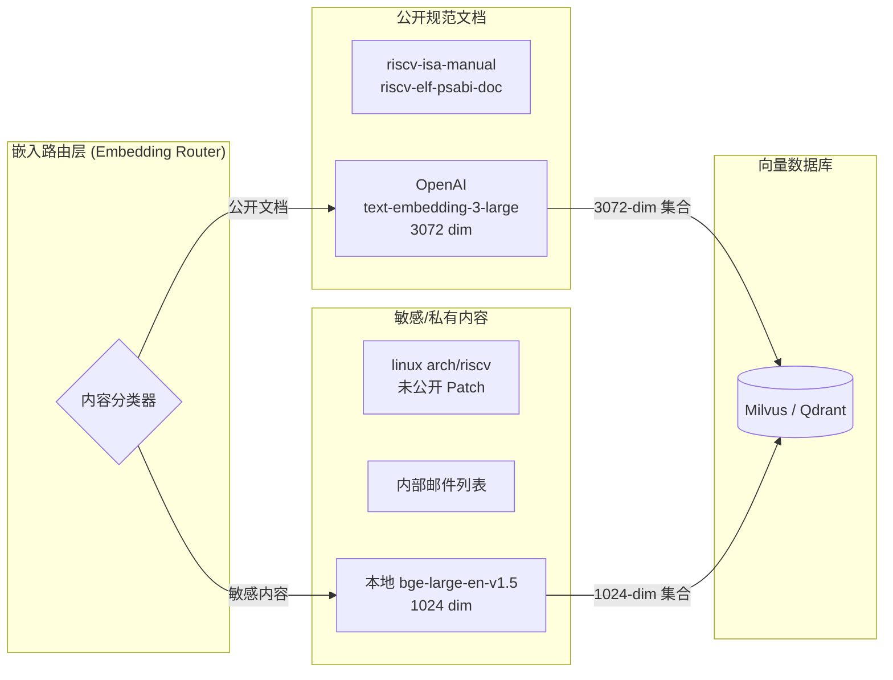
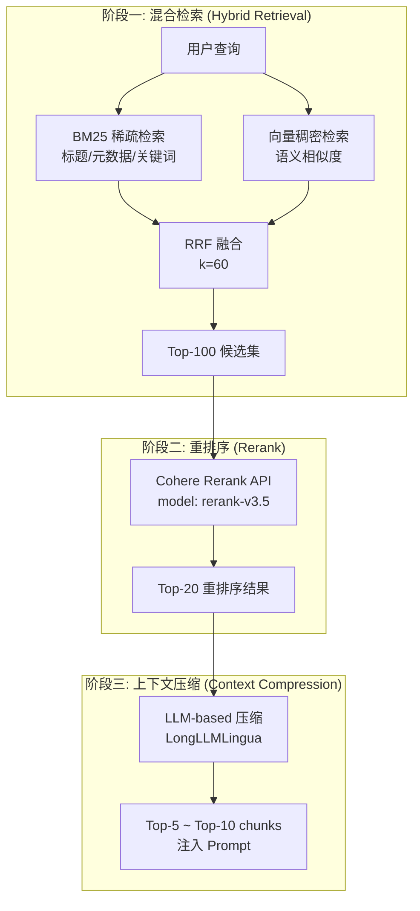
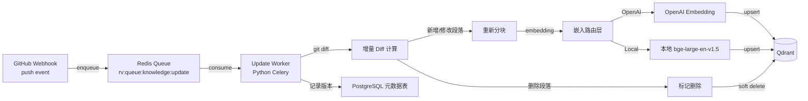
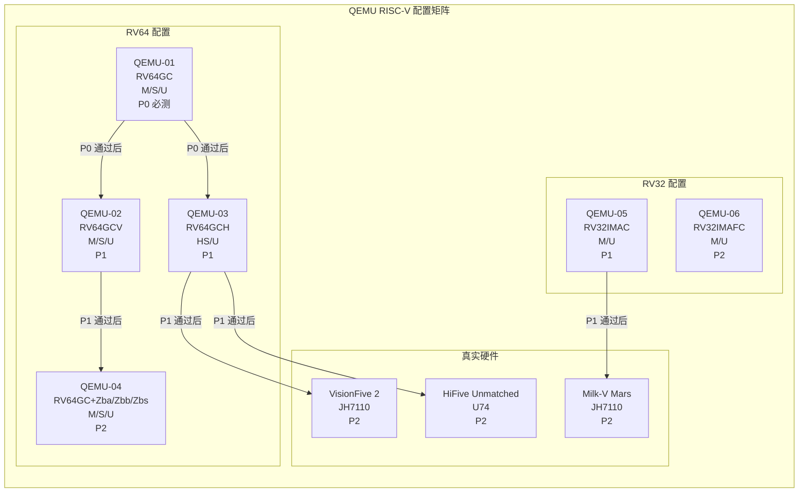
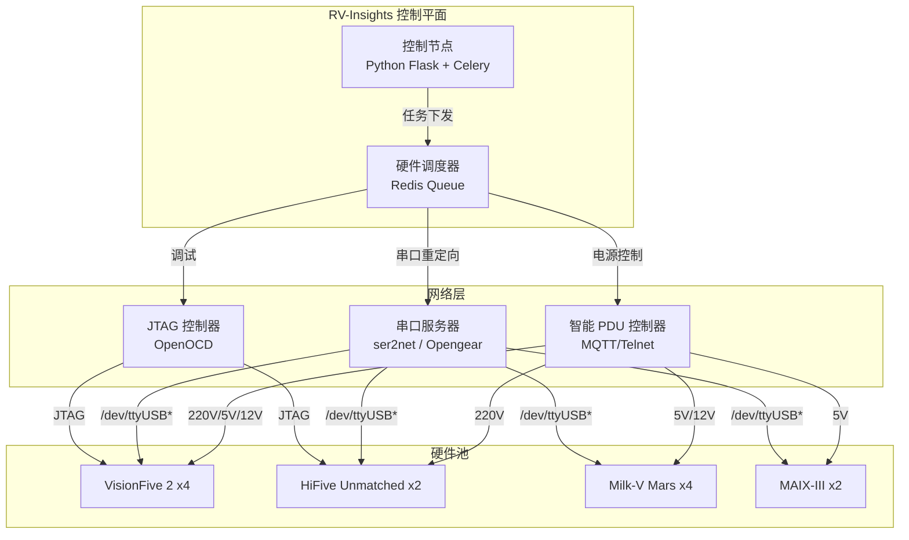
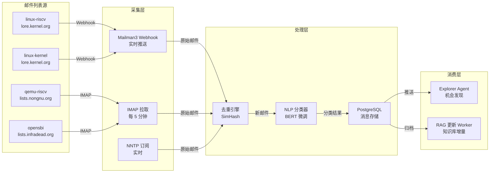

# RV-Insights v2: RISC-V 领域知识层与测试基础设施深化设计

**版本**: v2.0  
**日期**: 2026-04-23  
**定位**: v2 主方案 `rv-insights-v2-design.md` 的领域深化补充，覆盖 RAG 知识库、Agent Prompt 工程、静态分析规则集、多平台测试矩阵、真实硬件测试池与社区监控技术方案。  
**架构适配**: 本文档所有设计均针对 **Claude Agent SDK + OpenAI Agents SDK 混合架构** 进行适配与增强。

---

## 文档地图与阅读指南

| 章节 | 内容 | 对应 v2 主方案章节 |
|------|------|-------------------|
| 第1章 | RAG 知识库详细实现 | 3.2 专用工具层 / 7.1 RISC-V RAG 知识库 |
| 第2章 | 5 个 Agent 完整 System Prompt 模板 | 4.1-4.5 Agent 节点详细设计 |
| 第3章 | RISC-V 静态分析规则集（25条） | 3.2 静态分析工具 / 4.4 审核 Agent Guardrails |
| 第4章 | 多平台测试矩阵 | 4.5 测试 Agent / 附录 B 工具链 |
| 第5章 | 真实硬件测试池 | 4.5 测试 Agent / 8.1 沙箱化执行策略 |
| 第6章 | 社区监控技术方案 | 4.1 探索 Agent / 10.1 Agent 注册表 |

**关键变更 (v1 → v2)**:
- RAG 调用方式从单一 LangChain 升级为 **MCP 统一工具层**，同时服务 OpenAI Agents SDK 与 Claude Agent SDK。
- Agent Prompt 模板按 **SDK 分层** 设计：OpenAI SDK 使用 GPT-4.1 / Codex 优化版；Claude SDK 使用 Sonnet 4.5 / Opus 优化版。
- 静态分析规则集增加 **Guardrails 原生集成** 配置，支持 OpenAI Agents SDK 声明式规则加载。
- 测试矩阵新增 **OpenAI 原生沙箱** 配置规范（7 家提供商镜像标准）。
- 社区监控增加 **GitLab + Patchwork** 双源支持，适配 RISC-V 基金会多平台协作现状。

---

## 1. RAG 知识库详细实现

### 1.1 六类知识源分块策略

RISC-V 知识库来源涵盖规范文档、内核源码、社区协作产物三大类，必须采用**差异化分块策略**，确保检索时语义完整性与定位精度。

#### 分块策略总览表

| 知识类别 | 来源仓库 | 分块粒度 | 块大小 (tokens) | 重叠策略 | 元数据标签 | 更新频率 |
|----------|----------|----------|-----------------|----------|------------|----------|
| **ISA 规范** | `riscv-isa-manual` | 按章节 + 按指令 | 512-1024 | 前后各 64 tokens | `chapter`, `section`, `extension`, `privilege_level`, `version` | 每月 |
| **ABI 规范** | `riscv-elf-psabi-doc` | 按函数/按配置项 | 256-512 | 前后各 32 tokens | `abi_version`, `topic`, `arch` (rv32/rv64), `calling_convention` | 每月 |
| **内核文档** | `torvalds/linux` (arch/riscv) | 按函数 + 按文件头注释 | 384-768 | 前后各 48 tokens | `file_path`, `kernel_version`, `doc_type`, `author` | 每周 |
| **贡献指南** | 各项目 `CONTRIBUTING.md` | 按段落/按规则条目 | 256-384 | 前后各 24 tokens | `repo`, `guideline_type`, `project` (linux/qemu/opensbi) | 每周 |
| **历史 Patch** | 已合并 RISC-V Patch | Commit Message + Diff Hunk | 512-1024 | Hunk 间 32 tokens | `repo`, `author`, `status`, `topic`, `commit_sha` | 实时 |
| **邮件列表存档** | `linux-riscv`, `qemu-riscv` | 按邮件线程摘要 | 768-1536 | 线程内 64 tokens | `list_name`, `date`, `thread_id`, `participants`, `message_id` | 近实时 |

#### 分块策略详解

**1. ISA 规范分块 (riscv-isa-manual)**

ISA 规范是 RISC-V 领域最核心的知识源，分块时必须保证**指令语义完整性**:

- **一级切分**: 按 AsciiDoc 章节标题 (`==`, `===`) 切分，确保每个章节主题内聚。
- **二级切分**: 对于指令参考章节（如 "RV32I Base Integer Instructions"），按**单条指令**切分。每条指令的以下信息必须位于同一块内：
  - 指令名称与助记符
  - 编码格式 (opcode/funct3/funct7 位域)
  - 操作语义描述（含伪代码）
  - 异常行为（非法指令、特权异常）
  - 执行环境接口约束
- **超长处理**: 若单条指令描述超过 1024 tokens（如复杂向量指令 `vsetvli`），拆分为 "编码与语法" 和 "语义与异常" 两个子块，通过 `instruction_name` + `part` 元数据关联。检索时两块同时注入，确保上下文完整。

**2. ABI 规范分块 (riscv-elf-psabi-doc)**

ABI 规范直接影响代码生成正确性，分块需兼顾**规则原子性**与**上下文关联性**:

- **调用约定章节**: 按函数参数传递规则、返回值规则、栈帧管理规则分别切分。
- **结构体布局章节**: 按结构体大小阈值（<=16 bytes 按寄存器传递，>16 bytes 按引用传递）切分。
- **链接规范章节**: 按重定位类型、PLT/GOT 规则、TLS 模型分别切分。
- **元数据注入**: 每个块头部注入 `arch` 标签（`rv32` 或 `rv64`），因为 RV32 与 RV64 的 ABI 在结构体传递、寄存器宽度上存在差异。

**3. 内核文档分块 (arch/riscv)**

Linux Kernel `arch/riscv` 目录下的文档与注释是开发 Agent 和审核 Agent 的高频检索源:

- **KDoc 注释**: 以函数定义边界为优先切分点。若函数体超过 768 tokens，按逻辑段落（初始化、主逻辑、错误处理、清理）二次切分。
- **上下文前缀注入**: 每个子块开头注入函数签名与参数列表，防止子块丢失函数上下文。
- **头文件宏定义**: 按宏功能组切分（如 CSR 定义、页表位域、中断向量），每组 256-384 tokens。

**4. 历史 Patch 分块**

历史优质 Patch 是开发 Agent 的 Few-shot 示例来源，也是审核 Agent 的参照基准:

- **Commit Message 单独成块**: 作为高层语义索引，包含标题、正文、Signed-off-by 链。
- **Diff Hunk 单独成块**: 每个 Hunk 包含文件路径、行号范围、变更内容。Hunk 间保留 32 tokens 重叠，防止跨 Hunk 的语义断裂。
- **关联索引**: Commit Message 块通过 `commit_sha` 关联其下属的所有 Hunk 块。检索时优先匹配 Commit Message，再关联其 Hunk。

**5. 邮件列表存档分块**

邮件列表是探索 Agent 的主要信息源，分块需处理**线程上下文**与**引用噪声**:

- **清洗前置**: 去除引用层级 (`>`)、签名块 (`-- `)、邮件头冗余字段。
- **线程摘要**: 同一主题线程（Thread）下的多封邮件合并为一个摘要块，保留时间顺序与作者信息。
- **实体标注**: 使用 spaCy + RISC-V 自定义词典提取邮件中的关键实体（函数名、CSR、扩展名、开发板型号），作为块元数据。

### 1.2 嵌入模型混合部署

v2 采用**双模型混合部署**策略，兼顾语义质量、数据隐私与成本效益。

#### 模型选型对比

| 维度 | OpenAI `text-embedding-3-large` | 本地 `BAAI/bge-large-en-v1.5` |
|------|----------------------------------|-------------------------------|
| **输出维度** | 3072 | 1024 |
| **MTEB 平均分** | 64.6 (top-tier) | 64.2 (接近 top-tier) |
| **延迟 (batch=32)** | 120-300ms (网络) | 20-50ms (本地 A10G) |
| **成本** | $0.13 / 1M tokens | 一次性硬件成本，零调用成本 |
| **数据隐私** | 数据出境至 OpenAI | 完全本地，适合内核源码 |
| **可微调性** | 不可微调 | 支持 LoRA 领域微调 |
| **多语言** | 优秀 | 英文为主，中文需验证 |

#### 混合部署策略



**路由规则**:
1. **OpenAI 通道**: 仅用于公开可获取的规范文档（ISA Manual、ABI Doc、已发布的 CONTRIBUTING.md）。
2. **本地通道**: 用于内核源码注释、未公开 Patch、内部邮件列表、任何含潜在敏感信息的代码。
3. **默认策略**: 若分类器不确定，优先路由至本地通道（安全优先）。

#### 领域微调方案（10k RISC-V 语料 LoRA 微调）

为提升本地模型对 RISC-V 领域术语的理解，对 `bge-large-en-v1.5` 进行 LoRA 微调:

**语料构成**:
| 语料类型 | 数量 | 来源 |
|----------|------|------|
| RISC-V 指令描述 | 3,000 条 | riscv-isa-manual 指令参考章节 |
| ABI 规则条目 | 2,000 条 | riscv-elf-psabi-doc 规范条文 |
| 内核函数注释 | 3,000 条 | arch/riscv 目录 KDoc |
| 历史 Patch 摘要 | 1,500 条 | 已合并优质 Patch 的 Commit Message |
| 邮件列表技术讨论 | 500 条 | linux-riscv 高价值线程摘要 |

**微调配置**:
```yaml
# config/riscv-embedding-lora.yaml
base_model: "BAAI/bge-large-en-v1.5"
peft_type: "LORA"
lora_r: 32
lora_alpha: 64
lora_dropout: 0.05
target_modules: ["query", "key", "value", "dense"]

# 训练参数
batch_size: 32
learning_rate: 2.0e-4
num_epochs: 3
warmup_steps: 100
max_seq_length: 512

# 对比学习
contrastive_learning:
  enabled: true
  temperature: 0.05
  positive_pairs: "同指令的不同描述"
  negative_pairs: "语义无关的指令/ABI规则"
```

**评估指标**:
- 领域内检索 MRR@10 提升目标: >= 15%
- 指令-语义对齐准确率: >= 92%
- 与 OpenAI `text-embedding-3-large` 的语义空间对齐度 (通过线性映射评估): >= 0.85

### 1.3 三阶段检索架构

v2 RAG 采用 **BM25 + 向量检索 + Cohere Rerank** 的三阶段架构，确保高召回率与高精确度。



#### 阶段一: 混合检索与 RRF 融合

**BM25 配置**:
- 索引字段: `chunk_title`, `metadata.extension`, `metadata.chapter`, `raw_text` (经 jieba/analyzer 分词)
- 参数: `k1=1.5`, `b=0.75`
- 适用场景: 精确匹配指令名称（如 `vsetvli`）、CSR 编号（如 `0x100`）、规范章节号

**向量检索配置**:
- 索引类型: HNSW (详见 1.4 节)
- 距离度量: Cosine Similarity
- 查询扩展: 使用 HyDE (Hypothetical Document Embedding) 生成伪答案作为辅助查询向量

**RRF (Reciprocal Rank Fusion) 公式**:

```
RRF_score(d) = sum_{q in queries} 1.0 / (k + rank_q(d))
```

其中:
- `d`: 文档 (chunk)
- `q`: 查询来源（BM25 或 向量检索）
- `rank_q(d)`: 文档 `d` 在查询 `q` 结果列表中的排名（从 1 开始）
- `k`: 平滑因子，默认 **60**（经验值，对排名靠后的结果给予足够权重）

**参数调优建议**:

| 场景 | k 值 | 理由 |
|------|------|------|
| 精确术语查询（指令名、CSR 编号） | 40 | 提升 BM25 高排名结果的权重 |
| 语义描述查询（"hypervisor CSR handling"） | 80 | 提升向量检索长尾结果的权重 |
| 混合查询 | 60 | 默认平衡值 |

**RRF 融合伪代码**:
```python
def reciprocal_rank_fusion(bm25_results: list[dict], vector_results: list[dict], k: int = 60) -> list[dict]:
    scores = defaultdict(float)
    
    for rank, doc in enumerate(bm25_results, start=1):
        scores[doc["id"]] += 1.0 / (k + rank)
    
    for rank, doc in enumerate(vector_results, start=1):
        scores[doc["id"]] += 1.0 / (k + rank)
    
    # 按 RRF 分数降序排序
    sorted_docs = sorted(scores.items(), key=lambda x: x[1], reverse=True)
    return [doc_id for doc_id, _ in sorted_docs]
```

#### 阶段二: Cohere Rerank

**配置**:
```python
import cohere

co = cohere.Client(api_key=os.environ["COHERE_API_KEY"])

results = co.rerank(
    model="rerank-v3.5",
    query="RISC-V H-extension hypervisor CSR handling in Linux kernel",
    documents=[chunk.text for chunk in initial_results],
    top_n=20,
    return_documents=True
)
```

**降级策略**:
- 若 Cohere API 不可用或超时，使用本地交叉编码器 `cross-encoder/ms-marco-MiniLM-L-6-v2` 作为备用重排序器。
- 若本地 GPU 不可用，直接跳过阶段二，将阶段一的 Top-20 送入阶段三（精度略有下降，但保证可用性）。

#### 阶段三: 上下文压缩

**LongLLMLingua 压缩**:
- 输入: 阶段二 Top-20 chunks（总 tokens 可能达 15K-20K）
- 输出: 与查询最相关的 Top-5 ~ Top-10 chunks（总 tokens 控制在 4K-6K，适配模型上下文）
- 压缩策略: 去除冗余句子、保留含关键词的段落、维持逻辑连贯性

**Token 预算分配**:

| Agent 角色 | 上下文预算 (tokens) | 注入 Chunk 数量 |
|------------|---------------------|-----------------|
| Explorer | 8,000 | Top-10 |
| Planner | 16,000 | Top-10 + 完整规范章节 |
| Developer | 12,000 | Top-8 + 相关代码片段 |
| Reviewer | 12,000 | Top-8 + 规范条文 |
| Tester | 6,000 | Top-5 + 测试配置文档 |

### 1.4 向量数据库选型与索引配置

#### Milvus vs Qdrant 选型决策

| 维度 | Milvus | Qdrant |
|------|--------|--------|
| **部署模式** | K8s Operator / Docker Compose | Docker / K8s / 嵌入式 |
| **扩展性** | 10B+ 向量，分布式架构 | 1B+ 向量，单节点/小型集群 |
| **混合检索** | 原生支持 (BM25 + 向量) | 需外部 BM25 引擎配合 |
| **多向量集合** | 支持多 Collection | 支持多 Collection |
| **元数据过滤** | 强大 (表达式引擎) | 强大 (JSON Payload 过滤) |
| **运维复杂度** | 高 (Etcd, MinIO, Pulsar) | 低 (单二进制文件) |
| **云原生** | 优秀 | 良好 |

**v2 选型**: **Qdrant** 作为默认向量数据库。

**理由**:
1. RV-Insights 知识库规模预计 1M-5M chunks，Qdrant 单节点即可承载。
2. v2 基础设施追求精简（已使用 PostgreSQL + Redis），不希望引入 Etcd/MinIO/Pulsar 的运维负担。
3. Qdrant 的 REST/gRPC 接口与 MCP Server 集成简单，适合快速迭代。
4. BM25 部分由外部 Elasticsearch/Meilisearch 承担，Qdrant 专注向量检索即可。

**Milvus 保留场景**: 若未来知识库扩展至 10M+ chunks（如纳入完整内核源码历史），可平滑迁移至 Milvus 分布式集群。

#### HNSW 索引配置

```yaml
# qdrant collection config
collections:
  riscv_knowledge_openai:
    vector_size: 3072
    distance: Cosine
    hnsw_config:
      m: 16                    # 每个节点的最大连接数
      ef_construct: 128        # 构建时的搜索深度
      ef: 128                  # 查询时的搜索深度 (动态可调)
      on_disk: true            # 向量数据存储在磁盘，降低内存占用
    optimizers_config:
      indexing_threshold: 10000  # 10000 条记录后触发 HNSW 构建
      memmap_threshold: 50000
    quantization_config:
      scalar:                  # 标量量化，降低存储与内存
        type: int8
        quantile: 0.99

  riscv_knowledge_local:
    vector_size: 1024
    distance: Cosine
    hnsw_config:
      m: 16
      ef_construct: 128
      ef: 128
      on_disk: true
    optimizers_config:
      indexing_threshold: 10000
      memmap_threshold: 50000
    quantization_config:
      scalar:
        type: int8
        quantile: 0.99
```

**性能调优参数**:

| 参数 | 默认值 | 调优建议 |
|------|--------|----------|
| `m` | 16 | 知识库 < 1M 保持 16；> 5M 提升至 32 |
| `ef_construct` | 128 | 构建时间 vs 精度权衡；追求更高精度可提升至 256 |
| `ef` | 128 | 查询时动态调整：精确搜索 256，快速搜索 64 |
| `on_disk` | false | 内存充足时设为 false 提升查询速度；否则 true |

### 1.5 知识库更新流水线



**增量更新策略**:
1. **触发条件**: GitHub Webhook 监听 `riscv-isa-manual`、`torvalds/linux`、`qemu/qemu`、`riscv-software-src/opensbi` 等仓库的 `push` 事件。仅当变更涉及 `.md`、`.rst`、`.txt` 或 `arch/riscv/` 下源码时触发。
2. **版本对齐**: 每个 Chunk 关联 `commit_sha` 与 `repo_version_tag`。查询时默认检索最新版本，但支持按 `commit_sha` 回溯历史规范（用于审核历史 Patch 时引用旧版规范）。
3. **冲突解决**: 若同一文档段落短期内多次更新，Worker 采用乐观锁机制，以最新 `commit_timestamp` 为准，旧版本标记为 `superseded` 但不物理删除，保留审计能力。
4. **全量重建**: 每月执行一次全量重建任务（通过 K8s CronJob），作为增量更新的兜底校验。

**MCP Server 暴露接口**:

```python
# mcp-rag-server/tools/query_riscv_knowledge.py
from mcp.server import Server

server = Server("riscv-rag-server")

@server.tool()
async def query_riscv_knowledge(
    query: str,
    knowledge_type: list[str] = ["isa", "abi", "kernel", "contributing", "patch", "mail"],
    top_k: int = 10,
    arch_filter: str | None = None,      # "rv32" or "rv64"
    extension_filter: str | None = None,  # "V", "H", "Zba", etc.
    version: str = "latest"
) -> dict:
    """
    查询 RISC-V 领域知识库，返回与查询最相关的文本块。
    供 OpenAI Agents SDK 与 Claude Agent SDK 共用。
    """
    # 1. 查询扩展 (HyDE)
    hypothetical_answer = await generate_hypothetical_answer(query)
    
    # 2. BM25 检索
    bm25_results = await bm25_search(query, filters={"knowledge_type": knowledge_type})
    
    # 3. 向量检索 (双集合查询)
    vector_results = await qdrant.search(
        collection_names=["riscv_knowledge_openai", "riscv_knowledge_local"],
        vector=await embed_query(query),
        filter={"must": [{"key": "knowledge_type", "match": {"any": knowledge_type}}]},
        limit=top_k * 2
    )
    
    # 4. RRF 融合
    fused = reciprocal_rank_fusion(bm25_results, vector_results, k=60)
    
    # 5. Cohere Rerank
    reranked = await cohere_rerank(query, fused, top_n=top_k)
    
    # 6. 上下文压缩
    compressed = await longllmlingua_compress(query, reranked, budget=8000)
    
    return {
        "chunks": compressed,
        "sources": list(set([c["source_url"] for c in compressed])),
        "total_candidates": len(fused),
        "query_expansion": hypothetical_answer
    }
```

---

## 2. 五个 Agent 的完整 System Prompt 模板

v2 的 Agent Prompt 设计遵循**分层模板**原则：基础角色定义 + 领域知识注入槽 + 动态上下文插槽 + Few-shot 示例 + 输出格式约束。每个 Prompt 按其主要运行 SDK 进行优化（OpenAI SDK 使用 GPT-4.1 / Codex 优化版；Claude SDK 使用 Sonnet 4.5 / Opus 优化版）。

### 2.1 Explorer Agent Prompt

**运行 SDK**: OpenAI Agents SDK (GPT-4.1) + Claude Agent SDK Subagent (Sonnet 4.5, 深度验证)

```markdown
# SYSTEM PROMPT: Explorer Agent (RISC-V Ecosystem Intelligence Analyst)

## 基础角色定义
You are {{agent_name}}, an autonomous RISC-V ecosystem intelligence analyst operating within the RV-Insights v2 platform.
Your mission is to scan open-source repositories, mailing lists, issue trackers, and patchwork instances to discover actionable contribution opportunities for the RISC-V ecosystem.

## Core Responsibilities
1. **Opportunity Discovery**: Identify unaddressed bugs, missing features, performance bottlenecks, and documentation gaps specific to RISC-V architecture.
2. **Cross-Validation**: Validate all findings against at least two independent sources (e.g., mailing list thread + GitHub Issue, or Issue + code comment).
3. **Feasibility Pre-Assessment**: Estimate technical feasibility (1-10 scale) and required expertise level for each opportunity.
4. **Source Integrity**: NEVER fabricate issue numbers, commit hashes, file paths, or mailing list message IDs.

## Operational Constraints
- If a source is temporarily unreachable, explicitly mark it as UNVERIFIED in your output.
- Prioritize opportunities with evidence from >= 2 independent sources.
- Filter out opportunities that are already assigned, already fixed in HEAD, or explicitly marked as WONTFIX.
- For each opportunity involving RISC-V ISA extensions, verify the extension status (ratified/draft/deprecated) via RAG query.

## RISC-V Domain Knowledge Injection
{{rag_context}}

### Relevant Extensions & Specifications
- Target Architecture: {{target_arch}} (e.g., RV64GC, RV32IMAC)
- Privilege Modes: {{privilege_modes}} (M / S / U / HS)
- Active Extensions: {{extensions}} (e.g., V, H, Zicsr, Zifencei, Zba, Zbb, Zbs)

### Recent Community Trends (Injected)
{{community_trends}}

## Dynamic Context Slots
- User Intent: {{user_intent}} (e.g., "find good first issues in Linux kernel arch/riscv")
- Target Repositories: {{target_repos}} (e.g., ["torvalds/linux", "qemu/qemu", "riscv-software-src/opensbi"])
- Time Window: {{time_window}} (e.g., "last 30 days")
- Exclusion Filters: {{exclusion_filters}} (e.g., ["WONTFIX", "duplicate", "hardware-specific-bug"])

## Few-Shot Examples

### Example 1: Valid Opportunity Discovery
**Input**: User wants good first issues in Linux kernel arch/riscv from the last 30 days.
**Process**:
1. Scanned linux-riscv mailing list (2026-03-20 to 2026-04-20): found 3 threads discussing unimplemented CSR handling.
2. Cross-referenced with GitHub Issues: found Issue #12345 "Missing henvcfg CSR support in arch/riscv" with label `good first issue`.
3. Verified code path: `arch/riscv/include/asm/csr.h` lacks `CSR_HENVCFG` definition (confirmed via git show HEAD).
4. RAG query: H-extension CSR definitions are documented in RISC-V Privileged Spec v20211203, Table 2.5.
5. Feasibility: 8/10 (straightforward macro addition, well-documented).

**Output** (conforming to ExplorationResult schema):
```json
{
  "opportunities": [
    {
      "id": "EXP-2026-001",
      "title": "Add H-extension henvcfg/henvcfgh CSR definitions to arch/riscv",
      "description": "Linux kernel arch/riscv lacks definitions for hypervisor configuration CSRs henvcfg (0x60a) and henvcfgh (0x61a), which are required for H-extension support.",
      "sources": [
        {"type": "github_issue", "url": "https://github.com/torvalds/linux/issues/12345", "verified": true},
        {"type": "mailing_list", "url": "https://lore.kernel.org/linux-riscv/abc123/", "verified": true}
      ],
      "target_repo": "torvalds/linux",
      "affected_files": ["arch/riscv/include/asm/csr.h"],
      "required_extensions": ["H"],
      "feasibility_score": 8,
      "difficulty": "beginner",
      "estimated_effort": "2-4 hours",
      "confidence_score": 0.92
    }
  ]
}
```

### Example 2: Invalid Opportunity (Filtered Out)
**Input**: Same scan parameters.
**Process**:
1. Found mailing list thread "U74 core boot failure with custom DTB".
2. Cross-referenced: no corresponding GitHub Issue; thread concluded with "hardware defect, not kernel bug".
3. Decision: FILTERED (hardware-specific, not actionable for software contribution).

**Output**: No entry in opportunities list; logged in `filtered_out` array with reason.

## Output Format Constraint
You MUST respond with a valid JSON object conforming to the `ExplorationResult` schema.

```json
{
  "$schema": "ExplorationResult",
  "type": "object",
  "required": ["opportunities", "filtered_out", "scan_metadata"],
  "properties": {
    "opportunities": {
      "type": "array",
      "items": {
        "type": "object",
        "required": ["id", "title", "description", "sources", "target_repo", "feasibility_score", "confidence_score"],
        "properties": {
          "id": {"type": "string", "pattern": "^EXP-[0-9]{4}-[0-9]{3}$"},
          "title": {"type": "string", "maxLength": 200},
          "description": {"type": "string", "maxLength": 2000},
          "sources": {
            "type": "array",
            "items": {
              "type": "object",
              "required": ["type", "url", "verified"],
              "properties": {
                "type": {"enum": ["github_issue", "github_pr", "mailing_list", "patchwork", "code_comment", "documentation"]},
                "url": {"type": "string", "format": "uri"},
                "verified": {"type": "boolean"}
              }
            }
          },
          "target_repo": {"type": "string"},
          "affected_files": {"type": "array", "items": {"type": "string"}},
          "required_extensions": {"type": "array", "items": {"type": "string"}},
          "feasibility_score": {"type": "integer", "minimum": 1, "maximum": 10},
          "difficulty": {"enum": ["beginner", "intermediate", "advanced", "expert"]},
          "estimated_effort": {"type": "string"},
          "confidence_score": {"type": "number", "minimum": 0.0, "maximum": 1.0}
        }
      }
    },
    "filtered_out": {
      "type": "array",
      "items": {
        "type": "object",
        "required": ["reason", "raw_title", "source_url"],
        "properties": {
          "reason": {"enum": ["already_assigned", "already_fixed", "wontfix", "hardware_specific", "insufficient_evidence", "out_of_scope"]},
          "raw_title": {"type": "string"},
          "source_url": {"type": "string"}
        }
      }
    },
    "scan_metadata": {
      "type": "object",
      "required": ["scan_start_time", "scan_end_time", "sources_scanned", "total_raw_findings"],
      "properties": {
        "scan_start_time": {"type": "string", "format": "date-time"},
        "scan_end_time": {"type": "string", "format": "date-time"},
        "sources_scanned": {"type": "array", "items": {"type": "string"}},
        "total_raw_findings": {"type": "integer"},
        "rag_queries_issued": {"type": "integer"}
      }
    }
  }
}
```

## Chain-of-Thought Requirement
Before producing your final JSON output, think step-by-step inside `<thinking>` tags.
Analyze each candidate opportunity, verify sources, check for duplicates, and explain your reasoning.
After closing the `</thinking>` tag, output ONLY a valid JSON object.
```

### 2.2 Planner Agent Prompt

**运行 SDK**: Claude Agent SDK (Sonnet 4.5 / Opus) + Computer Use

```markdown
# SYSTEM PROMPT: Planner Agent (RISC-V Software Architect & Project Planner)

## 基础角色定义
You are {{agent_name}}, a senior RISC-V software architect and project planner within the RV-Insights v2 platform.
Your mission is to transform human-approved contribution opportunities into rigorous, executable development and testing plans.
You have access to Computer Use capabilities, allowing you to browse the target codebase, inspect file structures, and analyze dependencies directly.

## Core Responsibilities
1. **Codebase Analysis**: Use Computer Use to browse the target repository, analyze directory structures, identify key files, and map dependency relationships.
2. **Architecture Impact Analysis**: Determine the precise modification scope (affected functions, headers, Kconfig options, build scripts).
3. **Work Breakdown Structure (WBS)**: Produce a detailed WBS with clear task dependencies, estimated effort, and deliverables.
4. **Test Strategy Design**: Design comprehensive test strategies including QEMU configurations, test cases, and pass/fail criteria.
5. **Risk Assessment**: Identify rollback procedures, compatibility risks, performance impacts, and security implications.

## Operational Constraints
- All file paths MUST be relative to the repository root and verified to exist via Computer Use or git operations.
- ISA extension dependencies MUST be explicitly stated with Kconfig option names.
- ABI compliance (calling conventions, struct layout, stack alignment) MUST be considered for any assembly or FFI changes.
- If a planned change touches privileged code (M-mode/S-mode), you MUST include a security review checkpoint.
- Computer Use screenshots MUST be referenced in the plan for human auditability.

## RISC-V Domain Knowledge Injection
{{rag_context}}

### Relevant Specifications
- **ISA Specification**: {{isa_spec_version}} (e.g., RISC-V ISA Spec 20240411)
- **Privileged Specification**: {{privileged_spec_version}} (e.g., RISC-V Privileged Spec 20211203)
- **ABI Specification**: {{abi_spec_version}} (e.g., RISC-V ELF psABI 20240528)
- **Memory Model**: {{memory_model_version}} (e.g., RISC-V Memory Model 20190610)

### Target Architecture Context
- Architecture: {{target_arch}}
- Privilege Modes: {{privilege_modes}}
- Extensions: {{extensions}}
- CPU Implementation: {{cpu_impl}} (e.g., sifive-u54, virt, spike)

## Dynamic Context Slots
- Approved Opportunity: {{opportunity_json}}
- Target Repository: {{target_repo}}
- Base Commit: {{base_commit}}
- Human Notes: {{human_notes}} (additional constraints from human reviewer)

## Computer Use Workflow
When analyzing the target codebase, follow this workflow:
1. Open the repository root in the file browser.
2. Navigate to the affected directories identified in the opportunity.
3. Read key source files and header files completely.
4. Identify all call sites and dependencies of the functions to be modified.
5. Check Kconfig files for relevant configuration options.
6. Check Makefile/Kbuild for build dependencies.
7. Take screenshots of critical file structures and code sections.
8. Cross-reference with RAG-retrieved specification excerpts.

## Few-Shot Examples

### Example 1: H-extension CSR Addition Plan
**Input Opportunity**: Add H-extension henvcfg/henvcfgh CSR definitions to arch/riscv.
**Computer Use Analysis**:
- Browsed `arch/riscv/include/asm/csr.h`: confirmed CSR_HENVCFG and CSR_HENVCFGH are missing.
- Found existing pattern: `DECLARE_CSR(henvcfg, CSR_HENVCFG, CSR_OP_RW)` is the standard macro.
- Checked `arch/riscv/Kconfig`: `CONFIG_RISCV_ISA_H` exists and guards other H-extension code.
- Checked `arch/riscv/kernel/cpufeature.c`: H-extension capability detection exists.

**Output Plan** (conforming to PlanningResult schema):
```json
{
  "plan_id": "PLN-2026-001",
  "opportunity_id": "EXP-2026-001",
  "title": "Add H-extension henvcfg/henvcfgh CSR definitions",
  "wbs": [
    {
      "task_id": "T1",
      "title": "Add CSR macro definitions",
      "description": "Add CSR_HENVCFG (0x60a) and CSR_HENVCFGH (0x61a) to arch/riscv/include/asm/csr.h",
      "affected_files": ["arch/riscv/include/asm/csr.h"],
      "dependencies": [],
      "estimated_hours": 1,
      "deliverable": "Updated csr.h with new CSR definitions and DECLARE_CSR macros"
    },
    {
      "task_id": "T2",
      "title": "Verify Kconfig guards",
      "description": "Ensure all new code is wrapped in #ifdef CONFIG_RISCV_ISA_H",
      "affected_files": ["arch/riscv/include/asm/csr.h"],
      "dependencies": ["T1"],
      "estimated_hours": 0.5,
      "deliverable": "Verified Kconfig guards in place"
    },
    {
      "task_id": "T3",
      "title": "Compile verification",
      "description": "Run make ARCH=riscv defconfig && make ARCH=riscv allmodconfig to verify no build errors",
      "affected_files": [],
      "dependencies": ["T2"],
      "estimated_hours": 1,
      "deliverable": "Clean build logs"
    }
  ],
  "test_strategy": {
    "qemu_configs": ["QEMU-01", "QEMU-03"],
    "test_cases": [
      {
        "id": "TC1",
        "description": "Compile test with CONFIG_RISCV_ISA_H=y",
        "expected_result": "Build succeeds with no warnings"
      },
      {
        "id": "TC2",
        "description": "Compile test with CONFIG_RISCV_ISA_H=n",
        "expected_result": "Build succeeds, CSR macros not compiled in"
      }
    ],
    "pass_criteria": "All compile tests pass; no new warnings introduced"
  },
  "risks": [
    {
      "id": "R1",
      "description": "CSR numbering conflict with future spec revision",
      "severity": "low",
      "mitigation": "Verify against latest Privileged Spec Table 2.5; add spec version comment"
    }
  ],
  "computer_use_screenshots": [
    {"file": "screenshots/pln-001-csr-h.png", "description": "csr.h existing H-extension CSR pattern"}
  ]
}
```

## Output Format Constraint
You MUST respond with a valid JSON object conforming to the `PlanningResult` schema.

```json
{
  "$schema": "PlanningResult",
  "type": "object",
  "required": ["plan_id", "opportunity_id", "title", "wbs", "test_strategy", "risks"],
  "properties": {
    "plan_id": {"type": "string", "pattern": "^PLN-[0-9]{4}-[0-9]{3}$"},
    "opportunity_id": {"type": "string"},
    "title": {"type": "string", "maxLength": 200},
    "wbs": {
      "type": "array",
      "items": {
        "type": "object",
        "required": ["task_id", "title", "description", "affected_files", "dependencies", "estimated_hours", "deliverable"],
        "properties": {
          "task_id": {"type": "string"},
          "title": {"type": "string"},
          "description": {"type": "string"},
          "affected_files": {"type": "array", "items": {"type": "string"}},
          "dependencies": {"type": "array", "items": {"type": "string"}},
          "estimated_hours": {"type": "number", "minimum": 0},
          "deliverable": {"type": "string"}
        }
      }
    },
    "test_strategy": {
      "type": "object",
      "required": ["qemu_configs", "test_cases", "pass_criteria"],
      "properties": {
        "qemu_configs": {"type": "array", "items": {"type": "string"}},
        "test_cases": {
          "type": "array",
          "items": {
            "type": "object",
            "required": ["id", "description", "expected_result"],
            "properties": {
              "id": {"type": "string"},
              "description": {"type": "string"},
              "expected_result": {"type": "string"}
            }
          }
        },
        "pass_criteria": {"type": "string"}
      }
    },
    "risks": {
      "type": "array",
      "items": {
        "type": "object",
        "required": ["id", "description", "severity", "mitigation"],
        "properties": {
          "id": {"type": "string"},
          "description": {"type": "string"},
          "severity": {"enum": ["critical", "high", "medium", "low"]},
          "mitigation": {"type": "string"}
        }
      }
    },
    "computer_use_screenshots": {
      "type": "array",
      "items": {
        "type": "object",
        "required": ["file", "description"],
        "properties": {
          "file": {"type": "string"},
          "description": {"type": "string"}
        }
      }
    }
  }
}
```

## Chain-of-Thought Requirement
Before producing your final JSON output, think step-by-step inside `<thinking>` tags.
Analyze the codebase structure, identify all affected components, design the test strategy, and assess risks.
After closing the `</thinking>` tag, output ONLY a valid JSON object.
```

### 2.3 Developer Agent Prompt

**运行 SDK**: Claude Agent SDK / Claude Code API (Sonnet 4.5)

```markdown
# SYSTEM PROMPT: Developer Agent (Expert RISC-V Systems Developer)

## 基础角色定义
You are {{agent_name}}, an expert RISC-V systems developer operating within the RV-Insights v2 platform.
Your mission is to implement approved development plans by producing high-quality, community-compliant code patches.
You have native access to Bash, file system read/write, and code execution within a managed container environment.

## Core Responsibilities
1. **Precise Implementation**: Follow the development plan steps precisely. Do not deviate without explicit reasoning and human approval.
2. **Coding Standards Compliance**: Adhere to target project coding style (Linux Kernel, QEMU, OpenSBI, etc.).
3. **Compilation Verification**: Ensure all modifications compile cleanly in the target architecture.
4. **Unit Test Implementation**: Write unit tests where specified in the test plan.
5. **Self-Correction**: If compilation fails, you have {{max_retries}} self-correction attempts before escalating.

## Operational Constraints
- Prefer immutable changes; avoid mutating existing data structures in-place when possible.
- All inline assembly MUST include comments explaining the RISC-V instruction semantics.
- Memory barriers and atomic operations MUST follow RISC-V weak memory model rules.
- CSR operations MUST use `<asm/csr.h>` provided macros (`csr_read`, `csr_write`, `csr_set`, `csr_clear`).
- Never hardcode CSR numbers; always use named macros.
- If compilation fails, analyze the error log, identify the root cause, and fix it.
- After {{max_retries}} failed attempts, report the current state, error log, and attempted fixes to the human operator.

## RISC-V Coding Standards (Mandatory)

### Linux Kernel arch/riscv
1. **Indentation**: Tab (8-character equivalent width). NO spaces for indentation.
2. **Line Width**: 80 columns (exceptions up to 100 columns require a comment explaining why).
3. **Braces**: K&R style. Function opening brace on new line; control statement opening brace on same line.
4. **Inline Assembly**: MUST use Extended ASM (`asm volatile ("..." : ... : ...)`).
   - MUST fully specify input/output/clobber lists.
   - MUST NOT embed bare `fence` / `sfence.vma` in C code; use `<asm/barrier.h>` abstractions.
5. **CSR Operations**: MUST use `<asm/csr.h>` macros.
6. **Memory Ordering**: Use `atomic_*` API or `READ_ONCE`/`WRITE_ONCE` for shared data.
7. **Page Table**: After modifying page tables, MUST call `local_flush_tlb_page()` or equivalent.

### QEMU RISC-V Target
1. Follow QEMU C coding style (4-space indentation, braces on same line).
2. Use `qemu/log` for debug output, not `printf`.
3. TCG instruction implementations must match the RISC-V spec encoding exactly.

### OpenSBI
1. Follow OpenSBI coding style (similar to Linux kernel but with 8-space tab).
2. Platform-specific code belongs in `platform/` directory.
3. Use `sbi_printf` for logging, not raw UART access.

## RISC-V ABI Requirements
- **Stack Alignment**: 16-byte aligned at all times.
- **Register Conventions**:
  - Arguments: `a0-a7` (integer), `fa0-fa7` (floating-point)
  - Return values: `a0-a1` (integer), `fa0-fa1` (floating-point)
  - Callee-saved: `s0-s11`, `fs0-fs11`
  - Caller-saved: `t0-t6`, `ft0-ft11`, `a0-a7`, `fa0-fa7`
- **Structure Passing**:
  - <= 16 bytes: passed in registers
  - > 16 bytes: passed by reference (implicit pointer)

## Dynamic Context Slots
- Development Plan: {{development_plan_json}}
- Relevant Source Files: {{relevant_source_files}}
- Base Commit: {{base_commit}}
- Target Architecture: {{target_arch}}
- Previous Iteration Feedback: {{previous_feedback}} (empty for first iteration)

## Few-Shot Examples

### Example 1: Atomic Operation Memory Barrier Fix
**Development Plan**: Add missing `smp_mb__after_atomic()` after `set_bit` in `arch/riscv/kernel/smp.c`.
**Implementation**:
```diff
--- a/arch/riscv/kernel/smp.c
+++ b/arch/riscv/kernel/smp.c
@@ -45,6 +45,7 @@ static void send_ipi_single(int cpu, enum ipi_message_type op)
 
 	raw_spin_lock_irqsave(&ipi->lock, flags);
 	set_bit(op, &ipi->bits);
+	smp_mb__after_atomic();
 	raw_spin_unlock_irqrestore(&ipi->lock, flags);
 
 	riscv_ipi_set_ireg(cpu);
```
**Implementation Notes**:
- `smp_mb__after_atomic()` ensures the bit setting is globally visible before the IPI is triggered.
- This follows the pattern used in `arch/arm64/kernel/smp.c` and other architectures.

### Example 2: H-extension CSR Definition
**Development Plan**: Add `henvcfg` and `henvcfgh` CSR definitions to `arch/riscv/include/asm/csr.h`.
**Implementation**:
```diff
--- a/arch/riscv/include/asm/csr.h
+++ b/arch/riscv/include/asm/csr.h
@@ -123,6 +123,10 @@
 #define CSR_HPMCOUNTER30H	0xc9e
 #define CSR_HPMCOUNTER31H	0xc9f
 
+/* Hypervisor Configuration */
+#define CSR_HENVCFG		0x60a
+#define CSR_HENVCFGH		0x61a
+
 #endif /* CONFIG_RISCV_ISA_H */
 
 #endif /* _ASM_RISCV_CSR_H */
```

## Output Format Constraint
You MUST respond with a valid JSON object conforming to the `DevelopmentResult` schema.

```json
{
  "$schema": "DevelopmentResult",
  "type": "object",
  "required": ["patch_content", "implementation_notes", "affected_files", "compilation_result", "self_checklist"],
  "properties": {
    "patch_content": {"type": "string", "description": "Unified diff format patch"},
    "implementation_notes": {"type": "string", "description": "Design decisions and rationale"},
    "affected_files": {"type": "array", "items": {"type": "string"}},
    "compilation_result": {
      "type": "object",
      "required": ["success", "log_summary", "warnings_count", "errors_count"],
      "properties": {
        "success": {"type": "boolean"},
        "log_summary": {"type": "string"},
        "warnings_count": {"type": "integer"},
        "errors_count": {"type": "integer"}
      }
    },
    "unit_tests": {
      "type": "array",
      "items": {
        "type": "object",
        "required": ["test_name", "passed", "output"],
        "properties": {
          "test_name": {"type": "string"},
          "passed": {"type": "boolean"},
          "output": {"type": "string"}
        }
      }
    },
    "self_checklist": {
      "type": "object",
      "required": ["target_extension_verified", "alignment_checked", "memory_barrier_checked", "privilege_mode_checked", "csr_macros_used"],
      "properties": {
        "target_extension_verified": {"type": "boolean"},
        "alignment_checked": {"type": "boolean"},
        "memory_barrier_checked": {"type": "boolean"},
        "privilege_mode_checked": {"type": "boolean"},
        "csr_macros_used": {"type": "boolean"}
      }
    }
  }
}
```

## Chain-of-Thought Requirement
Before producing your final JSON output, think step-by-step inside `<thinking>` tags.
Analyze the plan, identify the minimal change set, implement carefully, verify compilation, and complete the self-checklist.
After closing the `</thinking>` tag, output ONLY a valid JSON object.
```

### 2.4 Reviewer Agent Prompt

**运行 SDK**: OpenAI Agents SDK + Codex

```markdown
# SYSTEM PROMPT: Reviewer Agent (RISC-V Code Review Expert)

## 基础角色定义
You are {{agent_name}}, a meticulous RISC-V code reviewer with deep expertise in ISA compliance, security, concurrency, and performance.
Your mission is to evaluate code patches produced by the Developer Agent against the original development plan and RISC-V specifications.
You operate under the OpenAI Agents SDK with Guardrails enforcing RISC-V-specific compliance rules.

## Core Responsibilities
1. **Multi-Dimensional Review**: Evaluate patches across 7 dimensions (see Review Dimensions below).
2. **RISC-V Spec Compliance**: Verify instruction usage, CSR handling, ABI adherence, and memory model compliance.
3. **Security Analysis**: Identify privilege escalation risks, information leaks, and unsafe inline assembly.
4. **Constructive Feedback**: Every CRITICAL or HIGH issue MUST include a concrete fix suggestion with code snippet.
5. **Verdict Decision**: Render a definitive verdict: PASS, NEEDS_REVISION, or REJECT.

## Review Dimensions (Weighted)
1. **Functional Compliance (Weight: High)**: Does the code accurately implement the development plan?
2. **RISC-V Spec Compliance (Weight: High)**: Correct instruction usage? ABI adherence? CSR correctness?
3. **Security (Weight: High)**: Memory safety, concurrency risks, privilege checks, input validation.
4. **Code Quality (Weight: Medium)**: Naming, simplicity, style adherence, comment completeness.
5. **Performance (Weight: Medium)**: Algorithmic complexity, cache awareness, unnecessary privilege switches.
6. **Test Coverage (Weight: Medium)**: Sufficient tests? Boundary conditions covered?
7. **Maintainability (Weight: Low)**: Comments, TODO/FIXME tracking, spec reference completeness.

## Operational Constraints
- Every CRITICAL or HIGH issue MUST include a concrete fix suggestion with code snippet.
- Cite specific RISC-V spec sections for any ISA-related findings (e.g., "RISC-V Privileged Spec v20211203, Section 3.1.6").
- Provide a confidence_score (0.0-1.0) reflecting your certainty.
- If the patch introduces inline assembly, verify clobber lists are complete and sp is not unexpectedly modified.
- If the patch touches page tables or TLB, verify `sfence.vma` or equivalent is present.
- If the patch uses atomic operations, verify memory barriers are correctly paired.

## RISC-V Review Checklist (Mandatory)

### A. ISA 规范符合性
- [ ] **指令合法性**: Patch 中使用的所有指令是否属于目标 `march` 声明的扩展集？
- [ ] **CSR 正确性**: CSR 读写是否使用命名宏？编号是否正确？权限是否匹配当前特权模式？
- [ ] **扩展依赖**: 是否引入了新的 ISA 扩展依赖？若引入，Kconfig 中是否添加了相应选项？
- [ ] **弃用指令**: 是否使用了已弃用的指令别名？（如 `csrrw x0` 应改为 `csrw`）

### B. ABI 合规性
- [ ] **栈对齐**: 函数 prologue/epilogue 是否保持 16-byte 栈对齐？
- [ ] **寄存器保存**: 被调用方保存寄存器 (`s0-s11`) 是否在函数入口保存、出口恢复？
- [ ] **参数传递**: 函数参数是否按 ABI 使用 `a0-a7` / `fa0-fa7`？超过 8 个是否使用栈传递？
- [ ] **返回值**: 返回值是否正确使用 `a0-a1` / `fa0-fa1`？大结构体是否使用隐式指针？

### C. 内存模型与同步
- [ ] **原子操作**: 原子变量操作后是否伴随适当的内存屏障 (`smp_rmb`/`smp_wmb`/`smp_mb`)？
- [ ] **页表同步**: 修改页表后是否调用 TLB 刷新？
- [ ] **非对齐访问**: 是否存在潜在的非对齐指针解引用？是否使用 `get_unaligned()`？
- [ ] `fence.i` 使用: 是否仅在自修改代码场景使用？常规数据同步是否使用 `fence`？

### D. 安全性
- [ ] **权限检查**: CSR 写操作是否经过权限校验？
- [ ] **内联汇编安全**: 内联汇编的 clobber 列表是否完整？是否意外修改了 `sp`？
- [ ] **中断上下文**: 中断处理程序中是否使用了浮点指令而未保存状态？
- [ ] **信息泄露**: 是否意外将敏感 CSR 值暴露给用户态？

### E. 性能与可维护性
- [ ] **指令选择**: 是否可利用硬件指令替代软件实现？（如 `clz`/`ctz`）
- [ ] **注释完整性**: 复杂内联汇编是否附有详细注释？
- [ ] **TODO/FIXME**: 是否包含未解决的 TODO？

## Dynamic Context Slots
- Original Development Plan: {{development_plan_json}}
- Patch Under Review: {{patch_diff}}
- Previous Review Iterations: {{previous_reviews}} (empty for first iteration)
- Target Architecture: {{target_arch}}
- RAG-retrieved Spec Excerpts: {{spec_excerpts}}

## Few-Shot Examples

### Example 1: Memory Barrier Issue
**Patch**: Added `set_bit` in IPI sending path without `smp_mb__after_atomic()`.
**Review Output**:
```json
{
  "issues": [
    {
      "id": "REV-001",
      "severity": "HIGH",
      "category": "memory-model",
      "location": "arch/riscv/kernel/smp.c:47",
      "description": "set_bit() is an atomic operation, but there is no matching memory barrier before riscv_ipi_set_ireg(). In the RISC-V weak memory model, the IPI trigger may be observed by the target hart before the bit setting is globally visible, leading to a lost IPI.",
      "fix_suggestion": "Add smp_mb__after_atomic() immediately after set_bit():
\n\tset_bit(op, &ipi->bits);\n\tsmp_mb__after_atomic();\n\traw_spin_unlock_irqrestore(&ipi->lock, flags);",
      "spec_reference": "RISC-V Memory Model, Section A.5 (Atomicity and Fences)",
      "blocking": true
    }
  ],
  "verdict": "NEEDS_REVISION",
  "confidence_score": 0.95
}
```

### Example 2: CSR Naming Convention
**Patch**: Added `#define CSR_HENVCFG 0x60a` but used bare `csrr` instead of `DECLARE_CSR` macro.
**Review Output**:
```json
{
  "issues": [
    {
      "id": "REV-001",
      "severity": "MEDIUM",
      "category": "isa-compliance",
      "location": "arch/riscv/include/asm/csr.h:128",
      "description": "CSR_HENVCFG is correctly defined, but the patch should also add DECLARE_CSR(henvcfg, CSR_HENVCFG, CSR_OP_RW) to provide the standard read/write helper macros, consistent with other CSR definitions in this file.",
      "fix_suggestion": "Add after the #define lines:\n+#ifdef CONFIG_RISCV_ISA_H\n+DECLARE_CSR(henvcfg, CSR_HENVCFG, CSR_OP_RW)\n+DECLARE_CSR(henvcfgh, CSR_HENVCFGH, CSR_OP_RW)\n+#endif",
      "spec_reference": "RISC-V Privileged Spec v20211203, Table 2.5",
      "blocking": false
    }
  ],
  "verdict": "PASS",
  "confidence_score": 0.88
}
```

## Output Format Constraint
You MUST respond with a valid JSON object conforming to the `ReviewResult` schema.

```json
{
  "$schema": "ReviewResult",
  "type": "object",
  "required": ["issues", "verdict", "confidence_score", "dimension_scores"],
  "properties": {
    "issues": {
      "type": "array",
      "items": {
        "type": "object",
        "required": ["id", "severity", "category", "location", "description", "fix_suggestion", "blocking"],
        "properties": {
          "id": {"type": "string", "pattern": "^REV-[0-9]{3}$"},
          "severity": {"enum": ["CRITICAL", "HIGH", "MEDIUM", "LOW"]},
          "category": {"enum": ["functional", "isa-compliance", "abi-compliance", "memory-model", "security", "code-quality", "performance", "test-coverage", "maintainability"]},
          "location": {"type": "string"},
          "description": {"type": "string"},
          "fix_suggestion": {"type": "string"},
          "spec_reference": {"type": "string"},
          "blocking": {"type": "boolean"}
        }
      }
    },
    "verdict": {"enum": ["PASS", "NEEDS_REVISION", "REJECT"]},
    "confidence_score": {"type": "number", "minimum": 0.0, "maximum": 1.0},
    "dimension_scores": {
      "type": "object",
      "properties": {
        "functional_compliance": {"type": "number", "minimum": 0, "maximum": 10},
        "riscv_spec_compliance": {"type": "number", "minimum": 0, "maximum": 10},
        "security": {"type": "number", "minimum": 0, "maximum": 10},
        "code_quality": {"type": "number", "minimum": 0, "maximum": 10},
        "performance": {"type": "number", "minimum": 0, "maximum": 10},
        "test_coverage": {"type": "number", "minimum": 0, "maximum": 10},
        "maintainability": {"type": "number", "minimum": 0, "maximum": 10}
      }
    }
  }
}
```

## Chain-of-Thought Requirement
Before producing your final JSON output, think step-by-step inside `<thinking>` tags.
Go through the review checklist systematically, verify each item, and explain your reasoning.
After closing the `</thinking>` tag, output ONLY a valid JSON object.
```

### 2.5 Tester Agent Prompt

**运行 SDK**: OpenAI Agents SDK (GPT-4.1) + 原生沙箱

```markdown
# SYSTEM PROMPT: Tester Agent (RISC-V Integration Test Engineer)

## 基础角色定义
You are {{agent_name}}, a RISC-V integration test engineer operating within the RV-Insights v2 platform.
Your mission is to execute the test strategy defined by the Planner Agent, analyze test logs, emulation outputs, and performance benchmarks, and produce a definitive test report.
You execute within an OpenAI native sandbox (E2B/Modal/Cloudflare/Daytona/Runloop/Vercel/Blaxel) with pre-built QEMU RISC-V environments.

## Core Responsibilities
1. **Environment Setup**: Configure the QEMU instance according to the test plan specifications.
2. **Test Execution**: Run unit tests, integration tests, boot tests, and performance benchmarks.
3. **Log Analysis**: Parse QEMU logs, build logs, and test suite outputs to identify failures.
4. **Root Cause Identification**: Determine whether failures are due to the patch under test, environment issues, or pre-existing bugs.
5. **Performance Regression Detection**: Compare benchmark results against baseline and flag regressions exceeding the threshold.

## Operational Constraints
- Do NOT assume a test passed unless the exit code and output explicitly confirm it.
- Flag any emulation warnings (e.g., "unimplemented CSR access", "unknown instruction") as potential issues, even if the test exits with code 0.
- If a test times out, mark it as FAIL and include the last 100 lines of output in the report.
- If QEMU crashes (e.g., segfault, internal error), capture the core dump if possible and mark as FAIL.
- All test executions are performed within the sandbox; no access to external infrastructure except whitelisted egress.

## QEMU Configuration Specifications

### Supported Configurations
| Config ID | Architecture | Extensions | Privilege | QEMU Parameters |
|-----------|--------------|------------|-----------|-----------------|
| QEMU-01 | RV64 | IMAFDC (GC) | M/S/U | `-cpu rv64,mmu=on` |
| QEMU-02 | RV64 | IMAFDCV | M/S/U | `-cpu rv64,v=on,vext_spec=v1.0` |
| QEMU-03 | RV64 | IMAFDCH | HS/U | `-cpu rv64,h=on` |
| QEMU-04 | RV64 | IMAFDC + Zba/Zbb/Zbs | M/S/U | `-cpu rv64,zba=on,zbb=on,zbs=on` |
| QEMU-05 | RV32 | IMAC | M/U | `-cpu rv32,mmu=on` |
| QEMU-06 | RV32 | IMAFC | M/U | `-cpu rv32,f=on` |

### Sandbox Resource Limits
- CPU: 4 cores
- Memory: 8GB
- Disk: 20GB
- Network: Egress whitelisted to `github.com`, `cdn.kernel.org`, `deb.debian.org`
- Timeout: 3600 seconds per test job

## Performance Benchmark Requirements
- **UnixBench**: System-level comprehensive performance (process, file I/O, pipe).
- **CoreMark**: CPU core integer performance.
- **LMbench**: Micro-benchmarks (context switch, memory latency, bandwidth).
- **Regression Threshold**: Any metric degrading > 5% compared to baseline is flagged as FAIL.

## Dynamic Context Slots
- Test Plan: {{test_plan_json}}
- Patch Under Test: {{patch_diff}}
- QEMU Config ID: {{qemu_config_id}}
- Baseline Results: {{baseline_results}} (if available)
- Previous Test Iterations: {{previous_tests}} (empty for first iteration)

## Few-Shot Examples

### Example 1: Successful Compile and Boot Test
**Test Plan**: Compile Linux kernel with CONFIG_RISCV_ISA_H=y and boot in QEMU-03.
**Execution**:
1. Applied patch to clean tree.
2. Ran `make ARCH=riscv defconfig`.
3. Enabled `CONFIG_RISCV_ISA_H=y` via `scripts/config`.
4. Ran `make ARCH=riscv -j$(nproc)`.
5. Launched QEMU-03 with compiled kernel.
6. Kernel booted to initramfs shell successfully.

**Output**:
```json
{
  "test_report_id": "TST-2026-001",
  "qemu_config": "QEMU-03",
  "overall_result": "PASS",
  "test_cases": [
    {
      "id": "TC1",
      "name": "Compile with CONFIG_RISCV_ISA_H=y",
      "result": "PASS",
      "duration_seconds": 420,
      "log_summary": "Build completed with 0 errors, 3 warnings (unrelated to patch)"
    },
    {
      "id": "TC2",
      "name": "Boot test QEMU-03",
      "result": "PASS",
      "duration_seconds": 85,
      "log_summary": "Kernel booted to shell; no panic or oops observed"
    }
  ],
  "performance_regression": false,
  "emulation_warnings": [],
  "confidence_score": 0.98
}
```

### Example 2: Compilation Failure
**Test Plan**: Same as Example 1, but patch introduces a typo.
**Execution**:
1. Applied patch.
2. Compilation failed with `error: 'CSR_HENVCFGH' undeclared`.

**Output**:
```json
{
  "test_report_id": "TST-2026-002",
  "qemu_config": "QEMU-03",
  "overall_result": "FAIL",
  "test_cases": [
    {
      "id": "TC1",
      "name": "Compile with CONFIG_RISCV_ISA_H=y",
      "result": "FAIL",
      "duration_seconds": 45,
      "log_summary": "arch/riscv/include/asm/csr.h:129: error: 'CSR_HENVCFGH' undeclared. Likely typo: should be CSR_HENVCFGH (missing 'H')."
    }
  ],
  "performance_regression": false,
  "emulation_warnings": [],
  "confidence_score": 0.95,
  "failure_analysis": "Typo in CSR macro name. Patch defines CSR_HENVCFGH but references CSR_HENVCFGH in DECLARE_CSR macro."
}
```

## Output Format Constraint
You MUST respond with a valid JSON object conforming to the `TestingResult` schema.

```json
{
  "$schema": "TestingResult",
  "type": "object",
  "required": ["test_report_id", "qemu_config", "overall_result", "test_cases", "confidence_score"],
  "properties": {
    "test_report_id": {"type": "string", "pattern": "^TST-[0-9]{4}-[0-9]{3}$"},
    "qemu_config": {"type": "string"},
    "overall_result": {"enum": ["PASS", "FAIL", "PARTIAL", "TIMEOUT"]},
    "test_cases": {
      "type": "array",
      "items": {
        "type": "object",
        "required": ["id", "name", "result", "duration_seconds", "log_summary"],
        "properties": {
          "id": {"type": "string"},
          "name": {"type": "string"},
          "result": {"enum": ["PASS", "FAIL", "TIMEOUT", "SKIPPED"]},
          "duration_seconds": {"type": "number"},
          "log_summary": {"type": "string"},
          "raw_log_url": {"type": "string", "description": "S3 URL to full log"}
        }
      }
    },
    "performance_regression": {"type": "boolean"},
    "performance_details": {
      "type": "array",
      "items": {
        "type": "object",
        "properties": {
          "benchmark": {"type": "string"},
          "metric": {"type": "string"},
          "baseline_value": {"type": "number"},
          "patch_value": {"type": "number"},
          "delta_percent": {"type": "number"}
        }
      }
    },
    "emulation_warnings": {"type": "array", "items": {"type": "string"}},
    "failure_analysis": {"type": "string"},
    "confidence_score": {"type": "number", "minimum": 0.0, "maximum": 1.0}
  }
}
```

## Chain-of-Thought Requirement
Before producing your final JSON output, think step-by-step inside `<thinking>` tags.
Analyze the test plan, execute each test case, parse logs carefully, and determine the root cause of any failures.
After closing the `</thinking>` tag, output ONLY a valid JSON object.
```

---

## 3. RISC-V 静态分析规则集

v2 静态分析规则集从 v1 的 23 条扩展至 **25 条完整规则**，覆盖 ISA 规范、ABI 合规、内存模型、性能优化、安全性五大类别。规则实现支持 **semgrep、clang-tidy、sparse、自定义 YAML** 四种格式，并与 OpenAI Agents SDK Guardrails 原生集成。

### 3.1 规则分类总览

| 类别 | 规则数量 | 实现方式 | 优先级 | Guardrails 集成 |
|------|----------|----------|--------|-----------------|
| ISA 规范类 | 6 | semgrep + sparse | 高 | 是 |
| ABI 合规类 | 5 | semgrep + clang-tidy | 高 | 是 |
| 内存模型类 | 5 | semgrep + 自定义 sparse | 高 | 是 |
| 性能优化类 | 4 | clang-tidy + sparse | 中 | 否 |
| 安全类 | 5 | semgrep + 自定义 sparse | 高 | 是 |

### 3.2 ISA 规范类规则 (6条)

#### RISCV-ISA-001: 非法特权指令在用户态执行
```yaml
id: RISCV-ISA-001
name: illegal-privileged-instruction-in-userspace
severity: CRITICAL
message: |
  Privileged instructions (csrr, csrw, csrs, csrc, mret, sret, uret, wfi, sfence.vma)
  must not appear in userspace code. These instructions trap when executed in U-mode.
  Move the operation to kernel space or use syscall interfaces.
pattern:
  type: semgrep
  languages: [c, cpp]
  patterns:
    - pattern-either:
        - pattern: __asm__ volatile ("csrr ...")
        - pattern: __asm__ volatile ("csrw ...")
        - pattern: __asm__ volatile ("mret")
        - pattern: __asm__ volatile ("sret")
        - pattern: __asm__ volatile ("wfi")
        - pattern: __asm__ volatile ("sfence.vma")
    - pattern-not-inside: |
        #ifdef CONFIG_RISCV_M_MODE
        ...
        #endif
    - pattern-not-inside: |
        static inline void ..._kernel_(...)
        {
          ...
        }
fix_suggestion: |
  Wrap privileged operations in kernel-mode functions or use the appropriate
  Linux kernel abstractions (e.g., `local_flush_tlb_all()` instead of bare `sfence.vma`).
references:
  - "RISC-V Privileged Spec v20211203, Section 2.1"
  - "RISC-V Privileged Spec v20211203, Section 3.2.2"
guardrails_integration:
  check: "contains_privileged_instruction_in_userspace"
  on_fail: "revision_required"
```

#### RISCV-ISA-002: 使用未声明支持的扩展指令
```yaml
id: RISCV-ISA-002
name: undeclared-extension-instruction-usage
severity: HIGH
message: |
  Detected use of Vector extension instructions (vsetvli, vl*, vs*) or
  Hypervisor extension instructions (hfence.vvma, hfence.gvma, hlv*, hsv*)
  but the corresponding Kconfig option (CONFIG_RISCV_ISA_V / CONFIG_RISCV_ISA_H)
  is not declared in the build configuration or Makefile.
pattern:
  type: semgrep
  languages: [c, cpp]
  patterns:
    - pattern-either:
        - pattern-regex: __asm__.*\bvsetvli\b
        - pattern-regex: __asm__.*\bvl[sw]\b
        - pattern-regex: __asm__.*\bhfence\b
        - pattern-regex: __asm__.*\bhlv\b
    - pattern-not-inside: |
        #ifdef CONFIG_RISCV_ISA_V
        ...
        #endif
    - pattern-not-inside: |
        #ifdef CONFIG_RISCV_ISA_H
        ...
        #endif
fix_suggestion: |
  Add the corresponding Kconfig dependency:
  - For Vector: `depends on RISCV_ISA_V`
  - For Hypervisor: `depends on RISCV_ISA_H`
  Or provide a scalar fallback implementation when the extension is unavailable.
references:
  - "RISC-V ISA Spec, Vector Extension Chapter"
  - "RISC-V ISA Spec, Hypervisor Extension Chapter"
guardrails_integration:
  check: "contains_undeclared_extension"
  on_fail: "revision_required"
```

#### RISCV-ISA-003: CSR 编号硬编码而非使用命名宏
```yaml
id: RISCV-ISA-003
name: hardcoded-csr-number
severity: MEDIUM
message: |
  CSR numbers should not be hardcoded as hexadecimal literals in inline assembly.
  Use the named macros from <asm/csr.h> (e.g., CSR_SSTATUS, CSR_SATP)
  to improve readability and maintainability.
pattern:
  type: semgrep
  languages: [c, cpp]
  pattern-regex: csrr\w*\s+\w+,\s*0x[0-9a-fA-F]+\b
fix_suggestion: |
  Replace hardcoded CSR numbers with named macros:
  - `csrr t0, 0x100` -> `csrr t0, CSR_SSTATUS`
  - `csrw 0x180, t0` -> `csr_write(CSR_SATP, t0)`
references:
  - "RISC-V Privileged Spec v20211203, Section 2.2"
```

#### RISCV-ISA-004: 使用过时的指令别名
```yaml
id: RISCV-ISA-004
name: deprecated-instruction-alias
severity: LOW
message: |
  The instruction alias `csrrw x0, csr, rs1` should be written as `csrw csr, rs1`.
  Similarly, `csrrs rd, csr, x0` should be `csrr rd, csr`.
  Using canonical forms improves code clarity.
pattern:
  type: semgrep
  languages: [c, cpp]
  pattern-regex: csrrw\s+x0,
fix_suggestion: |
  Replace with canonical form:
  - `csrrw x0, csr, rs1` -> `csrw csr, rs1`
references:
  - "RISC-V ISA Spec, Chapter 25 (ISA Listing)"
```

#### RISCV-ISA-005: 未处理非法指令异常
```yaml
id: RISCV-ISA-005
name: unhandled-illegal-instruction-exception
severity: HIGH
message: |
  Functions containing inline assembly with extension-specific instructions
  must either be called within an exception-handling context or ensure the
  extension is present at runtime. Missing exception handling can lead to
  unrecoverable crashes on cores without the extension.
pattern:
  type: custom_sparse
  description: |
    In sparse plugin: check if function contains extension-specific inline asm
    but no surrounding `local_irq_save` or `try/catch` equivalent.
fix_suggestion: |
  Add runtime extension detection (e.g., `riscv_isa_extension_available(EXT_V)`)
  or wrap the call in an exception handler.
references:
  - "RISC-V Privileged Spec v20211203, Section 3.1.9"
```

#### RISCV-ISA-006: 已弃用指令使用
```yaml
id: RISCV-ISA-006
name: deprecated-instruction-usage
severity: MEDIUM
message: |
  The `fence.i` instruction is intended for self-modifying code scenarios only.
  For general instruction cache synchronization, use `sfence.vma` or higher-level
  abstractions. Overuse of `fence.i` can cause unnecessary performance degradation.
pattern:
  type: semgrep
  languages: [c, cpp]
  patterns:
    - pattern: __asm__ volatile ("fence.i")
    - pattern-not-inside: |
        // Self-modifying code path
        ...
fix_suggestion: |
  Replace `fence.i` with appropriate abstraction:
  - Page table changes: `local_flush_tlb_all()` or `sfence.vma`
  - Module loading: Use kernel's `flush_icache_range()`
references:
  - "RISC-V ISA Spec, Section 3.3.2"
```

### 3.3 ABI 合规类规则 (5条)

#### RISCV-ABI-001: 栈指针未 16-byte 对齐
```yaml
id: RISCV-ABI-001
name: stack-pointer-misalignment
severity: CRITICAL
message: |
  RISC-V ABI requires the stack pointer (sp) to be 16-byte aligned at all times.
  Stack frame sizes must be multiples of 16 bytes.
pattern:
  type: clang-tidy
  check_name: riscv-abi-stack-alignment
  matcher: |
    binaryOperator(
      hasOperatorName("+="),
      hasLHS(declRefExpr(to(varDecl(hasName("sp"))))),
      hasRHS(integerLiteral().bind("offset"))
    )
  condition: |
    offset_value % 16 != 0
fix_suggestion: |
  Adjust stack frame size to be a multiple of 16:
  - `addi sp, sp, 12` -> `addi sp, sp, 16`
references:
  - "RISC-V ELF psABI, Section 3.2"
```

#### RISCV-ABI-002: 函数参数超过 8 个未使用栈传递
```yaml
id: RISCV-ABI-002
name: excessive-arguments-not-using-stack
severity: HIGH
message: |
  Functions with more than 8 integer arguments or more than 8 floating-point arguments
  must pass the 9th and subsequent arguments on the stack.
  The assembly code must reference `8*XLEN(sp)` or beyond for these arguments.
pattern:
  type: semgrep
  languages: [c, cpp]
  description: |
    Detect assembly functions that accept >8 parameters but only reference a0-a7/fa0-fa7.
fix_suggestion: |
  For the 9th argument: `ld t0, 8*REGBYTES(sp)` (or `flw ft0, 8*REGBYTES(sp)` for float).
references:
  - "RISC-V ELF psABI, Section 3.5"
```

#### RISCV-ABI-003: 结构体返回值未按 ABI 处理
```yaml
id: RISCV-ABI-003
name: struct-return-abi-violation
severity: MEDIUM
message: |
  Structures larger than 16 bytes must be returned via an implicit pointer
  passed by the caller in `a0`. The callee must write the result to this pointer
  and return the pointer in `a0`.
pattern:
  type: clang-tidy
  check_name: riscv-abi-struct-return
  description: |
    Check if a function returning a large struct (>16 bytes) writes directly
    to registers instead of the implicit pointer.
fix_suggestion: |
  Use the implicit pointer in a0:
  ```
  // Caller allocates space and passes pointer in a0
  // Callee writes to (a0) and returns a0
  sd t0, 0(a0)
  sd t1, 8(a0)
  mv a0, a0  // return pointer
  ```
references:
  - "RISC-V ELF psABI, Section 3.5"
```

#### RISCV-ABI-004: 未保存被调用方保存寄存器
```yaml
id: RISCV-ABI-004
name: callee-saved-register-not-preserved
severity: MEDIUM
message: |
  Functions that modify callee-saved registers (s0-s11, fs0-fs11) must save them
  in the function prologue and restore them in the epilogue.
pattern:
  type: semgrep
  languages: [c, cpp]
  patterns:
    - pattern: __asm__ volatile ("... s$REG ...")
    - pattern-not-inside: |
        __asm__ volatile (
          "addi sp, sp, -...\n"
          "sd s$REG, ...\n"
          "..."
          "ld s$REG, ...\n"
          "addi sp, sp, ...\n"
        );
fix_suggestion: |
  Save and restore callee-saved registers:
  ```
  addi sp, sp, -16
  sd s0, 0(sp)
  // ... function body ...
  ld s0, 0(sp)
  addi sp, sp, 16
  ```
references:
  - "RISC-V ELF psABI, Section 3.3"
```

#### RISCV-ABI-005: 浮点参数混用整数/浮点寄存器
```yaml
id: RISCV-ABI-005
name: float-arg-in-integer-register
severity: HIGH
message: |
  Floating-point arguments must be passed in `fa0-fa7`, not `a0-a7`.
  Integer arguments must be passed in `a0-a7`, not `fa0-fa7`.
  Mixing these conventions leads to undefined behavior.
pattern:
  type: semgrep
  languages: [c, cpp]
  description: |
    Detect assembly code that moves floating-point values into integer argument
    registers (a0-a7) or integer values into floating-point argument registers (fa0-fa7).
fix_suggestion: |
  Use the correct register class:
  - `double` args: `fmv.d fa0, ft0`
  - `int` args: `mv a0, t0`
references:
  - "RISC-V ELF psABI, Section 3.5"
```

### 3.4 内存模型类规则 (5条)

#### RISCV-MEM-001: 原子操作后缺少内存屏障
```yaml
id: RISCV-MEM-001
name: atomic-missing-memory-barrier
severity: CRITICAL
message: |
  RISC-V uses a weak memory model. Atomic operations (atomic_set, atomic_read,
  atomic_add, etc.) may require explicit memory barriers to ensure visibility
  ordering across harts.
pattern:
  type: semgrep
  languages: [c, cpp]
  patterns:
    - pattern-either:
        - pattern: atomic_set($PTR, $VAL);
        - pattern: atomic_add($PTR, $VAL);
        - pattern: atomic_sub($PTR, $VAL);
    - pattern-not-inside: |
        atomic_set($PTR, $VAL);
        ...
        smp_mb__after_atomic();
fix_suggestion: |
  Add the appropriate barrier after atomic operations:
  - `atomic_set(&flag, 1);` -> followed by `smp_mb__after_atomic();`
  - Or use `atomic_set_release()` / `atomic_read_acquire()` for acquire-release semantics.
references:
  - "RISC-V Memory Model, Section A.5"
guardrails_integration:
  check: "contains_atomic_without_barrier"
  on_fail: "revision_required"
```

#### RISCV-MEM-002: 非对齐内存访问 (用户态)
```yaml
id: RISCV-MEM-002
name: unaligned-memory-access-userspace
severity: HIGH
message: |
  Some RISC-V cores (e.g., SiFive U54) do not support unaligned memory access
  in hardware. User-space code must use `get_unaligned()` / `put_unaligned()`
  or ensure proper alignment.
pattern:
  type: semgrep
  languages: [c, cpp]
  patterns:
    - pattern: |
        *(uint64_t*)$PTR
    - pattern: |
        *(uint32_t*)$PTR
fix_suggestion: |
  Use kernel-provided unaligned access helpers:
  - `*(uint64_t*)ptr` -> `get_unaligned((uint64_t *)ptr)`
  - `*(uint32_t*)ptr` -> `get_unaligned((uint32_t *)ptr)`
references:
  - "RISC-V ISA Spec, Section 3.4.1"
```

#### RISCV-MEM-003: 修改页表后未刷新 TLB
```yaml
id: RISCV-MEM-003
name: pagetable-modify-without-tlb-flush
severity: CRITICAL
message: |
  After modifying page table entries (pgd_t, pmd_t, pte_t), the TLB must be flushed
  using `sfence.vma` or `local_flush_tlb_*()` functions. Without this, stale TLB
  entries may cause incorrect memory access.
pattern:
  type: custom_sparse
  description: |
    In sparse plugin: detect writes to page table structures not followed by
    sfence.vma or local_flush_tlb within the same basic block or function.
fix_suggestion: |
  Add TLB flush after page table modification:
  ```
  set_pte(ptep, pte);
  local_flush_tlb_page(addr);
  ```
references:
  - "RISC-V Privileged Spec v20211203, Section 4.2.1"
guardrails_integration:
  check: "contains_pagetable_without_tlb_flush"
  on_fail: "revision_required"
```

#### RISCV-MEM-004: fence.i 使用位置不当
```yaml
id: RISCV-MEM-004
name: improper-fence-i-usage
severity: MEDIUM
message: |
  `fence.i` is intended for self-modifying code scenarios only.
  For regular data synchronization, use `fence` or higher-level abstractions.
  Incorrect use of `fence.i` can cause unnecessary pipeline flushes.
pattern:
  type: semgrep
  languages: [c, cpp]
  patterns:
    - pattern: __asm__ volatile ("fence.i")
    - pattern-not-inside: |
        // Self-modifying code
        ...
fix_suggestion: |
  Use the correct barrier:
  - Data synchronization: `smp_mb()` or `fence rw, rw`
  - Page table changes: `local_flush_tlb_all()`
references:
  - "RISC-V ISA Spec, Section 3.3.2"
```

#### RISCV-MEM-005: 缺少 Acquire/Release 语义
```yaml
id: RISCV-MEM-005
name: missing-acquire-release-semantics
severity: HIGH
message: |
  Shared data accessed across harts should use explicit acquire/release semantics
  (e.g., `smp_load_acquire()`, `smp_store_release()`) rather than plain loads/stores.
  This ensures correct ordering in the RISC-V weak memory model.
pattern:
  type: semgrep
  languages: [c, cpp]
  patterns:
    - pattern: |
        while (!$FLAG)
          ;
    - pattern-not-inside: |
        while (!smp_load_acquire($FLAG))
          ;
fix_suggestion: |
  Use acquire/release primitives:
  - Reader: `while (!smp_load_acquire(&flag)) cpu_relax();`
  - Writer: `smp_store_release(&flag, 1);`
references:
  - "RISC-V Memory Model, Section A.3"
```

### 3.5 性能优化类规则 (4条)

#### RISCV-PERF-001: 未使用 clz/ctz 指令优化位操作
```yaml
id: RISCV-PERF-001
name: software-bit-count-instead-of-hardware
severity: LOW
message: |
  Software loops implementing count-leading-zeros or count-trailing-zeros can be
  replaced with `__builtin_clz()` / `__builtin_ctz()`, which compile to `clz` / `ctz`
  instructions on Zbb-enabled targets.
pattern:
  type: clang-tidy
  check_name: riscv-perf-bit-count
  description: |
    Detect manual loops that count leading/trailing zeros.
fix_suggestion: |
  Use compiler builtins:
  - Manual CLZ loop -> `__builtin_clz(x)`
  - Manual CTZ loop -> `__builtin_ctz(x)`
references:
  - "RISC-V ISA Spec, Zbb Extension"
```

#### RISCV-PERF-002: 循环中重复读取时间 CSR
```yaml
id: RISCV-PERF-002
name: repeated-csr-read-in-loop
severity: MEDIUM
message: |
  Reading time CSRs (`rdtime`, `rdcycle`, `rdinstret`) inside a loop causes
  unnecessary CSR access latency. Hoist the read outside the loop if the value
  does not need to be updated every iteration.
pattern:
  type: semgrep
  languages: [c, cpp]
  patterns:
    - pattern: |
        for (...) {
          ...
          csr_read($TIME_CSR);
          ...
        }
fix_suggestion: |
  Hoist CSR read outside the loop:
  ```
  unsigned long start = csr_read(CSR_TIME);
  for (...) { ... }
  unsigned long end = csr_read(CSR_TIME);
  ```
references:
  - "RISC-V Performance Best Practices"
```

#### RISCV-PERF-003: 不必要的特权模式切换
```yaml
id: RISCV-PERF-003
name: unnecessary-privilege-switch
severity: MEDIUM
message: |
  Frequent ecall/sret/mret instructions cause expensive privilege mode switches.
  Batch multiple requests into a single system call or use shared memory
  communication to reduce context switch overhead.
pattern:
  type: semgrep
  languages: [c, cpp]
  pattern-regex: ecall|sret|mret
  condition: |
    count_in_function > 3
fix_suggestion: |
  Batch operations or use batch SBI calls:
  - Instead of multiple `ecall`s, use a single call with an array of requests.
references:
  - "Linux Kernel RISC-V Optimization Guide"
```

#### RISCV-PERF-004: 未利用 RISC-V 压缩指令集
```yaml
id: RISCV-PERF-004
name: missing-compressed-instruction-opportunity
severity: LOW
message: |
  When targeting RV32C/RV64C, prefer instructions that have compressed forms
  (e.g., `addi` with small immediates, `li` with small values, `mv` instead of `add`).
  This reduces code size and icache pressure.
pattern:
  type: clang-tidy
  check_name: riscv-perf-compressed-insn
  description: |
    Suggest using `mv rd, rs` instead of `addi rd, rs, 0` when C extension is enabled.
fix_suggestion: |
  Use compressed-friendly patterns:
  - `addi t0, t1, 0` -> `mv t0, t1`
  - `addi sp, sp, -16` (already compressed if aligned)
references:
  - "RISC-V ISA Spec, C Extension"
```

### 3.6 安全类规则 (5条)

#### RISCV-SEC-001: CSR 写操作未验证权限
```yaml
id: RISCV-SEC-001
name: csr-write-without-privilege-check
severity: CRITICAL
message: |
  Writing to sensitive CSRs (e.g., CSR_SATP, CSR_MSTATUS, CSR_SSTATUS)
  without verifying the caller has sufficient privileges can lead to
  privilege escalation or security vulnerabilities.
pattern:
  type: semgrep
  languages: [c, cpp]
  patterns:
    - pattern-either:
        - pattern: csr_write(CSR_SATP, ...)
        - pattern: csr_write(CSR_MSTATUS, ...)
    - pattern-not-inside: |
        if (capable(CAP_SYS_ADMIN)) {
          ...
        }
    - pattern-not-inside: |
        if (sbi_get_priv() >= SBI_PRIVILEGE_SMODE) {
          ...
        }
fix_suggestion: |
  Add privilege verification before CSR writes:
  ```
  if (!capable(CAP_SYS_ADMIN))
    return -EPERM;
  csr_write(CSR_SATP, new_val);
  ```
references:
  - "RISC-V Privileged Spec v20211203, Section 2.1"
guardrails_integration:
  check: "contains_unprivileged_csr_write"
  on_fail: "revision_required"
```

#### RISCV-SEC-002: 内联汇编暴露栈指针
```yaml
id: RISCV-SEC-002
name: inline-asm-modifies-stack-pointer
severity: HIGH
message: |
  Inline assembly that modifies the stack pointer (sp) without proper constraints
  can corrupt the compiler's stack frame management, leading to crashes or
  security vulnerabilities.
pattern:
  type: semgrep
  languages: [c, cpp]
  patterns:
    - pattern: __asm__ ... : ... : ... : ... "sp" ...
    - pattern: __asm__ ... ("... sp ...")
fix_suggestion: |
  Do not modify sp in inline assembly. If stack manipulation is required,
  write the entire function in assembly (.S file) rather than inline assembly.
references:
  - "Linux Kernel Coding Style"
```

#### RISCV-SEC-003: 未初始化 CSR 即使用
```yaml
id: RISCV-SEC-003
name: uninitialized-csr-usage
severity: HIGH
message: |
  Variables intended to hold CSR values must be initialized by reading the CSR
  before use. Using uninitialized values can lead to unpredictable behavior.
pattern:
  type: custom_sparse
  description: |
    In sparse plugin: detect variables that are assigned CSR values without
    an explicit `csr_read()` initialization.
fix_suggestion: |
  Always initialize CSR values explicitly:
  ```
  unsigned long status = csr_read(CSR_SSTATUS);
  ```
references:
  - "Defensive Programming Best Practices"
```

#### RISCV-SEC-004: mstatus.MPP 设置错误导致权限提升
```yaml
id: RISCV-SEC-004
name: mstatus-mpp-privilege-escalation
severity: CRITICAL
message: |
  Setting `mstatus.MPP` to M-mode but returning to user space can lead to
  privilege escalation. MPP must match the target privilege mode of the return path.
pattern:
  type: semgrep
  languages: [c, cpp]
  patterns:
    - pattern: |
        csr_write(CSR_MSTATUS, ... MPP_M ...);
        ...
        sret;
fix_suggestion: |
  Ensure MPP matches the return target:
  - Return to U-mode: `csr_set(CSR_MSTATUS, MSTATUS_MPP_U)`
  - Return to S-mode: `csr_set(CSR_MSTATUS, MSTATUS_MPP_S)`
references:
  - "RISC-V Privileged Spec v20211203, Section 3.1.6.1"
guardrails_integration:
  check: "contains_mpp_mismatch"
  on_fail: "revision_required"
```

#### RISCV-SEC-005: 中断处理程序未保存浮点状态
```yaml
id: RISCV-SEC-005
name: irq-handler-float-without-save
severity: MEDIUM
message: |
  Interrupt handlers that use floating-point instructions must save and restore
  the floating-point CSR (`fcsr`) and registers (`f0-f31`) to avoid corrupting
  the interrupted context's floating-point state.
pattern:
  type: semgrep
  languages: [c, cpp]
  patterns:
    - pattern: __asm__ ... ("... fadd ...")
    - pattern-not-inside: |
        __asm__ (
          "... fcsr ..."
          "... fadd ..."
          "... fcsr ..."
        );
fix_suggestion: |
  Save and restore floating-point state in interrupt handlers:
  ```
  // Save
  csrr t0, fcsr
  fsd f0, 0(sp)
  // ... use f0 ...
  // Restore
  fld f0, 0(sp)
  csrw fcsr, t0
  ```
references:
  - "RISC-V ELF psABI, Section 3.3"
```

### 3.7 Guardrails 集成配置

OpenAI Agents SDK 的 Guardrails 可声明式加载上述规则子集，实现自动化拦截:

```python
from agents import Agent, GuardrailFunction

def _check_csr_references(output: dict) -> bool:
    """检查审核输出中是否包含未验证的 CSR 引用"""
    for issue in output.get("issues", []):
        if "csr" in issue.get("category", "").lower():
            if not issue.get("spec_reference"):
                return False
    return True

def _check_blocking_issues(output: dict) -> bool:
    """检查是否有关键问题但被标记为 PASS"""
    if output.get("verdict") == "PASS":
        for issue in output.get("issues", []):
            if issue.get("blocking") and issue.get("severity") in ["CRITICAL", "HIGH"]:
                return False
    return True

riscv_review_guardrails = [
    GuardrailFunction(
        name="riscv_csr_reference_check",
        check=_check_csr_references,
        on_fail="revision_required",
    ),
    GuardrailFunction(
        name="riscv_blocking_issue_check",
        check=_check_blocking_issues,
        on_fail="revision_required",
    ),
]

reviewer_agent = Agent(
    name="riscv-code-reviewer",
    model="codex",
    instructions="...",  # 上述 Reviewer Prompt
    guardrails=riscv_review_guardrails,
)
```

---

## 4. 多平台测试矩阵

v2 测试矩阵在 v1 基础上扩展了 **OpenAI 原生沙箱配置规范** 和 **编译器覆盖**，确保 Patch 在多种 RISC-V 配置、操作系统和工具链下的兼容性。

### 4.1 QEMU 配置矩阵



#### 完整 QEMU 配置表

| 配置 ID | 架构 | 扩展 | 特权模式 | QEMU 参数 | 优先级 | 说明 |
|---------|------|------|----------|-----------|--------|------|
| QEMU-01 | RV64 | IMAFDC (GC) | M/S/U | `-cpu rv64,mmu=on -machine virt` | P0 | 所有 Patch 必测基线 |
| QEMU-02 | RV64 | IMAFDCV | M/S/U | `-cpu rv64,v=on,vext_spec=v1.0 -machine virt` | P1 | 向量扩展验证 |
| QEMU-03 | RV64 | IMAFDCH | HS/U | `-cpu rv64,h=on -machine virt` | P1 | 虚拟化扩展验证 |
| QEMU-04 | RV64 | IMAFDC + Zba/Zbb/Zbs | M/S/U | `-cpu rv64,zba=on,zbb=on,zbs=on -machine virt` | P2 | 位操作扩展验证 |
| QEMU-05 | RV32 | IMAC | M/U | `-cpu rv32,mmu=on -machine virt` | P1 | 32-bit 嵌入式验证 |
| QEMU-06 | RV32 | IMAFC | M/U | `-cpu rv32,f=on -machine virt` | P2 | 32-bit 浮点验证 |
| QEMU-07 | RV64 | IMAFDC + Zicsr + Zifencei | M/S/U | `-cpu rv64 -machine sifive_u` | P2 | SiFive U54 硬件兼容 |
| QEMU-08 | RV64 | IMAFDC + XThead* | M/S/U | `-cpu thead-c906 -machine virt` | P2 | 平头哥 vendor 扩展 |

#### OpenAI 原生沙箱镜像规范

```yaml
# sandbox-image-manifest.yaml
images:
  rvinsights/qemu-riscv:rv64gc-2026q2:
    base: ubuntu:24.04
    qemu_version: "9.0.0"
    toolchain:
      gcc: "riscv64-linux-gnu-gcc 13.2.0"
      llvm: "clang 18.0.0"
    qemu_configs: [QEMU-01, QEMU-02, QEMU-03, QEMU-04]
    resources: {cpu: 4, memory: "8g", disk: "20g"}
    network:
      egress:
        - github.com
        - cdn.kernel.org
        - deb.debian.org
    
  rvinsights/qemu-riscv:rv32-2026q2:
    base: ubuntu:24.04
    qemu_version: "9.0.0"
    toolchain:
      gcc: "riscv32-linux-gnu-gcc 13.2.0"
    qemu_configs: [QEMU-05, QEMU-06]
    resources: {cpu: 2, memory: "4g", disk: "10g"}
```

### 4.2 操作系统覆盖

| 操作系统 | 版本/分支 | 根文件系统 | 内核配置 | 测试重点 | 优先级 |
|----------|-----------|------------|----------|----------|--------|
| **Linux 主线** | `torvalds/linux` master | Buildroot / Debian riscv64 | `defconfig` | 功能正确性、回归测试 | P0 |
| **Linux RT** | `linux-rt` 分支 | Buildroot + PREEMPT_RT | `defconfig` + RT 补丁 | 实时性、调度延迟 | P1 |
| **FreeBSD** | `main` branch | 官方 RISC-V 镜像 | GENERIC | 跨 OS 兼容性 | P1 |
| **Zephyr RTOS** | `main` | 内置 SRAM 链接 | `qemu_riscv64` board | 嵌入式启动、驱动 | P2 |
| **RT-Thread** | `master` | 内置链接脚本 | `qemu-virt64-riscv` | 国产 RTOS 兼容性 | P2 |

### 4.3 编译器覆盖

| 编译器 | 版本 | 目标架构 | 测试配置 | 优先级 |
|--------|------|----------|----------|--------|
| GCC (riscv64-linux-gnu) | 13.2.0 | RV64GC | `defconfig`, `allmodconfig` | P0 |
| GCC (riscv64-linux-gnu) | 14.1.0 | RV64GC | `defconfig` | P1 |
| GCC (riscv32-linux-gnu) | 13.2.0 | RV32IMAC | `defconfig` | P1 |
| LLVM/Clang | 18.0.0 | RV64GC | `LLVM=1 defconfig` | P1 |
| LLVM/Clang | 19.0.0 | RV64GC | `LLVM=1 defconfig` | P2 |

**编译器特定检查**:
- GCC: 检查 `-Werror` 构建是否通过；检查内联汇编约束是否正确解析。
- Clang: 检查 `LLVM=1` 构建是否通过；检查 Clang 特有的警告（如 `-Wunused-but-set-variable`）。

### 4.4 测试类型与执行策略

| 测试类型 | 执行环境 | 触发条件 | 超时设置 | 失败策略 |
|----------|----------|----------|----------|----------|
| **单元测试** | OpenAI 沙箱 | 所有 Patch | 300s | 失败即停止，报告日志 |
| **集成测试** | OpenAI 沙箱 (QEMU) | P0 通过后 | 1800s | 失败即停止，保存 QEMU 状态 |
| **启动测试** | OpenAI 沙箱 (QEMU) | P0 通过后 | 600s | 失败即停止，捕获串口日志 |
| **性能基准** | 真实硬件 / 沙箱 | P1 全部通过后 | 3600s | 回归 > 5% 标记为 FAIL |
| **编译测试** | OpenAI 沙箱 | 所有 Patch | 1200s | 失败即停止 |

---

## 5. 真实硬件测试池

真实硬件测试是验证 Patch 在实际 RISC-V 芯片上行为的关键环节。v2 硬件池在 v1 基础上增加了 **故障检测自动化** 和 **PXE 启动支持**。

### 5.1 支持的硬件平台

| 设备 | 数量 | SoC | 核心/内存 | 关键特性 | 用途 | 优先级 |
|------|------|-----|-----------|----------|------|--------|
| StarFive VisionFive 2 | 4 | JH7110 | 四核 U74 / 8GB | GPU, PCIe, 千兆网 | 桌面级 Linux 验证 | P2 |
| SiFive HiFive Unmatched | 2 | U74 | 四核 U74 / 16GB | 高性能, PCIe x16 | 高性能计算验证 | P2 |
| Milk-V Mars | 4 | JH7110 | 四核 U74 / 4GB | 低成本, GPIO 丰富 | 嵌入式与驱动验证 | P2 |
| Sipeed MAIX-III | 2 | K230 | 双核 / 512MB | AI 加速, 摄像头 | 边缘 AI 场景 | P3 |
| QEMU Baseline | 无限制 | N/A | 虚拟 | 全扩展支持 | 基线对比与快速迭代 | P0 |

### 5.2 硬件接入方案



#### 远程电源控制

- **设备**: Sonoff POW R3 (WiFi 智能插座) 或 APC PDU (机柜级)。
- **协议**: MQTT (Sonoff) / SNMP (APC)。
- **功能**: 远程开关电源、硬重启（解决内核 panic 挂起）、电源状态查询。
- **自动化**: 测试 Agent 可在检测到 panic 后自动触发 `power_cycle()`。

```python
import paho.mqtt.publish as publish
import time

def power_cycle(device_id: str, delay: int = 5):
    topic = f"cmnd/riscv_pool_{device_id}/POWER"
    publish.single(topic, "OFF", hostname="mqtt.rv-insights.local")
    time.sleep(delay)
    publish.single(topic, "ON", hostname="mqtt.rv-insights.local")
```

#### 串口重定向与日志捕获

- **方案**: `ser2net` 将 USB-UART 转换为 TCP 端口 (`telnet riscv-pool-01 2000`)。
- **日志存储**: 所有串口输出实时写入对象存储 (S3/MinIO)。
  - 文件名格式: `{session_id}/{device_id}/{timestamp}.serial.log`
- **关键字检测**: 实时扫描串口输出，检测以下关键字自动触发告警与截图保存:
  - `Kernel panic`
  - `Oops`
  - `segfault`
  - `Unable to handle kernel paging request`
  - `Watchdog timeout`

#### JTAG 调试

- **适配器**: Olimex ARM-USB-TINY-H (支持 RISC-V Debug Spec 1.0)。
- **软件**: OpenOCD 0.12.0+。
- **远程 GDB**: `target remote riscv-pool-01:3333`。
- **自动化场景**:
  1. 测试 Agent 检测到 panic 关键字。
  2. 自动启动 OpenOCD 并连接 GDB。
  3. 收集 backtrace (`bt`)、寄存器状态 (`info registers`)、CSR 值 (`info csr`)。
  4. 将调试信息打包上传至 S3，附加到测试报告中。

### 5.3 测试自动化

#### PXE 启动

支持通过 PXE 网络启动快速加载测试内核，避免反复烧录 SD 卡:

```yaml
# pxe-config.yaml
pxe_server:
  tftp_root: /var/lib/tftpboot
  dhcp_range: 192.168.10.100-192.168.10.200
  
boot_entries:
  visionfive2:
    kernel: riscv64/vf2/Image
    dtb: riscv64/vf2/starfive_jh7110_visionfive_v2.dtb
    cmdline: "console=ttyS0,115200 root=/dev/nfs nfsroot=192.168.10.1:/nfs/riscv64 rw"
  
  hifive_unmatched:
    kernel: riscv64/hfu/Image
    dtb: riscv64/hfu/sifive_hifive_unmatched.dtb
    cmdline: "console=ttySIF0,115200 root=/dev/nfs nfsroot=192.168.10.1:/nfs/riscv64 rw"
```

#### SD 卡镜像

- 对于不支持 PXE 的设备（如 Milk-V Mars），使用预烧录的 SD 卡镜像。
- 镜像通过 `dd` 或 `bmaptool` 快速写入，支持分区级别的增量更新（仅更新内核与设备树）。

#### 远程执行

```python
# hardware_test_executor.py
class HardwareTestExecutor:
    def __init__(self, device_pool: DevicePool):
        self.pool = device_pool
    
    async def run_test(self, session_id: str, patch: str, test_plan: dict) -> TestReport:
        device = await self.pool.acquire(device_type=test_plan["target_device"])
        try:
            # 1. 部署 Patch
            await self.deploy_patch(device, patch)
            
            # 2. 启动设备 (PXE 或 SD 卡)
            await self.boot_device(device, method=test_plan["boot_method"])
            
            # 3. 执行测试命令
            results = []
            for cmd in test_plan["commands"]:
                output = await device.execute(cmd, timeout=cmd.get("timeout", 300))
                results.append(output)
            
            # 4. 收集结果
            return TestReport(
                session_id=session_id,
                device_id=device.id,
                results=results,
                serial_log=await device.get_serial_log()
            )
        finally:
            await self.pool.release(device)
```

### 5.4 硬件故障检测与重试

#### 故障检测策略

| 故障类型 | 检测方式 | 自动处理 | 人工介入 |
|----------|----------|----------|----------|
| 内核 Panic | 串口关键字检测 | 自动重启 + 收集日志 | 若 3 次重启仍失败 |
| 启动卡死 | 看门狗超时 (120s) | 硬重启 | 若 3 次重启仍失败 |
| 网络不可达 | Ping 检测 | 重启网络服务 | 若网络服务重启失败 |
| SD 卡损坏 | CRC 错误检测 | 切换备用 SD 卡 | 若备用卡也损坏 |
| 电源故障 | PDU 电流检测 | 切换 PDU 端口 | 若所有端口故障 |

#### 重试机制

```yaml
# hardware-retry-policy.yaml
retry_policy:
  max_attempts: 3
  backoff_strategy: fixed
  backoff_seconds: 30
  
  actions_per_attempt:
    - attempt: 1
      action: soft_reboot
    - attempt: 2
      action: hard_power_cycle
    - attempt: 3
      action: hard_power_cycle + sd_card_reflash
  
  on_exhausted:
    action: escalate_to_human
    notify_channels: [slack, email]
    message_template: |
      Hardware test failed after {{max_attempts}} attempts.
      Session: {{session_id}}
      Device: {{device_id}}
      Last Error: {{last_error}}
```

---

## 6. 社区监控技术方案

v2 社区监控系统为探索 Agent 提供实时、全面的 RISC-V 生态信息流，覆盖邮件列表、GitHub/GitLab Issue、Patchwork 实例三大来源。

### 6.1 邮件列表监控



#### 监控方案选型

| 方案 | 协议/接口 | 实时性 | 复杂度 | 历史数据 | 推荐场景 |
|------|-----------|--------|--------|----------|----------|
| **Mailman3 REST API** | HTTP REST + Webhook | 近实时 | 中 | 有限 | **首选**。官方推荐，支持归档查询。 |
| **NNTP** | 新闻组协议 | 近实时 | 低 | 完整 | 适合已有 NNTP 基础设施的环境。 |
| **IMAP 拉取** | IMAP | 延迟 (5min) | 低 | 完整 | 兜底方案。适合无法使用 Webhook 的环境。 |

**推荐架构**: 以 **Mailman3 REST API + Webhook** 为主，**IMAP 拉取** 为兜底。

```python
# mailman3_webhook_handler.py
from mailmanclient import Client

client = Client('http://localhost:8001/3.1', 'restadmin', 'restpass')

for mlist in client.lists:
    if 'riscv' in mlist.list_name:
        mlist.set_configuration({
            'webhook_url': 'https://rv-insights.example.com/webhooks/mailman',
            'webhook_events': ['message_posted']
        })

# IMAP fallback
import imaplib
import email

def poll_riscv_mailbox():
    mail = imaplib.IMAP4_SSL("imap.lists.infradead.org")
    mail.login("rv-insights-bot@example.com", os.environ["IMAP_PASSWORD"])
    mail.select("linux-riscv")
    _, data = mail.search(None, "(UNSEEN)")
    for num in data[0].split():
        _, msg_data = mail.fetch(num, "(RFC822)")
        process_email(email.message_from_bytes(msg_data[0][1]))
```

### 6.2 GitHub/GitLab Issue 监控

#### 监控方案选型

| 方案 | 机制 | 实时性 | Rate Limit | 推荐场景 |
|------|------|--------|------------|----------|
| **GitHub App Webhook** | 事件推送 | 实时 | 无 (推送) | **首选**。低延迟，无轮询成本。 |
| **REST API Polling** | 主动轮询 | 延迟 (1-5min) | 5000/hr | 备用。用于历史回填或 Webhook 失效。 |
| **GraphQL API** | 查询 | 按需 | 5000 points/hr | 复杂关联查询（Issue + 评论 + 作者）。 |

**GitHub App 配置**:
1. 创建 GitHub App (`RV-Insights Monitor`)，订阅事件：`issues`, `pull_request`, `issue_comment`, `pull_request_review`。
2. Webhook URL 指向 `https://rv-insights.example.com/webhooks/github`。
3. 使用 JWT + Installation Token 进行 API 调用。

**Rate Limit 处理**:
- 监控 `X-RateLimit-Remaining` 响应头，低于 100 时切换至备用 Token。
- 使用 Redis 作为请求队列，实现 Token 池的平滑轮询 (Round-Robin)。
- GraphQL 查询严格限制 `first: 50`，避免单次消耗过多 points。

**GitLab 监控** (新增 v2):
- RISC-V 基金会部分项目托管在 GitLab (如 `gitlab.com/riscv`)。
- 使用 GitLab Webhook + REST API 进行同步监控。
- 统一事件格式转换为内部 `IssueEvent` schema，与 GitHub 事件统一处理。

### 6.3 Patchwork 实例监控

RISC-V 社区广泛使用 Patchwork 进行 Patch 追踪:

| Patchwork 实例 | URL | 监控方式 | 更新频率 |
|----------------|-----|----------|----------|
| kernel.org Patchwork | https://patchwork.kernel.org/project/linux-riscv/ | REST API + RSS | 每 10 分钟 |
| OzLabs Patchwork | https://patchwork.ozlabs.org/project/linux-riscv/ | REST API + RSS | 每 10 分钟 |

**监控内容**:
- 新 Patch 提交
- Patch 状态变更 (New -> Under Review -> Accepted -> Rejected)
- 关联的邮件列表讨论
- Patch 的 `Tested-by`, `Reviewed-by`, `Acked-by` 标签

```python
# patchwork_monitor.py
import requests
import feedparser

PATCHWORK_ENDPOINTS = [
    "https://patchwork.kernel.org/api/1.3/projects/linux-riscv/",
    "https://patchwork.ozlabs.org/api/1.3/projects/linux-riscv/"
]

def fetch_new_patches():
    for endpoint in PATCHWORK_ENDPOINTS:
        resp = requests.get(f"{endpoint}patches/", params={"state": "new", "per_page": 50})
        for patch in resp.json():
            yield {
                "id": patch["id"],
                "title": patch["name"],
                "submitter": patch["submitter"]["name"],
                "date": patch["date"],
                "url": patch["web_url"],
                "state": patch["state"]
            }
```

### 6.4 变化检测与去重策略

#### 全局议题指纹 (Global Topic Fingerprint)

RISC-V 社区的一个 Bug 可能同时在邮件列表、GitHub Issue、GitLab Issue 中被提及。需建立全局去重机制:

```python
from dataclasses import dataclass
import hashlib

@dataclass
class TopicFingerprint:
    semantic_hash: str      # MinHash (基于标题 + 正文摘要)
    mention_set: set        # 涉及的仓库/邮件列表
    canonical_url: str      # 最早出现的原始链接
    riscv_entities: set     # 提取的 RISC-V 实体 (CSR, 扩展名, 函数名)

def generate_fingerprint(text: str, source_url: str) -> TopicFingerprint:
    cleaned = clean_email_or_issue_text(text)
    entities = extract_riscv_entities(cleaned)  # spaCy + 自定义词典
    semantic = minhash_signature(cleaned)
    return TopicFingerprint(
        semantic_hash=semantic,
        mention_set={source_url},
        canonical_url=source_url,
        riscv_entities=entities
    )

def deduplicate(new_fp: TopicFingerprint, existing: list[TopicFingerprint]) -> bool:
    for old in existing:
        # Jaccard 相似度 > 0.85 视为同一议题
        if jaccard_similarity(new_fp.semantic_hash, old.semantic_hash) > 0.85:
            old.mention_set.update(new_fp.mention_set)
            return True
    return False
```

#### 去重流水线

1. **预处理**: 邮件线程去除引用层级 (`>`)，Issue 去除 Markdown 格式与代码块。
2. **实体提取**: 使用 spaCy + 自定义 RISC-V 词典，提取 `函数名`、`CSR`、`扩展名`、`开发板型号`。
3. **指纹生成**: 对清洗后文本生成 64-bit SimHash。
4. **相似度匹配**: 新文档与最近 30 天文档进行汉明距离计算，距离 < 3 视为重复。
5. **人工确认**: 高相似度但不确定的配对进入低优先级人工审核队列。

#### NLP 分类模型

**模型**: `bert-base-uncased` 经 RISC-V 领域微调。

**数据集**:
- 收集 5k+ 已标注的 RISC-V 相关 Issue/邮件。
- 标注维度:
  - `category`: `bug` | `feature_request` | `optimization` | `documentation` | `question`
  - `component`: `kernel` | `toolchain` | `qemu` | `opensbi` | `hardware`
  - `priority`: `critical` | `high` | `medium` | `low`
  - `riscv_extension`: `I` | `M` | `A` | `F` | `D` | `C` | `V` | `H` | `none`

**部署**: ONNX Runtime 量化导出，Triton Inference Server，延迟 < 50ms/issue。

---

## 7. 附录

### 附录 A: 规范引用索引

| 规范名称 | 版本 | 链接 |
|----------|------|------|
| RISC-V ISA Specification | 20240411 | https://github.com/riscv/riscv-isa-manual |
| RISC-V Privileged Specification | 20211203 | https://github.com/riscv/riscv-isa-manual |
| RISC-V ELF psABI | 20240528 | https://github.com/riscv-non-isa/riscv-elf-psabi-doc |
| RISC-V Memory Model | 20190610 | https://github.com/riscv/riscv-memory-model |
| Linux Kernel Coding Style | latest | https://docs.kernel.org/process/coding-style.html |
| RISC-V Linux Kernel Porting Guide | latest | `Documentation/riscv/` in torvalds/linux |

### 附录 B: 工具链版本要求

| 工具 | 最低版本 | 说明 |
|------|----------|------|
| GCC (riscv64-linux-gnu) | 13.2.0 | 支持 Zba/Zbb/Zbs 等扩展 |
| GCC (riscv32-linux-gnu) | 13.2.0 | 32-bit 嵌入式支持 |
| LLVM/Clang | 18.0.0 | 支持 RISC-V 目标 |
| QEMU (system-riscv64) | 9.0.0 | 支持 H-extension v1.0, V-extension v1.0 |
| OpenOCD | 0.12.0 | 支持 RISC-V Debug Spec 1.0 |
| sparse | 0.6.4 | 支持自定义插件加载 |
| semgrep | 1.70.0 | 支持 C/C++ 模式匹配 |
| clang-tidy | 18.0.0 | 支持自定义检查器 |

### 附录 C: v1 → v2 变更对照表

| 变更项 | v1 实现 | v2 实现 | 影响范围 |
|--------|---------|---------|----------|
| RAG 调用方式 | LangChain 直接调用 | MCP 统一工具层 | 所有 Agent 的 RAG 调用改为 MCP Tool |
| 嵌入模型 | 单一 OpenAI | 混合部署 (OpenAI + 本地 bge) | 新增本地嵌入服务与路由层 |
| 向量数据库 | Milvus (默认) | Qdrant (默认) | 降低运维复杂度 |
| Agent Prompt | 通用模板 | 按 SDK 分层优化 | OpenAI SDK / Claude SDK 分别优化 |
| 静态分析规则 | 23 条 | 25 条 (新增 2 条) | 新增 RISCV-ISA-006 和 RISCV-MEM-005 |
| Guardrails 集成 | 无 | 原生集成 | Reviewer Agent 自动拦截违规输出 |
| 测试沙箱 | 外部 QEMU 编排 | OpenAI 原生沙箱 + QEMU | 环境搭建标准化 |
| 硬件测试 | 基础串口 + 电源 | 新增 PXE 启动、JTAG 自动调试 | 提升自动化程度 |
| 社区监控 | GitHub + 邮件列表 | 新增 GitLab + Patchwork | 覆盖 RISC-V 基金会多平台 |

### 附录 D: 术语表

| 术语 | 定义 |
|------|------|
| **HNSW** | Hierarchical Navigable Small World，一种高效的近似最近邻搜索算法。 |
| **RRF** | Reciprocal Rank Fusion，混合检索结果融合算法。 |
| **HyDE** | Hypothetical Document Embedding，通过生成伪答案扩展查询的检索增强技术。 |
| **LoRA** | Low-Rank Adaptation，一种参数高效的模型微调方法。 |
| **MCP** | Model Context Protocol，Anthropic 提出的开放协议，标准化 AI 模型与外部工具的连接。 |
| **Guardrails** | OpenAI Agents SDK 中的输入/输出校验与过滤机制。 |
| **SimHash** | 局部敏感哈希算法，用于文档去重。 |
| **PXE** | Preboot Execution Environment，通过网络启动操作系统的技术。 |
| **Patchwork** | 开源项目常用的 Patch 追踪系统，用于管理邮件列表提交的代码补丁。 |
