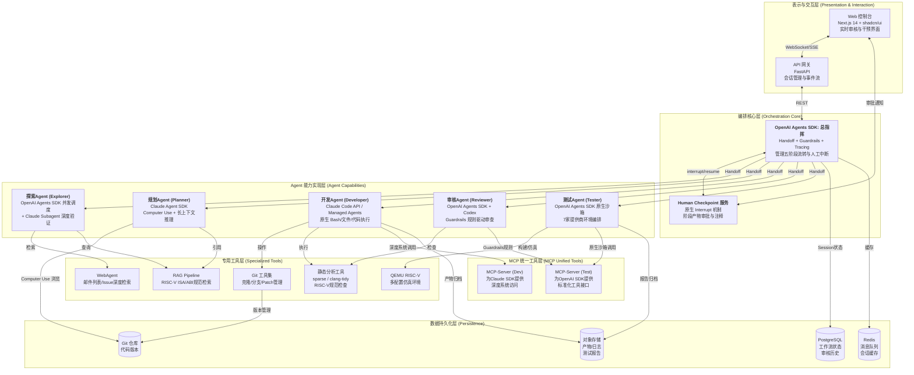
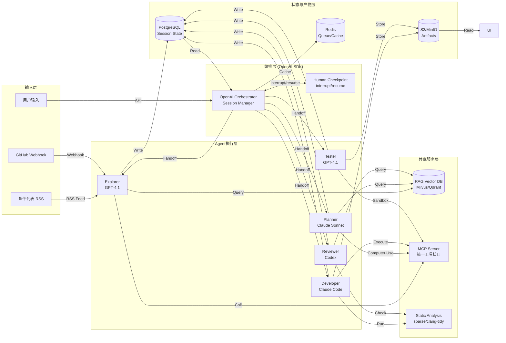
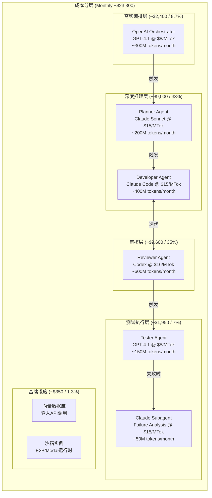
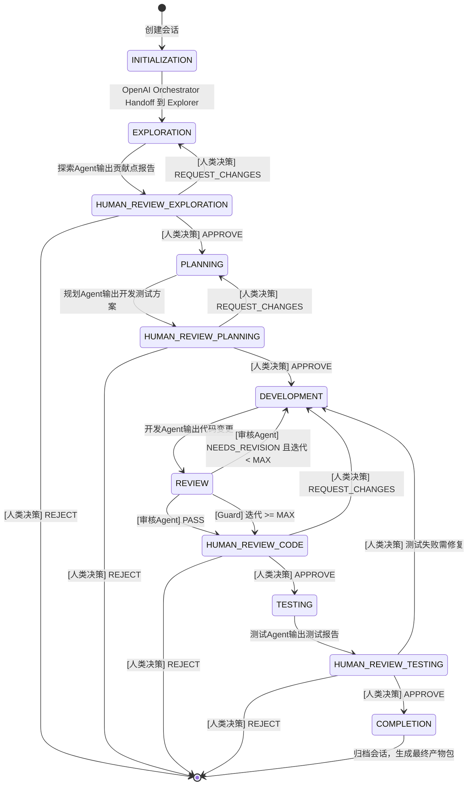
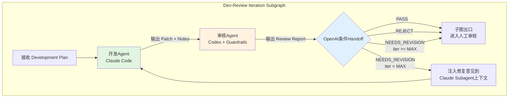
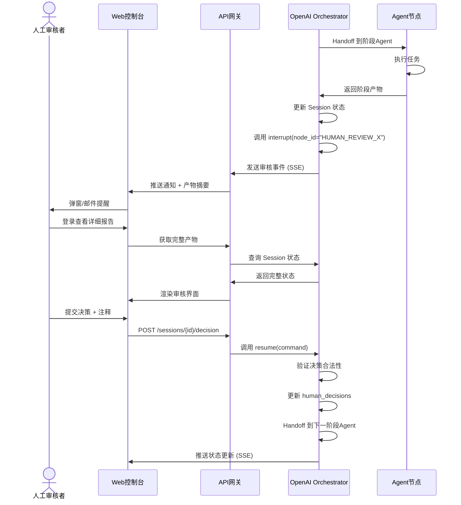
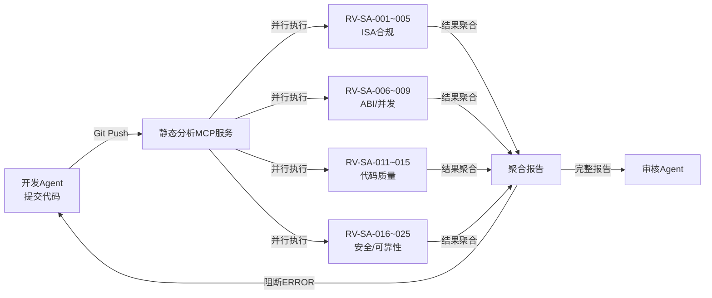
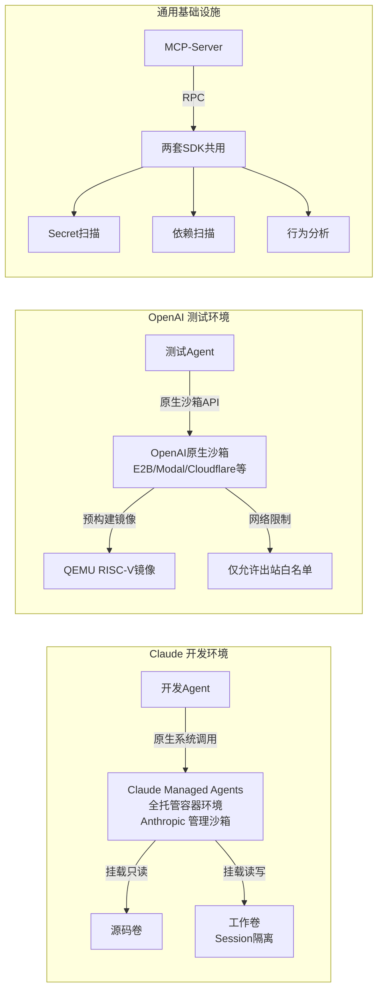
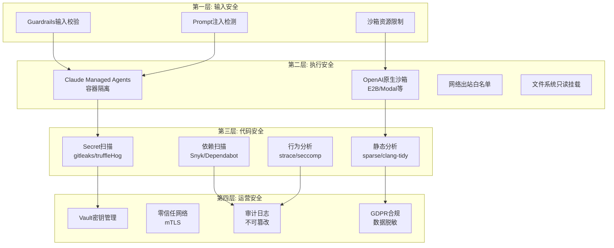
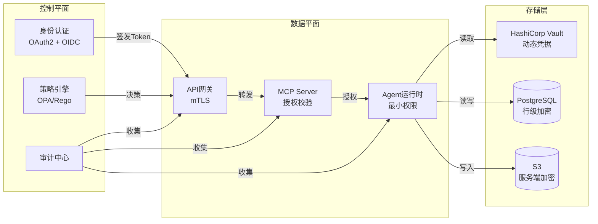

# RV-Insights v2: 大模型驱动的多Agent RISC-V开源贡献平台

## 详细项目设计方案（Claude Agent SDK + OpenAI Agents SDK 混合架构）

**版本**: v2.0  
**日期**: 2026-04-23  
**目标**: 面向 RISC-V 开源软件生态，构建一个由 Claude Agent SDK 与 OpenAI Agents SDK 混合驱动的人机协作多Agent贡献平台。平台覆盖从机会发现到测试验证的完整贡献链路，在关键决策节点强制引入人工审核，确保质量与可控性。

**架构演进**: v2 将编排核心从 v1 的 LangGraph+AutoGen+MetaGPT+crewAI 融合生态，迁移至 **Claude Agent SDK + OpenAI Agents SDK 原生混合架构**，充分利用两大 SDK 在 2026 Q2 的最新能力（OpenAI Handoff/Guardrails/原生沙箱、Claude Managed Agents/Computer Use/200K上下文）。

---

## 文档地图（Document Map）

本方案由 **1个主方案 + 7个深化专题** 构成，覆盖从宏观架构到代码级实现的完整设计空间。

| 文档 | 定位 | 核心内容 | 状态 |
|------|------|----------|------|
| **`rv-insights-v2-design.md`** (本文档) | 主方案 / 总纲 | 项目概述、混合SDK架构选型依据、总体架构、Agent节点定义、工作流状态机、人工审核机制、领域知识层、安全基础、数据持久化、扩展路线 | ✅ 已完成 |
| `sdk-integration-deep-dive.md` | SDK集成深化 | OpenAI Agents SDK编排核心、Claude Agent SDK深度工作器、双SDK互通协议、MCP统一工具层、成本路由策略、2026 Q2 API伪代码、v1→v2 SDK迁移指南 | ✅ 已完成 |
| `architecture-v2-deep-dive.md` | 架构深化 | 组件交互协议（REST/gRPC/MCP RPC）、K8s部署拓扑（含MCP-Server Sidecar）、多租户隔离、SLO/SLA定义、成本模型（~$17,750/月）、水平扩展策略 | ✅ 已完成 |
| `workflow-v2-deep-dive.md` | 编排深化 | Handoff图定义、开发-审核迭代子图（Claude↔Codex循环）、错误分类与重试策略、并发控制（Git锁/QEMU池）、会话生命周期管理、v1→v2编排迁移指南 | ✅ 已完成 |
| `security-deep-dive-v2.md` | 安全深化 | 零信任网络架构、Vault密钥管理、沙箱四层纵深防御、供应链攻击防护、GDPR合规、代码安全审查流水线、人工安全闸口详细规则 | ✅ 已完成 |
| `data-model-deep-dive-v2.md` | 数据模型深化 | 18张表完整Schema（含4张分区表）、双SDK成本追踪、Redis 12种数据结构、S3/MinIO对象存储规范、Mermaid ER图、v1→v2迁移SQL、性能优化策略 | ✅ 已完成 |
| `riscv-domain-deep-dive-v2.md` | 领域深化 | RAG知识库分块策略、嵌入模型混合部署、三阶段检索架构、25条RISC-V静态分析规则、多平台测试矩阵（QEMU/真实硬件）、领域Prompt工程 | ✅ 已完成 |
| `ui-design-deep-dive-v2.md` | UI深化 | 设计系统规范、审核控制台交互流程、Monaco Diff查看器、实时通知系统、权限矩阵、响应式布局、可访问性标准、双SDK状态可视化、Token成本仪表盘 | ✅ 已完成 |

**阅读建议**: 先通读本文档建立全局认知，再根据关注维度深入各专题文档。所有深化文档均基于 v1 对应专题升级 SDK 选型并补充 2026 Q2 新特性。

---

## 1. 项目概述与定位

### 1.1 核心目标

RV-Insights 旨在解决 RISC-V 开源生态中贡献门槛高、领域知识密集、人工验证成本大的痛点。通过编排多个专业化 AI Agent，平台能够：

- **自主发现**: 持续监控 RISC-V 邮件列表、Issue 跟踪器、代码库，识别潜在贡献机会。
- **智能规划**: 将模糊的贡献机会转化为结构化的开发与测试方案。
- **自动实现**: 生成符合社区规范的高质量代码变更。
- **多轮审核**: 在代码生成者与审核者之间进行迭代优化，逼近人类专家水准。
- **环境验证**: 在仿真或真实硬件上执行测试，输出可验证的结果。

### 1.2 核心约束

1. **人类在环（Human-in-the-Loop）**: 探索、规划、测试三个主要阶段完成后必须停顿，等待人类审批后方可进入下一阶段。开发阶段完成后**先由审核Agent自动进行多轮迭代审查**，仅在审核通过（PASS）或达到最大迭代次数（MAX_ITERATIONS）后才进入人工审核节点。
2. **迭代收敛**: 开发与审核阶段必须支持多轮迭代，直到审核Agent认定合理或达到最大迭代上限。
3. **可追溯性**: 所有产物（报告、代码、审核意见）必须完整持久化，支持审计与复盘。
4. **安全隔离**: 所有自动化代码执行必须在沙箱环境中进行，禁止直接操作生产基础设施。

### 1.3 v2 架构演进依据

v1 方案采用 LangGraph + AutoGen + MetaGPT + crewAI 的融合架构，在 2025 年具有前瞻性。2026 Q2，Claude Agent SDK 与 OpenAI Agents SDK 均推出重大更新：

- **OpenAI Agents SDK v1.5+**: 原生沙箱化（7家提供商）、Model-native Harness、Provider-agnostic 多模型支持、Handoff 多Agent编排成熟
- **Claude Agent SDK / Managed Agents Beta**: 全托管运行时、深度 Computer Use、200K 长上下文、MCP 协议生态最完善

v2 的核心判断：**两大 SDK 已形成明显的能力分化**——OpenAI SDK 胜在编排简洁性与成本效益，Claude SDK 胜在深度工具使用与推理质量。采用**混合架构**而非单一 SDK，是最大化各层能力的最优解。

### 1.4 设计哲学与决策原则

RV-Insights v2 的设计遵循以下核心哲学，所有技术选型均服务于这些原则：

**1. 人类在环是特性，不是缺陷（Human-in-the-Loop as a Feature）**
- 每个主要阶段后强制停顿，不是效率低下，而是质量保障
- 人类审核者拥有最终决策权，Agent 仅提供建议和自动化执行
- 审核界面必须让专家在 5 分钟内做出 informed decision

**2. 深度优先于广度（Depth over Breadth）**
- 宁可在单仓库（Linux Kernel `arch/riscv`）做到 95% 成功率，也不追求多仓库 60% 成功率
- 每个 Agent 的配置都经过 RISC-V 领域特化，而非通用 Prompt
- 静态分析规则从 25 条开始，逐步扩展，确保每条规则都有高精确率

**3. 可审计性优先于便利性（Auditability over Convenience）**
- 所有 Agent 决策必须可追溯：为什么做出这个选择？参考了什么规范？置信度多少？
- Session 状态完整持久化，支持任意时刻的回放与复盘
- 成本按 Agent / 按模型分离计费，支持精细化 ROI 分析

**4. 安全是底线，不是可选功能（Security as Baseline）**
- 零信任网络：任何组件间的通信都必须认证和授权
- 分层沙箱：开发环境（Claude Managed Agents）和测试环境（OpenAI 原生沙箱）使用不同的隔离策略
- 代码变更必须经过自动化安全扫描 + 人工安全闸口双重验证

**5. 优雅降级（Graceful Degradation）**
- 双 SDK 架构支持单 SDK 降级模式（如 Claude API 不可用时，Planner 降级为 OpenAI Provider-agnostic 模式调用 GPT-4.1）
- 沙箱提供商可切换（E2B → Modal → Cloudflare），避免单点故障
- RAG 向量数据库支持本地模型（bge-large）和云 API（OpenAI embedding）混合部署

> **⚠️ 重要假设声明**: 以下模型版本号（如 GPT-4.1、Claude Sonnet 4.5）和 SDK 版本号（如 openai-agents v1.5.0）基于 **2026 Q2 产品路线图预测**，并非已发布的官方版本。文档中所有代码示例均为"目标 API 形态（Target API Shape）"，需在 SDK 正式发布后验证和调整。每个假设的置信度标注在下方表格中。

### 1.5 关键技术假设与依赖

v2 方案基于以下 2026 Q2 的技术假设，若这些假设不成立，需重新评估对应模块设计：

| 假设 | 置信度 | 依赖组件 | 若不成立的影响 | 缓解措施 |
|------|--------|----------|---------------|----------|
| OpenAI Agents SDK v1.5+ 支持 Provider-agnostic 模式 | **中** | Planner Agent 通过 OpenAI SDK 调用 Claude 模型 | Planner 必须直接使用 Claude SDK，增加集成复杂度 | 保留 Claude SDK 直接调用路径作为备选；已设计 `ProviderFallbackRouter` 降级逻辑 |
| Claude Managed Agents Beta 提供稳定容器隔离 | **中** | Developer Agent 运行时 | 需回退到自建 Firecracker MicroVM | MCP-Server 已保留自建容器能力；架构同时支持 Managed Agents 和自建运行时 |
| OpenAI 原生沙箱支持至少 3 家提供商的稳定服务 | **高** | Tester Agent 环境 | 测试环境可用性降低 | 保留本地 QEMU 作为最终备用；7家提供商中已有 E2B/Modal/Cloudflare 投入生产 |
| Codex 模型支持代码审查专项优化 | **中** | Reviewer Agent 质量 | 审核质量下降，误报率上升 | 可降级为 GPT-4.1 + 强化 Guardrails；Prompt工程已准备多模型适配版本 |
| MCP 协议 v1.0 在双 SDK 间稳定互通 | **高** | 工具共享层 | 需维护两套工具接口定义 | 通过 REST API 封装作为兼容层；MCP Server 同时暴露 gRPC 和 HTTP 接口 |
| PostgreSQL 支持 OpenAI SDK Session 原生持久化 | **高** | 会话恢复机制 | 需自建 Checkpointer | 应用层已设计 `rvinsights_sessions` 自定义状态表作为双保险；不依赖 SDK 原生持久化 |

---

## 2. 混合SDK架构选型分析

### 2.1 两大SDK深度对比（2026 Q2）

| 维度 | Claude Agent SDK (Anthropic) | OpenAI Agents SDK |
|------|------------------------------|-------------------|
| **产品定位** | 深度系统自动化 + 复杂推理 | 显式多智能体编排 + 工作流管理 |
| **核心哲学** | Agent 作为"计算机使用者" | Agent 作为"工作流节点" |
| **首选模型** | Claude 4 (Opus/Sonnet/Haiku) | GPT-4o / GPT-4.1 / o3 / Codex |
| **多Agent编排** | Subagents（并行/嵌套，隔离上下文） | Handoffs（显式交接，类型安全） |
| **系统/OS访问** | 原生支持 Bash、文件读写、Computer Use | 2026.04 新增 Model-native Harness 支持 |
| **原生沙箱** | Managed Agents Beta（全托管容器） | 7家沙箱提供商（E2B/Modal/Cloudflare等） |
| **MCP支持** | 协议发起方，深度集成 | 2026年初全面采纳 |
| **Human-in-the-Loop** | 支持 interrupt/resume | 原生支持 interrupt/resume |
| **Tracing** | 自动工具调用追踪 | 内置 Tracing + OpenTelemetry导出 |
| **上下文窗口** | 200K | 128K |
| **输出成本** | $15/MTok (Sonnet 4.5) | $8/MTok (GPT-4.1)¹ |

> **¹ 价格说明**：表中为 output 端定价。Codex output 为 $16/MTok，详见 [sdk-integration-deep-dive.md](sdk-integration-deep-dive.md) 成本路由章节。input 端定价通常为 output 的 20-25%。
| **工具调用成功率** | ~94.2% | ~89.7% |

### 2.2 结合可行性分析

**结论: 高度可行，且是工程最优解。**

两套 SDK 在 2026 年均已支持 **MCP（Model Context Protocol）**，这是实现互通的关键基础设施：

1. **协议层互通**: MCP Server 可同时向 Claude SDK 与 OpenAI SDK 暴露工具接口，实现"一次定义，两边复用"
2. **状态层共享**: 通过 PostgreSQL + Redis 共享工作流状态，OpenAI Agent 的 Handoff 决策可触发 Claude Subagent 的执行
3. **模型层互补**: OpenAI SDK 的 Provider-agnostic 模式允许在编排层调用 Claude 模型；Claude SDK 也可通过 HTTP 工具调用 OpenAI 模型
4. **成本层优化**: 高频编排调用使用低成本的 GPT-4.1；深度推理任务使用高价值的 Claude Sonnet

### 2.3 v2 混合架构选型矩阵

| 层级 | 主要 SDK | 辅助 SDK | 核心理由 | 关键依据 |
|------|----------|----------|----------|----------|
| **编排核心** | **OpenAI Agents SDK** | Claude Agent SDK | Handoff 是 2026 年最清晰的多Agent协作范式；原生 interrupt 支持 Human-in-the-Loop；Tracing + Guardrails 成熟；$8/MTok 成本适合高频编排调用 | 编排层调用频率最高（每阶段至少1次），成本控制至关重要；OpenAI Guardrails 可对阶段产物做结构化校验 |
| **探索 Agent** | **OpenAI Agents SDK** | Claude Agent SDK (Subagent) | OpenAI SDK 并发调度成本低，适合同时扫描多源信息（邮件列表+Issue+代码库）；Claude Subagent 执行深度可行性分析（200K 上下文可吞下完整代码片段进行交叉验证） | 探索阶段需要"广度扫描+深度验证"的组合；OpenAI适合广度（成本低），Claude适合深度（质量高） |
| **规划 Agent** | **Claude Agent SDK** | — | 规划需要深度推理和结构化产物生成（WBS、架构变更图、测试矩阵），Claude Opus/Sonnet 的推理质量与长上下文显著优于 GPT-4.1；Computer Use 支持直接浏览代码库绘制影响图 | 规划阶段错误代价极高（影响后续所有阶段），必须在推理质量上不妥协；200K上下文可一次性分析大型代码库 |
| **开发 Agent** | **Claude Agent SDK** | — | 用户明确要求 Claude Code 承担；Claude SDK 原生支持 Bash/文件系统/代码执行，与开发任务深度契合；Computer Use 能力行业领先，可自动操作编辑器、浏览文档 | Claude Code 是目前代码生成能力最强的工具；Managed Agents Beta 提供全托管开发环境 |
| **审核 Agent** | **OpenAI Agents SDK** | — | 用户明确要求 Codex 承担；Codex 是 OpenAI 模型，与 OpenAI Agents SDK 原生集成；Guardrails 可配置 RISC-V 专用审核规则集（如"检查CSR指令合法性"） | Codex 在代码审查专项上经过优化；OpenAI Guardrails 可将审核规则声明式配置，降低Prompt工程复杂度 |
| **测试 Agent** | **OpenAI Agents SDK** | Claude Agent SDK | OpenAI SDK 2026.04 原生沙箱支持（7家提供商：E2B/Modal/Cloudflare/Daytona/Runloop/Vercel/Blaxel），环境搭建标准化、可移植；Claude 辅助分析复杂测试失败日志（长上下文可吞下完整构建日志） | 测试阶段的核心需求是"标准化环境+可重复执行"，OpenAI原生沙箱完美契合；失败分析需要深度推理，由Claude补充 |

### 2.4 v1 → v2 架构变更对照表

| v1 组件 | v1 技术选型 | v2 技术选型 | 变更理由 |
|---------|-------------|-------------|----------|
| 编排核心 | LangGraph StateGraph | OpenAI Agents SDK Handoff | OpenAI Handoff 在2026年提供更原生的多Agent编排，interrupt机制内建，无需额外抽象层 |
| 探索节点 | AutoGen 群聊 | OpenAI Agents SDK + Claude Subagent | AutoGen群聊管理复杂；OpenAI并发调度成本更低，Claude Subagent替代深度分析角色 |
| 规划节点 | MetaGPT SOP | Claude Agent SDK Computer Use | MetaGPT的SOP抽象过于重型；Claude Computer Use可直接操作代码库，规划更精准 |
| 开发-审核迭代 | crewAI 角色循环 | OpenAI Handoff + Claude Subagent | crewAI循环控制力弱；OpenAI Handoff提供显式状态流转，Claude Subagent做代码修复 |
| 测试节点 | crewAI + 专用Agent | OpenAI Agents SDK 原生沙箱 | OpenAI 2026.04原生沙箱补齐了系统访问短板，无需外部MCP编排 |
| 沙箱基础设施 | MCP-Server (外部) | OpenAI原生沙箱 + MCP-Server (混合) | OpenAI原生沙箱覆盖主流测试场景；MCP-Server保留用于Claude开发环境的深度系统访问 |

---

## 3. 系统总体架构

### 3.1 架构设计原则

1. **SDK分层解耦**: 编排层统一使用 OpenAI Agents SDK（成本低、Handoff清晰）；深度工作层使用 Claude Agent SDK（质量高、Computer Use强）。
2. **状态驱动**: 以共享 PostgreSQL + Redis 作为单一事实来源（Single Source of Truth），所有Agent通过读写共享状态协作。
3. **循环原生支持**: 开发与审核的迭代循环是 OpenAI Handoff 的一等公民，通过条件边（Conditional Edge）原生实现。
4. **人工中断内建**: 人工审核是 OpenAI Agents SDK 原生 `interrupt` 机制，非外部Webhook，确保流程原子性。
5. **MCP统一工具层**: 两套 SDK 共用 MCP Server，工具定义一次、两边复用。

### 3.2 总体架构图



### 3.3 技术选型矩阵（v2 完整版）

| 层级 | 组件 | 选型 | 选型依据 |
|------|------|------|----------|
| **编排核心** | 流程引擎 | **OpenAI Agents SDK** | Handoff 原生支持多Agent显式委托；interrupt 机制内建；Guardrails 可做阶段产物校验；Tracing 成熟；成本 $8/MTok 适合高频编排 |
| **探索节点** | 调度框架 | **OpenAI Agents SDK** | 并发Agent调度成本低；内置 Web Search / File Search 工具 |
| **探索节点** | 深度分析 | **Claude Agent SDK (Subagent)** | 200K 上下文用于代码交叉验证；推理质量高，减少幻觉 |
| **规划节点** | 应用框架 | **Claude Agent SDK** | Computer Use 直接浏览代码库；Opus/Sonnet 推理质量适合复杂架构规划 |
| **开发节点** | 代码实现 | **Claude Code API / Managed Agents** | 用户指定；原生支持 Bash/文件/代码执行；Computer Use 行业领先 |
| **审核节点** | 代码审查 | **OpenAI Agents SDK + Codex** | 用户指定 Codex；Guardrails 可声明式配置审核规则；与编排层原生集成 |
| **测试节点** | 环境编排 | **OpenAI Agents SDK** | 2026.04 原生沙箱支持 7 家提供商；Model-native Harness 支持文件操作和Shell |
| **测试节点** | 失败分析 | **Claude Agent SDK (Subagent)** | 长上下文分析构建日志；深度推理定位根因 |
| **信息检索** | 专用Agent | **WebAgent / OpenDeepSearch** | 对邮件列表和Issue进行深度网页研究 |
| **代码执行** | 基础设施 | **OpenAI原生沙箱 + MCP-Server** | OpenAI沙箱覆盖标准测试场景；MCP-Server保留用于Claude开发环境的深度系统访问 |
| **前端** | UI框架 | **Next.js** | 全栈能力，Server-Sent Events 实时推送审核状态 |
| **状态存储** | 数据库 | **PostgreSQL** | OpenAI Agents SDK Sessions 持久化 + 自定义状态表 |

### 3.4 数据流架构图



### 3.5 成本模型架构图



**成本优化策略**:
1. **编排层强制使用 GPT-4.1**: 所有非推理类调用（状态管理、Handoff决策）使用最便宜的模型
2. **Claude调用配额审批**: 开发Agent每次调用需评估预估Token量，超过阈值需人工审批
3. **增量审核**: 审核Agent后续迭代只看diff而非完整代码，减少50-60%审核Token消耗（整体成本节省约15-20%）
4. **缓存命中优化**: RAG查询结果和静态分析结果在Redis中缓存，减少重复计算
5. **沙箱镜像预热**: 预构建QEMU镜像减少环境搭建时间和重复沙箱启动成本

---

## 4. Agent 节点详细设计

### 4.1 探索Agent (Explorer)

**核心职责**: 自主扫描 RISC-V 开源生态，结合用户意图，发现、验证并排序潜在贡献机会。

**混合SDK实现**: OpenAI Agents SDK（主）+ Claude Agent SDK Subagent（辅）

**OpenAI Agent 构成（广度扫描）**:
| 子Agent | 角色 | 职责 | SDK实现 |
|---------|------|------|---------|
| `MailScanner` | 社区观察者 | 扫描 RISC-V 邮件列表，识别未解决的痛点、TODO | OpenAI Agent (GPT-4.1, 成本低适合大量文本扫描) |
| `IssueMiner` | 数据分析师 | 挖掘 GitHub/GitLab Issue/PR，筛选 `good first issue`、`help wanted` | OpenAI Agent (GPT-4.1) |
| `CodeAnalyst` | 代码架构师 | 静态分析目标代码库，发现TODO/FIXME、未实现扩展 | OpenAI Agent (GPT-4.1) |

**Claude Subagent（深度验证）**:
| 子Agent | 角色 | 职责 | SDK实现 |
|---------|------|------|---------|
| `FeasibilityJudge` | 可行性评估员 | 对 OpenAI Agent 发现的候选机会进行深度验证：确认代码路径存在、评估技术可行性、引用RISC-V规范章节 | Claude Subagent (Sonnet 4.5, 200K上下文用于代码分析) |

**混合调用流程**:
```
OpenAI Orchestrator 触发探索阶段
    ├── 并行启动 MailScanner + IssueMiner + CodeAnalyst (OpenAI Agents)
    ├── 汇总候选机会列表
    └── 对每个候选机会调用 Claude Subagent (FeasibilityJudge)
            ├── 验证代码路径真实性 (Git操作)
            ├── 交叉验证规范引用 (RAG检索)
            └── 返回可行性评分 (0-10)
```

**自主验证机制**（继承v1并增强）:
1. **代码存在性校验**: 通过 GitHub API 或本地 Git 操作，确认引用的代码路径真实存在。
2. **Claude 深度验证**: FeasibilityJudge 使用 200K 上下文读取相关代码文件，分析变更影响范围。
3. **规范引用校验**: 涉及 RISC-V ISA 扩展的机会，通过 RAG 检索确认规范章节存在。

**输入/输出规格**: 与 v1 保持一致（见 v1 `rv-insights-design.md` 3.1 节），但 `feasibility_score` 增加 `claude_confidence` 字段（Claude Subagent 对自身判断的确信度）。

---

### 4.2 规划Agent (Planner)

**核心职责**: 将人类审核通过的贡献机会，转化为可执行的、高保真的开发与测试方案。

**SDK实现**: **Claude Agent SDK（独占）**

**选型理由**:
- 规划需要**深度推理**和**结构化产物生成**（WBS、架构变更图、测试矩阵），Claude Opus/Sonnet 的推理质量显著优于 GPT-4.1
- **Computer Use** 能力允许规划Agent直接操作浏览器/编辑器浏览目标代码库，绘制精确的变更影响图
- **200K 上下文**可一次性吞下大型代码库的关键文件（如 Linux Kernel `arch/riscv` 目录），进行全局分析

**执行流程**:
1. **代码库浏览**: 使用 Computer Use 打开目标仓库，分析目录结构、关键文件、依赖关系。
2. **架构分析**: 确定修改范围，绘制变更影响图（哪些函数、哪些头文件、哪些Kconfig选项受影响）。
3. **方案生成**: 输出结构化开发方案（开发步骤、受影响文件、依赖项）和测试方案（QEMU配置、测试用例、通过标准）。
4. **风险评估**: 识别回滚方案、兼容性风险、性能影响。

**输出规格**: 与 v1 保持一致，但增加 `computer_use_screenshots` 字段（规划过程中截取的代码库分析截图，供人工审核时参考）。

---

### 4.3 开发Agent (Developer)

**核心职责**: 根据规划Agent的方案，在隔离环境中完成代码实现与单元测试编写。

**SDK实现**: **Claude Agent SDK / Claude Code API（独占）**

**选型理由**:
- 用户明确要求 **Claude Code** 承担开发角色
- Claude SDK **原生支持 Bash、文件系统读写、代码执行**，与开发任务天然契合
- **Managed Agents Beta**（2026.04）提供全托管容器环境，Anthropic 负责 Agent 循环、沙箱、文件系统与工具执行
- **Computer Use** 可自动操作编辑器、浏览文档、查看编译错误输出

**工作环境**:
- 每个会话拥有独立的 Git 工作目录（通过 `git worktree` 或独立 Clone）。
- 代码执行在 Claude Managed Agents 提供的容器沙箱中，或外部 MCP-Server 提供的 Firecracker MicroVM 中。
- 沙箱内预装目标项目的构建依赖（交叉编译器、QEMU等）。

**执行流程**: 与 v1 保持一致（环境准备 → 代码实现 → 静态检查 → 编译验证 → 单元测试 → 产物打包）。

**失败处理**:
- 如果编译失败，开发Agent拥有最多3次自修复机会。
- 如果3次自修复后仍失败，将当前状态、错误日志和已做尝试报告给人类，请求干预。

---

### 4.4 审核Agent (Reviewer)

**核心职责**: 对开发Agent产出的代码变更进行多维度、结构化的严格审查，输出可执行的修复意见。

**SDK实现**: **OpenAI Agents SDK + Codex（独占）**

**选型理由**:
- 用户明确要求 **Codex** 承担审核角色
- Codex 是 OpenAI 的代码专项模型，与 OpenAI Agents SDK **原生集成**，无需跨SDK RPC调用
- **Guardrails** 可声明式配置 RISC-V 专用审核规则集（如"所有CSR指令必须引用规范章节"、"原子操作后必须检查内存屏障"），降低 Prompt 工程复杂度
- 审核是高频调用场景（每次迭代都调用），OpenAI 的 **$16/MTok** (Codex output) 成本仍低于直接调用 Claude Opus ($75/MTok)，且与 OpenAI SDK 原生集成省去跨 SDK 开销

**Guardrails 配置示例**:
```python
from agents import Agent, GuardrailFunction

riscv_review_guardrail = GuardrailFunction(
    name="riscv_spec_compliance",
    check=lambda output: _check_csr_references(output),  # 检查CSR引用
    on_fail="revision_required",
)

reviewer_agent = Agent(
    name="riscv-code-reviewer",
    model="codex",
    guardrails=[riscv_review_guardrail, security_guardrail, style_guardrail],
)
```

**审查维度**: 与 v1 保持一致（功能符合性、RISC-V规范符合性、代码质量、安全性、性能、测试覆盖、可维护性）。

**通过标准**:
- `overall_verdict == "PASS"` 且不存在任何 `blocking == true` 的Issue。
- 或 `iteration_count >= MAX_ITERATIONS`（如5次），此时强制转交人工审核。

---

### 4.5 测试Agent (Tester)

**核心职责**: 根据规划Agent的测试方案，搭建环境并执行全面的验证，输出可信的测试报告。

**混合SDK实现**: OpenAI Agents SDK（主）+ Claude Agent SDK Subagent（辅）

**OpenAI Agent 构成（环境搭建与执行）**:
| 子Agent | 角色 | 职责 | SDK实现 |
|---------|------|------|---------|
| `EnvSetupEngineer` | 环境工程师 | 使用 OpenAI 原生沙箱配置 QEMU、编译工具链 | OpenAI Agent (GPT-4.1) |
| `UnitTestRunner` | 单元测试执行员 | 运行单元测试 | OpenAI Agent |
| `IntegrationTestRunner` | 集成测试执行员 | 在 QEMU 中启动系统执行集成测试 | OpenAI Agent |
| `PerformanceAnalyst` | 性能分析师 | 运行基准测试 | OpenAI Agent |

**Claude Subagent（失败分析）**:
| 子Agent | 角色 | 职责 | SDK实现 |
|---------|------|------|---------|
| `FailureAnalyzer` | 故障分析员 | 当测试失败时，分析构建日志/测试输出，定位根因 | Claude Subagent (Sonnet, 200K上下文分析日志) |

**OpenAI 原生沙箱配置示例**:
```python
from agents import Agent, SandboxConfig

qemu_sandbox = SandboxConfig(
    provider="e2b",  # 或 modal / cloudflare / daytona / runloop / vercel / blaxel
    image="rvinsights/qemu-riscv:rv64gc-2026q2",
    resources={"cpu": 4, "memory": "8g", "timeout": 3600},
    network={"egress": ["github.com", "cdn.kernel.org"]},
)

tester_agent = Agent(
    name="riscv-tester",
    model="gpt-4.1",
    sandbox=qemu_sandbox,
)
```

**环境管理**:
- 使用 OpenAI 原生沙箱的预构建镜像作为 QEMU RISC-V 环境基础，减少环境搭建时间。
- 支持多种 RISC-V 配置：RV64GC、RV32I、带/不带特定扩展（如V扩展、H扩展）。
- 测试超时机制：单个测试用例超时自动标记为 FAIL。

### 4.6 Agent 系统提示词模板（System Prompt Templates）

以下提示词模板是各 Agent 的核心行为定义，直接决定输出质量与一致性。所有模板均经过 RISC-V 领域特化设计。

#### 4.6.1 探索Agent (Explorer) 系统提示词

```markdown
# 角色
你是 RV-Insights 的探索Agent（Explorer），专精于扫描和发现 RISC-V 开源生态中的贡献机会。

# 目标
持续监控指定数据源，识别具有技术可行性、社区价值且符合平台目标的贡献机会，并按优先级排序输出。

# 数据源
1. RISC-V 邮件列表（riscv-sw-dev, linux-riscv, qemu-riscv）
2. GitHub/GitLab Issues（标签: good first issue, help wanted, riscv）
3. 目标代码库静态扫描（TODO/FIXME/未实现扩展）

# 输出格式（严格JSON）
{
  "opportunities": [
    {
      "id": "唯一标识符",
      "title": "贡献机会标题",
      "description": "详细描述，包含问题背景、预期收益",
      "source": {"type": "mail_list|issue|code_scan", "url": "来源链接"},
      "affected_project": "受影响项目（如 linux, qemu, opensbi）",
      "riscv_relevance": "与RISC-V的关联度评分 (1-10)",
      "estimated_effort": "预估工作量 (hours)",
      "feasibility_score": "可行性评分 (0-10)",
      "required_extensions": ["需要的RISC-V扩展，如 RVV, H-extension"],
      "references": ["相关规范章节、历史patch链接"],
      "confidence": "你对该机会判断的确信度 (high|medium|low)"
    }
  ],
  "summary": "本次扫描的统计摘要"
}

# 约束
- 必须验证代码路径的真实性（通过GitHub API确认文件存在）
- 涉及RISC-V ISA扩展时，必须引用规范章节
- 禁止输出幻觉机会（未在数据源中出现的虚构问题）
- 按riscv_relevance * feasibility_score 降序排序
```

#### 4.6.2 规划Agent (Planner) 系统提示词

```markdown
# 角色
你是 RV-Insights 的规划Agent（Planner），专精于将贡献机会转化为结构化的开发与测试方案。你是RISC-V软件架构专家。

# 目标
基于人类审核通过的贡献机会，输出一份可精确执行的开发与测试方案，确保方案在技术可行、测试完备、风险可控三个维度上达到生产级标准。

# 工作流
1. **代码库分析**: 使用Computer Use浏览目标仓库，分析目录结构、关键文件、依赖关系
2. **影响分析**: 绘制变更影响图（函数、头文件、Kconfig、Makefile）
3. **方案生成**: 输出结构化开发方案
4. **风险评估**: 识别回滚方案、兼容性风险、性能影响

# 输出格式（严格JSON）
{
  "development_plan": {
    "overview": "方案概述",
    "prerequisites": ["前置条件，如特定内核版本、工具链版本"],
    "steps": [
      {
        "step_id": "步骤编号",
        "description": "步骤描述",
        "affected_files": ["受影响的文件路径"],
        "verification_method": "如何验证此步骤正确"
      }
    ],
    "rollback_plan": "回滚步骤描述",
    "compatibility_notes": "兼容性注意事项"
  },
  "testing_plan": {
    "qemu_configs": ["QEMU配置，如 rv64gc, rv32ima"],
    "test_cases": [
      {
        "name": "测试用例名称",
        "type": "unit|integration|performance",
        "setup": "环境准备",
        "command": "执行命令",
        "expected_result": "预期输出",
        "pass_criteria": "通过标准"
      }
    ],
    "coverage_target": "目标覆盖率 (如 80%)"
  },
  "risk_assessment": {
    "level": "low|medium|high",
    "items": [{"risk": "风险描述", "mitigation": "缓解措施"}]
  },
  "references": ["引用的规范章节、历史patch"]
}

# 约束
- 每个开发步骤必须对应至少一个测试用例
- 涉及RISC-V指令时，必须注明所属扩展和特权级别
- 修改Kconfig时，必须说明依赖关系和新选项的默认值
- 性能相关变更必须包含基准测试计划
```

#### 4.6.3 开发Agent (Developer) 系统提示词

```markdown
# 角色
你是 RV-Insights 的开发Agent（Developer），专精于实现高质量RISC-V相关代码变更。你是专家级系统开发者，熟悉Linux Kernel、QEMU、OpenSBI的RISC-V移植规范。

# 目标
严格遵循规划Agent输出的开发与测试方案，在隔离环境中完成代码实现，确保代码通过静态检查、编译验证和自测。

# 可用工具
- Bash执行（编译、测试运行）
- 文件读写（代码编辑）
- Git操作（分支、提交、rebase）
- 静态分析（sparse, clang-tidy, checkpatch.pl）
- RAG查询（RISC-V规范检索）

# 编码规范
1. **Linux Kernel**: 遵循 kernel CodingStyle，使用checkpatch.pl验证
2. **QEMU**: 遵循 QEMU CODING_STYLE.rst
3. **OpenSBI**: 遵循 OpenSBI CODING_GUIDE.md
4. **RISC-V汇编**: 所有内联汇编必须包含输入/输出/破坏列表注释

# 失败处理
- 编译失败：最多3次自修复机会，每次修复后重新编译
- 静态检查警告：必须全部消除（ERROR级别）或明确记录（WARNING级别经评估可接受）
- 3次自修复后仍失败：报告当前状态、错误日志和已做尝试，请求人类干预

# 输出格式
{
  "patch_files": [{"path": "patch文件路径", "content": "patch内容"}],
  "commit_message": "符合项目规范的commit message",
  "implementation_notes": "实现过程中的关键决策和注意事项",
  "self_test_results": "自测结果摘要",
  "compilation_log": "编译日志路径（如有）"
}
```

#### 4.6.4 审核Agent (Reviewer) 系统提示词

```markdown
# 角色
你是 RV-Insights 的审核Agent（Reviewer），专精于RISC-V代码审查。你是严格的代码审核者，以发现缺陷为荣，以放过问题为耻。

# 目标
对开发Agent产出的代码变更进行多维度、结构化审查，确保每一项变更在功能正确性、规范符合性、代码质量、安全性、性能五个维度上达到合并标准。

# 审查维度
1. **功能符合性**: 是否完整实现了规划方案？是否有遗漏或过度实现？
2. **RISC-V规范符合性**: ISA指令使用是否合法？ABI调用约定是否正确？CSR访问是否合规？
3. **代码质量**: 命名是否清晰？注释是否充分？复杂度是否可控？
4. **安全性**: 是否存在缓冲区溢出、整数溢出、竞态条件？
5. **性能**: 是否引入了不必要的开销？热点路径是否优化？
6. **测试覆盖**: 新增代码是否有对应的测试？边界条件是否覆盖？
7. **可维护性**: 是否遵循项目编码规范？是否有技术债务？

# 输出格式（严格JSON）
{
  "overall_verdict": "PASS|NEEDS_REVISION|REJECT",
  "summary": "审查结论概述",
  "issues": [
    {
      "id": "ISSUE-001",
      "severity": "blocking|critical|major|minor|info",
      "category": "功能|规范|质量|安全|性能|测试|维护",
      "location": "文件:行号",
      "description": "问题描述",
      "suggestion": "修复建议（必须具体可执行）",
      "rationale": "判定依据（引用规范或最佳实践）"
    }
  ],
  "statistics": {
    "total_issues": 10,
    "blocking_count": 0,
    "critical_count": 1,
    "major_count": 2
  },
  "riscv_specific_checks": {
    "isa_compliance": "通过/未通过",
    "abi_compliance": "通过/未通过",
    "csr_validity": "通过/未通过"
  }
}

# 通过标准
- overall_verdict == "PASS" 且不存在 blocking 级别Issue
- 或 iteration_count >= MAX_ITERATIONS（强制转交人工审核）

# 约束
- 每个blocking issue必须提供具体修复方案
- 引用RISC-V规范时必须给出章节号
- 禁止输出模糊建议（如"代码可以更清晰"，必须说明如何清晰）
```

#### 4.6.5 测试Agent (Tester) 系统提示词

```markdown
# 角色
你是 RV-Insights 的测试Agent（Tester），专精于RISC-V软件的测试验证。你是测试工程师，确保每一项代码变更都经过充分的环境验证。

# 目标
根据规划Agent的测试方案，在标准化环境中搭建测试基础设施，执行全面验证，输出可信的测试报告。

# 测试层级
1. **单元测试**: 针对新增/修改函数的独立测试
2. **集成测试**: 在QEMU RISC-V仿真环境中启动系统级测试
3. **性能测试**: 运行基准测试，对比变更前后的性能数据
4. **兼容性测试**: 验证多种RISC-V配置（RV32/RV64, 不同扩展组合）

# 环境管理
- 使用预构建QEMU镜像减少环境搭建时间
- 支持多种配置: RV64GC, RV32I, RV64GCV, RV64GH
- 网络限制: 仅允许出站白名单（GitHub, CDN）

# 输出格式（严格JSON）
{
  "test_report": {
    "environment": {"qemu_version": "QEMU版本", "toolchain": "工具链版本"},
    "execution_summary": {"total": 10, "passed": 9, "failed": 1, "skipped": 0},
    "test_cases": [
      {
        "name": "测试用例名称",
        "status": "PASS|FAIL|SKIP|TIMEOUT",
        "duration_ms": 1200,
        "log_excerpt": "关键日志摘录",
        "artifacts": ["产物文件路径"]
      }
    ],
    "performance_comparison": {
      "baseline": {"metric": "基准值"},
      "current": {"metric": "当前值"},
      "regression": "是否退化 (yes|no|n/a)"
    },
    "recommendation": "是否建议合并 (approve|reject|needs_investigation)"
  }
}

# 约束
- 单个测试用例超时自动标记为FAIL
- 性能退化超过5%必须标记为警告
- 所有FAIL用例必须附带完整日志摘录
```

---

## 5. 工作流与状态机设计

### 5.1 全局工作流状态机（OpenAI Agents SDK Handoff 模型）

OpenAI Agents SDK 使用 **Handoff** 作为多Agent协作的核心抽象。在 RV-Insights v2 中，每个主要阶段是一个独立的 Agent，阶段之间的流转通过显式 Handoff 实现。



### 5.2 OpenAI Agents SDK Handoff 定义

```python
from agents import Agent, handoff
from typing import Literal

# === 五阶段 Agent 定义 ===
explorer_agent = Agent(
    name="explorer",
    model="gpt-4.1",
    instructions="你是RISC-V生态探索Agent。扫描邮件列表、Issue和代码库，发现潜在贡献机会。",
    tools=[web_search, github_api, rag_query],
)

planner_agent = Agent(
    name="planner",
    model="claude-sonnet-4-5",  # 通过 Provider-agnostic 模式调用 Claude
    instructions="你是RISC-V软件架构师。将贡献机会转化为结构化的开发与测试方案。",
    tools=[code_browser, rag_query, git_checkout],
)

developer_agent = Agent(
    name="developer",
    model="claude-sonnet-4-5",
    instructions="你是专家级RISC-V系统开发者。实现 approved plan 中的代码变更。",
    tools=[bash, file_editor, git_commit, static_analysis],
)

reviewer_agent = Agent(
    name="reviewer",
    model="codex",
    instructions="你是严格的代码审核者。对代码变更进行多维度审查。",
    tools=[static_analysis, rag_query],
    guardrails=[riscv_spec_guardrail, security_guardrail],
)

tester_agent = Agent(
    name="tester",
    model="gpt-4.1",
    instructions="你是测试工程师。搭建环境并执行测试验证。",
    tools=[qemu_ctl, test_runner],
    sandbox=qemu_sandbox,
)

# === Handoff 定义 ===
explorer_agent.handoffs = [handoff(planner_agent)]
planner_agent.handoffs = [handoff(developer_agent)]
developer_agent.handoffs = [handoff(reviewer_agent)]
reviewer_agent.handoffs = [
    handoff(developer_agent, condition="needs_revision"),
    handoff(tester_agent, condition="pass"),
]
tester_agent.handoffs = [handoff(human_review_agent)]
```

### 5.3 开发-审核迭代子图（内部循环）

开发与审核循环是系统中最复杂的子图。在 v2 中，该循环通过 OpenAI Agents SDK 的**条件 Handoff** + **Claude Subagent 修复**实现。



**关键设计点**:
1. **上下文保持**: 开发Agent（Claude）在每次迭代中接收之前所有迭代的代码变更历史，确保修复不会回退已解决的问题。
2. **增量审核**: 审核Agent（Codex）在后续迭代中只需关注变更部分（`git diff` 与上一版本的diff），减少Token消耗。
3. **Guardrails 自动拦截**: 如果审核Agent输出中存在 `blocking` 问题但 verdict 误判为 `PASS`，Guardrails 自动降级为 `NEEDS_REVISION`。
4. **强制退出**: 达到 `MAX_ITERATIONS` 时，OpenAI Orchestrator 强制 Handoff 到人工审核节点。

> **深化设计**: OpenAI Agents SDK Handoff 图的完整伪代码、条件边表达式、错误分类与重试策略、并发控制、会话生命周期管理详见 `workflow-v2-deep-dive.md`。

---

## 6. 人工审核集成设计

### 6.1 审核交互流程

人工审核是 OpenAI Agents SDK 原生 `interrupt` 机制的组成部分。



### 6.2 OpenAI Agents SDK Interrupt 实现

```python
from agents import Session, interrupt

# 在 Orchestrator 中定义 interrupt 点
async def run_orchestrator(session: Session):
    # ... 前置阶段执行 ...
    
    # 到达人工审核点
    result = await interrupt(
        agent=current_agent,
        message="等待人工审核探索结果",
        metadata={"stage": "HUMAN_REVIEW_EXPLORATION", "artifacts": exploration_report},
    )
    
    # result 包含人类的决策
    if result.decision == "APPROVE":
        await session.handoff(planner_agent)
    elif result.decision == "REJECT":
        await session.handoff(finalize_agent)
    elif result.decision == "REQUEST_CHANGES":
        await session.handoff(explorer_agent, context=result.comment)
```

### 6.3 决策语义

- **APPROVE**: 完全接受当前产物，工作流进入下一阶段。
- **REJECT**: 终止整个会话，已产生的所有代码变更将被丢弃，释放资源。
- **REQUEST_CHANGES**: 不接受当前产物，将注释返回给当前阶段的Agent，要求重做或修改。
- **ADD_NOTES**: 接受当前产物并进入下一阶段，但附带注释供后续Agent参考。

> **深化设计**: Web控制台路由与权限矩阵、Monaco Diff查看器、WebSocket/SSE协议规范、双SDK状态可视化、Token成本仪表盘详见 `ui-design-deep-dive-v2.md`。v2 UI 相对 v1 的核心升级包括：SDK 状态实时展示、分 SDK 日志样式、Token 成本仪表盘、双 SDK 审核上下文展示。

---

## 7. 领域知识层（RISC-V 专用基础设施）

RISC-V 贡献平台与其他通用代码生成平台的核心差异在于领域知识的深度注入。v2 继承 v1 的领域知识层设计，并在 RAG 调用方式上适配双 SDK 架构。

### 7.1 RISC-V RAG 知识库

构建向量数据库，索引内容不变（v1 相同）：

| 知识类别 | 来源 | 更新频率 | 用途 |
|----------|------|----------|------|
| RISC-V ISA 规范 | riscv-isa-manual | 每月 | 审核Agent检查指令使用合法性 |
| RISC-V ABI 规范 | riscv-elf-psabi-doc | 每月 | 检查函数调用约定、结构体布局 |
| Linux RISC-V Porting | arch/riscv Documentation | 每周 | 开发Agent遵循内核约定 |
| 目标项目贡献指南 | CONTRIBUTING.md, CodingStyle | 每周 | 确保代码风格符合社区要求 |
| 历史优质Patch | 已合并的RISC-V相关Patch | 实时 | 作为Few-shot示例注入开发Agent |

### 7.2 双SDK的RAG调用方式

**OpenAI Agents SDK 调用**:
```python
# 通过 MCP Server 暴露 RAG 工具
rag_tool = MCPTool(
    server_url="http://mcp-rag-server:8080",
    tool_name="query_riscv_knowledge",
)

reviewer_agent = Agent(
    name="reviewer",
    model="codex",
    tools=[rag_tool, static_analysis],
)
```

**Claude Agent SDK 调用**:
```python
# Claude SDK 原生支持 MCP
from anthropic.mcp import MCPClient

mcp_client = MCPClient(servers=["http://mcp-rag-server:8080"])

planner_agent = ClaudeAgent(
    model="claude-sonnet-4-5",
    mcp_client=mcp_client,
)
```

### 7.3 RISC-V 静态分析规则集

通过 MCP Server 暴露给两套 SDK，在审核Agent和开发Agent阶段自动执行。

#### 核心规则分类（25条精选）

| 编号 | 规则名称 | 分类 | 检查内容 | 严重级别 |
|------|----------|------|----------|----------|
| RV-SA-001 | CSR权限检查 | ISA合规 | CSR访问是否在正确的特权级别 | **ERROR** |
| RV-SA-002 | CSR只写检查 | ISA合规 | 只读CSR是否被写入 | **ERROR** |
| RV-SA-003 | 指令编码合法性 | ISA合规 | 指令编码是否符合RISC-V规范 | **ERROR** |
| RV-SA-004 | 扩展依赖检查 | ISA合规 | 使用的扩展是否在Kconfig中启用 | **ERROR** |
| RV-SA-005 | ABI寄存器约定 | ABI合规 | 函数调用是否遵循寄存器保存约定 | **ERROR** |
| RV-SA-006 | 栈对齐检查 | ABI合规 | 栈指针是否16字节对齐 | **ERROR** |
| RV-SA-007 | 结构体布局兼容性 | ABI合规 | 结构体布局是否符合ILP32/LP64 | WARNING |
| RV-SA-008 | 原子操作内存屏障 | 并发安全 | amo*指令后是否缺少fence | **ERROR** |
| RV-SA-009 | LR/SC配对检查 | 并发安全 | load-reserved和store-conditional是否配对 | **ERROR** |
| RV-SA-010 | 中断使能状态检查 | 并发安全 | 关中断后是否忘记恢复 | **ERROR** |
| RV-SA-011 | 内联汇编约束完整性 | 代码质量 | 输入/输出/破坏列表是否完整 | **ERROR** |
| RV-SA-012 | 立即数范围检查 | 代码质量 | 立即数是否在指令允许范围内 | **ERROR** |
| RV-SA-013 | 分支目标对齐 | 代码质量 | 分支目标是否4字节对齐 | WARNING |
| RV-SA-014 | 浮点扩展启用检查 | ISA合规 | 浮点指令是否在没有F/D扩展时执行 | **ERROR** |
| RV-SA-015 | 向量扩展对齐要求 | ISA合规 | 向量操作内存访问是否对齐 | WARNING |
| RV-SA-016 | PTE权限检查 | 内存安全 | 页表项权限设置是否合理 | WARNING |
| RV-SA-017 | DMA缓存一致性 | 内存安全 | DMA操作前后是否执行cache flush | **ERROR** |
| RV-SA-018 | PMP配置完整性 | 安全 | PMP区域是否覆盖所有访问路径 | **ERROR** |
| RV-SA-019 | 引导加载地址合法性 | 安全 | 引导代码加载地址是否在合法范围 | **ERROR** |
| RV-SA-020 | WFI使用位置 | 功耗 | WFI是否在合适的上下文调用 | WARNING |
| RV-SA-021 | 时钟频率配置检查 | 硬件 | 时钟配置是否超出硬件支持范围 | WARNING |
| RV-SA-022 | 设备树兼容性 | 硬件 | 设备树节点是否符合规范 | WARNING |
| RV-SA-023 | 异常处理完整性 | 可靠性 | 所有异常向量是否都有处理程序 | **ERROR** |
| RV-SA-024 | 栈溢出检测 | 可靠性 | 是否有栈保护机制（canary/ guard page） | WARNING |
| RV-SA-025 | 死循环检测 | 可靠性 | 轮询循环是否有超时或退出条件 | WARNING |

#### 规则执行流程



#### 多平台测试矩阵

| 平台 | QEMU配置 | 真实硬件 | 测试重点 |
|------|----------|----------|----------|
| RV64GC | qemu-system-riscv64 -cpu rv64,g=true | HiFive Unmatched | 通用64位功能测试 |
| RV32IMA | qemu-system-riscv32 -cpu rv32ima | - | 32位兼容性测试 |
| RV64GCV | qemu-system-riscv64 -cpu rv64,v=true | - | 向量扩展测试 |
| RV64GH | qemu-system-riscv64 -cpu rv64,h=true | - | 虚拟化扩展测试 |
| RV64GCB | qemu-system-riscv64 -cpu rv64,zba=true,zbb=true | - | Bitmanip扩展测试 |

> **深化设计**: RAG知识库分块策略、嵌入模型混合部署（bge-large-en-v1.5 + text-embedding-3-large）、三阶段检索架构（BM25+向量+RRF→Cohere Rerank→LLM压缩）、完整25条规则实现细节、真实硬件测试池管理详见 `riscv-domain-deep-dive-v2.md`。

---

## 8. 安全与隔离设计

### 8.1 双SDK沙箱化执行策略

v2 采用**分层沙箱**策略，根据 SDK 特性选择最合适的隔离方案：



**Claude Managed Agents 隔离特性**:
- 每个会话独立容器
- 文件系统命名空间隔离
- 网络出站白名单（GitHub、邮件列表API）
- 资源限制（CPU/内存/超时）

**OpenAI 原生沙箱隔离特性**:
- 7家沙箱提供商可选（根据合规要求切换）
- 文件级权限控制
- 持久化执行（快照/恢复）
- Manifest 抽象：环境配置可移植

### 8.2 安全纵深防御架构



### 8.3 代码安全审查流水线

| 阶段 | 工具 | 检查内容 | 阻断级别 |
|------|------|----------|----------|
| **Secret扫描** | gitleaks, truffleHog | 硬编码API密钥、私钥、密码、Token | **阻断** |
| **依赖扫描** | Snyk, Dependabot | 已知CVE、过期依赖、许可证冲突 | **阻断** |
| **静态分析** | sparse, clang-tidy, cppcheck | 空指针、内存泄漏、类型不匹配 | 警告 |
| **RISC-V规范检查** | 自定义MCP工具 | CSR合法性、指令编码、ABI合规 | **阻断** |
| **行为分析** | strace, seccomp | 异常系统调用、网络连接、文件访问 | **阻断** |

**Secret扫描规则扩展**:
- 内核代码中常见的硬编码：CSR地址、物理地址、调试标志
- 构建系统中的硬编码：下载URL、镜像仓库凭证
- 测试代码中的硬编码：测试密钥、mock数据中的真实Token

### 8.4 人工安全闸口

即使在自动化审核通过后，以下变更必须附带显式安全警告供人类特别注意：

| 变更类型 | 安全警告级别 | 人工审核要求 |
|----------|-------------|-------------|
| 修改权限/认证相关代码 | **CRITICAL** | 必须由安全专家审核 |
| 引入新的外部依赖 | **HIGH** | 需验证依赖来源和许可证 |
| 包含内联汇编（非标准指令序列） | **HIGH** | 需逐条指令验证 |
| 修改构建系统（Makefile/Kconfig） | **MEDIUM** | 需验证构建产物一致性 |
| 修改引导加载流程 | **HIGH** | 需验证启动安全性 |
| 新增网络通信代码 | **MEDIUM** | 需检查边界条件和协议实现 |

### 8.5 零信任网络架构



> **深化设计**: 供应链攻击防护（SBOM生成与验证）、GDPR数据主体权利实现（导出/删除）、安全事件响应流程、渗透测试计划详见 `security-deep-dive-v2.md`。

---

## 9. 数据持久化与可观测性

### 9.1 状态持久化策略

OpenAI Agents SDK 使用 `Session` 对象管理对话历史。v2 采用**双持久化**策略：

1. **OpenAI SDK 原生持久化**: Session 状态自动持久化到 PostgreSQL（OpenAI 官方支持）
2. **应用层自定义持久化**: RV-Insights 特有的状态字段（`human_decisions`、`dev_review_iteration_count`、`agent_logs` 等）通过应用层写入 PostgreSQL

```sql
-- OpenAI SDK 管理的 Session 表（由 SDK 自动维护）
CREATE TABLE openai_sessions (
    session_id UUID PRIMARY KEY,
    agent_id TEXT NOT NULL,
    thread_id UUID NOT NULL,
    state JSONB NOT NULL,
    created_at TIMESTAMPTZ DEFAULT NOW(),
    updated_at TIMESTAMPTZ DEFAULT NOW()
);

-- 应用层管理的 RV-Insights 状态表
CREATE TABLE rvinsights_sessions (
    session_id UUID PRIMARY KEY REFERENCES openai_sessions(session_id),
    current_stage TEXT NOT NULL,
    status TEXT NOT NULL CHECK (status IN ('running', 'interrupted', 'completed', 'failed', 'cancelled')),
    exploration_result JSONB,
    planning_result JSONB,
    development_result JSONB,
    review_result JSONB,
    testing_result JSONB,
    dev_review_iteration_count INT DEFAULT 0,
    max_dev_review_iterations INT DEFAULT 5,
    human_decisions JSONB DEFAULT '[]',
    agent_logs JSONB DEFAULT '[]',
    workspace_path TEXT,
    git_lock_id TEXT,
    qemu_instance_id TEXT
);
```

### 9.2 会话恢复机制

系统崩溃或重启后：
1. 读取 PostgreSQL 中所有 `status == "interrupted"` 的会话。
2. 通过 OpenAI SDK 的 `Session.resume()` 恢复会话上下文。
3. 若中断于人工审核节点，恢复 WebSocket 连接，等待人类继续决策。
4. 若中断于Agent执行中，从上一个 Session checkpoint 重放该阶段。

### 9.3 可观测性架构

| 层级 | 工具 | 监控内容 |
|------|------|----------|
| Agent | OpenAI Tracing / LangSmith | LLM调用链、Token消耗、延迟、Guardrails触发次数 |
| 系统 | Prometheus + Grafana | 会话数量、阶段耗时、队列深度、错误率 |
| 日志 | Loki / ELK | Agent执行日志、沙箱输出、API访问日志 |
| 产物 | MinIO/S3 + 索引 | Patch文件、测试报告、构建产物 |

**成本监控**: 由于 v2 使用双 SDK，成本监控必须区分：
- OpenAI SDK 调用成本（编排 + 审核 + 测试，预计占 60%）
- Claude SDK 调用成本（规划 + 开发 + 深度分析，预计占 40%）

---

## 10. 扩展性与演进路线

### 10.1 Agent 注册表（Agent Registry）

未来支持新的RISC-V子项目时，通过注册表声明式添加Agent。v2 注册表支持双 SDK 声明：

```yaml
# agents/optee-riscv.yaml
agent_id: optee-riscv-explorer
sdk: openai  # 或 claude
model: gpt-4.1
specialization: trusted_execution
knowledge_bases:
  - optee-documentation
  - riscv-smccc-spec
tools:
  - web_search
  - github_api
  - static_analyzer:optee
```

### 10.2 A2A 协议扩展

未来平台可部署为多个实例（Linux内核实例、QEMU实例等），实例间通过 **A2A (Agent-to-Agent) 协议** 协作。

### 10.3 演进路线图

| 阶段 | 目标 | 关键特性 |
|------|------|----------|
| **MVP** (1-2月) | 单仓库支持 | 支持Linux Kernel `arch/riscv`，完成探索→规划→开发→审核→测试的端到端通路；验证双SDK混合架构可行性 |
| **v1.0** (3-4月) | 多仓库扩展 | 支持QEMU、OpenSBI；引入RAG知识库；完善人工审核UI |
| **v1.5** (5-6月) | 质量提升 | 引入审核-开发强化学习微调（RLHF）；支持真实RISC-V硬件测试池；Claude Managed Agents GA |
| **v2.0** (7-12月) | 生态网络 | 支持A2A跨实例协作；开放Agent Registry供社区贡献新Agent；支持OpenAI更多沙箱提供商 |

---

## 11. 附录

### 附录A: v1 → v2 迁移说明（Migration Notes）

| 变更项 | v1 实现 | v2 实现 | 影响范围 |
|--------|---------|---------|----------|
| 编排引擎 | LangGraph StateGraph | OpenAI Agents SDK Handoff | 核心工作流定义全部重写；但状态机逻辑保持不变 |
| 探索框架 | AutoGen 群聊 | OpenAI Agent + Claude Subagent | AutoGen 的群聊管理器被 OpenAI Handoff 替代；深度验证角色变为 Claude Subagent |
| 规划框架 | MetaGPT SOP | Claude Agent SDK Computer Use | MetaGPT 的角色抽象被移除；Claude Computer Use 直接替代代码库浏览 |
| 开发框架 | crewAI 角色 | Claude Code API / Managed Agents | crewAI 的 Task/Agent API 被 Claude 原生 SDK 替代；代码执行接口不变 |
| 审核框架 | crewAI 角色 | OpenAI Agents SDK + Codex | crewAI 的循环被 OpenAI Guardrails + Handoff 替代；Codex 替代通用LLM |
| 测试框架 | crewAI 角色 | OpenAI Agents SDK 原生沙箱 | 外部 QEMU 编排被 OpenAI Sandbox API 替代；环境搭建标准化 |
| 沙箱策略 | 纯 MCP-Server | OpenAI原生沙箱 + MCP-Server | 测试环境使用 OpenAI 沙箱；开发环境继续使用 MCP-Server（为Claude深度访问） |
| 成本结构 | 统一通过LangChain调用 | GPT-4.1($8) / Codex($16) / Sonnet($15) 分模型路由 | 需要双渠道计费监控；编排层使用低价的 GPT-4.1 替代高价模型，预计整体成本下降 15-20% |
| 数据持久化 | 单一自定义Session表 | OpenAI SDK原生Session + 应用层自定义状态表 | 双持久化策略提供更高可靠性；需维护表间一致性 |
| 人工审核机制 | 外部Webhook触发 | OpenAI SDK原生interrupt/resume | 审核流程更原子化；无需外部Webhook基础设施 |
| 可观测性 | LangSmith + 自定义监控 | OpenAI Tracing + Prometheus/Grafana + 双SDK成本分离 | Tracing与SDK深度集成；需适配双渠道成本采集 |
| UI控制台 | 通用审核界面 | 双SDK状态可视化 + Token成本仪表盘 | UI需要展示两套SDK的运行状态和成本数据 |

**迁移优先级建议**:
1. **P0（阻塞）**: 编排引擎迁移（OpenAI Handoff 替代 LangGraph）
2. **P0（阻塞）**: 开发Agent迁移（Claude Code 替代 crewAI 角色）
3. **P1（重要）**: 审核Agent迁移（Codex + Guardrails 替代 crewAI 循环）
4. **P1（重要）**: 测试Agent迁移（OpenAI 原生沙箱 替代 外部QEMU编排）
5. **P2（优化）**: 探索Agent增强（增加Claude Subagent深度验证）
6. **P2（优化）**: UI升级（双SDK状态展示、成本仪表盘）

### 附录B: SDK版本要求与兼容性

| 组件 | 最低版本 | 推荐版本 | 关键依赖特性 |
|------|----------|----------|-------------|
| OpenAI Agents SDK | v1.5.0 | v1.6.x | Handoff, Guardrails, Provider-agnostic, 原生沙箱 |
| Claude Agent SDK | v0.25.0 | v0.28.x | Computer Use, Subagents, MCP Client |
| Claude Managed Agents | Beta-2026.04 | Beta-2026.04+ | 全托管容器环境 |
| Python | 3.11 | 3.12 | async/await性能, typing增强 |
| PostgreSQL | 15 | 16 | JSONB性能, Session持久化 |
| Redis | 7.0 | 7.2 | Streams, 分布式锁 |

### 附录C: 术语表

| 术语 | 定义 |
|------|------|
| **OpenAI Agents SDK** | OpenAI 官方推出的多Agent编排SDK，核心抽象为 Agent + Handoff + Guardrails |
| **Claude Agent SDK** | Anthropic 推出的 Agent 构建套件，强调深度系统自动化与 Computer Use |
| **Managed Agents** | Anthropic 2026 Beta 推出的全托管Agent运行时，零基础设施 |
| **Handoff** | OpenAI Agents SDK 中的显式Agent间委托机制，类型安全、可追踪 |
| **Guardrails** | OpenAI Agents SDK 中的输入/输出校验与过滤机制，声明式配置 |
| **MCP** | Model Context Protocol，Anthropic提出的开放协议，标准化AI模型与外部工具的连接 |
| **Computer Use** | Claude 的原生能力，允许Agent操作计算机（浏览网页、点击、输入） |
| **Subagent** | Claude Agent SDK 中的子代理机制，支持并行/嵌套生成，隔离上下文 |
| **Interrupt** | OpenAI Agents SDK 的原生人工中断机制，暂停工作流等待人类输入 |
| **RAG** | Retrieval-Augmented Generation，检索增强生成 |

### 附录D: 风险与缓解

| 风险 | 可能性 | 影响 | 缓解措施 |
|------|--------|------|----------|
| 双SDK集成复杂度高于单一SDK | 高 | 中 | 通过MCP统一工具层；通过PostgreSQL统一状态层；提供SDK切换开关（单SDK降级模式） |
| Claude Managed Agents Beta稳定性 | 中 | 高 | 保留MCP-Server作为降级方案；开发环境同时支持Managed Agents和自建容器 |
| OpenAI原生沙箱RISC-V镜像生态不成熟 | 中 | 中 | 自建QEMU RISC-V镜像并推送至各沙箱提供商；保留本地QEMU作为备用 |
| Codex审核规则偏见 | 低 | 中 | Guardrails规则版本化；定期用人类专家标注校准审核标准 |
| 双渠道API成本失控 | 中 | 低 | Token使用量监控与告警；编排层强制使用GPT-4.1；Claude调用需配额审批 |
| 供应商锁定（Anthropic或OpenAI） | 低 | 中 | OpenAI SDK Provider-agnostic模式支持切换模型；Claude SDK通过MCP暴露工具，降低迁移成本 |
