# RV-Insights v2: SDK 集成深化设计文档

**版本**: v2.0  
**日期**: 2026-04-23  
**定位**: 本文档是 `rv-insights-v2-design.md` 第 2 章（混合 SDK 架构选型）与第 3 章（系统总体架构）的代码级实现细化，覆盖 OpenAI Agents SDK 编排核心、Claude Agent SDK 深度工作器、双 SDK 互通协议、完整伪代码实现及 v1 → v2 迁移指南。

---

## 文档地图

| 章节 | 内容 | 页码 |
|------|------|------|
| 1. OpenAI Agents SDK 编排核心实现 | Handoff、Interrupt、Guardrails、Tracing、Provider-agnostic | 3 |
| 2. Claude Agent SDK 深度工作器实现 | Subagent、Computer Use、Managed Agents、MCP | 12 |
| 3. 双 SDK 互通协议 | MCP 统一工具层、状态同步、错误传递、成本路由 | 19 |
| 4. 完整伪代码（2026 Q2 API） | 五阶段 Handoff 图、Subagent 调用、共享 MCP、Guardrails、Session 持久化 | 25 |
| 5. v1 → v2 SDK 迁移指南 | LangGraph → OpenAI Handoff、AutoGen → OpenAI+Claude、crewAI → Guardrails+Handoff、MetaGPT → Computer Use | 34 |
| 6. 附录 | SDK 版本要求、术语表、参考资源 | 40 |

---

## 1. OpenAI Agents SDK 编排核心实现

### 1.1 架构定位

OpenAI Agents SDK 在 RV-Insights v2 中承担**编排总指挥**角色。所有五阶段 Agent（Explorer → Planner → Developer → Reviewer → Tester）的流转、人工审核节点的中断/恢复、Guardrails 规则校验、Tracing 链路追踪，均通过 OpenAI SDK 原生机制实现。

**选型理由**（不可变更的架构决策）：
1. **Handoff 是 2026 年最清晰的多 Agent 协作范式**——显式委托、类型安全、可追踪
2. **原生 interrupt 支持 Human-in-the-Loop**——无需外部 Webhook，流程原子性由 SDK 保证
3. **Tracing + Guardrails 成熟**——生产级可观测性与输入/输出校验
4. **$8/MTok 成本适合高频编排调用**——编排层每阶段至少调用 1 次，成本控制至关重要

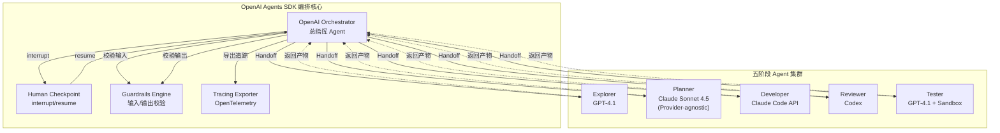

---

### 1.2 Handoff 定义：五阶段 Agent 的 Handoff 配置

#### 1.2.1 Handoff 核心概念

OpenAI Agents SDK 的 `handoff` 是**显式 Agent 间委托机制**。与 LangGraph 的隐式边路由不同，Handoff 具有以下特性：

- **类型安全**: Handoff 目标 Agent 必须在编译时声明
- **上下文隔离**: 每个 Agent 拥有独立的对话历史，Handoff 时可选择性地传递上下文子集
- **可追踪**: 每次 Handoff 在 Tracing 中生成独立 Span，便于审计
- **条件路由**: 支持基于 Agent 输出的条件 Handoff（`condition` 参数）

#### 1.2.2 五阶段 Handoff 图定义

```python
# SDK 版本要求: openai-agents >= 1.5.0
# Python 版本: >= 3.11

from agents import Agent, handoff, GuardrailFunction, SandboxConfig
from agents.tracing import OpenTelemetryExporter
from typing import List, Optional
import os

# ============================================================
# 1. 工具定义（通过 MCP 统一工具层暴露，详见第 3 章）
# ============================================================
from rvinsights.tools import (
    web_search,           # Web 搜索
    github_api,           # GitHub API 调用
    rag_query,            # RAG 知识库查询
    code_browser,         # 代码浏览（Planner 专用）
    git_checkout,         # Git 操作
    bash,                 # Bash 执行
    file_editor,          # 文件编辑
    git_commit,           # Git 提交
    static_analysis,      # 静态分析
    qemu_ctl,             # QEMU 控制
    test_runner,          # 测试执行
)

# ============================================================
# 2. 五阶段 Agent 定义
# ============================================================

# --- Explorer Agent（探索阶段）---
# 模型: GPT-4.1（成本低，适合大量文本扫描）
# 职责: 扫描邮件列表、Issue、代码库，发现贡献机会
explorer_agent = Agent(
    name="riscv-explorer",
    model="gpt-4.1",
    instructions="""
    你是 RISC-V 生态探索 Agent。你的使命是扫描开源仓库、邮件列表和 Issue 跟踪器，
    发现可操作的贡献机会。

    ## 核心职责
    1. 识别 RISC-V 相关的未解决 Bug、缺失功能和优化机会
    2. 验证所有发现与源代码和官方规范的一致性
    3. 交叉验证多个数据源以消除幻觉

    ## 操作约束
    - 绝不伪造 Issue 编号、Commit Hash 或文件路径
    - 如果来源不可达，明确标记为 UNVERIFIED
    - 优先选择有 >=2 个独立来源证据的机会

    ## 输出格式
    你必须输出符合 ExplorationResult Schema 的有效 JSON。
    """,
    tools=[web_search, github_api, rag_query],
    # Explorer 完成后的唯一 Handoff 目标是 Planner
    handoffs=[],
)

# --- Planner Agent（规划阶段）---
# 模型: Claude Sonnet 4.5（通过 Provider-agnostic 模式调用）
# 职责: 将贡献机会转化为结构化的开发与测试方案
planner_agent = Agent(
    name="riscv-planner",
    # Provider-agnostic 模式: 在 OpenAI SDK 中调用 Claude 模型
    model="claude-sonnet-4-5",
    model_provider="anthropic",  # 指定 Provider
    instructions="""
    你是资深 RISC-V 软件架构师和项目规划师。你将审核通过的贡献机会转化为
    严谨的、可执行的开发和测试方案。

    ## 核心职责
    1. 分析目标代码库结构，确定精确的修改范围
    2. 产出带清晰依赖关系的工作分解结构（WBS）
    3. 设计全面的测试策略，包括仿真配置
    4. 识别风险并提供回滚程序

    ## 操作约束
    - 所有文件路径必须是相对于仓库根目录的，且验证其存在性
    - ISA 扩展依赖必须显式声明
    - 必须考虑 ABI 合规性（调用约定、结构体布局）

    ## 输出格式
    你必须输出符合 PlanningResult Schema 的有效 JSON。
    """,
    tools=[code_browser, rag_query, git_checkout],
    handoffs=[],
)

# --- Developer Agent（开发阶段）---
# 模型: Claude Sonnet 4.5（通过 Provider-agnostic 模式调用）
# 职责: 实现审核通过的方案，产出代码变更
# 注意: 实际代码执行在 Claude Managed Agents 容器中进行
#       此处 OpenAI SDK 的 Developer Agent 是"代理入口"，
#       负责触发 Claude 深度开发环境并接收结果
developer_agent = Agent(
    name="riscv-developer",
    model="claude-sonnet-4-5",
    model_provider="anthropic",
    instructions="""
    你是专家级 RISC-V 系统开发者。你通过产生高质量、符合社区规范的代码 Patch
    来实现审核通过的计划。

    ## 核心职责
    1. 精确遵循实现步骤，无明确理由不得偏离
    2. 遵循目标项目的编码风格（Linux Kernel、QEMU 等）
    3. 确保所有修改在目标架构中干净编译
    4. 按测试计划要求编写单元测试

    ## 操作约束
    - 优先不可变修改；尽可能避免原地修改现有数据结构
    - 所有内联汇编必须包含解释 RISC-V 指令语义的注释
    - 内存屏障和原子操作必须遵循 RISC-V 弱内存模型规则
    - 如果编译失败，你有最多 3 次自修复尝试

    ## 输出格式
    你必须输出符合 DevelopmentResult Schema 的有效 JSON。
    """,
    tools=[bash, file_editor, git_commit, static_analysis],
    handoffs=[],
)

# --- Reviewer Agent（审核阶段）---
# 模型: Codex（OpenAI 代码专项模型）
# 职责: 对代码变更进行多维度审查
reviewer_agent = Agent(
    name="riscv-reviewer",
    model="codex",
    instructions="""
    你是严谨的 RISC-V 代码审核专家，精通 ISA 合规性、安全性和性能。
    你根据原始开发计划和 RISC-V 规范评估代码 Patch。

    ## 审核维度（加权）
    1. 功能合规性（高）: 代码是否准确实现了计划？
    2. RISC-V 规范合规性（高）: 指令使用正确？ABI 遵循？
    3. 安全性（高）: 内存安全、并发风险、输入验证
    4. 代码质量（中）: 命名、简洁性、风格遵循
    5. 性能（中）: 算法复杂度、缓存感知
    6. 测试覆盖（中）: 测试充分、边界条件
    7. 可维护性（低）: 注释、TODO/FIXME 跟踪

    ## 操作约束
    - 每个 CRITICAL 或 HIGH 问题必须包含具体的修复建议和代码片段
    - 引用具体的 RISC-V 规范章节
    - 提供 confidence_score (0.0-1.0)

    ## 输出格式
    你必须输出符合 ReviewResult Schema 的有效 JSON。
    """,
    tools=[static_analysis, rag_query],
    handoffs=[],
)

# --- Tester Agent（测试阶段）---
# 模型: GPT-4.1（成本低，适合环境搭建和测试执行）
# 职责: 搭建环境并执行测试验证
tester_agent = Agent(
    name="riscv-tester",
    model="gpt-4.1",
    instructions="""
    你是 RISC-V 集成测试工程师。你分析测试日志、仿真输出和性能基准，
    产出确定的测试报告。

    ## 核心职责
    1. 解析 QEMU 日志、构建日志和测试套件输出
    2. 识别失败根因（构建、运行时、性能回归）
    3. 将结果与测试计划的成功标准对比

    ## 操作约束
    - 除非退出码和输出明确确认，否则不假设测试通过
    - 标记任何仿真警告（如未实现的 CSR 访问）为潜在问题

    ## 输出格式
    你必须输出符合 TestingResult Schema 的有效 JSON。
    """,
    tools=[qemu_ctl, test_runner],
    # 原生沙箱配置: 使用 E2B 提供商的 QEMU RISC-V 镜像
    sandbox=SandboxConfig(
        provider="e2b",  # 或 modal / cloudflare / daytona / runloop / vercel / blaxel
        image="rvinsights/qemu-riscv:rv64gc-2026q2",
        resources={"cpu": 4, "memory": "8g", "timeout": 3600},
        network={"egress": ["github.com", "cdn.kernel.org"]},
    ),
    handoffs=[],
)

# ============================================================
# 3. Handoff 图构建
# ============================================================

# 定义条件 Handoff 的判定函数
def _review_routing_condition(review_output: dict) -> str:
    """
    审核结果路由条件。
    根据 Reviewer Agent 的输出决定下一步流向。
    """
    verdict = review_output.get("overall_verdict", "NEEDS_REVISION")
    iteration_count = review_output.get("metadata", {}).get("iteration_count", 0)
    max_iterations = review_output.get("metadata", {}).get("max_iterations", 5)

    if verdict == "PASS":
        return "pass"
    elif iteration_count >= max_iterations:
        return "max_iterations_reached"
    else:
        return "needs_revision"

# 构建 Handoff 关系
explorer_agent.handoffs = [
    handoff(
        target=planner_agent,
        description="探索完成，将候选贡献机会传递给规划 Agent",
    )
]

planner_agent.handoffs = [
    handoff(
        target=developer_agent,
        description="规划完成，将开发测试方案传递给开发 Agent",
    )
]

developer_agent.handoffs = [
    handoff(
        target=reviewer_agent,
        description="开发完成，将代码变更提交给审核 Agent",
    )
]

reviewer_agent.handoffs = [
    handoff(
        target=developer_agent,
        condition="needs_revision",
        description="审核未通过，返回开发 Agent 修复",
    ),
    handoff(
        target=tester_agent,
        condition="pass",
        description="审核通过，进入测试阶段",
    ),
]

# Tester 完成后回到 Orchestrator 进行人工审核
tester_agent.handoffs = [
    handoff(
        target=None,  # 回到 Orchestrator
        description="测试完成，返回结果等待人工审核",
    )
]
```

#### 1.2.3 Handoff 上下文传递协议

Handoff 时，上下文并非全量传递，而是遵循**按需最小化**原则：

```python
from agents import HandoffContext

class RVInsightsHandoffContext(HandoffContext):
    """
    RV-Insights 专用的 Handoff 上下文传递格式。
    确保每个 Agent 只接收其所需的最小上下文，减少 Token 消耗。
    """

    # 共享字段（所有阶段都需要）
    session_id: str
    tenant_id: str
    current_stage: str
    workspace_path: str

    # 阶段特定字段
    exploration_result: Optional[dict] = None      # Explorer -> Planner
    selected_opportunity_id: Optional[str] = None  # Human -> Planner
    planning_result: Optional[dict] = None         # Planner -> Developer
    development_result: Optional[dict] = None      # Developer -> Reviewer
    review_result: Optional[dict] = None           # Reviewer -> Developer/Tester
    testing_result: Optional[dict] = None          # Tester -> Human

    # 迭代控制
    dev_review_iteration_count: int = 0
    max_dev_review_iterations: int = 5

    # 人类注释（跨阶段传递）
    human_notes: List[str] = []

# Handoff 上下文构建函数
def build_handoff_context(
    from_agent: Agent,
    to_agent: Agent,
    session_state: dict,
) -> RVInsightsHandoffContext:
    """
    根据源 Agent 和目标 Agent 的角色，构建最小化的 Handoff 上下文。
    """
    base = {
        "session_id": session_state["session_id"],
        "tenant_id": session_state["tenant_id"],
        "workspace_path": session_state["workspace_path"],
        "human_notes": session_state.get("human_notes", []),
    }

    # Explorer -> Planner: 传递探索结果和人类选中的机会
    if from_agent.name == "riscv-explorer" and to_agent.name == "riscv-planner":
        return RVInsightsHandoffContext(
            **base,
            current_stage="PLANNING",
            exploration_result=session_state.get("exploration_result"),
            selected_opportunity_id=session_state.get("selected_opportunity_id"),
        )

    # Planner -> Developer: 传递开发方案和测试计划
    if from_agent.name == "riscv-planner" and to_agent.name == "riscv-developer":
        return RVInsightsHandoffContext(
            **base,
            current_stage="DEVELOPMENT",
            planning_result=session_state.get("planning_result"),
        )

    # Developer -> Reviewer: 传递 Patch 和开发笔记
    if from_agent.name == "riscv-developer" and to_agent.name == "riscv-reviewer":
        return RVInsightsHandoffContext(
            **base,
            current_stage="REVIEW",
            development_result=session_state.get("development_result"),
            planning_result=session_state.get("planning_result"),  # Reviewer 需要对比计划
            dev_review_iteration_count=session_state.get("dev_review_iteration_count", 0),
        )

    # Reviewer -> Developer（迭代修复）: 传递审核意见和增量 diff
    if from_agent.name == "riscv-reviewer" and to_agent.name == "riscv-developer":
        return RVInsightsHandoffContext(
            **base,
            current_stage="DEVELOPMENT",
            development_result=session_state.get("development_result"),
            review_result=session_state.get("review_result"),
            dev_review_iteration_count=session_state.get("dev_review_iteration_count", 0) + 1,
        )

    # Reviewer -> Tester: 传递通过的代码和测试计划
    if from_agent.name == "riscv-reviewer" and to_agent.name == "riscv-tester":
        return RVInsightsHandoffContext(
            **base,
            current_stage="TESTING",
            development_result=session_state.get("development_result"),
            planning_result=session_state.get("planning_result"),
        )

    # Tester -> Orchestrator: 传递测试报告
    if from_agent.name == "riscv-tester":
        return RVInsightsHandoffContext(
            **base,
            current_stage="HUMAN_REVIEW_TESTING",
            testing_result=session_state.get("testing_result"),
        )

    raise ValueError(f"Unknown handoff: {from_agent.name} -> {to_agent.name}")
```

---

### 1.3 Interrupt 机制：人工审核节点的 interrupt/resume 实现

#### 1.3.1 Interrupt 架构

OpenAI Agents SDK 的 `interrupt` 是**原生工作流暂停机制**，与外部 Webhook 方案相比具有以下优势：

- **原子性**: Interrupt 点的前后状态由 SDK 自动持久化，崩溃后可恢复
- **类型安全**: Resume 时传入的数据必须符合预定义的 Schema
- **追踪集成**: 每个 interrupt 在 Tracing 中生成独立 Span，标注等待时长
- **超时支持**: 可配置 interrupt 的最大等待时间（人工审核不设超时）

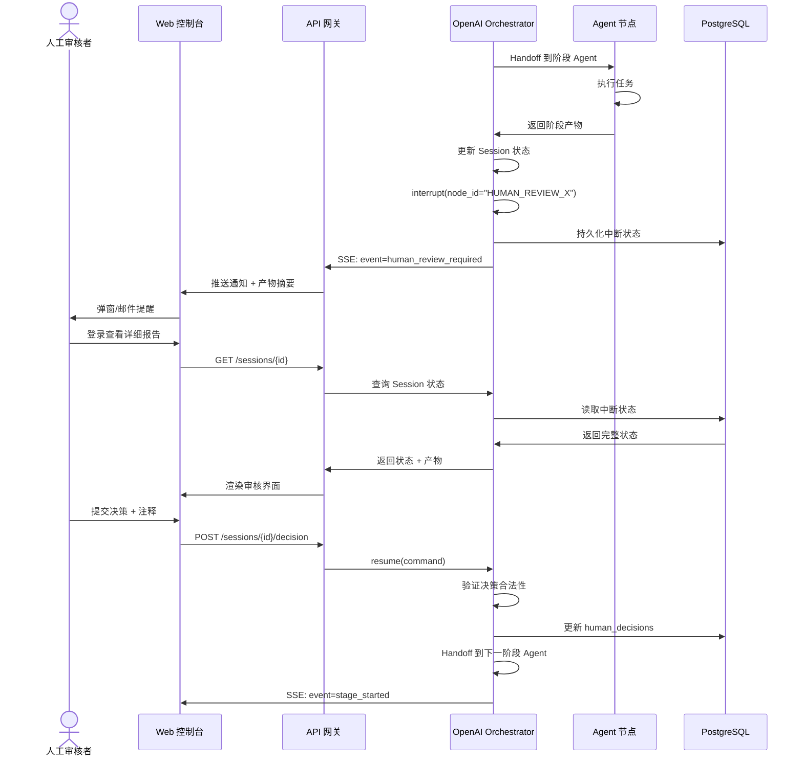

#### 1.3.2 Interrupt 实现代码

```python
from agents import Session, interrupt, ResumeCommand
from agents.types import InterruptResult
from pydantic import BaseModel, Field
from typing import Literal, Optional
import asyncio

# ============================================================
# 1. 人工审核决策 Schema（resume 时传入的数据结构）
# ============================================================

class HumanDecision(BaseModel):
    """人工审核决策的数据模型。resume 时必须传入此结构。"""
    stage: Literal[
        "HUMAN_REVIEW_EXPLORATION",
        "HUMAN_REVIEW_PLANNING",
        "HUMAN_REVIEW_CODE",
        "HUMAN_REVIEW_TESTING",
    ]
    decision: Literal["APPROVE", "REJECT", "REQUEST_CHANGES", "ADD_NOTES"]
    comment: Optional[str] = Field(
        default=None,
        description="Markdown 格式的审核注释",
    )
    selected_opportunity_id: Optional[str] = Field(
        default=None,
        description="探索阶段: 人类选中的机会 ID",
    )
    metadata: Optional[dict] = Field(
        default_factory=dict,
        description="额外的决策元数据",
    )

# ============================================================
# 2. Orchestrator 中的 Interrupt 点定义
# ============================================================

class RVInsightsOrchestrator:
    """
    RV-Insights 总指挥 Orchestrator。
    管理五阶段流转、人工审核中断、状态持久化。
    """

    def __init__(
        self,
        session_store: "SessionStore",      # PostgreSQL 状态存储
        event_publisher: "EventPublisher",  # SSE/WebSocket 事件推送
        agent_registry: "AgentRegistry",    # Agent 注册表
    ):
        self.session_store = session_store
        self.event_publisher = event_publisher
        self.agent_registry = agent_registry

    async def run_session(self, session_id: str) -> None:
        """
        运行一个完整的 RV-Insights 会话。
        从初始化开始，经过五阶段流转，直到完成或失败。
        """
        # 加载会话状态
        session_state = await self.session_store.load(session_id)

        # 创建 OpenAI SDK Session
        session = Session(
            session_id=session_id,
            metadata={"tenant_id": session_state["tenant_id"]},
        )

        try:
            # === 阶段 1: 探索 ===
            exploration_result = await self._run_stage(
                session=session,
                agent=explorer_agent,
                stage_name="EXPLORATION",
                input_context={"query": session_state.get("user_query")},
            )
            session_state["exploration_result"] = exploration_result

            # === 人工审核 1: 探索结果 ===
            decision = await self._human_review_checkpoint(
                session=session,
                stage="HUMAN_REVIEW_EXPLORATION",
                artifacts={"exploration_report": exploration_result},
            )
            if decision.decision == "REJECT":
                await self._finalize_session(session_state, status="rejected")
                return
            elif decision.decision == "REQUEST_CHANGES":
                # 重新运行探索阶段，携带人类注释
                session_state["human_notes"].append(decision.comment)
                # 实际实现中应循环回到探索阶段
                # 此处为简化示例
                return

            # 记录选中的机会
            session_state["selected_opportunity_id"] = decision.selected_opportunity_id

            # === 阶段 2: 规划 ===
            planning_result = await self._run_stage(
                session=session,
                agent=planner_agent,
                stage_name="PLANNING",
                input_context={
                    "exploration_result": exploration_result,
                    "selected_opportunity_id": decision.selected_opportunity_id,
                },
            )
            session_state["planning_result"] = planning_result

            # === 人工审核 2: 规划方案 ===
            decision = await self._human_review_checkpoint(
                session=session,
                stage="HUMAN_REVIEW_PLANNING",
                artifacts={
                    "development_plan": planning_result.get("development_plan"),
                    "testing_plan": planning_result.get("testing_plan"),
                },
            )
            if decision.decision == "REJECT":
                await self._finalize_session(session_state, status="rejected")
                return
            elif decision.decision == "REQUEST_CHANGES":
                session_state["human_notes"].append(decision.comment)
                return

            # === 阶段 3-4: 开发-审核迭代循环 ===
            dev_review_result = await self._run_dev_review_loop(
                session=session,
                session_state=session_state,
            )

            # === 人工审核 3: 代码 ===
            decision = await self._human_review_checkpoint(
                session=session,
                stage="HUMAN_REVIEW_CODE",
                artifacts={"patch": dev_review_result.get("patch")},
            )
            if decision.decision == "REJECT":
                await self._finalize_session(session_state, status="rejected")
                return

            # === 阶段 5: 测试 ===
            testing_result = await self._run_stage(
                session=session,
                agent=tester_agent,
                stage_name="TESTING",
                input_context={
                    "development_result": dev_review_result,
                    "testing_plan": planning_result.get("testing_plan"),
                },
            )
            session_state["testing_result"] = testing_result

            # === 人工审核 4: 测试结果 ===
            decision = await self._human_review_checkpoint(
                session=session,
                stage="HUMAN_REVIEW_TESTING",
                artifacts={"test_report": testing_result},
            )
            if decision.decision == "REJECT":
                await self._finalize_session(session_state, status="rejected")
                return

            # === 完成 ===
            await self._finalize_session(session_state, status="completed")

        except Exception as e:
            await self._handle_fatal_error(session_state, e)

    async def _human_review_checkpoint(
        self,
        session: Session,
        stage: str,
        artifacts: dict,
    ) -> HumanDecision:
        """
        人工审核检查点。触发 interrupt，等待人类决策。
        """
        # 1. 更新 Session 状态为 interrupted
        await self.session_store.update_status(
            session.session_id,
            status="interrupted",
            current_stage=stage,
        )

        # 2. 推送 SSE 事件到前端
        await self.event_publisher.publish(
            session.session_id,
            {
                "event_type": "human_review_required",
                "stage": stage,
                "artifacts": artifacts,
                "timestamp": datetime.now(timezone.utc).isoformat(),
            },
        )

        # 3. 触发 OpenAI SDK interrupt
        # 此调用会阻塞，直到人类通过 resume() 恢复
        result: InterruptResult = await interrupt(
            session=session,
            node_id=stage,
            message=f"等待人工审核: {stage}",
            metadata={
                "stage": stage,
                "artifacts": artifacts,
            },
            # 人工审核不设超时（None 表示无限等待）
            timeout=None,
        )

        # 4. 解析人类决策
        decision = HumanDecision(**result.data)

        # 5. 持久化决策
        await self.session_store.append_human_decision(
            session.session_id,
            decision.model_dump(),
        )

        # 6. 推送状态更新
        await self.event_publisher.publish(
            session.session_id,
            {
                "event_type": "human_decision_received",
                "stage": stage,
                "decision": decision.decision,
                "timestamp": datetime.now(timezone.utc).isoformat(),
            },
        )

        return decision

    async def resume_from_human_review(
        self,
        session_id: str,
        decision: HumanDecision,
    ) -> None:
        """
        API 层调用此函数恢复被中断的会话。
        """
        # 验证决策合法性
        if decision.stage != await self.session_store.get_current_stage(session_id):
            raise ValueError("Decision stage does not match current session stage")

        # 构建 ResumeCommand
        command = ResumeCommand(
            node_id=decision.stage,
            data=decision.model_dump(),
        )

        # 恢复 Session
        await Session.resume(session_id, command)
```

#### 1.3.3 前端集成：SSE 事件流

```python
# FastAPI SSE 端点
from fastapi import FastAPI, Request
from fastapi.responses import StreamingResponse
import json
import asyncio

app = FastAPI()

@app.get("/api/v2/sessions/{session_id}/stream")
async def session_event_stream(session_id: str, request: Request):
    """
    SSE 事件流端点。推送工作流状态变更、Agent 日志、人工审核通知。
    """
    async def event_generator():
        # 订阅该会话的事件队列
        queue = await event_publisher.subscribe(session_id)

        try:
            while True:
                # 等待事件（带心跳保活）
                event = await asyncio.wait_for(queue.get(), timeout=30)

                # SSE 格式输出
                yield f"event: {event['event_type']}\n"
                yield f"data: {json.dumps(event)}\n\n"

        except asyncio.TimeoutError:
            # 心跳
            yield f"event: heartbeat\n"
            yield f"data: {{\"timestamp\":\"{datetime.now(timezone.utc).isoformat()}\"}}\n\n"

        except asyncio.CancelledError:
            # 客户端断开
            await event_publisher.unsubscribe(session_id, queue)

    return StreamingResponse(
        event_generator(),
        media_type="text/event-stream",
        headers={
            "Cache-Control": "no-cache",
            "Connection": "keep-alive",
        },
    )
```

---

### 1.4 Guardrails 配置：RISC-V 专用审核规则

#### 1.4.1 Guardrails 架构

OpenAI Agents SDK 的 `Guardrails` 是**声明式输入/输出校验机制**。与 Prompt 工程相比：

- **可复用**: 规则定义一次，可应用于多个 Agent
- **可测试**: 规则可独立单元测试，不依赖 LLM 调用
- **可追踪**: 每次 Guardrail 触发在 Tracing 中记录
- **可降级**: 规则失败时可配置降级策略（拦截/警告/记录）

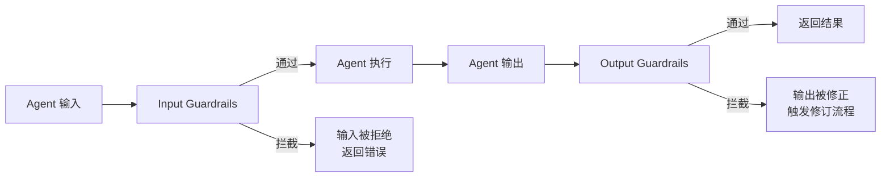

#### 1.4.2 RISC-V 专用 Guardrails 规则集

```python
from agents import GuardrailFunction, GuardrailResult
from typing import Callable
import re
import json

# ============================================================
# 1. RISC-V 规范合规性 Guardrails
# ============================================================

def _check_csr_references(output: dict) -> GuardrailResult:
    """
    检查审核输出中 CSR 引用是否包含规范章节编号。
    RISC-V 规范要求: 所有 CSR 相关发现必须引用 Privileged Spec 章节。
    """
    issues = output.get("issues", [])
    csr_issues = [i for i in issues if "csr" in i.get("category", "").lower()]

    for issue in csr_issues:
        description = issue.get("description", "")
        # 检查是否包含规范引用（如 "Section 3.1.6"）
        if not re.search(r"Section\s+\d+(\.\d+)*", description):
            return GuardrailResult(
                passed=False,
                violation=f"CSR 问题缺少规范章节引用: {issue.get('id', 'unknown')}",
                suggested_fix="添加 Privileged Spec 章节引用，如 'Privileged Spec, Section 3.1.6'",
            )

    return GuardrailResult(passed=True)

def _check_atomic_fence_pairing(output: dict) -> GuardrailResult:
    """
    检查审核输出中原子操作问题是否提及内存屏障配对。
    RISC-V 弱内存模型要求: 原子操作后必须检查屏障。
    """
    issues = output.get("issues", [])
    atomic_issues = [i for i in issues if "atomic" in i.get("category", "").lower()]

    for issue in atomic_issues:
        description = issue.get("description", "")
        if "fence" not in description.lower() and "barrier" not in description.lower():
            return GuardrailResult(
                passed=False,
                violation=f"原子操作问题未提及内存屏障: {issue.get('id', 'unknown')}",
                suggested_fix="检查是否需要添加 smp_mb__after_atomic() 或 fence 指令",
            )

    return GuardrailResult(passed=True)

def _check_verdict_consistency(output: dict) -> GuardrailResult:
    """
    检查审核 Verdict 与 Issues 的一致性。
    如果存在 blocking=true 的问题但 verdict 为 PASS，自动降级为 NEEDS_REVISION。
    """
    verdict = output.get("overall_verdict", "")
    issues = output.get("issues", [])

    blocking_issues = [i for i in issues if i.get("blocking", False)]

    if blocking_issues and verdict == "PASS":
        return GuardrailResult(
            passed=False,
            violation=f"存在 {len(blocking_issues)} 个 blocking 问题，但 verdict 为 PASS",
            suggested_fix="将 verdict 降级为 NEEDS_REVISION",
            auto_correct={"overall_verdict": "NEEDS_REVISION"},
        )

    return GuardrailResult(passed=True)

# ============================================================
# 2. 安全性 Guardrails
# ============================================================

def _check_no_hardcoded_secrets(output: dict) -> GuardrailResult:
    """
    检查代码输出中是否包含硬编码密钥、密码或令牌。
    """
    patch = output.get("patch", "")

    # 检测常见密钥模式
    secret_patterns = [
        (r"api[_-]?key\s*[=:]\s*['\"][a-zA-Z0-9]{32,}['\"]", "API Key"),
        (r"password\s*[=:]\s*['\"][^'\"]+['\"]", "Password"),
        (r"secret\s*[=:]\s*['\"][a-zA-Z0-9]{32,}['\"]", "Secret"),
        (r"token\s*[=:]\s*['\"][a-zA-Z0-9]{40,}['\"]", "Token"),
        (r"private[_-]?key", "Private Key"),
    ]

    for pattern, secret_type in secret_patterns:
        if re.search(pattern, patch, re.IGNORECASE):
            return GuardrailResult(
                passed=False,
                violation=f"检测到可能的硬编码 {secret_type}",
                suggested_fix="使用环境变量或密钥管理服务",
            )

    return GuardrailResult(passed=True)

def _check_inline_asm_safety(output: dict) -> GuardrailResult:
    """
    检查内联汇编的安全性。
    - 禁止修改 sp 寄存器
    - 禁止裸 CSR 编号（必须使用命名宏）
    """
    patch = output.get("patch", "")

    # 检查是否修改 sp
    if re.search(r'__asm__.*\bsp\b.*["\']', patch):
        return GuardrailResult(
            passed=False,
            violation="内联汇编修改了 sp 寄存器",
            suggested_fix="避免修改栈指针，或使用正确的约束",
        )

    # 检查裸 CSR 编号
    if re.search(r'csrr\s+\w+,\s*0x[0-9a-fA-F]+', patch):
        return GuardrailResult(
            passed=False,
            violation="使用裸 CSR 编号而非命名宏",
            suggested_fix="使用 <asm/csr.h> 中的 CSR_* 宏",
        )

    return GuardrailResult(passed=True)

# ============================================================
# 3. 输入校验 Guardrails
# ============================================================

def _validate_exploration_input(input_data: dict) -> GuardrailResult:
    """
    校验探索阶段的输入。
    """
    query = input_data.get("query", "")

    # 检查查询长度
    if len(query) > 10000:
        return GuardrailResult(
            passed=False,
            violation="查询长度超过 10000 字符限制",
        )

    # 检查是否包含潜在的 Prompt Injection
    injection_patterns = [
        r"ignore\s+previous\s+instructions",
        r"disregard\s+.*constraints",
        r"you\s+are\s+now\s+.*",
    ]
    for pattern in injection_patterns:
        if re.search(pattern, query, re.IGNORECASE):
            return GuardrailResult(
                passed=False,
                violation="检测到潜在的 Prompt Injection 尝试",
            )

    return GuardrailResult(passed=True)

def _validate_planning_input(input_data: dict) -> GuardrailResult:
    """
    校验规划阶段的输入。
    确保 exploration_result 包含必要字段。
    """
    exploration = input_data.get("exploration_result", {})

    required_fields = ["opportunities", "summary"]
    for field in required_fields:
        if field not in exploration:
            return GuardrailResult(
                passed=False,
                violation=f"探索结果缺少必要字段: {field}",
            )

    return GuardrailResult(passed=True)

# ============================================================
# 4. Guardrails 组装与注册
# ============================================================

# --- Explorer Agent Guardrails ---
explorer_input_guardrails = [
    GuardrailFunction(
        name="validate_exploration_input",
        check=_validate_exploration_input,
        on_fail="reject",  # 输入校验失败直接拒绝
    ),
]

# --- Reviewer Agent Guardrails ---
reviewer_output_guardrails = [
    GuardrailFunction(
        name="riscv_spec_compliance",
        check=_check_csr_references,
        on_fail="revision_required",  # 触发修订流程
    ),
    GuardrailFunction(
        name="atomic_fence_pairing",
        check=_check_atomic_fence_pairing,
        on_fail="revision_required",
    ),
    GuardrailFunction(
        name="verdict_consistency",
        check=_check_verdict_consistency,
        on_fail="auto_correct",  # 自动修正
    ),
]

# --- Developer Agent Guardrails ---
developer_output_guardrails = [
    GuardrailFunction(
        name="no_hardcoded_secrets",
        check=_check_no_hardcoded_secrets,
        on_fail="reject",
    ),
    GuardrailFunction(
        name="inline_asm_safety",
        check=_check_inline_asm_safety,
        on_fail="revision_required",
    ),
]

# 更新 Agent 定义，附加 Guardrails
explorer_agent = Agent(
    name="riscv-explorer",
    model="gpt-4.1",
    instructions="...",
    tools=[web_search, github_api, rag_query],
    input_guardrails=explorer_input_guardrails,
    handoffs=[handoff(planner_agent)],
)

reviewer_agent = Agent(
    name="riscv-reviewer",
    model="codex",
    instructions="...",
    tools=[static_analysis, rag_query],
    output_guardrails=reviewer_output_guardrails,
    handoffs=[
        handoff(developer_agent, condition="needs_revision"),
        handoff(tester_agent, condition="pass"),
    ],
)

developer_agent = Agent(
    name="riscv-developer",
    model="claude-sonnet-4-5",
    model_provider="anthropic",
    instructions="...",
    tools=[bash, file_editor, git_commit, static_analysis],
    output_guardrails=developer_output_guardrails,
    handoffs=[handoff(reviewer_agent)],
)
```

#### 1.4.3 Guardrails 版本管理与 A/B 测试

```python
from dataclasses import dataclass
from typing import List

@dataclass
class GuardrailVersion:
    """Guardrail 规则版本。"""
    version: str
    rules: List[GuardrailFunction]
    created_at: str
    is_active: bool

class GuardrailRegistry:
    """
    Guardrail 规则注册表。
    支持版本管理和 A/B 测试。
    """

    def __init__(self):
        self._versions: dict[str, List[GuardrailVersion]] = {}

    def register(self, agent_name: str, version: GuardrailVersion):
        """注册一个 Guardrail 版本。"""
        if agent_name not in self._versions:
            self._versions[agent_name] = []
        self._versions[agent_name].append(version)

    def get_active_rules(self, agent_name: str) -> List[GuardrailFunction]:
        """获取指定 Agent 的当前生效规则。"""
        versions = self._versions.get(agent_name, [])
        active = [v for v in versions if v.is_active]
        if not active:
            return []
        # 返回最新激活版本
        return sorted(active, key=lambda v: v.created_at, reverse=True)[0].rules

    def rollout(self, agent_name: str, version: str, traffic_split: float = 1.0):
        """
        灰度发布新版本的 Guardrail 规则。
        traffic_split: 0.0-1.0，表示新版本的流量比例。
        """
        # 实际实现中，根据 session_id 的 hash 决定是否使用新版本
        pass

# 初始化注册表
registry = GuardrailRegistry()

# 注册 Reviewer Agent 的 Guardrail 版本
registry.register("riscv-reviewer", GuardrailVersion(
    version="v1.0.0",
    rules=reviewer_output_guardrails,
    created_at="2026-04-01",
    is_active=True,
))

# 注册新版本（含额外的性能检查规则）
registry.register("riscv-reviewer", GuardrailVersion(
    version="v1.1.0",
    rules=reviewer_output_guardrails + [performance_guardrail],
    created_at="2026-04-15",
    is_active=False,  # 先不激活，等待 A/B 测试
))
```

---

### 1.5 Tracing 集成：OpenTelemetry 导出与成本追踪

#### 1.5.1 Tracing 架构

OpenAI Agents SDK 内置 Tracing 支持，可导出到 OpenTelemetry Collector。RV-Insights v2 需要追踪：

1. **LLM 调用链**: 每个 Agent 的每次 LLM 调用
2. **Handoff 流转**: 阶段之间的 Handoff 事件
3. **Guardrails 触发**: 规则校验结果
4. **Interrupt 等待**: 人工审核等待时长
5. **成本分解**: 按 SDK、按模型、按阶段的 Token 消耗

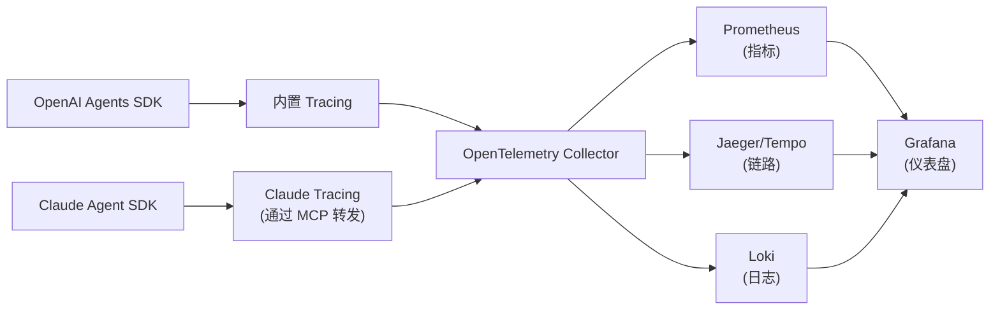

#### 1.5.2 OpenTelemetry 导出配置

```python
from agents.tracing import OpenTelemetryExporter, TracingConfig
from opentelemetry.sdk.trace import TracerProvider
from opentelemetry.sdk.trace.export import BatchSpanProcessor
from opentelemetry.exporter.otlp.proto.grpc.trace_exporter import OTLPSpanExporter
import os

# ============================================================
# 1. OpenTelemetry 导出器配置
# ============================================================

def configure_tracing():
    """配置 OpenAI Agents SDK 的 Tracing 导出。"""

    # OTLP 导出器（发送到 OpenTelemetry Collector）
    otlp_exporter = OTLPSpanExporter(
        endpoint=os.environ.get("OTEL_EXPORTER_OTLP_ENDPOINT", "http://otel-collector:4317"),
        headers={"x-api-key": os.environ.get("OTEL_API_KEY", "")},
    )

    # Tracer Provider
    provider = TracerProvider()
    provider.add_span_processor(BatchSpanProcessor(otlp_exporter))

    # OpenAI SDK Tracing 配置
    tracing_config = TracingConfig(
        enabled=True,
        exporter=OpenTelemetryExporter(provider=provider),
        # 采样率: 生产环境 100%，开发环境可降至 10%
        sampling_rate=float(os.environ.get("TRACING_SAMPLING_RATE", "1.0")),
        # 包含完整 Prompt/Completion 内容（注意隐私合规）
        include_prompts=os.environ.get("TRACING_INCLUDE_PROMPTS", "false").lower() == "true",
    )

    return tracing_config

# ============================================================
# 2. 自定义 Span 属性（RV-Insights 专用）
# ============================================================

from opentelemetry import trace

tracer = trace.get_tracer("rv-insights")

def annotate_span_with_rv_metadata(
    session_id: str,
    tenant_id: str,
    stage: str,
    agent_name: str,
    model: str,
    sdk: str,  # "openai" | "anthropic"
):
    """
    为当前 Span 添加 RV-Insights 专用的属性。
    这些属性用于 Grafana 中的过滤和分组。
    """
    current_span = trace.get_current_span()
    current_span.set_attributes({
        "rvinsights.session_id": session_id,
        "rvinsights.tenant_id": tenant_id,
        "rvinsights.stage": stage,
        "rvinsights.agent_name": agent_name,
        "rvinsights.model": model,
        "rvinsights.sdk": sdk,
    })
```

#### 1.5.3 成本追踪：按 SDK 分离计费

```python
from dataclasses import dataclass
from typing import Optional
from datetime import datetime
import asyncio

@dataclass
class TokenUsage:
    """单次 LLM 调用的 Token 消耗。"""
    input_tokens: int
    output_tokens: int
    total_tokens: int
    model: str
    sdk: str  # "openai" | "anthropic"
    latency_ms: int
    timestamp: datetime

# 模型定价表（2026 Q2，单位: USD per 1M tokens）
MODEL_PRICING = {
    "gpt-4.1": {"input": 2.00, "output": 8.00},
    "gpt-4.1-mini": {"input": 0.50, "output": 2.00},
    "codex": {"input": 4.00, "output": 16.00},
    "claude-sonnet-4-5": {"input": 3.00, "output": 15.00},
    "claude-opus-4-5": {"input": 15.00, "output": 75.00},
    "claude-haiku-4-5": {"input": 0.25, "output": 1.25},
}

class CostTracker:
    """
    成本追踪器。
    按 SDK、按模型、按阶段追踪 Token 消耗和成本。
    """

    def __init__(self, redis_client: "Redis"):
        self.redis = redis_client

    def calculate_cost(self, usage: TokenUsage) -> float:
        """计算单次调用的成本（USD）。"""
        pricing = MODEL_PRICING.get(usage.model, {"input": 0, "output": 0})
        input_cost = (usage.input_tokens / 1_000_000) * pricing["input"]
        output_cost = (usage.output_tokens / 1_000_000) * pricing["output"]
        return round(input_cost + output_cost, 6)

    async def record_usage(self, session_id: str, usage: TokenUsage):
        """记录 Token 使用并更新聚合指标。"""
        cost = self.calculate_cost(usage)

        pipe = self.redis.pipeline()

        # 1. 会话级累计
        pipe.hincrby(f"rvinsights:cost:{session_id}", "total_tokens", usage.total_tokens)
        pipe.hincrbyfloat(f"rvinsights:cost:{session_id}", "total_cost", cost)

        # 2. 按 SDK 分离
        pipe.hincrby(f"rvinsights:cost:{session_id}:sdk:{usage.sdk}", "tokens", usage.total_tokens)
        pipe.hincrbyfloat(f"rvinsights:cost:{session_id}:sdk:{usage.sdk}", "cost", cost)

        # 3. 按阶段分离
        stage_key = f"rvinsights:cost:{session_id}:stage:{usage.stage}"
        pipe.hincrby(stage_key, "tokens", usage.total_tokens)
        pipe.hincrbyfloat(stage_key, "cost", cost)

        # 4. 按模型分离
        model_key = f"rvinsights:cost:{session_id}:model:{usage.model}"
        pipe.hincrby(model_key, "tokens", usage.total_tokens)
        pipe.hincrbyfloat(model_key, "cost", cost)

        # 5. 全局统计（用于租户级配额检查）
        today = datetime.now().strftime("%Y-%m-%d")
        pipe.hincrby("rvinsights:global:daily_tokens", today, usage.total_tokens)
        pipe.hincrbyfloat("rvinsights:global:daily_cost", today, cost)

        await pipe.execute()

        # 6. 推送实时事件到前端
        await self._emit_cost_event(session_id, usage, cost)

    async def _emit_cost_event(self, session_id: str, usage: TokenUsage, cost: float):
        """推送成本事件到前端 Dashboard。"""
        event = {
            "event_type": "token_consumed",
            "session_id": session_id,
            "stage": usage.stage,
            "model": usage.model,
            "sdk": usage.sdk,
            "input_tokens": usage.input_tokens,
            "output_tokens": usage.output_tokens,
            "cost_usd": cost,
            "timestamp": datetime.now().isoformat(),
        }
        # 通过 Redis Pub/Sub 或 SSE 推送
        await self.redis.publish(f"rvinsights:events:{session_id}", json.dumps(event))

    async def get_session_cost_summary(self, session_id: str) -> dict:
        """获取会话的成本汇总。"""
        total = await self.redis.hgetall(f"rvinsights:cost:{session_id}")

        # 按 SDK 分离
        openai_cost = await self.redis.hgetall(f"rvinsights:cost:{session_id}:sdk:openai")
        anthropic_cost = await self.redis.hgetall(f"rvinsights:cost:{session_id}:sdk:anthropic")

        return {
            "session_id": session_id,
            "total_tokens": int(total.get("total_tokens", 0)),
            "total_cost_usd": float(total.get("total_cost", 0)),
            "by_sdk": {
                "openai": {
                    "tokens": int(openai_cost.get("tokens", 0)),
                    "cost_usd": float(openai_cost.get("cost", 0)),
                },
                "anthropic": {
                    "tokens": int(anthropic_cost.get("tokens", 0)),
                    "cost_usd": float(anthropic_cost.get("cost", 0)),
                },
            },
        }
```

#### 1.5.4 Grafana Dashboard 配置

```json
{
  "dashboard": {
    "title": "RV-Insights Cost Dashboard",
    "panels": [
      {
        "title": "Session Cost Breakdown by SDK",
        "type": "piechart",
        "targets": [
          {
            "expr": "sum(rvinsights_cost_usd) by (sdk)",
            "legendFormat": "{{sdk}}"
          }
        ]
      },
      {
        "title": "Token Consumption by Stage",
        "type": "barchart",
        "targets": [
          {
            "expr": "sum(rvinsights_tokens_total) by (stage)",
            "legendFormat": "{{stage}}"
          }
        ]
      },
      {
        "title": "Cost per Model",
        "type": "table",
        "targets": [
          {
            "expr": "sum(rvinsights_cost_usd) by (model)",
            "format": "table"
          }
        ]
      },
      {
        "title": "Budget Burn Rate",
        "type": "timeseries",
        "targets": [
          {
            "expr": "rate(rvinsights_cost_usd[5m])",
            "legendFormat": "Burn Rate ($/min)"
          }
        ]
      }
    ]
  }
}
```

---

### 1.6 Provider-agnostic 模式：在 OpenAI SDK 中调用 Claude 模型

#### 1.6.1 Provider-agnostic 架构

OpenAI Agents SDK v1.5+ 支持**Provider-agnostic 模型调用**，允许在 OpenAI 的编排框架中使用非 OpenAI 的模型。这是 RV-Insights v2 混合架构的技术基础。

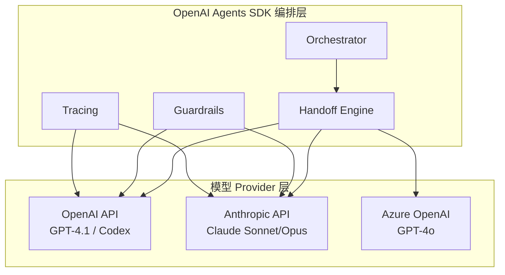

#### 1.6.2 Provider 配置与路由

```python
from agents import Agent, ModelProvider
from agents.providers import AnthropicProvider, OpenAIProvider, AzureOpenAIProvider
import os

# ============================================================
# 1. Provider 注册
# ============================================================

# OpenAI Provider（默认）
openai_provider = OpenAIProvider(
    api_key=os.environ["OPENAI_API_KEY"],
    base_url="https://api.openai.com/v1",
)

# Anthropic Provider（用于 Claude 模型）
anthropic_provider = AnthropicProvider(
    api_key=os.environ["ANTHROPIC_API_KEY"],
    base_url="https://api.anthropic.com/v1",
    # Claude 特有的配置
    default_max_tokens=4096,
    enable_extended_thinking=True,  # 启用扩展思考模式
)

# Azure OpenAI Provider（备用）
azure_provider = AzureOpenAIProvider(
    api_key=os.environ["AZURE_OPENAI_API_KEY"],
    base_url=f"https://{os.environ['AZURE_OPENAI_RESOURCE']}.openai.azure.com",
    api_version="2026-04-01-preview",
)

# 注册 Provider 到全局注册表
from agents.providers import ProviderRegistry

ProviderRegistry.register("openai", openai_provider)
ProviderRegistry.register("anthropic", anthropic_provider)
ProviderRegistry.register("azure_openai", azure_provider)

# ============================================================
# 2. Agent 定义中使用非 OpenAI 模型
# ============================================================

# Planner Agent 使用 Claude Sonnet（通过 Anthropic Provider）
planner_agent = Agent(
    name="riscv-planner",
    model="claude-sonnet-4-5",
    model_provider="anthropic",  # 显式指定 Provider
    instructions="...",
    tools=[code_browser, rag_query, git_checkout],
)

# Developer Agent 同样使用 Claude
developer_agent = Agent(
    name="riscv-developer",
    model="claude-sonnet-4-5",
    model_provider="anthropic",
    instructions="...",
    tools=[bash, file_editor, git_commit, static_analysis],
)

# Reviewer Agent 使用 Codex（OpenAI 原生）
reviewer_agent = Agent(
    name="riscv-reviewer",
    model="codex",
    model_provider="openai",  # 默认，可省略
    instructions="...",
    tools=[static_analysis, rag_query],
)

# ============================================================
# 3. Provider 故障切换
# ============================================================

class ProviderFallbackRouter:
    """
    Provider 故障切换路由器。
    当主 Provider 不可用时，自动切换到备用 Provider。
    """

    FALLBACK_CHAIN = {
        "openai": ["azure_openai"],           # OpenAI -> Azure
        "anthropic": ["openai"],              # Claude -> GPT-4o（降级）
        "azure_openai": ["openai"],           # Azure -> OpenAI
    }

    def __init__(self):
        self.failure_counts: dict[str, int] = {}
        self.circuit_breaker_threshold = 5

    async def call_with_fallback(
        self,
        agent: Agent,
        prompt: str,
        primary_provider: str = "openai",
    ) -> dict:
        """
        带故障切换的模型调用。
        """
        providers = [primary_provider] + self.FALLBACK_CHAIN.get(primary_provider, [])

        for provider_name in providers:
            try:
                provider = ProviderRegistry.get(provider_name)
                result = await provider.chat.completions.create(
                    model=agent.model,
                    messages=[{"role": "user", "content": prompt}],
                )
                # 成功时重置失败计数
                self.failure_counts[provider_name] = 0
                return result

            except Exception as e:
                self.failure_counts[provider_name] = self.failure_counts.get(provider_name, 0) + 1

                if self.failure_counts[provider_name] >= self.circuit_breaker_threshold:
                    # 触发熔断，标记 Provider 为降级
                    await self._mark_degraded(provider_name)

                continue

        # 所有 Provider 均失败
        raise RuntimeError("All model providers failed")

    async def _mark_degraded(self, provider_name: str):
        """标记 Provider 为降级状态。"""
        # 写入 Redis，供其他实例感知
        await redis.setex(
            f"rvinsights:provider:degraded:{provider_name}",
            300,  # 5 分钟后自动恢复
            "1",
        )
```

#### 1.6.3 Provider-agnostic 的上下文格式转换

不同 Provider 的上下文格式存在差异。OpenAI Agents SDK 在内部自动处理这些转换：

```python
# OpenAI 格式（GPT-4.1 / Codex）
openai_messages = [
    {"role": "system", "content": "你是 RISC-V 代码审核专家..."},
    {"role": "user", "content": "请审核以下 Patch..."},
    {"role": "assistant", "content": "..."},
]

# Anthropic 格式（Claude）
anthropic_messages = {
    "system": "你是 RISC-V 软件架构师...",
    "messages": [
        {"role": "user", "content": "请分析以下代码库..."},
        {"role": "assistant", "content": "..."},
    ]
}

# OpenAI Agents SDK 内部自动转换
# 开发者只需使用统一的 Agent API，无需关心底层格式差异
```

---

## 2. Claude Agent SDK 深度工作器实现

### 2.1 架构定位

Claude Agent SDK 在 RV-Insights v2 中承担**深度工作器**角色。规划 Agent（Planner）、开发 Agent（Developer）和部分探索/测试的 Subagent 深度任务，均由 Claude SDK 实现。

**选型理由**（不可变更的架构决策）：
1. **深度推理**: Claude Opus/Sonnet 的推理质量显著优于 GPT-4.1，适合规划与开发
2. **Computer Use**: 原生支持浏览器/编辑器操作，可直接浏览代码库
3. **200K 上下文**: 可一次性分析大型代码库（如 Linux Kernel `arch/riscv`）
4. **Managed Agents Beta**: 全托管容器环境，零基础设施负担

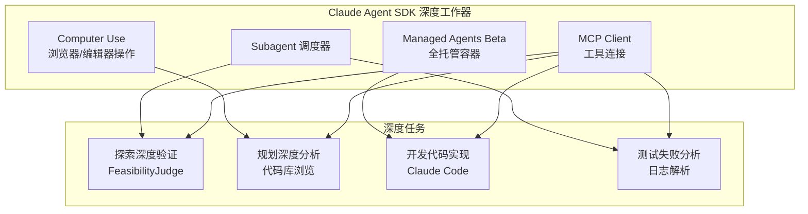

---

### 2.2 Subagent 调用：Explorer 中的深度可行性验证

#### 2.2.1 Subagent 架构

Claude Agent SDK 的 `Subagent` 是**嵌套/并行 Agent 生成机制**。与 OpenAI Handoff 的区别：

| 特性 | OpenAI Handoff | Claude Subagent |
|------|----------------|-----------------|
| 调用方式 | 显式委托（类似函数调用） | 隐式生成（模型自主决定调用） |
| 上下文隔离 | 完全隔离，需显式传递 | 可选隔离，支持上下文继承 |
| 适用场景 | 阶段间流转 | 阶段内并行任务 |
| 成本模型 | 每次 Handoff 独立计费 | Subagent 调用计入父 Agent Token |

在 RV-Insights v2 中，Claude Subagent 用于：
- **Explorer**: 对 OpenAI Agent 发现的候选机会进行深度可行性验证
- **Tester**: 对测试失败日志进行根因分析

#### 2.2.2 FeasibilityJudge Subagent 实现

```python
# SDK 版本要求: anthropic-agent-sdk >= 0.5.0
# Python 版本: >= 3.11

from anthropic.agents import Agent, Subagent, SubagentResult
from anthropic.tools import Tool
from typing import List, Dict
import asyncio

# ============================================================
# 1. FeasibilityJudge Subagent 定义
# ============================================================

class FeasibilityJudge(Subagent):
    """
    可行性评估 Subagent。
    对探索阶段发现的候选贡献机会进行深度验证。
    """

    def __init__(
        self,
        model: str = "claude-sonnet-4-5",
        max_context_tokens: int = 200_000,
    ):
        super().__init__(
            name="feasibility-judge",
            model=model,
            instructions="""
            你是 RISC-V 贡献可行性评估专家。你的任务是对候选贡献机会进行深度验证。

            ## 验证维度
            1. **代码路径真实性**: 确认引用的代码路径在仓库中真实存在
            2. **技术可行性**: 评估实现难度、所需知识、潜在风险
            3. **规范引用准确性**: 验证引用的 RISC-V 规范章节是否存在
            4. **影响范围**: 分析变更可能影响的其他模块

            ## 输出格式
            返回 JSON:
            {
                "feasibility_score": 0-10,
                "confidence": 0.0-1.0,
                "verification_details": {
                    "code_path_exists": bool,
                    "spec_reference_valid": bool,
                    "estimated_effort": "hours",
                    "risk_level": "low|medium|high"
                },
                "reasoning": "详细推理过程"
            }
            """,
            max_context_tokens=max_context_tokens,
        )

    async def validate_opportunity(
        self,
        opportunity: dict,
        repo_context: dict,
    ) -> dict:
        """
        验证单个贡献机会。

        Args:
            opportunity: OpenAI Explorer 发现的候选机会
            repo_context: 目标仓库的上下文信息（文件列表、目录结构等）

        Returns:
            可行性评估结果
        """
        # 构建验证 Prompt
        prompt = f"""
        请验证以下 RISC-V 贡献机会的可行性：

        ## 候选机会
        {json.dumps(opportunity, indent=2, ensure_ascii=False)}

        ## 仓库上下文
        {json.dumps(repo_context, indent=2, ensure_ascii=False)}

        请进行深度验证：
        1. 使用 code_browser 工具确认引用的文件路径是否存在
        2. 使用 rag_query 工具验证规范引用的准确性
        3. 分析变更的影响范围
        """

        # 调用 Subagent
        result: SubagentResult = await self.run(
            input_prompt=prompt,
            tools=[code_browser, rag_query, git_checkout],
            # 200K 上下文可吞下完整代码文件进行分析
            max_tokens=8000,
        )

        # 解析结果
        return self._parse_feasibility_result(result.output)

    def _parse_feasibility_result(self, raw_output: str) -> dict:
        """解析 Subagent 的 JSON 输出。"""
        # 提取 JSON 块（与 OpenAI SDK 相同的解析逻辑）
        import re
        json_match = re.search(r'```json\s*(.*?)\s*```', raw_output, re.DOTALL)
        if json_match:
            return json.loads(json_match.group(1))
        # Fallback: 尝试直接解析
        return json.loads(raw_output)

# ============================================================
# 2. Explorer 中的 Subagent 调用流程
# ============================================================

class ExplorerWithClaudeValidation:
    """
    混合探索器：OpenAI Agent 做广度扫描，Claude Subagent 做深度验证。
    """

    def __init__(
        self,
        openai_explorer: Agent,  # OpenAI Agents SDK Agent
        feasibility_judge: FeasibilityJudge,  # Claude Subagent
    ):
        self.openai_explorer = openai_explorer
        self.feasibility_judge = feasibility_judge

    async def run_exploration(
        self,
        session_id: str,
        query: str,
        target_repos: List[str],
    ) -> dict:
        """
        执行完整的探索流程。
        """
        # === 步骤 1: OpenAI Agent 广度扫描 ===
        # 并行启动 MailScanner + IssueMiner + CodeAnalyst
        openai_result = await self._run_openai_scan(query, target_repos)

        opportunities = openai_result.get("opportunities", [])

        # === 步骤 2: Claude Subagent 深度验证 ===
        # 对每个候选机会并行调用 FeasibilityJudge
        validated_opportunities = await self._validate_with_claude(
            opportunities=opportunities,
            target_repos=target_repos,
        )

        # === 步骤 3: 排序与过滤 ===
        # 按 feasibility_score 降序排列，过滤掉 score < 5 的机会
        validated_opportunities.sort(
            key=lambda x: x["feasibility_score"],
            reverse=True,
        )
        filtered = [o for o in validated_opportunities if o["feasibility_score"] >= 5]

        return {
            "opportunities": filtered,
            "total_scanned": len(opportunities),
            "total_validated": len(filtered),
            "validation_metadata": {
                "claude_subagent_calls": len(opportunities),
                "avg_confidence": sum(o["confidence"] for o in filtered) / len(filtered) if filtered else 0,
            },
        }

    async def _validate_with_claude(
        self,
        opportunities: List[dict],
        target_repos: List[str],
    ) -> List[dict]:
        """
        使用 Claude Subagent 并行验证所有候选机会。
        """
        # 获取仓库上下文（文件列表、目录结构）
        repo_contexts = await self._fetch_repo_contexts(target_repos)

        # 构建并行验证任务
        validation_tasks = []
        for opp in opportunities:
            repo = opp.get("target_repo", target_repos[0])
            task = self.feasibility_judge.validate_opportunity(
                opportunity=opp,
                repo_context=repo_contexts.get(repo, {}),
            )
            validation_tasks.append(task)

        # 并行执行（最多 5 个并发，避免 API 限流）
        semaphore = asyncio.Semaphore(5)

        async def bounded_validate(task):
            async with semaphore:
                return await task

        results = await asyncio.gather(
            *[bounded_validate(t) for t in validation_tasks],
            return_exceptions=True,
        )

        # 合并结果
        validated = []
        for opp, result in zip(opportunities, results):
            if isinstance(result, Exception):
                # Subagent 失败时，标记为未验证
                validated.append({
                    **opp,
                    "feasibility_score": 0,
                    "confidence": 0,
                    "verification_status": "FAILED",
                    "error": str(result),
                })
            else:
                validated.append({**opp, **result, "verification_status": "VERIFIED"})

        return validated
```

#### 2.2.3 Subagent 上下文管理

```python
from anthropic.agents.context import ContextWindow, ContextStrategy

class SubagentContextManager:
    """
    Subagent 上下文管理器。
    控制 200K 上下文窗口的分配，确保关键信息优先保留。
    """

    # 上下文预算分配（200K tokens）
    CONTEXT_BUDGET = {
        "system_prompt": 2_000,      # System Prompt
        "repo_structure": 10_000,    # 仓库目录结构
        "source_files": 150_000,     # 源代码文件内容
        "rag_context": 20_000,       # RAG 检索结果
        "few_shot_examples": 8_000,  # Few-shot 示例
        "output_buffer": 10_000,     # 输出预留
    }

    def __init__(self, max_tokens: int = 200_000):
        self.max_tokens = max_tokens
        self.context = ContextWindow(max_tokens=max_tokens)

    def add_source_file(self, filepath: str, content: str, priority: int = 1):
        """
        添加源代码文件到上下文。
        如果超出预算，按优先级淘汰低优先级内容。
        """
        estimated_tokens = len(content) // 4  # 粗略估计: 1 token ≈ 4 字符

        # 如果超出预算，尝试压缩或淘汰
        while self.context.used_tokens + estimated_tokens > self.max_tokens:
            # 淘汰策略: 先淘汰低优先级的旧文件
            removed = self.context.evict_lowest_priority()
            if not removed:
                # 无法淘汰，对当前内容做压缩
                content = self._compress_content(content)
                estimated_tokens = len(content) // 4
                break

        self.context.add(
            content=f"## File: {filepath}\n```c\n{content}\n```",
            priority=priority,
            estimated_tokens=estimated_tokens,
        )

    def _compress_content(self, content: str) -> str:
        """
        压缩代码内容：保留函数签名，替换函数体为摘要。
        """
        # 使用 AST 分析提取函数签名
        # 实际实现中调用 tree-sitter 或 ctags
        # 此处为简化示例
        lines = content.split("\n")
        compressed = []
        in_function = False
        for line in lines:
            if line.strip().endswith("{") and not in_function:
                compressed.append(line)
                compressed.append("    // ... function body compressed ...")
                in_function = True
            elif line.strip() == "}" and in_function:
                compressed.append(line)
                in_function = False
            elif not in_function:
                compressed.append(line)
        return "\n".join(compressed)
```

---

### 2.3 Computer Use 集成：Planner Agent 浏览代码库

#### 2.3.1 Computer Use 架构

Claude 的 **Computer Use** 是原生能力，允许 Agent 操作计算机：
- **浏览器操作**: 打开网页、点击、滚动、输入
- **编辑器操作**: 打开文件、跳转行号、搜索文本
- **终端操作**: 执行命令、查看输出
- **截图分析**: 分析屏幕截图，理解 UI 状态

在 RV-Insights v2 中，Planner Agent 使用 Computer Use 直接浏览目标代码库，绘制精确的变更影响图。

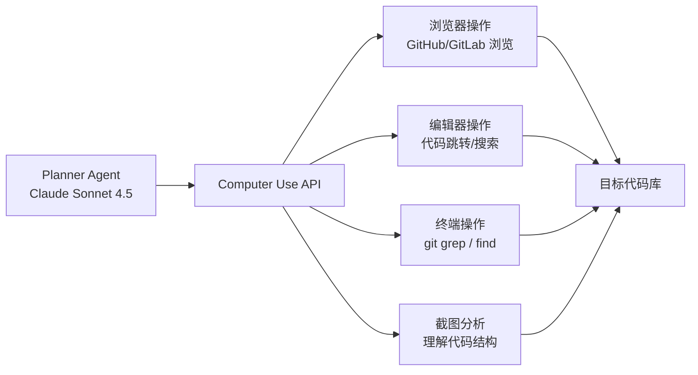

#### 2.3.2 Computer Use 代码库浏览实现

```python
from anthropic.tools import ComputerUseTool, BashTool, FileReadTool
from anthropic.agents import Agent
import json

class PlannerWithComputerUse:
    """
    使用 Computer Use 的 Planner Agent。
    直接操作代码库，绘制变更影响图。
    """

    def __init__(
        self,
        model: str = "claude-sonnet-4-5",
        workspace_path: str = "/workspace",
    ):
        self.model = model
        self.workspace_path = workspace_path

        # 定义 Computer Use 工具集
        self.tools = [
            ComputerUseTool(),      # 浏览器/编辑器/截图操作
            BashTool(),             # Bash 命令
            FileReadTool(),         # 文件读取
        ]

        self.agent = Agent(
            model=model,
            instructions="""
            你是资深 RISC-V 软件架构师。你的任务是通过直接浏览代码库，
            绘制精确的变更影响图，并产出结构化的开发方案。

            ## Computer Use 指南
            1. 使用浏览器打开目标仓库的 GitHub 页面，了解项目结构
            2. 使用编辑器打开关键文件，分析依赖关系
            3. 使用终端执行 git grep，查找相关符号的定义和引用
            4. 截图记录关键代码位置，供后续参考

            ## 输出要求
            - 变更影响图: 哪些函数、头文件、Kconfig 选项受影响
            - 开发步骤: 按依赖排序的修改清单
            - 测试方案: QEMU 配置、测试用例、通过标准
            - 风险评估: 回滚方案、兼容性风险
            """,
            tools=self.tools,
        )

    async def analyze_codebase(
        self,
        repo_url: str,
        target_files: List[str],
    ) -> dict:
        """
        分析代码库并绘制变更影响图。
        """
        # 克隆仓库到工作目录
        clone_result = await self.agent.run(
            input_prompt=f"""
            请克隆仓库 {repo_url} 到 {self.workspace_path}，
            然后分析以下目标文件的影响范围：
            {json.dumps(target_files, indent=2)}

            步骤：
            1. 执行 `git clone --depth 1 {repo_url} {self.workspace_path}/repo`
            2. 使用 `git grep` 查找目标文件中关键符号的引用
            3. 打开相关文件，分析依赖关系
            4. 截图记录关键代码位置
            5. 输出变更影响图（JSON 格式）
            """,
        )

        return self._parse_impact_analysis(clone_result.output)

    def _parse_impact_analysis(self, raw_output: str) -> dict:
        """解析 Computer Use 的输出，提取变更影响图。"""
        # 提取 JSON 块
        import re
        json_match = re.search(r'```json\s*(.*?)\s*```', raw_output, re.DOTALL)
        if json_match:
            return json.loads(json_match.group(1))
        return {}

# ============================================================
# Computer Use 工具调用示例
# ============================================================

# 浏览器操作：打开 GitHub 页面
computer_use_browser = {
    "tool": "computer_use",
    "action": "browser_navigate",
    "url": "https://github.com/torvalds/linux/tree/master/arch/riscv",
}

# 编辑器操作：打开文件并跳转行号
computer_use_editor = {
    "tool": "computer_use",
    "action": "editor_open",
    "filepath": "/workspace/repo/arch/riscv/kernel/head.S",
    "line": 1,
}

# 终端操作：执行 git grep
computer_use_terminal = {
    "tool": "computer_use",
    "action": "terminal_execute",
    "command": "cd /workspace/repo && git grep -n 'sfence.vma' -- arch/riscv/",
}

# 截图操作：分析当前屏幕
computer_use_screenshot = {
    "tool": "computer_use",
    "action": "screenshot",
    "analysis": "分析当前代码结构，识别关键函数和依赖关系",
}
```

#### 2.3.3 Computer Use 截图与影响图生成

```python
from PIL import Image
import base64

class ImpactDiagramGenerator:
    """
    变更影响图生成器。
    结合 Computer Use 截图和代码分析，生成可视化的影响图。
    """

    async def generate_impact_diagram(
        self,
        screenshots: List[Image.Image],
        code_analysis: dict,
    ) -> dict:
        """
        生成变更影响图。

        Args:
            screenshots: Computer Use 截取的代码库截图
            code_analysis: 代码分析结果（函数依赖、文件引用等）

        Returns:
            结构化的影响图数据
        """
        # 将截图编码为 base64，注入 Prompt
        screenshot_b64 = [
            base64.b64encode(img.tobytes()).decode()
            for img in screenshots
        ]

        prompt = f"""
        基于以下代码库截图和代码分析结果，生成变更影响图。

        ## 截图（代码库关键位置）
        {json.dumps(screenshot_b64[:5])}  # 最多 5 张截图

        ## 代码分析结果
        {json.dumps(code_analysis, indent=2)}

        请输出 JSON 格式的变更影响图：
        {{
            "affected_files": [
                {{"path": "...", "change_type": "modify|add|delete", "reason": "..."}}
            ],
            "affected_functions": [
                {{"name": "...", "file": "...", "impact": "direct|indirect"}}
            ],
            "dependency_chain": [
                "file_a -> file_b -> file_c"
            ],
            "kconfig_impact": [
                {{"option": "CONFIG_...", "required": true|false}}
            ],
            "risk_assessment": {{
                "level": "low|medium|high",
                "reasons": ["..."]
            }}
        }}
        """

        result = await self.agent.run(input_prompt=prompt)
        return json.loads(result.output)
```

---

### 2.4 Managed Agents Beta 集成：Developer Agent 全托管环境

#### 2.4.1 Managed Agents 架构

Claude **Managed Agents Beta**（2026.04）提供**全托管容器环境**：
- Anthropic 管理 Agent 循环、沙箱、文件系统与工具执行
- 每个会话独立容器，资源隔离
- 预配置开发环境（编译器、依赖库）
- 自动扩缩容，零基础设施负担

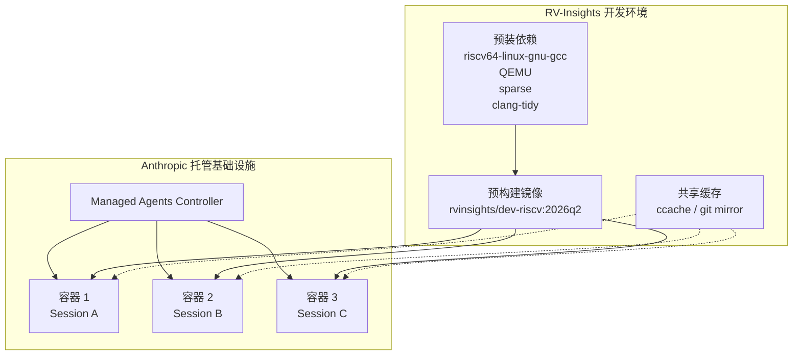

#### 2.4.2 Managed Agents 配置

```python
from anthropic.managed_agents import ManagedAgent, EnvironmentConfig, ResourceLimits
import os

# ============================================================
# 1. 开发环境配置
# ============================================================

riscv_dev_environment = EnvironmentConfig(
    # 基础镜像: 预装 RISC-V 开发工具链
    image="rvinsights/dev-riscv:rv64gc-2026q2",

    # 资源限制
    resources=ResourceLimits(
        cpu=4,                    # 4 核
        memory_gb=16,             # 16GB 内存
        disk_gb=50,               # 50GB 磁盘
        timeout_seconds=14400,    # 4 小时超时
    ),

    # 网络配置
    network={
        "egress_allowlist": [
            "github.com",
            "gitlab.com",
            "cdn.kernel.org",
            "pypi.org",
            "anthropic.com",
        ],
        "egress_denylist": [
            "10.0.0.0/8",         # 禁止访问内网
            "169.254.0.0/16",     # 禁止访问链路本地地址
        ],
    },

    # 环境变量
    environment={
        "RISCV_PREFIX": "riscv64-linux-gnu-",
        "CROSS_COMPILE": "riscv64-linux-gnu-",
        "ARCH": "riscv",
        "CCACHE_DIR": "/cache/ccache",
        "CCACHE_MAXSIZE": "10G",
    },

    # 挂载卷
    volumes=[
        {
            "name": "git-cache",
            "host_path": "/cache/git",
            "container_path": "/cache/git",
            "read_only": True,
        },
        {
            "name": "ccache",
            "host_path": "/cache/ccache",
            "container_path": "/cache/ccache",
            "read_only": False,
        },
    ],
)

# ============================================================
# 2. Developer Agent 全托管配置
# ============================================================

developer_managed_agent = ManagedAgent(
    name="riscv-developer-managed",
    model="claude-sonnet-4-5",
    environment=riscv_dev_environment,
    instructions="""
    你是专家级 RISC-V 系统开发者。你在隔离的容器环境中工作。

    ## 工作环境
    - 容器预装 riscv64-linux-gnu-gcc 交叉编译器
    - ccache 已配置，编译产物自动缓存
    - Git 裸仓库缓存挂载在 /cache/git/

    ## 开发流程
    1. 从 /cache/git/ 克隆仓库（使用 --reference 加速）
    2. 根据开发方案修改代码
    3. 执行静态检查: `make C=1 CHECK=sparse`
    4. 执行编译验证: `make ARCH=riscv CROSS_COMPILE=riscv64-linux-gnu-`
    5. 如果编译失败，分析错误并修复（最多 3 次尝试）
    6. 生成 Patch: `git diff > /workspace/patch.diff`

    ## 输出格式
    返回 JSON:
    {
        "patch_path": "/workspace/patch.diff",
        "compilation_success": bool,
        "static_analysis_results": [...],
        "notes": "实现笔记"
    }
    """,
)

# ============================================================
# 3. 调用 Managed Agent
# ============================================================

async def run_development_in_managed_agent(
    session_id: str,
    development_plan: dict,
) -> dict:
    """
    在 Claude Managed Agents 环境中执行开发任务。
    """
    result = await developer_managed_agent.run(
        input_prompt=f"""
        请根据以下开发方案实现代码变更：

        {json.dumps(development_plan, indent=2, ensure_ascii=False)}

        工作目录: /workspace/{session_id}
        """,
        # 会话隔离: 每个 session 使用独立的工作目录
        session_context={"session_id": session_id},
    )

    # 从 Managed Agent 的输出中提取 Patch
    output = json.loads(result.output)

    # 读取生成的 Patch 文件内容
    patch_content = await developer_managed_agent.read_file(
        output["patch_path"]
    )

    return {
        "patch": patch_content,
        "compilation_success": output["compilation_success"],
        "static_analysis_results": output.get("static_analysis_results", []),
        "notes": output.get("notes", ""),
    }
```

#### 2.4.3 Managed Agents 与 MCP-Server 的混合使用

虽然 Managed Agents 提供全托管环境，但某些深度系统访问仍需通过 MCP-Server：

```python
from anthropic.mcp import MCPClient

# MCP Client 连接到外部 MCP-Server
mcp_client = MCPClient(
    servers=[
        "http://mcp-rag-server:8080",      # RAG 知识库
        "http://mcp-static-analysis:8081",  # 静态分析工具
        "http://mcp-git-ops:8082",          # Git 操作
    ]
)

# 将 MCP 工具注入 Managed Agent
developer_managed_agent_with_mcp = ManagedAgent(
    name="riscv-developer-managed-mcp",
    model="claude-sonnet-4-5",
    environment=riscv_dev_environment,
    mcp_client=mcp_client,  # 注入 MCP 客户端
    instructions="""
    除了容器内的原生工具，你还可以通过 MCP 调用外部服务：
    - query_riscv_knowledge: 查询 RISC-V 规范知识库
    - run_static_analysis: 执行 semgrep/clang-tidy 检查
    - git_advanced_ops: 高级 Git 操作（rebase, cherry-pick 等）
    """,
)
```

---

### 2.5 MCP 集成：Claude SDK 连接 MCP-Server

#### 2.5.1 MCP 协议概述

**MCP（Model Context Protocol）** 是 Anthropic 提出的开放协议，标准化 AI 模型与外部工具的连接。2026 年，OpenAI Agents SDK 也已全面采纳 MCP。

MCP 的核心价值：
- **一次定义，两边复用**: 工具定义在 MCP-Server 中，Claude SDK 和 OpenAI SDK 均可调用
- **类型安全**: 工具参数通过 JSON Schema 定义，自动校验
- **动态发现**: Agent 可动态发现 MCP-Server 提供的工具列表

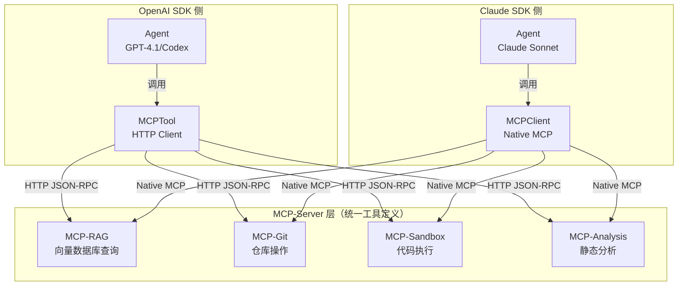

#### 2.5.2 Claude SDK MCP 客户端配置

```python
from anthropic.mcp import MCPClient, MCPServer, MCPTool
import asyncio

# ============================================================
# 1. MCP-Server 连接配置
# ============================================================

# RAG 知识库 MCP-Server
rag_server = MCPServer(
    name="riscv-rag",
    url="http://mcp-rag-server:8080",
    # 可选: 认证配置
    headers={"Authorization": f"Bearer {os.environ['MCP_RAG_TOKEN']}"},
)

# 静态分析 MCP-Server
static_analysis_server = MCPServer(
    name="riscv-static-analysis",
    url="http://mcp-static-analysis:8081",
)

# Git 操作 MCP-Server
git_ops_server = MCPServer(
    name="riscv-git-ops",
    url="http://mcp-git-ops:8082",
)

# QEMU 控制 MCP-Server
qemu_server = MCPServer(
    name="riscv-qemu",
    url="http://mcp-qemu:8083",
)

# ============================================================
# 2. MCP Client 初始化
# ============================================================

mcp_client = MCPClient(
    servers=[rag_server, static_analysis_server, git_ops_server, qemu_server],
    # 连接池配置
    connection_pool_size=10,
    # 超时配置
    default_timeout=30,
)

# ============================================================
# 3. 动态工具发现
# ============================================================

async def discover_tools():
    """动态发现所有 MCP-Server 提供的工具。"""
    tools = await mcp_client.list_tools()

    for tool in tools:
        print(f"Tool: {tool.name}")
        print(f"  Description: {tool.description}")
        print(f"  Parameters: {tool.parameters}")
        print(f"  Server: {tool.server_name}")

    return tools

# ============================================================
# 4. 工具调用示例
# ============================================================

async def query_riscv_knowledge(query: str, knowledge_base: str = "isa") -> dict:
    """通过 MCP 查询 RISC-V 知识库。"""
    result = await mcp_client.call_tool(
        server_name="riscv-rag",
        tool_name="query_knowledge",
        arguments={
            "query": query,
            "knowledge_base": knowledge_base,
            "top_k": 5,
        },
    )
    return result

async def run_static_analysis(filepath: str, rule_set: str = "riscv") -> dict:
    """通过 MCP 执行静态分析。"""
    result = await mcp_client.call_tool(
        server_name="riscv-static-analysis",
        tool_name="run_semgrep",
        arguments={
            "target": filepath,
            "config": f"/rules/{rule_set}.yaml",
        },
    )
    return result

async def start_qemu_emulation(
    image: str,
    cpu_config: str = "rv64gc",
    memory: str = "2G",
) -> dict:
    """通过 MCP 启动 QEMU 仿真。"""
    result = await mcp_client.call_tool(
        server_name="riscv-qemu",
        tool_name="start_emulation",
        arguments={
            "image": image,
            "cpu": cpu_config,
            "memory": memory,
            "timeout": 3600,
        },
    )
    return result

# ============================================================
# 5. 将 MCP 工具集成到 Claude Agent
# ============================================================

planner_agent_with_mcp = Agent(
    model="claude-sonnet-4-5",
    instructions="""
    你是 RISC-V 软件架构师。你可以使用以下工具：
    - query_knowledge: 查询 RISC-V 规范知识库
    - run_semgrep: 执行代码静态分析
    - git_advanced_ops: 高级 Git 操作
    """,
    mcp_client=mcp_client,  # 注入 MCP 客户端
)
```

#### 2.5.3 MCP 工具定义示例（Server 端）

```python
# MCP-Server 实现示例（Python）
from mcp.server import Server
from mcp.types import Tool, TextContent
import json

# 创建 MCP Server
server = Server("riscv-rag-server")

@server.list_tools()
async def list_tools() -> list[Tool]:
    """定义可用的工具列表。"""
    return [
        Tool(
            name="query_knowledge",
            description="查询 RISC-V 知识库，返回相关规范段落",
            inputSchema={
                "type": "object",
                "properties": {
                    "query": {"type": "string", "description": "查询内容"},
                    "knowledge_base": {
                        "type": "string",
                        "enum": ["isa", "abi", "kernel", "all"],
                        "default": "all",
                    },
                    "top_k": {"type": "integer", "default": 5},
                },
                "required": ["query"],
            },
        ),
        Tool(
            name="get_spec_section",
            description="获取 RISC-V 规范的特定章节",
            inputSchema={
                "type": "object",
                "properties": {
                    "spec": {"type": "string", "enum": ["isa", "privileged", "abi"]},
                    "chapter": {"type": "string"},
                    "section": {"type": "string"},
                },
                "required": ["spec", "chapter"],
            },
        ),
    ]

@server.call_tool()
async def call_tool(name: str, arguments: dict) -> list[TextContent]:
    """处理工具调用。"""
    if name == "query_knowledge":
        results = await rag_engine.search(
            query=arguments["query"],
            knowledge_base=arguments.get("knowledge_base", "all"),
            top_k=arguments.get("top_k", 5),
        )
        return [TextContent(type="text", text=json.dumps(results, ensure_ascii=False))]

    elif name == "get_spec_section":
        section = await spec_store.get_section(
            spec=arguments["spec"],
            chapter=arguments["chapter"],
            section=arguments.get("section"),
        )
        return [TextContent(type="text", text=section)]

    raise ValueError(f"Unknown tool: {name}")

# 启动 Server
if __name__ == "__main__":
    server.run(transport="stdio")  # 或 "sse" / "websocket"
```

---

## 3. 双 SDK 互通协议

### 3.1 MCP 统一工具层

#### 3.1.1 设计原则

**核心目标**: 工具定义一次，OpenAI SDK 和 Claude SDK 两边复用。

**实现方式**:
1. 所有工具在 MCP-Server 中统一定义（JSON Schema + 实现）
2. OpenAI SDK 通过 `MCPTool` 包装器调用 MCP-Server
3. Claude SDK 通过 `MCPClient` 原生调用 MCP-Server
4. 工具实现与 SDK 解耦，便于独立迭代

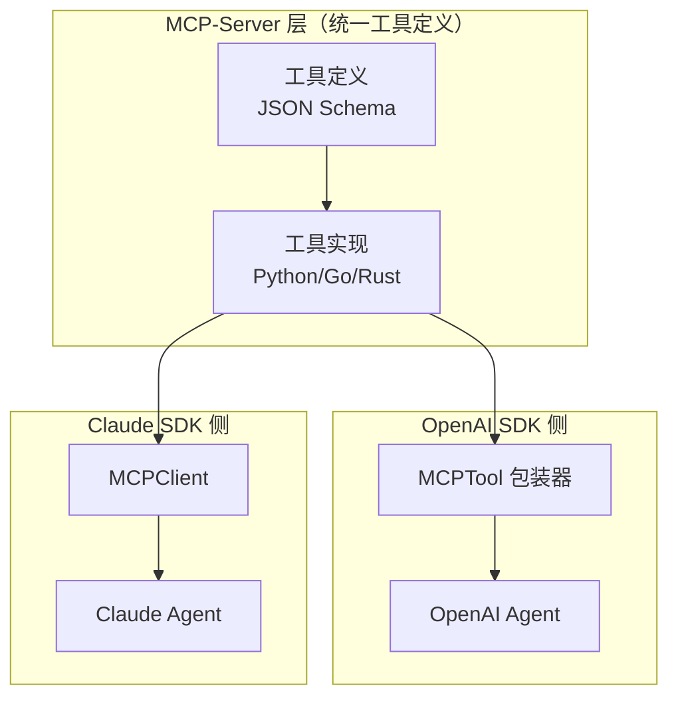

#### 3.1.2 共享 MCP Server 的客户端代码

```python
# ============================================================
# 共享 MCP 工具注册表
# ============================================================

from agents import MCPTool  # OpenAI SDK
from anthropic.mcp import MCPClient  # Claude SDK

class SharedMCPToolRegistry:
    """
    共享 MCP 工具注册表。
    为 OpenAI SDK 和 Claude SDK 提供统一的工具访问。
    """

    def __init__(self, mcp_server_urls: dict[str, str]):
        """
        Args:
            mcp_server_urls: {server_name: url}
        """
        self.mcp_server_urls = mcp_server_urls

        # OpenAI SDK 的 MCPTool 实例
        self.openai_tools: dict[str, MCPTool] = {}

        # Claude SDK 的 MCPClient 实例
        self.claude_client: MCPClient | None = None

    def initialize_openai_tools(self) -> dict[str, MCPTool]:
        """初始化 OpenAI SDK 的 MCP 工具。"""
        for server_name, url in self.mcp_server_urls.items():
            self.openai_tools[server_name] = MCPTool(
                server_url=url,
                # OpenAI SDK 自动发现该 Server 提供的所有工具
                auto_discover=True,
            )
        return self.openai_tools

    def initialize_claude_client(self) -> MCPClient:
        """初始化 Claude SDK 的 MCP 客户端。"""
        from anthropic.mcp import MCPServer

        servers = [
            MCPServer(name=name, url=url)
            for name, url in self.mcp_server_urls.items()
        ]

        self.claude_client = MCPClient(servers=servers)
        return self.claude_client

    def get_openai_tool(self, server_name: str, tool_name: str) -> MCPTool:
        """获取 OpenAI SDK 的特定工具。"""
        if server_name not in self.openai_tools:
            raise ValueError(f"Server not initialized: {server_name}")
        return self.openai_tools[server_name].get_tool(tool_name)

    async def call_tool_for_both_sdks(
        self,
        tool_name: str,
        arguments: dict,
        sdk: str = "auto",  # "openai" | "claude" | "auto"
    ) -> dict:
        """
        为两个 SDK 提供统一的工具调用接口。
        根据当前上下文自动选择 SDK，或显式指定。
        """
        if sdk == "openai":
            # 通过 OpenAI SDK 调用
            tool = self.get_openai_tool("riscv-tools", tool_name)
            return await tool.invoke(**arguments)

        elif sdk == "claude":
            # 通过 Claude SDK 调用
            if not self.claude_client:
                raise RuntimeError("Claude MCP client not initialized")
            return await self.claude_client.call_tool(
                server_name="riscv-tools",
                tool_name=tool_name,
                arguments=arguments,
            )

        elif sdk == "auto":
            # 自动选择: 优先使用 Claude SDK（工具调用成功率更高）
            if self.claude_client:
                return await self.call_tool_for_both_sdks(tool_name, arguments, "claude")
            return await self.call_tool_for_both_sdks(tool_name, arguments, "openai")

        raise ValueError(f"Unknown SDK: {sdk}")

# ============================================================
# 初始化共享工具注册表
# ============================================================

registry = SharedMCPToolRegistry({
    "riscv-rag": "http://mcp-rag-server:8080",
    "riscv-static-analysis": "http://mcp-static-analysis:8081",
    "riscv-git-ops": "http://mcp-git-ops:8082",
    "riscv-qemu": "http://mcp-qemu:8083",
})

# 初始化 OpenAI 侧工具
openai_tools = registry.initialize_openai_tools()

# 初始化 Claude 侧客户端
claude_mcp_client = registry.initialize_claude_client()

# ============================================================
# 在 Agent 定义中使用共享工具
# ============================================================

# OpenAI SDK Agent 使用 MCP 工具
reviewer_agent = Agent(
    name="reviewer",
    model="codex",
    instructions="...",
    tools=[
        openai_tools["riscv-rag"].get_tool("query_knowledge"),
        openai_tools["riscv-static-analysis"].get_tool("run_semgrep"),
    ],
)

# Claude SDK Agent 使用 MCP 工具
planner_agent = Agent(
    model="claude-sonnet-4-5",
    instructions="...",
    mcp_client=claude_mcp_client,
)
```

---

### 3.2 状态同步：PostgreSQL 共享状态层

#### 3.2.1 表结构设计

PostgreSQL 作为双 SDK 的**共享状态层**，存储：
1. OpenAI SDK 原生 Session 状态（由 SDK 自动维护）
2. Claude SDK 执行结果（由应用层写入）
3. RV-Insights 应用层状态（人工审核决策、迭代计数等）

```sql
-- ============================================================
-- 1. OpenAI SDK 管理的 Session 表（由 SDK 自动维护）
-- ============================================================
CREATE TABLE openai_sessions (
    session_id          UUID PRIMARY KEY,
    agent_id            TEXT NOT NULL,
    thread_id           UUID NOT NULL,
    state               JSONB NOT NULL,
    created_at          TIMESTAMPTZ DEFAULT NOW(),
    updated_at          TIMESTAMPTZ DEFAULT NOW()
);

-- ============================================================
-- 2. Claude SDK 执行结果表
-- ============================================================
CREATE TABLE claude_executions (
    id                  BIGINT GENERATED ALWAYS AS IDENTITY PRIMARY KEY,
    session_id          UUID NOT NULL REFERENCES openai_sessions(session_id) ON DELETE CASCADE,
    execution_id        TEXT NOT NULL UNIQUE,  -- Claude SDK 的执行 ID
    agent_name          TEXT NOT NULL,         -- 如 "feasibility-judge", "planner"
    model               TEXT NOT NULL,
    input_context       JSONB,
    output_result       JSONB,
    token_usage         JSONB,  -- { input_tokens, output_tokens }
    latency_ms          INT,
    status              TEXT NOT NULL DEFAULT 'running'
        CHECK (status IN ('running', 'completed', 'failed')),
    created_at          TIMESTAMPTZ DEFAULT NOW(),
    completed_at        TIMESTAMPTZ
);

CREATE INDEX claude_executions_session_id_idx ON claude_executions(session_id);
CREATE INDEX claude_executions_agent_name_idx ON claude_executions(agent_name);
CREATE INDEX claude_executions_status_idx ON claude_executions(status);

-- ============================================================
-- 3. RV-Insights 应用层状态表（双 SDK 共享）
-- ============================================================
CREATE TABLE rvinsights_sessions (
    session_id          UUID PRIMARY KEY REFERENCES openai_sessions(session_id),
    tenant_id           BIGINT NOT NULL,
    current_stage       TEXT NOT NULL DEFAULT 'INITIALIZATION',
    status              TEXT NOT NULL DEFAULT 'running'
        CHECK (status IN ('running', 'interrupted', 'completed', 'failed', 'cancelled')),

    -- 各阶段产物（JSONB 存储结构化结果）
    exploration_result  JSONB,
    planning_result     JSONB,
    development_result  JSONB,
    review_result       JSONB,
    testing_result      JSONB,

    -- 迭代控制
    dev_review_iteration_count INT NOT NULL DEFAULT 0,
    max_dev_review_iterations  INT NOT NULL DEFAULT 5,

    -- 人类审核决策
    human_decisions     JSONB DEFAULT '[]',
    human_notes         JSONB DEFAULT '[]',

    -- Agent 日志摘要
    agent_logs_summary  JSONB DEFAULT '[]',

    -- 时间戳记录
    timestamps          JSONB DEFAULT '[]',

    -- 资源与锁
    workspace_path      TEXT,
    git_lock_id         TEXT,
    qemu_instance_id    TEXT,

    -- 成本追踪
    total_tokens_consumed   BIGINT DEFAULT 0,
    total_cost_usd          DECIMAL(10, 6) DEFAULT 0,

    -- 版本控制
    state_version       INT NOT NULL DEFAULT 1,
    created_at          TIMESTAMPTZ DEFAULT NOW(),
    updated_at          TIMESTAMPTZ DEFAULT NOW()
);

CREATE INDEX rvinsights_sessions_tenant_id_idx ON rvinsights_sessions(tenant_id);
CREATE INDEX rvinsights_sessions_status_idx ON rvinsights_sessions(status);
CREATE INDEX rvinsights_sessions_current_stage_idx ON rvinsights_sessions(current_stage);

-- ============================================================
-- 4. 跨 SDK 事件表（用于异步通知）
-- ============================================================
CREATE TABLE cross_sdk_events (
    id              BIGINT GENERATED ALWAYS AS IDENTITY PRIMARY KEY,
    session_id      UUID NOT NULL REFERENCES openai_sessions(session_id) ON DELETE CASCADE,
    source_sdk      TEXT NOT NULL CHECK (source_sdk IN ('openai', 'anthropic')),
    target_sdk      TEXT NOT NULL CHECK (target_sdk IN ('openai', 'anthropic')),
    event_type      TEXT NOT NULL,
    payload         JSONB NOT NULL,
    status          TEXT NOT NULL DEFAULT 'pending'
        CHECK (status IN ('pending', 'processed', 'failed')),
    created_at      TIMESTAMPTZ DEFAULT NOW(),
    processed_at    TIMESTAMPTZ
);

CREATE INDEX cross_sdk_events_session_id_idx ON cross_sdk_events(session_id);
CREATE INDEX cross_sdk_events_status_idx ON cross_sdk_events(status);
CREATE INDEX cross_sdk_events_target_sdk_idx ON cross_sdk_events(target_sdk);
```

#### 3.2.2 读写协议

```python
from typing import Optional
import asyncpg
import json

class SharedStateStore:
    """
    双 SDK 共享状态存储。
    提供原子性的读写操作，确保 OpenAI SDK 和 Claude SDK 的状态一致性。
    """

    def __init__(self, pool: asyncpg.Pool):
        self.pool = pool

    # ============================================================
    # OpenAI SDK 状态读写
    # ============================================================

    async def load_openai_session(self, session_id: str) -> dict:
        """加载 OpenAI SDK 的 Session 状态。"""
        async with self.pool.acquire() as conn:
            row = await conn.fetchrow(
                "SELECT state FROM openai_sessions WHERE session_id = $1",
                session_id,
            )
            return json.loads(row["state"]) if row else {}

    async def save_openai_session(self, session_id: str, state: dict):
        """保存 OpenAI SDK 的 Session 状态。"""
        async with self.pool.acquire() as conn:
            await conn.execute(
                """
                INSERT INTO openai_sessions (session_id, agent_id, thread_id, state, updated_at)
                VALUES ($1, $2, $3, $4, NOW())
                ON CONFLICT (session_id) DO UPDATE SET
                    state = EXCLUDED.state,
                    updated_at = NOW()
                """,
                session_id,
                state.get("agent_id", ""),
                state.get("thread_id", ""),
                json.dumps(state),
            )

    # ============================================================
    # Claude SDK 执行结果读写
    # ============================================================

    async def save_claude_execution(
        self,
        session_id: str,
        execution_id: str,
        agent_name: str,
        model: str,
        input_context: dict,
        output_result: dict,
        token_usage: dict,
        latency_ms: int,
    ):
        """保存 Claude SDK 的执行结果。"""
        async with self.pool.acquire() as conn:
            await conn.execute(
                """
                INSERT INTO claude_executions
                (session_id, execution_id, agent_name, model, input_context,
                 output_result, token_usage, latency_ms, status, completed_at)
                VALUES ($1, $2, $3, $4, $5, $6, $7, $8, 'completed', NOW())
                ON CONFLICT (execution_id) DO UPDATE SET
                    output_result = EXCLUDED.output_result,
                    token_usage = EXCLUDED.token_usage,
                    latency_ms = EXCLUDED.latency_ms,
                    status = 'completed',
                    completed_at = NOW()
                """,
                session_id, execution_id, agent_name, model,
                json.dumps(input_context), json.dumps(output_result),
                json.dumps(token_usage), latency_ms,
            )

    async def load_claude_executions(self, session_id: str, agent_name: Optional[str] = None) -> list[dict]:
        """加载 Claude SDK 的执行结果。"""
        async with self.pool.acquire() as conn:
            if agent_name:
                rows = await conn.fetch(
                    "SELECT * FROM claude_executions WHERE session_id = $1 AND agent_name = $2 ORDER BY created_at",
                    session_id, agent_name,
                )
            else:
                rows = await conn.fetch(
                    "SELECT * FROM claude_executions WHERE session_id = $1 ORDER BY created_at",
                    session_id,
                )
            return [dict(row) for row in rows]

    # ============================================================
    # RV-Insights 应用层状态读写（双 SDK 共享）
    ============================================================

    async def load_session_state(self, session_id: str) -> dict:
        """加载完整的 RV-Insights 会话状态。"""
        async with self.pool.acquire() as conn:
            row = await conn.fetchrow(
                "SELECT * FROM rvinsights_sessions WHERE session_id = $1",
                session_id,
            )
            return dict(row) if row else {}

    async def update_session_state(
        self,
        session_id: str,
        updates: dict,
        expected_version: Optional[int] = None,
    ) -> bool:
        """
        原子性更新会话状态。

        Args:
            expected_version: 乐观锁版本号。如果不匹配，更新失败。

        Returns:
            True if updated successfully, False if version conflict.
        """
        async with self.pool.acquire() as conn:
            async with conn.transaction():
                # 读取当前版本
                if expected_version is not None:
                    current = await conn.fetchval(
                        "SELECT state_version FROM rvinsights_sessions WHERE session_id = $1",
                        session_id,
                    )
                    if current != expected_version:
                        return False  # 版本冲突

                # 构建更新语句
                set_clauses = []
                values = []
                param_idx = 1

                for key, value in updates.items():
                    set_clauses.append(f"{key} = ${param_idx}")
                    values.append(json.dumps(value) if isinstance(value, (dict, list)) else value)
                    param_idx += 1

                # 自动递增版本号
                set_clauses.append(f"state_version = state_version + 1")
                set_clauses.append("updated_at = NOW()")

                values.append(session_id)

                query = f"""
                    UPDATE rvinsights_sessions
                    SET {', '.join(set_clauses)}
                    WHERE session_id = ${param_idx}
                """

                await conn.execute(query, *values)
                return True

    # ============================================================
    # 跨 SDK 事件通知
    # ============================================================

    async def emit_cross_sdk_event(
        self,
        session_id: str,
        source_sdk: str,
        target_sdk: str,
        event_type: str,
        payload: dict,
    ):
        """
        发出跨 SDK 事件。
        用于 OpenAI SDK 通知 Claude SDK，或反之。
        """
        async with self.pool.acquire() as conn:
            await conn.execute(
                """
                INSERT INTO cross_sdk_events
                (session_id, source_sdk, target_sdk, event_type, payload)
                VALUES ($1, $2, $3, $4, $5)
                """,
                session_id, source_sdk, target_sdk, event_type, json.dumps(payload),
            )

    async def poll_cross_sdk_events(
        self,
        target_sdk: str,
        batch_size: int = 10,
    ) -> list[dict]:
        """
        轮询待处理的跨 SDK 事件。
        由目标 SDK 的后台任务定期调用。
        """
        async with self.pool.acquire() as conn:
            rows = await conn.fetch(
                """
                UPDATE cross_sdk_events
                SET status = 'processed', processed_at = NOW()
                WHERE id IN (
                    SELECT id FROM cross_sdk_events
                    WHERE target_sdk = $1 AND status = 'pending'
                    ORDER BY created_at
                    LIMIT $2
                    FOR UPDATE SKIP LOCKED
                )
                RETURNING *
                """,
                target_sdk, batch_size,
            )
            return [dict(row) for row in rows]
```

#### 3.2.3 状态同步流程

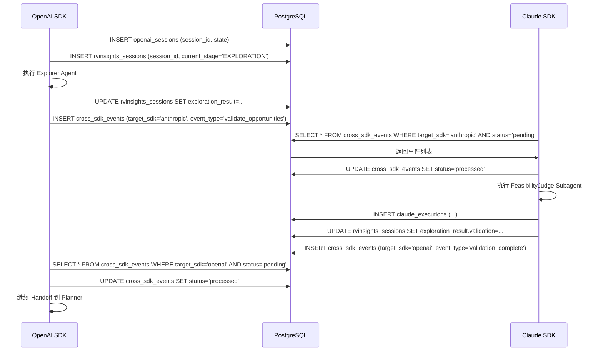

---

### 3.3 错误传递：跨 SDK 错误处理

#### 3.3.1 错误分类体系

```python
from enum import Enum, auto
from dataclasses import dataclass
from typing import Optional

class ErrorCategory(Enum):
    """错误分类。"""
    LLM_API_ERROR = auto()          # LLM API 调用失败（限流、超时、不可用）
    TOOL_EXECUTION_ERROR = auto()   # 工具执行失败（MCP-Server 错误）
    VALIDATION_ERROR = auto()       # Guardrails 校验失败
    SANDBOX_ERROR = auto()          # 沙箱执行失败（编译错误、超时）
    STATE_SYNC_ERROR = auto()       # 状态同步失败
    HUMAN_REVIEW_TIMEOUT = auto()   # 人工审核超时
    BUDGET_EXHAUSTED = auto()       # Token 预算耗尽
    UNKNOWN = auto()

class ErrorSeverity(Enum):
    """错误严重级别。"""
    TRANSIENT = auto()      # 瞬态错误，可重试
    RECOVERABLE = auto()    # 可恢复错误，需降级处理
    FATAL = auto()          # 致命错误，终止会话

@dataclass
class RVInsightsError:
    """标准化的错误结构。"""
    error_id: str
    category: ErrorCategory
    severity: ErrorSeverity
    source_sdk: str  # "openai" | "anthropic"
    target_sdk: Optional[str]  # 错误影响的目标 SDK
    message: str
    details: dict
    timestamp: str
    retryable: bool
    retry_count: int = 0
    max_retries: int = 3
```

#### 3.3.2 错误传递协议

```python
class CrossSDKErrorHandler:
    """
    跨 SDK 错误处理器。
    负责将 OpenAI SDK 的错误传递给 Claude SDK，反之亦然。
    """

    def __init__(self, state_store: SharedStateStore, event_bus: "EventBus"):
        self.state_store = state_store
        self.event_bus = event_bus

    async def handle_openai_error(
        self,
        session_id: str,
        error: Exception,
        current_agent: str,
    ) -> RVInsightsError:
        """
        处理 OpenAI SDK 的错误，并决定是否需要传递给 Claude SDK。
        """
        rv_error = self._classify_openai_error(error, current_agent)

        # 持久化错误
        await self._persist_error(session_id, rv_error)

        if rv_error.severity == ErrorSeverity.FATAL:
            # 致命错误: 终止会话
            await self._terminate_session(session_id, rv_error)
        elif rv_error.severity == ErrorSeverity.RECOVERABLE:
            # 可恢复错误: 尝试降级或通知另一 SDK
            await self._handle_recoverable_error(session_id, rv_error)
        elif rv_error.retryable and rv_error.retry_count < rv_error.max_retries:
            # 瞬态错误: 重试
            await self._retry_operation(session_id, rv_error)

        return rv_error

    async def handle_claude_error(
        self,
        session_id: str,
        error: Exception,
        current_subagent: str,
    ) -> RVInsightsError:
        """
        处理 Claude SDK 的错误，并决定是否需要传递给 OpenAI SDK。
        """
        rv_error = self._classify_claude_error(error, current_subagent)
        await self._persist_error(session_id, rv_error)

        # 通知 OpenAI SDK（通过跨 SDK 事件）
        if rv_error.target_sdk == "openai":
            await self.state_store.emit_cross_sdk_event(
                session_id=session_id,
                source_sdk="anthropic",
                target_sdk="openai",
                event_type="claude_error",
                payload={
                    "error_id": rv_error.error_id,
                    "category": rv_error.category.name,
                    "severity": rv_error.severity.name,
                    "message": rv_error.message,
                },
            )

        return rv_error

    def _classify_openai_error(self, error: Exception, agent: str) -> RVInsightsError:
        """分类 OpenAI SDK 错误。"""
        from openai import RateLimitError, APIError, APITimeoutError

        if isinstance(error, RateLimitError):
            return RVInsightsError(
                error_id=f"err_{uuid4().hex[:8]}",
                category=ErrorCategory.LLM_API_ERROR,
                severity=ErrorSeverity.TRANSIENT,
                source_sdk="openai",
                target_sdk=None,
                message=f"OpenAI API rate limited for agent {agent}",
                details={"agent": agent, "retry_after": error.headers.get("retry-after")},
                timestamp=datetime.now().isoformat(),
                retryable=True,
            )
        elif isinstance(error, APITimeoutError):
            return RVInsightsError(
                error_id=f"err_{uuid4().hex[:8]}",
                category=ErrorCategory.LLM_API_ERROR,
                severity=ErrorSeverity.TRANSIENT,
                source_sdk="openai",
                target_sdk=None,
                message=f"OpenAI API timeout for agent {agent}",
                details={"agent": agent},
                timestamp=datetime.now().isoformat(),
                retryable=True,
            )
        elif isinstance(error, APIError):
            return RVInsightsError(
                error_id=f"err_{uuid4().hex[:8]}",
                category=ErrorCategory.LLM_API_ERROR,
                severity=ErrorSeverity.FATAL,
                source_sdk="openai",
                target_sdk="anthropic",  # 通知 Claude SDK 做降级
                message=f"OpenAI API error: {error.message}",
                details={"agent": agent, "code": error.code},
                timestamp=datetime.now().isoformat(),
                retryable=False,
            )

        # 默认: 未知错误
        return RVInsightsError(
            error_id=f"err_{uuid4().hex[:8]}",
            category=ErrorCategory.UNKNOWN,
            severity=ErrorSeverity.RECOVERABLE,
            source_sdk="openai",
            target_sdk=None,
            message=str(error),
            details={"agent": agent},
            timestamp=datetime.now().isoformat(),
            retryable=False,
        )

    def _classify_claude_error(self, error: Exception, subagent: str) -> RVInsightsError:
        """分类 Claude SDK 错误。"""
        from anthropic import RateLimitError, APIError, APITimeoutError

        if isinstance(error, RateLimitError):
            return RVInsightsError(
                error_id=f"err_{uuid4().hex[:8]}",
                category=ErrorCategory.LLM_API_ERROR,
                severity=ErrorSeverity.TRANSIENT,
                source_sdk="anthropic",
                target_sdk=None,
                message=f"Claude API rate limited for subagent {subagent}",
                details={"subagent": subagent},
                timestamp=datetime.now().isoformat(),
                retryable=True,
            )
        elif isinstance(error, APIError):
            # Claude API 错误可能需要通知 OpenAI SDK 切换模型
            return RVInsightsError(
                error_id=f"err_{uuid4().hex[:8]}",
                category=ErrorCategory.LLM_API_ERROR,
                severity=ErrorSeverity.RECOVERABLE,
                source_sdk="anthropic",
                target_sdk="openai",  # 通知 OpenAI SDK 切换模型
                message=f"Claude API error: {error.message}",
                details={"subagent": subagent},
                timestamp=datetime.now().isoformat(),
                retryable=False,
            )

        return RVInsightsError(
            error_id=f"err_{uuid4().hex[:8]}",
            category=ErrorCategory.UNKNOWN,
            severity=ErrorSeverity.RECOVERABLE,
            source_sdk="anthropic",
            target_sdk=None,
            message=str(error),
            details={"subagent": subagent},
            timestamp=datetime.now().isoformat(),
            retryable=False,
        )
```

---

### 3.4 成本路由：模型选择决策逻辑

#### 3.4.1 成本路由策略

```python
from dataclasses import dataclass
from typing import Optional

@dataclass
class ModelRoutingDecision:
    """模型路由决策结果。"""
    model: str
    provider: str  # "openai" | "anthropic"
    sdk: str       # "openai" | "claude"
    reasoning: str
    estimated_cost_usd: float

class CostRouter:
    """
    成本路由器。
    根据任务类型、预算状态、模型可用性，决策使用哪个模型。
    """

    # 模型定价（USD per 1M tokens，2026 Q2）
    PRICING = {
        "gpt-4.1": {"input": 2.00, "output": 8.00, "provider": "openai"},
        "gpt-4.1-mini": {"input": 0.50, "output": 2.00, "provider": "openai"},
        "codex": {"input": 4.00, "output": 16.00, "provider": "openai"},
        "claude-sonnet-4-5": {"input": 3.00, "output": 15.00, "provider": "anthropic"},
        "claude-opus-4-5": {"input": 15.00, "output": 75.00, "provider": "anthropic"},
        "claude-haiku-4-5": {"input": 0.25, "output": 1.25, "provider": "anthropic"},
    }

    # 默认路由规则
    DEFAULT_ROUTES = {
        "orchestration": {"model": "gpt-4.1", "reasoning": "高频编排调用，成本控制优先"},
        "exploration_broad": {"model": "gpt-4.1", "reasoning": "广度扫描，成本低适合大量文本"},
        "exploration_deep": {"model": "claude-sonnet-4-5", "reasoning": "深度验证需要推理质量"},
        "planning": {"model": "claude-sonnet-4-5", "reasoning": "规划错误代价高，推理质量优先"},
        "development": {"model": "claude-sonnet-4-5", "reasoning": "用户指定 Claude Code"},
        "review": {"model": "codex", "reasoning": "用户指定 Codex，审核专项优化"},
        "testing_env": {"model": "gpt-4.1", "reasoning": "环境搭建，结构化任务"},
        "testing_analysis": {"model": "claude-sonnet-4-5", "reasoning": "失败分析需要深度推理"},
    }

    def __init__(self, cost_tracker: CostTracker, session_budget: float):
        self.cost_tracker = cost_tracker
        self.session_budget = session_budget

    async def route(
        self,
        task_type: str,
        session_id: str,
        estimated_input_tokens: int = 1000,
        estimated_output_tokens: int = 2000,
        force_model: Optional[str] = None,
    ) -> ModelRoutingDecision:
        """
        路由决策。

        Args:
            task_type: 任务类型（见 DEFAULT_ROUTES）
            session_id: 会话 ID（用于检查预算）
            estimated_input_tokens: 估计输入 Token 数
            estimated_output_tokens: 估计输出 Token 数
            force_model: 强制使用指定模型（覆盖默认路由）
        """
        # 1. 检查强制模型
        if force_model:
            pricing = self.PRICING.get(force_model, {})
            return ModelRoutingDecision(
                model=force_model,
                provider=pricing.get("provider", "openai"),
                sdk="openai" if pricing.get("provider") == "openai" else "claude",
                reasoning=f"强制使用指定模型: {force_model}",
                estimated_cost_usd=self._estimate_cost(
                    force_model, estimated_input_tokens, estimated_output_tokens
                ),
            )

        # 2. 检查预算状态
        current_cost = await self.cost_tracker.get_session_cost_summary(session_id)
        remaining_budget = self.session_budget - current_cost["total_cost_usd"]

        # 3. 获取默认路由
        default_route = self.DEFAULT_ROUTES.get(task_type, self.DEFAULT_ROUTES["orchestration"])
        default_model = default_route["model"]

        # 4. 预算不足时降级
        estimated_cost = self._estimate_cost(
            default_model, estimated_input_tokens, estimated_output_tokens
        )

        if estimated_cost > remaining_budget * 0.5:
            # 预算紧张，降级到更便宜的模型
            fallback_model = self._get_fallback_model(default_model)
            return ModelRoutingDecision(
                model=fallback_model,
                provider=self.PRICING[fallback_model]["provider"],
                sdk="openai" if self.PRICING[fallback_model]["provider"] == "openai" else "claude",
                reasoning=f"预算紧张（剩余 ${remaining_budget:.2f}），从 {default_model} 降级到 {fallback_model}",
                estimated_cost_usd=self._estimate_cost(
                    fallback_model, estimated_input_tokens, estimated_output_tokens
                ),
            )

        # 5. 返回默认路由
        return ModelRoutingDecision(
            model=default_model,
            provider=self.PRICING[default_model]["provider"],
            sdk="openai" if self.PRICING[default_model]["provider"] == "openai" else "claude",
            reasoning=default_route["reasoning"],
            estimated_cost_usd=estimated_cost,
        )

    def _estimate_cost(self, model: str, input_tokens: int, output_tokens: int) -> float:
        """估计调用成本。"""
        pricing = self.PRICING.get(model, {"input": 0, "output": 0})
        input_cost = (input_tokens / 1_000_000) * pricing["input"]
        output_cost = (output_tokens / 1_000_000) * pricing["output"]
        return round(input_cost + output_cost, 6)

    def _get_fallback_model(self, model: str) -> str:
        """获取降级模型。"""
        fallbacks = {
            "claude-opus-4-5": "claude-sonnet-4-5",
            "claude-sonnet-4-5": "gpt-4.1",
            "codex": "gpt-4.1",
            "gpt-4.1": "gpt-4.1-mini",
            "gpt-4.1-mini": "gpt-4.1-mini",  # 已是最便宜
        }
        return fallbacks.get(model, "gpt-4.1-mini")
```

---

## 4. 完整伪代码（基于 2026 Q2 SDK API）

### 4.1 OpenAI Agents SDK Handoff 图完整代码

```python
#!/usr/bin/env python3
"""
RV-Insights v2: OpenAI Agents SDK 编排核心完整实现
SDK 版本: openai-agents >= 1.5.0
Python 版本: >= 3.11
"""

from agents import Agent, handoff, Session, interrupt, ResumeCommand
from agents import GuardrailFunction, SandboxConfig, MCPTool
from agents.tracing import OpenTelemetryExporter, TracingConfig
from agents.providers import ProviderRegistry, AnthropicProvider, OpenAIProvider
from opentelemetry.sdk.trace import TracerProvider
from opentelemetry.sdk.trace.export import BatchSpanProcessor
from opentelemetry.exporter.otlp.proto.grpc.trace_exporter import OTLPSpanExporter

from pydantic import BaseModel, Field
from typing import Literal, Optional, List, Dict, Any
from datetime import datetime, timezone
import asyncio
import json
import os
import uuid

# ============================================================
# 配置 Provider
# ============================================================

ProviderRegistry.register("openai", OpenAIProvider(
    api_key=os.environ["OPENAI_API_KEY"],
))

ProviderRegistry.register("anthropic", AnthropicProvider(
    api_key=os.environ["ANTHROPIC_API_KEY"],
    enable_extended_thinking=True,
))

# ============================================================
# 工具定义（通过 MCP）
# ============================================================

mcp_rag = MCPTool(server_url="http://mcp-rag-server:8080", auto_discover=True)
mcp_static = MCPTool(server_url="http://mcp-static-analysis:8081", auto_discover=True)
mcp_git = MCPTool(server_url="http://mcp-git-ops:8082", auto_discover=True)
mcp_qemu = MCPTool(server_url="http://mcp-qemu:8083", auto_discover=True)

# ============================================================
# Guardrails 定义
# ============================================================

def check_csr_references(output: dict) -> dict:
    """检查 CSR 引用完整性。"""
    issues = output.get("issues", [])
    for issue in issues:
        if "csr" in issue.get("category", "").lower():
            if "Section" not in issue.get("description", ""):
                return {"passed": False, "violation": "Missing spec section reference"}
    return {"passed": True}

def check_no_secrets(output: dict) -> dict:
    """检查硬编码密钥。"""
    import re
    patch = output.get("patch", "")
    if re.search(r'api[_-]?key\s*[=:]\s*["\'][a-zA-Z0-9]{32,}', patch, re.I):
        return {"passed": False, "violation": "Hardcoded API key detected"}
    return {"passed": True}

riscv_spec_guardrail = GuardrailFunction(
    name="riscv_spec_compliance",
    check=check_csr_references,
    on_fail="revision_required",
)

security_guardrail = GuardrailFunction(
    name="no_hardcoded_secrets",
    check=check_no_secrets,
    on_fail="reject",
)

# ============================================================
# Agent 定义
# ============================================================

explorer = Agent(
    name="riscv-explorer",
    model="gpt-4.1",
    instructions="扫描 RISC-V 生态，发现贡献机会。输出 JSON 格式。",
    tools=[mcp_rag.get_tool("query_knowledge"), mcp_git.get_tool("github_search")],
)

planner = Agent(
    name="riscv-planner",
    model="claude-sonnet-4-5",
    model_provider="anthropic",
    instructions="将贡献机会转化为结构化开发方案。输出 JSON 格式。",
    tools=[mcp_rag.get_tool("query_knowledge"), mcp_git.get_tool("git_clone")],
)

developer = Agent(
    name="riscv-developer",
    model="claude-sonnet-4-5",
    model_provider="anthropic",
    instructions="实现审核通过的方案。输出 JSON 格式。",
    tools=[mcp_git.get_tool("git_commit"), mcp_static.get_tool("run_semgrep")],
    output_guardrails=[security_guardrail],
)

reviewer = Agent(
    name="riscv-reviewer",
    model="codex",
    instructions="对代码变更进行多维度审查。输出 JSON 格式。",
    tools=[mcp_static.get_tool("run_semgrep"), mcp_rag.get_tool("query_knowledge")],
    output_guardrails=[riscv_spec_guardrail],
)

tester = Agent(
    name="riscv-tester",
    model="gpt-4.1",
    instructions="搭建环境并执行测试验证。输出 JSON 格式。",
    tools=[mcp_qemu.get_tool("start_emulation"), mcp_qemu.get_tool("run_tests")],
    sandbox=SandboxConfig(
        provider="e2b",
        image="rvinsights/qemu-riscv:rv64gc-2026q2",
        resources={"cpu": 4, "memory": "8g", "timeout": 3600},
    ),
)

# ============================================================
# Handoff 图
# ============================================================

explorer.handoffs = [handoff(planner, description="探索完成，进入规划")]
planner.handoffs = [handoff(developer, description="规划完成，进入开发")]
developer.handoffs = [handoff(reviewer, description="开发完成，进入审核")]
reviewer.handoffs = [
    handoff(developer, condition="needs_revision", description="审核未通过，返回修复"),
    handoff(tester, condition="pass", description="审核通过，进入测试"),
]
tester.handoffs = [handoff(None, description="测试完成，等待人工审核")]

# ============================================================
# 人工审核决策 Schema
# ============================================================

class HumanDecision(BaseModel):
    stage: Literal["HUMAN_REVIEW_EXPLORATION", "HUMAN_REVIEW_PLANNING",
                   "HUMAN_REVIEW_CODE", "HUMAN_REVIEW_TESTING"]
    decision: Literal["APPROVE", "REJECT", "REQUEST_CHANGES", "ADD_NOTES"]
    comment: Optional[str] = None
    selected_opportunity_id: Optional[str] = None

# ============================================================
# Orchestrator
# ============================================================

class RVInsightsOrchestrator:
    def __init__(self, db_pool, redis_client):
        self.db = db_pool
        self.redis = redis_client
        self.tracing = self._init_tracing()

    def _init_tracing(self):
        provider = TracerProvider()
        provider.add_span_processor(BatchSpanProcessor(
            OTLPSpanExporter(endpoint=os.environ.get("OTEL_ENDPOINT", "http://localhost:4317"))
        ))
        return TracingConfig(
            enabled=True,
            exporter=OpenTelemetryExporter(provider=provider),
            sampling_rate=1.0,
        )

    async def run_session(self, session_id: str, user_query: str):
        session = Session(session_id=session_id)

        try:
            # 探索阶段
            exp_result = await session.run(explorer, input={"query": user_query})
            await self._save_stage_result(session_id, "exploration", exp_result)

            # 人工审核 1
            decision = await self._human_review(session, "HUMAN_REVIEW_EXPLORATION", exp_result)
            if decision.decision == "REJECT":
                return await self._finalize(session_id, "rejected")

            # 规划阶段
            plan_result = await session.run(planner, input={
                "exploration": exp_result,
                "selected_opportunity": decision.selected_opportunity_id,
            })
            await self._save_stage_result(session_id, "planning", plan_result)

            # 人工审核 2
            decision = await self._human_review(session, "HUMAN_REVIEW_PLANNING", plan_result)
            if decision.decision == "REJECT":
                return await self._finalize(session_id, "rejected")

            # 开发-审核迭代
            dev_result = await self._dev_review_loop(session, plan_result)

            # 人工审核 3
            decision = await self._human_review(session, "HUMAN_REVIEW_CODE", dev_result)
            if decision.decision == "REJECT":
                return await self._finalize(session_id, "rejected")

            # 测试阶段
            test_result = await session.run(tester, input={"development": dev_result})
            await self._save_stage_result(session_id, "testing", test_result)

            # 人工审核 4
            decision = await self._human_review(session, "HUMAN_REVIEW_TESTING", test_result)
            if decision.decision == "REJECT":
                return await self._finalize(session_id, "rejected")

            return await self._finalize(session_id, "completed")

        except Exception as e:
            await self._handle_error(session_id, e)
            raise

    async def _human_review(self, session: Session, stage: str, artifacts: dict):
        result = await interrupt(
            session=session,
            node_id=stage,
            message=f"等待人工审核: {stage}",
            metadata={"stage": stage, "artifacts": artifacts},
            timeout=None,
        )
        return HumanDecision(**result.data)

    async def _dev_review_loop(self, session: Session, plan: dict, max_iter: int = 5):
        iteration = 0
        dev_result = None

        while iteration < max_iter:
            # 开发
            dev_input = {"plan": plan, "previous_review": None if iteration == 0 else review_result}
            dev_result = await session.run(developer, input=dev_input)

            # 审核
            review_result = await session.run(reviewer, input={"patch": dev_result.get("patch")})

            if review_result.get("overall_verdict") == "PASS":
                return dev_result

            iteration += 1

        # 达到最大迭代次数，返回最后一次结果
        return dev_result

    async def _save_stage_result(self, session_id: str, stage: str, result: dict):
        await self.db.execute(
            "UPDATE rvinsights_sessions SET {} = $1 WHERE session_id = $2".format(stage + "_result"),
            json.dumps(result), session_id,
        )

    async def _finalize(self, session_id: str, status: str):
        await self.db.execute(
            "UPDATE rvinsights_sessions SET status = $1, completed_at = NOW() WHERE session_id = $2",
            status, session_id,
        )
        return {"session_id": session_id, "status": status}

    async def _handle_error(self, session_id: str, error: Exception):
        await self.db.execute(
            "UPDATE rvinsights_sessions SET status = 'failed', last_error = $1 WHERE session_id = $2",
            json.dumps({"message": str(error), "timestamp": datetime.now().isoformat()}),
            session_id,
        )
```

### 4.2 Claude Agent SDK Subagent 调用代码

```python
#!/usr/bin/env python3
"""
RV-Insights v2: Claude Agent SDK Subagent 调用完整实现
SDK 版本: anthropic-agent-sdk >= 0.5.0
"""

from anthropic.agents import Agent, Subagent, SubagentResult
from anthropic.mcp import MCPClient, MCPServer
from anthropic.tools import ComputerUseTool, BashTool, FileReadTool
from typing import List, Dict
import asyncio
import json

# ============================================================
# MCP Client
# ============================================================

mcp_client = MCPClient(servers=[
    MCPServer(name="riscv-rag", url="http://mcp-rag-server:8080"),
    MCPServer(name="riscv-static", url="http://mcp-static-analysis:8081"),
])

# ============================================================
# FeasibilityJudge Subagent
# ============================================================

class FeasibilityJudge(Subagent):
    def __init__(self):
        super().__init__(
            name="feasibility-judge",
            model="claude-sonnet-4-5",
            instructions="""
            验证 RISC-V 贡献机会的可行性。
            输出 JSON: {feasibility_score, confidence, verification_details, reasoning}
            """,
            max_context_tokens=200_000,
        )

    async def validate(self, opportunity: dict, repo_context: dict) -> dict:
        result = await self.run(
            input_prompt=f"验证机会: {json.dumps(opportunity)}\n仓库: {json.dumps(repo_context)}",
            tools=[mcp_client],
            max_tokens=8000,
        )
        return json.loads(result.output)

# ============================================================
# FailureAnalyzer Subagent
# ============================================================

class FailureAnalyzer(Subagent):
    def __init__(self):
        super().__init__(
            name="failure-analyzer",
            model="claude-sonnet-4-5",
            instructions="""
            分析测试失败日志，定位根因。
            输出 JSON: {root_cause, confidence, suggested_fix, affected_files}
            """,
            max_context_tokens=200_000,
        )

    async def analyze(self, test_logs: str, build_logs: str) -> dict:
        result = await self.run(
            input_prompt=f"测试日志:\n{test_logs}\n\n构建日志:\n{build_logs}",
            max_tokens=8000,
        )
        return json.loads(result.output)

# ============================================================
# Planner with Computer Use
# ============================================================

class PlannerWithComputerUse(Agent):
    def __init__(self):
        super().__init__(
            model="claude-sonnet-4-5",
            instructions="通过 Computer Use 浏览代码库，绘制变更影响图。",
            tools=[ComputerUseTool(), BashTool(), FileReadTool()],
            mcp_client=mcp_client,
        )

    async def analyze_codebase(self, repo_url: str, target_files: List[str]) -> dict:
        result = await self.run(
            input_prompt=f"""
            克隆 {repo_url} 到 /workspace/repo
            分析文件: {json.dumps(target_files)}
            使用 git grep 查找依赖关系
            输出 JSON 格式的变更影响图
            """,
        )
        return json.loads(result.output)

# ============================================================
# 使用示例
# ============================================================

async def main():
    # 创建 Subagent 实例
    judge = FeasibilityJudge()
    analyzer = FailureAnalyzer()
    planner = PlannerWithComputerUse()

    # 验证机会
    opportunity = {
        "title": "Add Zbb extension support to Linux kernel",
        "target_repo": "torvalds/linux",
        "target_files": ["arch/riscv/include/asm/bitops.h"],
    }
    repo_context = {"files": ["arch/riscv/include/asm/bitops.h", "arch/riscv/kernel/head.S"]}

    feasibility = await judge.validate(opportunity, repo_context)
    print(f"Feasibility: {feasibility['feasibility_score']}/10")

    # 分析代码库
    impact = await planner.analyze_codebase(
        "https://github.com/torvalds/linux",
        ["arch/riscv/include/asm/bitops.h"],
    )
    print(f"Affected files: {len(impact['affected_files'])}")

    # 分析测试失败
    test_logs = "... QEMU output ..."
    build_logs = "... make output ..."
    analysis = await analyzer.analyze(test_logs, build_logs)
    print(f"Root cause: {analysis['root_cause']}")

if __name__ == "__main__":
    asyncio.run(main())
```

### 4.3 双 SDK 共享 MCP Server 客户端代码

```python
#!/usr/bin/env python3
"""
RV-Insights v2: 双 SDK 共享 MCP Server 客户端
"""

from agents import MCPTool  # OpenAI SDK
from anthropic.mcp import MCPClient, MCPServer  # Claude SDK
from typing import Dict

class SharedMCPRegistry:
    """共享 MCP 工具注册表。"""

    SERVERS = {
        "riscv-rag": "http://mcp-rag-server:8080",
        "riscv-static": "http://mcp-static-analysis:8081",
        "riscv-git": "http://mcp-git-ops:8082",
        "riscv-qemu": "http://mcp-qemu:8083",
    }

    def __init__(self):
        self.openai_tools: Dict[str, MCPTool] = {}
        self.claude_client: MCPClient | None = None

    def init_openai(self) -> Dict[str, MCPTool]:
        for name, url in self.SERVERS.items():
            self.openai_tools[name] = MCPTool(server_url=url, auto_discover=True)
        return self.openai_tools

    def init_claude(self) -> MCPClient:
        servers = [MCPServer(name=n, url=u) for n, u in self.SERVERS.items()]
        self.claude_client = MCPClient(servers=servers)
        return self.claude_client

    async def call(self, tool_name: str, args: dict, sdk: str = "auto"):
        if sdk == "openai":
            return await self.openai_tools["riscv-tools"].get_tool(tool_name).invoke(**args)
        elif sdk == "claude":
            return await self.claude_client.call_tool(
                server_name="riscv-tools", tool_name=tool_name, arguments=args
            )
        # auto: 优先 Claude
        if self.claude_client:
            return await self.call(tool_name, args, "claude")
        return await self.call(tool_name, args, "openai")

# 初始化
registry = SharedMCPRegistry()
openai_tools = registry.init_openai()
claude_mcp = registry.init_claude()

# 在 Agent 中使用
# OpenAI SDK
reviewer = Agent(
    name="reviewer",
    model="codex",
    tools=[openai_tools["riscv-rag"].get_tool("query_knowledge")],
)

# Claude SDK
planner = Agent(
    model="claude-sonnet-4-5",
    mcp_client=claude_mcp,
)
```

### 4.4 Guardrails 自定义规则代码

```python
#!/usr/bin/env python3
"""
RV-Insights v2: Guardrails 自定义规则完整实现
"""

from agents import GuardrailFunction, GuardrailResult
import re

# --- RISC-V 规范合规性 ---

def check_csr_references(output: dict) -> GuardrailResult:
    issues = output.get("issues", [])
    for issue in issues:
        if "csr" in issue.get("category", "").lower():
            if not re.search(r"Section\s+\d+(\.\d+)*", issue.get("description", "")):
                return GuardrailResult(
                    passed=False,
                    violation=f"CSR issue missing spec reference: {issue.get('id')}",
                    suggested_fix="Add Privileged Spec section reference",
                )
    return GuardrailResult(passed=True)

def check_atomic_fence_pairing(output: dict) -> GuardrailResult:
    issues = output.get("issues", [])
    for issue in issues:
        if "atomic" in issue.get("category", "").lower():
            desc = issue.get("description", "").lower()
            if "fence" not in desc and "barrier" not in desc:
                return GuardrailResult(
                    passed=False,
                    violation=f"Atomic issue missing fence discussion: {issue.get('id')}",
                    suggested_fix="Check smp_mb__after_atomic() requirement",
                )
    return GuardrailResult(passed=True)

def check_verdict_consistency(output: dict) -> GuardrailResult:
    verdict = output.get("overall_verdict", "")
    blocking = [i for i in output.get("issues", []) if i.get("blocking")]
    if blocking and verdict == "PASS":
        return GuardrailResult(
            passed=False,
            violation=f"{len(blocking)} blocking issues but verdict is PASS",
            suggested_fix="Change verdict to NEEDS_REVISION",
            auto_correct={"overall_verdict": "NEEDS_REVISION"},
        )
    return GuardrailResult(passed=True)

# --- 安全性 ---

def check_no_hardcoded_secrets(output: dict) -> GuardrailResult:
    patch = output.get("patch", "")
    patterns = [
        (r'api[_-]?key\s*[=:]\s*["\'][a-zA-Z0-9]{32,}', "API Key"),
        (r'password\s*[=:]\s*["\'][^"\']+["\']', "Password"),
        (r'secret\s*[=:]\s*["\'][a-zA-Z0-9]{32,}', "Secret"),
    ]
    for pattern, secret_type in patterns:
        if re.search(pattern, patch, re.I):
            return GuardrailResult(
                passed=False,
                violation=f"Hardcoded {secret_type} detected",
                suggested_fix="Use environment variables",
            )
    return GuardrailResult(passed=True)

def check_inline_asm_safety(output: dict) -> GuardrailResult:
    patch = output.get("patch", "")
    if re.search(r'__asm__.*\bsp\b.*["\']', patch):
        return GuardrailResult(
            passed=False,
            violation="Inline asm modifies sp register",
            suggested_fix="Avoid modifying stack pointer",
        )
    if re.search(r'csrr\s+\w+,\s*0x[0-9a-fA-F]+', patch):
        return GuardrailResult(
            passed=False,
            violation="Bare CSR number instead of named macro",
            suggested_fix="Use <asm/csr.h> CSR_* macros",
        )
    return GuardrailResult(passed=True)

# --- 输入校验 ---

def validate_exploration_input(input_data: dict) -> GuardrailResult:
    query = input_data.get("query", "")
    if len(query) > 10000:
        return GuardrailResult(passed=False, violation="Query exceeds 10000 chars")
    injections = [r"ignore\s+previous", r"disregard\s+.*constraints"]
    for pattern in injections:
        if re.search(pattern, query, re.I):
            return GuardrailResult(passed=False, violation="Potential prompt injection")
    return GuardrailResult(passed=True)

# --- 注册 ---

reviewer_guardrails = [
    GuardrailFunction(name="riscv_spec", check=check_csr_references, on_fail="revision_required"),
    GuardrailFunction(name="atomic_fence", check=check_atomic_fence_pairing, on_fail="revision_required"),
    GuardrailFunction(name="verdict_consistency", check=check_verdict_consistency, on_fail="auto_correct"),
]

developer_guardrails = [
    GuardrailFunction(name="no_secrets", check=check_no_hardcoded_secrets, on_fail="reject"),
    GuardrailFunction(name="inline_asm", check=check_inline_asm_safety, on_fail="revision_required"),
]

explorer_guardrails = [
    GuardrailFunction(name="input_validation", check=validate_exploration_input, on_fail="reject"),
]
```

### 4.5 Session 状态持久化代码

```python
#!/usr/bin/env python3
"""
RV-Insights v2: Session 状态持久化完整实现
"""

import asyncpg
import json
from datetime import datetime
from typing import Optional, Dict, Any

class SessionStore:
    """双 SDK 共享的 Session 状态存储。"""

    def __init__(self, pool: asyncpg.Pool):
        self.pool = pool

    async def create_session(self, session_id: str, tenant_id: int, config: dict) -> None:
        async with self.pool.acquire() as conn:
            async with conn.transaction():
                # OpenAI SDK Session
                await conn.execute(
                    """INSERT INTO openai_sessions (session_id, agent_id, thread_id, state)
                       VALUES ($1, 'orchestrator', $2, $3)""",
                    session_id, session_id, json.dumps({"initialized": True}),
                )
                # RV-Insights Session
                await conn.execute(
                    """INSERT INTO rvinsights_sessions (session_id, tenant_id, config)
                       VALUES ($1, $2, $3)""",
                    session_id, tenant_id, json.dumps(config),
                )

    async def load(self, session_id: str) -> Dict[str, Any]:
        async with self.pool.acquire() as conn:
            row = await conn.fetchrow(
                "SELECT * FROM rvinsights_sessions WHERE session_id = $1", session_id
            )
            return dict(row) if row else {}

    async def update(self, session_id: str, updates: dict, expected_version: Optional[int] = None) -> bool:
        async with self.pool.acquire() as conn:
            async with conn.transaction():
                if expected_version is not None:
                    current = await conn.fetchval(
                        "SELECT state_version FROM rvinsights_sessions WHERE session_id = $1",
                        session_id,
                    )
                    if current != expected_version:
                        return False

                set_clauses = []
                values = []
                for i, (k, v) in enumerate(updates.items(), 1):
                    set_clauses.append(f"{k} = ${i}")
                    values.append(json.dumps(v) if isinstance(v, (dict, list)) else v)

                set_clauses.extend(["state_version = state_version + 1", "updated_at = NOW()"])
                values.append(session_id)

                await conn.execute(
                    f"UPDATE rvinsights_sessions SET {', '.join(set_clauses)} WHERE session_id = ${len(values)}",
                    *values,
                )
                return True

    async def append_human_decision(self, session_id: str, decision: dict) -> None:
        async with self.pool.acquire() as conn:
            await conn.execute(
                """UPDATE rvinsights_sessions
                   SET human_decisions = human_decisions || $1::jsonb,
                       updated_at = NOW()
                   WHERE session_id = $2""",
                json.dumps([decision]), session_id,
            )

    async def get_interrupted_sessions(self) -> list[Dict]:
        async with self.pool.acquire() as conn:
            rows = await conn.fetch(
                "SELECT * FROM rvinsights_sessions WHERE status = 'interrupted'"
            )
            return [dict(r) for r in rows]

    async def save_claude_execution(self, session_id: str, execution: dict) -> None:
        async with self.pool.acquire() as conn:
            await conn.execute(
                """INSERT INTO claude_executions
                   (session_id, execution_id, agent_name, model, input_context,
                    output_result, token_usage, latency_ms, status, completed_at)
                   VALUES ($1, $2, $3, $4, $5, $6, $7, $8, 'completed', NOW())
                   ON CONFLICT (execution_id) DO UPDATE SET
                   output_result = EXCLUDED.output_result,
                   status = 'completed', completed_at = NOW()""",
                session_id, execution["id"], execution["agent"], execution["model"],
                json.dumps(execution["input"]), json.dumps(execution["output"]),
                json.dumps(execution["tokens"]), execution["latency"],
            )

    async def emit_cross_sdk_event(self, session_id: str, source: str, target: str,
                                    event_type: str, payload: dict) -> None:
        async with self.pool.acquire() as conn:
            await conn.execute(
                """INSERT INTO cross_sdk_events
                   (session_id, source_sdk, target_sdk, event_type, payload)
                   VALUES ($1, $2, $3, $4, $5)""",
                session_id, source, target, event_type, json.dumps(payload),
            )

    async def poll_events(self, target_sdk: str, limit: int = 10) -> list[Dict]:
        async with self.pool.acquire() as conn:
            rows = await conn.fetch(
                """UPDATE cross_sdk_events
                   SET status = 'processed', processed_at = NOW()
                   WHERE id IN (
                       SELECT id FROM cross_sdk_events
                       WHERE target_sdk = $1 AND status = 'pending'
                       ORDER BY created_at LIMIT $2 FOR UPDATE SKIP LOCKED
                   )
                   RETURNING *""",
                target_sdk, limit,
            )
            return [dict(r) for r in rows]
```

---

## 5. v1 → v2 SDK 迁移指南

### 5.1 迁移总览

| v1 组件 | v1 技术 | v2 技术 | 迁移复杂度 | 关键变更 |
|---------|---------|---------|-----------|----------|
| 编排核心 | LangGraph StateGraph | OpenAI Agents SDK Handoff | 高 | 状态机 → Handoff 图 |
| 探索节点 | AutoGen 群聊 | OpenAI Agent + Claude Subagent | 中 | 群聊管理器 → Handoff |
| 规划节点 | MetaGPT SOP | Claude Agent SDK Computer Use | 中 | SOP 抽象 → Computer Use |
| 开发-审核迭代 | crewAI 角色循环 | OpenAI Handoff + Claude Subagent | 高 | 角色循环 → 条件 Handoff |
| 测试节点 | crewAI + 专用 Agent | OpenAI Agents SDK 原生沙箱 | 中 | 外部编排 → 原生沙箱 |
| 沙箱基础设施 | 纯 MCP-Server | OpenAI 原生沙箱 + MCP-Server | 低 | 新增原生沙箱选项 |

---

### 5.2 LangGraph → OpenAI Handoff 迁移

#### 5.2.1 核心概念映射

```
LangGraph                  OpenAI Agents SDK
-------------------------  -------------------------
StateGraph                 Agent + Handoff 集合
Node (函数)                Agent (模型 + 工具 + 指令)
Edge (条件边)              handoff(condition=...)
interrupt (检查点)         interrupt(node_id=...)
State (TypedDict)          Session.state + 自定义表
Checkpointer               Session 原生持久化
```

#### 5.2.2 迁移示例：探索 → 规划 流转

**v1 LangGraph 实现**:

```python
# v1: LangGraph
from langgraph.graph import StateGraph, END

class RVInsightsState(TypedDict):
    exploration_result: Optional[dict]
    planning_result: Optional[dict]
    current_stage: str

def run_exploration(state: RVInsightsState):
    # 调用 AutoGen 探索 Agent
    result = autogen_explorer.run(state["query"])
    return {"exploration_result": result, "current_stage": "EXPLORATION"}

def human_review_exploration(state: RVInsightsState):
    # LangGraph interrupt
    return Command(interrupt={"stage": "HUMAN_REVIEW_EXPLORATION"})

def route_after_review(state: RVInsightsState):
    decision = state["human_decisions"][-1]
    if decision == "APPROVE":
        return "planning"
    elif decision == "REJECT":
        return END
    return "exploration"

# 构建图
graph = StateGraph(RVInsightsState)
graph.add_node("exploration", run_exploration)
graph.add_node("human_review", human_review_exploration)
graph.add_conditional_edges("human_review", route_after_review)
graph.set_entry_point("exploration")
app = graph.compile(checkpointer=checkpointer)
```

**v2 OpenAI Handoff 实现**:

```python
# v2: OpenAI Agents SDK
from agents import Agent, handoff, Session, interrupt

# Agent 定义（工具 + 指令）
explorer = Agent(
    name="riscv-explorer",
    model="gpt-4.1",
    instructions="扫描 RISC-V 生态...",
    tools=[web_search, github_api],
)

planner = Agent(
    name="riscv-planner",
    model="claude-sonnet-4-5",
    model_provider="anthropic",
    instructions="将贡献机会转化为方案...",
    tools=[code_browser, rag_query],
)

# Handoff 定义（替代条件边）
explorer.handoffs = [handoff(planner)]

# Orchestrator（替代 StateGraph）
async def run_session(session_id: str):
    session = Session(session_id=session_id)

    # 执行探索
    exp_result = await session.run(explorer, input={"query": "..."})

    # 人工审核（原生 interrupt）
    decision = await interrupt(
        session=session,
        node_id="HUMAN_REVIEW_EXPLORATION",
        message="等待人工审核探索结果",
    )

    # 路由决策
    if decision.data["decision"] == "APPROVE":
        # Handoff 到 Planner（自动流转）
        plan_result = await session.run(planner, input={"exploration": exp_result})
    elif decision.data["decision"] == "REJECT":
        return {"status": "rejected"}

    return {"status": "completed"}
```

#### 5.2.3 状态持久化迁移

```python
# v1: LangGraph Checkpointer（Redis / PostgreSQL）
from langgraph.checkpoint.postgres import PostgresSaver

checkpointer = PostgresSaver(conn_string="postgresql://...")
app = graph.compile(checkpointer=checkpointer)

# v2: OpenAI SDK 原生 Session + PostgreSQL 自定义表
# OpenAI SDK 自动管理 Session 状态
session = Session(session_id="sess_123")

# 应用层状态通过 SharedStateStore 管理
store = SharedStateStore(db_pool)
await store.update(session_id, {"exploration_result": result})
```

---

### 5.3 AutoGen 群聊 → OpenAI Agent + Claude Subagent 迁移

#### 5.3.1 核心概念映射

```
AutoGen                      OpenAI Agents SDK + Claude Subagent
---------------------------  ------------------------------------
GroupChat                    并行 Agent 调用 + Handoff
UserProxyAgent               interrupt / HumanDecision
AssistantAgent               Agent (模型 + 工具)
GroupChatManager             Orchestrator (run_session)
register_function            tools=[...]
```

#### 5.3.2 迁移示例：探索群聊

**v1 AutoGen 实现**:

```python
# v1: AutoGen
import autogen

# 定义 Agent
mail_scanner = autogen.AssistantAgent(
    name="MailScanner",
    llm_config={"config_list": [{"model": "gpt-4", "api_key": "..."}]},
)

issue_miner = autogen.AssistantAgent(
    name="IssueMiner",
    llm_config={"config_list": [{"model": "gpt-4", "api_key": "..."}]},
)

code_analyst = autogen.AssistantAgent(
    name="CodeAnalyst",
    llm_config={"config_list": [{"model": "gpt-4", "api_key": "..."}]},
)

# 群聊
user_proxy = autogen.UserProxyAgent(name="UserProxy")
groupchat = autogen.GroupChat(
    agents=[user_proxy, mail_scanner, issue_miner, code_analyst],
    messages=[],
    max_round=10,
)
manager = autogen.GroupChatManager(groupchat=groupchat)

# 启动群聊
user_proxy.initiate_chat(manager, message="扫描 RISC-V 贡献机会")
```

**v2 混合实现**:

```python
# v2: OpenAI Agent 并行 + Claude Subagent 深度验证
import asyncio

# OpenAI Agent 做广度扫描（并行）
async def run_exploration_v2(query: str):
    # 并行启动三个扫描 Agent
    tasks = [
        session.run(mail_scanner, input={"source": "mailing_list", "query": query}),
        session.run(issue_miner, input={"source": "github_issues", "query": query}),
        session.run(code_analyst, input={"source": "code_todos", "query": query}),
    ]
    results = await asyncio.gather(*tasks)

    # 汇总候选机会
    opportunities = merge_opportunities(results)

    # Claude Subagent 做深度验证
    judge = FeasibilityJudge()
    validation_tasks = [
        judge.validate(opp, repo_context)
        for opp in opportunities
    ]
    validated = await asyncio.gather(*validation_tasks)

    return filter_and_sort(opportunities, validated)
```

---

### 5.4 crewAI 角色循环 → OpenAI Guardrails + Handoff 迁移

#### 5.4.1 核心概念映射

```
crewAI                       OpenAI Agents SDK
---------------------------  ---------------------------
Agent (角色定义)              Agent (name + instructions)
Task (任务定义)               Agent 的输入 + Handoff 上下文
Crew (编排)                   Orchestrator.run_session()
Process.sequential           Handoff 链
Process.hierarchical         条件 Handoff
```

#### 5.4.2 迁移示例：开发-审核迭代

**v1 crewAI 实现**:

```python
# v1: crewAI
from crewai import Agent, Task, Crew, Process

developer = Agent(
    role="RISC-V Developer",
    goal="实现代码变更",
    backstory="专家级系统开发者",
    llm="claude-sonnet",
)

reviewer = Agent(
    role="Code Reviewer",
    goal="审核代码质量",
    backstory="严格的代码审核专家",
    llm="codex",
)

dev_task = Task(
    description="实现开发方案",
    agent=developer,
    expected_output="代码 Patch",
)

review_task = Task(
    description="审核代码变更",
    agent=reviewer,
    expected_output="审核报告",
)

# 顺序执行（crewAI 不原生支持迭代）
crew = Crew(
    agents=[developer, reviewer],
    tasks=[dev_task, review_task],
    process=Process.sequential,
)
result = crew.kickoff()

# 迭代需要外部循环控制
for i in range(max_iterations):
    if review_result.verdict == "PASS":
        break
    # 手动重新创建任务
```

**v2 OpenAI Handoff + Guardrails 实现**:

```python
# v2: OpenAI Agents SDK
developer = Agent(
    name="riscv-developer",
    model="claude-sonnet-4-5",
    model_provider="anthropic",
    instructions="实现代码变更...",
    tools=[bash, file_editor],
    output_guardrails=[security_guardrail],
)

reviewer = Agent(
    name="riscv-reviewer",
    model="codex",
    instructions="审核代码变更...",
    tools=[static_analysis],
    output_guardrails=[riscv_spec_guardrail, verdict_consistency_guardrail],
)

# 条件 Handoff 实现原生迭代
reviewer.handoffs = [
    handoff(developer, condition="needs_revision", description="返回修复"),
    handoff(tester, condition="pass", description="进入测试"),
]

# Orchestrator 中的迭代循环
async def dev_review_loop(session, plan, max_iter=5):
    for i in range(max_iter):
        dev_result = await session.run(developer, input={"plan": plan})
        review_result = await session.run(reviewer, input={"patch": dev_result["patch"]})

        # Guardrails 自动拦截不一致的 verdict
        # Handoff 条件自动路由到 Developer 或 Tester
        if review_result["overall_verdict"] == "PASS":
            return dev_result

    return dev_result  # 达到最大迭代次数
```

---

### 5.5 MetaGPT SOP → Claude Computer Use 迁移

#### 5.5.1 核心概念映射

```
MetaGPT                      Claude Agent SDK
---------------------------  ---------------------------
Role (角色)                   Agent (model + instructions)
Action (动作)                 Tool (ComputerUse / Bash / FileRead)
Watch (观察)                  Screenshot / FileRead 输出
SOP (标准操作程序)            Agent Instructions + Computer Use 流程
Environment (环境)            Managed Agents 容器
```

#### 5.5.2 迁移示例：规划 Agent 代码库浏览

**v1 MetaGPT 实现**:

```python
# v1: MetaGPT
from metagpt.roles import Role
from metagpt.actions import Action

class AnalyzeCodebase(Action):
    name = "AnalyzeCodebase"
    context = "分析代码库结构"

    async def run(self, repo_url: str):
        # MetaGPT 的 Action 是代码级操作
        # 需要手动实现 Git 克隆、文件读取、分析
        import subprocess
        subprocess.run(["git", "clone", repo_url, "/workspace/repo"])
        # 手动分析文件...
        return analysis_result

class PlannerRole(Role):
    name = "RISCVPlanner"
    profile = "RISC-V Architect"
    goal = "生成开发方案"

    def __init__(self):
        super().__init__()
        self.set_actions([AnalyzeCodebase])
        self._watch([AnalyzeCodebase])

# 使用
planner = PlannerRole()
await planner.run("分析 torvalds/linux 的 arch/riscv")
```

**v2 Claude Computer Use 实现**:

```python
# v2: Claude Agent SDK Computer Use
from anthropic.agents import Agent
from anthropic.tools import ComputerUseTool, BashTool, FileReadTool

planner = Agent(
    model="claude-sonnet-4-5",
    instructions="""
    你是资深 RISC-V 软件架构师。通过 Computer Use 直接浏览代码库。

    工作流程：
    1. 使用 Bash 工具执行 git clone
    2. 使用 FileRead 工具读取关键文件
    3. 使用 ComputerUse 工具截图分析代码结构
    4. 输出 JSON 格式的变更影响图
    """,
    tools=[ComputerUseTool(), BashTool(), FileReadTool()],
)

# 调用
result = await planner.run(
    input_prompt="""
    分析 https://github.com/torvalds/linux 的 arch/riscv 目录。
    步骤：
    1. git clone --depth 1 https://github.com/torvalds/linux /workspace/repo
    2. 使用 git grep 查找 bitops 相关符号
    3. 读取 arch/riscv/include/asm/bitops.h
    4. 截图分析依赖关系
    5. 输出变更影响图 JSON
    """
)

impact_analysis = json.loads(result.output)
```

---

### 5.6 迁移检查清单

```markdown
## v1 → v2 迁移检查清单

### 编排层
- [ ] 替换 LangGraph StateGraph 为 OpenAI Agents SDK Handoff
- [ ] 替换 LangGraph interrupt 为 OpenAI SDK 原生 interrupt
- [ ] 替换 LangGraph Checkpointer 为 OpenAI Session + PostgreSQL
- [ ] 验证 Handoff 条件表达式覆盖所有 v1 条件边

### Agent 层
- [ ] 替换 AutoGen GroupChat 为 OpenAI Agent 并行调用
- [ ] 添加 Claude Subagent 深度验证（Explorer、Tester）
- [ ] 替换 crewAI 角色循环为 OpenAI Handoff + Guardrails
- [ ] 替换 MetaGPT SOP 为 Claude Computer Use

### 工具层
- [ ] 将 v1 工具封装为 MCP-Server
- [ ] 验证 OpenAI SDK 通过 MCPTool 调用
- [ ] 验证 Claude SDK 通过 MCPClient 调用
- [ ] 测试工具在双 SDK 下的一致性

### 状态层
- [ ] 创建 openai_sessions 表（SDK 自动维护）
- [ ] 创建 claude_executions 表（应用层维护）
- [ ] 迁移 rvinsights_sessions 表（添加 SDK 相关字段）
- [ ] 创建 cross_sdk_events 表（异步通知）
- [ ] 实现乐观锁版本控制

### 可观测性
- [ ] 配置 OpenTelemetry Collector
- [ ] 设置 OpenAI SDK Tracing 导出
- [ ] 设置 Claude SDK Tracing 导出（通过 MCP 转发）
- [ ] 配置 Grafana Dashboard（双 SDK 成本分离）
- [ ] 设置告警规则（Token 预算、错误率）

### 安全
- [ ] 迁移 v1 Guardrails 到 OpenAI SDK GuardrailFunction
- [ ] 验证 RISC-V 专用规则集完整性
- [ ] 配置 OpenAI 原生沙箱（Tester）
- [ ] 配置 Claude Managed Agents（Developer）
- [ ] 验证 Secret 扫描规则

### 测试
- [ ] 单元测试: Handoff 条件表达式
- [ ] 单元测试: Guardrails 规则
- [ ] 集成测试: 端到端五阶段流转
- [ ] 集成测试: 人工审核 interrupt/resume
- [ ] 集成测试: 跨 SDK 状态同步
- [ ] E2E 测试: 完整贡献流程
```

---

## 6. 附录

### 附录 A: SDK 版本要求

| SDK | 最低版本 | 必需特性 |
|-----|----------|----------|
| openai-agents | >= 1.5.0 | Handoff, interrupt, Guardrails, Provider-agnostic, Tracing |
| anthropic-agent-sdk | >= 0.5.0 | Subagent, Computer Use, Managed Agents Beta, MCP |
| openai | >= 1.60.0 | API 兼容性 |
| anthropic | >= 0.42.0 | API 兼容性 |

### 附录 B: 术语表

| 术语 | 定义 |
|------|------|
| Handoff | OpenAI Agents SDK 的显式 Agent 间委托机制 |
| Subagent | Claude Agent SDK 的嵌套/并行 Agent 生成机制 |
| Guardrails | OpenAI Agents SDK 的声明式输入/输出校验机制 |
| Interrupt | OpenAI Agents SDK 的原生工作流暂停机制 |
| Computer Use | Claude 的原生计算机操作能力（浏览器/编辑器/终端） |
| Managed Agents | Anthropic 的全托管 Agent 运行时（容器环境） |
| MCP | Model Context Protocol，标准化 AI 与工具的连接协议 |
| Provider-agnostic | OpenAI SDK 支持调用非 OpenAI 模型的能力 |
| Tracing | 分布式链路追踪，用于监控 Agent 调用链 |

### 附录 C: 参考资源

1. **OpenAI Agents SDK 文档**: https://platform.openai.com/docs/agents
2. **Claude Agent SDK 文档**: https://docs.anthropic.com/claude/agents
3. **MCP 协议规范**: https://modelcontextprotocol.io
4. **OpenTelemetry 文档**: https://opentelemetry.io/docs
5. **v1 深化文档**: `v1/llm-engineering-deep-dive.md`, `v1/architecture-deep-dive.md`

---

*本文档是 RV-Insights v2 的 SDK 集成深化设计。所有代码示例基于 2026 Q2 的 SDK API，实际实现时请以官方最新文档为准。*
