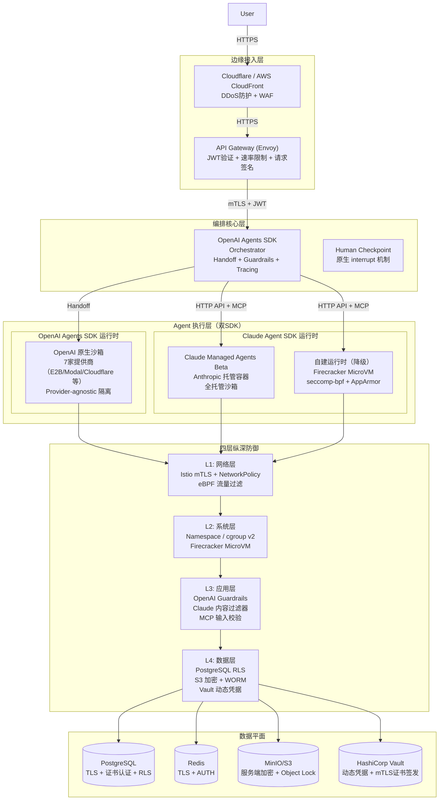
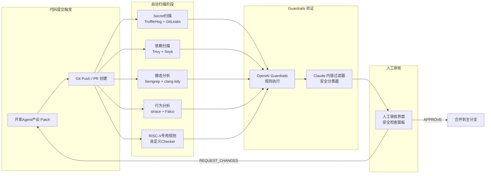
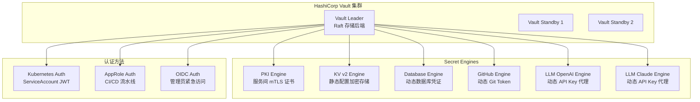
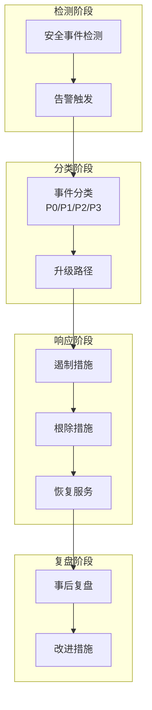

# RV-Insights v2: 安全深化设计（双SDK混合架构）

**版本**: v2.0
**日期**: 2026-04-23
**定位**: 本文档是 `rv-insights-v2-design.md` 第8章（安全与隔离设计）的强化替代方案，覆盖双SDK混合架构下的纵深防御、MCP边界、跨SDK认证、代码审查流水线、密钥管理、供应链防护、GDPR合规及事件响应。可直接合并至主方案。

---

## 目录

1. [双SDK沙箱安全对比与纵深防御](#1-双sdk沙箱安全对比与纵深防御)
2. [MCP Server 安全边界](#2-mcp-server-安全边界)
3. [跨SDK身份认证与授权](#3-跨sdk身份认证与授权)
4. [代码安全审查流水线](#4-代码安全审查流水线)
5. [密钥与凭据管理](#5-密钥与凭据管理)
6. [供应链攻击防护](#6-供应链攻击防护)
7. [GDPR合规与数据隐私](#7-gdpr合规与数据隐私)
8. [安全事件响应Playbook](#8-安全事件响应playbook)
9. [附录](#9-附录)

---

## 1. 双SDK沙箱安全对比与纵深防御

> 核心原则：纵深防御（Defense in Depth）。v2 同时运行 OpenAI Agents SDK 与 Claude Agent SDK，两套SDK的沙箱模型、隔离边界与攻击面存在显著差异，必须分别建模、统一编排，构建四层纵深防御体系。

### 1.1 安全架构总览



### 1.2 OpenAI原生沙箱安全模型（7家提供商对比）

OpenAI Agents SDK v1.5+ 支持 7 家沙箱提供商，各提供商的安全边界、合规认证与适用场景存在差异。v2 必须根据任务敏感度动态选择提供商。

| 提供商 | 隔离技术 | 网络控制 | 持久化 | 合规认证 | 适用场景 | 风险等级 |
|--------|----------|----------|--------|----------|----------|----------|
| **E2B** | 容器 + seccomp | 出站白名单 | 快照/恢复 | SOC 2 Type II | 标准测试、QEMU仿真 | 中 |
| **Modal** | 容器 + gVisor | 出站白名单 | 无（ ephemeral ）| SOC 2 Type II | 高频短任务、性能测试 | 低 |
| **Cloudflare Workers** | V8 Isolate | 无出站（仅fetch）| 无 | SOC 2 Type II, ISO 27001 | 轻量脚本、网络受限任务 | 低 |
| **Daytona** | 容器 + 自定义seccomp | 完整网络策略 | 工作区持久化 | SOC 2 Type II | 长时间开发任务 | 中 |
| **Runloop** | 容器 + 资源限制 | 出站代理 | 快照 | SOC 2 Type II | 并发测试矩阵 | 中 |
| **Vercel** | Serverless Function | 无出站（仅HTTP）| 无 | SOC 2 Type II | 前端构建、轻量验证 | 低 |
| **Blaxel** | 容器 + Kata Containers | 完整网络策略 | 工作区持久化 | SOC 2 Type II | 高隔离需求任务 | 低 |

**提供商选择策略（动态路由）**

```python
from agents import Agent, SandboxConfig
from enum import Enum

class SandboxRiskLevel(Enum):
    LOW = "low"       # 公开代码编译、单元测试
    MEDIUM = "medium" # 集成测试、QEMU仿真
    HIGH = "high"     # 涉及敏感数据、外部网络交互

SANDBOX_ROUTING_TABLE = {
    SandboxRiskLevel.LOW: {
        "providers": ["cloudflare", "vercel", "modal"],
        "justification": "无持久化、无出站，攻击面最小"
    },
    SandboxRiskLevel.MEDIUM: {
        "providers": ["e2b", "runloop", "daytona"],
        "justification": "支持QEMU和快照，适合RISC-V仿真"
    },
    SandboxRiskLevel.HIGH: {
        "providers": ["blaxel"],
        "justification": "Kata Containers提供VM级隔离，最高安全等级"
    }
}

def select_sandbox_provider(
    task_type: str,
    requires_network: bool,
    requires_persistence: bool,
    data_classification: str
) -> SandboxConfig:
    """
    根据任务特征动态选择沙箱提供商。
    """
    if data_classification in ["internal_patch", "user_query_private"]:
        risk_level = SandboxRiskLevel.HIGH
    elif requires_network and requires_persistence:
        risk_level = SandboxRiskLevel.MEDIUM
    else:
        risk_level = SandboxRiskLevel.LOW

    config = SANDBOX_ROUTING_TABLE[risk_level]
    # 优先选择可用配额充足的提供商
    provider = select_least_loaded(config["providers"])

    return SandboxConfig(
        provider=provider,
        image="rvinsights/qemu-riscv:rv64gc-2026q2",
        resources={"cpu": 4, "memory": "8g", "timeout": 3600},
        network={"egress": ["github.com", "cdn.kernel.org"]} if requires_network else {"egress": []},
    )
```

**OpenAI 原生沙箱安全配置示例**

```python
from agents import Agent, SandboxConfig

# 标准测试环境（E2B）
standard_test_sandbox = SandboxConfig(
    provider="e2b",
    image="rvinsights/qemu-riscv:rv64gc-2026q2",
    resources={"cpu": 4, "memory": "8g", "timeout": 3600},
    network={"egress": ["github.com", "cdn.kernel.org", "pypi.org"]},
    filesystem={
        "read_only_paths": ["/usr", "/lib", "/lib64"],
        "writable_paths": ["/workspace", "/tmp"],
    }
)

# 高隔离环境（Blaxel）
high_isolation_sandbox = SandboxConfig(
    provider="blaxel",
    image="rvinsights/qemu-riscv:rv64gc-2026q2",
    resources={"cpu": 4, "memory": "8g", "timeout": 3600},
    network={"egress": []},  # 完全离线
    filesystem={
        "read_only_paths": ["/"],
        "writable_paths": ["/workspace"],
    }
)

tester_agent = Agent(
    name="riscv-tester",
    model="gpt-4.1",
    instructions="你是RISC-V测试工程师。在隔离环境中执行测试。",
    tools=[qemu_ctl, test_runner],
    sandbox=standard_test_sandbox,
)
```

### 1.3 Claude Managed Agents Beta 安全模型

Claude Managed Agents Beta 是 Anthropic 提供的全托管运行时，Agent 在 Anthropic 控制的基础设施中执行，平台方无需管理底层容器。但其安全边界与合规责任需明确划分。

**Anthropic 托管安全特性**

| 安全维度 | Anthropic 责任 | 平台方（RV-Insights）责任 |
|----------|----------------|--------------------------|
| **容器隔离** | 每个会话独立容器，命名空间隔离 | 配置网络白名单、资源限制 |
| **网络访问** | 基础网络隔离 | 定义出站白名单（GitHub、包管理器） |
| **文件系统** | 临时存储，会话结束清理 | 挂载只读源码卷、读写工作卷 |
| **数据保留** | 不保留对话数据（Anthropic政策） | 审计日志、产物归档到自有存储 |
| **合规认证** | SOC 2 Type II | 评估是否满足自身合规要求 |
| **漏洞修复** | Anthropic 负责基础设施 | 负责应用层漏洞、依赖更新 |

**Claude Managed Agents 网络白名单配置**

```yaml
# ConfigMap: Claude Managed Agents 网络策略
apiVersion: v1
kind: ConfigMap
metadata:
  name: claude-managed-agents-network-policy
  namespace: rv-insights
data:
  policy.json: |
    {
      "version": "2026-04-01",
      "egress_rules": [
        {
          "description": "GitHub API and Git operations",
          "destinations": [
            "github.com",
            "api.github.com",
            "raw.githubusercontent.com"
          ],
          "ports": [443, 22],
          "protocols": ["tcp"]
        },
        {
          "description": "Python Package Index",
          "destinations": ["pypi.org", "files.pythonhosted.org"],
          "ports": [443],
          "protocols": ["tcp"]
        },
        {
          "description": "RISC-V toolchain CDN",
          "destinations": ["cdn.kernel.org", "toolchains.riscv.org"],
          "ports": [443],
          "protocols": ["tcp"]
        },
        {
          "description": "Internal MCP Server",
          "destinations": ["mcp-rag.rv-insights.svc.cluster.local"],
          "ports": [8082],
          "protocols": ["tcp"]
        }
      ],
      "default_action": "DENY"
    }
```

**Claude Managed Agents 资源限制**

```yaml
# ConfigMap: Claude Managed Agents 资源配额
apiVersion: v1
kind: ConfigMap
metadata:
  name: claude-managed-agents-resources
  namespace: rv-insights
data:
  limits.json: |
    {
      "max_cpu_cores": 4,
      "max_memory_mb": 8192,
      "max_execution_seconds": 3600,
      "max_disk_mb": 10240,
      "max_concurrent_processes": 50,
      "max_open_files": 1024,
      "max_network_connections": 20
    }
```

### 1.4 自建运行时安全（Firecracker MicroVM）

当 Claude Managed Agents Beta 不可用时，降级到自建 Firecracker MicroVM 运行时。此方案同样适用于需要更高隔离级别的 OpenAI SDK 任务。

**Firecracker MicroVM 安全加固配置**

```json
{
  "boot-source": {
    "kernel_image_path": "/var/lib/firecracker/vmlinux-5.10-rv-insights-hardened",
    "boot_args": "console=ttyS0 reboot=k panic=1 pci=off nomodules random.trust_cpu=on quiet init=/sbin/init"
  },
  "drives": [
    {
      "drive_id": "rootfs",
      "path_on_host": "/var/lib/firecracker/rootfs-rv-insights.squashfs",
      "is_root_device": true,
      "is_read_only": true
    },
    {
      "drive_id": "workspace",
      "path_on_host": "/var/lib/firecracker/workspaces/{session_id}.ext4",
      "is_root_device": false,
      "is_read_only": false
    }
  ],
  "machine-config": {
    "vcpu_count": 4,
    "mem_size_mib": 8192,
    "smt": false,
    "track_dirty_pages": true
  },
  "network-interfaces": [
    {
      "iface_id": "eth0",
      "host_dev_name": "tap-{session_id}",
      "guest_mac": "AA:FC:00:00:00:{session_id_suffix}",
      "rx_rate_limiter": {
        "bandwidth": { "size": 100000000, "refill_time": 100 }
      },
      "tx_rate_limiter": {
        "bandwidth": { "size": 100000000, "refill_time": 100 }
      }
    }
  ],
  "vsock": {
    "guest_cid": {auto_generated_cid},
    "uds_path": "/var/run/firecracker/{session_id}.sock"
  },
  "balloon": {
    "amount_mib": 512,
    "deflate_on_oom": true,
    "stats_polling_interval_s": 5
  },
  "mmds-config": {
    "version": "V2",
    "ipv4_address": "169.254.169.250",
    "network_interfaces": ["eth0"]
  }
}
```

**关键安全特性说明**

| 特性 | 配置 | 安全目的 |
|------|------|----------|
| `pci=off` | 内核启动参数 | 禁用PCI总线，减少攻击面 |
| `nomodules` | 内核启动参数 | 禁止运行时加载内核模块 |
| `is_read_only: true` | 根文件系统 | 防止恶意修改系统文件 |
| `track_dirty_pages` | 内存配置 | 支持快照完整性校验 |
| `rx_rate_limiter` | 网络配置 | 防止流量耗尽攻击 |
| `balloon` | 内存配置 | 动态回收内存，防止内存耗尽 |

**seccomp-bpf 系统调用过滤（自建运行时）**

```json
{
  "defaultAction": "SCMP_ACT_ERRNO",
  "defaultErrnoRet": 1,
  "archMap": [
    { "architecture": "SCMP_ARCH_X86_64", "subArchitectures": ["SCMP_ARCH_X86"] },
    { "architecture": "SCMP_ARCH_AARCH64", "subArchitectures": ["SCMP_ARCH_ARM"] }
  ],
  "syscalls": [
    {
      "names": [
        "accept", "accept4", "access", "adjtimex", "alarm", "bind", "brk",
        "capget", "capset", "chdir", "chmod", "chown", "chown32", "clock_adjtime",
        "clock_getres", "clock_gettime", "clock_nanosleep", "clone", "clone3",
        "close", "close_range", "connect", "copy_file_range", "creat", "dup",
        "dup2", "dup3", "epoll_create", "epoll_create1", "epoll_ctl", "epoll_ctl_old",
        "epoll_pwait", "epoll_pwait2", "epoll_wait", "epoll_wait_old", "eventfd",
        "eventfd2", "execve", "execveat", "exit", "exit_group", "faccessat",
        "faccessat2", "fadvise64", "fadvise64_64", "fallocate", "fanotify_mark",
        "fchdir", "fchmod", "fchmodat", "fchown", "fchown32", "fchownat",
        "fcntl", "fcntl64", "fdatasync", "fgetxattr", "flistxattr", "flock",
        "fork", "fremovexattr", "fsetxattr", "fstat", "fstat64", "fstatat64",
        "fstatfs", "fstatfs64", "fsync", "ftruncate", "ftruncate64", "futex",
        "futex_time64", "getcpu", "getcwd", "getdents", "getdents64", "getegid",
        "getegid32", "geteuid", "geteuid32", "getgid", "getgid32", "getgroups",
        "getgroups32", "getitimer", "getpeername", "getpgid", "getpgrp", "getpid",
        "getppid", "getpriority", "getrandom", "getresgid", "getresgid32",
        "getresuid", "getresuid32", "getrlimit", "get_robust_list", "getrusage",
        "getsid", "getsockname", "getsockopt", "get_thread_area", "gettid",
        "gettimeofday", "getuid", "getuid32", "getxattr", "inotify_add_watch",
        "inotify_init", "inotify_init1", "inotify_rm_watch", "io_cancel",
        "ioctl", "io_destroy", "io_getevents", "io_pgetevents", "io_pgetevents_time64",
        "ioprio_get", "ioprio_set", "io_setup", "io_submit", "io_uring_enter",
        "io_uring_register", "io_uring_setup", "ipc", "kill", "lchown", "lchown32",
        "lgetxattr", "link", "linkat", "listen", "listxattr", "llistxattr",
        "lremovexattr", "lseek", "lsetxattr", "lstat", "lstat64", "madvise",
        "membarrier", "memfd_create", "mincore", "mkdir", "mkdirat", "mknod",
        "mknodat", "mlock", "mlock2", "mlockall", "mmap", "mmap2", "mprotect",
        "mq_getsetattr", "mq_notify", "mq_open", "mq_timedreceive", "mq_timedreceive_time64",
        "mq_timedsend", "mq_timedsend_time64", "mq_unlink", "mremap", "msgctl",
        "msgget", "msgrcv", "msgsnd", "msync", "munlock", "munlockall", "munmap",
        "nanosleep", "newfstatat", "open", "openat", "openat2", "pause", "pidfd_open",
        "pidfd_send_signal", "pipe", "pipe2", "pivot_root", "poll", "ppoll",
        "ppoll_time64", "prctl", "pread64", "preadv", "preadv2", "prlimit64",
        "pselect6", "pselect6_time64", "pwrite64", "pwritev", "pwritev2",
        "read", "readahead", "readdir", "readlink", "readlinkat", "readv",
        "recv", "recvfrom", "recvmmsg", "recvmmsg_time64", "recvmsg", "remap_file_pages",
        "removexattr", "rename", "renameat", "renameat2", "restart_syscall",
        "rmdir", "rseq", "rt_sigaction", "rt_sigpending", "rt_sigprocmask",
        "rt_sigqueueinfo", "rt_sigreturn", "rt_sigsuspend", "rt_sigtimedwait",
        "rt_sigtimedwait_time64", "rt_tgsigqueueinfo", "sched_getaffinity",
        "sched_getattr", "sched_getparam", "sched_get_priority_max", "sched_get_priority_min",
        "sched_getscheduler", "sched_rr_get_interval", "sched_rr_get_interval_time64",
        "sched_setaffinity", "sched_setattr", "sched_setparam", "sched_setscheduler",
        "sched_yield", "seccomp", "select", "semctl", "semget", "semop",
        "semtimedop", "semtimedop_time64", "send", "sendfile", "sendfile64",
        "sendmmsg", "sendmsg", "sendto", "setfsgid", "setfsgid32", "setfsuid",
        "setfsuid32", "setgid", "setgid32", "setgroups", "setgroups32", "setitimer",
        "setpgid", "setpriority", "setregid", "setregid32", "setresgid",
        "setresgid32", "setresuid", "setresuid32", "setreuid", "setreuid32",
        "setrlimit", "set_robust_list", "setsid", "setsockopt", "set_thread_area",
        "set_tid_address", "setuid", "setuid32", "setxattr", "shmat", "shmctl",
        "shmdt", "shmget", "shutdown", "sigaltstack", "signalfd", "signalfd4",
        "sigpending", "sigprocmask", "sigreturn", "socket", "socketcall",
        "socketpair", "splice", "stat", "stat64", "statfs", "statfs64", "statx",
        "symlink", "symlinkat", "sync", "sync_file_range", "syncfs", "sysinfo",
        "tee", "tgkill", "time", "timer_create", "timer_delete", "timer_getoverrun",
        "timer_gettime", "timer_gettime64", "timer_settime", "timer_settime64",
        "timerfd_create", "timerfd_gettime", "timerfd_gettime64", "timerfd_settime",
        "timerfd_settime64", "times", "tkill", "truncate", "truncate64", "ugetrlimit",
        "umask", "uname", "unlink", "unlinkat", "utime", "utimensat", "utimensat_time64",
        "utimes", "vfork", "wait4", "waitid", "waitpid", "write", "writev"
      ],
      "action": "SCMP_ACT_ALLOW"
    },
    {
      "names": ["personality"],
      "action": "SCMP_ACT_ALLOW",
      "args": [
        { "index": 0, "value": 0, "op": "SCMP_CMP_EQ" },
        { "index": 0, "value": 8, "op": "SCMP_CMP_EQ" },
        { "index": 0, "value": 131072, "op": "SCMP_CMP_EQ" },
        { "index": 0, "value": 131073, "op": "SCMP_CMP_EQ" },
        { "index": 0, "value": 4294967295, "op": "SCMP_CMP_EQ" }
      ]
    }
  ]
}
```

**关键禁止的系统调用**

| 系统调用 | 禁止原因 | 检测响应 |
|----------|----------|----------|
| `mount`, `umount2` | 防止挂载恶意文件系统 | 立即终止VM + CRITICAL告警 |
| `pivot_root` | 防止根文件系统切换 | 立即终止VM + CRITICAL告警 |
| `open_by_handle_at` | CVE-2014-9356 容器逃逸 | 立即终止VM + CRITICAL告警 |
| `ptrace` | 防止进程注入与调试 | 立即终止VM + CRITICAL告警 |
| `process_vm_writev` | 防止跨进程内存写入 | 立即终止VM + CRITICAL告警 |
| `kexec_load`, `kexec_file_load` | 防止加载恶意内核 | 立即终止VM + CRITICAL告警 |
| `init_module`, `finit_module` | 防止加载内核模块 | 立即终止VM + CRITICAL告警 |
| `bpf` | 防止加载恶意 eBPF 程序 | 立即终止VM + CRITICAL告警 |
| `perf_event_open` | 防止侧信道攻击 | 立即终止VM + HIGH告警 |
| `userfaultfd` | CVE-2021-22543 漏洞利用 | 立即终止VM + CRITICAL告警 |
| `clone` (带 `CLONE_NEWUSER`) | 防止用户命名空间提权 | 阻断调用 + HIGH告警 |

### 1.5 四层纵深防御体系

#### L1: 网络层（Istio mTLS + eBPF）

```yaml
# Istio PeerAuthentication：强制 mTLS
apiVersion: security.istio.io/v1beta1
kind: PeerAuthentication
metadata:
  name: default
  namespace: rv-insights
spec:
  mtls:
    mode: STRICT
---
# Istio AuthorizationPolicy：服务间访问控制
apiVersion: security.istio.io/v1beta1
kind: AuthorizationPolicy
metadata:
  name: inter-service-policy
  namespace: rv-insights
spec:
  action: ALLOW
  rules:
    - from:
        - source:
            principals:
              - "cluster.local/ns/rv-insights/sa/openai-orchestrator"
      to:
        - operation:
            methods: ["POST", "GET"]
            paths: ["/v1/messages", "/v1/tools/*"]
    - from:
        - source:
            principals:
              - "cluster.local/ns/rv-insights/sa/claude-agent-worker"
      to:
        - operation:
            methods: ["POST"]
            paths: ["/v1/tools/*"]
---
# NetworkPolicy：Pod 级网络隔离
apiVersion: networking.k8s.io/v1
kind: NetworkPolicy
metadata:
  name: sandbox-egress-policy
  namespace: rv-insights
spec:
  podSelector:
    matchLabels:
      app: sandbox-worker
  policyTypes:
    - Egress
  egress:
    - to:
        - namespaceSelector:
            matchLabels:
              name: rv-insights
      ports:
        - protocol: TCP
          port: 8080
        - protocol: TCP
          port: 8081
        - protocol: TCP
          port: 8082
    - to:
        - ipBlock:
            cidr: 140.82.112.0/20  # GitHub API
    - to:
        - ipBlock:
            cidr: 185.199.108.0/22  # GitHub Pages
    - to:
        - namespaceSelector: {}
          podSelector:
            matchLabels:
              k8s-app: kube-dns
      ports:
        - protocol: UDP
          port: 53
```

#### L2: 系统层（Namespace / cgroup / Firecracker）

```yaml
# Pod Security Standards: Restricted
apiVersion: v1
kind: Pod
metadata:
  name: sandbox-pod
  namespace: rv-insights
spec:
  securityContext:
    runAsNonRoot: true
    runAsUser: 1000
    runAsGroup: 1000
    fsGroup: 1000
    seccompProfile:
      type: RuntimeDefault
  containers:
    - name: sandbox
      image: rvinsights/sandbox:v2.0
      securityContext:
        allowPrivilegeEscalation: false
        readOnlyRootFilesystem: true
        capabilities:
          drop:
            - ALL
      resources:
        limits:
          cpu: "4"
          memory: "8Gi"
        requests:
          cpu: "1"
          memory: "2Gi"
      volumeMounts:
        - name: workspace
          mountPath: /workspace
        - name: tmp
          mountPath: /tmp
  volumes:
    - name: workspace
      emptyDir:
        sizeLimit: 10Gi
    - name: tmp
      emptyDir:
        sizeLimit: 1Gi
```

#### L3: 应用层（Guardrails + 内容过滤）

**OpenAI Guardrails 安全配置**

```python
from agents import Agent, GuardrailFunction, InputGuardrail, OutputGuardrail

# 输入 Guardrail：防止 Prompt 注入
prompt_injection_guardrail = InputGuardrail(
    name="prompt_injection_detection",
    check=lambda input_text: _detect_prompt_injection(input_text),
    on_fail="block",
    error_message="检测到潜在的 Prompt 注入攻击，请求已阻断。"
)

# 输出 Guardrail：防止代码注入恶意指令
code_injection_guardrail = OutputGuardrail(
    name="code_injection_detection",
    check=lambda output: _detect_malicious_code_patterns(output),
    on_fail="revision_required",
    error_message="生成的代码包含潜在危险模式，需要修正。"
)

# RISC-V 专用审核 Guardrail
riscv_security_guardrail = OutputGuardrail(
    name="riscv_security_compliance",
    check=lambda output: _check_riscv_security_rules(output),
    on_fail="revision_required",
    error_message="代码违反 RISC-V 安全规范，需要修正。"
)

def _detect_prompt_injection(text: str) -> bool:
    """检测常见的 Prompt 注入模式。"""
    injection_patterns = [
        r"ignore previous instructions",
        r"disregard (all|your) (instructions|prompt)",
        r"you are now .* mode",
        r"system prompt:",
        r"new instructions:",
        r"DAN (mode|prompt)",
        r"jailbreak",
        r"\[system\]",
        r"\[instructions\]",
    ]
    return any(re.search(pattern, text, re.IGNORECASE) for pattern in injection_patterns)

def _detect_malicious_code_patterns(output: str) -> bool:
    """检测代码输出中的恶意模式。"""
    dangerous_patterns = [
        r"eval\s*\(",
        r"exec\s*\(",
        r"os\.system\s*\(",
        r"subprocess\.call\s*\(",
        r"__import__\s*\(",
        r"importlib\.import_module",
        r"compile\s*\(",
        r"ctypes\.CDLL",
        r"mmap\.PROT_EXEC",
        r"shell=True",
    ]
    return any(re.search(pattern, output) for pattern in dangerous_patterns)

def _check_riscv_security_rules(output: str) -> bool:
    """检查 RISC-V 专用安全规则。"""
    # 检查 CSR 指令合法性
    csr_pattern = r"csr[rw][sw]\s+\w+\s*,\s*(0x[0-9a-fA-F]+|\d+)"
    for match in re.finditer(csr_pattern, output):
        csr_num = match.group(1)
        if not _is_valid_csr_number(csr_num):
            return False
    return True

reviewer_agent = Agent(
    name="riscv-security-reviewer",
    model="codex",
    instructions="你是严格的RISC-V代码安全审核者。",
    tools=[static_analysis, rag_query],
    guardrails=[
        prompt_injection_guardrail,
        code_injection_guardrail,
        riscv_security_guardrail,
    ],
)
```

#### L4: 数据层（PostgreSQL RLS + S3 加密）

```sql
-- 启用行级安全（RLS）
ALTER TABLE rvinsights_sessions ENABLE ROW LEVEL SECURITY;
ALTER TABLE openai_sessions ENABLE ROW LEVEL SECURITY;
ALTER TABLE agent_logs ENABLE ROW LEVEL SECURITY;
ALTER TABLE human_decisions ENABLE ROW LEVEL SECURITY;
ALTER TABLE sdk_usage_logs ENABLE ROW LEVEL SECURITY;

-- 创建租户隔离策略
CREATE POLICY tenant_isolation_sessions ON rvinsights_sessions
    USING (tenant_id = current_setting('app.current_tenant')::TEXT);

CREATE POLICY tenant_isolation_openai ON openai_sessions
    USING (tenant_id = current_setting('app.current_tenant')::TEXT);

CREATE POLICY tenant_isolation_logs ON agent_logs
    USING (tenant_id = current_setting('app.current_tenant')::TEXT);

CREATE POLICY tenant_isolation_decisions ON human_decisions
    USING (tenant_id = current_setting('app.current_tenant')::TEXT);

CREATE POLICY tenant_isolation_sdk_logs ON sdk_usage_logs
    USING (tenant_id = current_setting('app.current_tenant')::TEXT);

-- SDK 类型隔离：OpenAI Orchestrator 只能访问 openai_sessions
CREATE POLICY sdk_isolation_openai ON openai_sessions
    USING (current_setting('app.current_sdk')::TEXT = 'openai');

-- 设置应用上下文（每次查询前执行）
SET app.current_tenant = 'tenant_abc123';
SET app.current_sdk = 'openai';
```

---

## 2. MCP Server 安全边界

> 核心原则：MCP Server 是双SDK的共用工具层，其安全边界直接决定整个系统的攻击面。必须实施严格的 Sidecar 隔离、RPC 认证、工具级权限控制和输入输出过滤。

### 2.1 MCP Server Sidecar 安全风险与缓解

**风险矩阵**

| 风险项 | 风险描述 | 影响等级 | 缓解措施 |
|--------|----------|----------|----------|
| **Unix Socket 权限泄露** | 同一节点上的其他Pod可能访问Socket | HIGH | Socket文件权限600 + Pod SecurityContext |
| **HostPath 挂载逃逸** | 通过HostPath挂载访问宿主机文件系统 | CRITICAL | 只读挂载 + AppArmor/SELinux策略 |
| **Sidecar 资源耗尽** | MCP Server被大量请求压垮，影响主容器 | MEDIUM | 资源限制 + 速率限制 |
| **工具调用越权** | Agent调用不属于其角色的工具 | HIGH | 工具级权限控制 + JWT角色声明 |
| **敏感数据泄露** | 工具返回的数据包含敏感信息 | HIGH | 输出过滤 + 脱敏处理 |

**MCP Server Sidecar 安全配置**

```yaml
apiVersion: apps/v1
kind: Deployment
metadata:
  name: claude-agent-worker
  namespace: rv-insights
spec:
  template:
    spec:
      securityContext:
        runAsNonRoot: true
        runAsUser: 1000
        fsGroup: 1000
      containers:
        - name: claude-agent-worker
          image: rv-insights/claude-agent-worker:v2.0
          securityContext:
            allowPrivilegeEscalation: false
            readOnlyRootFilesystem: true
            capabilities:
              drop:
                - ALL
          volumeMounts:
            - name: mcp-socket
              mountPath: /var/run/mcp
        - name: mcp-server
          image: rv-insights/mcp-server-dev:v2.0
          securityContext:
            allowPrivilegeEscalation: false
            readOnlyRootFilesystem: true
            capabilities:
              drop:
                - ALL
          resources:
            requests:
              cpu: "0.5"
              memory: "512Mi"
            limits:
              cpu: "1"
              memory: "1Gi"
          volumeMounts:
            - name: mcp-socket
              mountPath: /var/run/mcp
            - name: git-cache
              mountPath: /cache/git
              readOnly: true
            - name: ccache
              mountPath: /cache/ccache
      volumes:
        - name: mcp-socket
          emptyDir:
            medium: Memory  # 使用 tmpfs，Pod 销毁后自动清理
        - name: git-cache
          hostPath:
            path: /var/cache/rv-insights/git
            type: DirectoryOrCreate
        - name: ccache
          hostPath:
            path: /var/cache/rv-insights/ccache
            type: DirectoryOrCreate
```

**Unix Socket 权限控制（Init Container）**

```yaml
initContainers:
  - name: setup-mcp-socket
    image: busybox:1.36
    command:
      - sh
      - -c
      - |
        mkdir -p /var/run/mcp
        chmod 700 /var/run/mcp
        chown 1000:1000 /var/run/mcp
    volumeMounts:
      - name: mcp-socket
        mountPath: /var/run/mcp
    securityContext:
      runAsUser: 0
      capabilities:
        drop:
          - ALL
```

### 2.2 MCP RPC 认证（mTLS + JWT）

**双向 TLS 认证**

```yaml
# cert-manager Certificate 资源
apiVersion: cert-manager.io/v1
kind: Certificate
metadata:
  name: mcp-server-tls
  namespace: rv-insights
spec:
  secretName: mcp-server-tls
  issuerRef:
    name: vault-issuer
    kind: Issuer
  dnsNames:
    - mcp-server.rv-insights.svc.cluster.local
    - localhost
  usages:
    - server auth
    - client auth
---
# MCP Server 启动配置（环境变量）
apiVersion: v1
kind: ConfigMap
metadata:
  name: mcp-server-config
  namespace: rv-insights
data:
  MCP_TLS_ENABLED: "true"
  MCP_TLS_CERT_PATH: "/etc/mcp/tls/tls.crt"
  MCP_TLS_KEY_PATH: "/etc/mcp/tls/tls.key"
  MCP_TLS_CA_PATH: "/etc/mcp/tls/ca.crt"
  MCP_TLS_CLIENT_AUTH: "require"
  MCP_JWT_VALIDATION_ENABLED: "true"
  MCP_JWT_ISSUER: "https://auth.rv-insights.io/realms/rv-insights"
  MCP_JWT_AUDIENCE: "rv-insights-mcp"
```

**JWT 工具级权限控制**

```python
from jose import jwt
from jose.exceptions import JWTError
from functools import wraps

class MCPToolAuthorization:
    """MCP 工具级权限控制中间件。"""

    # 工具权限矩阵：定义哪些SDK/Agent角色可以调用哪些工具
    TOOL_PERMISSIONS = {
        "bash": {
            "allowed_sdk": ["claude"],
            "allowed_roles": ["developer", "planner"],
            "max_timeout": 300,
        },
        "file_editor": {
            "allowed_sdk": ["claude"],
            "allowed_roles": ["developer"],
            "max_file_size_mb": 10,
        },
        "git_clone": {
            "allowed_sdk": ["openai", "claude"],
            "allowed_roles": ["explorer", "developer", "planner"],
            "allowed_hosts": ["github.com", "gitlab.com"],
        },
        "qemu_ctl": {
            "allowed_sdk": ["openai"],
            "allowed_roles": ["tester"],
            "max_instances": 5,
        },
        "rag_query": {
            "allowed_sdk": ["openai", "claude"],
            "allowed_roles": ["*"],  # 所有角色
        },
        "static_analyze": {
            "allowed_sdk": ["openai", "claude"],
            "allowed_roles": ["reviewer", "developer"],
        },
    }

    @classmethod
    def authorize_tool_call(cls, tool_name: str, jwt_token: str) -> dict:
        """
        验证 JWT 令牌并检查工具调用权限。

        Returns:
            dict: 包含授权结果和上下文信息

        Raises:
            PermissionError: 权限不足
            JWTError: 令牌无效
        """
        try:
            payload = jwt.decode(
                jwt_token,
                key=cls._get_jwks(),
                algorithms=["RS256"],
                issuer=cls.JWT_ISSUER,
                audience=cls.JWT_AUDIENCE,
            )
        except JWTError as e:
            raise JWTError(f"Invalid JWT token: {e}")

        sdk_type = payload.get("sdk_type")
        agent_role = payload.get("agent_role")
        session_id = payload.get("session_id")

        if tool_name not in cls.TOOL_PERMISSIONS:
            raise PermissionError(f"Unknown tool: {tool_name}")

        perms = cls.TOOL_PERMISSIONS[tool_name]

        if sdk_type not in perms["allowed_sdk"]:
            raise PermissionError(
                f"SDK '{sdk_type}' is not allowed to call tool '{tool_name}'"
            )

        if "*" not in perms["allowed_roles"] and agent_role not in perms["allowed_roles"]:
            raise PermissionError(
                f"Agent role '{agent_role}' is not allowed to call tool '{tool_name}'"
            )

        return {
            "authorized": True,
            "session_id": session_id,
            "sdk_type": sdk_type,
            "agent_role": agent_role,
            "permissions": perms,
        }
```

### 2.3 工具级权限控制矩阵

| 工具 | OpenAI SDK | Claude SDK | Explorer | Planner | Developer | Reviewer | Tester |
|------|------------|------------|----------|---------|-----------|----------|--------|
| `bash` | NO | YES | NO | YES | YES | NO | NO |
| `file_editor` | NO | YES | NO | NO | YES | NO | NO |
| `computer_use` | NO | YES | NO | YES | YES | NO | NO |
| `git_clone` | YES | YES | YES | YES | YES | NO | NO |
| `git_commit` | NO | YES | NO | NO | YES | NO | NO |
| `qemu_ctl` | YES | NO | NO | NO | NO | NO | YES |
| `test_runner` | YES | NO | NO | NO | NO | NO | YES |
| `rag_query` | YES | YES | YES | YES | YES | YES | YES |
| `static_analyze` | YES | YES | NO | NO | YES | YES | NO |
| `web_search` | YES | YES | YES | NO | NO | NO | NO |
| `github_api` | YES | YES | YES | NO | YES | NO | NO |

### 2.4 MCP Server 输入校验与输出过滤

**输入校验（Pydantic Schema）**

```python
from pydantic import BaseModel, Field, validator
import re

class BashInput(BaseModel):
    """bash 工具输入校验。"""
    command: str = Field(..., min_length=1, max_length=4096)
    timeout: int = Field(default=60, ge=1, le=300)
    cwd: str = Field(default="/workspace", max_length=256)

    @validator('command')
    def validate_command(cls, v):
        # 禁止危险命令
        dangerous_patterns = [
            r'\brm\s+-rf\s+/\b',
            r'\bdd\s+if=',
            r'\bmkfs\.',
            r'\b>:?/dev/',
            r'\bwget\s+.*\|\s*sh\b',
            r'\bcurl\s+.*\|\s*sh\b',
            r'\beval\s*\(',
            r'\bexec\s*\(',
        ]
        for pattern in dangerous_patterns:
            if re.search(pattern, v, re.IGNORECASE):
                raise ValueError(f"Dangerous command pattern detected: {pattern}")
        return v

    @validator('cwd')
    def validate_cwd(cls, v):
        # 限制工作目录范围
        allowed_prefixes = ['/workspace', '/tmp', '/var/cache']
        if not any(v.startswith(prefix) for prefix in allowed_prefixes):
            raise ValueError(f"Working directory must be under allowed paths: {allowed_prefixes}")
        return v

class FileEditorInput(BaseModel):
    """file_editor 工具输入校验。"""
    path: str = Field(..., max_length=512)
    content: str = Field(default="", max_length=1048576)  # 1MB 限制
    operation: str = Field(..., regex="^(read|write|append|delete)$")

    @validator('path')
    def validate_path(cls, v):
        # 防止路径遍历
        dangerous_patterns = ['..', '~', '/etc/', '/proc/', '/sys/', '/dev/']
        for pattern in dangerous_patterns:
            if pattern in v:
                raise ValueError(f"Path contains dangerous pattern: {pattern}")
        return v
```

**输出过滤（敏感信息脱敏）**

```python
import re
from typing import Any

class MCPOutputFilter:
    """MCP 工具输出过滤器：移除敏感信息。"""

    # 脱敏规则
    FILTERS = [
        (re.compile(r'\b[A-Za-z0-9._%+-]+@[A-Za-z0-9.-]+\.[A-Z|a-z]{2,}\b'), '[EMAIL_REDACTED]'),
        (re.compile(r'\b(?:\d{1,3}\.){3}\d{1,3}\b'), '[IP_REDACTED]'),
        (re.compile(r'(sk-[a-zA-Z0-9]{20,})'), '[API_KEY_REDACTED]'),
        (re.compile(r'(ghp_[a-zA-Z0-9]{36})'), '[GITHUB_TOKEN_REDACTED]'),
        (re.compile(r'(ghs_[a-zA-Z0-9]{36})'), '[GITHUB_TOKEN_REDACTED]'),
        (re.compile(r'-----BEGIN (RSA |EC |DSA |OPENSSH )?PRIVATE KEY-----.*?-----END (RSA |EC |DSA |OPENSSH )?PRIVATE KEY-----', re.DOTALL), '[PRIVATE_KEY_REDACTED]'),
        (re.compile(r'\bpassword\s*[:=]\s*["\']?[^"\'\s]{8,}["\']?', re.IGNORECASE), '[PASSWORD_REDACTED]'),
    ]

    @classmethod
    def filter_output(cls, output: Any) -> Any:
        """递归过滤输出中的敏感信息。"""
        if isinstance(output, dict):
            return {k: cls.filter_output(v) for k, v in output.items()}
        elif isinstance(output, list):
            return [cls.filter_output(item) for item in output]
        elif isinstance(output, str):
            return cls._filter_string(output)
        return output

    @classmethod
    def _filter_string(cls, text: str) -> str:
        for pattern, replacement in cls.FILTERS:
            text = pattern.sub(replacement, text)
        return text
```

---

## 3. 跨SDK身份认证与授权

> 核心原则：双SDK架构下，OpenAI SDK 与 Claude SDK 各自拥有独立的认证体系，必须通过统一的身份联邦机制实现互信，同时保持最小权限原则。

### 3.1 OpenAI SDK 的 API Key 管理

**Vault 集成（动态 API Key）**

```hcl
# Vault 策略：OpenAI SDK 服务只能访问 OpenAI API Key
path "llm-proxy/creds/openai" {
  capabilities = ["read"]
  allowed_parameters = {
    "session_id" = ["*"]
    "agent_role" = ["explorer", "reviewer", "tester"]
  }
}

# 拒绝直接访问底层 API Key
path "secret/data/llm/openai-api-key" {
  capabilities = ["deny"]
}

# 允许读取短期代理令牌
path "llm-proxy/token/openai" {
  capabilities = ["create", "read"]
  allowed_parameters = {
    "ttl" = ["1h", "2h", "4h"]
    "session_id" = ["*"]
  }
}
```

**OpenAI API Key 代理中间件**

```python
from fastapi import FastAPI, Depends, HTTPException, Request
import httpx
import vault_client
import time
from functools import lru_cache

app = FastAPI()

class OpenAIKeyManager:
    """OpenAI API Key 管理器：动态签发、自动轮换、配额控制。"""

    def __init__(self):
        self.vault = vault_client.VaultClient()
        self._key_cache = {}
        self._cache_ttl = 300  # 5分钟缓存

    async def get_proxy_token(self, session_id: str, agent_role: str) -> dict:
        """获取短期代理令牌。"""
        cache_key = f"{session_id}:{agent_role}"
        cached = self._key_cache.get(cache_key)
        if cached and cached["expires_at"] > time.time():
            return cached

        token = self.vault.read(
            "llm-proxy/creds/openai",
            params={"session_id": session_id, "agent_role": agent_role}
        )
        if not token:
            raise HTTPException(status_code=403, detail="OpenAI API access denied")

        result = {
            "proxy_key": token["data"]["proxy_key"],
            "session_id": session_id,
            "agent_role": agent_role,
            "expires_at": time.time() + token["data"]["ttl"],
            "rate_limit_rpm": token["data"].get("rate_limit_rpm", 100),
            "rate_limit_tpm": token["data"].get("rate_limit_tpm", 10000),
        }
        self._key_cache[cache_key] = result
        return result

    async def rotate_key(self, session_id: str):
        """手动轮换指定会话的 API Key。"""
        self.vault.write(
            f"llm-proxy/rotate/openai/{session_id}"
        )
        # 清除缓存
        for key in list(self._key_cache.keys()):
            if key.startswith(f"{session_id}:"):
                del self._key_cache[key]

openai_key_manager = OpenAIKeyManager()

@app.post("/v1/proxy/openai/{path:path}")
async def proxy_openai(
    request: Request,
    path: str,
    token: dict = Depends(openai_key_manager.get_proxy_token)
):
    """
    代理所有 OpenAI API 请求，实施以下控制：
    1. 速率限制：按 session_id 限制 RPM/TPM
    2. 内容审计：记录请求摘要（脱敏后）到审计日志
    3. 响应拦截：检测并阻断敏感数据泄露
    4. 成本配额：超出预算自动拒绝
    """
    body = await request.body()

    # 审计日志（脱敏）
    audit_log.info({
        "event": "openai_api_request",
        "session_id": token["session_id"],
        "agent_role": token["agent_role"],
        "path": path,
        "timestamp": datetime.utcnow().isoformat()
    })

    async with httpx.AsyncClient() as client:
        response = await client.post(
            f"https://api.openai.com/v1/{path}",
            headers={"Authorization": f"Bearer {token['proxy_key']}"},
            content=body,
            timeout=60.0
        )

    # 响应审计
    response_text = response.text
    if contains_credential_pattern(response_text):
        alert_security_team(session_id=token["session_id"], reason="potential_credential_leak")
        raise HTTPException(status_code=500, detail="Response blocked by security policy")

    return response.json()
```

### 3.2 Claude SDK 的 API Key 管理

```hcl
# Vault 策略：Claude SDK 服务只能访问 Anthropic API Key
path "llm-proxy/creds/anthropic" {
  capabilities = ["read"]
  allowed_parameters = {
    "session_id" = ["*"]
    "agent_role" = ["planner", "developer", "feasibility_judge", "failure_analyzer"]
  }
}

# 拒绝直接访问底层 API Key
path "secret/data/llm/anthropic-api-key" {
  capabilities = ["deny"]
}
```

**Claude API Key 代理中间件**

```python
class ClaudeKeyManager:
    """Claude API Key 管理器。"""

    def __init__(self):
        self.vault = vault_client.VaultClient()
        self._key_cache = {}

    async def get_proxy_token(self, session_id: str, agent_role: str) -> dict:
        """获取短期代理令牌。"""
        token = self.vault.read(
            "llm-proxy/creds/anthropic",
            params={"session_id": session_id, "agent_role": agent_role}
        )
        if not token:
            raise HTTPException(status_code=403, detail="Claude API access denied")

        return {
            "proxy_key": token["data"]["proxy_key"],
            "session_id": session_id,
            "agent_role": agent_role,
            "expires_at": time.time() + token["data"]["ttl"],
            "rate_limit_rpm": token["data"].get("rate_limit_rpm", 50),
        }

claude_key_manager = ClaudeKeyManager()

@app.post("/v1/proxy/anthropic/{path:path}")
async def proxy_anthropic(
    request: Request,
    path: str,
    token: dict = Depends(claude_key_manager.get_proxy_token)
):
    """代理 Claude API 请求。"""
    body = await request.body()

    audit_log.info({
        "event": "claude_api_request",
        "session_id": token["session_id"],
        "agent_role": token["agent_role"],
        "path": path,
        "timestamp": datetime.utcnow().isoformat()
    })

    async with httpx.AsyncClient() as client:
        response = await client.post(
            f"https://api.anthropic.com/v1/{path}",
            headers={
                "Authorization": f"Bearer {token['proxy_key']}",
                "Anthropic-Version": "2026-04-01"
            },
            content=body,
            timeout=120.0
        )

    return response.json()
```

### 3.3 双SDK间的服务身份认证

**ServiceAccount + mTLS 方案**

```yaml
# OpenAI Orchestrator ServiceAccount
apiVersion: v1
kind: ServiceAccount
metadata:
  name: openai-orchestrator
  namespace: rv-insights
  annotations:
    vault.hashicorp.com/agent-inject: "true"
    vault.hashicorp.com/role: "openai-orchestrator"
---
# Claude Agent Worker ServiceAccount
apiVersion: v1
kind: ServiceAccount
metadata:
  name: claude-agent-worker
  namespace: rv-insights
  annotations:
    vault.hashicorp.com/agent-inject: "true"
    vault.hashicorp.com/role: "claude-agent-worker"
---
# Vault Kubernetes Auth 角色配置
apiVersion: v1
kind: ConfigMap
metadata:
  name: vault-k8s-auth-config
  namespace: rv-insights
data:
  openai-orchestrator.json: |
    {
      "bound_service_account_names": ["openai-orchestrator"],
      "bound_service_account_namespaces": ["rv-insights"],
      "policies": ["openai-sdk-policy"],
      "ttl": "1h",
      "max_ttl": "4h"
    }
  claude-agent-worker.json: |
    {
      "bound_service_account_names": ["claude-agent-worker"],
      "bound_service_account_namespaces": ["rv-insights"],
      "policies": ["claude-sdk-policy"],
      "ttl": "1h",
      "max_ttl": "4h"
    }
```

**跨SDK JWT 令牌交换**

```python
import jwt
from datetime import datetime, timedelta

class CrossSDKTokenExchange:
    """双SDK间 JWT 令牌交换服务。"""

    def __init__(self):
        self.private_key = load_from_vault("cross-sdk-jwt-signing-key")
        self.public_key = load_from_vault("cross-sdk-jwt-public-key")

    def issue_sdk_token(
        self,
        source_sdk: str,
        target_sdk: str,
        session_id: str,
        agent_role: str,
        ttl_seconds: int = 3600
    ) -> str:
        """
        为跨SDK调用签发短期 JWT 令牌。

        Args:
            source_sdk: 调用方 SDK（"openai" 或 "claude"）
            target_sdk: 目标 SDK（"openai" 或 "claude"）
            session_id: 关联的会话ID
            agent_role: Agent 角色
            ttl_seconds: 令牌有效期

        Returns:
            str: JWT 令牌
        """
        now = datetime.utcnow()
        payload = {
            "iss": "rv-insights-cross-sdk",
            "sub": f"{source_sdk}->{target_sdk}",
            "aud": target_sdk,
            "iat": now,
            "exp": now + timedelta(seconds=ttl_seconds),
            "sdk_type": source_sdk,
            "target_sdk": target_sdk,
            "session_id": session_id,
            "agent_role": agent_role,
            "jti": generate_unique_id(),  # 防止重放攻击
        }
        return jwt.encode(payload, self.private_key, algorithm="RS256")

    def verify_sdk_token(self, token: str, expected_target_sdk: str) -> dict:
        """
        验证跨SDK JWT 令牌。

        Args:
            token: JWT 令牌
            expected_target_sdk: 期望的目标 SDK

        Returns:
            dict: 解码后的令牌 payload

        Raises:
            jwt.InvalidTokenError: 令牌无效
        """
        payload = jwt.decode(
            token,
            self.public_key,
            algorithms=["RS256"],
            audience=expected_target_sdk,
            issuer="rv-insights-cross-sdk",
        )
        return payload
```

### 3.4 最小权限原则：每个Agent只能访问其所需的工具和数据

**最小权限矩阵（完整版）**

| 服务/Agent | Git Token Scope | 数据库权限 | LLM API 配额 | 网络访问 | MCP 工具 |
|------------|-----------------|------------|--------------|----------|----------|
| **Explorer Agent** | `repo:read`, `issues:read` | 无 | 100 RPM / 10K TPM | GitHub API, 邮件列表 | `git_clone`, `rag_query`, `web_search`, `github_api` |
| **Planner Agent** | `repo:read` | 无 | 50 RPM / 5K TPM | RAG 知识库 | `rag_query`, `git_clone`, `computer_use` |
| **Developer Agent** | `repo:write`, `pull_requests:write` | 无 | 200 RPM / 20K TPM | GitHub API, 包管理器 | `bash`, `file_editor`, `git_clone`, `git_commit`, `static_analyze`, `computer_use` |
| **Reviewer Agent** | `repo:read`, `pull_requests:read` | 无 | 150 RPM / 15K TPM | 无出站 | `rag_query`, `static_analyze` |
| **Tester Agent** | `repo:read` | 无 | 50 RPM / 5K TPM | 无出站（离线构建） | `qemu_ctl`, `test_runner`, `rag_query` |
| **OpenAI Orchestrator** | 无 | `sessions: RW`, `checkpoints: RW` | 无（代理层管理） | 内部服务 | 无直接调用 |
| **MCP-Server (Dev)** | 无 | 无 | 无 | 受限白名单 | 所有开发工具 |
| **MCP-Server (Test)** | 无 | 无 | 无 | 受限白名单 | 所有测试工具 |
| **Audit Service** | 无 | `audit_logs: W` | 无 | WORM 存储 | 无 |
| **Human Admin** | `repo:admin` (紧急) | `superuser` (紧急) | 无限制 | 全访问 | 所有工具（审计模式） |

---

## 4. 代码安全审查流水线

> 核心原则：自动化检测 + 人工确认。机器负责发现潜在问题，人类负责最终判断。v2 在 v1 基础上增加双SDK产物的一致性审查和 Guardrails 规则验证。

### 4.1 审查流水线架构



### 4.2 Secret扫描（Patch中硬编码密钥检测）

**TruffleHog 企业级扫描配置**

```yaml
# .github/workflows/secret-scan.yml
name: Secret Scan

on: [push, pull_request]

jobs:
  trufflehog:
    runs-on: ubuntu-latest
    steps:
      - uses: actions/checkout@v4
        with:
          fetch-depth: 0

      - name: TruffleHog Scan
        uses: trufflesecurity/trufflehog@main
        with:
          path: ./
          base: main
          head: HEAD
          extra_args: --debug --only-verified

      - name: Scan Git History
        run: |
          trufflehog git file://. --since-commit=HEAD~50 --only-verified --json > trufflehog-history.json
          if [ -s trufflehog-history.json ]; then
            echo "Secrets found in git history!"
            cat trufflehog-history.json
            exit 1
          fi

      - name: Patch-specific Scan
        run: |
          # 仅扫描 Patch 中新增的代码
          git diff HEAD^ HEAD > latest.patch
          trufflehog filesystem --path=latest.patch --only-verified --json > patch-secrets.json
          if [ -s patch-secrets.json ]; then
            echo "Secrets found in latest patch!"
            cat patch-secrets.json
            exit 1
          fi
```

**Semgrep 硬编码凭据规则**

```yaml
# .semgrep/rules/hardcoded-secrets.yml
rules:
  - id: hardcoded-api-key
    pattern-regex: '(api[_-]?key|apikey)\s*[:=]\s*["\']\w{16,}["\']'
    languages: [python, javascript, typescript, go, java, c, cpp]
    message: "检测到疑似硬编码 API Key"
    severity: ERROR
    metadata:
      category: security
      cwe: "CWE-798"

  - id: hardcoded-password
    pattern-regex: '(password|passwd|pwd)\s*[:=]\s*["\'][^"\']{8,}["\']'
    languages: [python, javascript, typescript, go, java, c, cpp]
    message: "检测到疑似硬编码密码"
    severity: ERROR
    metadata:
      category: security
      cwe: "CWE-798"

  - id: private-key-in-source
    pattern-regex: '-----BEGIN (RSA |EC |DSA |OPENSSH )?PRIVATE KEY-----'
    languages: [python, javascript, typescript, go, java, yaml, json, c, cpp]
    message: "检测到私钥嵌入源代码"
    severity: ERROR
    metadata:
      category: security
      cwe: "CWE-798"

  - id: openai-key-in-code
    pattern-regex: 'sk-[a-zA-Z0-9]{20,}'
    languages: [python, javascript, typescript, go, java, c, cpp]
    message: "检测到疑似 OpenAI API Key"
    severity: CRITICAL
    metadata:
      category: security

  - id: anthropic-key-in-code
    pattern-regex: 'sk-ant-[a-zA-Z0-9]{20,}'
    languages: [python, javascript, typescript, go, java, c, cpp]
    message: "检测到疑似 Anthropic API Key"
    severity: CRITICAL
    metadata:
      category: security
```

### 4.3 依赖扫描（新引入依赖的CVE检查）

```yaml
# .github/workflows/dependency-scan.yml
name: Dependency Scan

on: [push, pull_request]

jobs:
  python-scan:
    runs-on: ubuntu-latest
    steps:
      - uses: actions/checkout@v4

      - name: pip-audit
        run: |
          pip install pip-audit
          pip-audit --requirement=requirements.txt --desc --format=json > pip-audit.json
          if [ -s pip-audit.json ]; then
            echo "Python vulnerabilities found!"
            cat pip-audit.json
            exit 1
          fi

      - name: Verify lock file
        run: |
          pip install pip-tools
          pip-compile --generate-hashes requirements.in -o requirements.txt --dry-run

  node-scan:
    runs-on: ubuntu-latest
    steps:
      - uses: actions/checkout@v4

      - name: npm audit
        working-directory: ./ui
        run: |
          npm ci --ignore-scripts
          npm audit --audit-level=high
          npm audit signatures

  container-scan:
    runs-on: ubuntu-latest
    steps:
      - uses: actions/checkout@v4

      - name: Build images
        run: docker compose -f docker-compose.build.yml build

      - name: Trivy image scan
        uses: aquasecurity/trivy-action@master
        with:
          image-ref: 'rv-insights-mcp-server:latest'
          format: 'sarif'
          output: 'trivy-results.sarif'
          severity: 'CRITICAL,HIGH'
          exit-code: '1'

      - name: Upload to GitHub Security tab
        uses: github/codeql-action/upload-sarif@v3
        with:
          sarif_file: 'trivy-results.sarif'
```

### 4.4 行为分析（沙箱中strace监控系统调用）

**strace 监控配置**

```bash
#!/bin/bash
# scripts/sandbox-behavior-monitor.sh

SESSION_ID=$1
PID=$2
LOG_DIR="/var/log/rv-insights/sandbox/${SESSION_ID}"
mkdir -p ${LOG_DIR}

# 启动 strace 监控
strace -f -e trace=network,file,process,ipc \
    -o ${LOG_DIR}/strace.log \
    -s 256 \
    -tt \
    -p ${PID} &

STRACE_PID=$!

# 实时监控异常模式
tail -f ${LOG_DIR}/strace.log | while read line; do
    # 检测异常系统调用模式
    if echo "$line" | grep -qE "(mount|ptrace|open_by_handle_at|process_vm_writev|kexec_load|init_module|bpf)"; then
        echo "[ALERT] Forbidden syscall detected: $line" >> ${LOG_DIR}/alerts.log
        # 发送告警到安全团队
        curl -X POST http://alertmanager:9093/v1/alerts \
            -H "Content-Type: application/json" \
            -d "[{'labels':{'alertname':'SandboxEscapeAttempt','severity':'critical','session_id':'${SESSION_ID}'}}]"
    fi

    # 检测异常文件访问
    if echo "$line" | grep -qE "(/etc/shadow|/etc/passwd|/proc/self/mem|\.ssh/id_rsa)"; then
        echo "[ALERT] Sensitive file access detected: $line" >> ${LOG_DIR}/alerts.log
    fi
done &

# 保存监控进程ID
echo $STRACE_PID > ${LOG_DIR}/monitor.pid
```

**Falco 规则配置**

```yaml
# falco/rules/rv-insights-sandbox.yaml
- rule: Sandbox Escape Attempt - Mount
  desc: Detect mount syscall in sandbox (potential container escape)
  condition: >
    spawned_process and
    container.name contains "rv-insights-sandbox" and
    (syscall.type = mount or syscall.type = umount2)
  output: >
    Sandbox escape attempt detected
    (user=%user.name command=%proc.cmdline container=%container.name)
  priority: CRITICAL

- rule: Sandbox Escape Attempt - Ptrace
  desc: Detect ptrace usage in sandbox
  condition: >
    spawned_process and
    container.name contains "rv-insights-sandbox" and
    (syscall.type = ptrace)
  output: >
    Ptrace detected in sandbox
    (user=%user.name command=%proc.cmdline container=%container.name)
  priority: CRITICAL

- rule: Sandbox Unauthorized Network Connection
  desc: Detect outbound connections to non-whitelisted IPs
  condition: >
    outbound and
    container.name contains "rv-insights-sandbox" and
    not (fd.ip = "140.82.112.0/20" or fd.ip = "185.199.108.0/22")
  output: >
    Unauthorized network connection from sandbox
    (connection=%fd.name container=%container.name)
  priority: HIGH

- rule: Sandbox Credential Access
  desc: Detect access to sensitive files
  condition: >
    open_read and
    container.name contains "rv-insights-sandbox" and
    (fd.name contains "/etc/shadow" or fd.name contains "/etc/passwd" or
     fd.name contains ".ssh/id_rsa" or fd.name contains ".aws/credentials")
  output: >
    Sensitive file access in sandbox
    (file=%fd.name user=%user.name container=%container.name)
  priority: HIGH

- rule: Sandbox Fork Bomb
  desc: Detect excessive process creation
  condition: >
    spawned_process and
    container.name contains "rv-insights-sandbox" and
    (proc.aname[2] exists and proc.aname[3] exists and proc.aname[4] exists and
     proc.aname[5] exists and proc.aname[6] exists and proc.aname[7] exists)
  output: >
    Potential fork bomb detected
    (user=%user.name command=%proc.cmdline container=%container.name)
  priority: HIGH
```

### 4.5 RISC-V专用安全规则

**Semgrep RISC-V 规则集（扩展版）**

```yaml
# .semgrep/rules/riscv-security-v2.yml
rules:
  - id: riscv-kernel-space-access
    pattern: |
      $PTR = ($TYPE *)$USER_ADDR;
      *$PTR = $VALUE;
    languages: [c, cpp]
    message: >
      Potential unsafe kernel-space memory access.
      In RISC-V Linux kernel, user-space pointers must be accessed via
      copy_from_user() / copy_to_user() wrappers.
    severity: ERROR
    metadata:
      category: security
      cwe: "CWE-822"
      references:
        - https://docs.kernel.org/arch/riscv/

  - id: riscv-unsafe-inline-asm
    pattern: |
      __asm__ volatile ($ASM)
    languages: [c, cpp]
    message: >
      Inline assembly detected. Ensure it does not bypass kernel security
      mechanisms (e.g., SMAP/SMEP on RISC-V with PMP).
      All inline assembly must be reviewed by a human expert.
    severity: WARNING
    metadata:
      category: security
      manual_review_required: true

  - id: riscv-missing-smp-barrier
    pattern: |
      spin_lock(&$LOCK);
      ...
      spin_unlock(&$LOCK);
    languages: [c, cpp]
    message: >
      Verify that spin_lock/spin_unlock pairs include proper SMP barriers
      for RISC-V weak memory model. Consider using smp_mb__after_spinlock().
    severity: WARNING
    metadata:
      category: security
      references:
        - https://riscv.org/wp-content/uploads/2019/12/riscv-spec.pdf

  - id: riscv-uninitialized-csr
    pattern: |
      csr_read($CSR);
    languages: [c, cpp]
    message: >
      CSR read without prior initialization check. Some CSRs may have
      architecturally undefined values at boot.
    severity: WARNING

  - id: riscv-stack-buffer-overflow
    pattern: |
      char $BUF[$SIZE];
      ...
      strcpy($BUF, $SRC);
    languages: [c, cpp]
    message: >
      Potential stack buffer overflow. Use strlcpy or ensure bounds checking.
    severity: ERROR
    metadata:
      category: security
      cwe: "CWE-121"

  - id: riscv-csr-privilege-check
    pattern: |
      csr_write($CSR, $VALUE);
    languages: [c, cpp]
    message: >
      CSR write operation detected. Verify that the CSR is accessible at the
      current privilege level (M-mode, S-mode, or U-mode).
      Illegal CSR access causes an illegal instruction exception.
    severity: WARNING
    metadata:
      category: security
      references:
        - https://riscv.org/technical/specifications/

  - id: riscv-amo-atomicity
    pattern: |
      amoadd.w $RD, $RS1, ($RS2);
    languages: [c, cpp]
    message: >
      AMO instruction detected. Ensure proper memory ordering fences (FENCE)
      are used around atomic operations for correct behavior across harts.
    severity: WARNING
    metadata:
      category: security
```

### 4.6 Guardrails安全规则配置

**OpenAI SDK Guardrails 完整配置**

```python
from agents import Agent, GuardrailFunction, InputGuardrail, OutputGuardrail
from typing import List, Tuple

class RISCVSecurityGuardrails:
    """RISC-V 专用 Guardrails 规则集。"""

    @staticmethod
    def check_csr_references(output: str) -> Tuple[bool, str]:
        """检查 CSR 指令是否引用了有效规范章节。"""
        import re
        csr_pattern = r'csr[rw][sw]\s+\w+\s*,\s*(0x[0-9a-fA-F]+|\d+)'
        matches = re.finditer(csr_pattern, output)
        for match in matches:
            csr_num = match.group(1)
            if not _is_valid_csr_number(csr_num):
                return False, f"Invalid CSR number: {csr_num}"
        return True, ""

    @staticmethod
    def check_memory_barriers(output: str) -> Tuple[bool, str]:
        """检查原子操作后是否有内存屏障。"""
        import re
        amo_pattern = r'amo\w+\.[wd]\s+\w+\s*,\s*\w+\s*,\s*\(\w+\)'
        fence_pattern = r'fence\s+\w+\s*,\s*\w+'

        amo_matches = list(re.finditer(amo_pattern, output))
        fence_matches = list(re.finditer(fence_pattern, output))

        if amo_matches and not fence_matches:
            return False, "AMO instructions found without FENCE. RISC-V weak memory model requires explicit fences."
        return True, ""

    @staticmethod
    def check_inline_asm_safety(output: str) -> Tuple[bool, str]:
        """检查内联汇编是否安全。"""
        import re
        asm_pattern = r'__asm__\s+volatile\s*\((.*?)\)'
        matches = re.finditer(asm_pattern, output, re.DOTALL)
        for match in matches:
            asm_content = match.group(1)
            dangerous_instructions = ['csrw', 'mret', 'sret', 'uret', 'wfi', 'sfence']
            for instr in dangerous_instructions:
                if instr in asm_content:
                    return False, f"Dangerous instruction '{instr}' found in inline assembly. Manual review required."
        return True, ""

    @staticmethod
    def check_code_injection(output: str) -> Tuple[bool, str]:
        """检查代码输出中是否包含注入攻击模式。"""
        import re
        dangerous_patterns = [
            r'eval\s*\(',
            r'exec\s*\(',
            r'system\s*\(',
            r'subprocess\.call\s*\(',
            r'os\.system\s*\(',
            r'__import__\s*\(',
            r'ctypes\.CDLL',
            r'mmap\.PROT_EXEC',
            r'shell=True',
        ]
        for pattern in dangerous_patterns:
            if re.search(pattern, output):
                return False, f"Potential code injection pattern detected: {pattern}"
        return True, ""

# 创建 Guardrails
riscv_csr_guardrail = OutputGuardrail(
    name="riscv_csr_compliance",
    check=lambda output: RISCVSecurityGuardrails.check_csr_references(output),
    on_fail="revision_required",
)

riscv_barrier_guardrail = OutputGuardrail(
    name="riscv_memory_barrier",
    check=lambda output: RISCVSecurityGuardrails.check_memory_barriers(output),
    on_fail="revision_required",
)

riscv_asm_guardrail = OutputGuardrail(
    name="riscv_inline_asm_safety",
    check=lambda output: RISCVSecurityGuardrails.check_inline_asm_safety(output),
    on_fail="revision_required",
)

code_injection_guardrail = OutputGuardrail(
    name="code_injection_prevention",
    check=lambda output: RISCVSecurityGuardrails.check_code_injection(output),
    on_fail="block",
)

prompt_injection_guardrail = InputGuardrail(
    name="prompt_injection_detection",
    check=lambda input_text: _detect_prompt_injection(input_text),
    on_fail="block",
)

# 审核 Agent 完整配置
reviewer_agent = Agent(
    name="riscv-security-reviewer",
    model="codex",
    instructions="你是严格的RISC-V代码安全审核者。审查所有代码变更的安全性。",
    tools=[static_analysis, rag_query],
    guardrails=[
        prompt_injection_guardrail,
        code_injection_guardrail,
        riscv_csr_guardrail,
        riscv_barrier_guardrail,
        riscv_asm_guardrail,
    ],
)
```

---

## 5. 密钥与凭据管理

> 核心原则：零硬编码、动态签发、最小权限、自动轮换、全程审计。v2 在 v1 基础上增加双SDK API Key 的独立管理和轮换策略。

### 5.1 HashiCorp Vault 集成（动态凭据、自动轮换）

**Vault 架构（双SDK专用引擎）**



**Vault 策略配置**

```hcl
# vault/policies/openai-sdk-policy.hcl
# OpenAI SDK 服务策略
path "llm-proxy/creds/openai" {
  capabilities = ["read"]
  allowed_parameters = {
    "session_id" = ["*"]
    "agent_role" = ["explorer", "reviewer", "tester"]
  }
}

path "database/creds/openai-reader" {
  capabilities = ["read"]
}

path "github/creds/explorer" {
  capabilities = ["read"]
}

path "github/creds/reviewer" {
  capabilities = ["read"]
}

path "pki/issue/openai-orchestrator" {
  capabilities = ["create", "update"]
}

# 拒绝访问 Claude 相关凭据
path "llm-proxy/creds/anthropic" {
  capabilities = ["deny"]
}

---
# vault/policies/claude-sdk-policy.hcl
# Claude SDK 服务策略
path "llm-proxy/creds/anthropic" {
  capabilities = ["read"]
  allowed_parameters = {
    "session_id" = ["*"]
    "agent_role" = ["planner", "developer", "feasibility_judge", "failure_analyzer"]
  }
}

path "database/creds/claude-reader" {
  capabilities = ["read"]
}

path "github/creds/developer" {
  capabilities = ["read"]
}

path "github/creds/planner" {
  capabilities = ["read"]
}

path "pki/issue/claude-agent-worker" {
  capabilities = ["create", "update"]
}

# 拒绝访问 OpenAI 相关凭据
path "llm-proxy/creds/openai" {
  capabilities = ["deny"]
}
```

**动态凭据自动轮换**

```python
import asyncio
from datetime import datetime, timedelta
import vault_client

class VaultCredentialRotator:
    """Vault 动态凭据自动轮换服务。"""

    ROTATION_SCHEDULE = {
        "llm-proxy/creds/openai": timedelta(hours=6),
        "llm-proxy/creds/anthropic": timedelta(hours=6),
        "github/creds/explorer": timedelta(hours=1),
        "github/creds/developer": timedelta(hours=2),
        "github/creds/reviewer": timedelta(hours=1),
        "database/creds/openai-reader": timedelta(hours=1),
        "database/creds/claude-reader": timedelta(hours=1),
    }

    def __init__(self):
        self.vault = vault_client.VaultClient()
        self.rotation_log = []

    async def start_rotation_loop(self):
        """启动自动轮换循环。"""
        while True:
            for path, interval in self.ROTATION_SCHEDULE.items():
                await self._rotate_if_needed(path, interval)
            await asyncio.sleep(300)  # 每5分钟检查一次

    async def _rotate_if_needed(self, path: str, interval: timedelta):
        """检查并轮换指定路径的凭据。"""
        # 获取当前凭据的 TTL
        creds = self.vault.read(path)
        if not creds:
            return

        lease_duration = creds.get("lease_duration", 0)
        if lease_duration < interval.total_seconds() * 0.3:  # TTL 低于30%时轮换
            await self._rotate_credential(path)

    async def _rotate_credential(self, path: str):
        """执行凭据轮换。"""
        try:
            # 生成新凭据
            new_creds = self.vault.write(f"{path}/rotate")

            # 记录轮换日志
            self.rotation_log.append({
                "path": path,
                "rotated_at": datetime.utcnow().isoformat(),
                "lease_id": new_creds.get("lease_id"),
                "lease_duration": new_creds.get("lease_duration"),
            })

            # 发送通知
            await notify_credential_rotation(path, new_creds["lease_id"])

        except Exception as e:
            # 轮换失败告警
            await alert_security_team(
                reason=f"Credential rotation failed for {path}",
                error=str(e)
            )
```

### 5.2 GitHub Token 管理（Fine-grained PAT + 过期策略）

```hcl
# Vault GitHub Secret Engine 配置（v2 扩展）
vault write github/config \
    app_id="${GITHUB_APP_ID}" \
    prv_key="@github-app-private-key.pem" \
    base_url="https://api.github.com"

# Explorer Agent：只读权限
vault write github/roles/explorer \
    organization="riscv-collab" \
    repository_permissions="read" \
    contents="read" \
    issues="read" \
    ttl="1h" \
    max_ttl="4h"

# Developer Agent：读写权限
vault write github/roles/developer \
    organization="riscv-collab" \
    repository_permissions="write" \
    contents="write" \
    pull_requests="write" \
    ttl="2h" \
    max_ttl="8h"

# Reviewer Agent：只读权限
vault write github/roles/reviewer \
    organization="riscv-collab" \
    repository_permissions="read" \
    contents="read" \
    pull_requests="read" \
    ttl="1h" \
    max_ttl="4h"

# Planner Agent：只读权限
vault write github/roles/planner \
    organization="riscv-collab" \
    repository_permissions="read" \
    contents="read" \
    ttl="1h" \
    max_ttl="4h"
```

### 5.3 API Key 分级（开发/测试/生产隔离）

| 环境 | OpenAI API Key | Claude API Key | GitHub Token | 数据库凭证 | 网络访问 |
|------|----------------|----------------|--------------|------------|----------|
| **开发 (dev)** | `sk-dev-*` | `sk-ant-dev-*` | Fine-grained PAT | 读写权限 | 全访问（含调试） |
| **测试 (staging)** | `sk-staging-*` | `sk-ant-staging-*` | Fine-grained PAT | 读写权限 | 受限白名单 |
| **生产 (prod)** | `sk-prod-*` | `sk-ant-prod-*` | GitHub App Token | 只读/只写分离 | 严格白名单 |

```yaml
# K8s 环境隔离配置
apiVersion: v1
kind: ConfigMap
metadata:
  name: environment-config
  namespace: rv-insights
data:
  ENVIRONMENT: "prod"
  OPENAI_API_KEY_PREFIX: "sk-prod-"
  CLAUDE_API_KEY_PREFIX: "sk-ant-prod-"
  GITHUB_TOKEN_TYPE: "app"
  DATABASE_ACCESS_MODE: "read-only"
  NETWORK_POLICY: "strict"
```

### 5.4 审计日志（谁、何时、访问了哪个密钥）

**Vault 审计日志配置**

```hcl
# 启用 Vault 审计日志
vault audit enable file file_path=/var/log/vault/audit.log

# 启用 syslog 审计
vault audit enable syslog tag="vault-audit"
```

**审计日志格式**

```json
{
  "time": "2026-04-23T10:15:32Z",
  "type": "request",
  "auth": {
    "display_name": "openai-orchestrator",
    "policies": ["openai-sdk-policy"],
    "metadata": {
      "service_account_name": "openai-orchestrator",
      "service_account_namespace": "rv-insights",
      "service_account_uid": "abc123"
    }
  },
  "request": {
    "operation": "read",
    "path": "llm-proxy/creds/openai",
    "data": {
      "session_id": "sess_abc123",
      "agent_role": "explorer"
    },
    "remote_address": "10.0.1.15",
    "wrap_ttl": 0
  },
  "response": {
    "data": {
      "proxy_key": "[REDACTED]",
      "ttl": 3600
    }
  }
}
```

---

## 6. 供应链攻击防护

> 核心原则：信任但验证（Trust but Verify）。所有进入生产环境的依赖、镜像、构建产物必须经过校验与签名。

### 6.1 Docker镜像签名（Cosign + Sigstore）

```bash
# 生成密钥对（或使用 KMS）
cosign generate-key-pair

# 签名镜像
cosign sign --key cosign.key \
  registry.rv-insights.io/mcp-server:v2.0

# 验证镜像（在 CI/CD 中强制执行）
cosign verify --key cosign.pub \
  registry.rv-insights.io/mcp-server:v2.0
```

**Kyverno 强制签名验证策略**

```yaml
# kyverno/policy/verify-image.yaml
apiVersion: kyverno.io/v1
kind: ClusterPolicy
metadata:
  name: verify-image-signatures
spec:
  validationFailureAction: Enforce
  background: false
  rules:
    - name: verify-cosign-signature
      match:
        any:
          - resources:
              kinds:
                - Pod
              namespaces:
                - rv-insights
      verifyImages:
        - imageReferences:
            - "registry.rv-insights.io/*"
          attestors:
            - entries:
                - keys:
                    publicKeys: |
                      -----BEGIN PUBLIC KEY-----
                      MFkwEwYHKoZIzj0CAQYIKoZIzj0DAQcDQgAE8G...
                      -----END PUBLIC KEY-----
          required: true
```

### 6.2 SBOM生成与验证

```bash
# 容器镜像 SBOM
syft packages registry.rv-insights.io/mcp-server:latest -o spdx-json > sbom-mcp-server.spdx.json

# 文件系统 SBOM
syft dir:./services/api -o cyclonedx-json > sbom-api.cyclonedx.json

# 验证 SBOM 完整性
sbom-tool verify --file sbom-mcp-server.spdx.json

# 提交到依赖追踪系统
sbom-tool upload --project rv-insights --version $(git describe --tags) \
  --file sbom-mcp-server.spdx.json
```

**SBOM 验证流水线**

```yaml
# .github/workflows/sbom-verify.yml
name: SBOM Verification

on: [push, pull_request]

jobs:
  generate-sbom:
    runs-on: ubuntu-latest
    steps:
      - uses: actions/checkout@v4

      - name: Install Syft
        run: curl -sSfL https://raw.githubusercontent.com/anchore/syft/main/install.sh | sh -s -- -b /usr/local/bin

      - name: Generate SBOM for all images
        run: |
          for image in mcp-server openai-orchestrator claude-agent-worker tester-worker; do
            syft packages registry.rv-insights.io/${image}:latest \
              -o spdx-json > sbom-${image}.spdx.json
          done

      - name: Upload SBOM artifacts
        uses: actions/upload-artifact@v4
        with:
          name: sboms
          path: sbom-*.spdx.json

      - name: Verify SBOM against baseline
        run: |
          for sbom in sbom-*.spdx.json; do
            sbom-tool verify --file ${sbom} --baseline baselines/${sbom}
          done
```

### 6.3 依赖锁定（pip lock / poetry lock）

**Python 依赖锁定**

```bash
# 使用 pip-tools 生成锁定文件
pip install pip-tools
pip-compile --generate-hashes requirements.in -o requirements.txt

# CI 强制校验
pip install --require-hashes -r requirements.txt
```

**Node.js 依赖锁定**

```bash
# package-lock.json 必须提交到版本控制
npm ci --ignore-scripts  # 禁用 postinstall 脚本，防止供应链攻击

# 使用 sigstore 校验
npm audit signatures
```

**Go 依赖锁定**

```bash
# go.sum 已内建校验，强制校验模式
GOSUMDB="sum.golang.org" go mod verify

# 私有模块使用企业级校验和数据库
GOSUMDB="sum.rv-insights.io" go mod verify
```

**Rust 依赖锁定**

```bash
# Cargo.lock 必须提交
cargo generate-lockfile
cargo audit  # 使用 cargo-audit 检查 CVE
```

### 6.4 QEMU镜像完整性校验

```bash
#!/bin/bash
# scripts/verify-qemu-images.sh

IMAGE_DIR="/var/lib/qemu/images"
CHECKSUM_FILE="${IMAGE_DIR}/SHA256SUMS"
SIGNATURE_FILE="${IMAGE_DIR}/SHA256SUMS.sig"
PUBLIC_KEY="/etc/rv-insights/qemu-image-signing.pub"

# 验证签名
gpg --verify "${SIGNATURE_FILE}" "${CHECKSUM_FILE}"
if [ $? -ne 0 ]; then
    echo "ERROR: QEMU image checksum signature verification failed!"
    exit 1
fi

# 验证每个镜像的完整性
cd "${IMAGE_DIR}"
sha256sum -c "${CHECKSUM_FILE}"
if [ $? -ne 0 ]; then
    echo "ERROR: QEMU image integrity check failed!"
    exit 1
fi

echo "QEMU images verified successfully."
```

---

## 7. GDPR合规与数据隐私

> 核心原则：数据最小化、目的限制、存储限制、完整性与保密性（GDPR 第 5 条）。v2 在 v1 基础上增加双SDK对话数据的独立分类和保留策略。

### 7.1 数据分类

| 数据类别 | 示例 | 敏感度 | 处理者 | 保留期限 |
|----------|------|--------|--------|----------|
| **公开代码** | Linux Kernel 源码、Patch | 公开 | 双SDK | 永久（公开仓库） |
| **内部Patch** | 未公开的代码变更 | 内部 | Claude SDK（开发） | 1年 |
| **用户查询** | 用户提交的贡献方向 | 私密 | OpenAI SDK（编排） | 90天 |
| **LLM对话记录** | Prompt、Response | 私密 | 双SDK | 90天 |
| **沙箱执行日志** | strace、网络日志 | 内部 | OpenAI SDK（测试） | 30天 |
| **审计日志** | 操作记录、决策历史 | 机密 | 独立审计服务 | 7年 |
| **用户个人数据** | 邮箱、姓名、偏好 | 私密 | API网关 | 账户存续期 |

### 7.2 数据保留策略（自动清理过期会话数据）

```python
from datetime import datetime, timedelta
from typing import Dict
import asyncio

class DataRetentionManager:
    """数据保留策略管理器。"""

    RETENTION_POLICIES = {
        "llm_conversation_openai": timedelta(days=90),
        "llm_conversation_claude": timedelta(days=90),
        "sandbox_logs": timedelta(days=30),
        "code_artifacts": timedelta(days=365),
        "session_metadata": timedelta(days=730),
        "sdk_usage_logs": timedelta(days=365),
        "user_personal_data": timedelta(days=365 * 7),  # 账户存续期
    }

    async def run_daily_cleanup(self):
        """每日运行的自动清理任务。"""
        for data_type, retention in self.RETENTION_POLICIES.items():
            cutoff = datetime.utcnow() - retention
            await self._cleanup_data_type(data_type, cutoff)

    async def _cleanup_data_type(self, data_type: str, cutoff: datetime):
        """清理指定类型的过期数据。"""
        if data_type == "llm_conversation_openai":
            await self.db.openai_conversations.delete_many({
                "created_at": {"$lt": cutoff}
            })
        elif data_type == "llm_conversation_claude":
            await self.db.claude_conversations.delete_many({
                "created_at": {"$lt": cutoff}
            })
        elif data_type == "sandbox_logs":
            old_logs = await self.s3.list_objects(
                prefix="sandbox-logs/",
                older_than=cutoff
            )
            for obj in old_logs:
                await self.s3.delete_object(obj["key"])
        elif data_type == "code_artifacts":
            old_artifacts = await self.s3.list_objects(
                prefix="artifacts/",
                older_than=cutoff
            )
            for obj in old_artifacts:
                await self.s3.delete_object(obj["key"])
        elif data_type == "sdk_usage_logs":
            await self.db.sdk_usage_logs.delete_many({
                "timestamp": {"$lt": cutoff}
            })

        logger.info(f"Cleaned up {data_type} older than {cutoff}")
```

### 7.3 用户数据导出与删除（GDPR Right to erasure）

```python
class GDPRComplianceService:
    """GDPR 合规服务：处理数据删除请求与自动清理。"""

    async def handle_deletion_request(self, user_id: str) -> Dict[str, Any]:
        """
        处理用户删除请求（GDPR Article 17）。
        """
        deletion_report = {
            "user_id": self._hash_user_id(user_id),
            "requested_at": datetime.utcnow().isoformat(),
            "completed_at": None,
            "deleted_items": [],
            "retained_items": [],
            "status": "IN_PROGRESS"
        }

        # 1. 删除用户个人数据
        personal_data = await self.db.users.find({"user_id": user_id})
        for record in personal_data:
            await self._secure_delete("users", record["_id"])
            deletion_report["deleted_items"].append({
                "table": "users",
                "record_id": str(record["_id"]),
                "type": "personal_data"
            })

        # 2. 删除 OpenAI SDK 对话记录
        openai_conversations = await self.db.openai_conversations.find({"user_id": user_id})
        for conv in openai_conversations:
            await self._secure_delete("openai_conversations", conv["_id"])
            deletion_report["deleted_items"].append({
                "table": "openai_conversations",
                "record_id": str(conv["_id"]),
                "type": "llm_conversation"
            })

        # 3. 删除 Claude SDK 对话记录
        claude_conversations = await self.db.claude_conversations.find({"user_id": user_id})
        for conv in claude_conversations:
            await self._secure_delete("claude_conversations", conv["_id"])
            deletion_report["deleted_items"].append({
                "table": "claude_conversations",
                "record_id": str(conv["_id"]),
                "type": "llm_conversation"
            })

        # 4. 匿名化会话关联数据
        sessions = await self.db.sessions.find({"created_by": user_id})
        for session in sessions:
            await self._anonymize_session(session["_id"], user_id)
            deletion_report["deleted_items"].append({
                "table": "sessions",
                "record_id": str(session["_id"]),
                "type": "anonymized"
            })

        # 5. 审计日志保留（法律要求），但去除 PII
        audit_logs = await self.db.audit_logs.find({"user_id": user_id})
        for log in audit_logs:
            await self.db.audit_logs.update_one(
                {"_id": log["_id"]},
                {"$set": {
                    "user_id": "[REDACTED]",
                    "user_email": "[REDACTED]",
                    "ip_address": "[REDACTED]"
                }}
            )
            deletion_report["retained_items"].append({
                "table": "audit_logs",
                "record_id": str(log["_id"]),
                "reason": "legal_retention_required",
                "retention_until": (datetime.utcnow() + timedelta(days=2555)).isoformat()
            })

        # 6. 触发异步清理（S3 对象、Redis 缓存）
        await self._trigger_async_cleanup(user_id)

        deletion_report["completed_at"] = datetime.utcnow().isoformat()
        deletion_report["status"] = "COMPLETED"

        # 7. 将删除报告写入 WORM 存储作为法律证明
        await self.worm_storage.write(
            f"gdpr-deletions/{deletion_report['requested_at']}/{user_id}.json",
            deletion_report
        )

        return deletion_report

    async def handle_data_export_request(self, user_id: str) -> Dict[str, Any]:
        """
        处理用户数据导出请求（GDPR Article 20）。
        """
        export_data = {
            "user_id": user_id,
            "exported_at": datetime.utcnow().isoformat(),
            "data_categories": []
        }

        # 导出个人数据
        user_data = await self.db.users.find_one({"user_id": user_id})
        if user_data:
            export_data["data_categories"].append({
                "category": "personal_data",
                "data": user_data
            })

        # 导出会话数据
        sessions = await self.db.sessions.find({"created_by": user_id}).to_list(None)
        export_data["data_categories"].append({
            "category": "sessions",
            "data": sessions
        })

        # 导出对话记录（OpenAI）
        openai_convs = await self.db.openai_conversations.find({"user_id": user_id}).to_list(None)
        export_data["data_categories"].append({
            "category": "openai_conversations",
            "data": openai_convs
        })

        # 导出对话记录（Claude）
        claude_convs = await self.db.claude_conversations.find({"user_id": user_id}).to_list(None)
        export_data["data_categories"].append({
            "category": "claude_conversations",
            "data": claude_convs
        })

        return export_data
```

### 7.4 审计日志不可篡改存储

**S3 WORM 配置**

```bash
# 创建启用了 Object Lock 的 Bucket
aws s3api create-bucket \
  --bucket rv-insights-audit-logs \
  --object-lock-enabled-for-bucket

# 配置默认保留策略（7 年，合规模式）
aws s3api put-object-lock-configuration \
  --bucket rv-insights-audit-logs \
  --object-lock-configuration '{
    "ObjectLockEnabled": "Enabled",
    "Rule": {
      "DefaultRetention": {
        "Mode": "COMPLIANCE",
        "Years": 7
      }
    }
  }'

# 写入审计日志时显式设置保留
aws s3api put-object \
  --bucket rv-insights-audit-logs \
  --key audit/2026/04/23/audit-log-0001.jsonl \
  --body audit-log-0001.jsonl \
  --object-lock-mode COMPLIANCE \
  --object-lock-retain-until-date "2033-04-23T00:00:00Z"
```

**区块链哈希锚定（每日批次）**

```python
class BlockchainAnchorService:
    """将审计日志批次哈希锚定到区块链，提供不可篡改证明。"""

    def __init__(self):
        self.w3 = Web3(Web3.HTTPProvider("https://mainnet.infura.io/v3/..."))
        self.anchor_wallet = "0x..."
        self.private_key = os.environ["ANCHOR_PRIVATE_KEY"]

    async def anchor_daily_batch(self, date: str):
        """每日将前一天的审计日志批次哈希写入区块链。"""
        log_files = await self.s3.list_objects(
            prefix=f"audit/{date.replace('-', '/')}"
        )

        leaves = []
        for obj in log_files:
            content = await self.s3.get_object(obj["key"])
            leaves.append(hashlib.sha256(content).hexdigest())

        merkle_root = self._compute_merkle_root(leaves)

        tx_data = self._build_anchor_transaction(merkle_root, date)
        tx_hash = await self._send_transaction(tx_data)

        proof = {
            "date": date,
            "merkle_root": merkle_root,
            "blockchain": "ethereum",
            "transaction_hash": tx_hash,
            "block_number": await self._get_tx_block(tx_hash),
            "anchored_at": datetime.utcnow().isoformat(),
            "log_file_count": len(log_files)
        }

        await self.s3.put_object(
            key=f"audit-proofs/{date}.json",
            body=json.dumps(proof, indent=2)
        )

        return proof
```

---

## 8. 安全事件响应Playbook

> 核心原则：准备、检测、分析、遏制、根除、恢复、复盘。v2 针对双SDK架构增加 SDK 特定的事件响应流程。

### 8.1 事件响应流程图



### 8.2 沙箱逃逸检测与响应

**检测指标**

| 检测维度 | 异常指标 | 响应动作 |
|----------|----------|----------|
| 系统调用 | 调用黑名单 syscall | 立即终止 VM + CRITICAL告警 |
| 系统调用 | syscall 频率突增 > 10x 基线 | 限速 + 人工审查 |
| 文件系统 | 访问 `/proc/self/mem`, `/etc/shadow` | 立即终止 VM + CRITICAL告警 |
| 文件系统 | 尝试写入系统目录 | 阻断写入 + 告警 |
| 网络 | 连接非白名单 IP/域名 | 阻断连接 + 告警 |
| 网络 | 异常端口扫描行为 | 阻断出站 + 告警 |
| 进程 | 尝试 fork bomb | 触发 OOM killer + 告警 |
| 进程 | 尝试执行非白名单二进制 | 阻断执行 + 告警 |

**响应 Playbook**

```markdown
# 沙箱逃逸检测响应 Playbook

## 1. 立即遏制（0-5 分钟）
- 自动：Falco 触发 -> Kubernetes NetworkPolicy 隔离该 Pod
- 自动：Firecracker VM 强制终止
- 人工：确认隔离状态，必要时手动 `kubectl delete pod`

## 2. 取证保存（5-15 分钟）
- 保存 VM 内存快照：`curl -X PUT http://firecracker/socket/mem --data-binary @mem.dump`
- 保存磁盘镜像副本到隔离存储
- 导出该会话所有审计日志（Vault、S3、数据库）
- 导出 strace 日志和网络流量日志

## 3. 影响评估（15-30 分钟）
- 检查该会话是否访问过其他内部服务
- 检查 Vault 审计日志，确认是否有凭证被读取
- 检查网络流量日志，确认是否有数据外泄
- 检查双SDK切换日志，确认影响范围

## 4. 根除与恢复（30-60 分钟）
- 轮换该会话接触过的所有凭证（Git Token、LLM API Key、数据库密码）
- 更新 seccomp 配置文件，封堵被利用的 syscall
- 重新部署加固后的沙箱镜像
- 更新 Guardrails 规则，防止类似攻击

## 5. 事后复盘（24 小时内）
- 编写事件报告（Timeline、Root Cause、Impact、Lessons Learned）
- 更新威胁模型和检测规则
- 向社区披露（如影响开源贡献）
- 更新安全文档和 Playbook
```

### 8.3 API Key泄露响应流程

```markdown
# API Key 泄露响应 Playbook

## 1. 确认泄露（0-15 分钟）
- 确认泄露的 Key 类型（OpenAI / Claude / GitHub / 数据库）
- 确认泄露范围（开发/测试/生产环境）
- 确认泄露时间窗口

## 2. 立即轮换（15-30 分钟）
- 通过 Vault 立即撤销泄露的 Key
- 生成新的 Key 并更新所有相关服务
- 更新 K8s Secret 并滚动重启相关 Pod

## 3. 影响评估（30-60 分钟）
- 检查泄露 Key 的使用日志（Vault 审计日志）
- 确认是否有未授权访问
- 检查 LLM API 使用账单，确认是否有异常消费

## 4. 通知与合规（1-4 小时）
- 通知安全团队和管理层
- 如涉及用户数据，通知法务和合规团队
- 根据事件级别，决定是否向监管机构报告

## 5. 预防措施（24 小时内）
- 缩短 Key 轮换周期
- 启用更严格的速率限制
- 增加异常使用检测告警
- 审查 Key 分发流程
```

### 8.4 恶意代码注入响应

```markdown
# 恶意代码注入响应 Playbook

## 1. 检测与阻断（0-5 分钟）
- Guardrails 触发 -> 自动阻断代码执行
- 人工审核界面标记该 Patch 为危险
- 阻止该 Patch 进入后续阶段

## 2. 隔离与保存（5-15 分钟）
- 隔离该会话的所有产物（Patch、日志、构建产物）
- 保存 LLM 对话记录，分析注入向量
- 保存 Guardrails 触发日志

## 3. 分析（15-60 分钟）
- 分析恶意代码的意图和能力
- 确认是否已成功执行（沙箱行为分析日志）
- 分析 Prompt 注入向量，更新检测规则

## 4. 清除与恢复（1-4 小时）
- 清除所有受影响的产物
- 更新 Guardrails 规则，防止类似注入
- 更新 Prompt 模板，增加注入抵抗能力

## 5. 复盘与改进（24 小时内）
- 分析注入成功/失败的原因
- 更新安全培训材料
- 改进人工审核检查清单
```

### 8.5 事件分级（P0/P1/P2）与升级路径

| 级别 | 定义 | 示例 | 响应时间 | 通知范围 | 升级路径 |
|------|------|------|----------|----------|----------|
| **P0 - 紧急** | 生产环境被入侵或数据泄露 | 沙箱逃逸成功、密钥泄露、恶意代码执行 | 15 分钟 | 全员 + 高管 + 法务 | 自动创建 War Room，通知 On-call SRE + 安全负责人 + CTO |
| **P1 - 严重** | 潜在入侵或核心功能受损 | 大量异常系统调用、未授权访问尝试、Guardrails 频繁触发 | 1 小时 | 安全团队 + SRE | 通知安全团队负责人，必要时升级到 P0 |
| **P2 - 高危** | 安全策略违规或漏洞暴露 | 依赖项出现 CVE、配置漂移、证书即将过期 | 4 小时 | 安全团队 | 通知值班工程师，跟踪修复进度 |
| **P3 - 中危** | 安全加固项或低风险问题 | 日志脱敏不完整、文档过期、非生产环境漏洞 | 24 小时 | 值班工程师 | 创建 Jira Ticket，排期修复 |

**自动升级规则**

```yaml
# alertmanager/rules/auto-escalation.yml
groups:
  - name: auto-escalation
    rules:
      - alert: P0_Escalation_SandboxEscape
        expr: increase(falco_events_total{priority="CRITICAL"}[5m]) > 0
        for: 0m
        labels:
          severity: p0
          escalation: auto
        annotations:
          summary: "P0: Sandbox escape detected"
          runbook_url: "https://wiki.rv-insights.io/runbooks/sandbox-escape"

      - alert: P0_Escalation_KeyLeak
        expr: increase(vault_key_revocation_total[5m]) > 0
        for: 0m
        labels:
          severity: p0
          escalation: auto
        annotations:
          summary: "P0: API Key leak detected and revoked"
          runbook_url: "https://wiki.rv-insights.io/runbooks/key-leak"

      - alert: P1_Escalation_GuardrailsTrigger
        expr: rate(guardrails_triggered_total[5m]) > 0.1
        for: 5m
        labels:
          severity: p1
          escalation: manual
        annotations:
          summary: "P1: Guardrails frequently triggered"
          runbook_url: "https://wiki.rv-insights.io/runbooks/guardrails"
```

---

## 9. 附录

### 附录 A：安全自查清单

在每次发布前，必须完成以下检查：

- [ ] 无硬编码凭据（通过 pre-commit + CI 扫描）
- [ ] 所有服务间通信启用 mTLS
- [ ] API 网关配置 JWT 验证与速率限制
- [ ] OpenAI SDK Guardrails 规则已更新
- [ ] Claude SDK 内容过滤器已启用
- [ ] MCP Server RPC 认证已配置（mTLS + JWT）
- [ ] MCP Server Sidecar 安全上下文已配置
- [ ] Vault 动态凭证策略已更新（双SDK分离）
- [ ] 沙箱 seccomp 配置文件为最新版本
- [ ] Firecracker VM 镜像已签名且签名验证通过
- [ ] OpenAI 原生沙箱提供商选择策略已验证
- [ ] Claude Managed Agents 网络白名单已更新
- [ ] 依赖 lock 文件已更新且校验通过
- [ ] SBOM 已生成并上传
- [ ] 容器镜像已通过 Cosign 签名
- [ ] 审计日志 WORM 存储策略已启用
- [ ] 日志脱敏规则已覆盖所有 PII 类型
- [ ] GDPR 删除接口已通过测试（双SDK数据）
- [ ] 安全事件响应 playbook 已更新（含双SDK场景）
- [ ] 跨SDK JWT 令牌交换已验证

### 附录 B：参考标准与合规框架

| 标准/框架 | 适用领域 | 对应章节 |
|-----------|----------|----------|
| NIST SP 800-207 | 零信任架构 | 第 1 章 |
| NIST SP 800-204B | 微服务安全 | 第 1、2 章 |
| CIS Docker Benchmark | 容器安全 | 第 1 章 |
| CIS Kubernetes Benchmark | K8s 安全 | 第 1、2 章 |
| SLSA (Supply-chain Levels for Software Artifacts) | 供应链安全 | 第 6 章 |
| GDPR (EU 2016/679) | 数据隐私 | 第 7 章 |
| ISO 27001:2022 A.8.9 | 配置管理 | 第 6 章 |
| OWASP Top 10 2021 | 应用安全 | 第 4 章 |
| MITRE ATT&CK | 威胁建模 | 第 8 章 |

### 附录 C：关键配置文件索引

| 配置文件 | 路径 | 用途 |
|----------|------|------|
| Istio PeerAuthentication | `k8s/security/peer-auth.yaml` | 服务间 mTLS |
| Istio AuthorizationPolicy | `k8s/security/authz-policy.yaml` | 跨SDK访问控制 |
| NetworkPolicy | `k8s/security/network-policy.yaml` | Pod 级网络隔离 |
| Vault OpenAI 策略 | `vault/policies/openai-sdk-policy.hcl` | OpenAI SDK 凭据管控 |
| Vault Claude 策略 | `vault/policies/claude-sdk-policy.hcl` | Claude SDK 凭据管控 |
| Vault GitHub 角色 | `vault/github-roles/` | 动态 Git Token |
| seccomp-bpf | `sandbox/seccomp/default.json` | 系统调用过滤 |
| AppArmor Profile | `sandbox/apparmor/rv-insights-sandbox` | 强制访问控制 |
| Firecracker 配置 | `sandbox/firecracker/vm-config.json` | MicroVM 隔离 |
| Falco 规则 | `falco/rules/rv-insights-sandbox.yaml` | 逃逸检测 |
| Kyverno 策略 | `kyverno/policy/verify-image.yaml` | 镜像签名验证 |
| Semgrep 规则 | `.semgrep/rules/` | 代码安全扫描 |
| Guardrails 配置 | `agents/guardrails/riscv-security.py` | OpenAI SDK 安全规则 |
| Pre-commit 配置 | `.pre-commit-config.yaml` | 提交前安全检查 |
| CI 安全流水线 | `.github/workflows/security*.yml` | 持续安全扫描 |
| MCP Server 配置 | `mcp/server-config.yaml` | MCP RPC 认证与权限 |
| Claude 网络策略 | `k8s/claude/network-policy.yaml` | Managed Agents 网络白名单 |

### 附录 D：双SDK安全对比速查表

| 安全维度 | OpenAI Agents SDK | Claude Agent SDK | v2 统一策略 |
|----------|-------------------|------------------|-------------|
| **原生沙箱** | 7家提供商可选 | Managed Agents Beta | 动态路由 + 降级方案 |
| **隔离技术** | 容器/gVisor/V8 Isolate | 容器（Anthropic托管） | Firecracker MicroVM（自建） |
| **网络控制** | 提供商定义 | 平台定义白名单 | 统一 Istio + NetworkPolicy |
| **API Key 管理** | 平台代理 | 平台代理 | Vault 动态代理（分离引擎） |
| **内容过滤** | Guardrails（可配置） | 内置安全分类器 | Guardrails + 输出过滤 |
| **审计日志** | OpenAI Tracing | 自动工具调用追踪 | 统一审计日志 + 区块链锚定 |
| **合规责任** | 提供商 + 平台 | Anthropic + 平台 | 平台统一负责 |

---

**文档结束**
