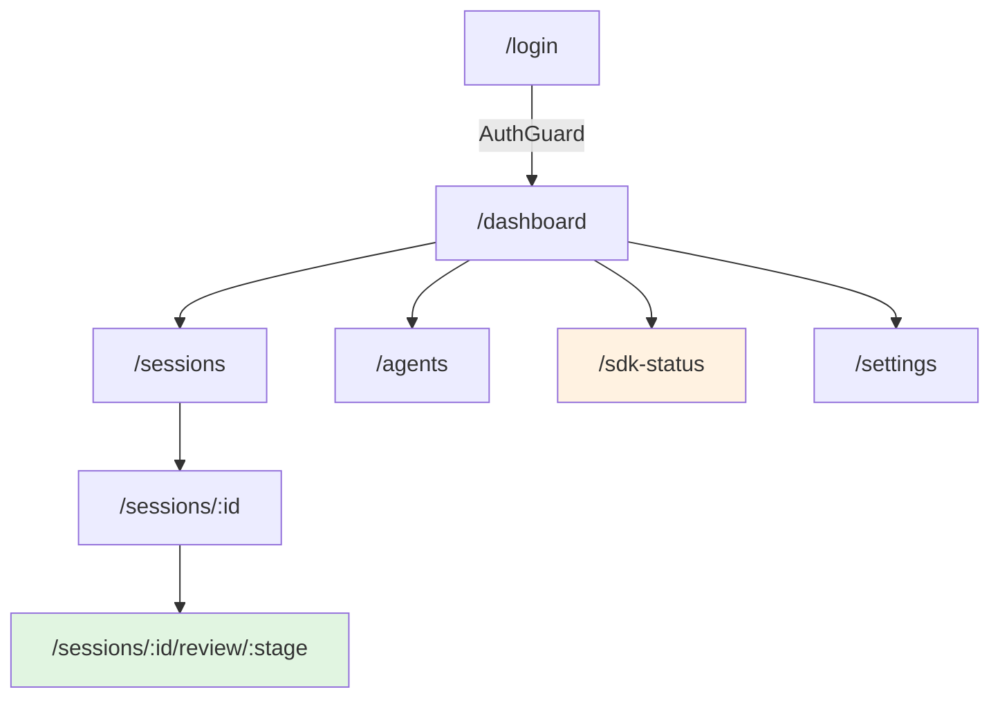
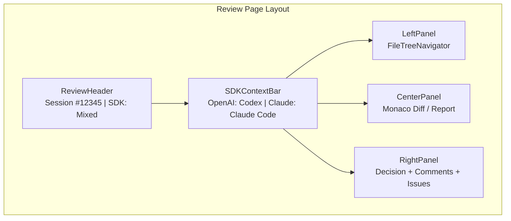
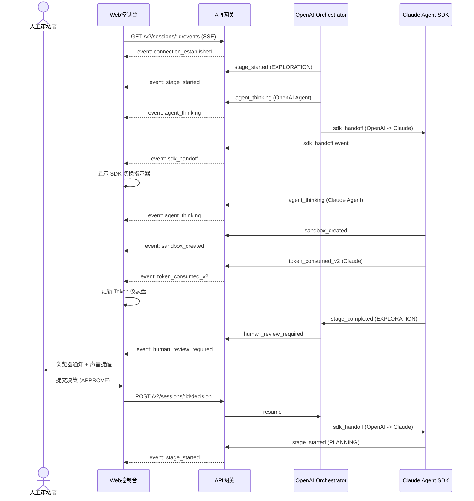

# RV-Insights v2 UI/UX 深度规格

**版本**: v2.0  
**日期**: 2026-04-23  
**定位**: 面向 Claude Agent SDK + OpenAI Agents SDK 混合架构的 Web 控制台前端实现依据。本文档在 v1 `ui-design-deep-dive.md` 基础上全面升级，适配双 SDK 架构的展示、切换、成本追踪与人工审核需求。

---

## 目录

1. [Web 控制台路由与布局](#1-web-控制台路由与布局)
2. [会话列表页](#2-会话列表页)
3. [会话详情页](#3-会话详情页)
4. [人工审核界面（核心）](#4-人工审核界面核心)
5. [SSE/WebSocket 协议规范](#5-ssewebsocket-协议规范)
6. [组件设计规范](#6-组件设计规范)
7. [附录：依赖矩阵与衔接点](#7-附录依赖矩阵与衔接点)

---

## 1. Web 控制台路由与布局

### 1.1 路由设计

采用 Next.js 14 App Router 约定，所有受保护路由统一包裹 `AuthGuard` + `RoleGuard`。v2 新增 SDK 相关管理页面与双 SDK 状态展示路由。

| 路由 | 页面名称 | 访问角色 | 说明 |
|------|----------|----------|------|
| `/dashboard` | 仪表盘 | admin, reviewer, observer | 全局概览、待办审核队列、双 SDK 成本仪表盘 |
| `/sessions` | 会话列表 | admin, reviewer, observer | 支持筛选/分页/搜索；新增 SDK 来源列 |
| `/sessions/:id` | 会话详情 | admin, reviewer, observer | 阶段时间线、实时日志（分 SDK 样式）、Token 仪表盘 |
| `/sessions/:id/review/:stage` | 人工审核 | admin, reviewer | 核心审核界面；新增双 SDK 上下文面板 |
| `/settings` | 系统设置 | admin | 全局配置、通知渠道、Agent 参数、SDK 配额与成本告警阈值 |
| `/agents` | Agent 管理 | admin | Agent 注册表、版本控制、启停状态、SDK 归属标识 |
| `/sdk-status` | SDK 状态监控 | admin | 双 SDK 健康状态、API 延迟、配额余量、切换事件日志 |
| `/login` | 登录页 | 公开 | OAuth2 / SSO 统一入口 |

**路由守卫行为**：
- 未登录用户访问受保护路由 -> 重定向至 `/login`，携带 `redirect_to` 参数。
- `observer` 访问 `/sessions/:id/review/:stage` -> 403 页面，提示"仅审核者可提交决策"。
- `reviewer` 访问 `/settings`、`/agents` 或 `/sdk-status` -> 403 页面。

### 1.2 全局布局（Global Layout）

所有受保护页面共享同一 `DashboardLayout`，v2 在 Status Bar 中新增 SDK 运行状态指示器。

```
+-----------------------------------------------------------------------------+
| [Logo]  RV-Insights v2    [GlobalSearch]   [SDKStatusPill]   [Bell] [Avatar] |  <-- TopBar (高度: 56px)
+-----------------------------------------------------------------------------+
| Sidebar (200px) |  Main Content Area (flex: 1)                               |
|                 |                                                            |
| - Dashboard     |                                                            |
| - Sessions      |                                                            |
| - Agents        |                                                            |
| - SDK Status    |                                                            |
| - Settings      |                                                            |
|                 |                                                            |
| -- Divider --   |                                                            |
| - Docs          |                                                            |
| - Feedback      |                                                            |
+-----------------------------------------------------------------------------+
| [StatusBar] 双 SDK 状态 | 当前租户 | 系统版本 | 连接状态                      |  <-- Bottom Status Bar (高度: 28px)
+-----------------------------------------------------------------------------+
```

**TopBar 组件**：
- **GlobalSearch**：Cmd+K 唤起全局搜索面板（Command Palette），可搜索会话 ID、仓库名、Agent 名称。输入框占位符："Search sessions, repos, agents..."
- **SDKStatusPill**（v2 新增）：
  - 展示当前系统默认使用的编排 SDK（OpenAI / Claude）。
  - 绿色圆点表示该 SDK API 健康；红色圆点表示异常或配额耗尽。
  - 点击展开下拉面板，展示双 SDK 的实时配额余量、今日成本、API 延迟 P99。
  - 若发生 SDK 切换事件，Pill 播放脉冲动画 3 秒并显示 "Switched to {sdk}" 提示。
- **NotificationCenter（Bell）**：
  - 红点 Badge 显示未读人工审核待办数（`human_review_required` 事件触发）。
  - 下拉面板展示最近 20 条通知，按时间倒序，支持标记已读/全部已读。
  - 通知类型：审核请求、阶段完成、系统告警、Agent 错误、SDK 切换事件、沙箱创建/销毁事件。
- **UserAvatar**：下拉菜单展示当前用户角色、个人设置入口、登出。

**Sidebar 组件**：
- 可折叠（桌面端默认展开，平板以下默认收起，通过汉堡菜单触发）。
- 当前路由高亮（`bg-primary/10 text-primary`）。
- 新增 `SDK Status` 入口（仅 `admin` 可见）。
- 底部固定区域放置文档与反馈链接。

**Bottom Status Bar**（v2 新增）：
- 固定于视口底部，高度 28px，背景 `bg-muted/50`，文字 `text-xs text-muted-foreground`。
- 左侧：双 SDK 连接状态（OpenAI: Connected / Claude: Connected）。
- 中间：当前租户标识（多租户场景）。
- 右侧：系统版本号 + 构建时间。

### 1.3 权限控制矩阵（RBAC）

```typescript
interface User {
  id: string;
  name: string;
  email: string;
  role: "admin" | "reviewer" | "observer";
}

const PERMISSIONS: Record<string, string[]> = {
  "dashboard.view":   ["admin", "reviewer", "observer"],
  "sessions.view":    ["admin", "reviewer", "observer"],
  "sessions.review":  ["admin", "reviewer"],
  "sessions.decide":  ["admin", "reviewer"],
  "agents.manage":    ["admin"],
  "settings.manage":  ["admin"],
  "sdkstatus.view":   ["admin"],
};
```

**前端实现**：通过 `usePermission(hook)` 在组件级控制按钮/面板的渲染，后端 API 同步做二次校验，防止前端绕过。

### 1.4 页面路由图



### 1.5 响应式断点设计

| 断点名称 | 宽度范围 | 目标设备 | 布局策略 |
|----------|----------|----------|----------|
| `mobile` | < 768px | 手机 | 单栏；Sidebar 变为 Drawer；Status Bar 隐藏；SDK Pill 简化为图标 |
| `tablet` | 768px - 1024px | 平板 | 两栏；Sidebar 可折叠；Bottom Status Bar 显示简化版 |
| `desktop` | 1024px - 1440px | 笔记本/小屏显示器 | 三栏完整布局；所有面板可见 |
| `wide` | > 1440px | 大屏显示器 | 三栏 + 额外信息面板（如实时成本浮窗） |

### 1.6 主题设计

支持 Light / Dark / System 三种模式，通过 `next-themes` 实现。

**主题关键变量**：
| Token | Light | Dark | 用途 |
|-------|-------|------|------|
| `--sdk-openai` | `#10a37f` | `#19c59f` | OpenAI SDK 品牌色 |
| `--sdk-claude` | `#d97757` | `#e08e6d` | Claude SDK 品牌色 |
| `--sdk-openai-bg` | `#e6f5f0` | `#0f2922` | OpenAI 日志背景 |
| `--sdk-claude-bg` | `#fdf0eb` | `#2a1f1b` | Claude 日志背景 |
| `--status-running` | `#2563eb` | `#3b82f6` | 进行中 |
| `--status-review` | `#ea580c` | `#f97316` | 待审核 |
| `--status-success` | `#16a34a` | `#22c55e` | 已完成 |
| `--status-error` | `#dc2626` | `#ef4444` | 失败 |

---

## 2. 会话列表页

### 2.1 页面布局

```
+---------------------------------------------------------------------------------------------+
| [PageHeader] Sessions                                                    [New Session]      |
+---------------------------------------------------------------------------------------------+
| [FilterBar]                                                                                 |
| [SearchInput] [StatusDropdown] [StageDropdown] [SDKDropdown] [TenantDropdown] [DateRange]   |
+---------------------------------------------------------------------------------------------+
| [BatchActionBar] (选中时显示)                                                                |
| [Checkbox] Select All (12)  [Cancel Selected] [Export Selected]                             |
+---------------------------------------------------------------------------------------------+
|                                                                                             |
|  [SessionCard]  [SessionCard]  [SessionCard]  [SessionCard]                                 |
|  [SessionCard]  [SessionCard]  [SessionCard]  [SessionCard]                                 |
|                                                                                             |
+---------------------------------------------------------------------------------------------+
| [Pagination] 1 2 3 ... 10  [PageSize: 20/50/100]                                           |
+---------------------------------------------------------------------------------------------+
```

### 2.2 会话卡片设计（SessionCard）

```
+----------------------------------------------------------+
| [SDKEBadge: OpenAI]  Session #12345                      |
|                                                          |
| [StatusBadge: RUNNING]  [StageBadge: EXPLORATION]        |
|                                                          |
| Repo: riscv-linux    Branch: riscv-atomic-fix            |
|                                                          |
| [ProgressBar: 35%]  Stage 2 of 5                         |
|                                                          |
| [Clock] 00:42:18  |  [Tokens] 1.2M  |  [Cost] $14.00    |
|                                                          |
| [AgentAvatar] explorer  [AgentAvatar] feasibility-judge  |
+----------------------------------------------------------+
```

**字段说明**：
- **SDKEBadge**（v2 新增）：展示当前会话主要使用的 SDK（OpenAI / Claude / Mixed）。颜色编码：OpenAI 为绿色系，Claude 为橙色系，Mixed 为渐变色。
- **StatusBadge**：当前会话状态（`RUNNING` / `INTERRUPTED` / `COMPLETED` / `FAILED` / `CANCELLED`）。
- **StageBadge**：当前阶段标识（`EXPLORATION` / `PLANNING` / `DEVELOPMENT` / `REVIEW` / `TESTING` / `COMPLETION`）。
- **ProgressBar**：基于当前阶段 / 总阶段计算的粗略进度（仅视觉参考，非精确时间估计）。
- **Tokens**：本会话累计 LLM Token 消耗（千分位格式化）。
- **Cost**（v2 新增）：本会话累计估算成本（美元，基于 Token 消耗 * 模型单价实时计算）。
- **AgentAvatar**：当前活跃的 Agent 头像列表，hover 显示 Agent 名称与 SDK 归属。

### 2.3 过滤与排序

**过滤器**：
| 过滤器 | 选项 | 说明 |
|--------|------|------|
| Search | 自由文本 | 搜索会话 ID、仓库名、分支名、Agent 名称 |
| Status | 多选 | RUNNING / INTERRUPTED / COMPLETED / FAILED / CANCELLED |
| Stage | 多选 | 五阶段 + 人工审核子阶段 |
| SDK | 多选（v2 新增） | OpenAI / Claude / Mixed |
| Tenant | 单选 | 多租户场景下的租户隔离 |
| Date Range | 日期选择器 | 创建时间范围 |

**排序选项**：
- 最近更新（默认）
- 创建时间
- Token 消耗（高到低）
- 成本（高到低）（v2 新增）
- 阶段进度

### 2.4 批量操作

当用户勾选多条会话时，底部弹出 BatchActionBar：

| 操作 | 可用条件 | 行为 |
|------|----------|------|
| **Cancel Selected** | 选中会话状态为 `RUNNING` 或 `INTERRUPTED` | 弹出确认框，取消后状态变为 `CANCELLED` |
| **Export Selected** | 任意状态 | 导出 JSON/CSV 格式的会话摘要（含日志、产物链接、决策历史） |
| **Archive Selected** | 状态为 `COMPLETED` 或 `FAILED` | 归档会话，从活跃列表移除 |

### 2.5 实时更新（SSE 事件驱动的列表刷新）

会话列表页通过 SSE 连接接收全局会话状态变更事件，实现列表的实时更新而无需手动刷新。

**实现策略**：
- 页面挂载时建立 SSE 连接：`/v2/sessions/events`。
- 接收 `session_updated` 事件时，使用 React Query 的 `queryClient.invalidateQueries` 触发列表重新获取。
- 为避免列表跳动，采用乐观更新：先更新本地缓存中的对应会话卡片，再在后台静默重新获取完整数据校验。
- 若用户正在与过滤器交互（下拉菜单展开中），延迟刷新直到交互结束（`isInteracting` 标志）。

---

## 3. 会话详情页

### 3.1 页面路由与数据加载

- **路由**: `/sessions/:id`
- **数据获取**: Next.js `generateMetadata` + 服务端组件预取会话元数据；实时数据通过 SSE 增量更新。
- **错误状态**: 会话不存在 -> 404 页面；无权限 -> 403 页面；加载中 -> Skeleton 骨架屏。

### 3.2 顶部状态条（Session Status Bar）

固定于页面顶部（`position: sticky; top: 56px`），高度 64px，背景 `bg-card` 带底部阴影。v2 新增 SDK 切换指示器与分 SDK Token 消耗。

```
+----------------------------------------------------------------------------------------------------------+
| [StatusDot] EXPLORATION  |  Duration: 00:42:18  |  [OpenAI] 800K ($0.64)  |  [Claude] 400K ($6.00)  | [Badge] 3 pending |
|                          |  (实时递增)           |  (分 SDK Token消耗)      |                         | 点击跳转审核页     |
+----------------------------------------------------------------------------------------------------------+
```

**字段说明**：
- **StatusDot**: 当前阶段颜色编码（`INITIALIZATION` 灰 / `EXPLORATION` 蓝 / `HUMAN_REVIEW_*` 橙 / `COMPLETION` 绿 / `FAILED` 红）。
- **Duration**: 从会话创建开始的累计运行时长，每秒递增（通过 `requestAnimationFrame` 节流）。
- **分 SDK Token 消耗**（v2 新增）：
  - OpenAI 消耗：绿色文字，格式 `{tokens} ({cost})`。
  - Claude 消耗：橙色文字，格式 `{tokens} ({cost})`。
  - hover 显示详细模型拆分（如 "GPT-4.1: 600K, Codex: 200K"）。
- **Pending Badge**: 当前会话中处于 `HUMAN_REVIEW_*` 状态的阶段数量；点击直接跳转最新待审核阶段。

### 3.3 阶段时间线组件（StageTimeline）

垂直时间线，位于页面左侧固定宽度区域（桌面端 320px，可折叠）。v2 在时间线节点上标注 Agent 的 SDK 来源。

```
StageTimeline
|
|-- [Green] INITIALIZATION        10:00  (2m)
|      OpenAI Orchestrator
|
|-- [Blue]  EXPLORATION           10:02  (15m)
|      OpenAI: MailScanner + IssueMiner
|      Claude: FeasibilityJudge
|      ----> [实时日志]
|
|-- [Gray]  HUMAN_REVIEW_EXPLORATION
|      未开始
|
|-- [Gray]  PLANNING
|      Claude Agent SDK
|      未开始
|
|-- [Gray]  HUMAN_REVIEW_PLANNING
|      未开始
|
|-- [Gray]  DEVELOPMENT
|      Claude Code / Managed Agents
|      未开始
|
|-- [Gray]  REVIEW
|      OpenAI + Codex
|      未开始
|
|-- [Gray]  HUMAN_REVIEW_CODE
|      未开始
|
|-- [Gray]  TESTING
|      OpenAI Sandbox (E2B)
|      未开始
|
|-- [Gray]  HUMAN_REVIEW_TESTING
|      未开始
|
|-- [Gray]  COMPLETION
|      未开始
```

**交互设计**：
- 点击任意阶段节点 -> 右侧主区域切换至该阶段详情（日志、产物摘要、审核历史）。
- 当前激活阶段高亮（左侧边框 3px 主色）。
- 人工审核阶段节点右侧显示决策按钮快捷入口（仅 `reviewer` 可见）。
- 时间线支持折叠/展开（点击阶段名称旁 Chevron）。
- **SDK 来源标注**（v2 新增）：每个阶段节点下方小字标注负责该阶段的 SDK 与 Agent 名称，使用对应 SDK 品牌色。

**状态图标**：
| 状态 | 图标 | 颜色 |
|------|------|------|
| 未开始 | Circle | `text-muted-foreground` |
| 进行中 | Loader2 (spin) | `text-blue-500` |
| 待审核 | AlertCircle | `text-orange-500` |
| 已完成 | CheckCircle2 | `text-green-500` |
| 失败 | XCircle | `text-red-500` |

### 3.4 实时日志流（RealtimeLogStream）

位于主内容区底部可折叠面板，高度默认 240px，可拖拽调整（`react-resizable-panels`）。v2 核心升级：区分 OpenAI 与 Claude Agent 日志的视觉样式。

```
+---------------------------------------------------------------+
| [Terminal] Agent Logs                              [Collapse] |
| [Filter: All SDKs] [Filter: All Agents] [Filter: All Levels]  |
+---------------------------------------------------------------+
| [10:02:15] [OpenAI][MailScanner] Scanning riscv-linux...     |
| [10:02:18] [OpenAI][MailScanner] Found 3 opportunities       |
| [10:02:20] [Claude][FeasibilityJudge] Analyzing code path... |
| [10:02:25] [Claude][FeasibilityJudge] Cross-validation passed|
| [10:02:28] [OpenAI][CodeAnalyst] RAG spec reference confirmed|
| [10:02:30] [Claude][FeasibilityJudge] Confidence: 0.92       |
| > _                                                           |
+---------------------------------------------------------------+
```

**视觉风格**：
- 整体暗色终端背景（`#0d1117`）。
- **OpenAI 日志行**：左侧边框 2px `#10a37f`，Agent 名称标签背景 `#10a37f/20`，文字颜色 `#19c59f`。
- **Claude 日志行**：左侧边框 2px `#d97757`，Agent 名称标签背景 `#d97757/20`，文字颜色 `#e08e6d`。
- **SDK 切换事件**（v2 新增）：当日志中出现 `sdk_handoff` 事件时，整行背景闪烁 `#fbbf24/10` 1 秒，并插入分隔线：
  ```
  --- [SDK Handoff] OpenAI Orchestrator -> Claude Agent SDK ---
  ```

**功能规格**：
- 自动滚动到底部（`autoScroll` 开关，默认开启）。
- 支持按 SDK 过滤（v2 新增：OpenAI / Claude / All）。
- 支持按 Agent 名称过滤（多选下拉）。
- 支持按日志级别过滤（INFO / WARN / ERROR / DEBUG）。
- 搜索高亮：输入关键词后，匹配行高亮黄色背景，支持 `Enter` 跳转到下一条。
- 导出：按钮"Download Logs"下载当前会话完整日志（`.log` 文件），包含 SDK 来源前缀。

**性能优化**：
- 日志条目上限 10,000 条，超出时丢弃最早 20% 并显示提示"Older logs truncated"。
- 使用 `react-virtuoso` 虚拟滚动，避免 DOM 爆炸。
- 按 SDK 分片存储日志（`openaiLogs` / `claudeLogs`），便于独立过滤与统计。

### 3.5 SDK 切换指示器（SDK Handoff Indicator）（v2 新增）

当 Agent 从 OpenAI 切换到 Claude（或反向）时，在日志流顶部显示动画提示横幅。

```
+---------------------------------------------------------------+
| [Zap] SDK Handoff: OpenAI -> Claude                           |
| Reason: Development stage requires Computer Use capability     |
| [View Details] [Dismiss]                                      |
+---------------------------------------------------------------+
```

**行为**：
- 横幅从顶部滑入（`framer-motion` `y: -50 -> 0`），停留 8 秒后自动收起。
- 点击 "View Details" -> 弹出 Modal，展示切换原因、涉及的 Agent 名称、上下文传递摘要。
- 点击 "Dismiss" -> 立即收起，不再显示本次切换的横幅。
- 若用户在 8 秒内滚动日志流，横幅保持固定（`position: sticky`）。

### 3.6 产物展示区（Artifact Viewer）

位于主内容区中部，根据当前选中阶段展示不同类型的产物。

**代码 Diff 阶段**（DEVELOPMENT / REVIEW / HUMAN_REVIEW_CODE）：
- Monaco Diff 查看器（详见第 4 节）。

**报告阶段**（EXPLORATION / PLANNING / TESTING）：
- Markdown 渲染器，支持代码块高亮、表格、Mermaid 图表。
- 规划阶段的 `computer_use_screenshots` 以画廊形式展示（缩略图网格 + 点击放大）。

**测试报告阶段**（TESTING）：
- 测试摘要卡片（通过/失败/跳过计数）。
- 测试详情表格（用例名、状态、耗时、日志链接）。
- QEMU 仿真输出终端（只读）。

### 3.7 Token 消耗仪表盘（Token Consumption Dashboard）（v2 新增）

位于会话详情页右侧可折叠面板（桌面端默认收起，点击展开）。

```
+----------------------------------+
| [TokenCounter] Session #12345    |
+----------------------------------+
| Total: 1.2M tokens | $14.00      |
+----------------------------------+
| [OpenAI] 800K  |  $8.00  [=====>     ] 57% |
|   - GPT-4.1: 600K | $4.80        |
|   - Codex: 200K   | $3.20        |
+----------------------------------+
| [Claude] 400K  |  $6.00  [==>        ] 43% |
|   - Sonnet 4.5: 400K | $6.00     |
+----------------------------------+
| [CostProjection]                 |
| Estimated total: $28.00          |
| Based on current burn rate       |
+----------------------------------+
```

**功能**：
- 实时更新：每次收到 `token_consumed` 事件时更新对应 SDK 的计数器。
- 成本计算：前端根据硬编码的单价表（与后端一致）实时计算美元成本。
- 成本投影：基于当前消耗速率与会话历史模式，估算总成本（仅供参考）。
- 告警阈值：若单会话成本超过设置阈值（默认 $50），显示红色警告徽章。

---

## 4. 人工审核界面（核心）

### 4.1 页面路由与入口

- **路由**: `/sessions/:id/review/:stage`
- **`:stage` 枚举值**: `exploration` | `planning` | `code` | `testing`
- **进入条件**: 该会话的 `current_stage` 必须处于对应的 `HUMAN_REVIEW_*` 状态，否则显示"当前阶段无需人工审核"提示页，并提供返回会话详情按钮。

### 4.2 全局布局（桌面端三栏 + 双 SDK 上下文面板）

v2 审核界面在四栏布局基础上，新增顶部双 SDK 上下文条与右侧决策面板中的 SDK 信息区。

```
+-------------------------------------------------------------------------------------------------------------+
| [ReviewHeader] Session #12345 | Stage: HUMAN_REVIEW_CODE | Status: AWAITING_DECISION | SDK: Mixed          |
+-------------------------------------------------------------------------------------------------------------+
| [SDKContextBar] (v2 新增)                                                                                   |
| [OpenAI] Reviewer: Codex  |  [Claude] Developer: Claude Code  |  Handoff at: 10:05:32                        |
+-------------------------------------------------------------------------------------------------------------+
| LeftPanel (260px)    | CenterPanel (flex: 1)            | RightPanel (380px)                             |
|                      |                                  |                                                |
| [FileTreeNavigator]  | [ArtifactViewer]                 | [DecisionPanel]                                |
| - repo/              |                                  |                                                |
|   - arch/            |  [DiffView / ReportView]         |  [SDKContextCard] (v2 新增)                    |
|     - riscv/         |                                  |  [ActionButtons]                               |
|       - Kconfig      |  [MonacoEditor / Markdown]       |  [CommentEditor]                               |
|       - Makefile     |                                  |  [IssueList]                                   |
|       - patch.c      |                                  |  [HistoryTimeline]                             |
| ...                  |                                  |                                                |
+-------------------------------------------------------------------------------------------------------------+
```

**面板说明**：
- **ReviewHeader**: 新增 SDK 标识（`OpenAI` / `Claude` / `Mixed`），显示当前审核产物由哪个 SDK 生成。
- **SDKContextBar**（v2 新增）：顶部固定条，展示当前审核涉及的 SDK 与 Agent 信息。
  - OpenAI 侧：审核 Agent 名称（如 Codex）、Guardrails 触发次数。
  - Claude 侧：开发 Agent 名称（如 Claude Code）、Computer Use 截图数量。
  - Handoff 时间：从开发到审核的 SDK 切换时间戳。
- **LeftPanel**: 产物文件树导航（仅在 `code` 阶段展示代码 Diff；其他阶段展示报告章节树）。
- **CenterPanel**: 产物主查看区，根据阶段类型渲染 Diff 查看器或报告渲染器。
- **RightPanel**: 决策面板，固定宽度，包含 SDK 上下文卡片、操作按钮、注释编辑器、问题列表、历史决策时间线。

### 4.3 审核界面线框图



### 4.4 代码 Diff 查看器（CodeDiffViewer）

**技术选型**: Monaco Editor（VS Code 内核），原因：
- 原生支持 Diff 模式（`originalModel` / `modifiedModel`）。
- 支持行内注释（Glyph Margin Decoration + Content Widget）。
- 语法高亮覆盖 C/C++、Assembly、Makefile、Kconfig 等 RISC-V 项目常用语言。
- 支持 minimap、行号跳转、代码折叠。

**组件层级**：
```
CodeDiffViewer
|-- FileTreeNavigator (左侧文件树)
|   |-- FileTreeNode (递归渲染目录/文件)
|   |   |-- FileIcon (根据扩展名选择图标)
|   |   |-- ChangeStatsBadge (+12 / -5)
|   |   |-- ReviewStatusDot (该文件是否有未处理 Issue)
|   |   |-- SDKEBadge (v2 新增: 该文件变更由哪个 SDK 生成)
|
|-- DiffEditor (Monaco 实例)
|   |-- OriginalModel (base commit)
|   |-- ModifiedModel (patch)
|   |-- InlineCommentWidget (行内注释浮层)
|   |-- DecorationLayer (severity 颜色标记)
|   |-- SDKHandoffDecoration (v2 新增: 标记 SDK 切换位置的装饰线)
|
|-- DiffStatsBar (底部统计条)
|   |-- TotalFilesChanged
|   |-- TotalAdditions (绿)
|   |-- TotalDeletions (红)
|   |-- SDKBreakdown (v2 新增: OpenAI + Claude 各自变更行数)
|   |-- JumpToNextIssue (按钮)
```

**交互规格**：
1. **文件树导航**：
   - 点击文件 -> CenterPanel 切换至该文件的 Diff。
   - 文件节点右侧显示变更统计（`+added / -removed`）。
   - 若该文件存在审核 Issue，节点左侧显示对应 severity 颜色的圆点。
   - **SDKEBadge**（v2 新增）：文件节点右侧显示该文件变更由哪个 SDK 生成（OpenAI 绿标 / Claude 橙标）。
   - 支持 `Cmd+Click` / `Ctrl+Click` 多选文件进行批量操作。

2. **Diff 渲染**：
   - 默认 side-by-side 模式，支持切换至 inline 模式（工具栏按钮）。
   - 变更行背景色：新增 `#e6ffec` / 删除 `#ffebe9`（GitHub 风格）。
   - 支持 `?w=1` 忽略空白变更（工具栏 Toggle）。

3. **行内注释**：
   - 点击行号旁的 `+` 图标 -> 弹出 Markdown 编辑器浮层。
   - 注释支持 `@mention` 语法（高亮并通知相关用户）。
   - 注释保存后，该行号旁显示注释数量 Badge。
   - 注释可编辑/删除（仅创建者或 admin）。

4. **Severity 颜色标记**：
   审核 Issue 关联到具体行时，在 Monaco 的 Glyph Margin 渲染对应颜色竖条：
   | Severity | 颜色 | 用途 |
   |----------|------|------|
   | CRITICAL | `#dc2626` (红) | 阻塞性问题，必须修复 |
   | HIGH | `#ea580c` (橙) | 严重问题，强烈建议修复 |
   | MEDIUM | `#ca8a04` (黄) | 一般问题，建议修复 |
   | LOW | `#2563eb` (蓝) | 轻微问题，可选修复 |

5. **SDK Handoff 装饰线**（v2 新增）：
   - 若代码变更涉及 SDK 切换（如 Claude 开发后 OpenAI 审核），在 Diff 中插入虚线分隔装饰，标注切换点。
   - hover 显示切换原因 tooltip。

### 4.5 审核报告渲染器（ReviewReportRenderer）

用于渲染 `exploration`、`planning`、`code`（审核 Agent 报告）、`testing` 阶段的结构化报告。

**组件层级**：
```
ReviewReportRenderer
|-- ReportHeader
|   |-- StageTitle
|   |-- OverallVerdictBadge (PASS / NEEDS_REVISION / REJECT)
|   |-- ConfidenceScore (0-100% 环形图)
|   |-- SummaryText
|   |-- SDKAttribution (v2 新增: 报告生成 SDK 标识)
|
|-- IssueListSection
|   |-- IssueFilterBar (按 severity / category / blocking / sdk_source 筛选)
|   |-- IssueGroup (按文件或类别分组)
|   |   |-- IssueCard (可折叠)
|   |   |   |-- SeverityBadge
|   |   |   |-- CategoryTag
|   |   |   |-- FilePath + LineRange (点击跳转)
|   |   |   |-- Description (Markdown 渲染)
|   |   |   |-- Suggestion (代码块，支持一键复制)
|   |   |   |-- BlockingIndicator (是否阻塞通过)
|   |   |   |-- ResolutionCheckbox (已解决/未解决，仅 reviewer)
|   |   |   |-- SDKSourceBadge (v2 新增: 发现该 Issue 的 SDK)
|
|-- PositiveFeedbackSection (优点列表，可折叠，默认收起)
|-- AgentLogPreview (该阶段 Agent 日志摘要，可展开)
|-- SDKHandoffLog (v2 新增: SDK 切换事件摘要)
```

**IssueCard 交互**：
- 点击文件路径/行号 -> 若处于 `code` 阶段，CenterPanel 的 Diff 自动滚动到对应行并高亮 3 秒。
- 每个 Issue 右侧提供"批量接受建议"复选框。
- 已解决的 Issue 自动折叠并置灰，移至列表底部。
- **SDKSourceBadge**（v2 新增）：标识该 Issue 是由 OpenAI Codex 还是 Claude 审核发现，帮助审核者理解问题来源的模型偏好。

### 4.6 双 SDK 上下文面板（Dual SDK Context Panel）（v2 新增）

位于 RightPanel 顶部，展示当前审核产物的 SDK 来源信息，帮助人类审核者理解 Agent 决策背景。

```
+----------------------------------+
| [SDKContextCard]                 |
+----------------------------------+
| Generated By                     |
| [ClaudeBadge] Claude Code        |
| Model: claude-sonnet-4-5         |
| Computer Use: 12 screenshots     |
| Subagents: 2 invoked             |
+----------------------------------+
| Reviewed By                      |
| [OpenAIBadge] Codex              |
| Model: codex                     |
| Guardrails: 3 triggered          |
| Iterations: 2                    |
+----------------------------------+
| [View Full SDK Log]              |
+----------------------------------+
```

**字段说明**：
- **Generated By**: 展示生成当前产物的 SDK 与 Agent 信息。
  - Claude 侧：模型版本、Computer Use 截图数、Subagent 调用次数。
  - OpenAI 侧：模型版本、工具调用次数、沙箱提供商（如 E2B）。
- **Reviewed By**: 展示审核产物的 SDK 与 Agent 信息（仅 `code` / `testing` 阶段）。
- **Guardrails 触发次数**：点击展开列表，展示每条 Guardrail 的名称与触发原因。
- **View Full SDK Log**：跳转至会话详情页的对应阶段日志。

### 4.7 决策工作流（DecisionWorkflow）

位于 RightPanel 中部，是人工审核的核心交互区。

```
+----------------------------------+
| [DecisionWorkflow]               |
+----------------------------------+
| Action Required                    |
|                                  |
| [APPROVE] [REJECT] [REQUEST_CHANGES] [ADD_NOTES] |
|                                  |
| +------------------------------+ |
| | Comment Editor (Markdown)    | |
| |                              | |
| | _                            | |
| +------------------------------+ |
|                                  |
| [Preview] [Submit Decision]      |
+----------------------------------+
```

**四按钮组规格**：

| 按钮 | 颜色 | 语义 | 注释必填 | 确认对话框 |
|------|------|------|----------|------------|
| **APPROVE** | 绿色 (`bg-green-600`) | 接受产物，进入下一阶段 | 否 | 否（但需二次确认若存在未解决 CRITICAL Issue） |
| **REJECT** | 红色 (`bg-red-600`) | 终止会话，丢弃产物 | 是 | **是**（模态框确认，防止误操作） |
| **REQUEST_CHANGES** | 橙色 (`bg-orange-600`) | 退回当前阶段，要求修改 | 是 | 否 |
| **ADD_NOTES** | 蓝色 (`bg-blue-600`) | 接受并附带注释进入下一阶段 | 是 | 否 |

**确认对话框（REJECT 专用）**：
```
+------------------------------------------+
| Confirm Rejection                          |
|                                            |
| You are about to REJECT session #12345.    |
| This will terminate the workflow and       |
| discard all generated artifacts.           |
|                                            |
| Generated by: Claude Code                  |
| Reviewed by: Codex                         |
| This action CANNOT be undone.              |
|                                            |
| [Cancel]          [Confirm Reject]         |
+------------------------------------------+
```

**APPROVE 安全闸口**：
- 若当前审核报告存在 `blocking == true` 且未解决的 Issue，点击 APPROVE 时弹出警告：
  "There are N blocking issues unresolved. Are you sure you want to approve?"
- 用户需勾选 "I understand the risks" 后方可确认。
- **v2 新增**：若存在由 Claude 发现的高置信度问题（`claude_confidence > 0.9`），额外提示 "Claude has flagged high-confidence issues"。

**注释编辑器（CommentEditor）**：
- 基于 `react-simplemde-editor` 或自研 Markdown 编辑器。
- 支持实时预览（Split 模式）。
- 支持 `@mention` 用户（下拉选择）。
- 支持粘贴图片自动上传至对象存储并插入链接。
- 最小高度 120px，最大高度 400px（超出滚动）。
- 内容实时保存至 `localStorage`（见第 5 节）。

**提交行为**：
- 点击 Submit -> 按钮进入 Loading 状态（`disabled` + Spinner）。
- 前端先乐观更新本地状态，再发送 POST 请求。
- 请求成功 -> 播放成功音效（可选），推送全局通知，路由跳转至 `/sessions/:id`（阶段时间线自动刷新）。
- 请求失败 -> 按钮恢复，显示错误 Toast，保留编辑器内容。

### 4.8 安全警告高亮（Security Warning Highlight）

以下变更类型在审核界面中必须附带显式安全警告：

| 变更类型 | 警告样式 | 说明 |
|----------|----------|------|
| 内联汇编修改 | 红色边框 + `ShieldAlert` 图标 | 尤其是不熟悉的指令序列，需人工仔细审查 |
| 新依赖引入 | 橙色边框 + `Package` 图标 | 检查 CVE、许可证兼容性 |
| 权限/认证相关代码 | 红色边框 + `Lock` 图标 | 必须双人审核 |
| 构建系统修改 | 黄色边框 + `Wrench` 图标 | Makefile、Kconfig 变更影响面广 |
| CSR 指令修改 | 红色边框 + `Cpu` 图标 | 必须引用 RISC-V 规范章节 |

**实现方式**：
- 在 FileTreeNavigator 中，存在安全警告的文件节点显示对应图标。
- 在 Diff 查看器中，存在安全警告的代码块顶部插入警告横幅（`position: sticky`）。
- 在 IssueList 中，安全相关问题默认展开并置顶。

### 4.9 历史决策时间线（DecisionHistoryTimeline）

位于 RightPanel 底部，展示该会话所有历史人工决策记录。

```
+----------------------------------+
| [DecisionHistoryTimeline]        |
+----------------------------------+
| [Green] APPROVE                  |
| Stage: EXPLORATION               |
| By: Alice at 10:15:32            |
| "Looks good, proceed to plan."   |
+----------------------------------+
| [Orange] REQUEST_CHANGES         |
| Stage: CODE (Iteration 2)        |
| By: Bob at 11:42:18              |
| "Fix atomic fence issue."        |
+----------------------------------+
| [Blue] ADD_NOTES                 |
| Stage: PLANNING                  |
| By: Alice at 10:45:05            |
| "Consider RV32 compatibility."   |
+----------------------------------+
```

**v2 新增**：每条决策记录标注该阶段使用的 SDK 信息（如 "Generated by Claude, Reviewed by OpenAI"）。

---

## 5. SSE/WebSocket 协议规范

### 5.1 传输层选型

- **主通道**: WebSocket（`wss://api.rv-insights.io/v2/ws/sessions/:id`）
  - 双向通信，支持客户端发送心跳与确认消息。
  - 适合高频状态更新（Agent 思考日志、实时 Token 消耗、SDK 切换事件）。
- **降级通道**: Server-Sent Events (SSE)（`/v2/sessions/:id/events`）
  - 用于不支持 WebSocket 的环境（部分企业防火墙）。
  - 仅服务端推送，客户端通过 HTTP POST 发送决策。

### 5.2 事件类型 JSON Schema

所有消息统一包装为 `Envelope`：

```typescript
interface Envelope {
  id: string;           // UUID v4，用于去重与确认
  timestamp: string;    // ISO 8601
  type: EventType;
  payload: unknown;
}

type EventType =
  // v1 保留事件（8种）
  | "stage_started"
  | "agent_thinking"
  | "human_review_required"
  | "stage_completed"
  | "error_occurred"
  | "token_consumed"
  | "heartbeat"
  | "ack"
  | "connection_established"
  | "state_sync"
  // v2 新增事件（4种）
  | "sdk_handoff"
  | "sandbox_created"
  | "sandbox_destroyed"
  | "token_consumed_v2";
```

**v1 保留事件详细规格**（与 v1 保持一致，略）。

**v2 新增事件详细规格**：

#### `sdk_handoff`
```typescript
interface SDKHandoffPayload {
  session_id: string;
  from_sdk: "openai" | "claude";
  to_sdk: "openai" | "claude";
  from_agent: string;       // 如 "explorer"
  to_agent: string;         // 如 "planner"
  reason: string;           // 切换原因，如 "Development stage requires Computer Use"
  handoff_context: {
    summary: string;        // 上下文摘要
    token_count: number;    // 传递的 Token 数
    checkpoint_id: string;  // 状态检查点 ID
  };
  occurred_at: string;      // ISO 8601
}
```

#### `sandbox_created`
```typescript
interface SandboxCreatedPayload {
  session_id: string;
  sdk: "openai" | "claude";
  agent_name: string;
  sandbox_id: string;
  provider?: string;        // OpenAI 沙箱提供商，如 "e2b", "modal"
  image: string;            // 镜像名称
  resources: {
    cpu: number;
    memory: string;
    timeout: number;
  };
  network_policy: {
    egress: string[];       // 允许出站域名
  };
  created_at: string;
}
```

#### `sandbox_destroyed`
```typescript
interface SandboxDestroyedPayload {
  session_id: string;
  sdk: "openai" | "claude";
  sandbox_id: string;
  reason: "completed" | "timeout" | "error" | "cancelled";
  duration_seconds: number;
  destroyed_at: string;
}
```

#### `token_consumed_v2`（替代 v1 `token_consumed`）
```typescript
interface TokenConsumedV2Payload {
  session_id: string;
  sdk: "openai" | "claude";
  agent_name: string;
  model: string;            // 如 "gpt-4.1", "claude-sonnet-4-5", "codex"
  prompt_tokens: number;
  completion_tokens: number;
  total_tokens: number;
  estimated_cost_usd: number;  // 前端实时成本计算依据
  cumulative_tokens: number;   // 本会话累计 Token 数
  cumulative_cost_usd: number; // 本会话累计成本
}
```

### 5.3 SSE 事件流序列图



### 5.4 重连策略

- 指数退避：第 1 次 1s，第 2 次 2s，第 3 次 4s，第 4 次 8s，上限 30s。
- 每次重连携带 `last_event_id`（最后收到的消息 ID），服务端据此推送 `missed_events`。
- 重连成功后，客户端发送 `state_sync` 请求，服务端返回全量状态 + 遗漏事件。
- **v2 新增**：重连后若检测到 `sdk_handoff` 事件在断线期间发生，客户端主动请求 `GET /v2/sessions/:id/sdk-handoffs` 获取完整切换历史，确保 UI 状态一致。

### 5.5 离线断线处理

#### 5.5.1 UI 降级策略

当连接状态变为 `reconnecting` 或 `disconnected` 时，全局显示连接状态横幅（ConnectionStatusBanner）：

```
+---------------------------------------------------------------+
| [AlertTriangle] Connection lost. Reconnecting in 4s... [Retry] |  <-- 黄色横幅，高度 40px
+---------------------------------------------------------------+
```

**不同状态的 UI 行为**：

| 状态 | 横幅文案 | 审核界面状态 | 操作按钮 |
|------|----------|--------------|----------|
| `reconnecting` | "Connection lost. Reconnecting in Ns..." | 只读模式（决策按钮 disabled，编辑器 readonly） | 显示 Retry 按钮 |
| `disconnected` | "Unable to reconnect. Please check your network." | 只读模式 | 显示 Refresh Page 按钮 |
| `degraded` | "Realtime updates unavailable. Using fallback mode." | 可用，但延迟较高（SSE 轮询） | 无 |

**只读模式实现**：
- 决策按钮组添加 `disabled` 属性，Tooltip 提示 "Reconnecting..."
- CommentEditor 切换至 `readOnly` 模式，禁止输入。
- Diff 查看器与报告渲染器保持可读，但禁止添加行内注释。
- 页面顶部状态条停止实时递增，显示最后一次已知值 + "(stale)" 标签。
- **v2 新增**：Token 仪表盘显示 "(stale)" 标签，停止实时更新。

#### 5.5.2 本地草稿保存（LocalStorage）

审核注释在输入时实时保存，防止页面刷新或断线导致内容丢失。

**存储键名**: `rvi_v2_review_draft:{session_id}:{stage}:{user_id}`

**存储结构**：
```typescript
interface ReviewDraft {
  session_id: string;
  stage: string;
  user_id: string;
  comment: string;           // Markdown 原文
  created_at: string;        // 草稿创建时间
  updated_at: string;        // 最后更新时间
  selected_issues: string[]; // 批量操作中选中的 Issue ID 列表
  sdk_context_notes: string; // v2 新增: 针对 SDK 上下文的备注
}
```

**自动保存策略**：
- 触发条件：编辑器 `onChange` 后 debounce 1000ms。
- 保存前校验：若内容为空或仅空白字符，删除 LocalStorage 键（避免垃圾数据）。
- 最大保存时长：草稿保留 7 天，过期自动清理（读取时检查 `updated_at`）。

**草稿恢复流程**：
1. 用户进入审核页面时，检查是否存在对应草稿。
2. 若存在，弹出 Toast："You have an unsaved draft from 2 hours ago. [Restore] [Discard]"
3. 点击 Restore -> 将草稿内容填充至 CommentEditor，恢复批量选择状态。
4. 点击 Discard -> 删除 LocalStorage 键，使用空白编辑器。
5. 成功提交决策后 -> 自动删除对应草稿键。

#### 5.5.3 重连后的状态同步策略

**步骤 1: 连接恢复检测**
- WebSocket `onopen` 触发后，客户端发送 `state_sync` 请求，携带 `last_event_id` 和 `last_known_checkpoint_id`。

**步骤 2: 服务端响应**
- 服务端返回 `state_sync` 事件，包含：
  - `full_state`: 当前完整状态（覆盖客户端本地状态）。
  - `missed_events`: 断线期间遗漏的事件队列（按时间排序）。
  - `sdk_handoff_history`: v2 新增，断线期间的 SDK 切换历史。

**步骤 3: 客户端合并**
- 用 `full_state` 完全替换本地 `sessionState`（避免增量合并的冲突）。
- 遍历 `missed_events`，按顺序处理，跳过已处理 ID（去重 Set）。
- 更新 UI 至最新状态，隐藏连接横幅。

**步骤 4: 冲突检测**
- 若用户在断线期间于本地编辑了注释（LocalStorage 草稿），而服务端状态显示该阶段已被其他用户审核通过：
  - 弹出模态框："This review stage has been completed by another user. Your draft is preserved but cannot be submitted."
  - 提供按钮："Copy Draft to Clipboard"、"Discard Draft"。

---

## 6. 组件设计规范

### 6.1 shadcn/ui 组件选型

| 组件 | shadcn/ui 组件 | 定制说明 |
|------|----------------|----------|
| Button | `Button` | 四按钮决策组使用 `variant="destructive/success/warning/default"` |
| Dialog | `Dialog` | REJECT 确认框、冲突检测模态框 |
| Dropdown Menu | `DropdownMenu` | 全局搜索、用户头像菜单、SDK 状态 Pill |
| Tabs | `Tabs` | 移动端审核界面 Tab 切换 |
| Table | `Table` | 会话列表、测试报告、Issue 列表 |
| Badge | `Badge` | 状态徽章、Severity 徽章、SDK 徽章 |
| Card | `Card` | 会话卡片、Token 仪表盘、SDK 上下文卡片 |
| Toast | `Toaster` | 全局通知（审核请求、SDK 切换、错误） |
| Skeleton | `Skeleton` | 加载占位 |
| Command | `Command` | Cmd+K 全局搜索面板 |
| Resizable | `Resizable` | 日志面板、三栏布局拖拽调整 |
| ScrollArea | `ScrollArea` | 日志流、文件树、Issue 列表 |
| Sheet | `Sheet` | 移动端 Sidebar Drawer、决策面板 Drawer |
| Tooltip | `Tooltip` | 按钮说明、Token 消耗详情、SDK 信息 |
| Progress | `Progress` | 会话进度条、Token 消耗比例 |
| Alert | `Alert` | 连接状态横幅、安全警告 |
| Separator | `Separator` | 面板分隔、时间线分隔 |
| Avatar | `Avatar` | Agent 头像、用户头像 |
| Checkbox | `Checkbox` | 批量操作、Issue 解决状态 |
| Textarea | `Textarea` | 注释编辑器基础 |
| Select | `Select` | 过滤器下拉、排序选项 |
| Popover | `Popover` | 行内注释编辑器、Token 详情浮层 |
| Calendar | `Calendar` | 日期范围过滤 |

### 6.2 自定义组件库

| 组件名 | 文件路径建议 | 职责 | 复杂度 |
|--------|--------------|------|--------|
| `DashboardLayout` | `app/(dashboard)/layout.tsx` | 全局布局（TopBar + Sidebar + Status Bar） | 中 |
| `AuthGuard` | `components/auth/AuthGuard.tsx` | 路由权限守卫 | 低 |
| `RoleGuard` | `components/auth/RoleGuard.tsx` | 角色渲染控制 | 低 |
| `GlobalSearch` | `components/search/GlobalSearch.tsx` | Cmd+K 全局搜索面板 | 中 |
| `NotificationCenter` | `components/notification/NotificationCenter.tsx` | 通知中心下拉 | 中 |
| `SDKStatusPill` | `components/sdk/SDKStatusPill.tsx` | v2 新增：TopBar SDK 状态指示器 | 中 |
| `SDKContextBar` | `components/sdk/SDKContextBar.tsx` | v2 新增：审核页顶部 SDK 上下文条 | 中 |
| `SDKContextCard` | `components/sdk/SDKContextCard.tsx` | v2 新增：审核页右侧 SDK 信息卡片 | 低 |
| `SDKEBadge` | `components/sdk/SDKEBadge.tsx` | v2 新增：OpenAI/Claude/Mixed 徽章 | 低 |
| `SDKHandoffIndicator` | `components/sdk/SDKHandoffIndicator.tsx` | v2 新增：SDK 切换动画横幅 | 中 |
| `SessionStatusBar` | `app/sessions/[id]/SessionStatusBar.tsx` | 顶部状态条（含分 SDK Token） | 中 |
| `StageTimeline` | `app/sessions/[id]/StageTimeline.tsx` | 阶段时间线（含 SDK 来源标注） | 中 |
| `RealtimeLogStream` | `components/log/RealtimeLogStream.tsx` | 实时日志终端（分 SDK 样式） | 高 |
| `CodeDiffViewer` | `app/sessions/[id]/review/[stage]/CodeDiffViewer.tsx` | Monaco Diff 编辑器封装 | 高 |
| `FileTreeNavigator` | `components/file-tree/FileTreeNavigator.tsx` | 文件树导航（含 SDKEBadge） | 中 |
| `ReviewReportRenderer` | `app/sessions/[id]/review/[stage]/ReviewReportRenderer.tsx` | 审核报告渲染（含 SDKSourceBadge） | 中 |
| `IssueCard` | `components/review/IssueCard.tsx` | 单条 Issue 卡片 | 低 |
| `DecisionPanel` | `app/sessions/[id]/review/[stage]/DecisionPanel.tsx` | 决策按钮 + 编辑器 + SDK 上下文 | 高 |
| `CommentEditor` | `components/editor/CommentEditor.tsx` | Markdown 编辑器 | 中 |
| `BatchOperationsBar` | `components/review/BatchOperationsBar.tsx` | 批量操作工具栏 | 低 |
| `ConnectionStatusBanner` | `components/connection/ConnectionStatusBanner.tsx` | 连接状态横幅 | 低 |
| `MobileBottomSheet` | `components/mobile/MobileBottomSheet.tsx` | 移动端底部决策浮层 | 中 |
| `TokenCounter` | `components/token/TokenCounter.tsx` | v2 新增：Token 消耗仪表盘 | 中 |
| `TokenConsumptionPanel` | `components/token/TokenConsumptionPanel.tsx` | v2 新增：右侧 Token 面板 | 中 |
| `SecurityWarningBanner` | `components/security/SecurityWarningBanner.tsx` | v2 新增：安全警告横幅 | 低 |
| `AgentAvatar` | `components/agent/AgentAvatar.tsx` | v2 新增：Agent 头像（含 SDK 标识） | 低 |
| `StageBadge` | `components/stage/StageBadge.tsx` | v2 新增：阶段徽章 | 低 |

### 6.3 状态管理

**Zustand Store 设计**：

```typescript
// stores/sessionStore.ts
interface SessionState {
  // 会话基础状态
  sessions: Session[];
  currentSession: Session | null;
  connectionStatus: ConnectionStatus;

  // v2 新增：SDK 相关状态
  sdkStatus: {
    openai: { healthy: boolean; latency: number; quotaRemaining: number };
    claude: { healthy: boolean; latency: number; quotaRemaining: number };
    defaultSDK: "openai" | "claude";
  };
  sdkHandoffHistory: SDKHandoffEvent[];

  // v2 新增：Token 与成本状态
  tokenConsumption: {
    openai: { tokens: number; costUsd: number; breakdown: Record<string, number> };
    claude: { tokens: number; costUsd: number; breakdown: Record<string, number> };
  };

  // 动作
  setSessions: (sessions: Session[]) => void;
  updateSession: (id: string, patch: Partial<Session>) => void;
  setCurrentSession: (session: Session | null) => void;
  setConnectionStatus: (status: ConnectionStatus) => void;
  appendLog: (sdk: "openai" | "claude", log: LogEntry) => void;
  recordSDKHandoff: (event: SDKHandoffEvent) => void;
  addTokenConsumption: (sdk: "openai" | "claude", payload: TokenConsumedV2Payload) => void;
}
```

**React Query 设计**：

```typescript
// hooks/useSessions.ts
export function useSessions(filters: SessionFilters) {
  return useQuery({
    queryKey: ["sessions", filters],
    queryFn: () => fetchSessions(filters),
    staleTime: 30000,
    refetchInterval: (query) =>
      query.state.data?.some((s) => s.status === "RUNNING") ? 5000 : false,
  });
}

// hooks/useSessionDetail.ts
export function useSessionDetail(id: string) {
  return useQuery({
    queryKey: ["session", id],
    queryFn: () => fetchSessionDetail(id),
    staleTime: 60000,
  });
}

// hooks/useSSE.ts (v2 升级)
export function useSessionSSE(sessionId: string) {
  const queryClient = useQueryClient();

  useEffect(() => {
    const eventSource = new EventSource(`/v2/sessions/${sessionId}/events`);

    eventSource.onmessage = (event) => {
      const envelope: Envelope = JSON.parse(event.data);
      handleSSEEvent(envelope, queryClient);
    };

    return () => eventSource.close();
  }, [sessionId, queryClient]);
}
```

### 6.4 性能优化

| 优化手段 | 应用场景 | 实现方式 |
|----------|----------|----------|
| 虚拟滚动 | 日志流（10K+ 条目）、会话列表（100+ 卡片）、Issue 列表 | `react-virtuoso` |
| 懒加载 | Monaco Editor、Markdown 报告中的 Mermaid 图表、Computer Use 截图画廊 | `React.lazy` + `IntersectionObserver` |
| 防抖搜索 | 会话列表搜索、日志关键词搜索 | `useDebounce` hook (300ms) |
| 代码分割 | 审核页面、SDK 状态监控页面、设置页面 | Next.js `dynamic()` |
| 记忆化 | 会话卡片、Issue 卡片、日志行 | `React.memo` + `useMemo` |
| 状态分片 | 按 SDK 分片存储日志与 Token 消耗 | Zustand selector 订阅 |
| 图像优化 | Computer Use 截图、测试报告截图 | `next/image` + 缩略图预生成 |
| Web Worker | Markdown 渲染、Diff 统计计算 | `comlink` |

---

## 7. 附录：依赖矩阵与衔接点

### 7.1 外部依赖建议

| 依赖 | 版本 | 用途 |
|------|------|------|
| `next` | ^14 | 全栈框架 |
| `@monaco-editor/react` | ^4.6 | Monaco Editor React 封装 |
| `monaco-editor` | ^0.45 | Diff 编辑器内核 |
| `react-resizable-panels` | ^1.0 | 可拖拽面板（日志区、三栏布局） |
| `react-virtuoso` | ^4.6 | 日志虚拟滚动 |
| `react-simplemde-editor` | ^5.2 | Markdown 编辑器（或自研） |
| `framer-motion` | ^11 | 动画与移动端手势、SDK 切换指示器动画 |
| `lucide-react` | ^0.300 | 图标库 |
| `tailwindcss` | ^3.4 | 样式系统 |
| `shadcn/ui` | latest | 基础 UI 组件（Button, Dialog, Toast, Tabs 等） |
| `zustand` | ^4.5 | 全局状态管理（连接状态、会话状态、SDK 状态） |
| `zod` | ^3.22 | 运行时数据校验（WebSocket 消息、API 响应） |
| `@tanstack/react-query` | ^5 | 服务端状态管理、缓存、后台刷新 |
| `next-themes` | ^0.2 | 主题切换（Light / Dark / System） |
| `recharts` | ^2 | Token 消耗仪表盘图表 |
| `date-fns` | ^3 | 日期格式化与计算 |

### 7.2 与 v2 主方案的衔接点

| 本文档章节 | 主方案对应章节 | 衔接说明 |
|------------|----------------|----------|
| 3.2 顶部状态条 | 9.3 可观测性架构 | 前端展示双 SDK 成本监控数据 |
| 3.4 实时日志流 | 4.1-4.5 Agent 节点设计 | 按 SDK 区分日志样式，展示混合调用流程 |
| 3.5 SDK 切换指示器 | 2.3 v2 混合架构选型矩阵 | 可视化展示 SDK 切换事件与原因 |
| 3.7 Token 消耗仪表盘 | 9.3 成本监控 | 区分 OpenAI / Claude 成本，实时更新 |
| 4.2 审核界面布局 | 6.1 审核交互流程 | 新增双 SDK 上下文条与上下文卡片 |
| 4.6 双 SDK 上下文面板 | 2.3 混合架构选型矩阵 | 帮助审核者理解 Agent 决策背景 |
| 5.2 事件类型 JSON Schema | 5.2 OpenAI Agents SDK Interrupt 实现 | 前端事件协议适配双 SDK 架构 |
| 5.2 `sdk_handoff` 事件 | 3.2 总体架构图 | 可视化展示编排层与能力层的 Handoff |
| 5.2 `token_consumed_v2` 事件 | 9.3 成本监控 | 支持双渠道计费监控的前端实现 |
| 6.2 自定义组件库 | 3.2 总体架构图 | UI 组件映射到架构图中的各层级 |

### 7.3 与 v1 UI 深化文档的变更对照表

| 变更项 | v1 实现 | v2 实现 | 影响范围 |
|--------|---------|---------|----------|
| 路由结构 | 6 个核心路由 | 新增 `/sdk-status`，共 7 个路由 | 前端路由配置、权限矩阵 |
| 全局布局 | TopBar + Sidebar | 新增 Bottom Status Bar（双 SDK 状态） | `DashboardLayout` 组件 |
| TopBar | Search + Bell + Avatar | 新增 `SDKStatusPill` | `TopBar` 组件 |
| 会话卡片 | 状态 + 阶段 + Token | 新增 `SDKEBadge` + 成本字段 | `SessionCard` 组件 |
| 过滤器 | 5 个过滤器 | 新增 `SDK` 过滤器 | 会话列表页 |
| 阶段时间线 | 阶段节点 + 状态图标 | 新增 SDK 来源标注（品牌色小字） | `StageTimeline` 组件 |
| 实时日志流 | 统一暗色终端风格 | 分 SDK 颜色编码（OpenAI 绿 / Claude 橙） | `RealtimeLogStream` 组件 |
| 日志过滤 | Agent + Level | 新增 `SDK` 过滤 | 日志面板 |
| Token 展示 | 单一会话累计 Token | 分 SDK Token + 成本 + 投影 | `SessionStatusBar`、`TokenCounter` |
| 审核界面布局 | 三栏（Left/Center/Right） | 新增顶部 `SDKContextBar` | 审核页面布局 |
| 审核右侧面板 | 决策 + 注释 + Issue + 历史 | 新增 `SDKContextCard` | `DecisionPanel` 组件 |
| Diff 文件树 | 变更统计 + Issue 圆点 | 新增 `SDKEBadge`（文件变更来源） | `FileTreeNavigator` 组件 |
| Issue 卡片 | Severity + Category + Blocking | 新增 `SDKSourceBadge` | `IssueCard` 组件 |
| 决策确认框 | 标准确认 | 新增 SDK 归属信息展示 | `DecisionWorkflow` 组件 |
| 事件协议 | 10 种事件类型 | 新增 4 种 v2 事件（`sdk_handoff` 等） | SSE/WebSocket 处理层 |
| 状态管理 | Zustand（会话 + 连接） | 新增 SDK 状态 + Token 状态分片 | `sessionStore` |
| 性能优化 | 虚拟滚动 + 懒加载 | 新增按 SDK 分片存储、图像优化 | 全局 |

---

**文档结束**
