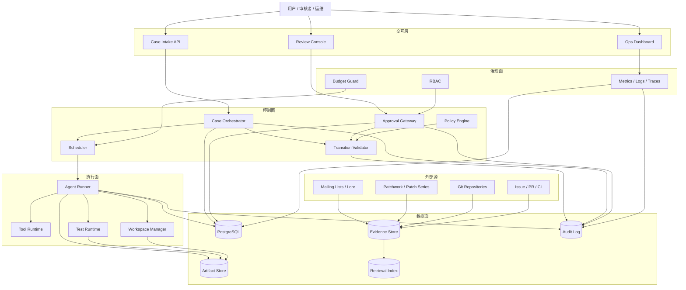
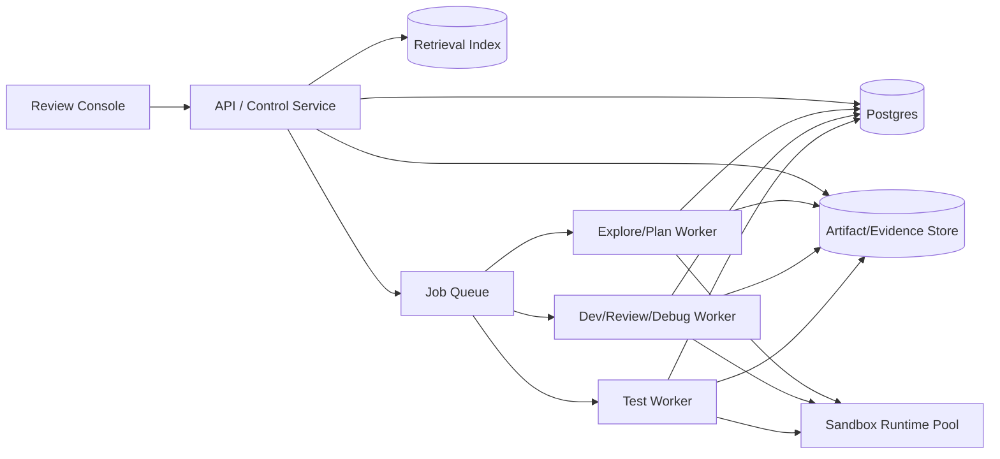
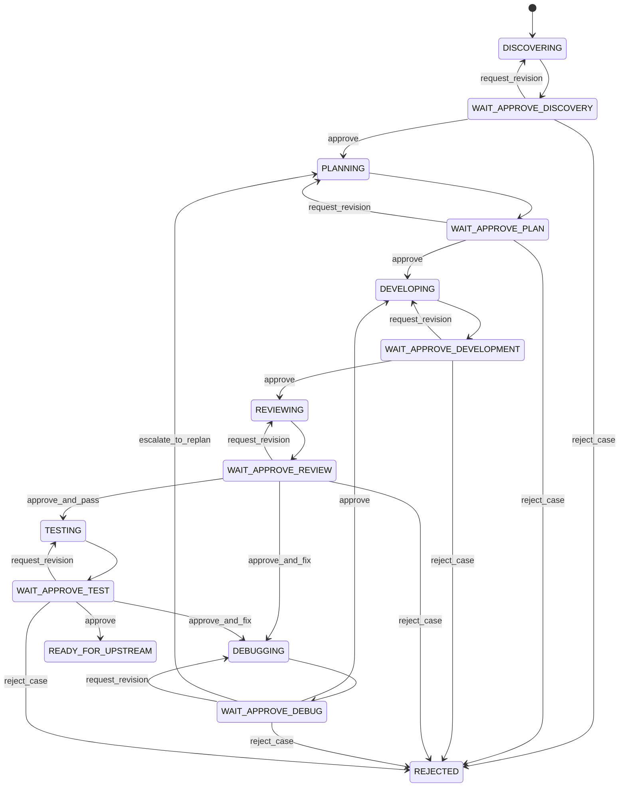
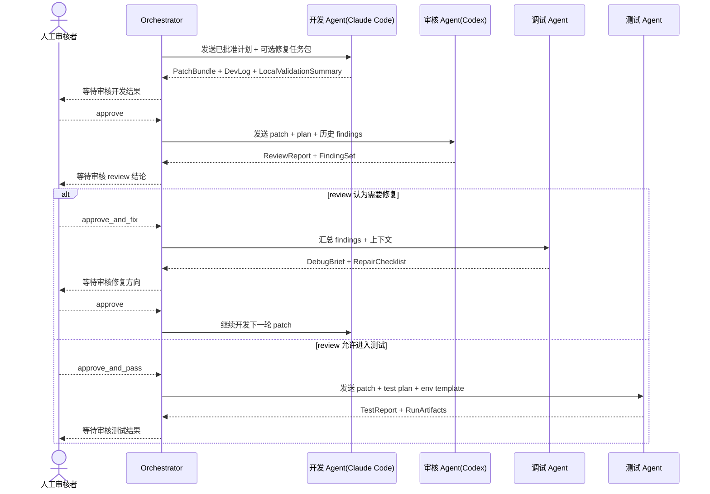

# RV-Insights 多 Agent 开源贡献平台设计方案

## 1. 文档信息

- 项目名称：`RV-Insights`
- 文档类型：平台级详细设计方案
- 文档日期：`2026-04-21`
- 目标领域：RISC-V 开源软件贡献自动化与人机协同
- 目标读者：架构师、平台开发者、Agent 工程师、测试工程师、项目审核者、开源维护者
- 平台定位：面向 RISC-V 开源软件贡献的“强流程、强审计、强人工门控”的多 Agent 工作台

## 2. 背景、问题与目标

RISC-V 相关开源贡献与普通代码生成场景不同。真实贡献机会往往先出现在邮件列表、Patchwork、Issue、CI 失败和仓库变更历史中，而不是直接表现为一条清晰的需求单。与此同时，真实补丁要进入上游，又必须经历问题定位、方案收敛、代码开发、代码审核、测试验证和人工判断等多轮环节。

`RV-Insights` 的目标不是做一个“会写 patch 的单 Agent”，而是做一个可审计、可暂停、可回放、可验证的人机协同贡献平台。平台需要把以下链路产品化：

1. 自动探索 RISC-V 邮件列表、代码仓库和用户输入，发现潜在贡献点。
2. 对贡献点做可行性验证，避免只输出泛泛建议。
3. 输出结构化开发计划和测试计划。
4. 让开发 Agent 与审核 Agent 多轮迭代，直到问题收敛。
5. 搭建测试环境并生成可信测试证据。
6. 在每个阶段结束后停顿，等待人工审批通过后才允许推进。

## 3. 范围、非目标与成功标准

### 3.1 In Scope

- RISC-V 开源项目贡献案例的发现、评估、规划、开发、审核、调试、测试和交付准备
- 邮件列表、Patchwork、仓库、Issue、CI 失败等外部源接入
- 多 Agent 节点编排与案例状态机
- 人工审批门禁、审计链路、证据归档与版本化产物管理
- 独立 worktree、受控工具运行时和 RISC-V 测试模板

### 3.2 Out of Scope

- 无人值守的完全自治贡献
- 自动向上游仓库直接推送最终补丁
- 一次性覆盖全部 RISC-V 生态项目
- 从第一天起支持真实硬件 farm 和大规模多租户平台
- 替代项目维护者的最终合入决策

### 3.3 Success Criteria

- 能从真实外部源和用户输入中发现候选贡献点，并给出结构化可行性报告
- 能跑通单案例完整闭环：`Explore -> Plan -> Develop -> Review -> Debug/Test -> Ready`
- 每个阶段都被人工审批门显式卡住
- 每个阶段的输入、输出、审批、状态迁移和外部证据都可追溯
- 开发、审核、调试、测试闭环可收敛，也可在不收敛时正确升级人工接管

## 4. 设计原则与来自 AGENTS.md 的流程约束

本方案显式吸收用户提供的 `AGENTS.md` 约束，并把它们落成平台级规则，而不是停留在团队约定层。

### 4.1 核心原则

1. 人始终在环：每个阶段完成后必须暂停，等待人工审批。
2. 证据优先：探索、审核、调试、测试必须附带证据和日志。
3. 最小影响：默认只做一个贡献案例的最小必要改动。
4. 可恢复：任意阶段支持暂停、恢复、驳回、重试和回流。
5. 可审计：所有关键动作都落库，形成完整审计链。
6. 可替换：各 Agent 通过适配层接入，避免与单一模型或 CLI 强耦合。

### 4.2 AGENTS.md 约束映射

| AGENTS.md 要求 | 平台设计落点 |
| --- | --- |
| Plan Node Default | `DEVELOPING` 前必须存在已批准 `ExecutionPlan`；偏离计划时必须回 `PLANNING` |
| Subagent Strategy | 在平台内部用多 Agent 节点拆分职责，但每个节点只关注单一方向 |
| Self-Improvement Loop | 平台增加 `Lesson`/`Postmortem` 能力，记录被人工纠正的模式与复盘结论 |
| Verification Before Done | `READY_FOR_UPSTREAM` 必须绑定已批准 `TestReport` 和关闭的阻断 finding |
| Demand Elegance (Balanced) | Review Rubric 强制检查“最小影响”“非 hacky 修复”“是否应回到计划阶段” |
| Autonomous Bug Fixing | Bug 报告可直接进入探索/规划闭环，自动拉起修复流程 |

### 4.3 平台级硬规则

- 没有已批准计划，不允许进入开发阶段。
- 没有已批准上游产物，不允许下游节点消费。
- 偏离计划或出现方案级问题时，不允许继续硬修，必须回规划或人工决策。
- 没有测试证据和人工放行，不允许标记为完成。
- 所有人工纠正必须形成可沉淀的经验项，供后续案例复用。

## 5. 方案比较与推荐路线

### 5.1 方案 A：线性流水线

探索 -> 规划 -> 开发 -> 审核 -> 测试，单次顺序执行。

优点：

- 实现简单
- 适合一次性 Demo

缺点：

- 不支持开发/审核/调试多轮循环
- 不适合强人工门控和版本化产物
- 状态追踪能力弱

### 5.2 方案 B：事件驱动微服务

每个节点都是独立服务，靠事件总线驱动。

优点：

- 解耦强
- 易横向扩展

缺点：

- 初期工程复杂度过高
- 人工审批和有状态回放更复杂
- 容易在平台早期被基础设施拖慢

### 5.3 方案 C：状态机编排 + Agent 适配层 + 统一产物仓

控制平面维护案例状态机，每个节点执行完成后进入等待审批状态；开发、审核、调试、测试构成受约束闭环。

优点：

- 最匹配“每阶段停顿并等待人工批准”的需求
- 自然支持多轮迭代、回退、升级和审计
- 工程复杂度可控，适合 MVP 到 V1 演进

缺点：

- 对状态设计和版本依赖要求较高
- 后续扩展到大规模多案例时需要继续演进执行层

### 5.4 推荐结论

推荐采用方案 C，并明确拆成四个平面：

- 控制面 `Control Plane`
- 执行面 `Execution Plane`
- 数据面 `Data Plane`
- 治理面 `Governance Plane`

## 6. 目标架构与运行拓扑

### 6.1 四平面架构

#### 控制面 `Control Plane`

控制面负责“决定下一步做什么”，不直接执行业务重活。

核心组件：

- `Case Orchestrator`
- `Workflow Policy Engine`
- `Approval Gateway`
- `Scheduler`
- `Transition Validator`

职责：

- 管理案例状态机和状态迁移
- 驱动阶段开始、暂停、恢复、回流、升级
- 校验审批动作、策略阈值和依赖完整性
- 控制重试、超时、并发和预算

#### 执行面 `Execution Plane`

执行面负责真正运行 Agent 和工具。

核心组件：

- `Agent Runner`
- `Tool Runtime`
- `Workspace Manager`
- `Test Runtime`

职责：

- 统一封装 Explore、Plan、Develop、Review、Debug、Test 节点执行
- 受控调用 git、邮件抓取、构建、测试、QEMU、Spike 等工具
- 管理案例 worktree、测试容器、日志采集和运行检查点

#### 数据面 `Data Plane`

数据面负责所有权威状态、产物、证据和检索。

核心存储：

- `Relational DB`
- `Artifact Store`
- `Evidence Store`
- `Retrieval Index`
- `Audit Log`

#### 治理面 `Governance Plane`

治理面负责平台安全、权限、预算、观测和策略。

核心能力：

- `RBAC`
- `Security Policy`
- `Cost Control`
- `Observability`
- `Compliance Guard`

### 6.2 总体架构图



### 6.3 运行拓扑建议

MVP 建议采用“单控制面服务 + 多执行 worker”的拓扑，而不是一开始就重微服务化。



### 6.4 部署边界

- 控制面服务不直接持有 worktree。
- 每个案例 worktree 只挂载给当前活动 worker。
- 测试运行环境与控制面数据库网络隔离。
- 审批动作只能通过控制面写入，worker 无权直接修改状态。
- Agent 原始长输出可存对象存储，但结构化摘要必须回写数据库。

## 7. 案例状态机与生命周期

平台以 `Case` 作为最小执行单元。一个 `Case` 对应一个明确的贡献主题。

### 7.1 状态定义

| 状态 | 含义 | 关键产物 |
| --- | --- | --- |
| `DISCOVERING` | 探索候选贡献点 | `OpportunityReport` |
| `WAIT_APPROVE_DISCOVERY` | 等待人工审核探索结果 | `Approval` |
| `PLANNING` | 生成开发和测试计划 | `ExecutionPlan`, `TestPlan` |
| `WAIT_APPROVE_PLAN` | 等待人工审核计划 | `Approval` |
| `DEVELOPING` | 执行代码开发 | `PatchBundle`, `DevLog` |
| `WAIT_APPROVE_DEVELOPMENT` | 等待人工审核开发结果 | `Approval` |
| `REVIEWING` | 执行代码审核 | `ReviewReport`, `FindingSet` |
| `WAIT_APPROVE_REVIEW` | 等待人工审核 review 结论 | `Approval` |
| `DEBUGGING` | 汇总问题并形成修复任务包 | `DebugBrief`, `RepairChecklist` |
| `WAIT_APPROVE_DEBUG` | 等待人工审核修复方向 | `Approval` |
| `TESTING` | 搭建环境并执行测试 | `TestReport`, `RunArtifacts` |
| `WAIT_APPROVE_TEST` | 等待人工审核测试结论 | `Approval` |
| `READY_FOR_UPSTREAM` | 已具备人工准备上游提交的条件 | Final Bundle |
| `REJECTED` | 被人工终止 | 终态 |
| `FAILED` | 流程异常，需要人工介入 | 终态 |

### 7.2 状态机图



### 7.3 开发-审核-调试-测试时序图



### 7.4 状态迁移前置校验

每次迁移前统一运行 `Transition Validator`，最少检查：

- 当前 `Case.current_state` 与迁移来源状态一致
- 触发迁移的 `Approval` 有效且绑定当前产物版本
- 所有必需上游依赖产物均为已批准状态
- 当前阶段产物已冻结且通过 schema 校验
- 不存在未解决的策略阻断项
- 不存在冲突中的活动 `StageRun`

## 8. Agent 节点契约与跨节点协议

### 8.1 统一执行信封 `Execution Envelope`

所有节点都使用统一的输入信封，而不是直接接收裸 prompt。

建议字段：

- `request_id`
- `case_id`
- `stage`
- `iteration`
- `trigger`
- `goal`
- `constraints`
- `input_artifact_refs`
- `evidence_refs`
- `workspace_ref`
- `policy_snapshot`
- `approval_context`
- `expected_outputs`

示例：

```json
{
  "request_id": "req_dev_001",
  "case_id": "case_riscv_042",
  "stage": "DEVELOPING",
  "iteration": 2,
  "trigger": "approved_debug_brief",
  "goal": "Fix the blocker findings from review iteration 1",
  "constraints": [
    "Only modify files under drivers/firmware/",
    "Do not expand patch beyond approved plan scope"
  ],
  "input_artifact_refs": [
    "execution_plan:v1",
    "repair_checklist:v1",
    "patch_bundle:v1"
  ],
  "evidence_refs": [
    "mail_thread:linux-riscv-20260420-17",
    "review_report:v1"
  ],
  "workspace_ref": "ws_case_riscv_042",
  "expected_outputs": [
    "patch_bundle",
    "dev_log",
    "local_validation_summary"
  ]
}
```

### 8.2 双输出契约 `Dual Output Contract`

每个 Agent 输出必须同时包含两部分：

1. `human_report`
   - 给人工审核者查看的 markdown 报告
2. `machine_payload`
   - 给编排器和下游节点消费的结构化 JSON

平台禁止“只有长文本，没有结构化字段”的产物进入下一阶段。

### 8.3 节点输入输出契约

| 节点 | 最小输入 | 最小输出 | 退出声明 |
| --- | --- | --- | --- |
| Explore | 用户目标、外部源配置、证据快照 | `OpportunityReport` | `ready_for_plan` / `insufficient_evidence` |
| Plan | 已批准机会报告、仓库上下文、约束 | `ExecutionPlan`, `TestPlan` | `ready_for_develop` / `needs_more_input` |
| Develop | 已批准计划、workspace、可选修复任务包 | `PatchBundle`, `DevLog`, `LocalValidationSummary` | `ready_for_review` / `blocked_by_tooling` / `needs_human_decision` |
| Review | 当前 patch、计划约束、历史 findings | `ReviewReport`, `FindingSet` | `pass` / `pass_with_notes` / `needs_fix` / `invalid_review` |
| Debug | review findings、失败日志、当前 patch | `DebugBrief`, `RepairChecklist`, `RegressionTestRecommendations` | `back_to_develop` / `back_to_plan` / `needs_human_decision` |
| Test | patch、test plan、env template | `TestReport`, `RunArtifacts` | `pass` / `pass_with_gaps` / `fail` / `invalid_run` |

### 8.4 跨节点交接规则

- 下游节点只能消费已批准的上游产物版本。
- 每个节点的输入版本集合在执行前冻结。
- 节点重跑时生成新产物版本，不覆盖旧版本。
- 状态迁移只能由 Orchestrator 完成，Agent 不能直接改状态。

### 8.5 Review/Debug/Develop 闭环中的问题单协议

所有 review 或 test 导出的结构化问题都必须拥有稳定的 `finding_id`。

建议字段：

- `finding_id`
- `severity`
- `category`
- `summary`
- `rationale`
- `file_refs`
- `evidence_refs`
- `must_fix_before_test`

Develop 和 Debug 必须显式声明：

- `accepted_findings`
- `resolved_findings`
- `deferred_findings`
- `dismissed_findings`

Develop 不能直接关闭 finding；只有 Review 或 Test 验证通过后才允许将 finding 置为 `resolved`。

## 9. 人工审批、角色权限与审计链路

### 9.1 审批即状态迁移输入

每次人工审批都是正式对象，而不是一条评论。

最小字段：

- `approval_id`
- `case_id`
- `stage`
- `artifact_version`
- `reviewer_id`
- `reviewer_role`
- `action`
- `decision_reason`
- `blocking_comments`
- `required_followups`
- `created_at`
- `policy_snapshot`
- `supersedes_approval_id`

### 9.2 角色模型 `RBAC`

建议最少定义 5 类角色：

- `Platform Admin`
- `Project Reviewer`
- `Execution Operator`
- `Maintainer Proxy`
- `Auditor / Observer`

硬规则：

- 同一用户不能批准自己提交的开发产物。
- `reject_case` 和 `escalate` 必须填写原因。
- `Platform Admin` 默认不参与业务放行，仅在异常时介入。

### 9.3 审批动作语义

- `approve`
- `request_revision`
- `approve_and_fix`
- `approve_and_pass`
- `reject_case`
- `escalate`

### 9.4 分阶段审批矩阵

| 阶段 | 必需审批角色 | 核心判断 |
| --- | --- | --- |
| Explore | `Project Reviewer` | 贡献点是否真实、可行、值得做 |
| Plan | `Project Reviewer` | 方案是否收敛，范围是否可控，测试是否可落地 |
| Development | `Project Reviewer` | 改动是否符合计划，是否具备送审条件 |
| Review | `Project Reviewer` | findings 是否成立，是否允许进入测试或回修 |
| Debug | `Project Reviewer` | 根因分析是否可信，修复方向是否合理 |
| Test | `Project Reviewer` | 测试是否可信，风险是否可接受 |
| Ready for Upstream | `Maintainer Proxy` | 是否达到人工提交上游标准 |

### 9.5 审核台最小视图

审批界面至少展示：

- `Summary`
- `Evidence`
- `Diff / Findings / Test`
- `Decision Panel`

每个阶段都要能看到：

- 当前产物摘要
- 产物版本和依赖版本
- 关键证据快照
- 日志和 diff
- 风险等级
- 可执行审批动作

### 9.6 审计事件模型

关键事件建议包括：

- `CASE_CREATED`
- `STAGE_STARTED`
- `AGENT_RUN_REQUESTED`
- `AGENT_RUN_COMPLETED`
- `ARTIFACT_REGISTERED`
- `APPROVAL_SUBMITTED`
- `STATE_TRANSITIONED`
- `POLICY_BLOCKED`
- `RUN_ESCALATED`
- `CASE_TERMINATED`

所有事件至少包含：

- `event_id`
- `event_type`
- `case_id`
- `actor_type`
- `actor_id`
- `related_stage`
- `related_artifact_version`
- `payload_digest`
- `timestamp`

## 10. 数据模型、版本化与状态约束

### 10.1 建模原则

- `Case` 是唯一业务主键
- `Artifact` 不可原地修改，只能追加版本
- `Approval`、`Finding`、`TestRun`、`StateTransition` 都采用追加式记录
- 当前状态由权威字段保存，但必须可由历史事件回放验证
- 任意阶段都能追溯所依赖的上游版本集合

### 10.2 核心实体

| 实体 | 作用 | 关键字段 |
| --- | --- | --- |
| `Case` | 贡献案例 | `case_id`, `target_project`, `current_state`, `risk_level` |
| `CaseSource` | 记录案例来源 | `source_type`, `source_ref`, `snapshot_ref` |
| `StageRun` | 某阶段的一次执行轮次 | `stage`, `iteration`, `attempt`, `status` |
| `Artifact` | 平台生成的正式产物 | `artifact_type`, `version`, `iteration`, `content_ref` |
| `ArtifactDependency` | 产物依赖关系 | `artifact_id`, `depends_on_artifact_id` |
| `Approval` | 人工审批记录 | `artifact_version`, `action`, `reviewer_role` |
| `Finding` | 审核或测试发现的问题 | `severity`, `status`, `resolved_in_artifact_id` |
| `TestRun` | 一次测试执行 | `patch_artifact_id`, `env_template_id`, `result` |
| `Evidence` | 外部事实证据 | `source_uri`, `snapshot_ref`, `hash` |
| `AgentRun` | 一次 Agent 实际执行 | `model_name`, `input_digest`, `output_digest`, `cost` |
| `StateTransition` | 一次正式状态迁移 | `from_state`, `to_state`, `trigger_ref` |
| `Workspace` | 案例工作区 | `worktree_path`, `base_commit`, `head_commit` |
| `EscalationRecord` | 自动化停止后的人工作业单 | `reason_type`, `required_role`, `status` |
| `Lesson` | 纠正和复盘沉淀 | `lesson_type`, `source_case_id`, `actionable_rule` |

### 10.3 版本与迭代语义

`iteration` 与 `version` 必须分开建模：

- `iteration`
  - 表示业务轮次
  - 例如第 2 次开发/修复轮
- `version`
  - 表示同一轮内的产物修订版
  - 例如 `review_report v2`

规则：

- `request_revision` 且停留在当前阶段时，仅增加 `version`
- 从 Debug 回到 Develop 时，增加 `iteration`
- 从 Test 回到 Debug 时，增加 `iteration`

### 10.4 状态与数据约束

#### Case 级约束

- 一个 `Case` 在任意时刻只能有一个 `current_state`
- 一个 `Case` 在任意时刻只能有一个活动中的 `StageRun`
- 终态进入后默认禁止再开新 `StageRun`

#### Artifact 级约束

- 同一 `case_id + stage + artifact_type + version` 唯一
- 进入审批流的 `Artifact` 必须处于 `frozen`
- 下游只允许消费已批准上游版本

#### Approval 级约束

- 审批必须绑定具体 `artifact_version`
- 审批不能跨多个 artifact
- 审批不允许直接修改产物内容

### 10.5 Patch 谱系

每个 `PatchBundle` 最少关联：

- `workspace_id`
- `base_commit`
- `head_commit`
- `diff_stats`
- `changed_files`
- `patch_ref`
- `related_findings`
- `local_validation_summary`

这样才能正确回答：

- 这版 patch 基于哪个 commit
- 它修复了哪些 finding
- 它对应哪次测试结果

## 11. 开发-审核-调试-测试闭环、退出条件与失败策略

### 11.1 闭环目标

闭环只做三件事：

1. 收敛到足够可信的 patch 版本
2. 以结构化问题单驱动修复，而不是自然语言往返
3. 在预算、轮次和风险边界内决定继续、回流还是停机升级

### 11.2 阶段进入与退出条件

#### Develop

进入条件：

- 存在已批准 `ExecutionPlan`
- 存在有效 `Workspace`
- 若来自 Debug，则存在已批准 `RepairChecklist`
- 无策略阻断项

退出条件：

- 产出 `PatchBundle`, `ChangedFiles`, `CommandSummary`, `LocalValidationSummary`, `OpenRisks`
- 退出声明为 `ready_for_review`、`blocked_by_tooling`、`blocked_by_plan_gap` 或 `needs_human_decision`

#### Review

进入条件：

- 当前 patch 已冻结
- 关联 plan 和修复任务可追溯
- 本地验证摘要存在

退出条件：

- 输出 `pass`、`pass_with_notes`、`needs_fix` 或 `invalid_review`
- 只要存在 `must_fix_before_test = true` 的 open finding，就禁止进入 Test

#### Debug

进入条件：

- 存在已批准 `ReviewReport` 或 `TestReport`
- 存在 open findings 或稳定失败证据

退出条件：

- 产出 `DebugBrief`, `RepairChecklist`, `RegressionTestRecommendations`, `NeedsPlanRevision`
- 若判断根因属于方案错误，则必须回 `PLANNING` 或请求人工决策

#### Test

进入条件：

- 当前 patch 通过 Review 的可测试判定
- 存在已批准 `TestPlan`
- 所有阻断 finding 已关闭或被人工豁免
- patch 与 test plan 的版本绑定已登记

退出条件：

- 输出 `pass`, `pass_with_gaps`, `fail` 或 `invalid_run`
- `pass_with_gaps` 不能直接进入 `READY_FOR_UPSTREAM`，必须人工接受风险

### 11.3 Finding 生命周期

| 状态 | 含义 | 可由谁变更 |
| --- | --- | --- |
| `open` | 新发现问题 | Review/Test |
| `accepted` | 已纳入修复范围 | Debug |
| `in_repair` | 开发处理中 | Develop |
| `resolved_pending_review` | 开发声称已修 | Develop |
| `resolved` | 经 Review/Test 验证关闭 | Review/Test |
| `deferred` | 人工允许延期 | Human |
| `dismissed` | 证据不足或不成立 | Review/Human |

### 11.4 失败分类

- `INPUT_INVALID`
- `POLICY_BLOCKED`
- `TOOL_FAILURE`
- `MODEL_FAILURE`
- `INSUFFICIENT_EVIDENCE`
- `HUMAN_REJECTED`
- `ENVIRONMENT_FAILURE`

### 11.5 默认阈值

- `develop-review-debug` 主闭环最大轮次：`3`
- 同一阶段自动重试次数：`2`
- 同一 finding 最大重复打开次数：`2`
- 单案例总执行时长上限：`6h`
- 单案例正式测试总预算上限：`90 min`
- 单次 patch 文件数阈值：`20`
- 单次 patch diff 行数阈值：`800`

超过阈值时必须生成 `EscalationRecord` 并停止自动推进。

## 12. RISC-V 专项能力设计

### 12.1 源接入与上下文汇聚 `Source Intelligence`

第一批建议接入：

- `linux-riscv` 等邮件列表和 lore 归档
- `Patchwork` / patch series
- `Git Repositories`
  - Linux kernel
  - U-Boot
  - OpenSBI
  - QEMU
- `Issue / PR / CI`
- 用户指定输入

平台需要保留这些上层领域对象：

- `MailThread`
- `PatchSeries`
- `RepoSnapshot`
- `IssueContext`
- `FailureContext`

### 12.2 候选贡献点挖掘流水线

探索阶段建议拆成三步：

1. `Source Scan`
   - 找候选信号，不直接下结论
2. `Opportunity Normalization`
   - 统一成机会对象
3. `Feasibility Verification`
   - 做正式可行性验证

候选机会对象最少字段：

- `opportunity_id`
- `project`
- `component`
- `source_kind`
- `problem_type`
- `problem_summary`
- `evidence_refs`
- `suspected_files`
- `possible_test_paths`
- `freshness_score`
- `estimated_scope`
- `upstream_relevance`

### 12.3 可行性验证清单

最少检查：

- 问题尚未被上游最近 patch 解决
- 目标仓库可拉取
- 相关目录可构建或可做静态分析
- 能定位候选文件
- 能提出至少一个可执行测试路径
- 变更范围在阈值以内
- 不依赖明显缺失的专有硬件资源

建议输出 `FeasibilityScore`，维度包括：

- `reproducibility`
- `code_locality`
- `testability`
- `upstreamability`
- `dependency_complexity`
- `runtime_cost`

### 12.4 上游语境理解 `Upstream Context Understanding`

平台需要理解：

- `PatchSeriesContext`
- `MaintainerPreference`
- `SubsystemContext`
- `RecentChangeContext`

这样 Explore 和 Plan 才能判断：

- 这是新问题还是 follow-up
- 应该做单 patch 还是 patch series
- 必须在哪一层补测试更容易被接受
- 某个目录是否正在重构，不适合插手

### 12.5 RISC-V 工具链与测试模板

建议将环境做成模板库：

- `kernel-basic`
- `opensbi-basic`
- `uboot-basic`
- `toolchain-basic`

模板字段建议：

- `env_template_id`
- 工具链版本
- 依赖镜像
- 默认命令
- 超时设置
- 日志采集路径
- 产物目录结构

### 12.6 仿真测试分级策略

| 级别 | 目标 | 典型内容 |
| --- | --- | --- |
| `Level 0` | 静态验证 | 编译、lint、格式检查 |
| `Level 1` | 最小功能验证 | 单 testcase、小范围模块测试、早期日志检查 |
| `Level 2` | 仿真运行验证 | QEMU/Spike 启动和基础回归 |
| `Level 3` | 扩展回归 | 多配置、多工具链、长时运行 |

MVP 默认以 `Level 0` 到 `Level 2` 为主。

### 12.7 优先支持的贡献类型

推荐优先：

- 小型 bugfix
- 回归修复
- 缺失测试补全
- 构建修复
- review follow-up 小补丁
- 文档/注释同步修复

暂不优先：

- 大特性
- 跨多个子系统的重构
- 强硬件依赖问题
- 大规模性能优化

## 13. 非功能设计

### 13.1 安全隔离

信任边界：

- 控制面
- 执行面
- 工作区/测试沙箱
- 外部源

硬规则：

- 每个案例使用独立 `Workspace`
- 高风险阶段在独立容器或受限环境运行
- 默认只读挂载源镜像，worktree 为独立副本
- 控制面永不直接挂载工作区
- 测试环境与控制面数据库网络隔离

### 13.2 工具白名单

允许：

- `git clone/fetch/show/diff/worktree`
- 注册过的构建命令模板
- 注册过的测试命令模板
- 日志采集
- QEMU / Spike 启停

默认禁止：

- 任意网络上传
- 任意包管理安装
- 写宿主机敏感路径
- 修改控制面配置

### 13.3 可观测性

建议同时建设：

- `Structured Logs`
- `Metrics`
- `Traces`

核心指标：

- 案例通过率
- 各阶段耗时
- review/debug 循环次数
- 测试通过率
- 人工驳回率
- 每节点 token/成本
- 队列长度和 worker 利用率

### 13.4 成本控制

每个 `Case` 创建时绑定预算：

- 最大 token 数
- 最大模型成本
- 最大测试时长
- 最大 CPU/内存消耗
- 最大迭代次数

超限动作：

- 降级模型
- 缩减检索范围
- 限制测试等级
- 强制人工审批后继续
- 直接暂停案例

### 13.5 容量规划

建议分 3 类 worker：

- `light workers`
- `dev workers`
- `test workers`

平台级背压策略：

- 限制高成本阶段并发
- 优先接近完成的案例
- 延迟低优先级 Explore 扫描
- 对同一项目设置并发上限

### 13.6 可靠性与恢复

平台关键动作必须具备：

- 幂等键
- 案例级租约
- Worker 心跳
- 检查点
- 僵尸任务回收

最小恢复目标：

- 数据库可恢复
- 对象存储可恢复
- 检索索引可重建
- worktree 与容器可重建
- 状态机历史不可丢失

## 14. 分阶段落地路线

### 14.1 MVP 目标

MVP 只做一件事：跑通一个可审计、有人在环的 RISC-V 贡献闭环。

MVP 范围：

- 支持 `OpenSBI`、`U-Boot`、局部 Linux RISC-V 子目录中的少量案例
- 只支持小型 bugfix、构建修复、测试缺口补全、review follow-up
- 单机部署
- 单案例串行执行
- 最小审批控制台
- 至少一个 RISC-V 测试模板

### 14.2 V1 目标

- 多案例并发处理
- 更完整的审批台和预算治理
- 更多项目模板和源接入
- 历史案例复用和相似案例检索

### 14.3 V2 目标

- 更强的 Patchwork / lore / CI 关联分析
- 更多测试模板矩阵
- 更成熟的模型路由和成本优化
- 更强的上游语境建模和运营看板

### 14.4 建议里程碑

1. 案例、状态机和产物骨架
2. 审批与审计链路
3. Explore/Plan 节点打通
4. Develop/Review/Debug 基础闭环
5. RISC-V Test Runtime 与模板
6. 端到端真实案例演示
7. 多案例并发与预算治理
8. 运营与复盘能力

## 15. 推荐目录结构

```text
RV-Insights/
  docs/
    plans/
      2026-04-21-rv-insights-platform-design.md
  tasks/
    todo.md
    lessons.md
  backend/
    orchestrator/
    policies/
    approvals/
    agents/
    connectors/
    schemas/
    storage/
    observability/
  frontend/
    review-console/
  runtimes/
    templates/
    toolchains/
    scripts/
  cases/
    artifacts/
    evidence/
    logs/
```

## 16. 结论

`RV-Insights` 最合适的起点不是“一个能写代码的大模型”，而是一个围绕 `Case` 状态机组织的、多 Agent、强审批、强证据、强测试的平台。

这份设计把系统收敛到几个关键点：

1. 用状态机和审批门把人固定在关键决策点。
2. 用结构化产物和稳定的 `finding_id` 闭环约束开发/审核/调试。
3. 用外部证据、版本化产物和审计事件保证可追溯。
4. 用 RISC-V 专项源接入、工具链模板和仿真分级让平台真正懂领域场景。
5. 用预算、隔离、背压和恢复策略把平台做成可运行、可运维、可扩展的系统。

在此基础上，下一步最合理的动作不是继续扩写概念，而是按 MVP 范围拆成实施计划并逐步落地。
