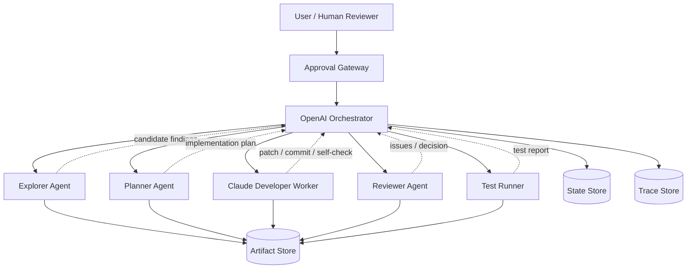
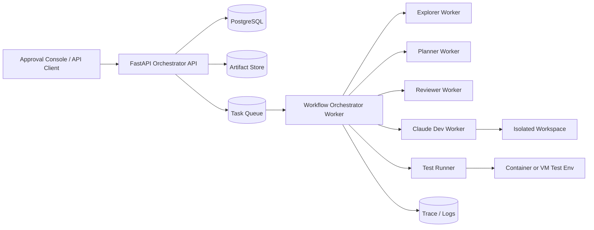
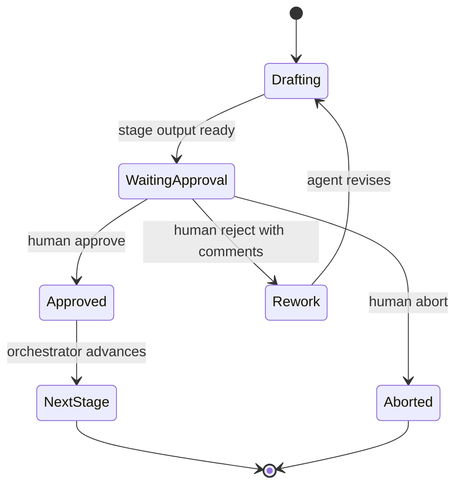
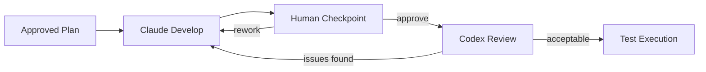
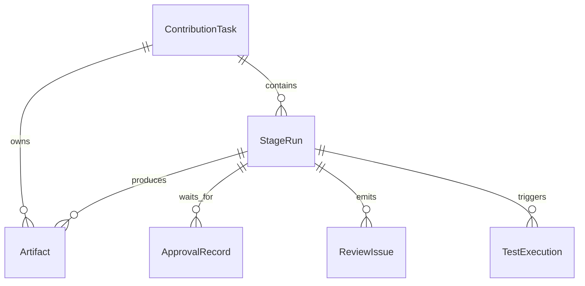
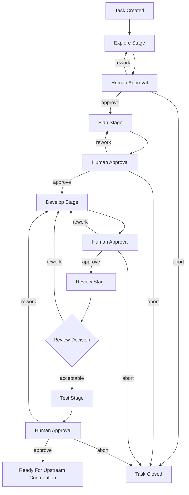
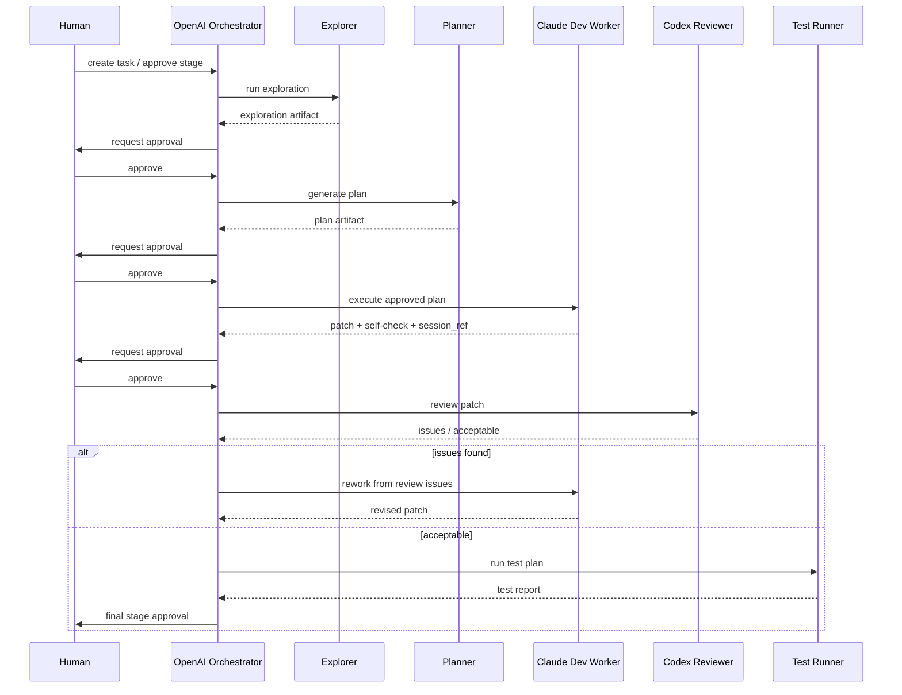

# RV-Insights Project Design

## 1. Overview

`RV-Insights` is a large-model-driven multi-agent open source contribution platform for RISC-V software ecosystems.
Its target workflow is:

1. Explore candidate contribution opportunities from RISC-V mailing lists, repositories, and user hints.
2. Plan an implementation and validation strategy.
3. Develop the change in a controlled coding runtime.
4. Review the code and iterate with the developer agent until acceptable.
5. Execute tests, collect evidence, and prepare output for upstream contribution.

The key platform constraint is governance:

- Every major stage must pause for human approval before the next stage can run.
- Development and review must support multiple rounds of iteration.
- The system must be resumable after long pauses, worker failures, and manual rework decisions.

This makes `RV-Insights` primarily a workflow orchestration system with specialized execution nodes, not just a single coding agent.

## 2. Design Goals

### 2.1 Primary goals

- Build a stage-based contribution workflow for RISC-V open source projects.
- Separate orchestration, coding, review, and test responsibilities cleanly.
- Make every stage auditable, resumable, and human-governed.
- Preserve enough structure so agent outputs can be validated, persisted, and replayed.

### 2.2 Non-goals for MVP

- Fully autonomous upstream submission without human approval.
- Broad support for every RISC-V repository from day one.
- Multi-tenant enterprise RBAC, quota control, or billing in the first milestone.
- Realtime collaboration or browser-side agent execution in the MVP.

### 2.3 MVP assumptions

The first shippable version should assume:

- one active repository target per contribution task
- one orchestrator service as the workflow source of truth
- one primary human approver role, even if multiple viewers exist
- one development runtime instance per active development stage
- at least one reproducible test path exists for the chosen contribution candidate
- final upstream submission is still human-driven, even if the platform prepares the patch package

These assumptions keep the MVP narrow enough to validate the workflow before scaling to many repositories, concurrent review teams, or fully automated submission.

### 2.4 Design principles

- `Artifact-first`: every meaningful stage output becomes a durable artifact before the workflow advances.
- `Stage determinism`: the same approved input set should produce the same stage semantics, even if the underlying model text varies.
- `Human authority over agent autonomy`: agents propose and execute; humans authorize transitions.
- `Small trusted write surface`: only the development and test runtimes may modify the workspace or environment.
- `Replaceable execution nodes`: every node should sit behind a stable contract so providers can be swapped later.
- `Policy before prompt`: safety, approval, and isolation rules should be enforced in runtime policy, not only in natural-language instructions.

## 3. Why Combine OpenAI Agents SDK and Claude Agent SDK

### 3.1 Short answer

Yes, the two SDKs can be combined, and this design should combine them.

Recommended split:

- `OpenAI Agents SDK`: upper-layer orchestration, stage transitions, approvals, review, tracing, and resumable workflow state.
- `Claude Agent SDK`: development execution node with repo-local context, file operations, shell execution, session continuation, and tool permissions.

### 3.2 Why OpenAI Agents SDK owns orchestration

`RV-Insights` needs strong support for:

- agent handoffs
- structured human approval pauses
- long-running resumable workflows
- stage-level tracing and auditability

This aligns well with OpenAI Agents SDK capabilities:

- agents + handoffs as first-class orchestration primitives
- built-in human-in-the-loop support with durable `RunState`
- tracing for tool calls, handoffs, guardrails, and custom events

### 3.3 Why Claude Agent SDK owns development execution

The development node must operate as a controlled coding runtime:

- persistent coding sessions
- file and shell tools
- permission modes
- plugin, skill, and subagent integration
- efficient repo-scoped work rather than global workflow control

This aligns with Claude Agent SDK capabilities:

- persistent sessions that keep prior tool calls and reasoning context
- permission controls for file edits and command execution
- plugin loading for hooks, skills, agents, and MCP servers
- subagents for isolated specialist work

### 3.4 Why not use a single SDK everywhere

#### Option A: OpenAI-only

Pros:

- simpler top-level stack
- strong orchestration primitives

Cons:

- the coding runtime must be built mostly by hand
- weaker fit for a persistent repo-native development node

#### Option B: Claude-only

Pros:

- excellent coding runtime and repo interaction
- strong context and permission controls

Cons:

- less natural as the single top-level orchestrator for a multi-stage, approval-heavy platform
- stage pause/resume and cross-node orchestration require more custom infrastructure

#### Recommended: mixed architecture

Pros:

- OpenAI handles workflow control
- Claude handles repo-local code execution
- node responsibilities stay clear
- the platform can replace either lower-level node later without rewriting the whole orchestration layer

### 3.5 Provider-specific implementation notes

The SDK split should be reflected in runtime design, not just in architecture diagrams.

#### OpenAI orchestration runtime

The orchestrator should use OpenAI Agents SDK features in a constrained way:

- use `Agent`, tools, and handoffs as orchestration primitives inside a stage
- use `RunState` serialization for all approval pauses and long waits
- use input and output guardrails to validate stage inputs and final stage outputs
- use tracing as the main execution telemetry stream

For `RV-Insights`, guardrails should primarily protect:

- malformed stage input contracts
- unsafe stage promotion decisions
- missing required fields in stage outputs
- policy violations before a workflow advances

Blocking guardrails are preferable on sensitive operations because OpenAI documents that blocking mode prevents agent execution and tool side effects before a tripwire fires, which is better for cost control and safer stage promotion.

#### Claude development runtime

The development node should prefer a persistent multi-turn session model, not isolated one-shot calls. Claude's Python SDK distinguishes `query()` for one-off sessions from `ClaudeSDKClient` for continuing the same session context. Because development and rework are inherently iterative, the development worker should use the persistent client path.

Permission policy should be phase-specific:

- `plan` mode for dry-run reasoning or diff-free review of the repository
- `acceptEdits` for controlled code changes in an isolated workspace
- `dontAsk` with narrow allowlists for headless read-only subtasks
- never use `bypassPermissions` on shared or persistent environments

Claude hooks should be used as runtime policy, not as afterthoughts:

- `PreToolUse` for shell policy checks and path restrictions
- `PostToolUse` or `PostToolUseFailure` for audit and failure capture
- `Stop` or `SubagentStop` hooks for completion verification before yielding a result

Claude plugins and MCP should be treated as extension points for repository-specific capabilities such as:

- maintainer metadata lookup
- mailing list archive retrieval
- test lab reservation
- issue tracker lookup

## 4. Architecture Summary

The platform should use a single orchestrator as the source of truth, with specialized execution nodes around it.



### 4.1 Deployment topology

For the MVP, the logical deployment should look like this:



This keeps three concerns separate:

- synchronous API handling
- asynchronous workflow execution
- isolated execution environments for development and testing

### 4.2 Trust boundaries

The platform has four main trust zones:

- `Control plane`: orchestrator API, approval gateway, database
- `Read-heavy agent plane`: explorer, planner, reviewer
- `Write-capable development plane`: Claude development workspace
- `Execution plane`: test runner, containers, emulators, and optional hardware labs

The control plane should never share mutable workspace state with the execution planes. It should only hold references, metadata, and policies.

### 4.3 Source-of-truth rule

The database-backed workflow state is the only authoritative state for:

- current stage
- current attempt
- approval status
- active workspace reference
- latest accepted artifact versions

Agent sessions, queue messages, and in-memory worker state are caches or execution aids, never the final truth.

## 5. Layered System Design

### 5.1 Orchestration layer

Backed by `OpenAI Agents SDK`.

Responsibilities:

- create and progress contribution tasks
- dispatch stages to the correct node
- enforce approval gates
- persist workflow state
- route review findings back into development
- drive retries and rework transitions
- record tracing and audit metadata

### 5.2 Execution layer

Contains the specialized nodes:

- `Explorer Agent`
- `Planner Agent`
- `Claude Developer Worker`
- `Reviewer Agent`
- `Test Runner`

Each node produces structured artifacts. No node is allowed to advance the workflow directly; only the orchestrator can do that.

### 5.3 Governance layer

Centered on the `Approval Gateway`.

Responsibilities:

- pause after every major stage
- capture human decisions
- normalize approval feedback into structured records
- resume the workflow from the last approved stage

### 5.4 Persistence layer

Contains:

- `PostgreSQL`: task state, stage runs, approval records, artifact metadata
- `Artifact Store`: markdown, JSON, diff, logs, reports
- `Trace Store`: workflow traces and execution logs

### 5.5 Adapter layer

The platform should include an explicit adapter layer between core workflow code and provider SDKs.

Responsibilities:

- translate platform contracts into provider-specific requests
- normalize provider-specific outputs into platform schemas
- isolate provider upgrades and breaking API changes
- centralize retry, timeout, and logging behavior per provider

Without this layer, model-provider concerns leak into orchestration logic and make future replacement expensive.

### 5.6 Evaluation and policy layer

Between execution and stage promotion, the platform should run a policy and evaluation layer.

Responsibilities:

- validate schema conformance
- enforce stage entry and exit invariants
- apply budget and timeout checks
- run lightweight quality heuristics
- block invalid promotions before human approval is even requested

This layer should combine:

- OpenAI guardrails for orchestrated stage outputs
- Pydantic or schema validation for artifact payloads
- Claude permission modes and hooks for development safety

## 6. Node Responsibilities

### 6.1 Explorer

Purpose:

- find potential RISC-V contribution points
- validate feasibility before planning starts

Inputs:

- user brief
- repo scope
- mailing list scope
- historical lookback window
- optional user hints

Outputs:

- candidate contribution list
- evidence links
- feasibility score
- blockers and risks
- one recommended candidate for planning

The explorer should not write implementation details.

#### Explorer source adapters

The explorer should not directly scrape arbitrary web pages in an unstructured way. It should use source-specific adapters such as:

- mailing list archive adapter
- git log and blame adapter
- issue or PR tracker adapter
- repository structure and ownership adapter
- user-provided hint adapter

#### RISC-V contribution signal sources

For RISC-V-focused projects, the explorer should prioritize signals that most often indicate actionable contribution opportunities:

- recent mailing list threads discussing regressions, review feedback, or unanswered fixes
- patch series that stalled or were partially merged
- repository paths with recent churn in RISC-V-specific code
- maintainer and ownership metadata such as `MAINTAINERS`, code owners, or subsystem docs
- failing or flaky test reports tied to RISC-V build or runtime paths
- user-provided links to issue threads, patches, or commits

Signals should not be treated equally. A candidate backed by both public discussion and concrete code evidence is stronger than one backed only by a vague issue description.

Each adapter should normalize metadata into a common evidence shape:

- `source_type`
- `canonical_uri`
- `title`
- `timestamp`
- `author`
- `excerpt`
- `confidence`

#### Explorer feasibility rubric

Each candidate should be scored against a stable rubric so the human reviewer can understand why the agent recommended it.

Suggested score dimensions:

- `relevance` to RISC-V and selected repository
- `bounded_scope` of the likely fix
- `reproducibility` of the issue or gap
- `upstreamability` based on maintainership and likely acceptance
- `verifiability` through available tests or a clear validation path

Suggested weighting:

- `relevance`: 0.20
- `bounded_scope`: 0.20
- `reproducibility`: 0.25
- `upstreamability`: 0.15
- `verifiability`: 0.20

Suggested thresholds:

- `>= 0.75`: recommended for planning
- `0.60 - 0.74`: human review required before planning
- `< 0.60`: keep as background candidate, do not advance

#### Explorer exit criteria

The explorer stage should not request approval until all of the following are true:

- at least one candidate has a canonical evidence chain
- the recommended candidate has a feasibility score and explicit blockers
- the system can explain why the candidate is worth doing now
- obvious duplicates or stale issues have been filtered out
- the output identifies what still needs human judgment

### 6.2 Planner

Purpose:

- convert an approved candidate into an implementation plan and test plan

Outputs:

- target file map
- change steps
- test environment requirements
- test commands
- expected outputs
- rollback strategy
- risks and non-goals

The planner should not write or edit code.

#### Planner entry criteria

The planner stage should only start when:

- the selected contribution candidate has been human-approved
- the evidence chain is stored as artifacts
- the repository target and branch context are pinned
- scope constraints and acceptance criteria are explicit

#### Planner quality rubric

The planner output should be reviewed against these questions:

- Is the scope small enough for one contribution cycle?
- Does the plan separate required work from non-goals?
- Are tests tied to concrete commands and environments?
- Does the plan explain rollback or fallback behavior?
- Are unknowns clearly exposed instead of hidden in vague language?

The planner should prefer narrower, evidence-backed plans over ambitious plans with weak validation.

### 6.3 Developer

Backed by `Claude Agent SDK`.

Purpose:

- execute the approved plan inside a controlled repo workspace

Outputs:

- branch or workspace reference
- patch artifact
- commit reference
- self-check commands and results
- known limitations

The developer node does not define product scope; it consumes approved plan inputs plus review feedback.

#### Developer workspace lifecycle

The development worker should manage a workspace as a first-class object:

1. materialize repo snapshot or worktree
2. pin branch and base commit
3. restore the Claude session if this is a rework round
4. apply the approved plan and unresolved review issues
5. run self-check commands
6. emit patch, logs, and workspace metadata
7. freeze the workspace until the next decision

This avoids hidden mutation between iterations and makes review reproducible.

Important runtime note:

- Claude sessions preserve conversation history and tool history
- Claude sessions do not preserve filesystem state by themselves
- workspace snapshotting or worktree persistence must therefore be managed separately from session persistence
- checkpointing is helpful for session-local undo, but it does not replace Git history and does not track arbitrary bash-side filesystem mutations

#### Developer execution policy

The developer worker should follow these constraints:

- no scope expansion outside the approved plan
- no silent dependency upgrades unless explicitly approved
- no unrelated refactors
- every code change must be traceable to either the approved plan or a review issue
- every self-check command must be captured as an artifact

#### Developer artifact bundle

Each development result should include:

- unified diff
- changed file list
- head commit hash
- workspace reference
- self-check logs
- concise rationale for each non-trivial change

### 6.4 Reviewer

Backed by `OpenAI/Codex`.

Purpose:

- perform code review on the patch
- produce structured findings
- decide whether the implementation should return to development or move to testing

Outputs:

- `decision = rework | acceptable`
- issue list with severity, file, line, impact, and suggested fix

The reviewer does not edit code directly.

#### Reviewer checklist

The reviewer should examine the change across five dimensions:

- correctness
- regression risk
- test adequacy
- maintainability and upstream fit
- safety and permission compliance

#### Reviewer severity policy

Suggested severity semantics:

- `high`: correctness, crash, data corruption, or clear upstream rejection risk
- `medium`: likely bug, weak test coverage, or maintainability problem that should block acceptance
- `low`: style, naming, or minor documentation concern

Suggested promotion rule:

- no unresolved `high`
- no unresolved `medium` unless explicitly waived by human review
- `low` may pass with annotation if the human approver accepts the tradeoff

#### Reviewer stop conditions

The reviewer should escalate back to planning rather than development if:

- the implementation fundamentally contradicts the approved plan
- the test plan is insufficient for the change class
- repeated review rounds show the task was under-specified

### 6.5 Test Runner

Purpose:

- execute the approved test plan in a reproducible environment

Outputs:

- test execution metadata
- command results
- logs
- final result: `pass | fail | inconclusive`

The test node validates the implementation but does not decide scope.

#### Test verification tiers

The platform should structure tests in tiers so the MVP can start narrow and expand later:

- `Tier 0`: lint, formatting, metadata, or schema validation
- `Tier 1`: targeted build or unit tests
- `Tier 2`: QEMU or emulator-backed integration tests
- `Tier 3`: optional hardware-backed validation

The planner should map every contribution to the minimum required tier set.

#### Test environment manifest

Every test run should record:

- container image or VM image digest
- compiler and toolchain version
- emulator version
- repository commit under test
- test script version
- relevant environment variables

Without this, a passing test run is not reproducible enough to trust.

#### Test exit criteria

The test stage should not request approval until:

- all mandatory tests have terminal results
- all logs are stored as artifacts
- failures are classified as blocking or non-blocking
- inconclusive cases explain what evidence is still missing

## 7. Human Approval Model

Every major stage must stop and wait for human review.



### 7.1 Approval rules

- each stage output must be materialized as an artifact before approval is requested
- `rework` must include structured `must_fix` feedback
- `abort` must include a reason
- only the orchestrator can transition a task out of `WaitingApproval`

### 7.2 Why this matters

The approval model is required to support:

- days-long pauses
- auditable governance
- deterministic resume behavior
- explicit separation between human authorization and agent execution

### 7.3 Approval UI and workflow requirements

The approval experience should present the same core information for every stage:

- stage summary
- key artifacts
- blocking risks
- open questions
- recommended next action from the platform
- explicit decision buttons for `approve`, `rework`, and `abort`

For `rework`, the UI should require:

- at least one `must_fix` item
- optional note categories such as scope, safety, quality, or missing evidence

For development and review stages, the UI should also show:

- changed files
- diff summary
- self-check result summary
- outstanding review issues by severity

### 7.4 Concurrency and idempotency rules

Governance state must be protected against duplicate or stale actions.

Rules:

- only one active approval request per `stage_run_id`
- every approval action must include the expected `stage_run_id` and `attempt`
- stale approvals must be rejected if the stage has already advanced
- approval endpoints should support idempotency keys

These rules prevent race conditions such as "approve old output after rework already started."

## 8. Development and Review Iteration Loop

The developer and reviewer form a controlled sub-loop inside the wider workflow.



### 8.1 Development round requirements

Each development round must output:

- patch summary
- diff or commit reference
- self-check commands
- self-check results
- known unresolved risks

### 8.2 Review round requirements

Each review round must output:

- issue severity
- file and line reference
- defect description
- impact
- suggested fix
- final decision

Only an `acceptable` review can advance the task to the test stage.

### 8.3 Iteration budget and escalation

The platform should not allow silent infinite loops between development and review.

Suggested operational rules:

- default soft limit: `3` development-review rounds
- default hard limit: `5` rounds before human escalation
- repeated high-severity findings of the same class should reopen planning
- repeated test failures without code defects should reopen test planning or environment review

The purpose is not to force premature acceptance; it is to detect when the workflow is hiding a planning error.

## 9. Core Domain Model

The platform should persist six primary entities:

- `ContributionTask`
- `StageRun`
- `ApprovalRecord`
- `Artifact`
- `ReviewIssue`
- `TestExecution`



### 9.1 ContributionTask

Top-level aggregate for one contribution effort.

Suggested fields:

```json
{
  "task_id": "rv-task-20260422-001",
  "title": "Investigate and contribute a RISC-V Linux scheduler fix",
  "source_type": "user_input|mailing_list|repo_issue|hybrid",
  "repo_targets": ["linux", "qemu", "u-boot"],
  "current_stage": "explore|plan|develop|review|test|done|aborted",
  "status": "drafting|waiting_approval|approved|rework|running|failed|completed|aborted",
  "objective": "One-sentence task goal",
  "constraints": ["Must preserve upstream coding style"],
  "acceptance_criteria": ["Patch compiles", "Relevant tests pass"],
  "active_stage_run_id": "stage-plan-003",
  "iteration_count": 2
}
```

### 9.2 StageRun

Represents one attempt of one stage.

```json
{
  "stage_run_id": "stage-review-004",
  "task_id": "rv-task-20260422-001",
  "stage": "review",
  "attempt": 2,
  "status": "running|waiting_approval|approved|rework|failed|completed",
  "input_artifact_ids": ["artifact-dev-patch-v2", "artifact-plan-v1"],
  "output_artifact_ids": ["artifact-review-v2"],
  "agent_runtime": "openai_agents_sdk|claude_agent_sdk|test_runner",
  "session_ref": {
    "provider": "openai|claude",
    "session_id": "sess_xxx"
  }
}
```

### 9.3 ApprovalRecord

Represents human governance feedback.

```json
{
  "approval_id": "approval-009",
  "task_id": "rv-task-20260422-001",
  "stage_run_id": "stage-plan-003",
  "decision": "approve|rework|abort",
  "reviewer": "human_user_id",
  "reason_type": "missing_info|wrong_scope|unsafe|low_quality|blocked",
  "must_fix": ["Clarify kernel version scope"],
  "optional_notes": ["Prefer upstream-first wording"]
}
```

### 9.4 Artifact

Represents durable stage output.

```json
{
  "artifact_id": "artifact-plan-v1",
  "task_id": "rv-task-20260422-001",
  "stage_run_id": "stage-plan-003",
  "artifact_type": "exploration_report|implementation_plan|patch_bundle|review_report|test_report",
  "version": 1,
  "format": "json|md|diff|log",
  "storage_uri": "s3://rv-insights/artifacts/... or local path",
  "summary": "High-level summary"
}
```

### 9.5 Data model rules

- each `rework` generates a new `StageRun`
- old attempts are never overwritten
- metadata lives in the database
- large payloads live in artifact storage
- natural-language responses cannot advance the workflow until converted into structured artifacts

### 9.6 Recommended supporting entities

The MVP can start with six core entities, but the design should leave room for supporting entities:

- `CandidateRecord`: normalized candidate produced by the explorer
- `EvidenceRecord`: source-backed evidence items and provenance
- `WorkspaceLease`: active development workspace ownership and expiration
- `EnvironmentSnapshot`: immutable test environment fingerprint
- `PolicyDecision`: automated policy or guardrail outcomes attached to a stage

Adding these later should not require rewriting the existing core entities.

## 10. Stage Contracts

### 10.0 Shared artifact envelope

Every stage artifact should use a common envelope around its stage-specific payload.

```json
{
  "schema_version": "1.0",
  "task_id": "rv-task-20260422-001",
  "stage": "plan",
  "stage_run_id": "stage-plan-003",
  "summary": "High-level stage summary",
  "confidence": 0.84,
  "blocking_items": [],
  "open_questions": [],
  "recommended_next_action": "approve|rework|abort",
  "payload": {}
}
```

This shared wrapper gives the approval layer and audit tooling a uniform structure across all stage types.

### 10.1 Explore contract

Input:

```json
{
  "task_brief": "User goal or platform trigger",
  "repo_scope": ["linux", "qemu"],
  "search_scope": {
    "mailing_lists": ["linux-riscv", "qemu-devel"],
    "repos": ["git://..."],
    "lookback_days": 90
  },
  "constraints": ["Prefer beginner-friendly contribution"],
  "user_hints": ["Focus on riscv timer issues"]
}
```

Output:

```json
{
  "recommended_candidate": {
    "candidate_id": "cand-01",
    "title": "Fix RISC-V timer regression in component X",
    "evidence": ["mailing_list_thread_url", "issue_url", "code_reference"],
    "feasibility_score": 0.81,
    "why_now": "Recent regression with clear reproduction path",
    "blocking_risks": ["Needs maintainer confirmation on scope"]
  },
  "alternatives": []
}
```

### 10.2 Plan contract

Input:

- approved exploration artifact
- repo metadata
- constraints and acceptance criteria
- optional human comments

Output:

```json
{
  "implementation_plan": {
    "target_files": ["arch/riscv/..."],
    "change_steps": [
      "Add failing test or reproduction",
      "Implement minimal fix",
      "Run targeted verification"
    ],
    "non_goals": ["No unrelated refactor"]
  },
  "test_plan": {
    "env_requirements": ["qemu", "cross-compiler"],
    "test_commands": ["make ...", "./run-test.sh"],
    "expected_results": ["No regression", "Target case passes"]
  },
  "risks": ["May depend on upstream branch drift"]
}
```

### 10.3 Develop contract

Input:

- approved plan
- current repo snapshot
- unresolved review issues
- execution constraints

Output:

```json
{
  "code_result": {
    "branch": "rv/task-001-dev-r2",
    "commit": "abc1234",
    "diff_artifact_id": "artifact-dev-patch-v2"
  },
  "self_check": {
    "commands": ["pytest ...", "make ..."],
    "results": ["pass", "pass"]
  },
  "known_limitations": ["Did not test on real hardware"]
}
```

### 10.4 Review contract

Input:

- approved plan
- patch artifact
- code context
- historical review issue status

Output:

```json
{
  "decision": "rework|acceptable",
  "issues": [
    {
      "issue_id": "rev-01",
      "severity": "high|medium|low",
      "file": "arch/riscv/foo.c",
      "line": 128,
      "problem": "Possible null dereference",
      "impact": "Kernel crash under edge case",
      "suggested_fix": "Guard pointer before access"
    }
  ],
  "summary": "Implementation is close but needs one correctness fix"
}
```

### 10.5 Test contract

Input:

- approved test plan
- code result
- environment definition
- optional human-added verification items

Output:

```json
{
  "test_execution_id": "test-003",
  "environment": {
    "runner_type": "container|vm|baremetal",
    "image": "riscv-test:latest"
  },
  "executions": [
    {
      "command": "make ARCH=riscv ...",
      "status": "passed",
      "log_artifact_id": "artifact-log-1"
    }
  ],
  "final_result": "pass|fail|inconclusive",
  "blocking_failures": []
}
```

### 10.6 Failure artifact contract

Failures should also be first-class artifacts.

```json
{
  "schema_version": "1.0",
  "task_id": "rv-task-20260422-001",
  "stage": "develop",
  "stage_run_id": "stage-develop-005",
  "failure_type": "transient|deterministic|governance",
  "failure_reason": "Command timed out after 30 minutes",
  "retry_recommended": true,
  "logs": ["artifact-log-timeout-01"],
  "next_suggested_action": "retry|rework|abort"
}
```

Without structured failure artifacts, operational recovery becomes guesswork.

### 10.7 Prompt and context packaging rules

To avoid context drift and unnecessary token cost, each node should receive only the minimal context needed to do its job.

Recommended packaging rules:

- explorer gets normalized source evidence and user hints, not raw repository blobs
- planner gets approved candidate artifacts, repository metadata, and constraints
- developer gets approved plan, unresolved review issues, repo snapshot reference, and only the relevant changed-file context
- reviewer gets approved plan, patch artifact, self-check results, and selected code context
- test runner gets approved test plan, code result, and environment manifest

Additional rules:

- prompts must be versioned and stored alongside the platform
- artifacts should be summarized before being inlined into prompts
- raw logs and long diffs should be referenced by artifact ID unless the full text is required
- every stage request should carry the prompt version and artifact versions it used

## 11. End-to-End Workflow

The platform should be event-driven rather than a single synchronous chain.



## 12. SDK Interaction Boundary

Only the orchestrator owns the global workflow truth.



### 12.1 Boundary rules

- the orchestrator does not keep full repo-local coding context
- the developer worker does not advance workflow stages
- reviewers report only to the orchestrator
- all cross-node exchange goes through artifacts and stage records

### 12.2 When to use handoffs versus platform state transitions

OpenAI Agents SDK supports handoffs, but `RV-Insights` should use them carefully.

Recommended rule:

- use `handoffs` inside a bounded stage if one agent needs another specialist to finish that same stage output
- use platform state transitions, not free-form handoffs, when moving between major workflow stages

Example:

- acceptable: explorer agent hands off to a source-normalization helper inside the `explore` stage
- not acceptable: planner agent autonomously hands off to developer and advances the task to `develop`

Major stage transitions must remain explicit platform decisions because they are governance boundaries, not just reasoning steps.

### 12.3 Internal message choreography

The orchestrator should treat every stage run as a command-response flow:

1. write the new `StageRun`
2. enqueue a stage command with contract references
3. worker resolves artifacts and executes
4. worker posts a structured result callback
5. orchestrator validates result and writes artifacts
6. orchestrator either requests approval or opens rework/failure handling

This is more reliable than holding long in-memory conversations across services.

## 13. Resume, Retry, and Rollback Design

### 13.1 Approval resume

When a stage reaches `WaitingApproval`, the platform must persist:

- stage metadata
- output artifacts
- session references
- next action marker

Resume should not rerun the previous agent automatically. It should load the last waiting stage and continue from the approval decision.

### 13.2 Failure recovery

If a worker fails before producing a valid artifact:

- mark the `StageRun` as `failed`
- store failure logs
- require explicit retry or restart action

### 13.3 Retry rules

- retries create a new attempt
- retries inherit input artifact references
- old attempts remain queryable

### 13.4 Rollback actions

- `rework_current_stage`
- `reopen_previous_stage`
- `restart_from_plan`
- `abort_task`

### 13.5 Failure categories

- `transient`: timeout, queue glitch, temporary tool failure
- `deterministic`: stable code defect, stable test failure
- `governance`: human rejection, approval denied

Only transient failures should be auto-retried.

### 13.6 Workspace restore policy

The development stage should restore workspaces in this order of preference:

1. active workspace + valid Claude session reference
2. active workspace + branch/head commit without valid session
3. recreate workspace from base commit + replay latest approved plan and unresolved issues

This keeps rework fast while preserving a fallback path if the provider session expires.

For multi-host recovery, the platform should not rely only on local Claude session files. Claude's SDK supports mirroring transcripts to external storage, which is useful if the development worker may resume on a different host. Even then, the workspace itself still needs its own durable representation, such as a preserved worktree, patch bundle, or checkpointed filesystem snapshot.

### 13.7 Version pinning for long-running tasks

Because approvals may pause a task for hours or days, the platform should pin:

- repository commit or base branch head used by the stage
- prompt version
- schema version
- tool or worker version
- test environment version

Without this metadata, resuming a long-running task can produce inconsistent results even if the stage inputs look unchanged.

## 14. Recommended Technology Stack

### 14.1 Backend

- `Python 3.12`
- `FastAPI`
- `OpenAI Agents SDK`
- `Claude Agent SDK`
- `PostgreSQL`
- `Celery` or `Arq`

Recommended MVP default:

- prefer `Arq` if the stack remains asyncio-native and the team wants lower operational overhead
- choose `Celery` only if the platform soon needs heterogeneous worker pools, broker flexibility, or deep existing Celery expertise

Future evolution:

- if approvals, retries, and long waits become operationally complex, evaluate a durable workflow backend such as the OpenAI Agents SDK Temporal integration instead of extending ad hoc queue logic indefinitely

### 14.2 Storage and execution

- local filesystem artifacts in MVP
- later upgrade to `S3` or `MinIO`
- containerized test runner
- isolated repo workspaces for development tasks

### 14.3 Frontend

- minimal approval console first
- task timeline
- artifact viewer
- stage decision panel

### 14.4 Storage layout recommendation

Artifact paths should be deterministic and version-aware.

Suggested artifact path layout:

```text
artifacts/
  <task_id>/
    <stage>/
      <attempt>/
        <artifact_type>-v<version>.<ext>
```

This makes manual debugging easier and reduces accidental artifact overwrite risk.

## 15. Repository Layout

Suggested structure:

```text
RV-Insights/
├── apps/
│   ├── orchestrator-api/
│   ├── approval-console/
│   └── test-runner/
├── services/
│   ├── explorer-agent/
│   ├── planner-agent/
│   ├── reviewer-agent/
│   └── claude-dev-worker/
├── packages/
│   ├── core-models/
│   ├── workflow-engine/
│   ├── sdk-adapters/
│   ├── artifact-store/
│   └── observability/
├── prompts/
│   ├── explorer/
│   ├── planner/
│   ├── reviewer/
│   └── summarizers/
├── docs/
│   ├── architecture/
│   ├── plans/
│   └── decisions/
├── tasks/
│   ├── todo.md
│   └── lessons.md
└── infra/
    ├── docker/
    ├── compose/
    └── migrations/
```

## 16. API and Event Surface

### 16.1 External APIs

- `POST /tasks`
- `GET /tasks/{task_id}`
- `POST /tasks/{task_id}/advance`
- `POST /tasks/{task_id}/rework`
- `POST /tasks/{task_id}/abort`
- `GET /tasks/{task_id}/artifacts`
- `GET /stages/{stage_run_id}`

### 16.2 Worker APIs

- `POST /workers/claude-dev/execute`
- `POST /workers/test/run`
- `POST /webhooks/stage-result`

### 16.3 Internal events

- `task.created`
- `stage.started`
- `stage.completed`
- `stage.failed`
- `approval.requested`
- `approval.approved`
- `approval.rework_requested`
- `review.issue_detected`
- `test.failed`
- `task.completed`

### 16.4 API contract conventions

All write APIs should follow these conventions:

- require an `Idempotency-Key` header
- return the authoritative `task_id`, `stage_run_id`, and current `status`
- reject stale writes using stage attempt checks
- include machine-readable error codes

Suggested error code families:

- `invalid_transition`
- `stale_stage_version`
- `missing_artifact`
- `policy_blocked`
- `worker_timeout`
- `approval_required`

### 16.5 Worker webhook security

Worker callback endpoints should not trust raw internet traffic.

Minimum requirements:

- HMAC signature validation or service-to-service auth
- replay protection using nonce or timestamp
- `stage_run_id` and `attempt` validation
- rejection of callbacks for closed or superseded stages

## 17. MVP Scope and Roadmap

### 17.1 MVP scope

- one primary RISC-V repository target at first
- one human approver role
- one reviewer role
- serial task execution
- local or single-host test environment

Suggested initial target:

- choose one repository with clear RISC-V relevance and reproducible test flows, such as a Linux RISC-V subtree or a fixed user-space project with stable CI hooks

Suggested first contribution classes:

- small bug fixes
- narrow build or config fixes
- documentation plus validation improvements

Avoid for MVP:

- broad refactors
- cross-repository coordinated changes
- changes that require scarce hardware to validate

### 17.2 Milestones

#### M1: workflow skeleton

- create task, stage, approval, and artifact models
- implement basic state transitions
- build approval APIs
- support manually seeded explorer and planner outputs

#### M2: agent integration

- integrate explorer, planner, and reviewer
- integrate Claude development worker
- implement develop-review loop

#### M3: testing and recovery

- integrate test runner
- persist `WaitingApproval` resume state
- implement retry and rollback actions

#### M4: observability and governance

- tracing
- audit log view
- stage timeline UI
- basic auth and policy controls

### 17.3 Milestone exit criteria

Each milestone should have a clear demonstration target.

- `M1`: create task, seed exploration artifact, request approval, resume after approval
- `M2`: run one full explore-plan-develop-review loop with stub or narrow real integrations
- `M3`: recover from at least one forced worker failure and one approval pause
- `M4`: inspect one complete task timeline with artifacts, traces, and approval history

### 17.4 MVP walkthrough scenario

A realistic MVP demo should look like this:

1. user points the system at one RISC-V mailing list thread and one repository
2. explorer produces three candidate contribution points and recommends one
3. human approves the recommended candidate
4. planner produces implementation and test plans
5. human approves the plan
6. developer worker produces a patch and self-check result
7. reviewer finds one medium-severity issue
8. developer fixes it in a second round
9. reviewer marks the patch acceptable
10. test runner executes the targeted validation path
11. human approves the result and exports the contribution bundle

If the platform can do this deterministically, the architecture is proving its value.

## 18. Non-Functional Requirements

- `Recoverability`: any stage can resume after process restarts
- `Auditability`: decisions, findings, and artifacts are traceable
- `Idempotency`: duplicate approval or webhook events do not corrupt state
- `Isolation`: each task runs in an isolated workspace
- `Security`: development commands and test execution are permission controlled
- `Extensibility`: future developer/reviewer runtimes can be added without rewriting the orchestrator
- `Observability`: every task exposes stage timings, retries, and failure points
- `Consistency`: database state is the workflow truth, never process memory alone

### 18.1 Suggested operational targets

The MVP does not need production-grade SLOs, but it should set baseline targets:

- orchestrator restart can recover waiting tasks without manual database edits
- approval actions are idempotent
- every completed stage has at least one durable artifact and one trace record
- every development run can be traced to a base commit and workspace reference
- every test result can be traced to an environment manifest

### 18.2 Security controls

Minimum security posture for MVP:

- isolate development workspaces per task
- isolate test execution from the orchestrator host where possible
- store provider API keys only in service configuration, never in artifacts
- redact secrets from logs and approval views
- maintain a command allowlist for development and test runners

### 18.3 Cost and latency controls

Large-model orchestration can become expensive without explicit budgets.

Recommended controls:

- per-stage timeout budgets
- per-task token or request budget ceilings
- prompt and artifact summarization before re-sending large context
- avoid re-running explorer or planner unless the inputs materially changed
- prefer read-only retries over full re-execution when only validation failed

### 18.4 Quality evaluation metrics

The platform should track quality metrics from the beginning:

- candidate acceptance rate after human review
- plan rework rate
- average development-review rounds per task
- reviewer issue reopen rate
- test inconclusive rate
- end-to-end cycle time by stage

These metrics help identify whether the bottleneck is exploration quality, planning quality, coding quality, or environment reliability.

## 19. Major Risks and Mitigations

### 19.1 Exploration hallucination

Risk:

- the explorer reports a contribution opportunity that is not actually actionable

Mitigation:

- require evidence chain
- require feasibility score
- require human approval before planning

### 19.2 Development drift

Risk:

- multiple review rounds cause the developer to drift away from the approved plan

Mitigation:

- every development turn re-includes the approved plan
- unresolved review issues stay structured and versioned

### 19.3 Approval-state inconsistency

Risk:

- stale worker callbacks arrive after a newer approval decision

Mitigation:

- validate `stage_run_id` and stage version on every callback

### 19.4 Non-reproducible test environment

Risk:

- RISC-V cross-toolchain or emulator versions make results inconsistent

Mitigation:

- image-based test environment
- environment fingerprint saved into test artifacts

### 19.5 SDK responsibility overlap

Risk:

- both SDK layers try to become the workflow source of truth

Mitigation:

- only the orchestrator owns global task state
- the development worker owns only local coding context

### 19.6 Prompt and schema drift over time

Risk:

- long-lived projects accumulate prompt variants and schema revisions that silently break old tasks or make results incomparable

Mitigation:

- version prompts and schemas explicitly
- persist those versions per stage run
- keep migration rules for durable artifacts

### 19.7 Upstream mismatch risk

Risk:

- the platform produces technically valid patches that still fail upstream expectations on style, scope, or commit hygiene

Mitigation:

- include upstream-specific review rules
- capture maintainer conventions as repository metadata
- keep the human approval step before any upstream packaging or submission

## 20. Final Recommendation

The recommended MVP for `RV-Insights` is:

- `Python-first`
- `OpenAI Agents SDK` as the workflow orchestrator
- `Claude Agent SDK` as the development execution runtime
- `OpenAI/Codex` as the review runtime
- `PostgreSQL + Artifact Store` as the persistent task substrate
- mandatory human approval after every major stage

This design directly matches the project's strongest constraints:

- stage-by-stage governance
- multi-round development and review
- long-running resumable workflows
- repo-native code execution
- auditable artifacts and traces

## 21. Reference Basis

Primary sources:

1. OpenAI Agents SDK overview: <https://openai.github.io/openai-agents-python/>
2. OpenAI Agents SDK handoffs: <https://openai.github.io/openai-agents-python/handoffs/>
3. OpenAI Agents SDK human-in-the-loop: <https://openai.github.io/openai-agents-python/human_in_the_loop/>
4. OpenAI Agents SDK tracing: <https://openai.github.io/openai-agents-python/tracing/>
5. OpenAI Agents SDK guardrails: <https://openai.github.io/openai-agents-python/guardrails/>
6. OpenAI Agents SDK sessions: <https://openai.github.io/openai-agents-python/sessions/>
7. OpenAI Agents SDK running agents and durable execution notes: <https://openai.github.io/openai-agents-python/running_agents/>
8. Claude Agent SDK Python reference: <https://code.claude.com/docs/en/agent-sdk/python>
9. Claude Agent SDK sessions: <https://code.claude.com/docs/en/agent-sdk/sessions>
10. Claude Agent SDK session storage: <https://code.claude.com/docs/en/agent-sdk/session-storage>
11. Claude Agent SDK permissions: <https://code.claude.com/docs/en/agent-sdk/permissions>
12. Claude Agent SDK plugins: <https://code.claude.com/docs/en/agent-sdk/plugins>
13. Claude Code hooks: <https://code.claude.com/docs/en/hooks>
14. Claude Code subagents: <https://code.claude.com/docs/en/sub-agents>
15. Claude Code MCP integration: <https://code.claude.com/docs/en/mcp>
16. Claude Code checkpointing: <https://code.claude.com/docs/en/checkpointing>

Secondary comparative reference requested in the task:

17. `Claude Agent SDK vs OpenAI Agents SDK`: <https://aix.me/blog/claude_vs_openai_agents_sdk/>
