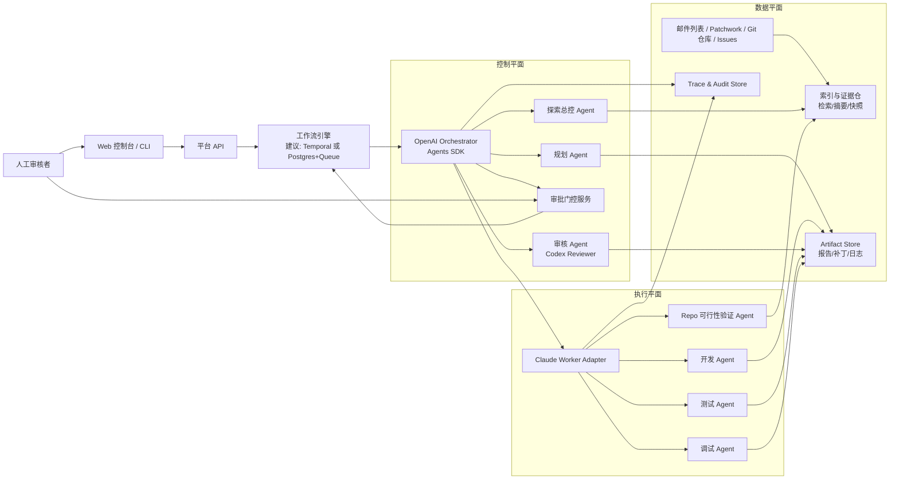
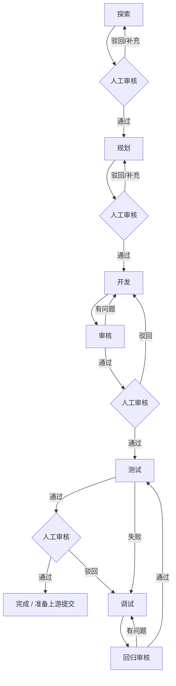

# RV-Insights 多 Agent 开源贡献平台设计方案

> 日期：2026-04-23  
> 状态：v1 草案  
> 结论：推荐采用“**OpenAI Agents SDK 作为控制平面 + Claude Agent SDK 作为执行平面**”的双栈架构。  
> 说明：Anthropic 官方文档当前已将 **Claude Code SDK** 命名为 **Claude Agent SDK**；本文中“Claude 开发节点”仍指你要求的 Claude Code 风格编码执行能力。

## 1. 目标与范围

`RV-Insights` 的目标不是“做一个泛用聊天机器人”，而是做一个**面向 RISC-V 开源软件贡献的、带人工审批关卡的多 Agent 工作流平台**。平台需要完成六类能力：

1. 探索：从 RISC-V 邮件列表、代码库、Issue/PR 线索中发现潜在贡献点，并做可行性验证。
2. 规划：把贡献点转化为可执行的开发方案与测试方案。
3. 开发：根据方案落代码。
4. 审核：对开发结果做结构化 review，并驱动修复迭代。
5. 测试：按测试方案搭环境、执行验证、沉淀结果。
6. 调试：基于审核或测试失败结果复现、定位、修复，再进入回归闭环。

平台的关键约束有三条：

- 每个阶段产出后都必须暂停，等待人工审核通过，才能进入下一阶段。
- “开发”和“审核”必须支持多轮迭代。
- 面向 RISC-V 开源贡献，必须把“发现线索”升级为“可验证、可测试、可提交”的候选任务，而不是仅做摘要。

## 2. 设计假设

为避免你原始描述中的轻微歧义，本文统一采用如下建模：

- 工作流标准阶段为：`探索 -> 规划 -> 开发 -> 审核 -> 测试 -> 调试/回归`。
- 其中存在两个闭环：
  - `开发 <-> 审核`
  - `测试失败 -> 调试 -> 审核 -> 测试`
- “审核节点由 Codex 承担”解释为：**审核层以 OpenAI 侧能力为主，并通过 OpenAI Agents SDK 封装 Codex/代码审阅能力**。
- “开发节点由 Claude Code 承担”解释为：**开发、测试、调试等高文件系统/命令行耦合任务，由 Claude Agent SDK 负责执行**。

## 3. 是否可以同时使用 Claude Agent SDK 与 OpenAI Agents SDK

可以，而且本项目**推荐结合使用**，但不推荐“把 Anthropic 模型硬塞进 OpenAI SDK 的多提供商适配层”或者反过来做核心链路。更稳妥的做法是：

- **OpenAI Agents SDK 负责控制平面**
  - 负责任务编排、阶段切换、结构化输出、handoff、guardrails、人工审批中断/恢复、trace 统一采集。
- **Claude Agent SDK 负责执行平面**
  - 负责代码库深挖、文件修改、命令执行、测试环境搭建、调试与会话延续。

这样分层的原因很直接：

- 你的需求本质上是一个**长生命周期、可暂停、可回退、有人审门控**的工作流系统，OpenAI Agents SDK 对 handoff、human-in-the-loop、RunState、tracing 的表达更强，更适合做“总控”。
- 你的开发/测试/调试节点本质上是**代码工作区操作系统**，Claude Agent SDK 原生强调文件系统、Bash、权限、hooks、MCP、会话延续，更适合做“执行工人”。
- 审核节点明确要求用 Codex，那么控制平面落在 OpenAI 一侧更自然。

## 4. 三种候选架构与推荐方案

### 方案 A：双栈混合架构（推荐）

- 控制平面：OpenAI Agents SDK
- 执行平面：Claude Agent SDK
- 审核引擎：OpenAI 侧 Reviewer Agent / Codex 能力
- 开发/测试/调试引擎：Claude Agent SDK Worker

优点：

- 与你的角色分工完全一致。
- 人工审批、阶段状态、审核迭代最容易建模。
- 开发与测试保持 Claude 的代码执行优势。
- 审核与编排保持 OpenAI 的多 Agent 与追踪优势。

代价：

- 需要维护两个 Agent runtime。
- 需要设计清晰的跨 SDK 契约与事件总线。

### 方案 B：纯 OpenAI Agents SDK

- 所有阶段都用 OpenAI Agents SDK 实现。

优点：

- 技术栈更统一。
- tracing、guardrails、handoff、human-in-the-loop 一致性强。

缺点：

- 开发、测试、调试对工作区和命令执行的适配成本更高。
- 你指定的“Claude 开发节点”无法自然保留。
- 若强行让 OpenAI 承担全部 repo-heavy 工作，系统会更偏平台工程，而不是开源贡献工程。

### 方案 C：纯 Claude Agent SDK

- 所有阶段都用 Claude Agent SDK 实现，审核阶段再外挂 OpenAI reviewer。

优点：

- 代码工作区体验强。
- 开发/调试链路简单直接。

缺点：

- 顶层工作流编排、阶段门控、统一 trace/audit、结构化交付物管理需要你自己补更多平台层逻辑。
- 审核节点仍然要引入 OpenAI，最终并没有真正减少异构性。

### 推荐结论

本项目建议采用 **方案 A**。理由不是“谁更强”，而是“谁更适合这个位置”：

- **OpenAI Agents SDK 更像工作流总控与治理层。**
- **Claude Agent SDK 更像代码执行与环境操作层。**

## 5. 各层对应使用哪个 SDK

| 层/节点 | 推荐 SDK | 推荐角色 | 原因 |
| --- | --- | --- | --- |
| 探索总控 | OpenAI Agents SDK | Explore Manager | 需要多来源聚合、结构化候选输出、handoff、人工审批暂停 |
| 邮件列表探索 | OpenAI Agents SDK | Mailing List Research Agent | 更适合做线索提取、主题聚类、候选打分与结构化摘要 |
| 代码库可行性验证 | Claude Agent SDK | Repo Feasibility Agent | 需要 `grep/read/bash/mcp/session` 级能力验证线索是否真能改 |
| 规划层 | OpenAI Agents SDK | Planner Agent | 需要把探索结果压成严谨开发方案、测试方案、验收标准 |
| 开发层 | Claude Agent SDK | Dev Agent | 文件修改、命令执行、分支工作区、长会话编码最匹配 |
| 审核层 | OpenAI Agents SDK | Review Agent + Codex 适配器 | 你明确要求 Codex 审核；同时需要结构化 findings、审批挂起、审计 |
| 测试层 | Claude Agent SDK | Test Agent | 搭环境、跑编译/仿真/回归、本地日志采集都强依赖工作区操作 |
| 调试层 | Claude Agent SDK | Debug Agent | 复现失败、定位、修复、复跑测试，都属于 repo-heavy 执行 |
| 人工审核关卡 | OpenAI Agents SDK + 平台工作流层 | Approval Gate | 每阶段暂停、批准/驳回/补充意见、恢复运行是控制平面职责 |

### 5.1 选型依据与官方能力映射

| 能力维度 | OpenAI Agents SDK | Claude Agent SDK | 设计含义 |
| --- | --- | --- | --- |
| 多 Agent 编排 | 原生 handoff、agent-as-tools、manager pattern | 可做多步 Agent 运行，但更偏单工作区执行 | 顶层阶段编排优先放 OpenAI |
| 人工介入 | 原生 human-in-the-loop、interruptions、RunState 恢复 | 支持审批/用户输入，但更适合执行过程中的交互 | 阶段门控与暂停恢复优先放 OpenAI |
| Trace / Audit | tracing 概念完整，适合做全链路观测 | 可记录执行过程，但平台级 trace 仍需你统一 | 统一审计中心放控制平面 |
| 结构化输出 | 更适合产出计划包、review findings、阶段 verdict | 也能输出结构化内容，但核心优势不在这里 | 规划、审核适合 OpenAI |
| 文件系统/命令行 | 可以做，但不是其最突出优势 | 原生强调文件、Bash、权限、hooks、MCP、长会话 | 开发、测试、调试适合 Claude |
| 会话延续 | 可恢复运行状态，适合工作流状态 | 原生 session/resume/fork 更适合连续代码工作 | 调试和多轮开发优先用 Claude |
| 权限模型 | 更适合控制“是否进入下一阶段” | 更适合控制“当前 Agent 能做哪些工具操作” | 平台权限与执行权限分层管理 |
| 多提供商兼容 | 官方支持扩展，但明确提示不同提供商能力并不完全一致 | 原生面向 Claude 自身运行时 | 不建议用单一适配层硬抹平两家差异 |

## 6. 推荐总体架构

### 6.1 总体组件图



### 6.2 设计要点

- **控制平面和执行平面分离**：控制平面不直接改代码，只负责状态、规则、门控和任务分发。
- **Claude Worker 通过适配器接入**：不要把 Claude 直接塞进 OpenAI 的多提供商抽象层做核心链路，而是当成独立执行服务。
- **统一 Artifact 契约**：阶段之间传递的是结构化工件，不是裸 prompt transcript。
- **统一审批状态机**：每阶段结束都进入 `WAIT_HUMAN_APPROVAL`。

## 7. 阶段工作流设计

### 7.1 阶段流转图



### 7.2 探索层

**职责：**

- 从 RISC-V 相关邮件列表、Patchwork、Issue、PR、提交历史中发现“可能值得做”的贡献点。
- 将“线索”升级为“可验证候选任务”。

**推荐实现：**

- 探索总控：OpenAI Agents SDK
- repo 深挖验证：Claude Agent SDK

**为什么这样分：**

- 邮件列表和跨源信息整合更像研究编排问题，适合 OpenAI 总控。
- 候选点是否真能做，需要到代码库里找模块、命令、构建路径、测试入口，这更适合 Claude Worker。

**探索输出必须包含：**

- 候选贡献点标题
- 关联仓库与模块
- 来源证据链接
- 可行性结论
- 预计改动范围
- 预计测试方式
- 风险与阻塞项
- 推荐优先级

**探索层“可行性验证”判定标准：**

1. 能定位到具体 repo、目录或模块。
2. 能找到明确问题信号：维护者回复、TODO、失败构建、回归、未完 patch、重复抱怨等。
3. 能给出最小复现路径或静态证据。
4. 能给出至少一个可执行测试入口。
5. 不明显依赖未决设计争论或大规模重构。

### 7.3 规划层

**职责：**

- 把探索结果转成开发方案、测试方案、验收标准和回滚策略。

**推荐实现：**

- OpenAI Agents SDK

**原因：**

- 规划是高结构化输出问题，不是文件系统操作问题。
- 规划层需要把需求拆成可审阅的 artifact，并为后续开发和测试节点生成明确边界。

**规划输出必须包含：**

- 背景与目标
- 代码修改范围
- 开发步骤
- 测试矩阵
- 风险清单
- 退出条件
- 是否需要上游邮件沟通

### 7.4 开发层

**职责：**

- 根据规划包实际修改代码、增加测试、生成 diff 和变更说明。

**推荐实现：**

- Claude Agent SDK

**原因：**

- 开发层强依赖工作区读写、命令执行、会话延续、上下文压缩和工具权限控制。
- 这正是 Claude Agent SDK 的强项。

**开发输出必须包含：**

- 变更摘要
- 文件清单
- patch / commit / branch 信息
- 新增或修改的测试
- 本地自测结果
- 已知未解决问题

### 7.5 审核层

**职责：**

- 以 reviewer 角色做结构化 code review。
- 产出问题清单，而不是直接越权改代码。

**推荐实现：**

- OpenAI Agents SDK
- 底层封装 Codex reviewer 能力

**原因：**

- 你明确指定 Codex 承担审核。
- 审核层需要结构化 findings、严重级别、行级证据、审批记录和迭代闭环。
- 审核节点最适合做**只读 reviewer**，不应和开发节点共用写权限。

**审核输出必须包含：**

- verdict：`approve / request_changes / block`
- findings：严重级别、文件、位置、问题说明、建议修复方向
- 覆盖面声明：是否检查了测试、边界条件、回归风险、风格一致性

**实现建议：**

- MVP 阶段将 Codex reviewer 封装在 `review_adapter` 后面，不把实验性接口直接暴露给工作流。
- 审核默认只读，不提供文件修改权限。

### 7.6 测试层

**职责：**

- 按规划包搭环境并执行测试。
- 对 RISC-V 相关工程给出可重复的测试证据。

**推荐实现：**

- Claude Agent SDK

**原因：**

- 测试层要做编译、运行、日志抓取、环境检查、失败复现，本质上仍是工作区+命令行任务。

**RISC-V 场景建议的测试维度：**

- 交叉编译是否通过
- 单元测试 / 集成测试是否通过
- QEMU / Spike / Renode 中的功能验证是否通过
- 对 rv32 / rv64 的兼容性是否受影响
- 对关键配置项和工具链版本是否敏感

### 7.7 调试层

**职责：**

- 基于测试失败或审核问题复现故障、定位根因、提交修复并回归。

**推荐实现：**

- Claude Agent SDK

**原因：**

- 调试要大量读取日志、跑命令、反复改动和回归。
- 与开发节点共享工作区和 session continuity 更自然。

**输出必须包含：**

- 根因分析
- 修复摘要
- 回归结果
- 是否引入新风险

## 8. 人工审核关卡设计

每个阶段都必须暂停。推荐统一状态机如下：

| 状态 | 含义 |
| --- | --- |
| `PENDING` | 阶段等待执行 |
| `RUNNING` | Agent 正在运行 |
| `WAIT_HUMAN_APPROVAL` | 阶段结果已生成，等待人工审批 |
| `APPROVED` | 人工通过，允许进入下一阶段 |
| `REJECTED` | 人工驳回，退回当前阶段或上游阶段 |
| `FAILED` | Agent 运行失败或环境失败 |
| `DONE` | 工作流结束 |

**人工审批动作只允许三类：**

- `approve`：进入下一阶段
- `request_changes`：退回当前节点重做
- `redirect`：退回上游节点补信息

审批界面至少要展示：

- 当前阶段 artifact
- 关键证据链接
- 代码 diff / 测试日志 / review findings
- Agent 自评风险
- 历史迭代次数

## 9. 阶段间 Artifact 契约

为避免跨 SDK 串话，建议阶段之间只传结构化工件。

### 9.1 ExplorationReport

```json
{
  "candidate_id": "rv-linux-001",
  "title": "修复某 RISC-V 构建回归",
  "repo": "linux",
  "module": "arch/riscv/...",
  "source_refs": ["mailing-list-url", "commit-url"],
  "feasibility": "high",
  "evidence": ["可复现构建失败", "维护者明确要求补丁"],
  "test_hint": ["make ARCH=riscv ..."],
  "risks": ["依赖特定工具链版本"]
}
```

### 9.2 PlanPackage

```json
{
  "candidate_id": "rv-linux-001",
  "goal": "消除 RISC-V 构建失败并补测试",
  "change_scope": ["file1", "file2"],
  "implementation_steps": ["步骤1", "步骤2"],
  "test_plan": ["编译测试", "QEMU 回归"],
  "acceptance_criteria": ["构建通过", "新增测试通过"],
  "rollback_plan": ["回退 patch 并恢复原逻辑"]
}
```

### 9.3 ReviewReport

```json
{
  "verdict": "request_changes",
  "findings": [
    {
      "severity": "high",
      "file": "path/to/file.c",
      "location": "L42",
      "summary": "边界条件遗漏",
      "suggestion": "补空指针保护并增加回归测试"
    }
  ]
}
```

### 9.4 TestReport

```json
{
  "status": "failed",
  "environment": "ubuntu-24.04 + riscv64 toolchain + qemu",
  "commands": ["make ...", "ctest ..."],
  "passed": ["编译检查"],
  "failed": ["QEMU 启动回归"],
  "artifacts": ["log-url", "junit-url"]
}
```

## 10. 推荐的平台模块划分

建议统一用 Python 实现后端服务，前端可单独选型。推荐目录结构如下：

```text
RV-Insights/
  services/
    api/
    workflow/
    openai-orchestrator/
    claude-worker/
    review-adapter/
    source-indexer/
  libs/
    contracts/
    tracing/
    approvals/
    repo-adapters/
  ui/
    console/
  infra/
    docker/
    k8s/
  docs/
    plans/
```

这样做的理由：

- OpenAI 与 Claude 的 SDK 都有 Python 形态，后端统一语言最省集成成本。
- `contracts` 独立出来后，可以强制阶段间只交换稳定 schema。
- `review-adapter` 单独隔离后，Codex 侧接口变化不会污染主工作流。

## 11. RISC-V 领域专项设计

### 11.1 首批建议覆盖的数据源

- `linux-riscv` 邮件列表与 lore 存档
- QEMU、U-Boot、OpenSBI、GCC/LLVM、binutils、glibc/musl 中的 RISC-V 相关模块
- GitHub/GitLab issue、PR、discussion
- patchwork / CI 失败记录 / regression 标签

### 11.2 候选贡献点优先级规则

建议评分函数重点考虑：

- 维护者是否明确表达需要修复
- 是否能在当前代码库复现
- 改动范围是否可控
- 是否能给出自动化测试
- 是否属于回归类问题
- 是否与 RISC-V 特定路径强相关

### 11.3 不建议作为第一阶段的任务类型

- 大规模架构重构
- 需要长期邮件讨论才能定方向的 RFC
- 无法复现也无明确维护者反馈的“想当然优化”
- 涉及多个上游仓库同步 landing 的复杂联动

## 12. 安全、治理与审计

平台必须默认最小权限：

- 审核 Agent 只读
- 开发/测试/调试 Agent 才有写权限
- 推送上游、发邮件、创建 PR 必须再次人工确认
- 所有工具调用都要落审计日志
- 所有 artifact 都要可追溯到输入、输出、执行时间、执行模型与会话 ID

建议保留三类可观测数据：

- 业务事件：阶段开始、结束、审批、驳回、重试
- Agent trace：prompt 摘要、工具调用、时延、失败类型
- 贡献证据：diff、日志、截图、邮件链接、回归结果

## 13. 为什么不建议把两套 SDK 硬合成一个抽象层

不要在第一版就追求“统一 Agent 抽象接口”。更好的做法是：

- **统一工作流状态机**
- **统一 artifact schema**
- **统一审计与 trace**
- **不统一底层 Agent 运行时细节**

原因：

- OpenAI 与 Claude 的强项不同，强行抽象会把双方优势抹平。
- 多提供商适配往往在工具能力、流式事件、权限模型、恢复机制上出现最难排查的边缘问题。
- 你的平台成功关键不是“SDK 看起来统一”，而是“每个节点稳定产出可审核结果”。

## 14. 分阶段落地建议

### Phase 1：先做最小闭环

- 探索
- 规划
- 开发
- 审核
- 人工审批

目标：跑通 `探索 -> 规划 -> 开发 <-> 审核` 的最小闭环。

### Phase 2：补测试与调试闭环

- 引入测试 Agent
- 引入调试 Agent
- 增加 QEMU/工具链测试 Runner

目标：跑通 `测试失败 -> 调试 -> 回归审核 -> 复测`。

### Phase 3：补领域化增强

- 邮件列表增量索引
- Patchwork / CI 回归集成
- 贡献点评分与优先级排序
- 上游提交前检查清单

## 15. 最终建议

如果以你的目标为准，最合理的技术结论是：

1. **可以同时使用 Claude Agent SDK 与 OpenAI Agents SDK。**
2. **应当使用 OpenAI Agents SDK 搭建控制平面。**
3. **应当使用 Claude Agent SDK 负责 repo-heavy 的执行平面。**
4. **审核层应由 OpenAI 侧 reviewer/Codex 能力承接，且默认只读。**
5. **阶段间必须靠结构化 artifact 和人工审批门控衔接，而不是靠自由文本对话衔接。**

换句话说，`RV-Insights` 最合理的第一性原理不是“选一个 SDK 统一天下”，而是：

- **谁更适合编排，就负责编排。**
- **谁更适合写代码、跑环境，就负责执行。**
- **谁更适合审代码，就负责审代码。**

这正好与你定义的节点职责一致。

## 16. 参考依据

以下资料用于支撑本文的技术判断，访问日期均为 2026-04-23：

- OpenAI Agents SDK 文档总览：<https://openai.github.io/openai-agents-python/>
- OpenAI Agents SDK 多 Agent 编排：<https://openai.github.io/openai-agents-python/multi_agent/>
- OpenAI Agents SDK Human-in-the-loop：<https://openai.github.io/openai-agents-python/human_in_the_loop/>
- OpenAI Agents SDK Tracing：<https://openai.github.io/openai-agents-python/tracing/>
- OpenAI Agents SDK Tools：<https://openai.github.io/openai-agents-python/tools/>
- OpenAI Agents SDK Models：<https://openai.github.io/openai-agents-python/models/>
- Anthropic Claude Agent SDK 总览：<https://code.claude.com/docs/en/agent-sdk>
- Anthropic Claude Agent SDK 权限：<https://code.claude.com/docs/en/agent-sdk/permissions>
- Anthropic Claude Agent SDK 会话管理：<https://code.claude.com/docs/en/agent-sdk/sessions>
- Anthropic Claude Agent SDK 审批与用户输入：<https://code.claude.com/docs/en/agent-sdk/approvals>
- 对比文章（辅助参考，不作为唯一依据）：<https://aix.me/blog/claude_vs_openai_agents_sdk/>
