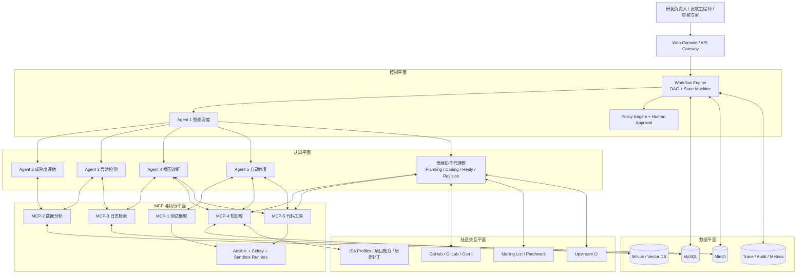
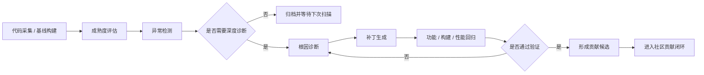
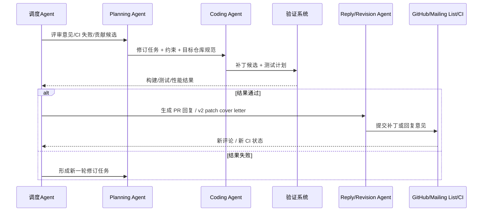

# RV-Insights: 面向 RISC-V 开源贡献的大模型驱动多 Agent 平台设计方案

> 文档版本：v0.1  
> 编写日期：2026-04-21  
> 设计定位：内部立项/研发实施方案草案  
> 输入依据：`README.md`（Agent 技术版图与融合建议）、`rv-agents.pptx`（RV-Insights/“源生”架构与工作规划）

---

## 1. 项目概述

RV-Insights 的目标不是再做一个通用 Agent Demo，而是建设一个面向 RISC-V 开源软件生态的工程化贡献平台。平台以“大模型 + 多 Agent + 工作流引擎 + MCP 工具协议”为基础，围绕真实开源协作场景形成两个闭环：

1. 技术演进闭环：代码采集、跨架构对比、成熟度评估、异常检测、根因诊断、自动修复、回归验证。
2. 社区贡献闭环：补丁生成、PR/邮件提交、CI 结果跟踪、评审意见解析、修订任务编排、自动回复与多轮迭代。

平台服务对象包括：

- RISC-V 软件生态研究团队
- 面向 Linux、QEMU、LLVM、运行时、云原生组件等仓库的贡献工程师
- 负责测试平台、知识库、自动化验证与社区协作的研发团队
- 需要量化生态成熟度并沉淀长期数据资产的管理者

该平台的核心价值在于，把“发现问题”和“完成贡献”从离散的人工作业，升级为可审计、可复用、可持续迭代的智能工作流。

## 2. 背景与问题定义

基于现有材料，RISC-V 软件生态面临的核心问题主要有四类：

### 2.1 生态成熟度仍落后于成熟架构

PPT 中已明确提出，RISC-V 作为新兴开源架构，在软件成熟度上仍落后于 ARM/x86。仅依赖包数量、提交量等启发式指标，无法科学衡量生态差距，也无法指导后续优化优先级。

### 2.2 性能缺陷和功能缺陷难以系统发现与修复

跨架构迁移中的许多问题并不表现为直接崩溃，而是性能退化、向量化支持不足、编译质量不佳、路径缺失或实现冗余。这些问题需要：

- 大规模测试执行能力
- ARM/RISC-V 基线对齐能力
- 宏观异常筛查与微观函数定位能力
- 基于规范、历史补丁和专家知识的修复能力

### 2.3 开源贡献流程高度碎片化

开源贡献不是“生成补丁”就结束。真实流程包括：

- 理解仓库规范、代码风格、维护者偏好
- 适配 GitHub/GitLab/Gerrit 或邮件列表流程
- 跟踪 CI 失败原因和评审意见
- 反复修订补丁、撰写解释性回复、提交 v2/v3

现有平台通常只覆盖“编码”一段，而忽视“协作闭环”。

### 2.4 当前多 Agent 平台对生产环境支持不足

PPT 中点出了几个关键约束：

- 高质量模型 API 稳定性与 TPM 限制影响长时运行
- 多 Agent 平台常无法在共享上下文中持续协作
- 真实验证依赖物理机、仿真器或集群，不能只做沙箱内演示
- 开源仓库存在强规范依赖，必须引入严格的人机协同审核

因此，本项目需要的是“平台级工程设计”，而不是单纯的提示词工程。

## 3. 设计目标与非目标

### 3.1 设计目标

1. 建设一个面向 RISC-V 开源软件贡献的端到端多 Agent 平台。
2. 支持从问题发现到上游贡献提交的全链路自动化与可追踪化。
3. 通过 MCP 标准化工具接入测试框架、日志系统、知识库与代码工具。
4. 通过工作流引擎管理多 Agent 的状态、并发、终止条件和重试逻辑。
5. 将“技术演进闭环”和“社区贡献闭环”统一到一个共享状态模型中。
6. 支持真实物理机/仿真环境上的功能、构建、性能三类验证。
7. 保留人类专家在高风险环节的审批权，避免模型幻觉直接进入上游社区。
8. 为后续扩展到 10+ RISC-V 开源社区打下统一平台基础。

### 3.2 非目标

1. 不追求完全无人值守地自动合入上游主线。
2. 不在首期实现开放式 Agent 市场或插件商城。
3. 不替代现有测试框架、Ansible 平台和已有数据基础设施，而是对其进行编排与增强。
4. 不在首期覆盖所有 RISC-V 仓库，优先支持 1-2 个高价值试点社区。
5. 不将所有问题都交给单一大模型解决，而是显式拆分角色、工具和审批边界。

## 4. 方案选型与总体判断

结合 `README.md` 的技术版图分析与 PPT 的工程约束，存在三种可选路线：

| 方案 | 描述 | 优点 | 风险/不足 |
| --- | --- | --- | --- |
| A. 单流水线 Agent | 用一个主 Agent 串接测试、诊断、修复、提交 | 实现快，演示简单 | 无法长期扩展；上下文臃肿；难以治理 |
| B. 双闭环多 Agent 平台 | 技术演进闭环 + 社区贡献闭环，共享工作流、知识和验证层 | 与现有材料高度一致；兼顾研究与工程 | 需要统一状态模型和治理策略 |
| C. 开放插件化平台 | 所有 Agent、Skill、MCP、连接器都插件化 | 长期扩展性最强 | 首期复杂度过高，交付风险大 |

**推荐方案：B. 双闭环多 Agent 平台。**

原因如下：

- 它直接承接 PPT 中“5 AI Agents + 1 Workflow Engine + MCP Protocol”的主骨架。
- 它能把 slide 11-16 中的技术闭环与开源贡献闭环整合成一个平台，而不是两个割裂系统。
- 它允许在不推翻现有 `FastAPI + Celery + Ansible + MinIO + MySQL + 向量库` 基础设施的前提下演进。
- 它与 `README.md` 推荐的“LangGraph 负责编排，应用型 Agent 负责节点能力，MCP 提供工具标准化”的分层思想一致。

## 5. 设计原则

1. **分层解耦**：调度、认知、执行、存储、社区交互分层设计。
2. **共享状态**：所有 Agent 在统一任务状态和审计上下文中协作。
3. **人机共治**：高风险提交、内核/编译器级修改、跨文件大补丁必须人工审核。
4. **真实验证优先**：功能正确、构建通过、性能回归均需在真实目标环境中验证。
5. **最小可落地**：优先落地 1-2 个仓库、2 类问题、1 条贡献链路，避免首期过度平台化。
6. **知识可复用**：规范、历史补丁、评审记录、CI 诊断应持续沉淀为 RAG 资产。
7. **可观测可追责**：每一步推理、工具调用、结果产物、审批动作必须可追踪。

## 6. 总体架构

### 6.1 分层架构图



### 6.2 架构解读

该架构将平台拆成五层：

1. **控制平面**  
   负责任务接入、状态流转、并发控制、审批策略与终止条件判断。

2. **认知平面**  
   由多个角色明确的 Agent 组成，每个 Agent 负责一个稳定能力域，避免“一个超级 Agent 做所有事情”。

3. **MCP 与执行平面**  
   把测试、日志、知识、代码操作封装为标准服务，降低 Agent 与底层工具耦合。

4. **数据平面**  
   使用结构化数据库、对象存储、向量库和追踪系统承载状态、产物、知识与审计记录。

5. **社区交互平面**  
   面向 PR、邮件列表、CI 系统和项目规范等外部生态接口，形成真正的开源协作闭环。

## 7. 关键架构决策

### 7.1 工作流引擎采用“图式认知编排 + 异步执行”的混合模式

建议使用类似 `LangGraph` 的状态图思想来描述 Agent 协作关系，并保留现有 `FastAPI + Celery + Ansible` 基础设施承担长耗时任务。

推荐原因：

- 图模型适合表达循环、条件分支、重试和人工审批。
- Celery 适合承载构建、测试、索引、回归等分钟级至小时级任务。
- Ansible/SSH/Sandbox Runner 适合驱动物理机、仿真器、容器与 CI 环境。
- 这样能避免把所有状态都塞进一次性对话中。

### 7.2 MCP 是工具接入标准，而不是可选装饰

PPT 已定义 5 个 MCP 方向，这一设计应继续保留。原因是平台的核心难点不在“让模型会说话”，而在“让模型安全、稳定、结构化地调用外部系统”。

### 7.3 Agent 分成“核心常驻 Agent”和“任务型临时 Agent”

- 核心常驻 Agent：负责稳定的认知闭环，如调度、评估、检测、诊断、修复。
- 任务型临时 Agent：面向具体贡献场景动态创建，如回复生成、修订规划、补丁执行、邮件封装。

这样可以避免所有贡献任务都长期占用高成本模型上下文。

### 7.4 必须有显式的人类审批闸门

对于下列情况，平台只允许“给出建议”，不允许直接提交：

- Linux/QEMU/LLVM 等核心仓库的跨模块补丁
- 性能优化但证据链不足的补丁
- 内核、编译器、虚拟化、安全相关变更
- 第二轮以上修订中与维护者意见存在冲突的回复

### 7.5 框架与能力落位

结合 `README.md` 的分类结论，RV-Insights 不应押注单一 Agent 框架，而应采用“总编排 + 节点异构能力 + 标准工具协议”的组合式架构：

| 层次 | 推荐落位 | 作用 |
| --- | --- | --- |
| 编排与控制流 | `LangGraph` 风格状态图 | 负责 DAG、循环、Checkpoint、条件分支、人工审批 |
| 角色协作节点 | `AutoGen` 风格多 Agent 对话 | 适合复杂诊断、方案比较、争议性评审回复 |
| 线性执行节点 | `crewAI` 风格任务流 | 适合明确输入输出的修订任务、验证任务、贡献任务 |
| 结构化产出节点 | `MetaGPT` 风格 SOP | 适合报告生成、修订摘要、提交材料、设计性输出 |
| 分布式消息协作 | `AgentScope` / MsgHub 思想 | 适合未来扩展到跨服务、跨机器的分布式 Agent 协同 |
| 工具与系统边界 | `MCP` | 统一接入测试、日志、知识、代码工具 |
| 外部 Agent 互联 | `A2A`（可选） | 面向后续跨团队 Agent 服务编排 |

这意味着 RV-Insights 的重点不是“选哪一个框架”，而是定义一套稳定的平台边界：

- 工作流引擎负责任务状态与协作顺序
- 具体 Agent 框架负责任务内部的认知策略
- MCP 负责任务外部的工具执行与安全隔离
- 社区连接器负责将开源世界的反馈事件重新送回工作流状态机

## 8. Agent 体系设计

### 8.1 核心 5 Agent

| Agent | 主要职责 | 典型输入 | 典型输出 | 主要工具 |
| --- | --- | --- | --- | --- |
| Agent 1 智能调度 | 决定测什么、先测什么、何时进入修复或贡献环节；管理 DAG 状态和优先级 | 仓库画像、测试计划、历史结果、社区反馈 | 任务图、调度决策、重试策略、升级审批请求 | Workflow API、任务队列、策略引擎 |
| Agent 2 成熟度评估 | 按多维指标进行生态成熟度量化，生成趋势报告和优先级建议 | 基线数据、测试结果、贡献数据 | 评分报告、趋势图、差距清单 | 数据分析 MCP、报表工具 |
| Agent 3 异常检测 | 对功能、性能、构建、CI 失败等异常进行筛查和聚类 | 运行日志、性能指标、回归结果 | 异常案例、分类标签、置信度 | 数据分析 MCP、日志 MCP |
| Agent 4 根因诊断 | 基于日志、代码、规范、历史修复经验定位原因，输出修复建议 | 异常案例、代码上下文、知识库命中 | 根因报告、可疑函数/文件、修复候选方案 | 日志 MCP、知识库 MCP、代码 MCP |
| Agent 5 自动修复 | 生成补丁、执行静态检查、构建测试和性能回归，给出提交候选 | 根因报告、代码上下文、验证策略 | PatchSet、验证报告、提交说明草案 | 测试 MCP、知识库 MCP、代码 MCP |

### 8.2 贡献协作代理群

除核心 5 Agent 外，建议为开源社区交互增加以下任务型角色：

| 角色 Agent | 触发场景 | 主要输出 |
| --- | --- | --- |
| Planning Agent | 新问题进入贡献流程；收到评审意见或 CI 失败 | 可执行修订计划、任务拆分、优先级 |
| Coding Agent | 明确修订任务后进入实现 | 补丁候选、变更说明、风险说明 |
| Reply Agent | 需要在 PR/邮件列表回复维护者时 | 专业回复草稿、解释性注释、cover letter |
| Revision Agent | 已有补丁被打回或需要 v2/v3 | 修订差异摘要、版本对比、修订原因 |
| Monitor Agent | 监听 PR 状态、CI 结果、邮件回复 | 新事件通知、任务重开、状态推进 |

这些 Agent 不必都做成长期运行的大模型实例，也可以表现为工作流中的角色节点，由调度 Agent 按需拉起。

### 8.3 模型分层策略

基于 PPT 中“不同 Agent 绑定不同强度模型”的思路，推荐采用三层模型策略：

- 低成本模型：监控、分类、结构化抽取、简单回复初稿
- 中等模型：成熟度评估、异常解释、任务拆分
- 高能力模型：根因诊断、补丁生成、复杂评审回复

这样可以控制长时运行成本，同时把高能力模型集中在真正高价值的阶段。

## 9. 双闭环工作流设计

### 9.1 技术演进闭环



该闭环对应 PPT 中“代码采集 -> 对比分析 -> 需求生成 -> RV 代码生成 -> 测试验证 -> PR 提交”的主线，但在工程上进一步细化为“发现、诊断、修复、验证、移交”五段。

### 9.2 社区贡献闭环



这一闭环直接对应 PPT slide 16 中的“监控评审意见、监控 CI 结果、形成修订任务、协作回复、实施修改”的流程。

## 10. 核心业务对象与状态模型

为了让多个 Agent 在共享上下文中稳定协作，平台必须定义统一状态对象，而不是只靠自然语言传递。

### 10.1 核心对象

| 对象 | 含义 | 关键字段 |
| --- | --- | --- |
| `RepositoryProfile` | 仓库画像 | repo URL、分支、语言、构建方式、测试入口、贡献规范、维护者信息 |
| `ArchitectureBaseline` | 架构对比基线 | ARM/RISC-V 平台信息、编译器版本、测试集、标准化指标 |
| `EvaluationReport` | 成熟度评估报告 | 各维度得分、趋势、优先级建议、证据链接 |
| `AnomalyCase` | 异常案例 | 类型、严重度、触发用例、性能/日志证据、关联 commit |
| `DiagnosisCase` | 根因分析结果 | 可疑函数、证据链、知识命中、修复建议 |
| `PatchSet` | 补丁候选 | diff、影响文件、风险等级、静态检查结果、说明文本 |
| `VerificationRun` | 验证执行记录 | 环境、命令、结果、日志、产物、性能对比 |
| `ContributionCase` | 开源贡献流程对象 | 提交方式、目标社区、PR/邮件 ID、当前轮次、审批状态 |
| `ReviewEvent` | 社区反馈事件 | 评论内容、CI 状态、维护者角色、建议标签、截止时间 |
| `KnowledgeAsset` | 知识条目 | 规范、历史补丁、邮件、评审规则、故障模式 |
| `AuditRecord` | 审计记录 | 模型、提示、工具调用、审批人、提交时间、回滚关联 |

### 10.2 状态机建议

`ContributionCase` 建议采用如下状态流转：

`DISCOVERED -> TRIAGED -> DIAGNOSED -> PATCHED -> VERIFIED -> APPROVED -> SUBMITTED -> REVIEWING -> REVISED -> MERGED / CLOSED`

关键点：

- `APPROVED` 之前必须通过策略引擎和人工审批。
- `REVISED` 允许循环回到 `PATCHED` 或 `VERIFIED`。
- `CLOSED` 需要记录关闭原因，如“误报”“上游拒绝”“环境无法复现”。

## 11. MCP 服务与工具接入设计

### 11.1 MCP-1 测试框架服务

职责：

- 接收测试计划并下发到 RISC-V/ARM 目标机
- 执行构建、单测、集成测试、性能测试、回归测试
- 汇总结构化结果并关联对象存储中的原始日志

可接入能力：

- Ansible Playbook
- Celery Worker
- 容器/虚拟机/物理机执行器
- Benchmark 套件与性能采集工具

### 11.2 MCP-2 数据分析服务

职责：

- 汇总多维评估指标
- 支持异常检测、聚类、趋势统计
- 输出成熟度评分、对比报表和优先级建议

### 11.3 MCP-3 日志检索服务

职责：

- 统一检索构建日志、内核日志、CI 日志、性能剖析结果
- 支持按测试、提交、异常案例、机器、时间范围进行查询

### 11.4 MCP-4 知识库服务

职责：

- 管理 RISC-V Profiles、ISA 规范、项目文档、代码风格、历史补丁、评审记录
- 提供检索增强生成所需的召回、重排、证据引用
- 给诊断 Agent 和回复 Agent 提供“可引用依据”

### 11.5 MCP-5 代码工具服务

职责：

- 拉取仓库、切分变更、生成 diff、执行静态检查
- 支持 `grep`、AST/符号级分析、git blame、patch 格式化
- 封装 patch 生成、branch 管理、变更摘要与提交材料组织

## 12. 知识层设计

平台的长期壁垒不在单次推理，而在知识沉淀。建议建设四类知识：

### 12.1 规范知识

- RISC-V ISA / Profiles / ABI / 向量扩展相关规范
- Linux/QEMU/LLVM/运行时项目的贡献指南、提交模板、代码风格

### 12.2 项目知识

- 仓库目录结构、模块职责、构建矩阵、测试入口、维护者映射
- 历史修复模式、常见拒绝原因、常见评审关注点

### 12.3 运行知识

- 测试环境拓扑
- ARM/RISC-V 基线差异
- 常见 CI 失败模式与环境噪声消解策略

### 12.4 协作知识

- 邮件列表 etiquette
- Cover letter 模板
- PR 描述模板
- “如何回应维护者质疑”的案例库

知识层不应只提供向量检索，还应维护结构化标签，例如：

- 仓库
- 子系统
- 架构
- 问题类型
- 修复类型
- 维护者偏好
- 可引用性等级

## 13. 人机协同与治理策略

### 13.1 风险分级

| 等级 | 示例 | 默认策略 |
| --- | --- | --- |
| L0 只读分析 | 数据汇总、趋势报告、日志分类 | 自动执行 |
| L1 低风险贡献 | 文档、测试、脚本、注释、小范围构建修复 | 自动生成，人工快速审批 |
| L2 中风险贡献 | 单模块性能优化、适配修复、工具链脚本修改 | 必须人工审核后提交 |
| L3 高风险贡献 | 内核、编译器、虚拟化、安全路径、大补丁 | 专家复核 + 多轮验证 + 明确责任人 |

### 13.2 审批闸门

至少设置以下人工闸门：

1. 首次进入目标仓库贡献模式时的人类启用审批
2. 第一次生成待提交补丁时的技术审批
3. 回归数据不足但模型仍建议提交时的风险审批
4. 回复维护者意见前的最终语义审批

### 13.3 审计要求

每个贡献案例必须保留：

- 使用的模型和版本
- 关键提示词模板版本
- 所有工具调用记录
- 证据引用列表
- 测试和回归报告
- 最终提交内容及审批人

## 14. 开源社区交互设计

### 14.1 支持的交互渠道

首期建议覆盖两类：

1. Git Forge：GitHub、GitLab、Gerrit
2. 邮件列表：适配 Linux/QEMU 等以邮件为主的社区

### 14.2 社区连接器职责

- 拉取 Issue/PR/Review/CI 状态
- 监听邮件线程、Patchwork 状态
- 将自然语言反馈转为结构化 `ReviewEvent`
- 输出标准化提交材料：PR body、patch cover letter、reply draft

### 14.3 从反馈到修订的转换逻辑

平台需要把以下输入统一抽象为“修订任务”：

- 维护者评论
- reviewer nits
- CI 构建失败
- benchmark 回归失败
- 邮件列表中的设计质疑

建议输出结构如下：

```text
RevisionTask
- source_event
- affected_files
- requested_change
- evidence
- required_validation
- response_constraints
```

## 15. 部署架构建议

### 15.1 推荐部署方式

采用“控制面集中部署 + 执行面分布式接入”的架构：

- 控制面：FastAPI、工作流引擎、数据库、对象存储、向量库、LLM 网关
- 执行面：RISC-V 物理机、ARM 基线机、仿真器节点、CI Runner、沙箱容器

### 15.2 环境拓扑建议

基于 PPT 中的参考规模，可将首期环境抽象为：

- RISC-V 目标主机池
- ARM 基线对比主机池
- Celery Worker 队列
- 存储与日志集群
- 向量检索服务
- 统一模型网关

### 15.3 可用性要求

1. 工作流状态必须持久化，不能依赖单次会话内存。
2. 外部模型故障时，应支持任务暂停、回退、重试和模型切换。
3. 测试与验证任务必须支持断点恢复。
4. 社区轮询与事件监听必须支持幂等处理。

## 16. 资源与成本策略

基于 PPT 中的输入材料，平台应支持以下运行策略：

### 16.1 长时运行模式

- 8 小时高强度交互/编码
- 16 小时低频监控/总结/异步执行

### 16.2 成本控制手段

1. 按 Agent 角色进行模型分层，不让所有任务都使用最高规格模型。
2. 尽量把知识召回、日志检索、数据整理下沉到 MCP 服务，减少无效 token 消耗。
3. 对长期监控任务采用事件驱动和增量上下文，而非全量重复推理。
4. 对高价值仓库启用缓存、摘要复用与 patch 级上下文压缩。

### 16.3 部署策略建议

从输入材料看，完全离线部署高质量模型的成本显著高于 API 模式。因此首期建议：

- 控制面与工具面自建
- 模型面采取“外部 API + 可替换网关”的混合部署
- 当试点仓库规模扩大、调用量稳定后，再评估私有化模型资源池

## 17. MVP 范围建议

为避免平台首期过大，建议 MVP 只覆盖以下范围：

### 17.1 仓库范围

- 选择 1-2 个 RISC-V 生态高价值仓库
- 优先选择具有明确构建流程、可回归测试、贡献入口清晰的项目

### 17.2 问题范围

- 构建失败修复
- CI 失败修复
- 小范围性能退化定位与修复
- 规范驱动的小中型代码修订

### 17.3 平台范围

MVP 必须包含：

- 统一工作流状态管理
- 5 个核心 Agent 的最小闭环
- 至少 3 个 MCP 服务：测试、知识库、代码工具
- 至少 1 条 Git Forge 贡献链路
- 至少 1 条评审/CI 反馈转修订任务链路

MVP 可以暂缓：

- 邮件列表全量自动化
- A2A 跨团队 Agent 协作
- 全插件化 Agent 市场
- 多仓库统一治理门户

## 18. 分阶段实施路线

### Phase 0：方案固化与试点仓库选型（1-2 周）

- 确定试点仓库和目标问题类型
- 固化状态模型、审批策略和知识范围
- 盘点现有测试框架、日志系统和数据资产

### Phase 1：技术演进闭环 MVP（4 周）

- 打通代码采集、评估、检测、诊断、修复、验证主链路
- 接入 MCP-1/2/5
- 建立最小知识库

### Phase 2：社区贡献闭环 MVP（4 周）

- 接入 GitHub/GitLab 或目标社区接口
- 支持 PR 评论解析、CI 结果解析、回复草拟
- 建立 `ContributionCase` 状态机

### Phase 3：治理与可靠性增强（3 周）

- 审批与审计能力上线
- 幂等、重试、失败回放、任务恢复机制完善
- 指标与看板建设

### Phase 4：试点贡献与效果验证（4 周）

- 在 1-2 个社区产出真实贡献
- 对 accepted / rejected / revised 案例进行复盘
- 形成平台标准作业流程

总周期约 16-17 周，与 PPT 中“~17 周实施周期”的输入基本一致。

## 19. 成功指标

建议从五个维度衡量平台效果：

### 19.1 发现能力

- 每周发现的高价值异常数
- 异常误报率
- 可复现问题比例

### 19.2 修复能力

- 自动生成补丁通过本地验证的比例
- 自动修复后功能/性能回归通过率
- 从异常发现到补丁产出的平均时长

### 19.3 贡献能力

- 提交到上游的补丁数量
- 被接受或进入实质性评审的补丁比例
- 平均修订轮次

### 19.4 平台能力

- 工作流成功率
- MCP 工具调用成功率
- 人工介入点数量与介入时长

### 19.5 知识积累

- 可复用知识条目数
- RAG 命中对成功修复的贡献率
- 历史案例复用率

## 20. 主要风险与缓解措施

| 风险 | 表现 | 缓解措施 |
| --- | --- | --- |
| 模型幻觉导致错误修复 | 补丁逻辑正确性不足，甚至误导维护者 | 强制证据链、知识引用、人工审批、真实回归 |
| 外部模型服务不稳定 | 任务中断、延迟增大 | 模型网关、超时重试、任务持久化、模型降级 |
| 真实环境复现成本高 | 问题无法稳定验证 | 标准化测试 recipe、环境快照、分层验证 |
| 社区反馈理解偏差 | 自动回复冒犯或答非所问 | 回复 Agent 加审批闸门，引用原文与规范 |
| 平台首期过重 | 研发周期拉长，难以交付 | 严格收敛 MVP，先打通一条高价值链路 |
| 多 Agent 协同失控 | 状态不一致、重复工作、上下文污染 | 统一状态模型、显式任务边界、审计追踪 |

## 21. 建议的下一步

1. 从现有候选仓库中选择 1-2 个试点目标，并完成 `RepositoryProfile` 建模。
2. 固化 `ContributionCase` 和 `RevisionTask` 数据结构，避免后续 Agent 接口漂移。
3. 优先建设 MCP-1、MCP-4、MCP-5，因为它们直接决定“能不能形成真实贡献闭环”。
4. 先在 Git Forge 场景跑通贡献闭环，再补邮件列表协作。
5. 在第一批真实案例中优先选择“可验证、低风险、解释性强”的问题类型，快速建立平台信誉。

## 22. 结论

RV-Insights 的正确方向，不是做一个会写代码的通用 Agent，而是构建一个面向 RISC-V 生态的“贡献操作系统”：

- 以工作流引擎承载状态和协作
- 以 5 个核心 Agent 负责发现、评估、诊断、修复与调度
- 以贡献协作代理群完成 PR/邮件/CI 反馈闭环
- 以 MCP 服务连接测试、知识、日志和代码工具
- 以真实验证、人类审批和审计能力保障工程可信度

如果按本方案推进，平台首期即可对 1-2 个 RISC-V 开源社区形成实际贡献；中期可扩展到 10+ 社区；长期则有机会沉淀为 RISC-V 开源软件演进的统一智能基础设施。
