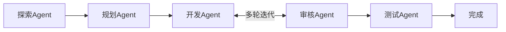
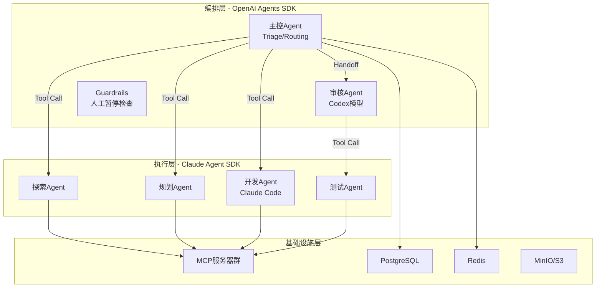
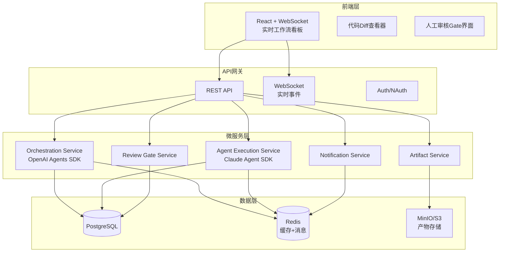
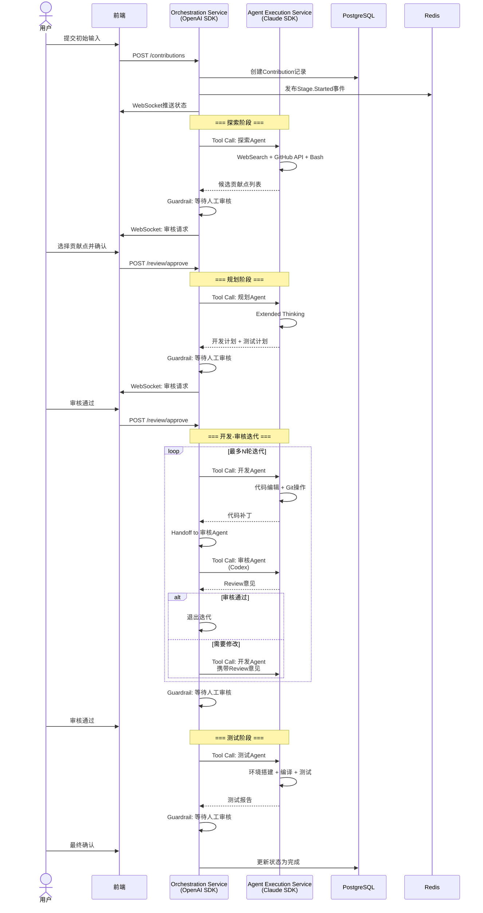

# RV-Insights：大模型驱动的RISC-V多Agent开源贡献平台

## 1. 项目概述

### 1.1 背景与目标

RISC-V作为开放指令集架构，其软件生态的繁荣依赖于全球开发者的持续贡献。然而，RISC-V开源项目的贡献门槛较高：开发者需要深入理解邮件列表讨论、跟踪代码库演进、熟悉社区规范，并具备跨平台调试能力。这导致大量潜在的贡献者因信息不对称或技术门槛而放弃。

**RV-Insights** 旨在构建一个由大模型驱动的多Agent智能平台，自主完成从需求发现到代码提交的全流程，同时保留关键节点的人工审核权，实现"AI自主执行 + 人类质量把关"的协作模式。

### 1.2 核心流程

平台包含5个智能体节点，形成完整的贡献流水线：

每个节点输出后设置**人工审核Gate**，只有通过审核才能进入下一阶段。

### 1.3 关键角色分配

| 角色 | 承担方 | 原因 |
|------|--------|------|
| 开发Agent | **Claude Code** | 最强的代码编辑与OS级自动化能力 |
| 审核Agent | **OpenAI Codex** | 专门的代码审核模型，与代码理解深度结合 |
| 工作流编排 | **OpenAI Agents SDK** | 生态中最清晰的handoff与guardrails机制 |
| 执行层（探索/规划/测试）| **Claude Agent SDK** | 深度OS集成、MCP生态、Extended Thinking |

---

## 2. SDK选型深度分析

### 2.1 两大SDK核心特性对比

#### OpenAI Agents SDK（2026年4月最新版）

**核心设计哲学**：显式控制与极简编排。整个框架仅约2000行代码，围绕五大原语构建：

| 原语 | 职责 |
|------|------|
| **Agent** | 带指令、工具和可选handoff目标的LLM实例 |
| **Tool** | Agent可调用的Python/TS函数 |
| **Handoff** | 将控制权及对话上下文从一个Agent转移至另一个 |
| **Guardrail** | 输入、输出和单次工具调用的异步验证层 |
| **Runner** | 驱动Agent的执行循环 |

**关键优势**：
- **Handoff机制**：被公认为2026年生态中"最干净的多Agent委托模型"。Agent A通过类型化工具调用（如`transfer_to_reviewer_agent`）直接将上下文打包传递给Agent B，接收方获得精炼的摘要而非原始消息堆叠。
- **三层Guardrails**：输入、输出、工具三层guardrails默认并行运行，任何一层失败立即中断执行——这天然适合"每阶段后人工审核"的需求。
- **Provider-Agnostic**：2026年4月更新后支持100+非OpenAI模型，但深度集成仍偏向OpenAI生态。
- **原生Sandbox**：支持Blaxel、Cloudflare、Daytona、E2B等7个sandbox提供商，Agent获得文件系统和shell执行能力。

**局限性**：
- 无原生OS级工具，需依赖外部sandbox或自定义tool
- Handoff为线性链，不支持复杂图状拓扑
- 状态持久化需自行实现

#### Claude Agent SDK（2026年4月最新版）

**核心设计哲学**："给Agent一台计算机"。由Claude Code SDK演进而来，强调深度OS集成与确定性控制。

**关键优势**：
- **原生OS工具集**：Read、Write、Edit（行级精度）、Glob、Grep、Bash——无需任何外部集成即可操作文件系统和执行命令。
- **Hooks系统**：PreToolUse/PostToolUse/Stop三级钩子，可在工具执行前后和Agent结束时进行拦截、审批、修改。
- **Agent Teams（实验性）**：支持teammates直接通信、共享任务列表和依赖追踪的持久协作。
- **最强MCP集成**：作为MCP协议的创造者，支持200+ MCP服务器的一行配置接入。
- **Extended Thinking**：原生链式思考推理，适合复杂规划任务。

**局限性**：
- 锁定Claude模型生态
- 多Agent编排相对手动（依赖subagent作为tool调用）
- Agent Teams仍为实验性功能

### 2.2 混合架构设计

**结论：两者可以且应当结合使用。**

2026年的生产实践表明，许多团队通过**MCP协议**将两者结合：OpenAI SDK承担协调层，Claude SDK承担工具密集型推理任务。

#### 分层分工

#### 各层SDK选择理由

| 平台层级 | 选用SDK | 核心理由 |
|----------|---------|----------|
| **工作流编排** | OpenAI Agents SDK | Handoff是生态中最清晰的阶段间上下文传递机制；Guardrails天然支持"阶段完成后暂停等待人工审核"的需求；线性pipeline与RV-Insights的5阶段流程完美匹配 |
| **探索Agent** | Claude Agent SDK | 需要WebSearch、WebFetch、Bash爬取邮件列表、Glob/Grep搜索代码库——Claude SDK原生具备所有这些工具 |
| **规划Agent** | Claude Agent SDK | Extended Thinking链式思考能力对复杂技术方案设计至关重要；MCP可接入RISC-V文档服务器 |
| **开发Agent** | Claude Agent SDK | 用户明确要求Claude Code承担；Claude SDK的Edit工具支持行级精度代码修改，是最强的代码Agent |
| **审核Agent** | OpenAI Agents SDK + Codex | Codex是OpenAI专门的代码模型，与OpenAI SDK深度集成；审核结果可通过Guardrail触发迭代或暂停 |
| **测试Agent** | Claude Agent SDK | 需要Bash执行编译命令、文件系统操作、日志解析——Claude SDK的原生OS工具无可替代 |

#### 集成方式

1. **API调用集成**：OpenAI编排Agent将Claude Agent作为Tool调用。Claude Agent SDK启动独立session，完成后返回结构化结果。
2. **MCP协议集成**：Claude Agent暴露的MCP服务器可被OpenAI Agent通过MCP客户端调用，实现跨SDK工具共享。
3. **事件驱动集成**：两者通过Redis Streams或消息队列异步通信，OpenAI Agent发布任务事件，Claude Agent订阅执行并返回结果事件。

---

## 3. 系统整体架构

### 3.1 分层架构

### 3.2 Agent运行时架构

---

## 4. 核心设计原则

1. **人类在环（Human-in-the-Loop）**：每个Agent阶段结束后强制停顿，用户拥有最终决策权
2. **最小权限原则**：每个Agent仅拥有完成当前阶段所需的最小工具集和权限
3. **不可变性**：阶段产物（代码补丁、测试报告）一旦生成为不可变artifact，修改通过新增版本实现
4. **可观测性**：所有Agent操作、推理过程、工具调用记录完整日志，支持回放
5. **优雅降级**：Agent失败时提供清晰的人工接管入口，而非静默重试
