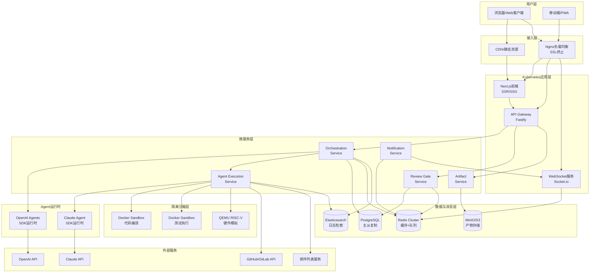
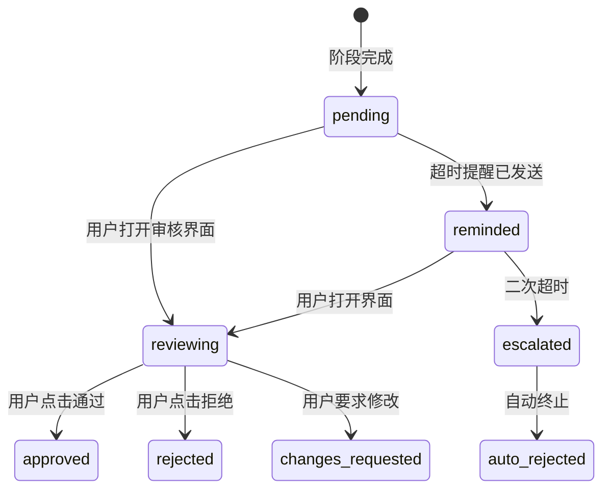
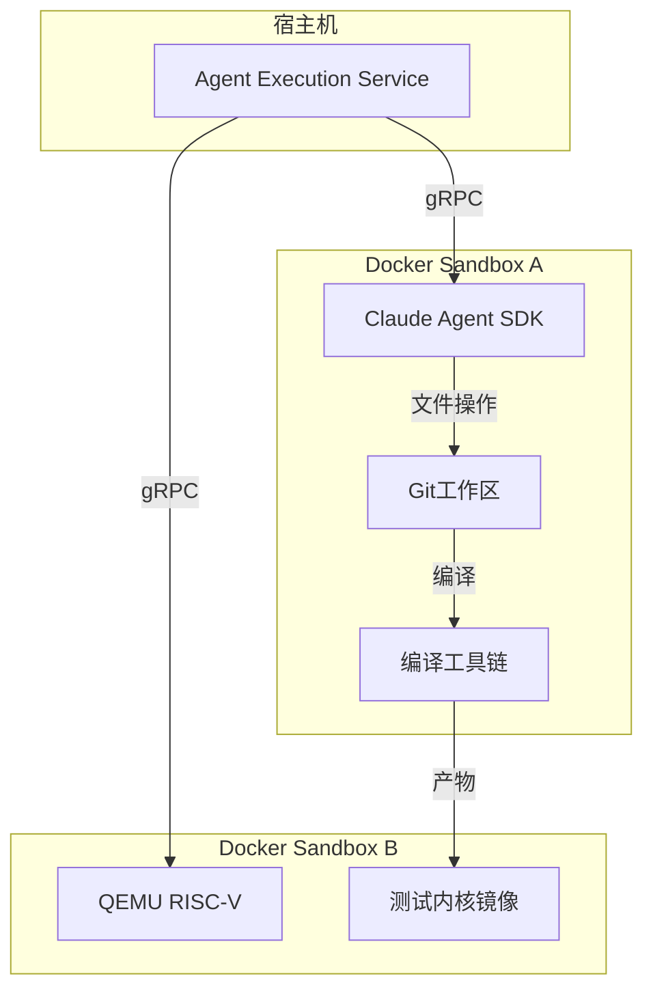
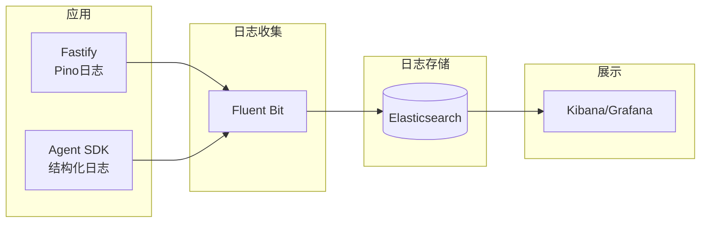

# RV-Insights 系统架构设计

## 1. 架构设计目标

| 目标 | 要求 | 实现方式 |
|------|------|----------|
| **可扩展性** | 支持100+并发Contribution | 微服务 + K8s HPA |
| **可观测性** | 全链路追踪Agent行为 | OpenTelemetry + 结构化日志 |
| **安全性** | Agent沙箱隔离、最小权限 | Docker Sandbox + 细粒度RBAC |
| **可靠性** | 阶段可恢复、人工可接管 | 检查点机制 + 状态机 |
| **多租户** | 用户数据隔离 | PostgreSQL Row-Level Security |

## 2. 整体架构拓扑



## 3. 服务详细设计

### 3.1 Orchestration Service（编排服务）

**职责边界**：
- 唯一持有OpenAI Agents SDK运行时实例
- 管理所有Contribution的状态机流转
- 通过Handoff协调5阶段Agent执行顺序
- 实现Guardrails人工审核暂停逻辑
- 向Redis发布领域事件

**关键设计决策**：
- 单实例运行（状态机一致性要求），通过Redis分布式锁防止脑裂
- 使用BullMQ延迟队列处理审核超时
- 所有Agent调用通过内部gRPC/HTTP向Agent Execution Service发起

```typescript
// 服务接口
interface IOrchestrationService {
  // 启动新Contribution
  startContribution(contributionId: string): Promise<void>

  // 阶段控制
  startStage(contributionId: string, stage: StageType): Promise<StageExecution>
  completeStage(stageExecutionId: string, output: unknown): Promise<void>

  // 审核Gate
  awaitHumanReview(stageExecutionId: string): Promise<void>
  resumeAfterReview(stageExecutionId: string, decision: ReviewDecision): Promise<void>

  // 迭代控制
  startDevReviewIteration(contributionId: string, feedback: string): Promise<void>

  // 查询
  getContributionStatus(contributionId: string): Promise<ContributionStatus>
}
```

### 3.2 Agent Execution Service（Agent执行服务）

**职责边界**：
- 唯一持有Claude Agent SDK运行时实例
- 接收Orchestration Service的Tool Call请求
- 管理Claude Agent Session生命周期（创建、运行、销毁）
- 在隔离沙箱中执行Agent工具调用
- 将工具调用日志异步写入PostgreSQL

**并发模型**：
- 每个Contribution的Agent Session在独立Worker线程中运行
- 最大并发Session数由环境变量控制（默认20）
- 超出并发限制的请求进入Redis队列排队

```typescript
interface IAgentExecutionService {
  // 各Agent执行入口
  executeExplorer(params: ExplorerParams): Promise<ExplorationResult>
  executePlanner(params: PlannerParams): Promise<PlanResult>
  executeDeveloper(params: DeveloperParams): Promise<PatchResult>
  executeReviewer(params: ReviewerParams): Promise<ReviewResult>
  executeTester(params: TesterParams): Promise<TestResult>

  // Session管理
  getSessionStatus(sessionId: string): Promise<AgentSessionStatus>
  abortSession(sessionId: string): Promise<void>
}
```

### 3.3 Review Gate Service（审核门控服务）

**职责边界**：
- 管理人工审核流程生命周期
- 计算审核SLA和超时提醒
- 处理用户审核决策并通知Orchestration Service继续
- 审核历史记录与审计

**审核状态流转**：



### 3.4 Artifact Service（产物服务）

**职责边界**：
- 代码Patch的存储、版本化、Diff生成
- 测试日志和产物管理
- Agent工具调用轨迹的归档
- 支持产物的前缀搜索和过期清理

**存储结构**：

```
minio/rv-insights/
  contributions/
    {contribution_id}/
      patches/
        v1.patch
        v2.patch
        ...
      logs/
        exploration.log
        planning.log
        development_iteration_1.log
        ...
      test-reports/
        test_run_1.xml
        coverage.html
      exports/
        contribution_bundle.zip
```

## 4. 安全架构

### 4.1 Agent沙箱安全

Agent执行的代码编辑、编译、测试操作必须在隔离沙箱中进行：



**沙箱限制**：
- 无网络访问（除预配置的GitHub/邮件列表代理）
- CPU限制：2核
- 内存限制：4GB
- 磁盘限制：10GB
- 执行超时：30分钟自动销毁

### 4.2 LLM API密钥管理

```typescript
// 严禁在代码中硬编码密钥
// 使用Kubernetes Secrets + 运行时注入

interface SecretManager {
  // 从K8s Secret或Vault读取
  getOpenAIKey(): Promise<string>
  getAnthropicKey(): Promise<string>
  getGitHubToken(userId: string): Promise<string>  // 用户级GitHub Token
}

// K8s Secret配置示例
/*
apiVersion: v1
kind: Secret
metadata:
  name: rv-insights-api-keys
  namespace: production
type: Opaque
stringData:
  OPENAI_API_KEY: "sk-proj-xxx"
  ANTHROPIC_API_KEY: "sk-ant-xxx"
*/
```

### 4.3 数据隔离

```sql
-- PostgreSQL Row-Level Security (RLS)
ALTER TABLE contributions ENABLE ROW LEVEL SECURITY;

CREATE POLICY contribution_owner_isolation ON contributions
  FOR ALL
  TO app_user
  USING (user_id = current_setting('app.current_user_id')::UUID);

-- 在应用层设置当前用户ID
SET app.current_user_id = 'user-uuid';
```

## 5. 可观测性架构

### 5.1 日志系统



**日志规范**：
```typescript
interface StructuredLog {
  timestamp: string
  level: 'debug' | 'info' | 'warn' | 'error'
  service: string
  traceId: string
  contributionId?: string
  stageExecutionId?: string
  agentType?: string
  message: string
  metadata: Record<string, unknown>
}
```

### 5.2 指标监控

| 指标类别 | 指标名 | 告警阈值 |
|----------|--------|----------|
| **业务** | contribution_completion_rate | < 80% |
| **业务** | avg_human_review_time | > 24h |
| **Agent** | agent_execution_duration_p99 | > 10min |
| **Agent** | agent_failure_rate | > 5% |
| **系统** | api_request_duration_p95 | > 2s |
| **系统** | db_connection_pool_usage | > 80% |
| **成本** | llm_token_consumption_per_hour | > $50 |

### 5.3 分布式追踪

```typescript
// OpenTelemetry配置
import { NodeSDK } from '@opentelemetry/sdk-node'
import { JaegerExporter } from '@opentelemetry/exporter-jaeger'

const sdk = new NodeSDK({
  traceExporter: new JaegerExporter({
    endpoint: process.env.JAEGER_ENDPOINT
  }),
  instrumentations: [
    new HttpInstrumentation(),
    new RedisInstrumentation(),
    new PostgreSQLInstrumentation()
  ]
})

// 跨服务追踪传递
tracer.startActiveSpan('orchestrate_contribution', async (span) => {
  span.setAttribute('contribution.id', contributionId)

  // HTTP调用Agent Execution Service时自动注入traceparent header
  const result = await agentClient.executeExplorer(params, {
    headers: {
      'traceparent': `00-${span.spanContext().traceId}-${span.spanContext().spanId}-01`
    }
  })

  span.end()
})
```

## 6. 部署架构

### 6.1 Kubernetes部署

```yaml
# k8s/orchestration-service.yaml
apiVersion: apps/v1
kind: Deployment
metadata:
  name: orchestration-service
spec:
  replicas: 1  # 单实例（状态机一致性）
  selector:
    matchLabels:
      app: orchestration-service
  template:
    metadata:
      labels:
        app: orchestration-service
    spec:
      containers:
        - name: orchestration
          image: rv-insights/orchestration:latest
          env:
            - name: DATABASE_URL
              valueFrom:
                secretKeyRef:
                  name: rv-insights-db
                  key: url
            - name: REDIS_URL
              valueFrom:
                secretKeyRef:
                  name: rv-insights-redis
                  key: url
            - name: OPENAI_API_KEY
              valueFrom:
                secretKeyRef:
                  name: rv-insights-api-keys
                  key: OPENAI_API_KEY
          resources:
            requests:
              memory: "512Mi"
              cpu: "500m"
            limits:
              memory: "2Gi"
              cpu: "2000m"
---
# k8s/agent-execution-service.yaml
apiVersion: apps/v1
kind: Deployment
metadata:
  name: agent-execution-service
spec:
  replicas: 3  # 可水平扩展
  selector:
    matchLabels:
      app: agent-execution-service
  template:
    metadata:
      labels:
        app: agent-execution-service
    spec:
      containers:
        - name: agent-execution
          image: rv-insights/agent-execution:latest
          env:
            - name: MAX_CONCURRENT_SESSIONS
              value: "20"
            - name: ANTHROPIC_API_KEY
              valueFrom:
                secretKeyRef:
                  name: rv-insights-api-keys
                  key: ANTHROPIC_API_KEY
          resources:
            requests:
              memory: "1Gi"
              cpu: "1000m"
            limits:
              memory: "4Gi"
              cpu: "4000m"
```

### 6.2 CI/CD流水线

```mermaid
flowchart LR
    A[Developer Push] --> B[GitHub Actions]
    B --> C[Lint + Type Check]
    C --> D[Unit Tests]
    D --> E[Integration Tests]
    E --> F[Build Images]
    F --> G[Push to Registry]
    G --> H[Deploy Staging]
    H --> I[E2E Tests]
    I --> J[Manual Approval]
    J --> K[Deploy Production]
```



### 6.3 数据库迁移策略

```typescript
// 使用Drizzle ORM迁移
import { migrate } from 'drizzle-orm/node-postgres/migrator'

async function runMigrations() {
  const db = createDatabaseConnection()

  // 1. 预检查：验证迁移文件完整性
  await validateMigrationFiles('./drizzle')

  // 2. 在事务中执行迁移
  await db.transaction(async (tx) => {
    await migrate(tx, { migrationsFolder: './drizzle' })
  })

  // 3. 验证迁移后schema一致性
  await verifySchemaIntegrity(db)
}
```

## 7. 容量规划

### 7.1 资源估算（100并发Contribution）

| 组件 | 实例数 | CPU/实例 | 内存/实例 | 存储 |
|------|--------|----------|-----------|------|
| API Gateway | 3 | 1核 | 1GB | - |
| WebSocket服务 | 3 | 1核 | 1GB | - |
| Orchestration Service | 1 | 2核 | 2GB | - |
| Agent Execution Service | 5 | 4核 | 8GB | - |
| Review Gate Service | 2 | 1核 | 1GB | - |
| Artifact Service | 2 | 1核 | 2GB | - |
| PostgreSQL | 2（主从） | 4核 | 16GB | 500GB SSD |
| Redis | 3（集群） | 2核 | 8GB | - |
| MinIO | 4 | 2核 | 4GB | 2TB |
| Elasticsearch | 3 | 4核 | 16GB | 1TB |

### 7.2 LLM成本估算

| Agent类型 | 平均Token/次 | 执行次数/Contribution | 单价 | 单次成本 |
|-----------|-------------|----------------------|------|----------|
| 探索Agent | 50K | 1 | $3/M | $0.15 |
| 规划Agent | 80K | 1 | $15/M | $1.20 |
| 开发Agent | 100K | 2.5（平均迭代） | $3/M | $0.75 |
| 审核Agent | 60K | 2.5 | $6/M | $0.90 |
| 测试Agent | 40K | 1 | $3/M | $0.12 |
| **总计** | - | - | - | **~$3.12** |

**100并发Contribution/天 ≈ $312/天 ≈ $9,360/月**

## 8. 风险与缓解

| 风险 | 影响 | 可能性 | 缓解措施 |
|------|------|--------|----------|
| **LLM API限流/故障** | Agent无法执行 | 中 | 实现指数退避重试；多API Key轮询；降级到本地模型 |
| **Agent幻觉导致错误代码** | 提交低质量Patch | 高 | 审核Agent多层校验；强制人工审核Gate；测试Agent验证 |
| **沙箱逃逸** | 宿主机被攻击 | 低 | gVisor/Kata Containers强化隔离；无root权限；网络隔离 |
| **数据泄露** | 用户GitHub Token泄露 | 低 | K8s Secrets加密；Vault动态凭据；最小权限Token |
| **上下文溢出** | Agent丢失关键信息 | 中 | 自动上下文压缩；检查点机制；关键信息结构化存储 |
| **审核超时** | 任务长时间阻塞 | 中 | 24h超时自动提醒；48h自动暂停；支持转派审核者 |
