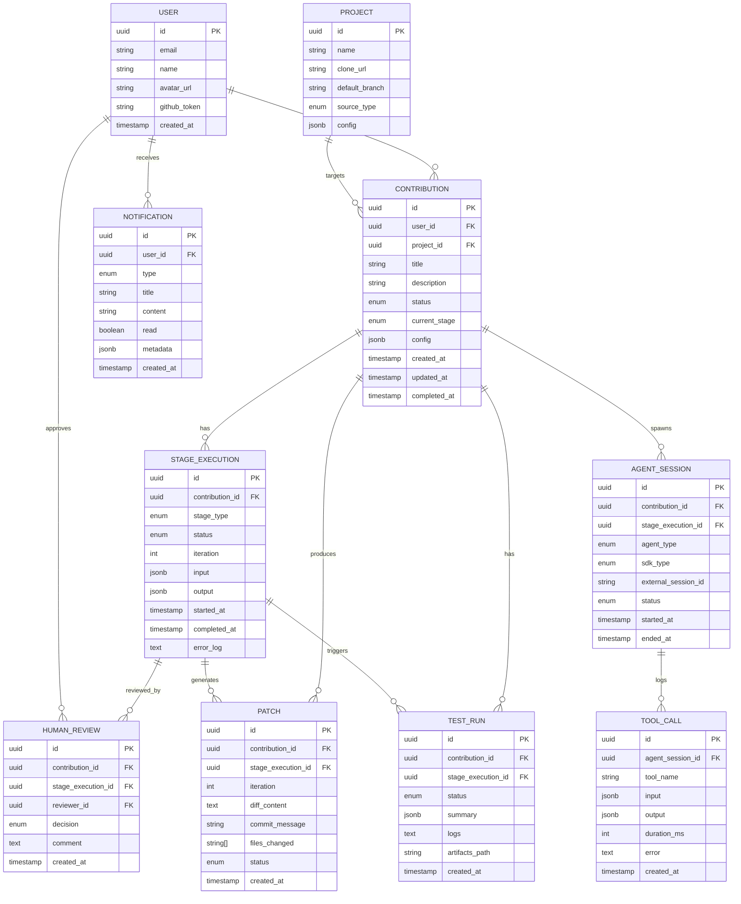
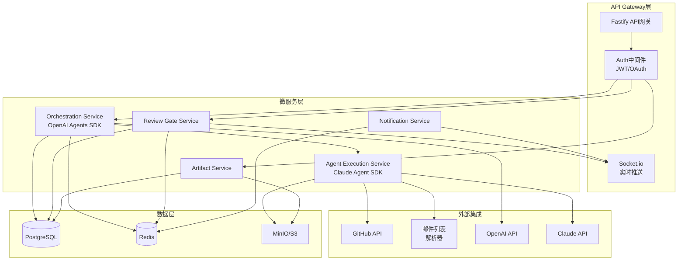
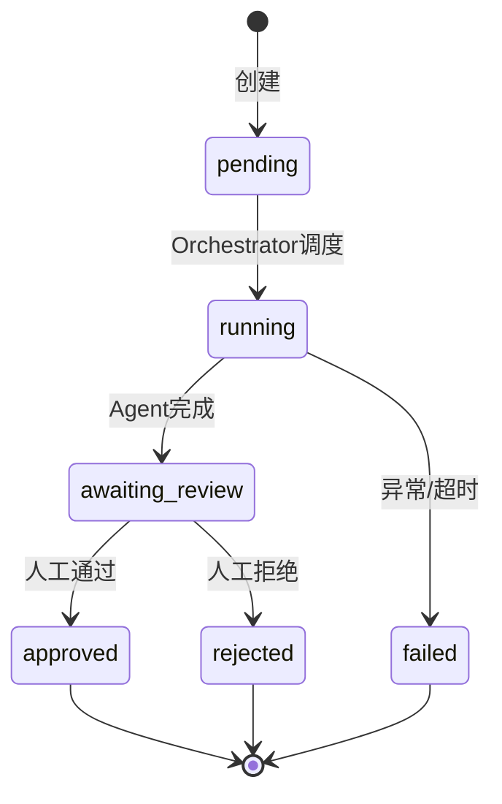
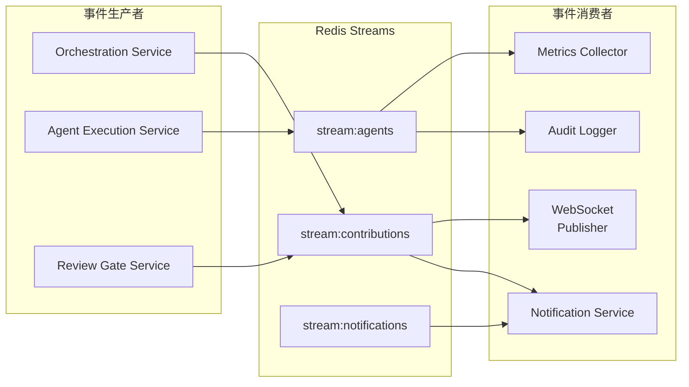
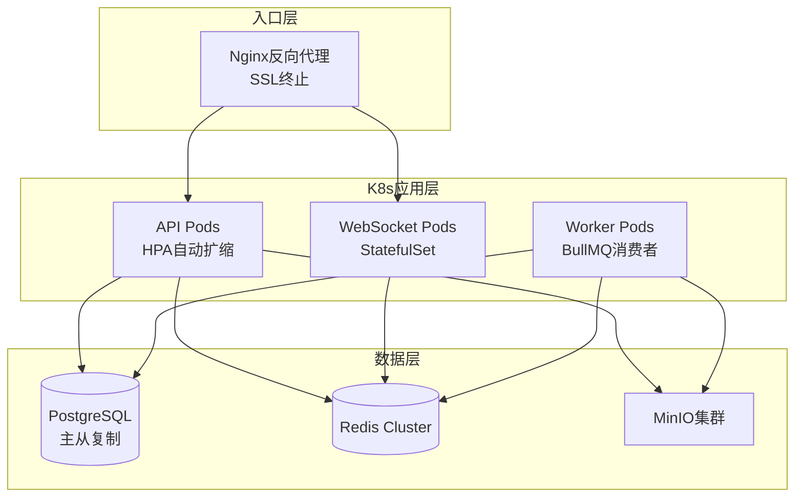

# RV-Insights 后端设计方案

## 1. 技术栈选型

| 层级 | 技术 | 选型理由 |
|------|------|----------|
| 运行时 | Node.js 22 + TypeScript | 前后端统一语言生态；异步IO适合高并发Agent事件流 |
| Web框架 | Fastify | 性能优于Express；原生JSON Schema校验；完善的插件生态 |
| ORM | Drizzle ORM | 类型安全；轻量；原生SQL可读性 |
| 数据库 | PostgreSQL 16 | 主数据持久化；JSONB支持灵活的Agent输出存储 |
| 缓存/队列 | Redis 7 | 缓存热点数据；Redis Streams作为事件总线；Pub/Sub推送WebSocket |
| 文件存储 | MinIO | 兼容S3 API；私有化部署；存储代码补丁、日志、测试报告 |
| 消息队列 | BullMQ (Redis) | 基于Redis的可靠队列；支持延迟任务、重试、优先级 |
| 实时通信 | Socket.io | WebSocket + 降级轮询；房间隔离不同Contribution |
| 测试框架 | Vitest + Supertest | 原生TS支持；集成测试HTTP端点 |
| E2E测试 | Playwright | 模拟完整用户旅程 |

## 2. 领域模型设计

### 2.1 核心实体

```typescript
// 用户
interface User {
  id: string                    // UUID
  email: string
  name: string
  avatarUrl: string | null
  githubToken: string | null    // 加密存储
  createdAt: Date
  updatedAt: Date
}

// 开源项目（RISC-V相关）
interface Project {
  id: string
  name: string                  // 如 "linux-riscv"
  cloneUrl: string
  defaultBranch: string
  sourceType: 'github' | 'gitlab' | 'mailing_list'
  config: {
    buildCommands: string[]
    testCommands: string[]
    lintCommands: string[]
  }
  createdAt: Date
}

// 贡献任务（核心聚合根）
interface Contribution {
  id: string
  userId: string
  projectId: string
  title: string
  description: string | null
  status: ContributionStatus
  currentStage: StageType
  config: ContributionConfig
  createdAt: Date
  updatedAt: Date
  completedAt: Date | null
}

type ContributionStatus = 
  | 'draft'           // 草稿，用户编辑中
  | 'exploring'       // 探索阶段进行中
  | 'exploration_review' // 探索完成，等待人工审核
  | 'planning'        // 规划阶段进行中
  | 'planning_review' // 规划完成，等待人工审核
  | 'developing'      // 开发-审核迭代阶段进行中
  | 'development_review' // 开发迭代完成，等待人工审核
  | 'testing'         // 测试阶段进行中
  | 'testing_review'  // 测试完成，等待最终审核
  | 'completed'       // 全部完成
  | 'rejected'        // 人工拒绝
  | 'failed'          // Agent执行失败

type StageType = 
  | 'exploration'
  | 'planning'
  | 'development'
  | 'testing'

interface ContributionConfig {
  maxIterations: number         // 开发-审核最大迭代次数，默认5
  autoApproveThreshold: number  // 自动通过阈值（审核Agent评分）
  targetBranch: string
  sandboxImage: string          // 测试环境Docker镜像
}

// 阶段执行记录
interface StageExecution {
  id: string
  contributionId: string
  stageType: StageType
  status: StageStatus
  iteration: number             // 开发-审核阶段的迭代计数
  input: unknown                // 阶段输入数据
  output: unknown | null        // 阶段输出数据
  startedAt: Date
  completedAt: Date | null
  errorLog: string | null
}

type StageStatus =
  | 'pending'
  | 'running'
  | 'awaiting_review'
  | 'approved'
  | 'rejected'
  | 'failed'

// 人工审核记录
interface HumanReview {
  id: string
  contributionId: string
  stageExecutionId: string
  reviewerId: string
  decision: 'approve' | 'reject' | 'request_changes'
  comment: string | null
  createdAt: Date
}

// 代码补丁
interface Patch {
  id: string
  contributionId: string
  stageExecutionId: string
  iteration: number
  diffContent: string           // Unified diff格式
  commitMessage: string
  filesChanged: string[]
  status: 'pending_review' | 'approved' | 'rejected'
  createdAt: Date
}

// Agent会话
interface AgentSession {
  id: string
  contributionId: string
  stageExecutionId: string
  agentType: 'explorer' | 'planner' | 'developer' | 'reviewer' | 'tester'
  sdkType: 'openai' | 'claude'
  externalSessionId: string | null  // SDK返回的session ID
  status: 'active' | 'completed' | 'failed'
  startedAt: Date
  endedAt: Date | null
}

// Agent工具调用日志（用于审计和回放）
interface ToolCall {
  id: string
  agentSessionId: string
  toolName: string
  input: unknown
  output: unknown | null
  durationMs: number
  error: string | null
  createdAt: Date
}

// 测试运行
interface TestRun {
  id: string
  contributionId: string
  stageExecutionId: string
  status: 'running' | 'passed' | 'failed' | 'error'
  summary: {
    total: number
    passed: number
    failed: number
    skipped: number
    durationMs: number
  }
  logs: string
  artifactsPath: string | null   // S3路径
  createdAt: Date
}

// 通知
interface Notification {
  id: string
  userId: string
  type: 'stage_completed' | 'review_requested' | 'review_reminder' | 'system'
  title: string
  content: string
  read: boolean
  metadata: Record<string, unknown>
  createdAt: Date
}
```

### 2.2 ER图



## 3. 数据库Schema

```sql
-- 用户表
CREATE TABLE users (
    id UUID PRIMARY KEY DEFAULT gen_random_uuid(),
    email VARCHAR(255) UNIQUE NOT NULL,
    name VARCHAR(100) NOT NULL,
    avatar_url TEXT,
    github_token TEXT,
    created_at TIMESTAMPTZ DEFAULT now(),
    updated_at TIMESTAMPTZ DEFAULT now()
);

-- 项目表
CREATE TABLE projects (
    id UUID PRIMARY KEY DEFAULT gen_random_uuid(),
    name VARCHAR(100) NOT NULL,
    clone_url TEXT NOT NULL,
    default_branch VARCHAR(100) DEFAULT 'main',
    source_type VARCHAR(20) NOT NULL CHECK (source_type IN ('github', 'gitlab', 'mailing_list')),
    config JSONB NOT NULL DEFAULT '{}',
    created_at TIMESTAMPTZ DEFAULT now()
);

-- 贡献任务表
CREATE TABLE contributions (
    id UUID PRIMARY KEY DEFAULT gen_random_uuid(),
    user_id UUID NOT NULL REFERENCES users(id),
    project_id UUID NOT NULL REFERENCES projects(id),
    title VARCHAR(255) NOT NULL,
    description TEXT,
    status VARCHAR(50) NOT NULL DEFAULT 'draft',
    current_stage VARCHAR(50),
    config JSONB NOT NULL DEFAULT '{"maxIterations": 5, "autoApproveThreshold": 0.85}',
    created_at TIMESTAMPTZ DEFAULT now(),
    updated_at TIMESTAMPTZ DEFAULT now(),
    completed_at TIMESTAMPTZ,
    CONSTRAINT valid_status CHECK (status IN (
        'draft', 'exploring', 'exploration_review', 'planning', 'planning_review',
        'developing', 'development_review', 'testing', 'testing_review',
        'completed', 'rejected', 'failed'
    ))
);
CREATE INDEX idx_contributions_user ON contributions(user_id);
CREATE INDEX idx_contributions_status ON contributions(status);
CREATE INDEX idx_contributions_project ON contributions(project_id);

-- 阶段执行表
CREATE TABLE stage_executions (
    id UUID PRIMARY KEY DEFAULT gen_random_uuid(),
    contribution_id UUID NOT NULL REFERENCES contributions(id) ON DELETE CASCADE,
    stage_type VARCHAR(50) NOT NULL CHECK (stage_type IN ('exploration', 'planning', 'development', 'testing')),
    status VARCHAR(50) NOT NULL DEFAULT 'pending',
    iteration INT NOT NULL DEFAULT 0,
    input JSONB,
    output JSONB,
    started_at TIMESTAMPTZ DEFAULT now(),
    completed_at TIMESTAMPTZ,
    error_log TEXT,
    CONSTRAINT valid_stage_status CHECK (status IN ('pending', 'running', 'awaiting_review', 'approved', 'rejected', 'failed'))
);
CREATE INDEX idx_stage_exec_contribution ON stage_executions(contribution_id);
CREATE INDEX idx_stage_exec_status ON stage_executions(status);

-- 人工审核表
CREATE TABLE human_reviews (
    id UUID PRIMARY KEY DEFAULT gen_random_uuid(),
    contribution_id UUID NOT NULL REFERENCES contributions(id) ON DELETE CASCADE,
    stage_execution_id UUID NOT NULL REFERENCES stage_executions(id),
    reviewer_id UUID NOT NULL REFERENCES users(id),
    decision VARCHAR(20) NOT NULL CHECK (decision IN ('approve', 'reject', 'request_changes')),
    comment TEXT,
    created_at TIMESTAMPTZ DEFAULT now()
);
CREATE INDEX idx_reviews_contribution ON human_reviews(contribution_id);

-- 代码补丁表
CREATE TABLE patches (
    id UUID PRIMARY KEY DEFAULT gen_random_uuid(),
    contribution_id UUID NOT NULL REFERENCES contributions(id) ON DELETE CASCADE,
    stage_execution_id UUID NOT NULL REFERENCES stage_executions(id),
    iteration INT NOT NULL DEFAULT 1,
    diff_content TEXT NOT NULL,
    commit_message TEXT NOT NULL,
    files_changed TEXT[] NOT NULL DEFAULT '{}',
    status VARCHAR(50) NOT NULL DEFAULT 'pending_review',
    created_at TIMESTAMPTZ DEFAULT now(),
    CONSTRAINT valid_patch_status CHECK (status IN ('pending_review', 'approved', 'rejected'))
);
CREATE INDEX idx_patches_contribution ON patches(contribution_id);

-- Agent会话表
CREATE TABLE agent_sessions (
    id UUID PRIMARY KEY DEFAULT gen_random_uuid(),
    contribution_id UUID NOT NULL REFERENCES contributions(id) ON DELETE CASCADE,
    stage_execution_id UUID NOT NULL REFERENCES stage_executions(id),
    agent_type VARCHAR(50) NOT NULL CHECK (agent_type IN ('explorer', 'planner', 'developer', 'reviewer', 'tester')),
    sdk_type VARCHAR(20) NOT NULL CHECK (sdk_type IN ('openai', 'claude')),
    external_session_id TEXT,
    status VARCHAR(20) NOT NULL DEFAULT 'active',
    started_at TIMESTAMPTZ DEFAULT now(),
    ended_at TIMESTAMPTZ
);
CREATE INDEX idx_agent_sess_contribution ON agent_sessions(contribution_id);

-- 工具调用日志表
CREATE TABLE tool_calls (
    id UUID PRIMARY KEY DEFAULT gen_random_uuid(),
    agent_session_id UUID NOT NULL REFERENCES agent_sessions(id) ON DELETE CASCADE,
    tool_name VARCHAR(100) NOT NULL,
    input JSONB NOT NULL,
    output JSONB,
    duration_ms INT NOT NULL DEFAULT 0,
    error TEXT,
    created_at TIMESTAMPTZ DEFAULT now()
);
CREATE INDEX idx_tool_calls_session ON tool_calls(agent_session_id);
CREATE INDEX idx_tool_calls_created ON tool_calls(created_at);

-- 测试运行表
CREATE TABLE test_runs (
    id UUID PRIMARY KEY DEFAULT gen_random_uuid(),
    contribution_id UUID NOT NULL REFERENCES contributions(id) ON DELETE CASCADE,
    stage_execution_id UUID NOT NULL REFERENCES stage_executions(id),
    status VARCHAR(20) NOT NULL DEFAULT 'running',
    summary JSONB NOT NULL DEFAULT '{}',
    logs TEXT,
    artifacts_path TEXT,
    created_at TIMESTAMPTZ DEFAULT now(),
    CONSTRAINT valid_test_status CHECK (status IN ('running', 'passed', 'failed', 'error'))
);

-- 通知表
CREATE TABLE notifications (
    id UUID PRIMARY KEY DEFAULT gen_random_uuid(),
    user_id UUID NOT NULL REFERENCES users(id) ON DELETE CASCADE,
    type VARCHAR(50) NOT NULL,
    title VARCHAR(255) NOT NULL,
    content TEXT NOT NULL,
    read BOOLEAN NOT NULL DEFAULT false,
    metadata JSONB NOT NULL DEFAULT '{}',
    created_at TIMESTAMPTZ DEFAULT now()
);
CREATE INDEX idx_notifications_user ON notifications(user_id, read);
```

## 4. 服务架构

### 4.1 服务划分



### 4.2 各服务职责

#### Orchestration Service

- 唯一持有OpenAI Agents SDK运行时
- 管理Contribution全生命周期状态机
- 通过Handoff协调各阶段Agent
- 在Guardrail中实现人工审核暂停逻辑
- 向Redis发布领域事件

#### Agent Execution Service

- 唯一持有Claude Agent SDK运行时
- 接收Orchestration Service的任务调用
- 管理Claude Agent Session生命周期
- 执行具体的探索/规划/开发/测试操作
- 将工具调用日志写入PostgreSQL

#### Review Gate Service

- 管理人工审核流程
- 计算并维护审核超时提醒
- 处理用户的approve/reject/request_changes决策
- 审核通过后向Orchestration Service发送继续信号

#### Artifact Service

- 管理代码补丁、日志、测试报告等产物
- 提供产物上传/下载/版本化接口
- 与MinIO/S3交互

#### Notification Service

- 监听Redis事件流
- 生成用户通知（站内、邮件）
- 通过WebSocket推送实时消息

## 5. API设计

### 5.1 RESTful端点

#### 贡献任务管理

```
POST   /api/v1/contributions              // 创建贡献任务
GET    /api/v1/contributions              // 列表查询（分页+筛选）
GET    /api/v1/contributions/:id          // 详情获取
PATCH  /api/v1/contributions/:id          // 更新配置
DELETE /api/v1/contributions/:id          // 删除草稿
POST   /api/v1/contributions/:id/start    // 启动探索阶段
```

**创建请求示例：**
```json
{
  "projectId": "uuid",
  "title": "修复RISC-V内核SMP启动竞态条件",
  "description": "用户提供的初始线索...",
  "config": {
    "maxIterations": 5,
    "autoApproveThreshold": 0.85,
    "targetBranch": "main",
    "sandboxImage": "rv-insights/riscv-build:latest"
  }
}
```

**详情响应示例：**
```json
{
  "id": "uuid",
  "title": "修复RISC-V内核SMP启动竞态条件",
  "status": "exploration_review",
  "currentStage": "exploration",
  "stages": [
    {
      "id": "uuid",
      "stageType": "exploration",
      "status": "awaiting_review",
      "iteration": 0,
      "output": {
        "candidates": [
          {
            "title": "修复smp_boot竞争条件",
            "confidence": 0.92,
            "source": "linux-riscv邮件列表",
            "description": "..."
          }
        ]
      },
      "startedAt": "2026-04-24T08:00:00Z",
      "completedAt": "2026-04-24T08:15:00Z"
    }
  ],
  "createdAt": "2026-04-24T08:00:00Z",
  "updatedAt": "2026-04-24T08:15:00Z"
}
```

#### 人工审核

```
POST /api/v1/contributions/:id/review     // 提交审核决定
GET  /api/v1/contributions/:id/reviews    // 获取审核历史
```

**审核请求示例：**
```json
{
  "stageExecutionId": "uuid",
  "decision": "approve",
  "comment": "选择第一个候选点，请继续规划"
}
```

#### 代码补丁

```
GET /api/v1/contributions/:id/patches           // 获取补丁列表
GET /api/v1/contributions/:id/patches/:id       // 获取补丁详情
GET /api/v1/contributions/:id/patches/:id/diff  // 获取纯diff文本
```

#### Agent日志

```
GET /api/v1/contributions/:id/sessions          // 获取Agent会话列表
GET /api/v1/sessions/:id/tool-calls             // 获取工具调用日志（分页）
GET /api/v1/sessions/:id/stream                 // SSE实时流
```

#### 测试报告

```
GET /api/v1/contributions/:id/test-runs         // 测试运行列表
GET /api/v1/test-runs/:id                       // 测试详情
GET /api/v1/test-runs/:id/artifacts             // 下载测试产物
```

### 5.2 WebSocket事件

```typescript
// 服务器 -> 客户端
interface ServerEvents {
  'contribution:status': {
    contributionId: string
    status: ContributionStatus
    currentStage: StageType
    message: string
    timestamp: Date
  }
  'stage:started': {
    contributionId: string
    stageExecutionId: string
    stageType: StageType
    iteration: number
  }
  'stage:completed': {
    contributionId: string
    stageExecutionId: string
    stageType: StageType
    output: unknown
  }
  'stage:awaiting_review': {
    contributionId: string
    stageExecutionId: string
    stageType: StageType
    reviewUrl: string
  }
  'agent:tool_call': {
    contributionId: string
    agentType: string
    toolName: string
    input: unknown
    timestamp: Date
  }
  'agent:log': {
    contributionId: string
    level: 'info' | 'warn' | 'error'
    message: string
    timestamp: Date
  }
}

// 客户端 -> 服务器
interface ClientEvents {
  'room:join': { contributionId: string }
  'room:leave': { contributionId: string }
  'review:submit': {
    contributionId: string
    stageExecutionId: string
    decision: 'approve' | 'reject' | 'request_changes'
    comment?: string
  }
}
```

## 6. 状态机设计

### 6.1 Contribution生命周期

```mermaid
stateDiagram-v2
    [*] --> draft: 创建
    draft --> exploring: 用户启动
    exploring --> exploration_review: 探索完成
    exploration_review --> planning: 审核通过
    exploration_review --> rejected: 审核拒绝
    planning --> planning_review: 规划完成
    planning_review --> developing: 审核通过
    planning_review --> rejected: 审核拒绝
    developing --> development_review: 迭代完成
    development_review --> developing: 审核要求修改
    development_review --> testing: 审核通过
    development_review --> rejected: 审核拒绝
    testing --> testing_review: 测试完成
    testing_review --> testing: 审核要求重测
    testing_review --> completed: 最终审核通过
    testing_review --> rejected: 审核拒绝
    exploring --> failed: Agent错误
    planning --> failed: Agent错误
    developing --> failed: Agent错误/超轮次
    testing --> failed: Agent错误
    failed --> [*]
    rejected --> [*]
    completed --> [*]
```



### 6.2 StageExecution状态机



## 7. 事件驱动设计

### 7.1 核心领域事件

```typescript
// 事件基础接口
interface DomainEvent {
  id: string
  type: string
  aggregateId: string
  payload: unknown
  occurredAt: Date
}

// 阶段事件
interface StageStartedEvent extends DomainEvent {
  type: 'stage.started'
  payload: {
    contributionId: string
    stageExecutionId: string
    stageType: StageType
    iteration: number
  }
}

interface StageCompletedEvent extends DomainEvent {
  type: 'stage.completed'
  payload: {
    contributionId: string
    stageExecutionId: string
    stageType: StageType
    output: unknown
  }
}

interface StageAwaitingReviewEvent extends DomainEvent {
  type: 'stage.awaiting_review'
  payload: {
    contributionId: string
    stageExecutionId: string
    stageType: StageType
    output: unknown
  }
}

interface ReviewSubmittedEvent extends DomainEvent {
  type: 'review.submitted'
  payload: {
    contributionId: string
    stageExecutionId: string
    reviewerId: string
    decision: 'approve' | 'reject' | 'request_changes'
  }
}

interface ContributionCompletedEvent extends DomainEvent {
  type: 'contribution.completed'
  payload: {
    contributionId: string
    finalPatchId: string | null
  }
}

// Agent事件
interface AgentSessionStartedEvent extends DomainEvent {
  type: 'agent.session_started'
  payload: {
    contributionId: string
    agentSessionId: string
    agentType: string
    sdkType: string
  }
}

interface AgentToolCalledEvent extends DomainEvent {
  type: 'agent.tool_called'
  payload: {
    agentSessionId: string
    toolName: string
    input: unknown
    durationMs: number
  }
}
```

### 7.2 事件流架构



### 7.3 事件处理器实现

```typescript
// 事件消费者接口
interface EventConsumer {
  stream: string
  group: string
  handler: (event: DomainEvent) => Promise<void>
}

// 通知服务消费者
const notificationConsumer: EventConsumer = {
  stream: 'stream:contributions',
  group: 'notification-service',
  handler: async (event) => {
    switch (event.type) {
      case 'stage.awaiting_review': {
        const { contributionId, stageType } = event.payload as any
        const contribution = await db.contributions.findById(contributionId)
        await notificationService.create({
          userId: contribution.userId,
          type: 'review_requested',
          title: `审核请求: ${stageType}阶段完成`,
          content: `贡献任务"${contribution.title}"的${stageType}阶段已完成，请进行人工审核。`,
          metadata: { contributionId, stageExecutionId: event.payload.stageExecutionId }
        })
        break
      }
      case 'contribution.completed': {
        // 发送完成通知
        break
      }
    }
  }
}
```

## 8. 安全设计

### 8.1 认证与授权

```typescript
// JWT Token结构
interface AccessToken {
  sub: string        // userId
  email: string
  role: 'user' | 'admin'
  iat: number
  exp: number
}

// 权限中间件
function requireAuth(request: FastifyRequest, reply: FastifyReply) {
  const token = request.headers.authorization?.replace('Bearer ', '')
  if (!token) {
    return reply.status(401).send({ error: 'Unauthorized' })
  }
  try {
    request.user = jwt.verify(token, process.env.JWT_SECRET!) as AccessToken
  } catch {
    return reply.status(401).send({ error: 'Invalid token' })
  }
}

// 资源所有权校验
function requireOwnership(
  fetchOwner: (id: string) => Promise<{ userId: string }>
) {
  return async (request: FastifyRequest, reply: FastifyReply) => {
    const resource = await fetchOwner(request.params.id)
    if (resource.userId !== request.user.sub) {
      return reply.status(403).send({ error: 'Forbidden' })
    }
  }
}
```

### 8.2 输入校验

所有API端点使用Zod进行严格校验：

```typescript
import { z } from 'zod'

const CreateContributionSchema = z.object({
  projectId: z.string().uuid(),
  title: z.string().min(1).max(255),
  description: z.string().max(5000).optional(),
  config: z.object({
    maxIterations: z.number().int().min(1).max(10).default(5),
    autoApproveThreshold: z.number().min(0).max(1).default(0.85),
    targetBranch: z.string().default('main'),
    sandboxImage: z.string().min(1)
  }).default({})
})

type CreateContributionDto = z.infer<typeof CreateContributionSchema>
```

### 8.3 密钥管理

```typescript
// 严禁硬编码凭据
const requiredEnvVars = [
  'DATABASE_URL',
  'REDIS_URL',
  'OPENAI_API_KEY',
  'ANTHROPIC_API_KEY',
  'JWT_SECRET',
  'MINIO_ENDPOINT',
  'MINIO_ACCESS_KEY',
  'MINIO_SECRET_KEY'
] as const

function validateEnv(): void {
  const missing = requiredEnvVars.filter((key) => !process.env[key])
  if (missing.length > 0) {
    throw new Error(`Missing required environment variables: ${missing.join(', ')}`)
  }
}
```

## 9. 部署架构


