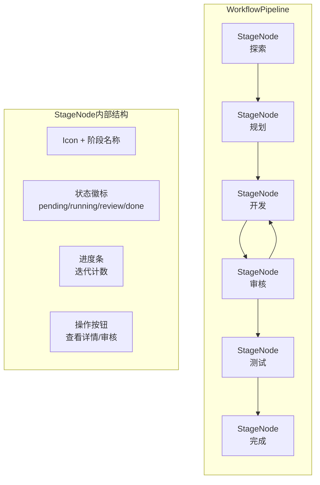
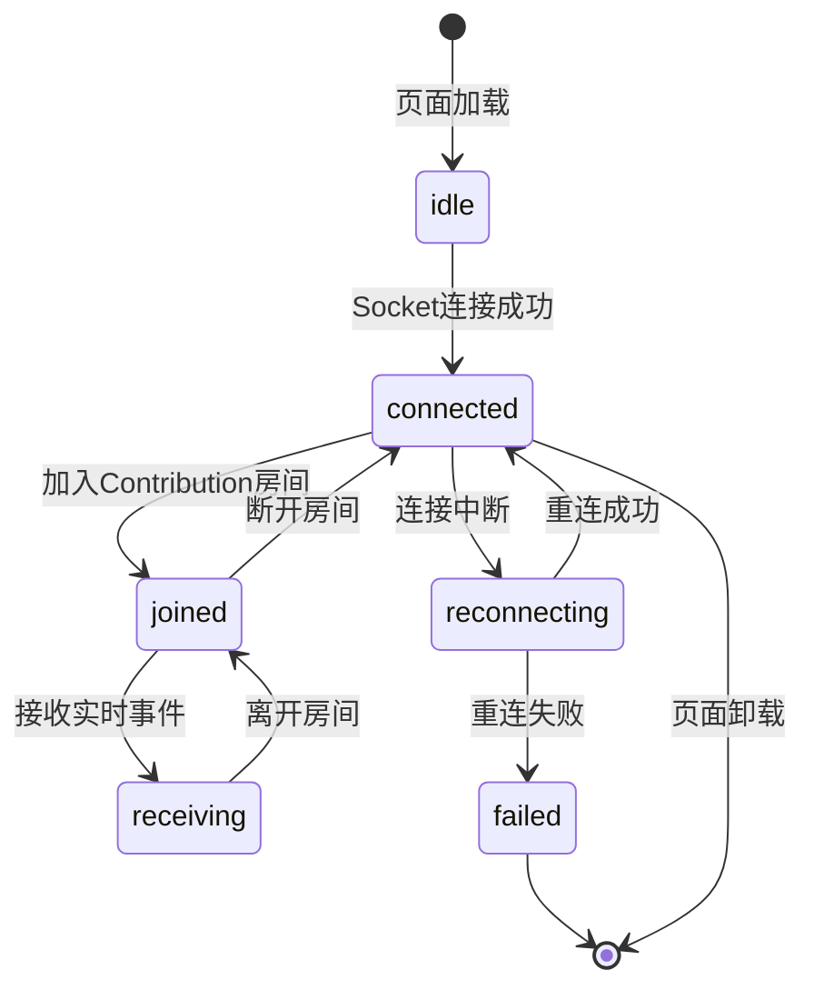
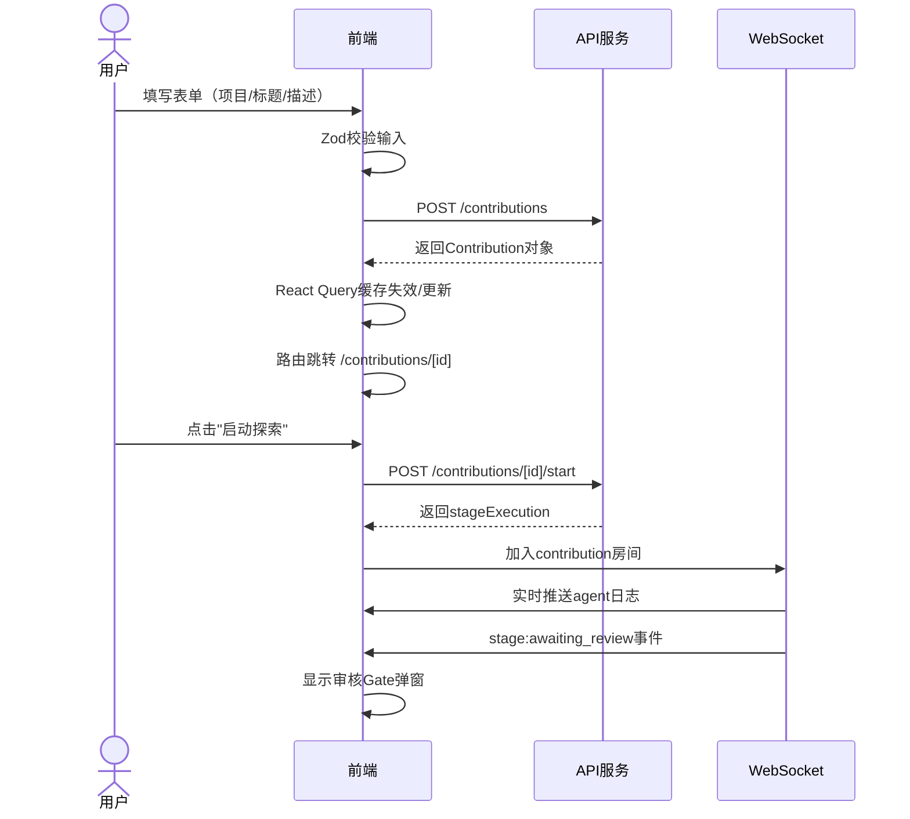
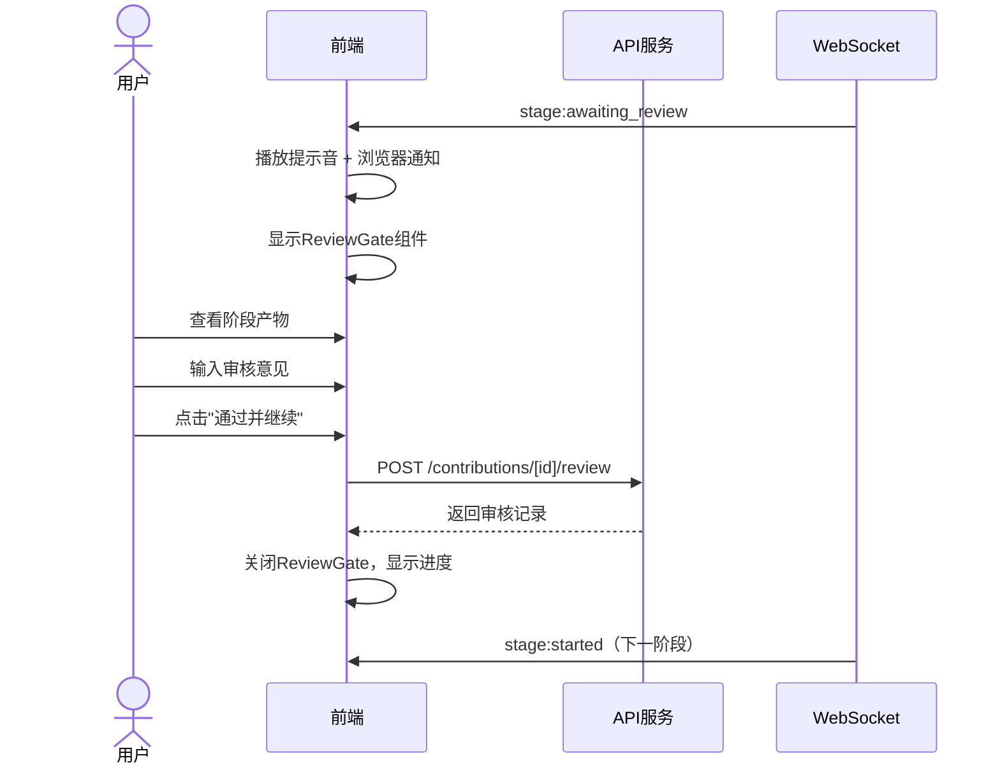
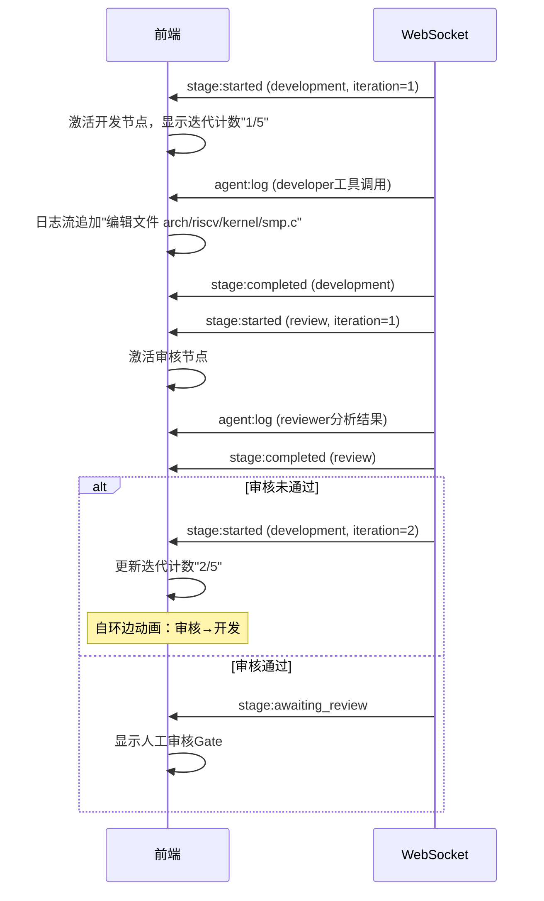

# RV-Insights 前端设计方案

## 1. 技术栈选型

| 层级 | 技术 | 选型理由 |
|------|------|----------|
| 框架 | **Next.js 15** (App Router) | SSR/SSG支持利于SEO；API Routes可封装BFF层；Vercel生态成熟 |
| 语言 | TypeScript 5.6 | 全链路类型安全；与后端共用DTO类型定义 |
| UI库 | **Tailwind CSS** + **shadcn/ui** | 原子化CSS开发高效；shadcn组件可源码定制，无样式锁定 |
| 状态管理 | **Zustand** + **React Query (TanStack Query)** | Zustand轻量无样板；React Query处理服务端状态缓存、轮询、乐观更新 |
| 实时通信 | **Socket.io-client** | 自动重连、事件命名空间、与后端Socket.io完美对接 |
| 代码Diff | **react-diff-viewer** | 支持Unified Diff高亮、行级评论锚点 |
| 流程图 | **@xyflow/react** (React Flow) | 可交互的工作流图；支持自定义节点、边动画、拖拽布局 |
| 表单 | **React Hook Form** + **Zod** | 性能优（非受控组件）；ZodResolver实现前后端校验逻辑复用 |
| 测试 | **Vitest** + **React Testing Library** + **Playwright** | 单元+集成+E2E全覆盖 |

### 不选Redux的理由
Zustand在2026年已成为React状态管理的事实标准，相比Redux：
- 代码量减少60%以上
- 无需写Action/Reducer样板
- 天然支持异步逻辑和中间件
- TypeScript推导更优雅

## 2. 项目结构

```
app/
├── (dashboard)/                    # 路由组：Dashboard布局
│   ├── contributions/
│   │   ├── page.tsx                # 贡献任务列表
│   │   ├── [id]/
│   │   │   ├── page.tsx            # 贡献任务详情（工作流主页面）
│   │   │   ├── layout.tsx          # 详情页布局（侧边栏+主内容）
│   │   │   ├── review/
│   │   │   │   └── page.tsx        # 审核界面
│   │   │   ├── patches/
│   │   │   │   └── page.tsx        # 代码补丁查看
│   │   │   └── logs/
│   │   │       └── page.tsx        # Agent日志
│   │   └── new/
│   │       └── page.tsx            # 新建贡献任务
│   ├── projects/
│   │   └── page.tsx                # 项目管理
│   ├── notifications/
│   │   └── page.tsx                # 通知中心
│   └── layout.tsx                  # Dashboard根布局
├── api/                            # Next.js API Routes (BFF)
│   └── ...
├── layout.tsx                      # 根布局
└── page.tsx                        # 登录页/首页

components/
├── ui/                             # shadcn/ui 基础组件
├── workflow/                       # 工作流相关组件
├── review/                         # 审核相关组件
├── diff/                           # 代码Diff组件
├── agent/                          # Agent日志/状态组件
└── dashboard/                      # Dashboard通用组件

lib/
├── api.ts                          # Axios/Fetch封装
├── socket.ts                       # Socket.io客户端封装
├── store/                          # Zustand状态定义
├── types/                          # 类型定义（与后端共享）
├── hooks/                          # 自定义React Hooks
└── utils.ts                        # 工具函数

styles/
└── globals.css                     # Tailwind入口 + 自定义变量
```

## 3. 页面与路由设计

| 路由 | 页面 | 权限 | 说明 |
|------|------|------|------|
| `/` | 登录/欢迎页 | 公开 | OAuth登录入口 |
| `/contributions` | 任务列表 | 登录用户 | 卡片/表格视图，支持筛选 |
| `/contributions/new` | 新建任务 | 登录用户 | 引导式表单 |
| `/contributions/[id]` | 任务详情 | 所有者 | **核心页面**：工作流可视化+实时状态 |
| `/contributions/[id]/review` | 审核界面 | 所有者 | 阶段产物审核 |
| `/contributions/[id]/patches` | 补丁查看 | 所有者 | 代码Diff+行级评论 |
| `/contributions/[id]/logs` | Agent日志 | 所有者 | 流式日志查看 |
| `/projects` | 项目列表 | 登录用户 | 管理目标开源项目 |
| `/notifications` | 通知中心 | 登录用户 | 未读通知、审核提醒 |

## 4. 核心组件架构

### 4.1 工作流可视化组件（WorkflowPipeline）



**组件接口：**
```typescript
interface StageNodeProps {
  stage: {
    id: string
    type: 'exploration' | 'planning' | 'development' | 'testing'
    status: 'pending' | 'running' | 'awaiting_review' | 'approved' | 'rejected'
    iteration: number
    maxIterations: number
    startedAt: string | null
    completedAt: string | null
  }
  isActive: boolean
  onReview: () => void
  onViewDetail: () => void
}

interface WorkflowPipelineProps {
  stages: StageNodeProps['stage'][]
  currentStageIndex: number
  onStageClick: (stageId: string) => void
}
```

**实现要点：**
- 使用React Flow的`@xyflow/react`绘制可交互流程图
- 开发→审核→开发的迭代循环用自环边（self-loop edge）可视化
- 当前激活阶段脉冲动画；待审核阶段闪烁提醒
- 点击节点展开抽屉（Sheet组件）显示阶段详情

### 4.2 代码Review组件（PatchViewer）

```typescript
interface PatchViewerProps {
  patch: {
    id: string
    diffContent: string
    commitMessage: string
    filesChanged: string[]
    iteration: number
  }
  reviewComments: ReviewComment[]
  onAddComment: (lineNumber: number, content: string) => void
  onApprove: () => void
  onRequestChanges: () => void
}

interface ReviewComment {
  id: string
  lineNumber: number
  content: string
  author: string
  createdAt: string
}
```

**实现要点：**
- 基于`react-diff-viewer`或自研Diff渲染器
- 左侧显示文件树（filesChanged），右侧显示选中文件的diff
- 支持Unified Diff语法高亮（C/C++、Rust、Assembly等RISC-V常用语言）
- 行级评论通过浮动按钮触发，评论锚定在具体代码行
- 迭代对比：可并排查看第N轮和第N+1轮patch的差异

### 4.3 Agent实时日志组件（AgentLogStream）

```typescript
interface AgentLogStreamProps {
  contributionId: string
  maxHeight?: number
}

type LogEntry = {
  id: string
  timestamp: string
  level: 'info' | 'think' | 'tool' | 'warn' | 'error'
  agentType?: string
  message: string
  metadata?: Record<string, unknown>
}
```

**实现要点：**
- 通过WebSocket接收实时日志流
- 按Agent类型和日志级别分色显示
- `think`级别日志（Claude的Extended Thinking）可折叠展开
- `tool`级别日志显示工具调用输入/输出，可展开查看JSON
- 自动滚动到底部，用户上滑查看历史时暂停自动滚动
- 支持日志搜索过滤

### 4.4 人工审核Gate组件（ReviewGate）

```typescript
interface ReviewGateProps {
  stageExecution: {
    id: string
    stageType: string
    status: 'awaiting_review'
    output: unknown
  }
  onApprove: (comment?: string) => void
  onReject: (reason: string) => void
  onRequestChanges: (feedback: string) => void
  timeElapsed: number  // 已等待审核的秒数
}
```

**UI布局（ASCII原型）：**
```
+--------------------------------------------------+
|  ⚠️ 审核请求: 探索阶段完成                          |
|  贡献任务: 修复RISC-V内核SMP启动竞态条件             |
+--------------------------------------------------+
|                                                   |
|  [候选贡献点列表]                                   |
|  ┌──────────────────────────────────────────┐    |
|  │ 1. 修复smp_boot竞争条件 (置信度: 92%)      │    |
|  │    来源: linux-riscv邮件列表               │    |
|  │    [查看详情]                              │    |
|  └──────────────────────────────────────────┘    |
|  ┌──────────────────────────────────────────┐    |
|  │ 2. 优化riscv_spinlock实现 (置信度: 78%)    │    |
|  │    来源: GitHub Issue #1245                │    |
|  │    [查看详情]                              │    |
|  └──────────────────────────────────────────┘    |
|                                                   |
|  备注: Agent验证了候选点1的可行性，详见日志。        |
|                                                   |
+--------------------------------------------------+
|  [✅ 通过并继续]  [📝 要求修改]  [❌ 拒绝并终止]    |
+--------------------------------------------------+
|  您的审核意见 (选填):                               |
|  ┌──────────────────────────────────────────┐    |
|  │                                          │    |
|  │                                          │    |
|  └──────────────────────────────────────────┘    |
+--------------------------------------------------+
```

### 4.5 Dashboard布局

```typescript
// app/(dashboard)/layout.tsx
export default function DashboardLayout({ children }: { children: React.ReactNode }) {
  return (
    <div className="flex h-screen bg-background">
      <Sidebar />
      <div className="flex-1 flex flex-col overflow-hidden">
        <TopBar />
        <main className="flex-1 overflow-auto p-6">
          {children}
        </main>
      </div>
    </div>
  )
}
```

**Sidebar导航：**
- 工作流看板（/contributions）
- 新建任务（/contributions/new）
- 项目管理（/projects）
- 通知中心（带未读徽章）

## 5. 状态管理设计

### 5.1 Zustand Store划分

```typescript
// stores/auth-store.ts
interface AuthState {
  user: User | null
  isLoading: boolean
  login: (token: string) => Promise<void>
  logout: () => void
}

// stores/contribution-store.ts
interface ContributionState {
  contributions: Contribution[]
  activeContribution: Contribution | null
  isLoading: boolean
  setActiveContribution: (id: string) => void
  updateContributionStatus: (id: string, status: ContributionStatus) => void
}

// stores/workflow-store.ts
interface WorkflowState {
  stages: StageExecution[]
  currentStageId: string | null
  agentLogs: LogEntry[]
  isStreaming: boolean
  appendLogs: (entries: LogEntry[]) => void
  clearLogs: () => void
}

// stores/review-store.ts
interface ReviewState {
  pendingReviews: StageExecution[]
  reviewHistory: HumanReview[]
  submitReview: (params: SubmitReviewParams) => Promise<void>
}

// stores/socket-store.ts
interface SocketState {
  socket: Socket | null
  isConnected: boolean
  joinRoom: (contributionId: string) => void
  leaveRoom: (contributionId: string) => void
}
```

### 5.2 React Query配置

```typescript
// lib/query-client.ts
import { QueryClient } from '@tanstack/react-query'

export const queryClient = new QueryClient({
  defaultOptions: {
    queries: {
      staleTime: 1000 * 60 * 5,    // 5分钟视为新鲜
      retry: 2,
      refetchOnWindowFocus: false,
    },
  },
})

// hooks/use-contribution.ts
export function useContribution(id: string) {
  return useQuery({
    queryKey: ['contributions', id],
    queryFn: () => api.get(`/contributions/${id}`),
    refetchInterval: (data) => 
      data?.status?.includes('running') ? 3000 : false,
  })
}

// hooks/use-patches.ts
export function usePatches(contributionId: string) {
  return useQuery({
    queryKey: ['contributions', contributionId, 'patches'],
    queryFn: () => api.get(`/contributions/${contributionId}/patches`),
  })
}
```

## 6. 实时通信设计

### 6.1 Socket.io客户端封装

```typescript
// lib/socket.ts
import { io, Socket } from 'socket.io-client'
import { useEffect } from 'react'

class SocketClient {
  private socket: Socket | null = null

  connect(token: string) {
    this.socket = io(process.env.NEXT_PUBLIC_WS_URL!, {
      auth: { token },
      transports: ['websocket'],
      reconnection: true,
      reconnectionDelay: 1000,
      reconnectionAttempts: 5,
    })

    this.socket.on('connect', () => {
      console.log('WebSocket connected')
    })

    this.socket.on('connect_error', (err) => {
      console.error('WebSocket error:', err)
    })

    return this.socket
  }

  joinContribution(contributionId: string) {
    this.socket?.emit('room:join', { contributionId })
  }

  leaveContribution(contributionId: string) {
    this.socket?.emit('room:leave', { contributionId })
  }

  onAgentLog(callback: (log: LogEntry) => void) {
    this.socket?.on('agent:log', callback)
  }

  onStageStatus(callback: (status: StageStatusEvent) => void) {
    this.socket?.on('contribution:status', callback)
  }

  onAwaitingReview(callback: (event: AwaitingReviewEvent) => void) {
    this.socket?.on('stage:awaiting_review', callback)
  }

  disconnect() {
    this.socket?.disconnect()
    this.socket = null
  }
}

export const socketClient = new SocketClient()

// hooks/use-realtime.ts
export function useRealtime(contributionId: string) {
  const queryClient = useQueryClient()

  useEffect(() => {
    socketClient.joinContribution(contributionId)

    socketClient.onStageStatus((event) => {
      // 乐观更新React Query缓存
      queryClient.setQueryData(
        ['contributions', contributionId],
        (old: Contribution | undefined) => 
          old ? { ...old, status: event.status } : old
      )
    })

    socketClient.onAwaitingReview((event) => {
      // 播放提示音/显示浏览器通知
      showBrowserNotification('审核请求', '有阶段等待您的审核')
    })

    return () => {
      socketClient.leaveContribution(contributionId)
    }
  }, [contributionId, queryClient])
}
```

### 6.2 事件处理状态机



## 7. 关键交互流程

### 7.1 创建贡献任务 → 启动探索



### 7.2 人工审核交互



### 7.3 开发-审核迭代可视化



## 8. UI/UX设计规范

### 8.1 色彩系统

```css
:root {
  /* 主色调 */
  --primary: 221.2 83.2% 53.3%;        /* 蓝色 - 主操作 */
  --primary-foreground: 210 40% 98%;

  /* 阶段状态色 */
  --stage-pending: 215 16% 47%;        /* 灰色 */
  --stage-running: 217 91% 60%;        /* 蓝色脉冲 */
  --stage-review: 38 92% 50%;          /* 橙色提醒 */
  --stage-approved: 142 76% 36%;       /* 绿色 */
  --stage-rejected: 0 84% 60%;         /* 红色 */
  --stage-failed: 0 84% 60%;

  /* Agent类型色 */
  --agent-explorer: 258 90% 66%;       /* 紫色 */
  --agent-planner: 199 89% 48%;        /* 青色 */
  --agent-developer: 142 71% 45%;      /* 绿色 */
  --agent-reviewer: 27 96% 61%;        /* 橙色 */
  --agent-tester: 330 81% 60%;         /* 粉色 */
}
```

### 8.2 阶段图标映射

| 阶段 | Icon | 颜色 |
|------|------|------|
| 探索 | Search | 紫色 |
| 规划 | Map | 青色 |
| 开发 | Code | 绿色 |
| 审核 | Eye | 橙色 |
| 测试 | FlaskConical | 粉色 |
| 完成 | CheckCircle | 绿色 |

### 8.3 响应式断点

| 断点 | 宽度 | 布局调整 |
|------|------|----------|
| Mobile | < 640px | 单列堆叠；Sidebar变为抽屉式；工作流图垂直排列 |
| Tablet | 640-1024px | 双列布局；Diff查看器全屏抽屉 |
| Desktop | > 1024px | 三列布局（Sidebar + 主内容 + 详情面板） |

## 9. 性能优化策略

1. **虚拟滚动**：Agent日志可能产生数万行，使用`react-window`虚拟化
2. **Diff懒加载**：大型patch分块渲染，首次仅加载前100行
3. **WebSocket节流**：高频agent日志在前端聚合，100ms批量刷新UI
4. **图片优化**：使用Next.js Image组件处理用户头像等图片
5. **代码分割**：按路由动态导入（`next/dynamic`），首屏加载<200KB
6. **Service Worker**：可选PWA支持，离线查看历史贡献任务

## 10. 前端安全

1. **XSS防护**：
   - Agent日志中的HTML内容必须通过DOMPurify净化
   - Diff内容使用文本节点渲染，禁止innerHTML
2. **CSRF防护**：
   - API请求携带SameSite=Strict Cookie
   - 非GET请求验证CSRF Token
3. **输入校验**：
   - 所有表单使用Zod Schema前后端统一校验
4. **密钥隔离**：
   - LLM API Key仅存储于后端，前端通过BFF代理调用
   - NEXT_PUBLIC_前缀仅用于非敏感配置
