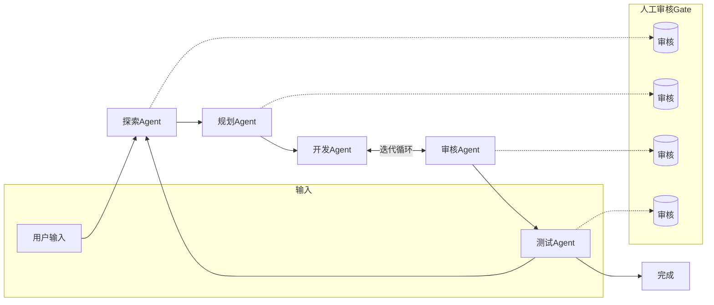
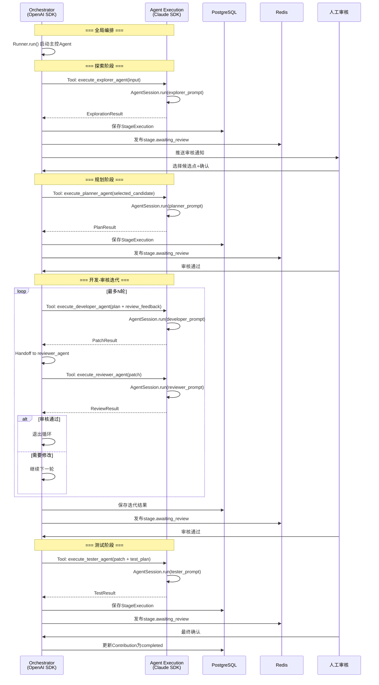
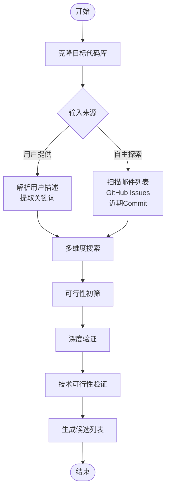
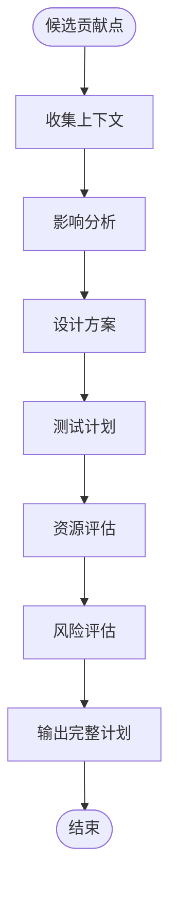
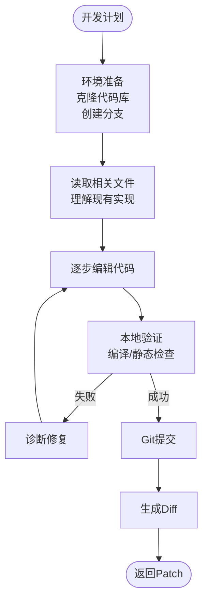
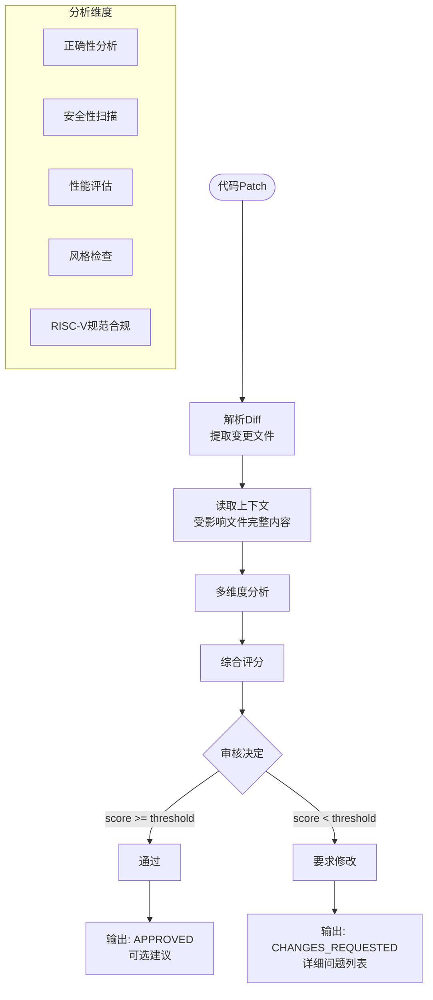
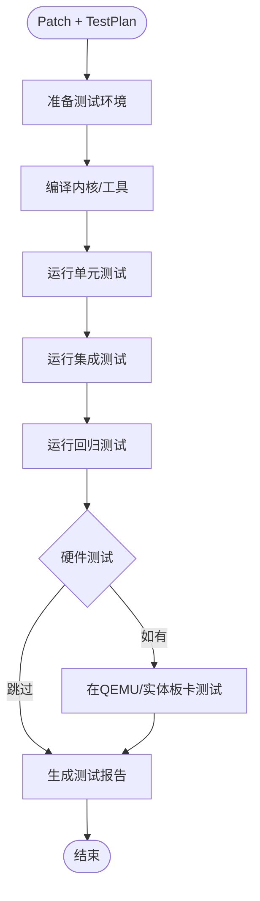
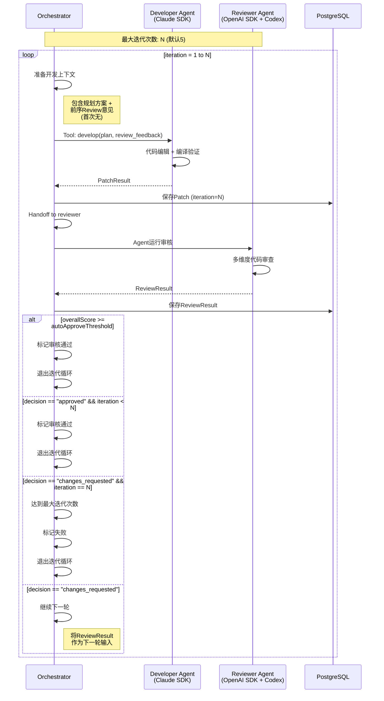
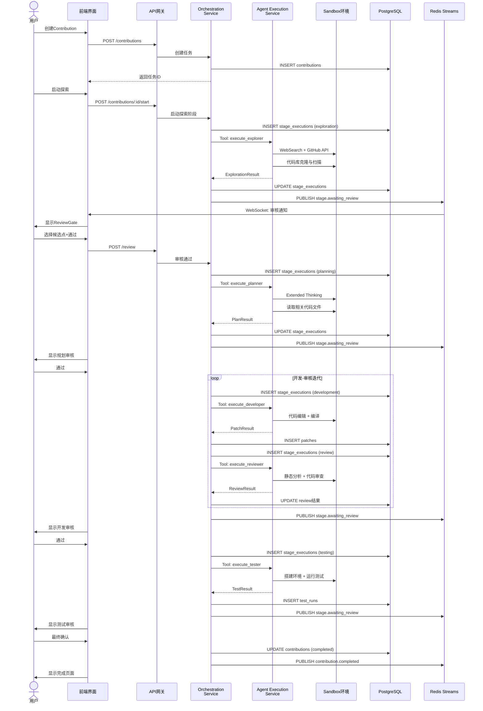

# RV-Insights Agent工作流详细设计

## 1. 总体工作流架构

### 1.1 五阶段流水线



### 1.2 编排层与执行层交互



## 2. 各阶段Agent详细设计

### 2.1 探索Agent（Explorer）

**承担SDK**: Claude Agent SDK  
**模型**: Claude Sonnet 4.6（速度与深度平衡）  
**系统提示核心**: "你是一个RISC-V开源社区贡献探索专家。你的任务是自主发现潜在的高价值贡献点，并验证其可行性。"

#### 工具集

```typescript
// Claude Agent SDK原生工具
interface ExplorerTools {
  web_search: {
    query: string
    num_results: number
  } // 搜索RISC-V相关资源

  web_fetch: {
    url: string
  } // 获取邮件列表页面、Issue详情

  bash: {
    command: string
    timeout?: number
  } // 运行邮件列表爬虫、Git操作

  glob: {
    pattern: string
  } // 在克隆的代码库中搜索文件

  grep: {
    pattern: string
    path?: string
  } // 代码库内文本搜索

  read: {
    file_path: string
  } // 读取代码文件、文档
}

// MCP扩展工具（通过MCP服务器接入）
interface ExplorerMCPTools {
  github_search_issues: {
    repo: string
    labels: string[]
    state: 'open' | 'closed'
  }

  github_get_issue: {
    repo: string
    issue_number: number
  }

  mailing_list_search: {
    list_name: string
    query: string
    date_range: [string, string]
  }
}
```

#### 执行流程



#### 自主探索策略

1. **邮件列表挖掘**：
   - 订阅并解析`linux-riscv`、`qemu-riscv`等邮件列表
   - 识别高频讨论主题、未解决的Bug报告、性能回归线索
   - 使用NLP提取"TODO"、"FIXME"、"已知问题"等关键词

2. **代码库静态扫描**：
   - 扫描`arch/riscv/`目录下的`TODO`/`FIXME`注释
   - 分析近期Commit趋势，发现未被覆盖的模块
   - 检查Coverage报告，定位测试盲区

3. **Issue跟踪**：
   - 监控GitHub/GitLab Issues中`good-first-issue`、`help-wanted`标签
   - 交叉验证Issue与邮件列表讨论，确认问题未在主线修复

#### 输出格式（数据契约）

```typescript
interface ExplorationResult {
  candidates: ContributionCandidate[]
  explorationLog: string        // 探索过程日志
  confidenceScore: number       // 整体置信度
}

interface ContributionCandidate {
  id: string
  title: string
  description: string
  confidence: number            // 0-1，可行性评分
  source: {
    type: 'mailing_list' | 'github_issue' | 'code_comment' | 'user_input'
    url: string
    reference: string           // 邮件ID / Issue编号 / 文件路径
  }
  affectedFiles: string[]       // 预估影响文件
  complexity: 'low' | 'medium' | 'high'
  estimatedEffort: string       // 如 "2-4小时"
  prerequisiteKnowledge: string[]
  verificationEvidence: string  // Agent验证该候选点可行的证据
}
```

### 2.2 规划Agent（Planner）

**承担SDK**: Claude Agent SDK  
**模型**: Claude Opus 4.7（最强推理能力）  
**系统提示核心**: "你是一个资深RISC-V系统软件架构师。基于探索Agent发现的贡献点，设计完整的开发方案和测试方案。"

#### 关键能力：Extended Thinking

规划Agent必须启用Claude的Extended Thinking模式，进行多步链式思考：

```typescript
// Claude API调用参数
const plannerConfig = {
  model: 'claude-opus-4-7',
  max_tokens: 8000,
  thinking: {
    type: 'enabled',
    budget_tokens: 4000    // 为推理分配大量token
  },
  tools: [/* 文件读取、代码搜索等工具 */]
}
```

#### 规划流程



#### 输出格式（数据契约）

```typescript
interface PlanResult {
  summary: string               // 计划摘要
  developmentPlan: DevelopmentPlan
  testPlan: TestPlan
  riskAssessment: RiskItem[]
  resourceRequirements: ResourceRequirement
}

interface DevelopmentPlan {
  approach: string              // 总体解决思路
  steps: PlanStep[]
  affectedModules: string[]
  backwardCompatibility: string
  estimatedLinesOfCode: number
}

interface PlanStep {
  order: number
  title: string
  description: string
  targetFiles: string[]
  verificationMethod: string    // 如何验证该步骤正确
}

interface TestPlan {
  unitTests: TestCaseSpec[]
  integrationTests: TestCaseSpec[]
  regressionTests: string[]     // 需要回归的现有测试
  manualVerificationSteps: string[]
}

interface TestCaseSpec {
  name: string
  purpose: string
  setup: string
  steps: string[]
  expectedResult: string
}

interface RiskItem {
  level: 'low' | 'medium' | 'high'
  description: string
  mitigation: string
}

interface ResourceRequirement {
  buildEnvironment: string      // 如 "riscv64-linux-gnu-gcc, QEMU 8.0+"
  targetHardware: string[]      // 如 "QEMU virt", "VisionFive 2"
  estimatedComputeTime: string
}
```

### 2.3 开发Agent（Developer）

**承担SDK**: Claude Agent SDK（用户指定Claude Code承担）  
**模型**: Claude Sonnet 4.6（编程主力模型）  
**系统提示核心**: "你是一个RISC-V内核/工具链开发专家。基于规划Agent的方案，使用代码编辑工具精确修改代码，遵循社区编码规范。"

#### 核心工具链

开发Agent是工具调用最密集的Agent，依赖Claude SDK的原生编辑能力：

```typescript
// 开发Agent专属工具集
interface DeveloperTools {
  // 文件操作
  read: { file_path: string }
  write: { file_path: string; content: string }
  edit: {                              // 行级精度编辑（最强能力）
    file_path: string
    old_string: string
    new_string: string
  }
  glob: { pattern: string }
  grep: { pattern: string; path?: string }

  // 版本控制
  bash: { command: string }
  // 常用命令：
  // git clone / git checkout -b rv-insights-{id}
  // git diff / git add / git commit
  // make / ninja 编译验证

  // 静态检查
  // 通过bash调用：
  // - checkpatch.pl（Linux内核风格检查）
  // - clang-format
  // - sparse静态分析
}
```

#### 开发流程



#### 代码编辑策略

1. **最小变更原则**：每个edit操作只修改必要内容
2. **编译验证**：每次关键修改后执行`make ARCH=riscv`，确保无编译错误
3. **风格合规**：自动运行`scripts/checkpatch.pl`检查内核编码风格
4. **原子提交**：一个功能点一个commit，commit message遵循社区规范

#### 输出格式

```typescript
interface PatchResult {
  branchName: string
  commitHash: string
  diffContent: string           // Unified diff格式
  commitMessage: string
  filesChanged: string[]
  buildStatus: 'success' | 'failed'
  buildLog: string | null
  staticCheckResults: {
    tool: string
    passed: boolean
    output: string
  }[]
}
```

### 2.4 审核Agent（Reviewer）

**承担SDK**: OpenAI Agents SDK + Codex模型  
**模型**: OpenAI Codex  
**系统提示核心**: "你是一个严格的RISC-V代码审核专家。审查代码的正确性、安全性、性能和风格合规性。"

#### 为什么用OpenAI SDK承载审核Agent

1. **Codex集成**：Codex是OpenAI专门优化的代码模型，代码理解深度优于通用模型
2. **Guardrails天然适合审核**：审核结果可直接触发Guardrail判断是迭代还是暂停
3. **与编排层同SDK**：审核Agent是迭代循环中的关键节点，与主Orchestrator共享SDK可避免跨SDK上下文转换损耗

#### 审核维度

```typescript
interface ReviewDimensions {
  correctness: ReviewScore     // 逻辑正确性
  security: ReviewScore        // 安全性（竞态条件、越界访问等）
  performance: ReviewScore     // 性能影响
  styleCompliance: ReviewScore // 编码风格合规
  riscvSpecific: ReviewScore   // RISC-V架构规范合规
  testCoverage: ReviewScore    // 测试覆盖评估
}

interface ReviewScore {
  score: number                 // 0-1
  issues: CodeIssue[]
}

interface CodeIssue {
  severity: 'critical' | 'high' | 'medium' | 'low'
  file: string
  lineNumber: number
  category: string              // 如 "race-condition", "memory-safety", "style"
  description: string
  suggestion: string             // 修改建议
}
```

#### 审核流程



#### 输出格式

```typescript
interface ReviewResult {
  decision: 'approved' | 'changes_requested'
  overallScore: number          // 0-1
  dimensions: ReviewDimensions
  summary: string               // 审核总结
  issues: CodeIssue[]
  suggestedPatch?: string       // 可选：Agent建议的修改方案
}
```

### 2.5 测试Agent（Tester）

**承担SDK**: Claude Agent SDK  
**模型**: Claude Sonnet 4.6  
**系统提示核心**: "你是一个RISC-V测试专家。搭建测试环境，执行测试计划，验证补丁的正确性和稳定性。"

#### 测试环境管理

测试Agent需要操作Docker/KVM环境：

```typescript
interface TesterTools {
  bash: { command: string; timeout?: number }
  // Docker操作：
  // docker run --rm -v $(pwd):/src rv-insights/riscv-build:latest
  // QEMU启动：
  // qemu-system-riscv64 -machine virt ...

  read: { file_path: string }  // 读取测试日志
  write: { file_path: string; content: string } // 写入测试脚本
}
```

#### 测试执行流程



#### 输出格式

```typescript
interface TestResult {
  status: 'passed' | 'failed' | 'error'
  environment: {
    dockerImage: string
    qemuVersion: string
    compilerVersion: string
  }
  buildResult: {
    success: boolean
    durationMs: number
    log: string
  }
  testSuites: TestSuiteResult[]
  summary: {
    total: number
    passed: number
    failed: number
    skipped: number
    durationMs: number
  }
  artifacts: {
    logPath: string
    coveragePath?: string
    coreDumpPath?: string
  }
}

interface TestSuiteResult {
  name: string
  status: 'passed' | 'failed' | 'error'
  tests: SingleTestResult[]
}

interface SingleTestResult {
  name: string
  status: 'passed' | 'failed' | 'skipped'
  durationMs: number
  errorMessage?: string
  stackTrace?: string
}
```

## 3. 开发-审核迭代循环

### 3.1 迭代机制

这是系统的核心内循环，开发Agent和审核Agent可能进行多轮交互。



### 3.2 上下文传递机制

每一轮迭代都必须完整传递上下文，确保开发Agent理解之前的审核意见：

```typescript
interface IterationContext {
  originalPlan: PlanResult        // 原始开发计划（不变）
  currentIteration: number
  previousPatches: PatchResult[]  // 历史patch，用于对比
  reviewHistory: ReviewResult[]   // 历史审核意见
  currentFeedback: string         // 当前轮次的具体修改要求
}

// 构建开发Agent的prompt
function buildDeveloperPrompt(ctx: IterationContext): string {
  return `
你是RISC-V开发专家。请根据以下信息修改代码：

## 原始开发计划
${ctx.originalPlan.summary}

## 当前迭代
第 ${ctx.currentIteration} 轮

## 审核反馈历史
${ctx.reviewHistory.map((r, i) => `
### 第${i+1}轮审核
- 决定: ${r.decision}
- 评分: ${r.overallScore}
- 问题数: ${r.issues.length}
- 主要问题:
${r.issues.filter(i => i.severity === 'critical' || i.severity === 'high')
  .map(i => `  - [${i.severity}] ${i.file}:${i.lineNumber} ${i.description}`)
  .join('\n')}
`).join('\n')}

## 当前需解决的问题
${ctx.currentFeedback}

## 要求
1. 针对上述问题精确修改代码
2. 每次修改后编译验证
3. 确保不引入新问题
`
}
```

### 3.3 终止条件

| 条件 | 行为 |
|------|------|
| 审核Agent评分 >= autoApproveThreshold (默认0.85) | 自动通过，退出迭代 |
| 审核Agent显式decision = "approved" | 通过，退出迭代 |
| 审核Agent要求修改且 iteration < maxIterations | 继续下一轮 |
| 审核Agent要求修改且 iteration == maxIterations | 标记failed，退出迭代 |
| 开发Agent编译连续失败3次 | 标记failed，退出迭代 |
| 单轮开发超时（默认30分钟）| 标记failed，退出迭代 |

### 3.4 回退机制

当迭代失败时，系统提供以下选项：

1. **人工接管**：用户直接查看所有迭代历史，手动选择最优Patch继续
2. **重置开发**：基于原始规划重新启动开发阶段（清空迭代历史）
3. **修改规划**：退回规划阶段，调整方案后重新开发
4. **终止任务**：标记Contribution为failed

```typescript
interface IterationFailureRecovery {
  failureReason: 'max_iterations_exceeded' | 'compile_failure' | 'timeout' | 'agent_error'
  availablePatches: PatchResult[]    // 所有历史patch
  bestPatchIndex: number             // Agent推荐的最优patch索引
  recoveryOptions: {
    manualSelect: boolean
    restartDevelopment: boolean
    backToPlanning: boolean
    abort: boolean
  }
}
```

## 4. 人工审核Gate设计

### 4.1 Gate触发机制

每个阶段完成后，Orchestrator通过OpenAI Guardrails实现强制暂停：

```typescript
// OpenAI Agents SDK Guardrail实现
import { GuardrailFunctionOutput, InputGuardrail, OutputGuardrail } from 'openai-agents'

const humanReviewGuardrail: OutputGuardrail = {
  name: 'human_review_gate',
  guardrail_function: async (context, output) => {
    // 阶段已完成，需要人工审核
    const stageExecution = await db.stageExecutions.findById(context.stageExecutionId)
    
    // 更新状态为等待审核
    await db.stageExecutions.update(stageExecution.id, {
      status: 'awaiting_review'
    })
    
    // 发布事件
    await redis.publish('stage.awaiting_review', {
      contributionId: context.contributionId,
      stageExecutionId: stageExecution.id,
      stageType: stageExecution.stageType,
      output: output
    })
    
    // 发送通知
    await notificationService.send(context.userId, {
      type: 'review_requested',
      title: `${stageExecution.stageType}阶段完成，等待审核`,
    })
    
    // 暂停执行，等待人工输入
    return {
      output_info: {
        stagePaused: true,
        awaitingReview: true,
        reviewDeadline: new Date(Date.now() + 24 * 60 * 60 * 1000) // 24小时
      },
      tripwire_triggered: true    // 触发暂停
    }
  }
}
```

### 4.2 审核界面信息展示

每个阶段的审核界面需展示不同信息：

| 阶段 | 展示内容 | 可操作项 |
|------|----------|----------|
| **探索** | 候选贡献点列表（含置信度、来源、验证证据） | 选择候选点 / 要求重新探索 / 终止 |
| **规划** | 开发计划详情、测试计划、风险评估 | 通过并开发 / 要求修改计划 / 终止 |
| **开发** | 代码Diff、编译结果、静态检查报告、迭代历史 | 通过并测试 / 要求修改 / 选择历史Patch / 终止 |
| **测试** | 测试报告、日志、覆盖率 | 确认完成 / 要求重测 / 终止 |

### 4.3 审核超时处理

```typescript
// Review Gate超时处理器（BullMQ定时任务）
const reviewTimeoutProcessor = async (job: Job) => {
  const { contributionId, stageExecutionId } = job.data
  
  const review = await db.humanReviews.findByStageExecution(stageExecutionId)
  if (review) return // 已审核，忽略
  
  // 发送超时提醒
  await notificationService.send(contributionId, {
    type: 'review_reminder',
    title: '审核即将超时',
    content: '您的审核请求已等待23小时，将在1小时后自动暂停。'
  })
  
  // 可选：配置自动行为
  // await autoEscalate(contributionId)  // 转派给其他审核者
}
```

## 5. Handoff协议

### 5.1 阶段间数据契约

阶段间传递的数据必须遵循严格Schema，确保Orchestrator能正确路由：

```typescript
// 统一的Handoff消息格式
interface HandoffMessage {
  version: '1.0'
  from: StageType
  to: StageType
  contributionId: string
  stageExecutionId: string
  timestamp: string
  payload: HandoffPayload
}

type HandoffPayload = 
  | ExplorationToPlanningPayload
  | PlanningToDevelopmentPayload
  | DevelopmentToTestingPayload
  | ReviewToDevelopmentPayload    // 迭代循环

interface ExplorationToPlanningPayload {
  selectedCandidate: ContributionCandidate
  explorationContext: string     // 探索过程的额外上下文
}

interface PlanningToDevelopmentPayload {
  plan: PlanResult
  selectedCandidate: ContributionCandidate
}

interface DevelopmentToTestingPayload {
  patch: PatchResult
  plan: PlanResult
}

interface ReviewToDevelopmentPayload {
  review: ReviewResult
  previousPatch: PatchResult
  iterationCount: number
}
```

### 5.2 OpenAI SDK Handoff实现

```typescript
import { Agent, Runner, handoff } from 'openai-agents'
import { z } from 'zod'

// 定义各阶段Agent
const explorerAgent = new Agent({
  name: 'Explorer',
  instructions: '探索RISC-V贡献点...',
  tools: [/* 探索工具 */]
})

const plannerAgent = new Agent({
  name: 'Planner',
  instructions: '规划开发方案...',
  tools: [/* 规划工具 */]
})

const developerAgent = new Agent({
  name: 'Developer',
  instructions: '开发代码补丁...',
  tools: [/* 开发工具 */]
})

const reviewerAgent = new Agent({
  name: 'Reviewer',
  instructions: '审核代码...',
  tools: [/* 审核工具 */]
})

const testerAgent = new Agent({
  name: 'Tester',
  instructions: '执行测试...',
  tools: [/* 测试工具 */]
})

// 定义Handoff目标
explorerAgent.handoffs = [handoff(plannerAgent)]
plannerAgent.handoffs = [handoff(developerAgent)]
developerAgent.handoffs = [handoff(reviewerAgent)]
reviewerAgent.handoffs = [
  handoff(developerAgent, {     // 审核不通过，回传开发
    on_handoff: (context) => ({
      iteration_count: context.iteration_count + 1
    })
  }),
  handoff(testerAgent)          // 审核通过，传给测试
]

// 运行工作流
async function runContributionWorkflow(contributionId: string, userInput: string) {
  const result = await Runner.run(explorerAgent, userInput, {
    context: {
      contributionId,
      iteration_count: 0,
      max_iterations: 5
    }
  })
  return result
}
```

### 5.3 Claude SDK执行层调用

```typescript
import { AgentSession, Hooks } from '@anthropic-ai/agent-sdk'

// 在OpenAI Agent中作为Tool调用Claude Agent
const executeClaudeAgent = async (params: {
  agentType: 'explorer' | 'planner' | 'developer' | 'tester'
  prompt: string
  context: Record<string, unknown>
}) => {
  const session = new AgentSession({
    model: params.agentType === 'planner' ? 'claude-opus-4-7' : 'claude-sonnet-4-6',
    hooks: {
      // 工具调用前拦截：记录日志
      preToolUse: async (tool) => {
        await db.toolCalls.create({
          agentSessionId: session.id,
          toolName: tool.name,
          input: tool.input,
          createdAt: new Date()
        })
        return { allow: true }
      },
      // 工具调用后：检查错误
      postToolUse: async (tool, result) => {
        if (result.error) {
          console.error(`Tool ${tool.name} failed:`, result.error)
        }
      },
      // 会话结束：保存结果
      stop: async (output) => {
        await db.agentSessions.update(session.id, {
          status: 'completed',
          endedAt: new Date(),
          output: output
        })
      }
    }
  })

  const result = await session.run(params.prompt)
  return result
}
```

## 6. 容错与重试策略

### 6.1 Agent失败分类与应对

| 失败类型 | 检测方式 | 自动重试 | 人工介入 |
|----------|----------|----------|----------|
| **API限流** (429) | HTTP状态码 | 指数退避重试3次 | 无需 |
| **上下文溢出** | token count > max | 压缩上下文重试1次 | 可选 |
| **工具执行失败** | tool_call.error != null | 重试1次 | 如果仍失败则暂停 |
| **Agent幻觉** | 输出不符合Schema | 重试2次（温度调高）| 如果仍失败则暂停 |
| **编译失败** | exit code != 0 | 不自动重试 | 直接传给审核Agent |
| **沙箱崩溃** | Docker退出 | 重启沙箱重试1次 | 如果仍失败则暂停 |
| **超时** | 执行时间 > threshold | 不自动重试 | 直接暂停 |

### 6.2 熔断机制

```typescript
class AgentCircuitBreaker {
  private failures = 0
  private lastFailureTime: Date | null = null
  private readonly threshold = 5       // 5次失败触发熔断
  private readonly timeoutMs = 60000   // 熔断后冷却1分钟

  async call(fn: () => Promise<unknown>): Promise<unknown> {
    if (this.isOpen()) {
      throw new Error('Circuit breaker is OPEN')
    }

    try {
      const result = await fn()
      this.onSuccess()
      return result
    } catch (error) {
      this.onFailure()
      throw error
    }
  }

  private isOpen(): boolean {
    if (this.failures < this.threshold) return false
    if (!this.lastFailureTime) return false
    return Date.now() - this.lastFailureTime.getTime() < this.timeoutMs
  }

  private onSuccess() {
    this.failures = 0
    this.lastFailureTime = null
  }

  private onFailure() {
    this.failures++
    this.lastFailureTime = new Date()
  }
}
```

### 6.3 检查点与恢复

长时运行的Agent任务需要定期保存检查点：

```typescript
interface Checkpoint {
  id: string
  contributionId: string
  stageExecutionId: string
  agentType: string
  contextSnapshot: unknown    // Agent上下文快照
  toolCallHistory: ToolCall[]
  createdAt: Date
}

// 每5个tool call保存一次检查点
async function saveCheckpoint(session: AgentSession): Promise<Checkpoint> {
  const checkpoint = await db.checkpoints.create({
    contributionId: session.contributionId,
    stageExecutionId: session.stageExecutionId,
    agentType: session.agentType,
    contextSnapshot: await session.exportContext(),
    toolCallHistory: await db.toolCalls.findBySession(session.id)
  })
  return checkpoint
}

// 从检查点恢复
async function restoreCheckpoint(checkpointId: string): Promise<AgentSession> {
  const checkpoint = await db.checkpoints.findById(checkpointId)
  const session = new AgentSession()
  await session.importContext(checkpoint.contextSnapshot)
  return session
}
```

## 7. 完整序列图


