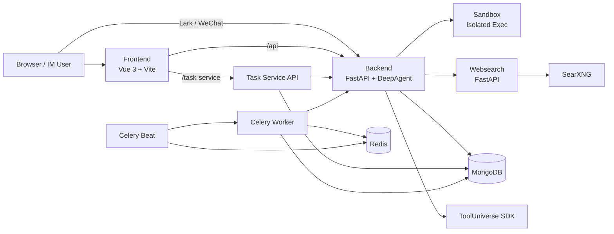

# ScienceClaw 项目深度分析报告

- 分析对象：`/home/zq/work-space/repo/ai-projs/posp/ScienceClaw`
- 分析时间：`2026-04-28`
- 分析方式：静态源码审阅 + 项目文档/部署文件/提交历史梳理
- 当前基线：仓库 `HEAD` 近期提交为 `ff1ed15 docs: 简化部署教程，去掉 .env 配置改为界面配置模型`
- 说明：本报告未实际启动整套服务，也未执行端到端测试；结论基于代码与配置的可见证据

---

## 1. 执行摘要

`ScienceClaw` 不是一个单纯的 “LLM 聊天壳”，而是一个面向科研/知识工作流的本地化 Agent 工作台。它围绕以下几个核心点构建：

1. **会话即工作区**：每个会话对应一个独立目录，Agent 在其中搜索、写文件、执行脚本、生成报告。
2. **Agent 透明化**：前端不只展示最终答案，还展示思考流、todo/plan、工具调用、文件产物、分享链接和任务执行历史。
3. **多层扩展能力**：内建工具 + ToolUniverse 1900+ 科研工具 + 自定义 `Tools/` + `Skills/` 技能体系共同组成扩展面。
4. **本地部署优先**：核心服务以 Docker 多容器方式部署，网页搜索、沙箱执行、任务调度、数据库都可本地运行。
5. **科研工作流导向**：项目预置 deep research、文档生成、定时任务、飞书/IM 集成，目标是把“科研助理”做成一个完整产品，而不是一段 demo。

如果只用一句话概括：**ScienceClaw 是一个将 DeepAgents、隔离沙箱、科研工具生态和可视化工作流 UI 打包成产品的本地研究操作系统雏形。**

---

## 2. 仓库画像

### 2.1 规模概览

| 指标 | 结果 |
|---|---:|
| Git tracked files | 579 |
| Git commits | 27 |
| Python 文件 | 149 |
| Vue 文件 | 137 |
| TypeScript 文件 | 57 |
| Markdown 文件 | 34 |
| 顶层运行服务数 | 10 |
| 内建技能目录数 | 9 |

### 2.2 目录结构

项目主结构与 README 描述基本一致，核心目录如下：

```text
ScienceClaw/
├── docker-compose*.yml
├── Tools/                      # 自定义外部工具
├── Skills/                     # 用户/社区技能
├── docs/
├── images/
└── ScienceClaw/
    ├── backend/                # FastAPI + DeepAgent 核心
    ├── frontend/               # Vue 3 + Vite 前端工作台
    ├── task-service/           # 定时任务服务
    ├── sandbox/                # 代码执行沙箱辅助组件
    ├── websearch/              # 搜索/爬取微服务
    ├── searxng/                # 搜索引擎容器配置
    ├── mongo/
    └── redis/
```

### 2.3 演进状态判断

从提交历史看，项目还处于**早期快速迭代**阶段，但已经开始从“开发者原型”向“可直接部署使用的产品”推进：

- 文档与部署体验近期在持续完善
- 模型接入面在扩展，已覆盖 DeepSeek、OpenAI 兼容接口、Gemini 等
- IM/微信/飞书能力近期有明显新增
- release 镜像版本已推进到 `v0.0.4`

同时，README 中仍写着 **“v0.0.1 正式发布”**，说明**版本口径尚未完全统一**。

---

## 3. 产品定位与核心主张

根据 `README.md` / `README_zh.md` 与源码实现，项目的产品主张主要有三条：

### 3.1 安全性

- 代码执行在独立 `sandbox` 容器中完成
- 工作目录映射到本地 `workspace`
- 外部工具执行通过沙箱代理，而不是直接在 backend 进程 import 用户代码

这比很多直接在主进程执行脚本的 Agent 项目更稳健。

### 3.2 透明性

- 后端用 SSE 把 `thinking`、`plan_update`、`tool_call`、`tool_result`、`statistics`、`done` 等事件流式推给前端
- 前端 `ChatPage.vue` + `ActivityPanel.vue` 把这些事件组织成可回放的“执行过程”
- 产出文件可在文件面板直接浏览、预览、下载

这让它更接近 Cursor / Devin 风格的“过程可见 Agent”，而不是黑盒聊天机器人。

### 3.3 可扩展科研能力

- `ToolUniverse` 为项目提供 1900+ 科学工具
- `Skills/` 和 `builtin_skills/` 为复杂任务提供结构化 workflow
- `Tools/` 允许用户挂载自定义 `@tool`
- PDF/DOCX/PPTX/XLSX 等产出型技能直接面向科研交付物

这套设计说明项目目标不是“回答问题”，而是“完成研究任务并交付文件”。

---

## 4. 整体架构

### 4.1 服务拓扑



### 4.2 服务职责表

| 服务 | 角色 | 关键证据 |
|---|---|---|
| `frontend` | Web 工作台、聊天 UI、技能/工具/任务管理 | `frontend/src/main.ts` |
| `backend` | 主 API、Agent 组装、会话流式执行、认证、模型管理 | `backend/main.py` |
| `sandbox` | Shell/文件/浏览器/脚本执行隔离环境 | `sandbox/tool_runner.py` |
| `websearch` | 搜索与网页爬取 API | `websearch/main.py` |
| `searxng` | 元搜索引擎依赖 | `docker-compose*.yml` |
| `scheduler_api` | 定时任务 CRUD 与校验 API | `task-service/app/main.py` |
| `celery_worker` | 执行计划任务，调用 backend `/api/v1/chat` | `task-service/app/tasks.py` |
| `celery_beat` | 定时扫描并触发 cron 任务 | `task-service/app/tasks.py` |
| `mongo` | 会话、模型、任务、用户会话、阻止列表等持久化 | `backend/mongodb/db.py`、`task-service/app/core/db.py` |
| `redis` | Celery broker/back-end | `docker-compose*.yml` |

### 4.3 部署模式

项目支持三种部署：

1. `docker-compose-release.yml`
   预构建镜像，面向普通用户
2. `docker-compose-china.yml`
   国内镜像加速源码构建
3. `docker-compose.yml`
   标准源码构建，面向开发者

这说明作者已经明确区分了**产品使用**和**开发参与**两类入口。

---

## 5. 核心执行链路

### 5.1 Web 会话链路

主交互链路集中在 `backend/route/sessions.py` 与 `backend/deepagent/runner.py`：

1. 前端创建会话：`PUT /api/v1/sessions`
2. 前端发起聊天：`POST /api/v1/sessions/{session_id}/chat`
3. 后端创建后台 worker：`_agent_background_worker`
4. worker 先把用户消息写入 session events，再快照工作区文件
5. 调用 `arun_science_task_stream()` 进入 DeepAgent 流式执行
6. SSE 事件持续写入前端，包括：
   - `thinking`
   - `plan_update`
   - `tool_call`
   - `tool_result`
   - `planning_message`
   - `statistics`
   - `done`
7. worker 结束后计算本轮新增/修改文件，附加到 `done.round_files`

这条链路的一个关键特点是：**会话记录、工作区文件、SSE 可视化、分享链接和“保存技能/保存工具”提示都附着在同一个 session 生命周期里。**

### 5.2 Agent 组装链路

`backend/deepagent/agent.py` 是项目最关键的装配点：

- 读取模型配置并创建 LLM 实例
- 创建 `FullSandboxBackend`
- 通过 `CompositeBackend` 挂载：
  - 默认沙箱后端
  - `/builtin-skills/`
  - `/skills/`
- 合并静态工具与外部工具
- 注入 `SSEMonitoringMiddleware`
- 注入 `ToolResultOffloadMiddleware`
- 为 Agent 配置 memory：
  - 全局 `AGENTS.md`
  - 会话级 `CONTEXT.md`

这意味着项目实际上采用了**“LLM + Sandbox + Skills FS + Memory Files + Tool Registry”** 的复合 Agent 运行时，而不是简单地给模型塞一组函数。

### 5.3 历史与上下文控制

`backend/deepagent/runner.py` 做了几件很成熟的事：

- 从历史事件中重建 `HumanMessage` / `AIMessage` / `ToolMessage`
- 截断超长 assistant/tool 内容，避免上下文爆炸
- 基于模型 context window 动态计算历史预算
- 处理 reasoning 内容兼容
- 在工具调用和最终文本之间做事件映射
- 对超时、取消、上下文溢出、认证错误等场景给出用户友好错误

这里能看出作者不是只在做“功能叠加”，而是在处理**Agent 产品化时最常见的上下文膨胀、可视化、错误恢复和模型兼容性问题**。

---

## 6. 子系统深度分析

### 6.1 Backend：项目的大脑

关键入口：`backend/main.py`

### 主要职责

- 启动 Mongo 连接
- 初始化系统模型
- 自举默认管理员
- 清理孤儿会话
- 启动 IM runtime
- 挂载各类 API 路由

### 路由层分工

后端路由非常丰富，已经超出普通聊天系统的范畴：

- `auth`：登录、注册、改密、刷新 token
- `models`：模型配置、连接验证、上下文窗口探测
- `sessions`：会话、SSE、分享、文件、技能、工具保存/管理
- `science`：提示优化
- `tooluniverse`：科研工具目录/详情/运行
- `chat`：供任务调度服务调用的同步聊天接口
- `task_settings`：任务参数配置
- `memory`：全局 `AGENTS.md`
- `statistics`：资源与使用统计
- `im`：飞书/微信桥接与系统设置

### 工程判断

优点：

- 职责完整，产品能力集中
- 认证、模型、会话、调度、IM、统计都有成型接口

问题：

- `route/sessions.py` 已经成长为超大文件，接近“会话领域总线”
- route 层承担了较多 orchestration 逻辑，后续继续扩展会影响维护性

---

### 6.2 DeepAgent：透明化的工作流核心

关键文件：

- `backend/deepagent/agent.py`
- `backend/deepagent/runner.py`
- `backend/deepagent/sse_protocol.py`
- `backend/deepagent/sse_middleware.py`
- `backend/deepagent/offload_middleware.py`
- `backend/deepagent/sessions.py`

### 设计亮点

1. **会话级工作目录**
   每个 session 对应 `/home/scienceclaw/{session_id}`，天然适合文件化研究任务。

2. **内外技能双路由**
   - 内建技能打包进镜像，避免宿主机差异
   - 外部技能来自用户可管理目录，支持阻止/删除

3. **大工具结果自动落盘**
   `ToolResultOffloadMiddleware` 把大型结果写进工作区，减少上下文污染。

4. **事件协议显式化**
   `thinking / plan / step / tool / error / done` 全部标准化，让前端可以稳定渲染。

5. **跨会话记忆**
   用户级 `AGENTS.md` + 会话级 `CONTEXT.md` 的组合很实用，既保留长期偏好，又避免全部压进数据库字段。

### 设计取舍

- 项目明显偏向“任务执行型 agent”，因此系统 prompt 强调：
  - 优先执行而非解释
  - 研究任务优先读 `deep-research`
  - 生成脚本后立即执行验证
  - 需要时建议保存 skill/tool

这使 Agent 行为高度 workflow-driven，而不是自由聊天驱动。

---

### 6.3 工具系统：强扩展，但实现很务实

关键文件：

- `Tools/__init__.py`
- `sandbox/tool_runner.py`
- `backend/deepagent/tools.py`
- `backend/route/sessions.py`

### 工作方式

外部工具并不是在 backend 中直接 import 执行，而是：

1. 后端扫描 `Tools/*.py`
2. 用 AST 解析 `@tool` 元数据
3. 生成 LangChain `StructuredTool` 代理
4. 真正执行时，通过 sandbox shell 调用 `_tool_runner.py`
5. `_tool_runner.py` 再在沙箱里 import 并执行目标函数

### 这套设计的意义

- 避免 backend 与 sandbox Python 环境不一致
- 避免用户工具直接污染后端进程
- 测试环境和生产环境更接近

这是项目中一个非常值得肯定的工程决策。

### 配套产品能力

- 会话内工具开发完成后可触发 `tool_save_prompt`
- 前端可确认保存到永久 `Tools/`
- 支持屏蔽、删除、读取源码

说明它不只是“支持工具”，而是已经设计了**工具生命周期管理闭环**。

---

### 6.4 技能系统：项目差异化的核心

关键位置：

- `Skills/`
- `backend/builtin_skills/`
- `backend/route/sessions.py`
- `backend/deepagent/agent.py`

### 结构

- 内建技能：9 个，随镜像分发
- 外部技能：放在 `Skills/`，可由用户安装或生成
- Agent system prompt 强制先检查技能，再决定是否直接做事

### 典型内建技能

- `pdf`
- `docx`
- `pptx`
- `xlsx`
- `tool-creator`
- `skill-creator`
- `find-skills`
- `tooluniverse`
- `feishu-setup`

### 为什么这很重要

很多 Agent 项目把 prompt engineering 隐藏在代码里；ScienceClaw 则把复杂流程外置成 `SKILL.md`，优点是：

- 工作流可读
- 可被版本管理
- 用户能扩展
- 更贴合研究型任务的 SOP

这让 ScienceClaw 更像“Agent IDE/平台”，不是单个 prompt 应用。

---

### 6.5 ToolUniverse 集成：科研属性的放大器

关键文件：

- `backend/route/tooluniverse.py`
- `backend/deepagent/tooluniverse_tools.py`

### 集成方式

- backend 进程内加载 `ToolUniverse` 单例
- route 层提供目录、详情、执行、分类接口
- agent 工具层提供 `tooluniverse_search/info/run`
- 还做了中文翻译缓存 `tu_zh.json`

### 优点

- Agent 可以直接把 ToolUniverse 当做一类高价值工具调用
- 用户前端也可以浏览科研工具目录
- 比“只让模型自己想象如何调科研接口”更产品化

### 风险

- ToolUniverse 的真实外部 API 稳定性、性能和返回数据尺寸会显著影响用户体验
- 当前主要依靠 runtime 截断与落盘缓解，而不是更强的 typed adapter

---

### 6.6 Websearch：把“联网检索”做成本地依赖

关键文件：

- `websearch/main.py`
- `websearch/api/search.py`
- `websearch/service/search.py`
- `websearch/service/crawler.py`

### 设计

- `SearXNG` 负责元搜索
- `Crawl4AI + Playwright` 负责抓取网页正文
- 对外提供：
  - `/web_search`
  - `/search`
  - `/crawl_urls`

### 优点

- 不依赖 Tavily 这类闭源 SaaS
- 符合项目“本地/隐私优先”定位

### 代码层观察

- 搜索请求手工拼 multipart body，比较底层
- 启动时会检查并安装 Chromium
- 日志打印非常详细，甚至打印 request headers/body 与响应 body

这说明它优先保证“能跑、可调试”，但在长期运维下需要进一步清理日志策略和启动时依赖安装策略。

---

### 6.7 Sandbox：隔离执行边界

关键文件：

- `backend/deepagent/full_sandbox_backend.py`
- `sandbox/tool_runner.py`
- `docker-compose*.yml`

### 作用

- 统一承接 shell、文件、浏览器、代码执行
- 每个会话拥有自己的 shell session
- 后端通过 REST 与其通信

### 优点

- 与工作区卷配合后，Agent 能“像开发者一样”工作
- 通过 circuit breaker、超时和输出截断处理恶化情况

### 实际边界

它是**容器级隔离**，不是绝对零信任：

- backend 与 sandbox 共享工作区卷
- backend/Tools/Skills 仍与宿主机项目目录绑定
- 默认 compose 里有大量明文环境和默认凭据

所以它更像“本地可信环境中的安全隔离层”，而不是面向敌对多租户的沙箱。

---

### 6.8 Task Service：把 Agent 能力时间化

关键文件：

- `task-service/app/main.py`
- `task-service/app/api/tasks.py`
- `task-service/app/tasks.py`
- `task-service/app/services/schedule_parser.py`

### 关键链路

1. 前端创建定时任务
2. `scheduler_api` 保存任务配置到 Mongo
3. `celery_beat` 每分钟扫描符合 cron 的任务
4. `celery_worker` 执行任务，调用 backend `/api/v1/chat`
5. 结果回写 `task_runs`
6. 通知通过飞书或 webhook 发出

### 产品上的妙处

任务执行不是一个完全独立系统，而是**复用同一套会话模型**：

- 任务运行结果会生成 chat session
- 可在普通聊天列表里查看
- 还能共享链接

这让“调度任务”与“人工对话”统一到了同一个信息模型上，设计非常整洁。

---

### 6.9 Frontend：不是聊天页，而是 Agent 工作台

关键文件：

- `frontend/src/main.ts`
- `frontend/src/pages/HomePage.vue`
- `frontend/src/pages/ChatPage.vue`
- `frontend/src/pages/TasksPage.vue`
- `frontend/src/components/LeftPanel.vue`
- `frontend/src/components/ActivityPanel.vue`
- `frontend/src/api/client.ts`

### 技术栈

- Vue 3
- Vite
- TypeScript
- Tailwind CSS
- `fetch-event-source`
- `vue-router`
- `vue-i18n`
- Monaco / xterm / noVNC / mermaid / KaTeX 等富组件依赖

### 主要界面层级

- `HomePage`：欢迎页 + 快速科研提示词
- `ChatPage`：主会话页
- `SkillsPage` / `ToolsPage`：扩展资源管理
- `TasksPage`：三栏式定时任务工作台
- `SharePage`：会话分享页

### 交互特点

1. **左侧导航 + 会话列表**
2. **中间聊天区**
3. **右侧活动面板**
   展示 thinking、todo、tool timeline
4. **文件面板 / 工具面板 / 分享弹层**
5. **技能/工具保存提示条**

从实现上看，它已经是一个“小型研究 IDE”：

- 有模型选择
- 有会话分组
- 有实时通知
- 有文件浏览
- 有任务中心
- 有会话分享
- 有工具与技能管理

### 前端复杂点

- `ChatPage.vue` 体量较大，承担了较多聚合逻辑
- 没有看到明显的全局状态管理库，主要依赖 composables 与组件局部状态

这在当前规模可行，但继续加功能后，状态复杂度会明显上升。

---

### 6.10 IM 集成：把 Agent 从网页带到消息系统

关键文件：

- `backend/route/im.py`
- `backend/im/orchestrator.py`
- `backend/im/adapters/lark.py`
- `backend/im/wechat_bridge.py`

### 能力

- 飞书/Lark 绑定
- 微信桥接
- 站内 IM 设置管理
- Webhook 去重
- 进度回推与结果拆分

### 判断

这部分说明项目定位已经不仅是“本地网页应用”，而是想进入**多入口智能工作流平台**：

- Web 前端适合深度交互
- IM 入口适合轻量触发、接收通知和远程使用

这会提升可用性，但也显著增加运维复杂度。

---

## 7. 数据与状态模型

### 7.1 Session 模型

`ScienceSession` 持有：

- `session_id`
- `thread_id`
- `vm_root_dir`
- `plan`
- `events`
- `title`
- `status`
- `unread_message_count`
- `is_shared`
- `latest_message`
- `pinned`
- `source`

这说明 session 不是“对话容器”这么简单，而是：

- 聊天记录容器
- 工作区绑定对象
- 文件生成上下文
- 分享对象
- 调度任务结果载体
- IM 对话映射对象

### 7.2 Mongo 中承载的领域对象

从代码可见，Mongo 至少承载这些集合：

- `sessions`
- `models`
- `user_sessions`
- `blocked_skills`
- `blocked_tools`
- `tasks`
- `task_runs`
- `webhooks`
- 以及 IM 相关集合

整体上属于“单 Mongo 统一持久化”的轻中型产品架构，简单直接。

### 7.3 文件化状态

项目还有一层很重要的**文件系统状态**：

- 会话级 `CONTEXT.md`
- 用户级 `AGENTS.md`
- 会话级 `planner.md`
- `research_data/`、`tools_staging/` 等中间产物目录

这让系统在很多场景下比“全 DB 存储”更适合 Agent 工作。

---

## 8. 工程亮点

### 8.1 最值得肯定的地方

1. **工具执行不直接 import 用户代码**
   `Tools/__init__.py` + sandbox proxy 的设计很成熟。

2. **SSE 协议与前端活动面板配合良好**
   透明化不仅停留在概念，而是具体到 plan/tool/result 的结构化事件。

3. **会话 = 工作区 = 文件产出容器**
   这比很多“消息数据库 + 临时脚本”的 Agent 项目更贴近真实任务流。

4. **技能系统不是装饰，而是决策入口**
   system prompt 明确 skill-first，研究任务优先检查 `deep-research`。

5. **调度任务复用聊天会话**
   同一条能力链路支持“实时对话”和“定时自动运行”，架构统一。

6. **多入口形态完整**
   Web、分享页、飞书/微信、任务调度都能接入同一 Agent 核心。

### 8.2 架构风格判断

整体是典型的**产品工程驱动型 Agent 架构**，而不是研究原型：

- 非常强调可视化
- 非常强调产出文件
- 非常强调扩展能力
- 非常强调本地部署

这使它在同类开源 Agent 项目里具有明显差异化。

---

## 9. 主要风险与改进建议

### 9.1 高优先级问题

| 问题 | 证据 | 影响 | 建议 |
|---|---|---|---|
| 默认凭据与明文配置较多 | `docker-compose.yml` 中 admin/mongo/websearch key | 本地虽可接受，但仍是明显安全弱点 | 首启强制改密；将示例值迁移为模板化变量 |
| 自动化测试基本缺失 | 未发现测试目录/测试命令 | 回归风险高，重构成本会上升 | 至少为 `sessions`、`task-service`、`tools proxy` 建最小测试集 |
| 核心文件过大 | `route/sessions.py`、`ChatPage.vue` | 维护难度高，局部修改风险高 | 按 domain/service/event mapping 拆分 |
| 版本与文档口径不一致 | README 中 `v0.0.1`、release `v0.0.4`、命令里 `.yaml`/`.yml` 混用 | 降低可信度，增加用户困惑 | 统一版本命名与文档命令 |

### 9.2 中优先级问题

| 问题 | 影响 | 建议 |
|---|---|---|
| `DIAGNOSTIC_MODE` 在源码 compose 默认开启 | 可能记录大量上下文，放大隐私/磁盘占用问题 | 默认关闭，仅在调试时显式开启 |
| websearch 日志过重 | 易泄漏查询内容、增大日志成本 | 减少请求体/响应体级别日志 |
| 启动时安装 Playwright 浏览器 | 启动时间长，对网络更敏感 | 构建镜像时预装并校验 |
| 前端状态分散在大组件与 composables | 规模继续增长后可维护性下降 | 逐步抽象 session state / task state |
| 事件与对话历史全部存 Mongo | 会话增长后 DB 体积可能快速膨胀 | 引入归档/裁剪/冷热分层策略 |

### 9.3 低优先级问题

| 问题 | 说明 |
|---|---|
| `LICENSE` 文件缺失但 README 标注 MIT | 开源合规信息不完整 |
| 某些实现偏“工程务实”而非“框架优雅” | 如手工 multipart、超大 route 文件、部分 hard-coded 文案 |

---

## 10. 适用场景与不适用场景

### 10.1 适用场景

- 本地部署的科研助理
- 需要工具链、文件产出、过程可见性的研究任务
- 需要定时运行 Agent 的情境
- 希望把技能/工具沉淀为组织资产的团队
- 对飞书/微信等消息入口有需求的使用者

### 10.2 暂不适合的场景

- 强多租户、强对抗安全环境
- 极端强调测试完备度和企业级合规审计的场景
- 希望零运维、零 Docker 依赖的普通轻量用户
- 需要高度稳定 SaaS 级联网搜索保障的生产环境

---

## 11. 我对该项目的总体判断

`ScienceClaw` 最有价值的地方，不是“接了很多模型”或“能调很多工具”，而是它已经把这些能力编排成了一个**有产品骨架的研究工作流系统**：

- 后端有会话、事件、工作区、调度、IM、模型管理
- 前端有会话工作台、任务中心、技能/工具管理、分享与文件查看
- Agent 核心有技能优先、上下文控制、透明工具链与结果落盘
- 扩展系统把用户自定义能力纳入正式生命周期

从架构成熟度看，它已经超出了单纯 demo，但还没有完全进入“强工程治理”阶段。最明显的下一步，不是再加功能，而是：

1. 补测试
2. 收敛配置与安全基线
3. 拆大文件
4. 统一版本/文档口径
5. 给高价值链路补监控与回归保障

如果这些基础工程补齐，`ScienceClaw` 会是一类很有竞争力的“本地科研 Agent 工作台”开源项目。

---

## 12. 关键源码入口索引

| 主题 | 入口文件 |
|---|---|
| 后端应用入口 | `ScienceClaw/backend/main.py` |
| 会话/SSE/技能工具管理 | `ScienceClaw/backend/route/sessions.py` |
| 任务同步聊天接口 | `ScienceClaw/backend/route/chat.py` |
| DeepAgent 装配 | `ScienceClaw/backend/deepagent/agent.py` |
| DeepAgent 流式执行 | `ScienceClaw/backend/deepagent/runner.py` |
| 会话模型与工作区 | `ScienceClaw/backend/deepagent/sessions.py` |
| 工具热加载代理 | `Tools/__init__.py` |
| 沙箱执行器 | `ScienceClaw/sandbox/tool_runner.py` |
| ToolUniverse API | `ScienceClaw/backend/route/tooluniverse.py` |
| 任务调度执行 | `ScienceClaw/task-service/app/tasks.py` |
| 搜索/爬取服务 | `ScienceClaw/websearch/main.py` |
| 前端路由入口 | `ScienceClaw/frontend/src/main.ts` |
| 主聊天页 | `ScienceClaw/frontend/src/pages/ChatPage.vue` |
| 定时任务页 | `ScienceClaw/frontend/src/pages/TasksPage.vue` |
