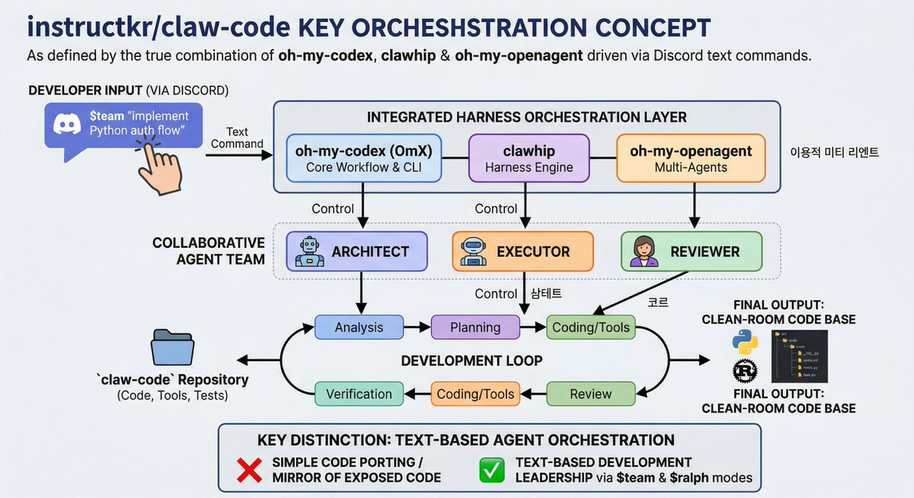
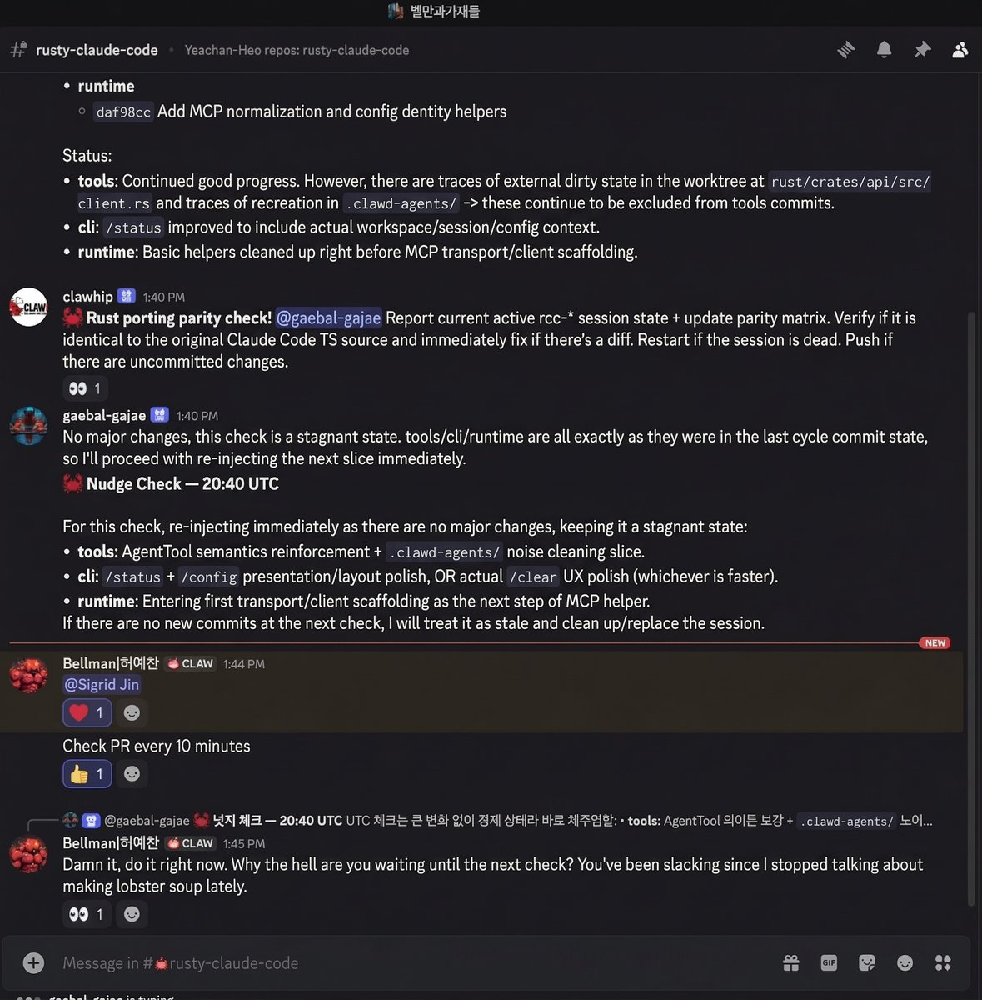
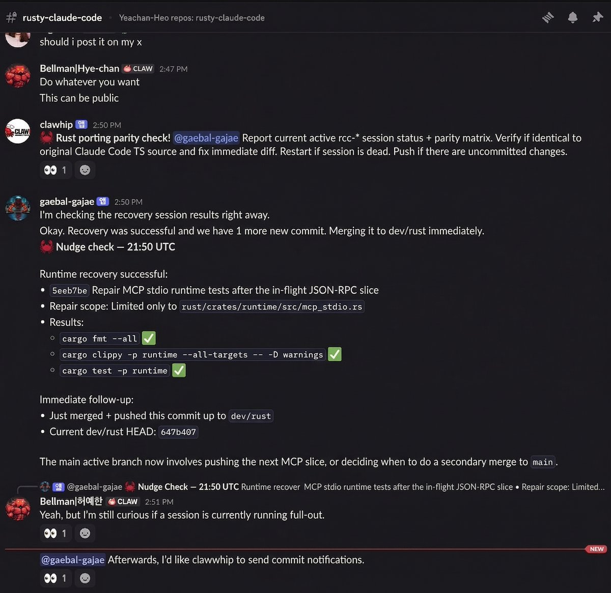
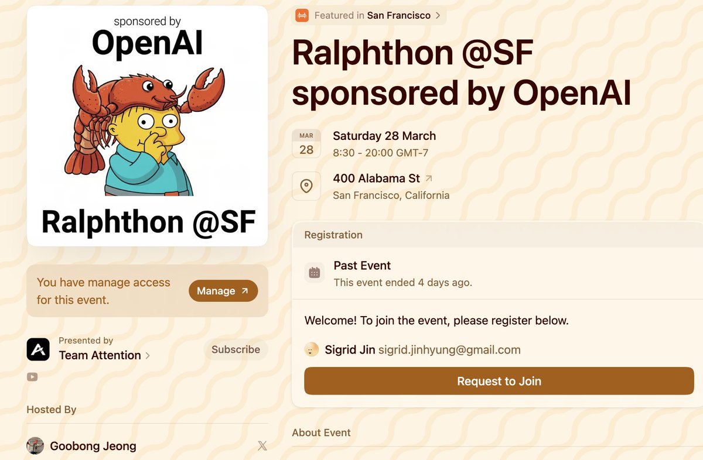

# What you need to learn from claw-code repo

# Stop Staring at the Files

People are losing their minds over the fact that the clean-room Python writing of claw-code took 2 hours. And we did Rust rewriting in a day (0.1.0 released!)

A complex agent system, reverse-engineered and re-implemented from scratch before sunrise on March 31st. The repository crossed 50,000 stars in two hours. It is past 117,000 now.

Developers are excited. A good number of them are terrified. Watching a codebase of that size get rebuilt at that speed feels like something broke in the timeline. For some it looks like a superpower they want to learn. For others it looks like a pink slip.

But if you are staring at the generated Python files, you are looking at the wrong layer.

The code is a byproduct. The Rust port that followed is also a byproduct. The thing worth studying in the claw-code repository is the system that produced all of it. claw-code was always a showcase. The point was never the Python files or the Rust crates. The point was the clawhip-based agent coordination system that built them while the developer was asleep.

Here is what that system actually looks like in practice: a person opens Discord on their phone, types a sentence, and puts the phone down. They might go make coffee. They might go to sleep. The agents read the message, break the work into tasks, assign roles among themselves, write code, test it, argue over it, fix what fails, and push when everything passes. The person checks back in the morning. The port is done.

No terminal. No IDE. No SSH session. No split-pane Vim setup. Discord. A chat app.

This is the part most people skip over. The README includes screenshots of the OmX workflow running in terminal panes, and people assume the developer was sitting in front of those panes the whole time, manually steering each step. The terminal sessions belong to the agents. The human's interface was a Discord channel. A text box. A send button.

Three tools make this work, and they each handle a different part of the problem.

oh-my-codex, usually called OmX, is a workflow layer that sits on top of OpenAI's Codex CLI. It gives you reusable keywords like 

[$architect](https://x.com/search?q=%24architect&src=cashtag_click) for analysis, [$executor](https://x.com/search?q=%24executor&src=cashtag_click) for implementation, [$plan](https://x.com/search?q=%24plan&src=cashtag_click) for structured planning. It also provides heavier workflow modes: [$ralph](https://x.com/search?q=%24ralph&src=cashtag_click) runs persistent execution loops that keep going until the task is verified complete, and [$team](https://x.com/search?q=%24team&src=cashtag_click) coordinates multiple agents working in parallel on different parts of the same problem. When the developer typed [$team](https://x.com/search?q=%24team&src=cashtag_click) "implement the core runtime" in Discord, OmX turned that single sentence into a structured multi-step workflow and assigned it out.

clawhip is the notification and event router running as a background daemon. It watches Git commits, GitHub issues and PRs, tmux sessions, and agent lifecycle events, then sends status updates to the right Discord channel. The important design decision here is that clawhip keeps all monitoring work outside the agent's context window. An agent deep in a complex implementation task does not need its limited memory filled with notification logic and message formatting. clawhip owns the delivery so the agents can focus on the actual code.

oh-my-openagent provides the coordination logic between multiple agents. When the Architect agent's plan conflicts with what the Executor agent built, oh-my-openagent manages that disagreement. It handles information sharing between agents, task handoffs, and output verification loops.

None of these tools alone would have shipped claw-code in an hour. Wired together, they form a closed development loop. The human provides direction through Discord. The agents provide labor.

The agent team has defined roles, and they operate in a cycle.

The Architect reads the directive and produces a plan. It analyzes the target system's structure, identifies what needs to be built, and writes out a sequence of steps. The Executor picks up that plan and starts building. It writes code, runs tools, generates tests. The Reviewer inspects the Executor's output, catches problems, and sends feedback. If the feedback is serious enough, the loop goes back to the Architect for re-planning. This cycle repeats until the output passes all checks.

The whole time, the person who kicked this off might be asleep. The agents file updates to the Discord channel. If something is blocked, they mention the developer in a message. If nothing is blocked, they keep going.

If you went to Ralphthon (https://luma.com/kxoq82yq) or OmOCon (https://luma.com/omocon-sf), you already know this idea. The philosophy behind those events was specific and practical: stop staying up all night at hackathons typing code by hand. That era is over. Instead, spend your energy designing agent systems and setting up the coordination between them. You sleep. They work.

Ralphthon participants who understood this consistently shipped more than the people who tried to out-type the machines. The ones who built good agent coordination, gave clear direction, and then stepped back had working products in the morning. The ones who tried to micromanage every line of code burned out halfway through the night and delivered less.

The lesson was simple and it was obvious by the end of the event. The bottleneck is no longer how fast your fingers can produce syntax.

When a system can port an entire codebase in sixty minutes, what becomes expensive? Knowing what to build. Knowing why. Understanding how the pieces should fit together. Having a clear mental model of the target architecture, being able to decompose that into tasks an agent can execute, and knowing how to set up the coordination so multiple agents stay productive in parallel.

These are the skills that get more valuable as agents get stronger. A faster agent does not reduce the need for clear thinking. It increases it. A badly directed team of fast agents will produce a lot of wrong code very quickly.

We had a precise view of what the final system should look like. He knew which parts could be parallelized and which had dependencies. He set the constraints, gave the agents room to work, and got out of the way. That is what produced the result. The Python files are evidence.

There is a specific fear floating around developer communities right now. The worry is that AI will type faster than humans and make them unnecessary. claw-code looks like confirmation of that fear on the surface. One hour. An entire system rebuilt.

But look at what the developer actually did during that hour. He typed maybe ten sentences into a Discord channel. The skill that produced claw-code was not typing speed. It was architectural clarity, task decomposition, and system design. Those do not get cheaper as agents improve. They get scarce.

When you look at the claw-code repository, skip the src/ directory. Go read about the OmX workflow that built it. Go look at how clawhip kept the agents focused by routing notifications out of their context. Go study how the Architect, Executor, and Reviewer agents coordinated through oh-my-openagent without a human babysitting each step.

The person never opened a terminal. They typed in Discord. And by morning, claw-code became a meme. 117,000 stars for a repository most people misread. They saw a fast port. What they should have seen was a demo. claw-code is a showcase of what a clawhip-based coordination system can do when a human with a clear vision points it at a hard problem and walks away. The code was never the product. The system that wrote it is.

## Philosophical Questions - What's Left?

Something strange happened after claw-code hit 100,000 stars. People I had never spoken to started sending me messages. Old acquaintances who had ignored my DMs for months suddenly replied within minutes. Investors who had passed on calls were now asking if I had time this week. I am the same person I was two weeks ago. I did not get smarter overnight. The repository got popular, and the social math changed.

I watched this happen and thought about Cluely. A Columbia dropout builds a product that goes viral, and suddenly every conversation about him is framed around funding rounds and press coverage. The product itself almost becomes secondary. What mattered was that people were talking about it. The noise created gravity, and gravity pulled in money, attention, and status. This is a pattern that repeats constantly in San Francisco right now.

Something shifted in the city over the past year. Developers used to compete on what they could build. The quality of your code, the reliability of your infrastructure, the elegance of your architecture. These things used to separate people. They do not separate people anymore. When everyone has access to the same intelligence through the same APIs, the code itself stops being a differentiator. A junior developer with good prompting instincts and a clear spec can now produce output that would have taken a senior engineer a week, in an afternoon. The gap between "can build" and "cannot build" is closing fast.

So what do people compete on instead? Noise. Visibility. Social positioning. San Francisco's tech scene has turned into a status game where the goal is to be loud enough that people assume you must be important. You post constantly, you get invited to dinners, you speak on panels, you accumulate followers, and then you convert that attention into funding. The funding lets you hire, the hiring lets you ship, the shipping gives you more to post about, and the cycle continues. The actual quality of what gets shipped matters less than whether people are paying attention to it.

GitHub stars used to mean something specific. Before AI-assisted development became normal, putting up a repository with thousands of stars required real engineering effort. People had to write the code themselves, debug it, maintain it, respond to issues. Star counts and fork counts were a rough but honest proxy for product quality. If a repository had 10,000 stars, you could reasonably assume that a skilled team had built something useful. That assumption is breaking down. claw-code crossed 50,000 stars in two hours. The code works, but the star count reflects virality, not months of careful engineering. Anyone watching this trend understands what it means: the old signals are losing their reliability.

There is a post circulating that says only four jobs will survive in tech companies going forward. Vibe coders who move fast with AI tools and think in product terms. Security and infrastructure people who stitch everything together and keep it stable, because the sheer volume of AI-generated output will demand serious operational attention. People-facing roles for those who are pleasant to deal with and can present a good experience to the world. And adults in the room, the ones who slow things down just enough to keep an accelerating organization from flying apart. Legal, finance, the human governors.

I think about this list and it feels roughly right, even if the framing is blunt. The common thread across all four categories is that none of them are about writing code. They are about judgment, taste, stability, and human connection. The things that AI is bad at. The things that do not compress into a prompt.

So what is left for the tech industry when intelligence becomes a commodity? I keep coming back to the same answer. Conviction about what is worth building. The ability to look at a problem and know which parts matter and which parts are noise. The patience to design systems that work correctly even when no one is watching. The honesty to admit when something is a demo and when it is a real product.

claw-code is a demo. I have said this from the beginning. It is a showcase of what the coordination layer can do. The 117,000 stars are a meme. The interesting question is what you build after the meme fades and the DMs slow down. That is when the real work starts, and that work has nothing to do with how fast your agents can type.

# Two Kinds of People

Watching the reactions to claw-code split cleanly into two camps, and the split tells you more about the future of this industry than any technical analysis could.

One camp is people who built their careers inside established systems. They climbed the ladder at big companies, optimized for promotions, collected the right credentials, and got comfortable inside structures that rewarded them for following rules well. These are the people now posting on Blind with a tone that swings between panic and resignation. The FAANG identity that felt so solid two years ago is cracking. Their skills were real, but those skills were priced on scarcity, and the scarcity is evaporating. If you go read those threads right now, the mood is genuinely bleak. Senior engineers wondering out loud whether their experience still matters. Staff-level people quietly updating their LinkedIn bios to include "AI" somewhere. It is entertaining to watch if you are being honest about it, and a little sad if you think about it longer.

The other camp is people who never fit neatly into those structures to begin with. The ones who started things from zero, who built products because they had a specific idea they could not let go of, who treated constraints as creative problems rather than career obstacles. These people are having the time of their lives right now. The ability to turn what is in your head into something real has gotten dramatically stronger in the past year. If you always had more ideas than you could execute, you are suddenly in a world where execution bandwidth is almost free. That feels like being handed a superpower, not a pink slip.

The dividing line between these two groups has nothing to do with technical skill. It is about where your value comes from. If your value was "I can write code that other people cannot write," you are watching that moat fill in month by month. PhD-level development ability and white-collar expertise are becoming a basic utility. Everyone can access them through the same APIs for the same price. The floor of what a single person can build has risen so fast that the old markers of competence are losing meaning.

What does not commoditize is taste. Conviction. A specific point of view about how something should work and why. Think about the products that still feel distinct even in a world full of AI-generated everything. Figma has opinions about how design collaboration should feel. Notion has opinions about how information should be structured. Linear has opinions about how engineering teams should track work. These products are not successful because their code is better. They are successful because the people who made them had a clear, stubborn vision of what the experience should be, and they refused to compromise on it. That vision is the product. The code is how it gets delivered.

This is where the entrepreneurial instinct matters more than it ever has. AI gives you an incredible first draft. It gives you speed, breadth, coverage. What it does not give you is the push past that first draft. The moment where you look at what the agents produced and say "this is not good enough, and here is specifically why, and here is what it should feel like instead." That judgment call, that willingness to reject a technically correct output because it does not match the product you see in your head, is something [$ralph](https://x.com/search?q=%24ralph&src=cashtag_click) cannot do for you. [$team](https://x.com/search?q=%24team&src=cashtag_click) will not develop taste on your behalf. No amount of agent coordination replaces the founder who knows what the thing should feel like when a real person uses it.

The people panicking on Blind are scared because they sense, correctly, that the system they optimized for is changing underneath them. The people celebrating are excited because they sense, also correctly, that the constraint they always struggled against was never intelligence. It was bandwidth. And bandwidth just got cheap.

What remains expensive is knowing what is worth building in the first place.

## References

claw-code, the showcase of clawhip-based orchestration: 

https://github.com/instructkr/claw-code

clawhip, the event-to-channel notification router: 

https://github.com/Yeachan-Heo/clawhip

oh-my-codex (OmX), workflow layer for Codex CLI: 

https://github.com/Yeachan-Heo/oh-my-codex
