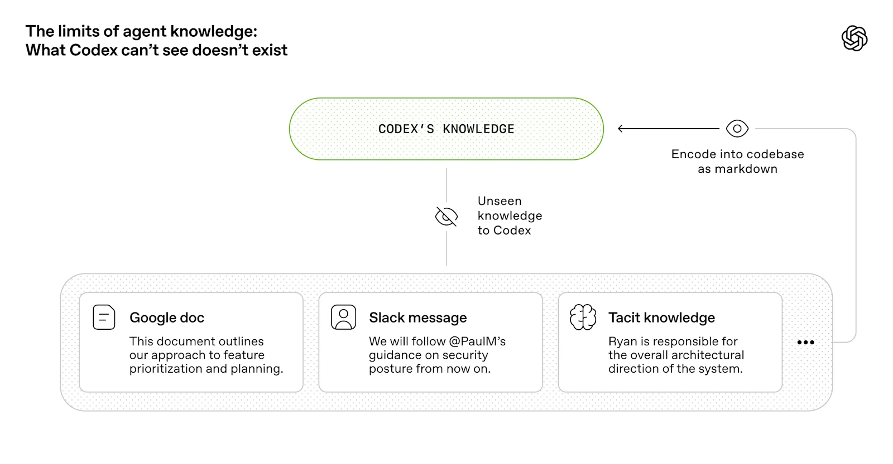

# 工程技术：在智能体优先的世界中利用 Codex

> 原文：OpenAI, [Harness engineering](https://openai.com/zh-Hans-CN/index/harness-engineering/)
> 作者：Ryan Lopopolo
> 发布日期：2026-02-11
> 说明：原文页面已经是简体中文本地化版本；本文档按本地研究资料格式做中文译介与结构化整理，并保留原文正文图片。为避免替代原文，不逐字复刻完整文章。

## 1. 核心观点

这篇文章讨论 OpenAI 团队在一个极端约束下的工程实验：从空 Git 仓库开始，交付一个真实软件产品，但不由人类直接写任何代码。团队让 Codex 负责编写应用逻辑、测试、CI、文档、可观测性和内部工具，人类则负责方向、规格、环境、评审和反馈回路。

文章的关键结论是：当智能体成为主要代码生产者时，软件工程并不会消失，而是转移重心。工程师不再主要靠手写代码创造杠杆，而是通过设计系统、编码约束、维护记录系统、构造可验证反馈环和提升智能体可读性来创造杠杆。

## 2. 从空仓库开始

团队在 2025 年 8 月下旬进行了第一次提交。初始仓库结构、CI、格式化规则、包管理器设置和应用框架都由 Codex CLI 与 GPT-5 生成。甚至指导智能体如何在仓库中工作的初始 `AGENTS.md`，也是 Codex 写出的。

五个月后，这个仓库增长到约一百万行代码，覆盖应用、基础设施、工具、文档和内部开发者体验。三名工程师驱动 Codex，打开并合并了约 1,500 个 PR。这里的重点不是“代码量很大”，而是它表明：如果环境、约束和反馈足够清楚，小团队可以把大量实现劳动转交给智能体。

文章把这种模式概括为：人类掌舵，智能体执行。

## 3. 工程师角色的变化

当人类不再手写代码时，工程师的主要工作变成识别智能体缺少什么能力，并把这些能力做成可读、可执行、可验证的系统部件。

早期进展慢，并不是因为 Codex 无法编码，而是环境没有被充分规范。智能体缺少工具、抽象和内部结构，无法把高级目标稳定落地。团队因此采用深度优先的工作方式：把大目标拆成较小的设计、代码、评审和测试模块，让 Codex 先构造基础能力，再用这些能力解锁更复杂任务。

PR 流程也发生变化。工程师通过提示让 Codex 完成实现、打开 PR、审查自己的更改、请求其他智能体审查、回应反馈，并循环到所有审查者满意。人类仍可审查 PR，但越来越多审查转为智能体对智能体的流程。

## 4. 提高应用程序的可读性

随着 Codex 产出速度提升，瓶颈转向人工 QA。解决办法不是让人检查更多，而是让应用对 Codex 更可读。

团队让应用可以基于 Git worktree 启动，使每次变更都能拥有独立运行实例。他们还把 Chrome DevTools 协议接入智能体运行时，并为 DOM 快照、截图和导航创建技能。这样 Codex 可以复现错误、验证修复，并直接观察 UI 行为。

同样的思路也被用于可观测性。每个工作树拥有临时的本地可观测性栈，任务完成后日志、指标和追踪都会被清理。Codex 可以查询日志、指标和 trace，于是“服务必须在 800ms 内启动”或“关键用户旅程的 span 不超过 2 秒”这类要求，就能变成智能体可验证的目标。

## 5. 仓库是记录系统

文章强调，情境管理是大型智能体任务的核心难题。给 Codex 的应该是一张地图，而不是一本 1,000 页手册。

团队曾尝试把所有规则放进一个巨大 `AGENTS.md`，后来发现这会带来四个问题：占用上下文、稀释重点、快速腐烂、难以机械验证。最终他们把 `AGENTS.md` 降到大约 100 行，把它当作目录，而不是百科全书。

真正的知识库被放进结构化的 `docs/` 目录。每个领域都有自己的入口、所有权、最新状态和交叉链接。Codex 读取短地图，再进入相关文档，而不是一次性被塞进所有背景知识。

## 6. 智能体知识的边界

智能体可以写大量代码，但它不知道团队未显式表达的历史约束、产品取舍、架构品味和隐含风险。文章的一个重要经验是：如果某条知识未来会影响实现，就不要只让它留在人脑里。

人类的判断应沉淀成几类资产：

- 文档：解释领域、边界、设计历史和决策背景。
- 工具：把重复判断转为命令、检查器或自动化流程。
- Lint 和结构测试：把风格、命名、边界和平台要求变成强制规则。
- 技能：告诉 Codex 如何使用仓库工具、如何收集上下文、如何验证结果。

## 7. 架构与品味也要被编码

在传统工程里，“品味”经常通过代码审查、资深工程师口头指导和团队文化传播。在智能体优先的工作流里，这种隐式传播不够可靠。团队需要把架构约束和品味不变式转成机械规则。

文章提到的做法包括：自定义 lint、结构测试、文件大小限制、结构化日志要求、模式和类型命名规范、平台可靠性要求等。因为这些检查是为智能体场景设计的，错误信息本身也会包含修复指令，帮助 Codex 直接改正问题。

这类规则对人类工作流可能显得繁琐，但对智能体是倍增器。一旦规则被编码，它就能被一致、持续、低成本地应用到整个仓库。

## 8. 吞吐量改变合并理念

当 Codex 的吞吐量远超人类注意力时，传统合并策略需要调整。文章指出，在这个仓库里，PR 生命周期很短，阻塞合并门被尽量减少。偶发测试失败通常通过后续重跑处理，而不是让进展长期卡住。

这并不意味着质量不重要，而是成本结构变了。在低吞吐量环境里，等待和审查更便宜；在高吞吐智能体环境里，等待会成为主要损耗，而纠错成本相对降低。因此，团队更倾向于让系统快速前进，再用自动化反馈和持续修复吸收偏差。

## 9. “智能体生成”包含什么

文章里的“由 Codex 生成”不是只指产品代码。Codex 也生成测试、CI、发布工具、内部开发者工具、文档、设计历史、评估框架、审查评论、仓库维护脚本和生产仪表板定义。

人类仍然深度参与，只是参与层级更高。人类决定优先级，将用户反馈翻译成验收标准，验证结果，并在智能体失败时识别系统缺口。修复这些缺口时，原则仍然是让 Codex 自己完成代码变更。

## 10. 自主性持续提高

随着测试、验证、审查、反馈处理和恢复机制被不断编码进系统，Codex 开始能够端到端驱动新功能。给定一个提示，智能体可以验证当前状态、复现 bug、录制故障视频、实现修复、运行应用验证、录制修复后视频、打开 PR、回应反馈、处理构建失败，并在需要判断时交还给人类。

文章也提醒，这种能力高度依赖仓库自己的结构和工具，不能假设不投入同等基础设施就能自然泛化。

## 11. 熵与垃圾回收

完全自主的智能体会复制仓库中已有模式，包括那些不理想的模式。随着时间推移，这会导致架构漂移和技术债积累。

团队一开始靠人工定期清理“AI 残渣”，但这种方式无法扩展。后来他们把所谓“黄金原则”编码进仓库，并建立循环清理流程。后台 Codex 任务会扫描偏差、更新质量等级、发起有针对性的重构 PR。大多数这类 PR 可以快速审查并自动合并。

这类似垃圾回收：技术债不再等到堆积成灾才处理，而是持续以小批量方式偿还。人类的品味一旦被捕捉，就可以持续作用于每一行代码。

## 12. 仍在学习的问题

文章最后承认，这种模式仍有未解问题。团队还不确定完全由智能体生成的系统，其架构连贯性会如何长期演化；也还在学习人类判断在哪些位置最有价值，以及如何把这些判断编码进系统。

可以确定的是，软件工程仍然需要纪律。只是纪律不再主要体现在人手写代码时的自控，而更多体现在支撑结构：工具、抽象、文档、边界、反馈回路和控制系统。随着 Codex 这类智能体进入更多软件生命周期环节，这些“让智能体可靠工作的工程”会越来越重要。
