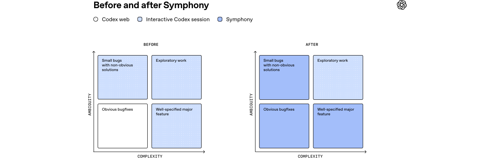

# 开源 Codex 编排：Symphony 中文译介

> 原文：OpenAI, [Open-source Codex orchestration: Symphony](https://openai.com/index/open-source-codex-orchestration-symphony/)
> 作者：Alexi Christakis、Boris Power、Brandon Chu、Daniel Hansson、Guzman Diaz、Matan Grinberg、Michelle Pokrass
> 发布日期：2026-04-29
> 说明：本文档为中文译介与结构化整理，保留原文图片；为避免替代原文，不逐字复刻完整文章与大段 `SPEC.md` 代码块。

## 1. 文章核心

Symphony 是 OpenAI 开源的一套 Codex 编排示例。它的重点不是“再做一个聊天式代码助手”，而是展示一种更高吞吐的工作方式：把 issue tracker 当作多智能体系统的状态机，让多个 Codex 智能体围绕明确任务并行工作、更新状态、产出 PR，并把人工从逐条交互中解放出来。

文章开头提到，OpenAI 在 2026 年 4 月 16 日发布 Codex CLI；截至 4 月 23 日，这个项目已经获得超过 15,000 个 GitHub stars。团队随后把内部使用的 Codex 编排思路整理成 Symphony，并以开源形式发布，方便社区复用、改造和批评。

## 2. 为什么需要编排

Codex 这样的编码智能体已经能完成大量工程任务，但传统交互方式存在一个明显上限：工程师需要在多个 agent 之间频繁切换上下文、跟进进度、补充指令、检查输出。单个 agent 很强时，人会变成瓶颈。

Symphony 的出发点是改变协作单位：

- 不再把 agent 当成“聊天窗口里的助手”，而是把它当成围绕工作项执行的后台工人。
- 不再由人手动串联每一步，而是让任务、状态、依赖关系和验收条件显式化。
- 不再只追求单次对话质量，而是追求整个团队在一批任务上的并行吞吐。

这种视角下，issue tracker 不只是项目管理工具，而是 agentic coding 的协调平面。任务状态、父子关系、依赖图、评论、PR 链接和验收记录，都可以成为多智能体协作的共享上下文。

## 3. Symphony 的工作模型

Symphony 使用 Linear 作为示例性的任务系统。一个高级任务可以被拆成多个子任务；子任务之间可以形成有向无环图；每个节点可以由不同 Codex agent 处理。agent 不只是读取任务，还可以创建新任务、更新状态、评论进度、提交 PR。

文章强调的几个实践变化：

- 更大的任务可以被拆成可并行推进的工作图，而不是压成一个巨大的提示词。
- agent 可以在手机上被启动和检查，降低了发起探索和后台执行的成本。
- PM、设计师或工程师都可以在熟悉的 issue tracker 中描述需求，不必进入特殊的 AI 控制台。
- agent 产出的失败结果也有价值，因为失败会暴露缺失的规格、薄弱的测试、模糊的边界或错误的假设。

在 OpenAI 内部，作者们用这种方式显著提高了 PR 吞吐量。文章给出的量级是：在使用 Symphony 后，OpenAI 某团队的周均 PR 数提升约 500%。这个数字不是说所有任务都适合自动化，而是说明当编排层足够清晰时，agent 能把大量“可规格化、可验证、可并行”的工程工作推到后台。

## 4. 实践中的问题

Symphony 并不把 agentic coding 描述成无摩擦的银弹。文章反而花了不少篇幅说明引入编排后出现的新问题。

首先，人会失去一部分“中途微调”的感觉。过去工程师可以在聊天中随时纠偏；现在 agent 可能已经在后台跑了一段时间，才通过任务状态、评论或 PR 暴露进展。因此，任务规格、验收标准和反馈通道变得更重要。

其次，失败任务需要被系统性吸收。失败不应该只是“这个 agent 做坏了”，而应转化为更好的 guardrails、更清楚的技能说明、更完整的端到端测试、更可靠的浏览器自动化验证、更好的文档和更小的任务切分。

第三，不是所有工作都适合这种模式。探索性很强、目标不清、需要密集产品判断的任务，仍然需要更多人工参与。更适合 Symphony 的，是目标清楚、上下文可提供、验证方式可表达、可以并行或批量执行的任务。

## 5. 他们如何用 Symphony 构建 Symphony

文章中最有意思的一点是：Symphony 本身也是用类似 Symphony 的方式构建出来的。

团队先写了一份详细的 `SPEC.md`，把问题、目标、非目标、核心组件、任务生命周期、Linear 集成、Codex App Server 协议、配置方式、日志与验收要求都表达清楚。然后，他们让 Codex 根据这份规格实现第一个版本。最初版本基于 Elixir，把多个 Codex agent 运行在同一台机器上的不同 tmux 会话里。

在验证内部产品契合度之后，团队又让 Codex 生成第二个版本：一个更适合开源的、独立于内部工具链的仓库版本。这里的关键不是绑定某种语言，而是把编排模式本身提炼出来。文章提到，Codex 还帮助他们把原型迁移到新的开源仓库、删掉内部复杂性、补齐公开说明，并保持实现尽量小。

## 6. `SPEC.md` 的设计含义

原文包含了一大段规格文件。这里不复刻全文，只提炼它传达的工程意图：

- **问题定义**：交互式单 agent 工作流会让人陷入上下文切换，难以规模化。
- **目标**：建立可观察、可恢复、可配置的多 agent 编排层。
- **非目标**：不是完整产品，也不试图替代 issue tracker 或 CI 系统。
- **核心组件**：Linear 作为任务状态源，Codex App Server 作为 agent 执行接口，编排器负责监听、调度、状态更新和失败处理。
- **生命周期**：任务从候选、启动、执行、更新、完成到失败，都要有明确状态流转。
- **配置与扩展**：组织、团队、标签、过滤条件、模型选择、并发限制等应能配置。
- **可观测性**：日志、状态回写、PR 链接和错误信息必须让人能追踪发生了什么。

这种规格先行的方式很关键。对于多 agent 系统，提示词只是一部分；更重要的是把状态机、输入输出、失败路径和验收方式写清楚。

## 7. 开源版本的定位

OpenAI 把 Symphony 描述成一个最小参考实现，而不是一个打包好的企业产品。它的价值在于展示：

- 如何把 Codex agent 接到现实工程流程里；
- 如何用 issue tracker 管理 agent 工作；
- 如何用小而清晰的协议连接任务系统与执行系统；
- 如何把 agent 产物纳入 PR、测试、文档和评审流程。

换句话说，Symphony 更像一份可运行的架构草图。不同团队可以把 Linear 换成自己的任务系统，把 Codex App Server 接入方式换成自己的执行环境，把状态流和验收策略改成符合自身工程文化的版本。

## 8. 对工程团队的启发

这篇文章真正想推动的变化，是从“我如何更快写代码”转向“团队如何管理一批正在工作的编码智能体”。当 agent 成本下降、启动变容易、并发变自然，工程管理的瓶颈会从写代码转移到定义任务、提供上下文、验证结果和处理失败。

对团队来说，值得优先建设的不是更花哨的聊天界面，而是这些基础能力：

- 高质量 issue 模板和任务拆分规范；
- 清晰的 done 标准和自动化验收；
- 可靠的测试、日志和可复现环境；
- 能让 agent 安全读取、修改和提交代码的权限边界；
- 将失败沉淀回文档、测试、技能和 guardrails 的循环。

Symphony 的意义在于把这些工程实践串到同一个工作流里。它不是让人退出软件工程，而是把人的注意力推向更高层的规格、评审和系统设计。
