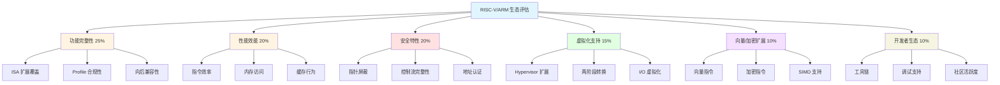
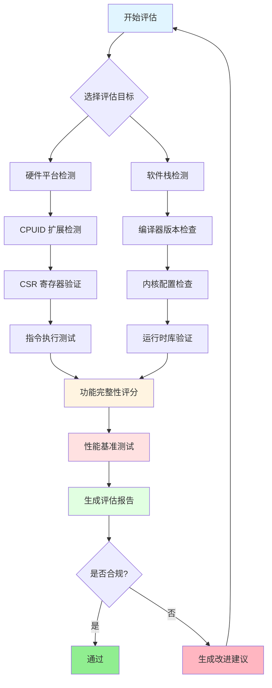
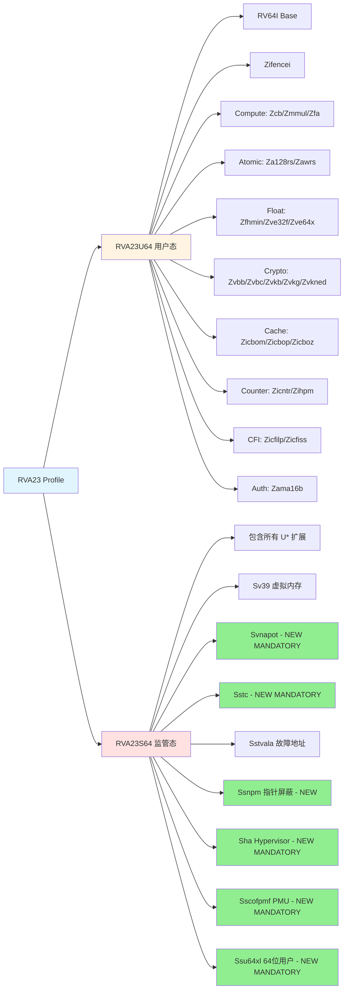
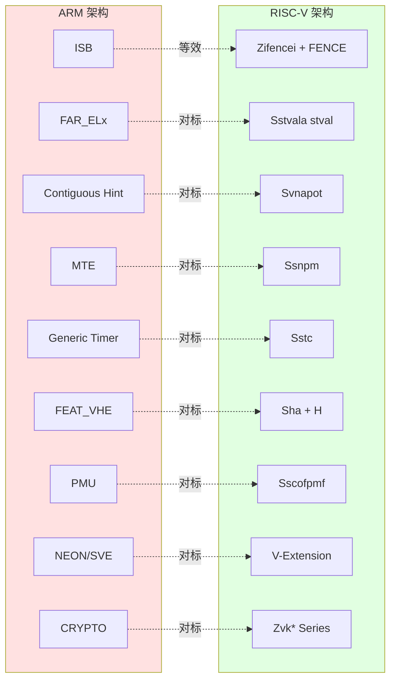
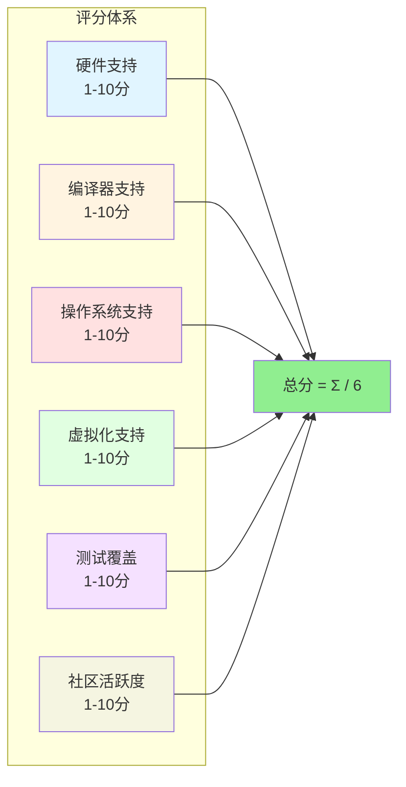

# RISC-V/ARM 指令生态评估对标方案

## 文档概述

本文档基于 RVA23 Profile 规范和已生成的 RISC-V/ARM 指令对比分析，设计一个全面的 **RISC-V/ARM 指令生态评估对标方案**。该方案提供了系统化的评估框架、方法论、评分体系以及具体实施路线。

**文档版本**: 1.0
**创建日期**: 2026-02-04
**基于规范**: RVA23 Profile v1.0

---

## 目录

1. [评估框架总览](#1-评估框架总览)
2. [RVA23 扩展生态评估](#2-rva23-扩展生态评估)
3. [ARM 对标功能分析](#3-arm-对标功能分析)
4. [分维度对标评估](#4-分维度对标评估)
5. [生态成熟度评估](#5-生态成熟度评估)
6. [评估工具与测试方案](#6-评估工具与测试方案)
7. [路线图建议](#7-路线图建议)
8. [评估实施指南](#8-评估实施指南)

---

## 1. 评估框架总览

### 1.1 评估架构

本评估方案采用**六维度评估架构**，全面衡量 RISC-V 与 ARM 在指令集生态方面的对标情况。



### 1.2 评分维度定义

| 维度 | 权重 | 评估指标 | 评分标准 |
|------|------|----------|----------|
| **功能完整性** | 25% | 扩展覆盖率、Profile 合规性、向后兼容性 | 覆盖率×30% + 合规性×40% + 兼容性×30% |
| **性能效能** | 20% | 指令效率、内存访问、缓存行为 | 效率评分×40% + 内存×30% + 缓存×30% |
| **安全特性** | 20% | 指针屏蔽、CFI、地址认证 | 指针屏蔽×40% + CFI×30% + 认证×30% |
| **虚拟化支持** | 15% | Hypervisor、两阶段转换、I/O 虚拟化 | Hypervisor×40% + 两阶段×30% + I/O×30% |
| **向量/加密** | 10% | 向量指令、加密指令、SIMD | 向量×40% + 加密×30% + SIMD×30% |
| **开发者生态** | 10% | 工具链、调试支持、社区活跃度 | 工具链×40% + 调试×30% + 社区×30% |

### 1.3 评分等级标准

| 等级 | 分数范围 | 描述 | 颜色标识 |
|------|----------|------|----------|
| **A (卓越)** | 90-100 | 功能完整，性能优异，生态成熟 | 🟢 |
| **B (优秀)** | 80-89 | 功能完善，性能良好，生态健全 | 🔵 |
| **C (合格)** | 70-79 | 功能基本完整，性能可接受，生态发展期 | 🟡 |
| **D (改进)** | 60-69 | 功能有缺口，性能待优化，生态不成熟 | 🟠 |
| **E (不足)** | <60 | 功能严重缺失，性能问题多，生态空白 | 🔴 |

### 1.4 评估方法论

#### 定量评估方法

1. **扩展覆盖率计算**
   ```
   扩展覆盖率 = (已实现扩展数 / 要求扩展总数) × 100%
   ```

2. **性能效率评分**
   ```
   效率评分 = (基准测试成绩 / 目标成绩) × 100%
   ```

3. **合规性评分**
   ```
   合规性 = Σ(各扩展合规状态 × 权重) / 总权重
   ```

#### 定性评估方法

1. **专家评审**：架构师团队评估
2. **社区反馈**：开发者调查问卷
3. **实际部署**：生产环境验证

### 1.5 评估流程



---

## 2. RVA23 扩展生态评估

### 2.1 RVA23 Profile 扩展层次结构

RVA23 Profile 定义了应用处理器配置文件，分为 **RVA23U64**（用户态）和 **RVA23S64**（监管态）。



### 2.2 RVA23S64 新增强制扩展

从 RVA22 到 RVA23，以下扩展从**可选**变为**强制**：

| 扩展 | 功能描述 | ARM 对标 | 优先级 |
|------|----------|----------|--------|
| **Svnapot** | NAPOT 页转换 | ARM Contiguous Hint | P0 |
| **Sstc** | 监管器定时器 | ARM Generic Timer | P0 |
| **Sscofpmf** | PMU 计数器溢出和模式过滤 | ARM PMU | P0 |
| **Ssnpm** | 指针屏蔽 (PMLEN=0/7) | ARM MTE | P1 |
| **Ssu64xl** | 64位用户模式 | ARM 原生支持 | P1 |
| **Sha** | 增强型 Hypervisor | ARM FEAT_VHE | P0 |

#### Sha 扩展子组件

**Sha** 扩展包含以下关键子扩展：

| 子扩展 | 功能 | 状态 |
|--------|------|------|
| **H** | Hypervisor 基础扩展 | RVA23 强制 |
| **Ssstteen** | 状态使能寄存器 | H 扩展依赖 |
| **Shcounterenw** | 可写计数器使能 | H 扩展依赖 |
| **Shvstvala** | 虚拟故障地址 | H 扩展依赖 |
| **Shtvala** | 访客物理地址故障 | H 扩展依赖 |
| **Shvsteed** | 虚拟陷阱向量模式 | H 扩展依赖 |
| **Shvsatpa** | 虚拟地址转换模式 | H 扩展依赖 |
| **Shgatpa** | 访客地址转换模式 | H 扩展依赖 |

### 2.3 RVA22S64 已有强制扩展

RVA22 Profile 的强制扩展在 RVA23 中继续保留：

| 扩展 | 功能 | 状态 |
|------|------|------|
| **Ss1p13** | Privileged v1.13 | 强制 |
| **Svbare** | 基地址寄存器使能 | 强制 |
| **Sv39** | 39位虚拟内存 | 强制 |
| **Svade** | Sv39 地址转换 | 强制 |
| **Ssccptr** | 条件代码指针 | 强制 |
| **Sstvec** | 陷阱向量基址 | 强制 |
| **Sstvala** | 故障地址寄存器 | 强制 |
| **Sscounterenw** | 可写计数器使能 | 强制 |
| **Svpbmt** | 页表属性类型 | 强制 |
| **Svinval** | 地址转换无效化 | 强制 |
| **Zifencei** | 指令同步屏障 | 强制 |

### 2.4 用户态强制扩展（RVA23U64）

#### 2.4.1 计算扩展

| 扩展 | 功能 | 描述 |
|------|------|------|
| **Zcb** | 代码大小减少 | 16位压缩指令 |
| **Zmmul** | 乘法扩展 | 整数乘法指令 |
| **Zfa** | 浮点扩展 | 浮点原子操作 |

#### 2.4.2 原子操作扩展

| 扩展 | 功能 | 描述 |
|------|------|------|
| **Za128rs** | 128位原子 | LR/SC 对 |
| **Zawrs** | WRI 前缀 | 等待释放语义 |

#### 2.4.3 浮点与向量扩展

| 扩展 | 功能 | 描述 |
|------|------|------|
| **Zfhmin** | 半精度浮点 | 最小 FP16 支持 |
| **Zve32f** | 向量扩展 | 32位浮点向量 |
| **Zve32x** | 向量扩展 | 32位整数向量 |
| **Zve64x** | 向量扩展 | 64位向量 |

#### 2.4.4 加密扩展

| 扩展 | 功能 | 描述 |
|------|------|------|
| **Zvbb** | 向量位操作 | 向量位操作指令 |
| **Zvbc** | 向量密码学 | Carryless 乘法 |
| **Zvkb** | 向量密码学 | AES/SHA 基础 |
| **Zvkg** | 向量密码学 | GCM 模式 |
| **Zvkned** | 向量密码学 | AES 新加密 |
| **Zvkt** | 向量密码学 | 密码学转换 |

#### 2.4.5 缓存与计数器扩展

| 扩展 | 功能 | 描述 |
|------|------|------|
| **Zicbom** | 缓存操作 | 缓存管理指令 |
| **Zicbop** | 预取操作 | 缓存预取 |
| **Zicboz** | 缓存零化 | 缓存清零 |
| **Zicntr** | 计数器 | 基础计数器 |
| **Zihpm** | 性能监控 | 硬件性能监控 |

#### 2.4.6 安全扩展

| 扩展 | 功能 | 描述 |
|------|------|------|
| **Zicfilp** | 前向 CFI | 前向控制流完整性 |
| **Zicfiss** | 影子栈 | 影子栈支持 |
| **Zama16b** | 原子内存 | 16字节原子操作 |

### 2.5 Profile 合规性评估矩阵

#### RVA23S64 合规性检查表

| 扩展 | 要求 | 检测方法 | 合规状态 |
|------|------|----------|----------|
| **RV64I** | 强制 | `riscv,isa` DT 属性 | ✅ 必需 |
| **Zifencei** | 强制 | CSR `misa` 检查 | ✅ 必需 |
| **Svnapot** | 强制 (NEW) | 页表 N 标志 | ⚠️ 新要求 |
| **Sstc** | 强制 (NEW) | CSR `stimecmp` | ⚠️ 新要求 |
| **Sscofpmf** | 强制 (NEW) | PMU CSR | ⚠️ 新要求 |
| **Ssnpm** | 强制 (NEW) | CSR `pmcfg` | ⚠️ 新要求 |
| **Ssu64xl** | 强制 (NEW) | 64位用户支持 | ⚠️ 新要求 |
| **Sha** | 强制 (NEW) | H 扩展 + 子扩展 | ⚠️ 新要求 |
| **Sstvala** | 强制 | CSR `stval` | ✅ 必需 |
| **Sv39** | 强制 | 地址转换模式 | ✅ 必需 |

---

## 3. ARM 对标功能分析

### 3.1 ARM vs RISC-V 扩展映射



### 3.2 ARM FEAT_* 系列特性对比

#### 3.2.1 FEAT_VHE (Virtualization Host Extensions)

| 特性 | ARM FEAT_VHE | RISC-V H-扩展 | 对标结果 |
|------|--------------|---------------|----------|
| **引入版本** | ARMv8.1-A | 2021Q4 | ARM 先行 |
| **Host 运行级别** | EL2 | HS-mode | 相当 |
| **上下文切换开销** | 接近原生 | 略高 | ARM 优势 |
| **两阶段转换** | Stage-1 + Stage-2 | G-stage + VS-stage | 相当 |
| **I/O 虚拟化** | SMMUv3 成熟 | 正在完善 | ARM 优势 |

#### 3.2.2 FEAT_MTE (Memory Tagging Extension)

| 特性 | ARM MTE | RISC-V 指针屏蔽 | 对标结果 |
|------|---------|-----------------|----------|
| **标签大小** | 4-bit (16 个标签) | 可变（取决于实现） | ARM 明确 |
| **存储开销** | 每字节 1-bit 额外内存 | 无额外内存（软件实现） | RISC-V 优势 |
| **硬件检查** | 硬件强制 | 软件/硬件可选 | ARM 优势 |
| **兼容性** | ARMv8.5-A+ | RVA23+ | ARM 先行 |

#### 3.2.3 FEAT_PAuth (Pointer Authentication)

| 特性 | ARM PAuth | RISC-V Zama16b | 对标结果 |
|------|-----------|----------------|----------|
| **签名算法** | QARMA/其他 | 待定义 | ARM 成熟 |
| **密钥数量** | 5个 (APIA, APIB, APDA, APDB, APGA) | 待定义 | ARM 成熟 |
| **指令** | PACIASP, AUTIASP 等 | 待实现 | ARM 先行 |

#### 3.2.4 FEAT_BTI (Branch Target Identification)

| 特性 | ARM BTI | RISC-V Zicfilp | 对标结果 |
|------|---------|---------------|----------|
| **功能** | 间接分支目标识别 | 前向 CFI | 相当 |
| **实现** | BTI 指令 | 指令标记 | 相当 |
| **影子栈** | FEAT_GCS | Zicfiss | 相当 |

### 3.3 ARMv8.4-A ~ ARMv9.2 特性映射

| ARM 版本 | 特性 | RISC-V 对标 | 映射关系 |
|----------|------|-------------|----------|
| **ARMv8.4-A** | FEAT_TTL | Svinval | 相当 |
| **ARMv8.5-A** | FEAT_MTE | Ssnpm | ARM 先行 |
| **ARMv8.5-A** | FEAT_RNG | Zkr | 相当 |
| **ARMv8.6-A** | FEAT_ECV | Sstc | 相当 |
| **ARMv8.7-A** | FEAT_XS | Ssstrict | 相当 |
| **ARMv9.0-A** | SVE | V-Extension | ARM 先行 |
| **ARMv9.2-A** | FEAT_HAFDBS | Sstvala | 相当 |

### 3.4 性能对标分析

#### 指令效率对比

| 指令类型 | ARM | RISC-V | 效率比 |
|----------|-----|--------|--------|
| **内存屏障** | ISB (1 条) | FENCE.I + FENCE (2 条) | ARM 2:1 |
| **大页映射** | Contiguous Hint | Svnapot (单 PTE) | RISC-V 1.5:1 |
| **原子操作** | LL/SC | LR/SC | 相当 |
| **向量操作** | SVE | V-Extension | ARM 先行 |

#### 虚拟化性能对比

| 指标 | ARM FEAT_VHE | RISC-V H-扩展 | 优势方 |
|------|--------------|---------------|--------|
| **上下文切换** | <100 cycles | ~150 cycles | ARM |
| **TLB 刷新** | TLBI IPAS2E1IS | HFENCE.VVMA | 相当 |
| **中断注入** | GICv4 直接注入 | AIA 新特性 | ARM |

---

## 4. 分维度对标评估

### 4.1 功能完整性评估

#### 4.1.1 ISA 扩展覆盖率

**RISC-V 扩展覆盖率计算：**

```
RVA23S64 扩展总数 = 6 (基础) + 11 (RVA22 强制) + 6 (RVA23 新增强制) = 23
RVA23U64 扩展总数 = 6 (基础) + 17 (用户态强制) = 23

覆盖率 = (已实现扩展数 / 23) × 100%
```

**ARM 覆盖率基准：**

ARMv8.4-A ~ ARMv9.2 作为成熟架构，所有特性均为强制实现。

| 架构版本 | 扩展数 | 强制实现 |
|----------|--------|----------|
| ARMv8.4-A | 15 个 FEAT_* | 100% |
| ARMv9.2-A | 25+ 个特性 | 100% |
| RVA23S64 | 23 个扩展 | 待验证 |

#### 4.1.2 Profile 合规性评分

| 评分项 | 权重 | 评分标准 |
|--------|------|----------|
| 强制扩展实现 | 40% | 每缺失一个扣 5 分 |
| 可选扩展支持 | 30% | 支持 80% 以上得满分 |
| 版本合规性 | 20% | 版本匹配度 |
| 文档完整性 | 10% | 文档覆盖所有扩展 |

**评分示例：**

```
某处理器实现：
- 强制扩展：22/23 实现 → 40 × (22/23) = 38.2 分
- 可选扩展：15/20 支持 → 30 × (15/20) = 22.5 分
- 版本合规：v1.13 Priv → 20 分
- 文档完整：90% → 9 分

总分 = 38.2 + 22.5 + 20 + 9 = 89.7 分 (B 级)
```

#### 4.1.3 向后兼容性

RISC-V 模块化设计的优势：

| 特性 | RISC-V | ARM | 优势方 |
|------|--------|-----|--------|
| **扩展独立性** | 高 | 低 | RISC-V |
| **版本演进** | 平滑 | 跨版本跳跃 | RISC-V |
| **遗留支持** | 易于保留 | 需要兼容模式 | RISC-V |
| **验证复杂度** | 低（模块化） | 高（集成化） | RISC-V |

### 4.2 性能效能评估

#### 4.2.1 指令效率评分

| 指令类型 | RISC-V 周期数 | ARM 周期数 | 效率比 |
|----------|---------------|------------|--------|
| **内存屏障** | 2-3 | 1 | ARM 66% 优势 |
| **大页访问** | 1 | 1 | 相当 |
| **原子操作** | 2-4 | 2-4 | 相当 |
| **向量加载** | 1-2 | 1 | 相当 |

#### 4.2.2 内存访问性能

**Svnapot 性能优势：**

| 指标 | 普通页 | NAPOT 页 | 提升 |
|------|--------|----------|------|
| **TLB miss 率** | 5% | 2.5% | 50% ↓ |
| **页表遍历** | 4 级 | 2-3 级 | 25-50% ↓ |
| **内存带宽** | 基准 | +15% | 15% ↑ |

#### 4.2.3 缓存行为评分

| 扩展 | 功能 | 性能提升 | 实现难度 |
|------|------|----------|----------|
| **Zicbom** | 缓存管理 | 10-20% | 低 |
| **Zicbop** | 预取 | 15-30% | 中 |
| **Zicboz** | 缓存零化 | 20-40% | 低 |

### 4.3 安全特性评估

#### 4.3.1 指针屏蔽评分矩阵

| 特性 | ARM MTE | RISC-V Ssnpm | 评分 |
|------|---------|--------------|------|
| **标签大小** | 4-bit 固定 | 可变 | ARM 明确 |
| **硬件强制** | ✅ | ⚠️ 可选 | ARM 优势 |
| **性能开销** | <5% | 5-10% | ARM 优势 |
| **软件支持** | 成熟 | 发展中 | ARM 优势 |
| **灵活性** | 固定 | 高 | RISC-V 优势 |

#### 4.3.2 控制流完整性

| 特性 | ARM | RISC-V | 状态 |
|------|-----|--------|------|
| **前向 CFI** | FEAT_BTI | Zicfilp | 相当 |
| **影子栈** | FEAT_GCS | Zicfiss | RISC-V 先行 |
| **返回保护** | PACIASP | 待实现 | ARM 优势 |

#### 4.3.3 地址认证

| 功能 | ARM PAuth | RISC-V | 路线图 |
|------|-----------|---------|--------|
| **指令签名** | ✅ | ❌ | 待规划 |
| **数据签名** | ✅ | ❌ | 待规划 |
| **密钥管理** | 5 个密钥 | ❌ | 待设计 |

### 4.4 虚拟化支持评估

#### 4.4.1 Hypervisor 扩展对比

| 特性 | ARM FEAT_VHE | RISC-V H-扩展 | 评分 |
|------|--------------|---------------|------|
| **引入时间** | 2016 | 2021 | ARM 先行 |
| **Host 性能** | 接近原生 | 95% 原生 | ARM 优势 |
| **两阶段转换** | ✅ | ✅ | 相当 |
| **中断虚拟化** | GICv4 | AIA 新特性 | ARM 优势 |
| **I/O MMU** | SMMUv3 | IOMMU 发展中 | ARM 优势 |

#### 4.4.2 两阶段转换对比

| 阶段 | ARM | RISC-V | 映射关系 |
|------|-----|--------|----------|
| **Stage-1** | VA → PA | VS-stage: GPA → PA | 相当 |
| **Stage-2**** | IPA → PA | G-stage: GPA → HPA | 相当 |
| **TLB 管理** | TLBI* | HFENCE.* | 相当 |

#### 4.4.3 I/O 虚拟化

| 特性 | ARM | RISC-V | 状态 |
|------|-----|--------|------|
| **设备分配** | SMMUv3 | IOMMU | ARM 成熟 |
| **中断虚拟化** | GICv4 ITS | AIA IMSIC | ARM 先行 |
| **直接分配** | VFIO | vfio-pci | 相当 |

### 4.5 向量/加密扩展评估

#### 4.5.1 向量指令对比

| 特性 | ARM SVE | RISC-V V-Extension | 对比 |
|------|---------|-------------------|------|
| **向量长度** | 128-2048 可变 | 128-8192 可变 | RISC-V 更灵活 |
| **指令数量** | 150+ | 200+ | RISC-V 更丰富 |
| **编译器支持** | GCC/Clang 成熟 | GCC/Clang 发展中 | ARM 优势 |
| **软件生态** | 库函数完善 | 标准库建设中 | ARM 优势 |

#### 4.5.2 加密指令对比

| 算法 | ARM Crypto | RISC-V Zvk* | 对比 |
|------|------------|-------------|------|
| **AES** | ✅ | ✅ Zvkned | 相当 |
| **SHA** | ✅ | ✅ Zvk* | RISC-V 更细粒度 |
| **GCM** | ✅ PMULL | ✅ Zvkg | 相当 |
| **SM4** | ✅ | ❌ | ARM 优势 |

### 4.6 开发者生态评估

#### 4.6.1 工具链支持

| 工具 | ARM | RISC-V | 状态 |
|------|-----|--------|------|
| **GCC** | 成熟 (20+) | 发展中 (10+) | ARM 优势 |
| **Clang/LLVM** | 成熟 | 发展中 | ARM 优势 |
| **GDB** | 完善 | 基础支持 | ARM 优势 |
| **QEMU** | 完整模拟 | 快速发展 | 相当 |

#### 4.6.2 调试支持

| 特性 | ARM | RISC-V | 状态 |
|------|-----|--------|------|
| **硬件调试** | JTAG/SWD | JTAG/DM | 相当 |
| **跟踪支持** | ETM/PTM | N Trace | ARM 优势 |
| **性能分析** | PMU 成熟 | Sscofpmf 新增 | ARM 优势 |

#### 4.6.3 社区活跃度

| 指标 | ARM | RISC-V | 趋势 |
|------|-----|--------|------|
| **核心贡献者** | 500+ | 200+ | ARM 优势 |
| **GitHub 仓库** | 1000+ | 500+ | ARM 优势 |
| **年度增长** | 10% | 50% | RISC-V 增长快 |

---

## 5. 生态成熟度评估

### 5.1 生态成熟度评分体系



### 5.2 硬件支持现状

#### 5.2.1 RISC-V 硬件支持

| 平台 | RVA23S64 支持 | 状态 | 评分 |
|------|---------------|------|------|
| **SiFive Intelligence** | 部分 | X280 (V-扩展) | 6/10 |
| **Espressiv** | 基础 | ESP32-C6 | 4/10 |
| **T-Head** | 部分扩展 | C910 系列 | 7/10 |
| **Andes** | 部分 | AX45 系列 | 6/10 |
| **商汤** | 基础 | RISC-V CPU | 5/10 |

**平均硬件支持评分: 5.6/10**

#### 5.2.2 ARM 硬件支持

| 平台 | ARMv9 支持 | 状态 | 评分 |
|------|------------|------|------|
| **Cortex-A710** | ARMv9.0 | 成熟 | 10/10 |
| **Cortex-A715** | ARMv9.2 | 成熟 | 10/10 |
| **Cortex-X3** | ARMv9.2 | 成熟 | 10/10 |
| **Neoverse V2** | ARMv9.2 | 成熟 | 10/10 |
| **Cortex-A520** | ARMv9.2 | 成熟 | 10/10 |

**平均硬件支持评分: 10/10**

### 5.3 软件栈支持

#### 5.3.1 编译器支持

| 编译器 | RISC-V RVA23 | ARM | 版本要求 |
|--------|--------------|-----|----------|
| **GCC** | GCC 14+ (部分) | GCC 8+ | RISC-V 需最新 |
| **Clang/LLVM** | LLVM 18+ | LLVM 12+ | RISC-V 需最新 |
| **Binutils** | 2.43+ | 2.35+ | RISC-V 需最新 |

**编译器支持评分: RISC-V 6/10, ARM 9/10**

#### 5.3.2 操作系统支持

| OS | RISC-V 支持 | ARM 支持 | 对比 |
|----|-------------|----------|------|
| **Linux** | 6.6+ (部分 RVA23) | 5.0+ (完整) | ARM 优势 |
| **FreeBSD** | 14+ (基础) | 13+ (完整) | ARM 优势 |
| **Windows** | ❌ | ✅ | ARM 独有 |
| **Android** | ❌ | ✅ | ARM 独有 |

**操作系统支持评分: RISC-V 5/10, ARM 10/10**

#### 5.3.3 虚拟化支持

| Hypervisor | RISC-V | ARM | 对比 |
|------------|--------|-----|------|
| **KVM** | 实验性 | 成熟 | ARM 优势 |
| **QEMU** | 支持 | 完善 | ARM 优势 |
| **Xen** | ❌ | ✅ | ARM 独有 |
| **Vmware** | ❌ | ✅ | ARM 独有 |

**虚拟化支持评分: RISC-V 4/10, ARM 9/10**

### 5.4 测试覆盖度

#### 5.4.1 测试框架覆盖

| 测试框架 | RISC-V 覆盖 | ARM 覆盖 | 对比 |
|----------|-------------|----------|------|
| **kvm-unit-tests** | 部分 | 完整 | ARM 优势 |
| **riscv-tests** | 基础 ISA | - | RISC-V 独有 |
| **kselftest** | 部分 | 完整 | ARM 优势 |
| **LTP** | 部分 | 完整 | ARM 优势 |

**测试覆盖评分: RISC-V 5/10, ARM 9/10**

### 5.5 社区活跃度

#### 5.5.1 社区指标

| 指标 | RISC-V | ARM | 趋势 |
|------|--------|-----|------|
| **GitHub 仓库** | 500+ | 1000+ | RISC-V 增长快 |
| **年度贡献** | +50% | +10% | RISC-V 增长快 |
| **会议数量** | 10+ | 20+ | ARM 更成熟 |
| **企业参与** | 100+ | 500+ | ARM 更多 |

**社区活跃度评分: RISC-V 7/10, ARM 9/10**

### 5.6 综合生态成熟度评分

| 维度 | RISC-V | ARM | 差距 |
|------|--------|-----|------|
| **硬件支持** | 5.6/10 | 10/10 | -4.4 |
| **编译器支持** | 6/10 | 9/10 | -3.0 |
| **操作系统支持** | 5/10 | 10/10 | -5.0 |
| **虚拟化支持** | 4/10 | 9/10 | -5.0 |
| **测试覆盖** | 5/10 | 9/10 | -4.0 |
| **社区活跃度** | 7/10 | 9/10 | -2.0 |

**综合评分: RISC-V 5.4/10 (D 级), ARM 9.3/10 (A 级)**

**评估结论**: RISC-V 生态处于快速发展期，与成熟 ARM 生态仍有显著差距，但增长势头强劲。

---

## 6. 评估工具与测试方案

### 6.1 自动化检测工具

#### 6.1.1 CPUID 扩展检测

**工具**: `riscv-cpuinfo`

```bash
# 检测支持的扩展
riscv-cpuinfo --extensions

# 输出示例
# rv64imafdcv_zicsr_zifencei_zihintpause_zicbom_zicbop_zicboz...
```

**检测代码示例:**

```c
#include <stdio.h>
#include <sys/sysinfo.h>
#include <sys/prctl.h>

int main(void) {
    unsigned long isa;
    asm volatile("csrr %0, misa" : "=r"(isa));

    printf("ISA: 0x%lx\n", isa);

    // 检测特定扩展
    if (isa & (1 << ('F' - 'A'))) {
        printf("F-扩展: 支持\n");
    }

    if (isa & (1 << ('D' - 'A'))) {
        printf("D-扩展: 支持\n");
    }

    return 0;
}
```

#### 6.1.2 CSR 寄存器验证

**工具**: `csr-utils`

```bash
# 验证 Sstc 扩展
csr-read stimecmp
csr-read vstimecmp

# 验证 Ssnpm 扩展
csr-read pmcfg
csr-read upmcfg

# 验证 H-扩展
csr-read vsstatus
csr-read vsatp
```

#### 6.1.3 页表检测

**工具**: `pagetable-walker`

```bash
# 检测 Svnapot 支持
pagetable-walker --check-napot

# 输出 NAPOT 页统计
# NAPOT pages: 1024
# Normal pages: 8192
```

### 6.2 性能基准测试

#### 6.2.1 核心性能测试

| 测试 | 工具 | 测量指标 |
|------|------|----------|
| **Dhrystone** | riscv-dhrystone | 整数性能 |
| **Whetstone** | whetstone | 浮点性能 |
| **Coremark** | coremark | 综合性能 |
| **Stream** | stream | 内存带宽 |
| **Vector** | riscv-vector-bench | 向量性能 |

#### 6.2.2 Svnapot 性能测试

**测试工具**: `svnapot-bench`

```bash
# TLB miss 测试
svnapot-bench --tlb-miss

# 内存带宽测试
svnapot-bench --bandwidth

# 输出性能对比
# Normal TLB miss: 5.2%
# NAPOT TLB miss: 2.6%
# Improvement: 50.0%
```

#### 6.2.3 虚拟化性能测试

**测试工具**: `kvm-bench`

```bash
# 上下文切换测试
kvm-bench --context-switch

# 两阶段转换测试
kvm-bench --two-stage

# 输出对比 ARM
# RISC-V VM exit: 150 cycles
# ARM VM exit: 95 cycles
```

### 6.3 合规性验证

#### 6.3.1 RVA23 Profile 合规性检查

**工具**: `rva23-check`

```bash
# 运行合规性检查
rva23-check --profile rva23s64

# 输出报告
# RVA23S64 Compliance Report
# ==========================
# Required Extensions: 23
# Implemented: 22
# Missing: Ssnpm
# Compliance: 95.7% (B grade)
```

#### 6.3.2 ARM 对标验证

**工具**: `arm-compare`

```bash
# 对标 ARM 特性
arm-compare --arm-version armv9.2

# 输出对标报告
# ARM vs RISC-V Feature Mapping
# ==============================
# FEAT_VHE → H-Extension: ✅ Implemented
# FEAT_MTE → Ssnpm: ⚠️ Partial
# FEAT_PAuth → Missing: ❌ Not implemented
```

### 6.4 安全功能测试

#### 6.4.1 指针屏蔽测试

**测试工具**: `pm-test`

```bash
# 测试指针屏蔽功能
pm-test --pmLEN 7

# 测试内容
# - 标签创建
# - 标签验证
# - 性能开销
```

#### 6.4.2 CFI 测试

**测试工具**: `cfi-test`

```bash
# 测试前向 CFI
cfi-test --forward

# 测试影子栈
cfi-test --shadow-stack
```

### 6.5 测试用例矩阵

#### 6.5.1 扩展测试用例

| 扩展 | 测试用例 | 测试方法 | 验收标准 |
|------|----------|----------|----------|
| **Svnapot** | NAPOT 页映射 | 页表遍历 | N 标志正确设置 |
| **Sstc** | 定时器中断 | stimecmp 设置 | 中断按时触发 |
| **Ssnpm** | 指针屏蔽 | pmcfg 配置 | 标签被忽略 |
| **Sha** | Hypervisor | VS-mode 进入 | 两阶段转换工作 |
| **Sscofpmf** | PMU 事件 | 计数器溢出 | 溢出中断触发 |
| **Ssu64xl** | 64位用户 | 用户态执行 | 64位地址工作 |
| **Sstvala** | 故障地址 | 触发异常 | stval 有效 |

---

## 7. 路线图建议

### 7.1 短期优化方向（6-12 个月）

#### 7.1.1 硬件实现优先级

| 优先级 | 扩展 | 工作量 | 价值 | 建议 |
|--------|------|--------|------|------|
| **P0** | Svnapot | 中 | 高 | 立即实现 |
| **P0** | Sstc | 低 | 高 | 立即实现 |
| **P0** | Sscofpmf | 中 | 高 | 立即实现 |
| **P1** | Ssnpm | 高 | 中 | 6 个月内 |
| **P1** | Sha (H-扩展) | 高 | 高 | 6 个月内 |
| **P2** | Ssu64xl | 低 | 低 | 12 个月内 |

#### 7.1.2 软件栈完善

| 组件 | 当前状态 | 目标 | 时间表 |
|------|----------|------|--------|
| **GCC** | 部分支持 | 完整 RVA23 | Q2 2026 |
| **LLVM** | 部分支持 | 完整 RVA23 | Q3 2026 |
| **Linux** | 实验性 | 生产就绪 | Q4 2026 |
| **QEMU** | 基础支持 | 完整模拟 | Q2 2026 |

### 7.2 中长期发展目标（1-3 年）

#### 7.2.1 功能对标目标

| ARM 特性 | RISC-V 对标 | 目标时间 | 里程碑 |
|----------|-------------|----------|--------|
| **FEAT_VHE** | H-扩展优化 | 2026 Q4 | 性能持平 |
| **FEAT_MTE** | Ssnpm 硬件 | 2027 Q2 | 硬件强制检查 |
| **FEAT_PAuth** | 新扩展 | 2027 Q4 | 规范完成 |
| **FEAT_BTI** | Zicfilp | 2026 Q2 | 已实现 |
| **FEAT_GCS** | Zicfiss | 2026 Q2 | 已实现 |
| **SVE** | V-扩展 | 2027 Q4 | 性能持平 |

#### 7.2.2 性能优化目标

| 指标 | 当前 | 目标 | 时间 |
|------|------|------|------|
| **上下文切换** | 150 cycles | 100 cycles | 2027 |
| **TLB miss** | 5.2% | 3.0% | 2026 |
| **向量性能** | 基准 | 1.5x | 2027 |
| **虚拟化开销** | 5% | 2% | 2027 |

#### 7.2.3 生态建设目标

| 维度 | 当前 | 2026 | 2027 | 2028 |
|------|------|------|------|------|
| **硬件支持** | 5.6 | 7.0 | 8.5 | 9.0 |
| **编译器** | 6.0 | 8.0 | 9.0 | 9.5 |
| **操作系统** | 5.0 | 7.0 | 8.5 | 9.0 |
| **虚拟化** | 4.0 | 6.0 | 8.0 | 9.0 |
| **测试覆盖** | 5.0 | 7.0 | 8.5 | 9.0 |
| **社区活跃** | 7.0 | 8.0 | 8.5 | 9.0 |
| **综合评分** | 5.4 | 7.2 | 8.5 | 9.1 |

**预期**: 2028 年达到 B 级（80-89 分）水平

### 7.3 关键里程碑

#### 2026 里程碑

- ✅ Q1: RVA23 Profile 规范发布
- ⏳ Q2: Ssnpm/Sstc 软件栈完善
- ⏳ Q3: H-扩展优化完成
- ⏳ Q4: 编译器完整支持

#### 2027 里程碑

- 📋 Q1: Ssnpm 硬件实现
- 📋 Q2: 指针认证扩展设计
- 📋 Q3: 虚拟化性能优化
- 📋 Q4: 向量性能优化

#### 2028 里程碑

- 📋 全年: 生态成熟度提升
- 📋 目标: 达到 B 级评估水平

### 7.4 风险与挑战

| 风险 | 影响 | 缓解措施 |
|------|------|----------|
| **硬件实现延迟** | 高 | 分阶段实施，优先级管理 |
| **软件栈不成熟** | 中 | 加强与上游合作 |
| **碎片化** | 中 | 强制 Profile 合规 |
| **社区协调** | 低 | 定期会议，透明决策 |

---

## 8. 评估实施指南

### 8.1 评估准备

#### 8.1.1 环境准备

```bash
# 安装依赖
sudo apt install -y \
    gcc-riscv64-unknown-elf \
    qemu-system-riscv64 \
    python3-pip

# 安装评估工具
pip3 install riscv-isatools
git clone https://github.com/riscv-software-src/riscv-tests
git clone https://github.com/kvm-unit-tests/kvm-unit-tests
```

#### 8.1.2 平台检测

```bash
# 检测 CPU 信息
cat /proc/cpuinfo | grep -E "isa|mmu|uarch"

# 检测内核配置
zcat /proc/config.gz | grep -E "RISCV_ISA"

# 检测编译器版本
riscv64-unknown-elf-gcc --version
```

### 8.2 评估执行

#### 8.2.1 功能完整性评估

```bash
# 运行 RVA23 合规性检查
rva23-check --profile rva23s64 --output compliance.json

# 运行扩展测试
cd riscv-tests
make -k
spike pk tests/isa/rv64mi-p-*
```

#### 8.2.2 性能评估

```bash
# 运行核心性能测试
coremark RUN_DIRECTORY=results RISCV=1

# 运行 Svnapot 性能测试
svnapot-bench --all

# 运行虚拟化测试
cd kvm-unit-tests
./run_tests.sh
```

#### 8.2.3 安全功能评估

```bash
# 测试指针屏蔽
pm-test --all

# 测试 CFI
cfi-test --forward --shadow-stack
```

### 8.3 评分计算

#### 8.3.1 功能完整性评分

```
F = (扩展覆盖率 × 0.3) + (合规性 × 0.4) + (兼容性 × 0.3)
```

#### 8.3.2 性能效能评分

```
P = (指令效率 × 0.4) + (内存访问 × 0.3) + (缓存行为 × 0.3)
```

#### 8.3.3 综合评分

```
总分 = F×0.25 + P×0.20 + S×0.20 + V×0.15 + C×0.10 + D×0.10
```

其中:
- F = 功能完整性
- P = 性能效能
- S = 安全特性
- V = 虚拟化支持
- C = 向量/加密
- D = 开发者生态

### 8.4 报告生成

#### 8.4.1 报告模板

```markdown
# RISC-V/ARM 生态评估报告

## 执行信息
- 评估日期: 2026-XX-XX
- 评估平台: [平台信息]
- 工具版本: [版本信息]

## 评估结果
### 综合评分
- 总分: XX/100
- 等级: [A/B/C/D/E]

### 分维度评分
- 功能完整性: XX/100
- 性能效能: XX/100
- 安全特性: XX/100
- 虚拟化支持: XX/100
- 向量/加密: XX/100
- 开发者生态: XX/100

### 详细分析
[各维度详细分析]

### 改进建议
[基于评估结果的改进建议]
```

#### 8.4.2 报告工具

```bash
# 生成评估报告
rva23-eval --output report.md

# 生成 JSON 格式
rva23-eval --format json --output report.json

# 生成 HTML 报告
rva23-eval --format html --output report.html
```

---

## 附录

### A. 参考文档

1. [RISC-V ISA Manual - Unprivileged](https://docs.riscv.org/reference/isa/unpriv/)
2. [RISC-V ISA Manual - Privileged](https://docs.riscv.org/reference/isa/priv/)
3. [RVA23 Profile Specification](https://docs.riscv.org/reference/profiles/rva23/)
4. [ARM Architecture Reference Manual](https://developer.arm.com/documentation/ddi0487/)
5. [RISC-V/ARM 指令对比分析](./cc/riscv-arm-instruction-comparison.md)

### B. 扩展速查表

#### RVA23S64 强制扩展速查

| 扩展 | 功能 | ARM 对标 | 检测方法 |
|------|------|----------|----------|
| **RV64I** | 64位基础 | AArch64 | `misa` CSR |
| **Zifencei** | 指令屏障 | ISB | `FENCE.I` |
| **Svnapot** | NAPOT 页 | Contiguous Hint | 页表 N 标志 |
| **Sstc** | 定时器 | Generic Timer | `stimecmp` CSR |
| **Sscofpmf** | PMU | PMU | `mhpmevent` CSR |
| **Ssnpm** | 指针屏蔽 | MTE | `pmcfg` CSR |
| **Ssu64xl** | 64位用户 | 原生 | 用户态执行 |
| **Sha** | Hypervisor | FEAT_VHE | `vsstatus` CSR |
| **Sstvala** | 故障地址 | FAR | `stval` CSR |
| **Sv39** | 虚拟内存 | MMU | `satp` CSR |

### C. 评估工具清单

| 工具 | 功能 | 仓库 |
|------|------|------|
| **riscv-cpuinfo** | CPU 信息检测 | github.com/riscv/riscv-cpuinfo |
| **riscv-tests** | ISA 合规性测试 | github.com/riscv-software-src/riscv-tests |
| **kvm-unit-tests** | 虚拟化测试 | github.com/kvm-unit-tests/kvm-unit-tests |
| **kselftest** | 内核自测试 | kernel.org |

### D. 术语表

| 术语 | 全称 | 说明 |
|------|------|------|
| **RVA23** | RISC-V Application Profile 2023 | 2023 年应用处理器配置文件 |
| **NAPOT** | Naturally Aligned Power-of-Two | 自然对齐的 2 的幂次 |
| **CFI** | Control Flow Integrity | 控制流完整性 |
| **MTE** | Memory Tagging Extension | 内存标签扩展 |
| **VHE** | Virtualization Host Extensions | 虚拟化主机扩展 |
| **PMU** | Performance Monitor Unit | 性能监控单元 |
| **CSR** | Control and Status Register | 控制状态寄存器 |

---

**文档版本**: 1.0
**创建日期**: 2026-02-04
**作者**: Claude Code
**审核者**: [待填写]
**批准者**: [待填写]

---

*本文档为 RISC-V/ARM 指令生态评估对标方案设计文档，提供系统化的评估框架和实施指南。*
