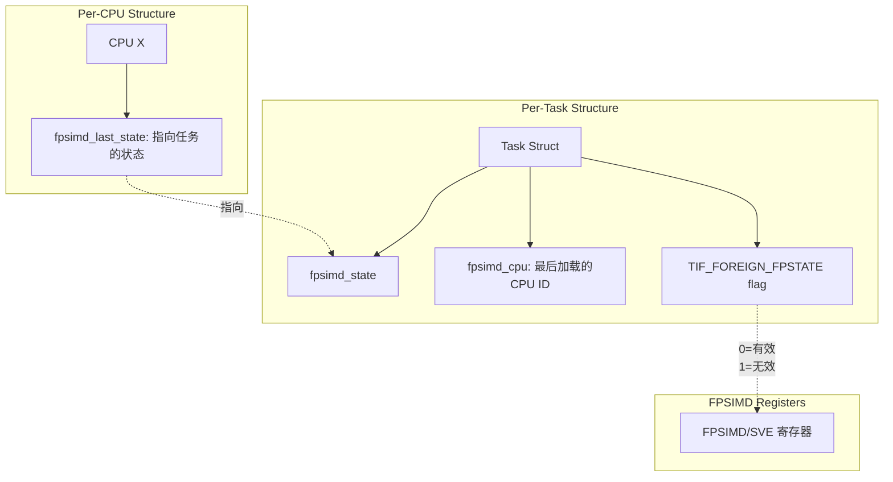
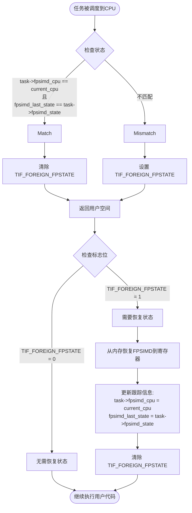
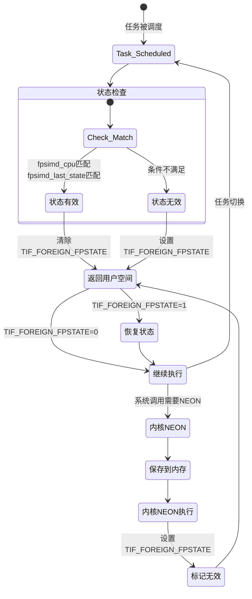

# ARM64 FPSIMD 状态管理流程图

## 整体架构图



## 任务调度流程图



## 内核NEON使用流程图

```mermaid
flowchart TD
    StartNEON([系统调用需要使用NEON]) --> Protect[get_cpu_fpsimd_context()<br/>禁用软中断]

    Protect --> SaveState[保存当前FPSIMD到task->fpsimd_state]
    SaveState --> ClearLast[清除 fpsimd_last_state = NULL]
    ClearLast --> SetFlag[设置 TIF_FOREIGN_FPSTATE]

    SetFlag --> UseNEON[执行NEON操作]
    UseNEON --> EndNEON[kernel_neon_end()]
    EndNEON --> Unprotect[put_cpu_fpsimd_context()<br/>恢复软中断]

    Unprotect --> PreemptCheck{是否被抢占}
    PreemptCheck --> |是| Discard[丢弃寄存器内容<br/>不保存状态]
    PreemptCheck --> |否| ReturnToUser[返回用户空间]

    ReturnToUser --> FlagCheck{检查 TIF_FOREIGN_FPSTATE}
    FlagCheck --> |已设置| RestoreFromTask[从task->fpsimd_state恢复]

    Discard --> Schedule[任务重新调度]
    Schedule --> FlagCheck

    RestoreFromTask --> End([继续执行])
```

## 软中断处理流程图

```mermaid
flowchart TD
    StartSoftirq([软中断触发]) --> NeedFPSIMD{需要使用FPSIMD?}

    NeedFPSIMD --> |否| HandleSoftirq[处理软中断]
    NeedFPSIMD --> |是| CheckContext{检查是否有保护}

    CheckContext --> |无保护| Error[错误！必须先调用<br/>kernel_neon_begin()]
    CheckContext --> |有保护| SafeUse[安全使用FPSIMD]

    HandleSoftirq --> End([软中断完成])
    SafeUse --> End

    subgraph "保护范围"
        KernelBegin[kernel_neon_begin()]
        KernelBegin -.-> |禁用软irq| ProtectedArea[受保护的NEON操作]
        ProtectedArea -.-> |恢复软irq| KernelEnd[kernel_neon_end()]
    end
```

## 状态转换图



## 关键优化点总结

1. **延迟恢复**：
   - 不在任务切换时立即恢复状态
   - 只在返回用户空间时检查并恢复

2. **智能判断**：
   - 通过 `fpsimd_cpu` 和 `fpsimd_last_state` 判断是否已有正确状态
   - 避免不必要的恢复操作

3. **标记机制**：
   - `TIF_FOREIGN_FPSTATE = 0`：寄存器中是当前任务的状态
   - `TIF_FOREIGN_FPSTATE = 1`：需要从内存恢复

4. **竞态保护**：
   - 使用 `get/put_cpu_fpsimd_context()` 保护软中断场景
   - 防止状态损坏

5. **丢弃策略**：
   - 内核NEON使用后，如果被抢占，直接丢弃寄存器内容
   - 避免保存临时状态的开销