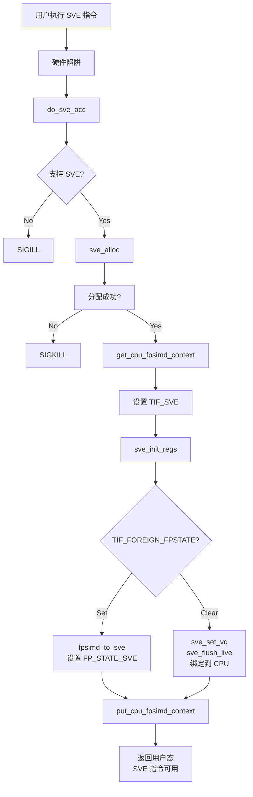
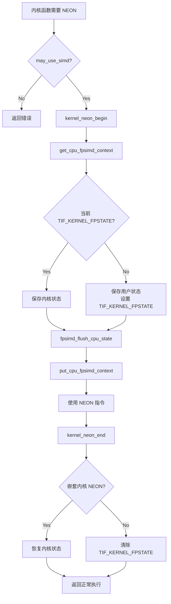

# ARM64 fpsimd.c 内核实现深度分析

> **文件路径**: `arch/arm64/kernel/fpsimd.c`
> **代码行数**: 2106 行
> **许可证**: GPL-2.0-only
> **作者**: Catalin Marinas <catalin.marinas@arm.com>
> **版权**: 2012 ARM Ltd.

---

## 目录

1. [概述](#1-概述)
2. [核心架构设计](#2-核心架构设计)
3. [延迟保存/恢复机制](#3-延迟保存恢复机制)
4. [核心数据结构](#4-核心数据结构)
5. [向量长度管理](#5-向量长度管理)
6. [SVE 支持](#6-sve-支持)
7. [SME 支持](#7-sme-支持)
8. [上下文切换](#8-上下文切换)
9. [系统调用处理](#9-系统调用处理)
10. [异常处理](#10-异常处理)
11. [内核模式 NEON](#11-内核模式-neon)
12. [EFI 支持](#12-efi-支持)
13. [初始化流程](#13-初始化流程)
14. [关键流程图](#14-关键流程图)

---

## 1. 概述

### 1.1 功能定位

`fpsimd.c` 是 ARM64 Linux 内核中**浮点/向量状态管理的核心实现**，负责：

```
┌─────────────────────────────────────────────────────────────┐
│                    fpsimd.c 核心功能                         │
├─────────────────────────────────────────────────────────────┤
│                                                             │
│  1. FPSIMD 状态管理                                          │
│     ├── 浮点寄存器 (V0-V31, 128-bit)                        │
│     ├── FPSR (浮点状态寄存器)                               │
│     └── FPCR (浮点控制寄存器)                               │
│                                                             │
│  2. SVE 状态管理                                            │
│     ├── 可变长度向量寄存器 (Z0-Z31)                          │
│     ├── 谓词寄存器 (P0-P15)                                 │
│     └── FFR (第一故障寄存器)                                │
│                                                             │
│  3. SME 状态管理                                            │
│     ├── Streaming SVE 模式                                  │
│     ├── ZA 矩阵寄存器                                       │
│     └── SVCR 控制寄存器                                     │
│                                                             │
│  4. 上下文切换                                              │
│     ├── 进程切换时的状态保存/恢复                            │
│     ├── 信号处理时的状态管理                                 │
│     └── 内核模式 NEON 支持                                  │
│                                                             │
│  5. 异常处理                                                │
│     ├── FPSIMD 访问陷阱                                     │
│     ├── SVE 访问陷阱                                        │
│     ├── SME 访问陷阱                                        │
│     └── 浮点异常                                            │
│                                                             │
└─────────────────────────────────────────────────────────────┘
```

### 1.2 代码组织结构

```c
// 头文件引用 (9-46 行)
#include <linux/...>    // 内核核心头文件
#include <asm/...>      // ARM64 架构特定头文件

// 宏定义 (48-53 行)
#define FPEXC_IOF       // 无效操作异常标志
#define FPEXC_DZF       // 除零异常标志
// ...

// 核心注释 (55-120 行)
// 详细说明延迟保存/恢复机制

// 全局变量定义 (122-210 行)
DEFINE_PER_CPU(struct cpu_fp_state, fpsimd_last_state);
struct vl_info vl_info[ARM64_VEC_MAX];
// ...

// 核心函数 (212 行开始)
static void get_cpu_fpsimd_context(void);
static void put_cpu_fpsimd_context(void);
static void task_fpsimd_load(void);
static void fpsimd_save_user_state(void);
// ... 共约 100+ 个函数
```

---

## 2. 核心架构设计

### 2.1 延迟保存/恢复机制 (Lazy Save/Restore)

这是整个文件最核心的设计理念，源码注释（55-120 行）有详细说明。

#### 2.1.1 问题背景

传统的 FP 状态管理：
```
每次任务切换时：
  1. 保存当前任务的 FPSIMD 状态到内存
  2. 从内存恢复下一个任务的 FPSIMD 状态

问题：
  - 大多数任务不使用 FP/SIMD
  - 浪费大量 CPU 时间在无用的保存/恢复上
  - 缓存污染（不必要的内存访问）
```

#### 2.1.2 ARM64 的解决方案

```
┌─────────────────────────────────────────────────────────────┐
│                    延迟保存机制                              │
├─────────────────────────────────────────────────────────────┤
│                                                             │
│  核心思想：只在真正需要时才保存/恢复 FPSIMD 状态              │
│                                                             │
│  两个关键数据结构：                                           │
│                                                             │
│  (a) thread_struct::fpsimd_cpu                             │
│      └── 记录该任务的 FPSIMD 状态最后加载在哪个 CPU 上        │
│                                                             │
│  (b) per-CPU 变量 fpsimd_last_state                        │
│      └── 记录该 CPU 上最后加载的用户态 FPSIMD 状态           │
│                                                             │
│  判断条件 (TIF_FOREIGN_FPSTATE 标志)：                        │
│                                                             │
│  ┌────────────────────────────────────────────────────┐    │
│  │ 任务调度到 CPU                                     │    │
│  └────────────────┬───────────────────────────────────┘    │
│                   │                                          │
│                   ▼                                          │
│  ┌────────────────────────────────────────────────────┐    │
│  │ fpsimd_thread_switch()                             │    │
│  │                                                     │    │
│  │ 检查: task->fpsimd_cpu == current_cpu?             │    │
│  │      && fpsimd_last_state.st == &task->state?      │    │
│  └────────────────┬───────────────────────────────────┘    │
│                   │                                          │
│         ┌─────────┴─────────┐                              │
│         │                   │                              │
│         ▼ Yes               ▼ No                           │
│  ┌───────────┐        ┌──────────────┐                    │
│  │ 状态一致   │        │ 状态不一致     │                    │
│  │           │        │              │                    │
│  │ 清除标志   │        │ 设置标志      │                    │
│  │ 不需要恢复 │        │ TIF_FOREIGN_ │                    │
│  └───────────┘        │ FPSTATE      │                    │
│                       └──────────────┘                    │
│                                                             │
│  ┌────────────────────────────────────────────────────┐    │
│  │ 返回用户态前 (fpsimd_restore_current_state())       │    │
│  └────────────────┬───────────────────────────────────┘    │
│                   │                                          │
│                   ▼                                          │
│  ┌────────────────────────────────────────────────────┐    │
│  │ 检查 TIF_FOREIGN_FPSTATE                           │    │
│  └────────────────┬───────────────────────────────────┘    │
│                   │                                          │
│         ┌─────────┴─────────┐                              │
│         │                   │                              │
│         ▼ Set               ▼ Clear                        │
│  ┌───────────┐        ┌──────────────┐                    │
│  │ 恢复状态   │        │ 状态已经在    │                    │
│  │           │        │ 寄存器中      │                    │
│  │ 从内存    │        │ 跳过恢复      │                    │
│  │ 加载到    │        │              │                    │
│  │ 寄存器    │        │              │                    │
│  └───────────┘        └──────────────┘                    │
│                                                             │
└─────────────────────────────────────────────────────────────┘
```

#### 2.1.3 源码实现

```c
// 每个任务的状态跟踪 (在 thread_struct 中)
struct thread_struct {
    // ...
    unsigned int fpsimd_cpu;  // 最后加载该任务状态的 CPU ID
    struct user_fpsimd_state uw;
    // ...
};

// 每个 CPU 的状态跟踪 (122 行)
DEFINE_PER_CPU(struct cpu_fp_state, fpsimd_last_state);

struct cpu_fp_state {
    struct user_fpsimd_state *st;      // 指向任务的状态
    void *sve_state;                    // SVE 状态缓冲区
    void *sme_state;                    // SME 状态缓冲区
    unsigned int sve_vl;                 // SVE 向量长度
    unsigned int sme_vl;                 // SME 向量长度
    u64 *svcr;                          // SVCR 寄存器指针
    u64 *fpmr;                          // FPMR 寄存器指针
    enum fp_type *fp_type;              // 状态类型
    enum fp_type to_save;               // 需要保存的类型
};
```

### 2.2 TIF_FOREIGN_FPSTATE 标志

```c
// 标志含义：
// = set:   当前 CPU 的 FPSIMD 寄存器不包含当前任务的用户态状态
// = clear:  当前 CPU 的 FPSIMD 寄存器包含当前任务的用户态状态

// 在 fpsimd_thread_switch() 中设置 (1533-1565 行)
void fpsimd_thread_switch(struct task_struct *next)
{
    // ...

    wrong_task = __this_cpu_read(fpsimd_last_state.st) !=
                 &next->thread.uw.fpsimd_state;
    wrong_cpu = next->thread.fpsimd_cpu != smp_processor_id();

    update_tsk_thread_flag(next, TIF_FOREIGN_FPSTATE,
                           wrong_task || wrong_cpu);
}

// 在 fpsimd_restore_current_state() 中检查和清除 (1717-1751 行)
void fpsimd_restore_current_state(void)
{
    get_cpu_fpsimd_context();

    if (test_and_clear_thread_flag(TIF_FOREIGN_FPSTATE)) {
        task_fpsimd_load();        // 恢复状态
        fpsimd_bind_task_to_cpu(); // 更新跟踪信息
    }

    put_cpu_fpsimd_context();
}
```

### 2.3 状态类型 (enum fp_type)

```c
// FP 状态的三种类型 (在 fpsimd.h 中定义)
enum fp_type {
    FP_STATE_FPSIMD,   // 仅 FPSIMD 状态 (128-bit 向量)
    FP_STATE_SVE,      // 完整 SVE 状态 (可变长度向量)
    FP_STATE_CURRENT,  // 当前任务的实时状态
};

// 在 fpsimd_save_user_state() 中使用 (435-506 行)
static void fpsimd_save_user_state(void)
{
    struct cpu_fp_state const *last = this_cpu_ptr(&fpsimd_last_state);

    // ...
    if ((last->to_save == FP_STATE_CURRENT && test_thread_flag(TIF_SVE)) ||
        last->to_save == FP_STATE_SVE) {
        save_sve_regs = true;
        save_ffr = true;
        vl = last->sve_vl;
    }
    // ...
}
```

---

## 3. 延迟保存恢复机制详解

### 3.1 状态保存流程

```c
// fpsimd_save_user_state() - 保存用户态 FPSIMD/SVE 状态 (435-506 行)

static void fpsimd_save_user_state(void)
{
    struct cpu_fp_state const *last = this_cpu_ptr(&fpsimd_last_state);

    // 如果 TIF_FOREIGN_FPSTATE 设置，说明当前寄存器中的状态
    // 不属于当前任务，不需要保存
    if (test_thread_flag(TIF_FOREIGN_FPSTATE))
        return;

    // 保存 FPMR (如果支持)
    if (system_supports_fpmr())
        *(last->fpmr) = read_sysreg_s(SYS_FPMR);

    // 决定是否保存 SVE 状态
    bool save_sve_regs = false;
    bool save_ffr;
    unsigned int vl;

    if ((last->to_save == FP_STATE_CURRENT && test_thread_flag(TIF_SVE)) ||
        last->to_save == FP_STATE_SVE) {
        save_sve_regs = true;
        save_ffr = true;
        vl = last->sve_vl;
    }

    // SME 处理
    if (system_supports_sme()) {
        u64 *svcr = last->svcr;
        *svcr = read_sysreg_s(SYS_SVCR);

        if (*svcr & SVCR_ZA_MASK)
            sme_save_state(last->sme_state, system_supports_sme2());

        // Streaming 模式覆盖 SVE
        if (*svcr & SVCR_SM_MASK) {
            save_sve_regs = true;
            save_ffr = system_supports_fa64();
            vl = last->sme_vl;
        }
    }

    // 执行保存
    if (IS_ENABLED(CONFIG_ARM64_SVE) && save_sve_regs) {
        // 验证向量长度
        if (WARN_ON(sve_get_vl() != vl)) {
            force_signal_inject(SIGKILL, SI_KERNEL, 0, 0);
            return;
        }

        sve_save_state((char *)last->sve_state + sve_ffr_offset(vl),
                       &last->st->fpsr, save_ffr);
        *last->fp_type = FP_STATE_SVE;
    } else {
        fpsimd_save_state(last->st);
        *last->fp_type = FP_STATE_FPSIMD;
    }
}
```

### 3.2 状态加载流程

```c
// task_fpsimd_load() - 加载任务 FPSIMD/SVE 状态 (353-423 行)

static void task_fpsimd_load(void)
{
    bool restore_sve_regs = false;
    bool restore_ffr;

    WARN_ON(!system_supports_fpsimd());
    WARN_ON(preemptible());
    WARN_ON(test_thread_flag(TIF_KERNEL_FPSTATE));

    // 根据 fp_type 决定恢复策略
    if (system_supports_sve() || system_supports_sme()) {
        switch (current->thread.fp_type) {
        case FP_STATE_FPSIMD:
            clear_thread_flag(TIF_SVE);
            break;

        case FP_STATE_SVE:
            if (!thread_sm_enabled(&current->thread))
                WARN_ON_ONCE(!test_and_set_thread_flag(TIF_SVE));

            if (test_thread_flag(TIF_SVE))
                sve_set_vq(sve_vq_from_vl(task_get_sve_vl(current)) - 1);

            restore_sve_regs = true;
            restore_ffr = true;
            break;

        default:
            WARN_ON_ONCE(1);
            clear_thread_flag(TIF_SVE);
            break;
        }
    }

    // SME 处理
    if (system_supports_sme()) {
        unsigned long sme_vl = task_get_sme_vl(current);

        if (test_thread_flag(TIF_SME))
            sme_set_vq(sve_vq_from_vl(sme_vl) - 1);

        write_sysreg_s(current->thread.svcr, SYS_SVCR);

        if (thread_za_enabled(&current->thread))
            sme_load_state(current->thread.sme_state,
                           system_supports_sme2());

        if (thread_sm_enabled(&current->thread))
            restore_ffr = system_supports_fa64();
    }

    // FPMR 恢复
    if (system_supports_fpmr())
        write_sysreg_s(current->thread.uw.fpmr, SYS_FPMR);

    // 执行恢复
    if (restore_sve_regs) {
        WARN_ON_ONCE(current->thread.fp_type != FP_STATE_SVE);
        sve_load_state(sve_pffr(&current->thread),
                       &current->thread.uw.fpsimd_state.fpsr,
                       restore_ffr);
    } else {
        WARN_ON_ONCE(current->thread.fp_type != FP_STATE_FPSIMD);
        fpsimd_load_state(&current->thread.uw.fpsimd_state);
    }
}
```

### 3.3 CPU 上下文绑定

```c
// fpsimd_bind_task_to_cpu() - 将任务状态绑定到当前 CPU (1666-1699 行)

static void fpsimd_bind_task_to_cpu(void)
{
    struct cpu_fp_state *last = this_cpu_ptr(&fpsimd_last_state);

    WARN_ON(!system_supports_fpsimd());

    // 更新 per-CPU 状态指针
    last->st = &current->thread.uw.fpsimd_state;
    last->sve_state = current->thread.sve_state;
    last->sme_state = current->thread.sme_state;
    last->sve_vl = task_get_sve_vl(current);
    last->sme_vl = task_get_sme_vl(current);
    last->svcr = &current->thread.svcr;
    last->fpmr = &current->thread.uw.fpmr;
    last->fp_type = &current->thread.fp_type;
    last->to_save = FP_STATE_CURRENT;

    // 更新任务的 CPU 记录
    current->thread.fpsimd_cpu = smp_processor_id();

    // 控制 SVE/SME 陷阱
    if (system_supports_sme()) {
        if (test_thread_flag(TIF_SME))
            sme_user_enable();
        else
            sme_user_disable();
    }

    if (system_supports_sve()) {
        if (test_thread_flag(TIF_SVE))
            sve_user_enable();
        else
            sve_user_disable();
    }
}
```

---

## 4. 核心数据结构

### 4.1 vl_info - 向量长度信息

```c
// 124-140 行
__ro_after_init struct vl_info vl_info[ARM64_VEC_MAX] = {
#ifdef CONFIG_ARM64_SVE
    [ARM64_VEC_SVE] = {
        .type                     = ARM64_VEC_SVE,
        .name                     = "SVE",
        .min_vl                   = SVE_VL_MIN,
        .max_vl                   = SVE_VL_MIN,
        .max_virtualisable_vl     = SVE_VL_MIN,
    },
#endif
#ifdef CONFIG_ARM64_SME
    [ARM64_VEC_SME] = {
        .type                     = ARM64_VEC_SME,
        .name                     = "SME",
    },
#endif
};

// vl_info 完整结构 (在 fpsimd.h 中定义)
struct vl_info {
    enum vec_type type;           // SVE 或 SME
    const char *name;             // 名称字符串
    unsigned long min_vl;         // 最小向量长度
    unsigned long max_vl;         // 最大向量长度
    unsigned long max_virtualisable_vl;  // 最大可虚拟化长度
    DECLARE_BITMAP(vq_map, SVE_VQ_MAX);      // 支持的 VQ 位图
    DECLARE_BITMAP(vq_partial_map, SVE_VQ_MAX);  // 部分 CPU 支持的 VQ
};
```

### 4.2 fpsimd_context 获取/释放

```c
// 226-247 行

// 获取 CPU FPSIMD 上下文所有权
static void get_cpu_fpsimd_context(void)
{
    if (!IS_ENABLED(CONFIG_PREEMPT_RT))
        local_bh_disable();      // 非 RT: 禁用软中断
    else
        preempt_disable();       // RT: 禁用抢占
}

// 释放 CPU FPSIMD 上下文所有权
static void put_cpu_fpsimd_context(void)
{
    if (!IS_ENABLED(CONFIG_PREEMPT_RT))
        local_bh_enable();
    else
        preempt_enable();
}
```

**设计要点**：
- 在非 RT 内核上，`local_bh_disable()` 确保软中断不会干扰 FPSIMD 状态操作
- 在 RT 内核上，软中断在进程上下文中运行，`preempt_disable()` 可以防止抢占
- 必须配对使用，类似锁的操作

### 4.3 VL 配置管理

```c
// 155-164 行
struct vl_config {
    int __default_vl;  // 默认向量长度
};

static struct vl_config vl_config[ARM64_VEC_MAX];

static inline int get_default_vl(enum vec_type type)
{
    return READ_ONCE(vl_config[type].__default_vl);
}
```

---

## 5. 向量长度管理

### 5.1 向量长度探测

```c
// 976-1005 行
static void vec_probe_vqs(struct vl_info *info,
                          DECLARE_BITMAP(map, SVE_VQ_MAX))
{
    unsigned int vq, vl;

    bitmap_zero(map, SVE_VQ_MAX);

    // 从最大 VQ 开始递减探测
    for (vq = SVE_VQ_MAX; vq >= SVE_VQ_MIN; --vq) {
        write_vl(info->type, vq - 1);  // 设置向量长度

        switch (info->type) {
        case ARM64_VEC_SVE:
            vl = sve_get_vl();
            break;
        case ARM64_VEC_SME:
            vl = sme_get_vl();
            break;
        default:
            vl = 0;
            break;
        }

        // 如果设置的 VQ > 返回的 VQ，说明到达最小值
        if (sve_vq_from_vl(vl) > vq)
            break;

        vq = sve_vq_from_vl(vl);  // 跳过中间长度
        set_bit(__vq_to_bit(vq), map);  // 记录支持的 VQ
    }
}
```

**探测算法图解**：

```
假设硬件支持: 128, 256, 512, 1024 bits (vq = 1, 2, 4, 8)

探测过程:
┌─────┬──────────┬───────────┬─────────────┬─────────────┐
│ vq  │ 尝试 VL  │ 返回 VL   │ 实际 VQ     │ 记录?       │
├─────┼──────────┼───────────┼─────────────┼─────────────┤
│ 16  │ 2048     │ 1024      │ 8           │ set bit 8   │
│ 4   │ 512      │ 512       │ 4           │ set bit 4   │
│ 2   │ 256      │ 256       │ 2           │ set bit 2   │
│ 1   │ 128      │ 128       │ 1           │ set bit 1   │
│ 0   │ -        │ -         │ -           │ 结束        │
└─────┴──────────┴───────────┴─────────────┴─────────────┘

最终 vq_map = {bit 1, bit 2, bit 4, bit 8} = {0x0000800a}
```

### 5.2 启动时 VL 初始化

```c
// 1011-1016 行
void __init vec_init_vq_map(enum vec_type type)
{
    struct vl_info *info = &vl_info[type];
    vec_probe_vqs(info, info->vq_map);
    bitmap_copy(info->vq_partial_map, info->vq_map, SVE_VQ_MAX);
}

// 1123-1177 行
void __init sve_setup(void)
{
    struct vl_info *info = &vl_info[ARM64_VEC_SVE];
    unsigned long b;
    int max_bit;

    if (!system_supports_sve())
        return;

    // 确保至少支持 128-bit 向量
    if (WARN_ON(!test_bit(__vq_to_bit(SVE_VQ_MIN), info->vq_map)))
        set_bit(__vq_to_bit(SVE_VQ_MIN), info->vq_map);

    // 获取最大支持的 VL
    max_bit = find_first_bit(info->vq_map, SVE_VQ_MAX);
    info->max_vl = sve_vl_from_vq(__bit_to_vq(max_bit));

    // 默认 VL: 最大支持的 <= 64 (256 bits) 的值
    set_sve_default_vl(find_supported_vector_length(ARM64_VEC_SVE, 64));

    // 计算最大可虚拟化 VL
    // 用于 KVM guest 支持
    b = find_last_bit(info->vq_partial_map, SVE_VQ_MAX);
    if (b >= SVE_VQ_MAX)
        info->max_virtualisable_vl = SVE_VQ_MAX;
    else
        info->max_virtualisable_vl = sve_vl_from_vq(__bit_to_vq(b + 1));

    pr_info("SVE: maximum available vector length %u bytes per vector\n",
            info->max_vl);
    pr_info("SVE: default vector length %u bytes per vector\n",
            get_sve_default_vl());
}
```

### 5.3 运行时 VL 设置

```c
// 855-894 行
int vec_set_vector_length(struct task_struct *task, enum vec_type type,
                          unsigned long vl, unsigned long flags)
{
    bool onexec = flags & PR_SVE_SET_VL_ONEXEC;
    bool inherit = flags & PR_SVE_VL_INHERIT;

    // 验证参数
    if (!sve_vl_valid(vl))
        return -EINVAL;

    // 限制到架构最大值
    if (vl > VL_ARCH_MAX)
        vl = VL_ARCH_MAX;

    // 找到实际支持的 VL
    vl = find_supported_vector_length(type, vl);

    // 如果需要立即改变
    if (!onexec && vl != task_get_vl(task, type)) {
        if (change_live_vector_length(task, type, vl))
            return -ENOMEM;
    }

    // 设置 onexec 或 inherit
    if (onexec || inherit)
        task_set_vl_onexec(task, type, vl);
    else
        task_set_vl_onexec(task, type, 0);

    update_tsk_thread_flag(task, vec_vl_inherit_flag(type),
                           flags & PR_SVE_VL_INHERIT);

    return 0;
}

// 793-853 行
static int change_live_vector_length(struct task_struct *task,
                                     enum vec_type type,
                                     unsigned long vl)
{
    unsigned int sve_vl = task_get_sve_vl(task);
    unsigned int sme_vl = task_get_sme_vl(task);
    void *sve_state = NULL, *sme_state = NULL;

    // 先分配新缓冲区，避免分配失败时状态不一致
    sve_state = kzalloc(__sve_state_size(sve_vl, sme_vl), GFP_KERNEL);
    if (!sve_state)
        goto out_mem;

    if (type == ARM64_VEC_SME) {
        sme_state = kzalloc(__sme_state_size(sme_vl), GFP_KERNEL);
        if (!sme_state)
            goto out_mem;
    }

    // 保存当前状态
    if (task == current)
        fpsimd_save_and_flush_current_state();
    else
        fpsimd_flush_task_state(task);

    // 转换状态格式
    fpsimd_sync_from_effective_state(task);
    task_set_vl(task, type, vl);
    kfree(task->thread.sve_state);
    task->thread.sve_state = sve_state;
    fpsimd_sync_to_effective_state_zeropad(task);

    if (type == ARM64_VEC_SME) {
        task->thread.svcr &= ~SVCR_ZA_MASK;
        kfree(task->thread.sme_state);
        task->thread.sme_state = sme_state;
    }

    return 0;

out_mem:
    kfree(sve_state);
    kfree(sme_state);
    return -ENOMEM;
}
```

---

## 6. SVE 支持

### 6.1 SVE 状态格式

```
FPSIMD 状态 (FP_STATE_FPSIMD):
┌─────────────────────────────────────────────────────────────┐
│  V0-V31: 每个 128-bit (32 × 16 bytes = 512 bytes)          │
│  FPSR:   32-bit 浮点状态寄存器                             │
│  FPCR:   32-bit 浮点控制寄存器                             │
│  总大小: ~520 bytes                                         │
└─────────────────────────────────────────────────────────────┘

SVE 状态 (FP_STATE_SVE):
┌─────────────────────────────────────────────────────────────┐
│  Z0-Z31: 可变长度 (每个 VL bytes)                          │
│  P0-P15: 每个 16-bit (16 × 2 bytes = 32 bytes)            │
│  FFR:    16-bit 第一故障寄存器                             │
│  FPSR:   32-bit                                             │
│  FPCR:   32-bit                                             │
│                                                             │
│  例如 VL = 256 (32 bytes):                                 │
│    Z 寄存器: 32 × 32 = 1024 bytes                          │
│    总大小: 1024 + 32 + 2 + 4 + 4 = 1066 bytes             │
│                                                             │
│  例如 VL = 512 (64 bytes):                                 │
│    Z 寄存器: 32 × 64 = 2048 bytes                          │
│    总大小: 2048 + 32 + 2 + 4 + 4 = 2090 bytes             │
└─────────────────────────────────────────────────────────────┘
```

### 6.2 SVE 分配

```c
// 743-755 行
void sve_alloc(struct task_struct *task, bool flush)
{
    if (task->thread.sve_state) {
        if (flush)
            memset(task->thread.sve_state, 0,
                   sve_state_size(task));
        return;
    }

    // 分配 SVE 状态缓冲区 (最大 ~8KB)
    task->thread.sve_state =
        kzalloc(sve_state_size(task), GFP_KERNEL);
}
```

### 6.3 SVE 访问陷阱处理

```c
// 1356-1385 行
void do_sve_acc(unsigned long esr, struct pt_regs *regs)
{
    // 检查硬件支持
    if (unlikely(!system_supports_sve()) || WARN_ON(is_compat_task())) {
        force_signal_inject(SIGILL, ILL_ILLOPC, regs->pc, 0);
        return;
    }

    // 分配 SVE 状态缓冲区
    sve_alloc(current, true);
    if (!current->thread.sve_state) {
        force_sig(SIGKILL);
        return;
    }

    get_cpu_fpsimd_context();

    // 设置 TIF_SVE 标志
    if (test_and_set_thread_flag(TIF_SVE))
        WARN_ON(1);  // SVE 访问不应该陷阱

    // 初始化 SVE 寄存器
    sve_init_regs();

    put_cpu_fpsimd_context();
}

// 1320-1343 行
static void sve_init_regs(void)
{
    // 如果当前状态在寄存器中
    if (!test_thread_flag(TIF_FOREIGN_FPSTATE)) {
        unsigned long vq_minus_one =
            sve_vq_from_vl(task_get_sve_vl(current)) - 1;
        sve_set_vq(vq_minus_one);
        sve_flush_live(true, vq_minus_one);
        fpsimd_bind_task_to_cpu();
    } else {
        // 从 FPSIMD 转换到 SVE
        fpsimd_to_sve(current);
        current->thread.fp_type = FP_STATE_SVE;
        fpsimd_flush_task_state(current);
    }
}
```

### 6.4 FPSIMD <-> SVE 转换

```c
// 631-641 行: FPSIMD → SVE
static void __fpsimd_to_sve(void *sst, struct user_fpsimd_state const *fst,
                            unsigned int vq)
{
    unsigned int i;
    __uint128_t *p;

    for (i = 0; i < SVE_NUM_ZREGS; ++i) {
        p = (__uint128_t *)ZREG(sst, vq, i);
        *p = arm64_cpu_to_le128(fst->vregs[i]);
    }
}

// 679-696 行: SVE → FPSIMD
static inline void sve_to_fpsimd(struct task_struct *task)
{
    unsigned int vq, vl;
    void const *sst = task->thread.sve_state;
    struct user_fpsimd_state *fst = &task->thread.uw.fpsimd_state;
    unsigned int i;
    __uint128_t const *p;

    vl = thread_get_cur_vl(&task->thread);
    vq = sve_vq_from_vl(vl);

    for (i = 0; i < SVE_NUM_ZREGS; ++i) {
        p = (__uint128_t const *)ZREG(sst, vq, i);
        fst->vregs[i] = arm64_le128_to_cpu(*p);
    }
}
```

---

## 7. SME 支持

### 7.1 SME 架构概述

```
┌─────────────────────────────────────────────────────────────┐
│                    SME 模式结构                              │
├─────────────────────────────────────────────────────────────┤
│                                                             │
│  正常模式 (SVCR.SM = 0):                                    │
│    ├── SVE 向量 (使用 SVE VL)                               │
│    └── FPSIMD 兼容模式                                      │
│                                                             │
│  Streaming 模式 (SVCR.SM = 1):                              │
│    ├── SSVE 向量 (使用 SME VL)                              │
│    ├── FFR 可选 (取决于 FA64)                                │
│    └── 更高效的矩阵运算                                      │
│                                                             │
│  ZA 矩阵寄存器 (SVCR.ZA = 1):                               │
│    ├── 外部乘累加寄存器                                      │
│    ├── 大小取决于 SME VL                                     │
│    └── 用于矩阵乘法优化                                      │
│                                                             │
│  SVCR 寄存器:                                               │
│    ├── bit[0]: SM (Streaming 模式)                         │
│    └── bit[1]: ZA (ZA 使能)                                │
│                                                             │
└─────────────────────────────────────────────────────────────┘
```

### 7.2 SME 初始化

```c
// 1222-1238 行
void cpu_enable_sme(const struct arm64_cpu_capabilities *__always_unused p)
{
    // 设置优先级为架构定义的最小值
    write_sysreg_s(read_sysreg_s(SYS_SMPRI_EL1) & ~SMPRI_EL1_PRIORITY_MASK,
                   SYS_SMPRI_EL1);

    // 允许内核使用 SME
    write_sysreg(read_sysreg(CPACR_EL1) | CPACR_EL1_SMEN_EL1EN, CPACR_EL1);
    isb();

    // 确保所有 SMCR 位都是已知值
    write_sysreg_s(0, SYS_SMCR_EL1);

    // 允许 EL0 访问 TPIDR2
    write_sysreg(read_sysreg(SCTLR_EL1) | SCTLR_ELx_ENTP2, SCTLR_EL1);
    isb();
}

// 1240-1248 行
void cpu_enable_sme2(const struct arm64_cpu_capabilities *__always_unused p)
{
    // 必须在 SME 之后启用
    BUILD_BUG_ON(ARM64_SME2 <= ARM64_SME);

    // 允许使用 ZT0 (SME2 新增)
    write_sysreg_s(read_sysreg_s(SYS_SMCR_EL1) | SMCR_ELx_EZT0_MASK,
                   SYS_SMCR_EL1);
}

// 1250-1258 行
void cpu_enable_fa64(const struct arm64_cpu_capabilities *__always_unused p)
{
    // 必须在 SME 之后启用
    BUILD_BUG_ON(ARM64_SME_FA64 <= ARM64_SME);

    // 允许使用 FA64 (全架构模式)
    write_sysreg_s(read_sysreg_s(SYS_SMCR_EL1) | SMCR_ELx_FA64_MASK,
                   SYS_SMCR_EL1);
}
```

### 7.3 SME 状态分配

```c
// 1202-1214 行
void sme_alloc(struct task_struct *task, bool flush)
{
    if (task->thread.sme_state) {
        if (flush)
            memset(task->thread.sme_state, 0,
                   sme_state_size(task));
        return;
    }

    // 分配 ZA 状态缓冲区 (最大 ~64KB)
    task->thread.sme_state =
        kzalloc(sme_state_size(task), GFP_KERNEL);
}
```

### 7.4 SME 访问陷阱处理

```c
// 1398-1439 行
void do_sme_acc(unsigned long esr, struct pt_regs *regs)
{
    // 检查硬件支持
    if (unlikely(!system_supports_sme()) || WARN_ON(is_compat_task())) {
        force_signal_inject(SIGILL, ILL_ILLOPC, regs->pc, 0);
        return;
    }

    // 检查陷阱原因
    if (ESR_ELx_SME_ISS_SMTC(esr) != ESR_ELx_SME_ISS_SMTC_SME_DISABLED) {
        force_signal_inject(SIGILL, ILL_ILLOPC, regs->pc, 0);
        return;
    }

    // 分配状态缓冲区
    sve_alloc(current, false);
    sme_alloc(current, true);
    if (!current->thread.sve_state || !current->thread.sme_state) {
        force_sig(SIGKILL);
        return;
    }

    get_cpu_fpsimd_context();

    // 设置 TIF_SME 标志
    if (test_and_set_thread_flag(TIF_SME))
        WARN_ON(1);

    // 配置向量长度
    if (!test_thread_flag(TIF_FOREIGN_FPSTATE)) {
        unsigned long vq_minus_one =
            sve_vq_from_vl(task_get_sme_vl(current)) - 1;
        sme_set_vq(vq_minus_one);
        fpsimd_bind_task_to_cpu();
    } else {
        fpsimd_flush_task_state(current);
    }

    put_cpu_fpsimd_context();
}
```

### 7.5 SMSTOP 模拟

```c
// 706-718 行
void task_smstop_sm(struct task_struct *task)
{
    if (!thread_sm_enabled(&task->thread))
        return;

    // 清零向量寄存器
    __fpsimd_zero_vregs(&task->thread.uw.fpsimd_state);

    // 设置默认 FPSR
    task->thread.uw.fpsimd_state.fpsr = 0x0800009f;

    if (system_supports_fpmr())
        task->thread.uw.fpmr = 0;

    // 清除 SM 位
    task->thread.svcr &= ~SVCR_SM_MASK;
    task->thread.fp_type = FP_STATE_FPSIMD;
}
```

---

## 8. 上下文切换

### 8.1 任务切换

```c
// 1533-1565 行
void fpsimd_thread_switch(struct task_struct *next)
{
    bool wrong_task, wrong_cpu;

    if (!system_supports_fpsimd())
        return;

    WARN_ON_ONCE(!irqs_disabled());

    // 保存当前任务的状态
    if (test_thread_flag(TIF_KERNEL_FPSTATE))
        fpsimd_save_kernel_state(current);
    else
        fpsimd_save_user_state();

    // 处理下一个任务
    if (test_tsk_thread_flag(next, TIF_KERNEL_FPSTATE)) {
        // 下一个任务在内核模式使用 FPSIMD
        fpsimd_flush_cpu_state();
        fpsimd_load_kernel_state(next);
    } else {
        // 用户任务: 检查状态是否需要重新加载
        wrong_task = __this_cpu_read(fpsimd_last_state.st) !=
                     &next->thread.uw.fpsimd_state;
        wrong_cpu = next->thread.fpsimd_cpu != smp_processor_id();

        update_tsk_thread_flag(next, TIF_FOREIGN_FPSTATE,
                               wrong_task || wrong_cpu);
    }
}
```

**状态判断逻辑**：

```
┌─────────────────────────────────────────────────────────────┐
│                  fpsimd_thread_switch()                     │
├─────────────────────────────────────────────────────────────┤
│                                                             │
│  保存 prev:                                                 │
│    if TIF_KERNEL_FPSTATE:                                  │
│      → fpsimd_save_kernel_state(prev)                      │
│    else:                                                    │
│      → fpsimd_save_user_state(prev)                        │
│                                                             │
│  加载 next:                                                 │
│    if TIF_KERNEL_FPSTATE:                                  │
│      → fpsimd_flush_cpu_state()                            │
│      → fpsimd_load_kernel_state(next)                      │
│    else:                                                    │
│      wrong_task = (fpsimd_last_state.st != &next->state)   │
│      wrong_cpu = (next->fpsimd_cpu != current_cpu)         │
│      if wrong_task || wrong_cpu:                           │
│        → TIF_FOREIGN_FPSTATE = 1  (需要恢复)               │
│      else:                                                  │
│        → TIF_FOREIGN_FPSTATE = 0  (已在寄存器中)           │
│                                                             │
└─────────────────────────────────────────────────────────────┘
```

### 8.2 内核模式 FPSIMD 保存/恢复

```c
// 1484-1510 行
static void fpsimd_load_kernel_state(struct task_struct *task)
{
    struct cpu_fp_state *last = this_cpu_ptr(&fpsimd_last_state);

    // 优化: 如果这个 CPU 已经持有该任务的内核状态
    if (last->st == &task->thread.kernel_fpsimd_state &&
        task->thread.kernel_fpsimd_cpu == smp_processor_id())
        return;

    fpsimd_load_state(&task->thread.kernel_fpsimd_state);
}

static void fpsimd_save_kernel_state(struct task_struct *task)
{
    struct cpu_fp_state cpu_fp_state = {
        .st       = &task->thread.kernel_fpsimd_state,
        .to_save  = FP_STATE_FPSIMD,
    };

    fpsimd_save_state(&task->thread.kernel_fpsimd_state);
    fpsimd_bind_state_to_cpu(&cpu_fp_state);

    task->thread.kernel_fpsimd_cpu = smp_processor_id();
}
```

### 8.3 CPU 状态刷新

```c
// 1517-1531 行
static void fpsimd_flush_cpu_state(void)
{
    WARN_ON(!system_supports_fpsimd());

    // 清除 per-CPU 状态指针
    __this_cpu_write(fpsimd_last_state.st, NULL);

    // 退出 Streaming 模式，禁用 ZA
    if (system_supports_sme())
        sme_smstop();

    set_thread_flag(TIF_FOREIGN_FPSTATE);
}
```

### 8.4 任务状态刷新

```c
// 1774-1788 行
void fpsimd_flush_task_state(struct task_struct *t)
{
    // 设置 fpsimd_cpu 为无效值
    t->thread.fpsimd_cpu = NR_CPUS;

    if (!system_supports_fpsimd())
        return;

    // 内存屏障: 确保 fpsimd_cpu 的赋值可见
    barrier();

    // 设置标志: 状态不在任何 CPU 的寄存器中
    set_tsk_thread_flag(t, TIF_FOREIGN_FPSTATE);

    // 内存屏障: 确保 TIF_FOREIGN_FPSTATE 对后续代码可见
    barrier();
}
```

**为什么需要 barrier()**：
```
CPU 0                           CPU 1
────                           ────
fpsimd_flush_task_state(t)
  t->fpsimd_cpu = NR_CPUS
  [barrier]
  set_tsk_thread_flag(t, TIF_FOREIGN_FPSTATE)
                                [preemption]
                                fpsimd_thread_switch(t)
                                  if t->fpsimd_cpu != cpu:
                                    set TIF_FOREIGN_FPSTATE

如果没有 barrier，可能出现:
  1. CPU 0 设置 TIF_FOREIGN_FPSTATE
  2. CPU 1 看到标志，清除 fpsimd_cpu
  3. CPU 0 再更新 fpsimd_cpu = NR_CPUS
  → 状态不一致！
```

---

## 9. 系统调用处理

### 9.1 系统调用入口处理

```c
// (在 entry-common.S 或类似文件中)
// 系统调用入口会调用 fpsimd_preserve_current_state()

// 1651-1659 行
void fpsimd_preserve_current_state(void)
{
    if (!system_supports_fpsimd())
        return;

    get_cpu_fpsimd_context();
    fpsimd_save_user_state();
    put_cpu_fpsimd_context();
}
```

### 9.2 系统调用退出处理

```c
// (在 kernel/entry-common.c 或类似文件中)
// do_notify_resume() 中调用 fpsimd_restore_current_state()

// 1717-1751 行
void fpsimd_restore_current_state(void)
{
    // 如果硬件不支持 FPSIMD，清除标志并返回
    if (!system_supports_fpsimd()) {
        clear_thread_flag(TIF_FOREIGN_FPSTATE);
        return;
    }

    get_cpu_fpsimd_context();

    // 如果设置了 TIF_FOREIGN_FPSTATE，需要恢复状态
    if (test_and_clear_thread_flag(TIF_FOREIGN_FPSTATE)) {
        task_fpsimd_load();        // 从内存加载到寄存器
        fpsimd_bind_task_to_cpu(); // 更新跟踪信息
    }

    put_cpu_fpsimd_context();
}
```

### 9.3 prctl 接口

```c
// 919-935 行: SVE prctl
int sve_set_current_vl(unsigned long arg)
{
    unsigned long vl, flags;
    int ret;

    vl = arg & PR_SVE_VL_LEN_MASK;
    flags = arg & ~vl;

    if (!system_supports_sve() || is_compat_task())
        return -EINVAL;

    ret = vec_set_vector_length(current, ARM64_VEC_SVE, vl, flags);
    if (ret)
        return ret;

    return vec_prctl_status(ARM64_VEC_SVE, flags);
}

// 938-944 行
int sve_get_current_vl(void)
{
    if (!system_supports_sve() || is_compat_task())
        return -EINVAL;

    return vec_prctl_status(ARM64_VEC_SVE, 0);
}

// 903-916 行
static int vec_prctl_status(enum vec_type type, unsigned long flags)
{
    int ret;

    if (flags & PR_SVE_SET_VL_ONEXEC)
        ret = task_get_vl_onexec(current, type);
    else
        ret = task_get_vl(current, type);

    if (test_thread_flag(vec_vl_inherit_flag(type)))
        ret |= PR_SVE_VL_INHERIT;

    return ret;
}
```

---

## 10. 异常处理

### 10.1 FPSIMD 访问异常

```c
// 1444-1457 行
void do_fpsimd_acc(unsigned long esr, struct pt_regs *regs)
{
    // 即使选择不使用 FPSIMD，硬件也可能陷阱
    if (!system_supports_fpsimd()) {
        force_signal_inject(SIGILL, ILL_ILLOPC, regs->pc, 0);
        return;
    }

    // 当 FPSIMD 启用时，不应该发生陷阱
    // 如果发生，说明有严重问题
    BUG();
}
```

### 10.2 浮点异常

```c
// 1462-1482 行
void do_fpsimd_exc(unsigned long esr, struct pt_regs *regs)
{
    unsigned int si_code = FPE_FLTUNK;

    if (esr & ESR_ELx_FP_EXC_TFV) {
        if (esr & FPEXC_IOF)
            si_code = FPE_FLTINV;   // 无效操作
        else if (esr & FPEXC_DZF)
            si_code = FPE_FLTDIV;   // 除零
        else if (esr & FPEXC_OFF)
            si_code = FPE_FLTOVF;   // 上溢
        else if (esr & FPEXC_UFF)
            si_code = FPE_FLTUND;   // 下溢
        else if (esr & FPEXC_IXF)
            si_code = FPE_FLTRES;   // 不精确结果
    }

    send_sig_fault(SIGFPE, si_code,
                   (void __user *)instruction_pointer(regs),
                   current);
}
```

### 10.3 异常向量表

```
ESR_ELx 异常分类:

┌───────────┬─────────────────────────────────────────────────┐
│ 异常类型   │ 处理函数                                         │
├───────────┼─────────────────────────────────────────────────┤
│ FP/SIMD   │ do_fpsimd_acc()                                 │
│ 访问异常  │                                                 │
├───────────┼─────────────────────────────────────────────────┤
│ SVE       │ do_sve_acc()                                    │
│ 访问异常  │                                                 │
├───────────┼─────────────────────────────────────────────────┤
│ SME       │ do_sme_acc()                                    │
│ 访问异常  │                                                 │
├───────────┼─────────────────────────────────────────────────┤
│ 浮点      │ do_fpsimd_exc()                                 │
│ 运算异常  │                                                 │
└───────────┴─────────────────────────────────────────────────┘
```

---

## 11. 内核模式 NEON

### 11.1 kernel_neon_begin()

```c
// 1837-1879 行
void kernel_neon_begin(void)
{
    if (WARN_ON(!system_supports_fpsimd()))
        return;

    BUG_ON(!may_use_simd());

    get_cpu_fpsimd_context();

    // 保存当前 FPSIMD 状态
    if (test_thread_flag(TIF_KERNEL_FPSTATE)) {
        // 嵌套内核模式 FPSIMD 使用 (仅非 RT softirq)
        BUG_ON(IS_ENABLED(CONFIG_PREEMPT_RT) || !in_serving_softirq());
        fpsimd_save_kernel_state(current);
    } else {
        // 用户态 FPSIMD 状态
        fpsimd_save_user_state();

        /*
         * 设置 TIF_KERNEL_FPSTATE 标志
         *
         * 在非 RT 内核上，softirq 可能中断任务级内核模式 FPSIMD
         * 但任务不可抢占，所以不应为 softirq 设置此标志
         *
         * 在 RT 内核上，softirq 在独立线程中运行
         * 所以设置此标志总是合适的
         */
        if (IS_ENABLED(CONFIG_PREEMPT_RT) || !in_serving_softirq())
            set_thread_flag(TIF_KERNEL_FPSTATE);
    }

    // 清除 CPU 状态，准备内核使用
    fpsimd_flush_cpu_state();

    put_cpu_fpsimd_context();
}
EXPORT_SYMBOL_GPL(kernel_neon_begin);
```

### 11.2 kernel_neon_end()

```c
// 1890-1906 行
void kernel_neon_end(void)
{
    if (!system_supports_fpsimd())
        return;

    /*
     * 如果从嵌套的内核模式 FPSIMD 返回
     * 恢复任务的内核模式 FPSIMD 状态
     * 这只能发生在非 RT 内核的 softirq 上下文中
     */
    if (!IS_ENABLED(CONFIG_PREEMPT_RT) && in_serving_softirq() &&
        test_thread_flag(TIF_KERNEL_FPSTATE))
        fpsimd_load_kernel_state(current);
    else
        clear_thread_flag(TIF_KERNEL_FPSTATE);
}
EXPORT_SYMBOL_GPL(kernel_neon_end);
```

### 11.3 使用模式

```c
// 内核代码中使用 NEON 的标准模式:

// 1. 检查是否可以使用 SIMD
if (!may_use_simd())
    return -ENOTSUPP;

// 2. 开始使用内核 NEON
kernel_neon_begin();

// 3. 使用 NEON 指令
//    asm volatile("..." ::: "v0", "v1", ...);

// 4. 结束使用
kernel_neon_end();

// 重要约束:
// - 在 kernel_neon_begin() 和 kernel_neon_end() 之间不能睡眠
// - 不能调用可能阻塞的函数
// - 必须在 CPU 上下文中使用 (不能在中断上下文中)
```

---

## 12. EFI 支持

### 12.1 EFI FPSIMD 保存/恢复

```c
// 1932-1978 行
void __efi_fpsimd_begin(void)
{
    if (!system_supports_fpsimd())
        return;

    WARN_ON(preemptible());

    if (may_use_simd()) {
        kernel_neon_begin();
    } else {
        // 如果可以使用内核模式 NEON，使用它
        // 否则手动保存状态
        if (system_supports_sve() && efi_sve_state != NULL) {
            bool ffr = true;
            u64 svcr;

            efi_sve_state_used = true;

            if (system_supports_sme()) {
                svcr = read_sysreg_s(SYS_SVCR);
                efi_sm_state = svcr & SVCR_SM_MASK;

                // 如果没有 FA64，Streaming 模式下 FFR 不存在
                if (!system_supports_fa64())
                    ffr = !(svcr & SVCR_SM_MASK);
            }

            sve_save_state(efi_sve_state + sve_ffr_offset(sve_max_vl()),
                           &efi_fpsimd_state.fpsr, ffr);

            if (system_supports_sme())
                sysreg_clear_set_s(SYS_SVCR, SVCR_SM_MASK, 0);

        } else {
            fpsimd_save_state(&efi_fpsimd_state);
        }

        efi_fpsimd_state_used = true;
    }
}

// 1983-2024 行
void __efi_fpsimd_end(void)
{
    if (!system_supports_fpsimd())
        return;

    if (!efi_fpsimd_state_used) {
        kernel_neon_end();
    } else {
        if (system_supports_sve() && efi_sve_state_used) {
            bool ffr = true;

            // 恢复 Streaming 模式
            if (system_supports_sme()) {
                if (efi_sm_state) {
                    sysreg_clear_set_s(SYS_SVCR, 0, SVCR_SM_MASK);

                    if (!system_supports_fa64())
                        ffr = false;
                }
            }

            sve_load_state(efi_sve_state + sve_ffr_offset(sve_max_vl()),
                           &efi_fpsimd_state.fpsr, ffr);

            efi_sve_state_used = false;
        } else {
            fpsimd_load_state(&efi_fpsimd_state);
        }

        efi_fpsimd_state_used = false;
    }
}
```

### 12.2 EFI 内存分配

```c
// 1085-1113 行
static void __init sve_efi_setup(void)
{
    int max_vl = 0;
    int i;

    if (!IS_ENABLED(CONFIG_EFI))
        return;

    // 找到所有扩展中的最大 VL
    for (i = 0; i < ARRAY_SIZE(vl_info); i++)
        max_vl = max(vl_info[i].max_vl, max_vl);

    if (!sve_vl_valid(max_vl))
        goto fail;

    efi_sve_state = kmalloc(SVE_SIG_REGS_SIZE(sve_vq_from_vl(max_vl)),
                            GFP_KERNEL);
    if (!efi_sve_state)
        goto fail;

    return;

fail:
    panic("Cannot allocate memory for EFI SVE save/restore");
}
```

---

## 13. 初始化流程

### 13.1 fpsimd_init()

```c
// 2087-2105 行
static int __init fpsimd_init(void)
{
    if (cpu_have_named_feature(FP)) {
        fpsimd_pm_init();      // CPU 电源管理通知器
        fpsimd_hotplug_init(); // CPU 热插拔支持
    } else {
        pr_notice("Floating-point is not implemented\n");
    }

    if (!cpu_have_named_feature(ASIMD))
        pr_notice("Advanced SIMD is not implemented\n");

    // 初始化 sysctl 接口
    sve_sysctl_init();
    sme_sysctl_init();

    return 0;
}
core_initcall(fpsimd_init);
```

### 13.2 CPU PM 初始化

```c
// 2051-2054 行 (CONFIG_CPU_PM)
static void __init fpsimd_pm_init(void)
{
    cpu_pm_register_notifier(&fpsimd_cpu_pm_notifier_block);
}

// 2031-2045 行
static int fpsimd_cpu_pm_notifier(struct notifier_block *self,
                                  unsigned long cmd, void *v)
{
    switch (cmd) {
    case CPU_PM_ENTER:
        // 进入低功耗状态前保存 FPSIMD 状态
        fpsimd_save_and_flush_cpu_state();
        break;
    case CPU_PM_EXIT:
        // 从低功耗状态恢复，无需特殊处理
        break;
    case CPU_PM_ENTER_FAILED:
    default:
        return NOTIFY_DONE;
    }
    return NOTIFY_OK;
}
```

### 13.3 CPU 热插拔初始化

```c
// 2067-2071 行 (CONFIG_HOTPLUG_CPU)
static inline void fpsimd_hotplug_init(void)
{
    cpuhp_setup_state_nocalls(CPUHP_ARM64_FPSIMD_DEAD, "arm64/fpsimd:dead",
                              NULL, fpsimd_cpu_dead);
}

// 2061-2065 行
static int fpsimd_cpu_dead(unsigned int cpu)
{
    // CPU 下线时清除其状态
    per_cpu(fpsimd_last_state.st, cpu) = NULL;
    return 0;
}
```

---

## 14. 关键流程图

### 14.1 延迟恢复完整流程

```mermaid
graph TB
    A[任务调度] --> B{任务切换}
    B --> C[fpsimd_thread_switch]

    C --> D{prev TIF_KERNEL_FPSTATE?}
    D -->|Yes| E[保存内核状态]
    D -->|No| F[保存用户状态]

    E --> G{next TIF_KERNEL_FPSTATE?}
    F --> G

    G -->|Yes| H[刷新 CPU 状态<br/>加载内核状态]
    G -->|No| I{wrong_task ||<br/>wrong_cpu?}

    I -->|Yes| J[设置 TIF_FOREIGN_FPSTATE]
    I -->|No| K[清除 TIF_FOREIGN_FPSTATE]

    H --> L[任务运行]
    J --> L
    K --> L

    L --> M{系统调用/异常}
    M --> N{返回用户态}

    N --> O[do_notify_resume]
    O --> P{检查 TIF_FOREIGN_FPSTATE}
    P -->|Set| Q[fpsimd_restore_current_state]
    P -->|Clear| R[跳过恢复]

    Q --> S[task_fpsimd_load]
    S --> T[fpsimd_bind_task_to_cpu]
    T --> U[返回用户态]

    R --> U
```

### 14.2 SVE 激活流程



### 14.3 内核模式 NEON 使用流程



---

## 总结

`fpsimd.c` 是 ARM64 Linux 内核中一个高度优化的 FP/SIMD 状态管理实现，其核心特点：

1. **延迟保存/恢复** - 只在必要时才保存/恢复 FPSIMD 状态，大幅减少开销
2. **Per-CPU 状态跟踪** - 使用 `fpsimd_last_state` 和 `fpsimd_cpu` 实现高效的状态一致性检查
3. **TIF_FOREIGN_FPSTATE 标志** - 核心同步机制，确保状态正确加载
4. **SVE/SME 支持** - 完整的可变长度向量和矩阵扩展支持
5. **内核模式 NEON** - 允许内核使用 SIMD 加速（如加密、校验和等）
6. **异常处理** - 处理 FPSIMD/SVE/SME 访问陷阱和浮点异常
7. **线程安全** - 通过 `get_cpu_fpsimd_context()` 实现无锁并发控制

这个实现是理解 ARM64 Linux 内核如何平衡性能和正确性的一个绝佳案例。
