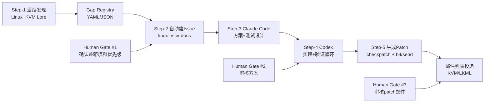
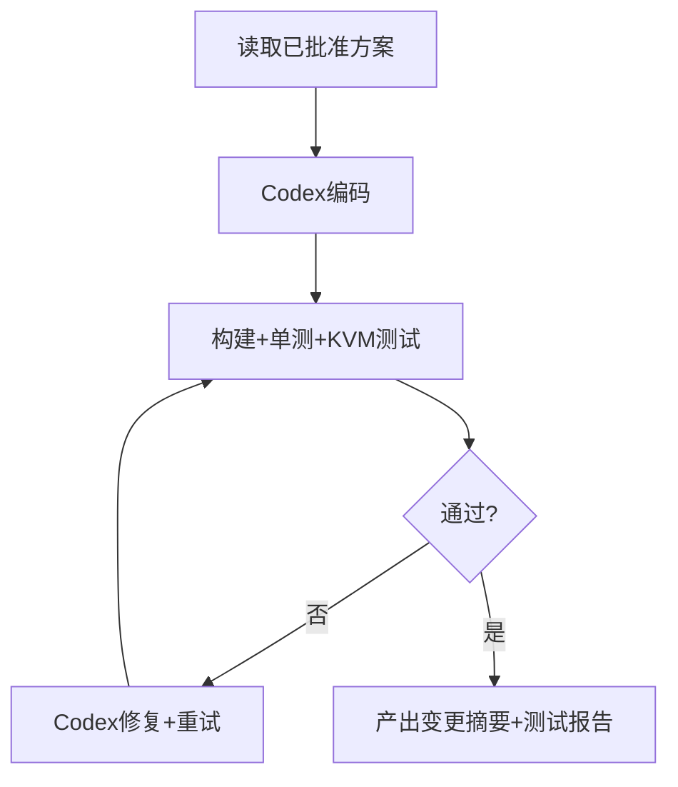
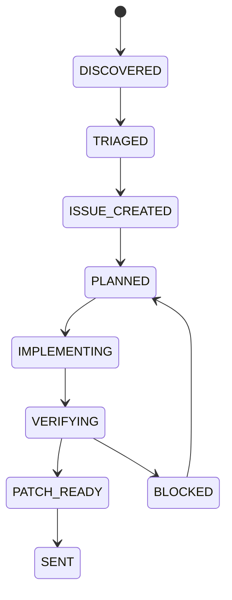

# RISC-V vs ARM/x86 Linux/KVM Gap Closing — OpenClaw 多Agent可运行方案

> 目标：把“差距发现 → 议题管理 → 方案设计 → 代码实现与验证 → Patch邮件发送”做成可配置、可批量、可追踪、尽可能自动化的流水线。

---

## 0. 设计原则（先定规矩）

1. **单一事实源（SSOT）**：
   - 差距项与状态以 `linux-riscv-docs` 仓库的 Issue 为准。
2. **角色分离**：
   - Claude Code：方案设计/测试矩阵/风险分析。
   - Codex：编码、调试、回归循环。
   - OpenClaw 主控：编排、状态机、日志、提醒、人工卡点。
3. **可配置可替换**：
   - 每个阶段的执行Agent可切换（claude-code/codex/openclaw 子agent）。
4. **人类只在关键节点介入**：
   - 需求确认、优先级、Patch最终签字、邮件正文最终检查。

---

## 1. 总体架构



---

## 2. 仓库与目录约定（建议落地）

在 `git@github.com:zcxGGmu/linux-riscv-docs.git` 下新增：

```text
kernel/openclaw/
├─ OPENCLAW_MULTI_AGENT_WORKFLOW.md      # 本文档
├─ config/
│  ├─ workflow.yaml                      # 主配置（agent/model/阈值/并发）
│  ├─ prompts.yaml                       # 各阶段提示词模板
│  └─ labels.yaml                        # issue label映射
├─ state/
│  ├─ gap_registry.yaml                  # 差距项结构化清单
│  ├─ issue_map.yaml                     # 差距项<->issue id映射
│  └─ run_history/                       # 每轮执行历史
├─ scripts/
│  ├─ 01_scan_gaps.sh                    # Linux + lore 扫描
│  ├─ 02_sync_issues.sh                  # 批量建/更新 issue
│  ├─ 03_plan_with_claude.sh             # Claude方案阶段
│  ├─ 04_impl_with_codex.sh              # Codex实现循环
│  ├─ 05_gen_patch_and_send.sh           # patch+邮件发送
│  └─ lib/common.sh
└─ templates/
   ├─ issue_template.md
   ├─ plan_template.md
   ├─ test_matrix_template.md
   └─ cover_letter_template.md
```

---

## 3. 配置模型（可配置点）

`config/workflow.yaml`（示例）：

```yaml
project:
  linux_repo: /data/src/linux
  docs_repo: /data/src/linux-riscv-docs
  kvm_lore_url: https://yhbt.net/lore/kvm/

agents:
  scout:
    runtime: acp
    agentId: claude-code
    model: hanbbq/gpt-5.3-codex
  planner:
    runtime: acp
    agentId: claude-code
    model: hanbbq/gpt-5.3-codex
  implementer:
    runtime: acp
    agentId: codex
    model: hanbbq/gpt-5.3-codex
  verifier:
    runtime: acp
    agentId: codex
    model: hanbbq/gpt-5.3-codex

policy:
  max_parallel_issues: 3
  max_fix_iterations: 8
  require_human_gate:
    - gate_gap_triage
    - gate_plan_review
    - gate_patch_send

issue:
  repo: zcxGGmu/linux-riscv-docs
  assignee: zcxGGmu
  labels_default: ["riscv", "kvm-gap"]
  labels_severity:
    critical: ["priority:P0"]
    high: ["priority:P1"]
    medium: ["priority:P2"]

mailing:
  target_lists:
    - kvm@vger.kernel.org
    - linux-riscv@lists.infradead.org
  dry_run: true
  use_b4: true
```

> 说明：`agentId` 可切换为 `claude-code` / `codex` / 其他ACP agent，实现“同流程、不同执行器”。

---

## 4. 分阶段执行设计（对应你的 step-1~5）

## Step-1 差距发现（自动）

**输入**：
- `torvalds/linux.git`
- `https://yhbt.net/lore/kvm/`

**自动动作**：
1. 对比架构目录与KVM路径：
   - `arch/riscv` vs `arch/arm64` vs `arch/x86`
   - `virt/kvm/*` 按能力维度比对（中断虚拟化、nested、PMU、AIA、IOMMU、dirty log、live migration、G-stage等）
2. 抓取 lore/kvm 主题线索：
   - “[riscv] + feature keyword + RFC/RESEND/Reviewed-by”
3. 产出 `state/gap_registry.yaml`：
   - gap_id
   - 功能缺失/性能差距
   - 证据（commit/thread/link）
   - 影响范围
   - 初始优先级

**Human Gate #1（必须）**：
- 你确认差距项去留 + 优先级（P0/P1/P2）

---

## Step-2 自动建Issue（自动）

**自动动作**：
1. 读取 `gap_registry.yaml`，按 `gap_id` 去重。
2. 对每个 gap 在 `zcxGGmu/linux-riscv-docs` 建立 issue：
   - 标题规范：`[GAP][<subsystem>] <short summary>`
   - 内容：现状、目标、证据链接、验收标准、风险。
3. 写回 `state/issue_map.yaml`（gap_id -> issue_number）

**建议Issue模板字段**：
- Background
- Gap Statement
- Evidence（代码路径 + 邮件列表链接）
- Proposed Direction
- Test/Benchmark Acceptance
- Upstream Strategy

---

## Step-3 申领Issue + Claude方案设计（半自动）

**自动动作**：
1. 批量 claim issue（assignee + in-progress label）。
2. 调用 Claude Code 生成：
   - 详细技术设计
   - 代码改动点（文件级）
   - 测试方案（kselftest / kvm-unit-tests / perf）
   - 回滚与风险预案

**Human Gate #2（必须）**：
- 你审批方案（特别是架构方向、兼容性、可上游性）。

---

## Step-4 Codex 实现与验证循环（自动主导）



**自动动作**：
1. 基于方案落地代码。
2. 执行验证流水线：
   - `make` / `defconfig` / `allmodconfig`（按资源配置）
   - `kselftest`
   - `kvm-unit-tests`
   - 微基准/性能回归
3. 失败进入循环，直至成功或达到 `max_fix_iterations`。

**失败升级策略**：
- 达到迭代上限 -> 自动转回 Claude 进行方案修订建议。

---

## Step-5 Patch生成与邮件发送（半自动）

**自动动作**：
1. `git format-patch` 生成 patch series。
2. `scripts/get_maintainer.pl` 生成收件建议。
3. `checkpatch.pl` / `b4 prep` 预检。
4. 生成 cover letter（引用 issue、测试结果、性能数据）。

**Human Gate #3（必须）**：
- 你最终确认：
  - commit message语义
  - Cc/To名单
  - 邮件正文与风险描述

**确认后发送**：
- `b4 send` 或 `git send-email` 发到 KVM/LKML 对应列表。

---

## 5. OpenClaw 编排方式（可运行）

推荐两种模式：

1. **手动触发全流程**（适合研发迭代）
2. **Cron定时扫描 + 手动审批执行**（适合长期运行）

### 5.1 主编排命令（建议）

```bash
# 仅扫描差距并更新 registry
bash kernel/openclaw/scripts/01_scan_gaps.sh

# 同步 issue
bash kernel/openclaw/scripts/02_sync_issues.sh

# 对指定 issue 生成方案
bash kernel/openclaw/scripts/03_plan_with_claude.sh --issue 42

# 对指定 issue 实现并验证
bash kernel/openclaw/scripts/04_impl_with_codex.sh --issue 42

# 生成 patch 并准备发送
bash kernel/openclaw/scripts/05_gen_patch_and_send.sh --issue 42 --dry-run
```

### 5.2 OpenClaw ACP 调度示意

- 方案阶段：`sessions_spawn(runtime="acp", agentId="claude-code", ...)`
- 实现阶段：`sessions_spawn(runtime="acp", agentId="codex", ...)`
- 可在配置中切换 agentId，不改流程脚本。

---

## 6. 状态机与可观测性

每个 gap/issue 采用状态流转：



建议在 `state/run_history/*.json` 记录：
- agent、模型、耗时、token/成本（若可得）
- 测试通过率
- 重试次数
- 失败原因分类（编译失败/功能失败/性能回退/风格检查失败）

---

## 7. 人类参与节点（明确标注）

- **Gate #1（Step-1后）**：差距项与优先级确认
- **Gate #2（Step-3后）**：技术方案审批
- **Gate #3（Step-5前）**：Patch邮件最终签发

> 这3个点不能全自动替代，尤其 Gate #3 涉及上游沟通质量与责任归属。

---

## 8. 你这个场景的优化建议（在原step基础上增强）

1. **先做“能力地图”再开 issue**：
   - 先形成统一 taxonomy（功能缺失/性能差距/工程债务），避免 issue 风格混乱。
2. **引入“证据置信度”字段**：
   - high/medium/low，降低误报差距项。
3. **开发循环里强制性能门禁**：
   - 不只功能通过，性能退化超过阈值自动 fail。
4. **patch 发信前自动生成“上游沟通摘要”**：
   - 3段式：问题、方案、验证数据，减少邮件来回。
5. **批量并发但限制最大并行 issue**：
   - 推荐 2~3 并发，避免测试资源争用导致噪声。

---

## 9. 最小可运行落地计划（1周）

- Day 1: 落配置 + `01_scan_gaps.sh` + `gap_registry.yaml`
- Day 2: `02_sync_issues.sh` + issue模板
- Day 3: `03_plan_with_claude.sh`（单issue打通）
- Day 4-5: `04_impl_with_codex.sh` + 测试循环
- Day 6: `05_gen_patch_and_send.sh` dry-run
- Day 7: 首个真实 patch 发送

---

## 10. 成功标准（Definition of Done）

1. 可以从0到1自动产出“差距项 -> issue”
2. 任一 issue 可一键触发“方案 -> 编码 -> 验证 -> patch”
3. 人类仅在3个 Gate 操作，其余自动化
4. 至少1个 riscv gap 完成 upstream patch 发送

---

## 11. 备注

- 本方案优先解决**可执行与可维护**，不是一次性脚本。
- 如果你同意，我下一步直接把 `config/ + templates/ + scripts/` 的最小实现骨架一起补齐，做到可以直接跑第一轮。
