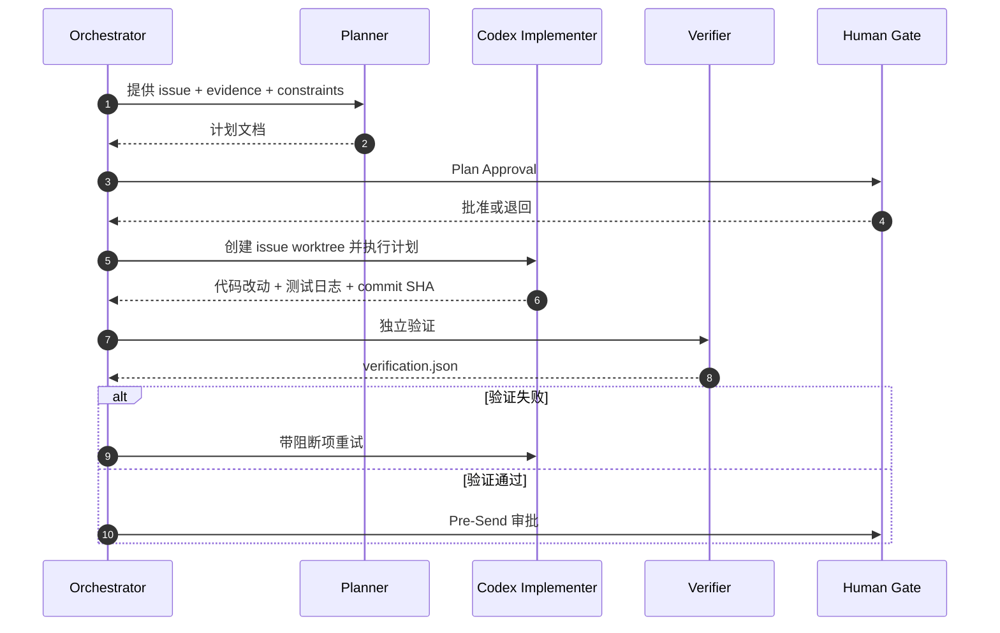
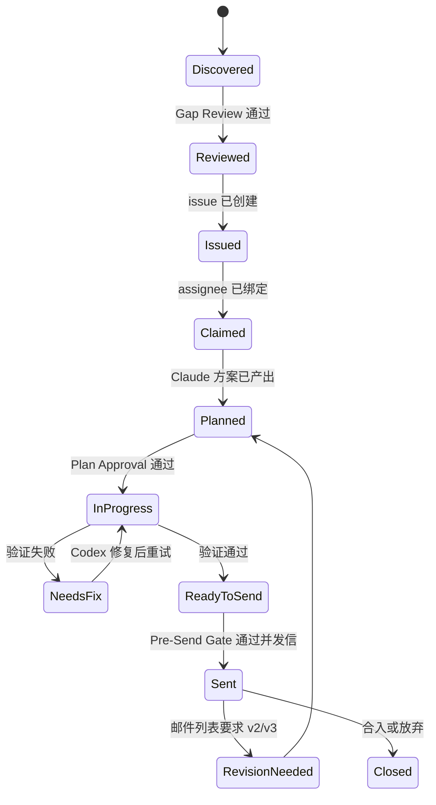

# RISC-V 内核差距多 Agent 工作流设计

> 目标：围绕 `git@github.com:torvalds/linux.git` 与 KVM 邮件列表归档，持续发现 RISC-V 相较 `arm64/x86` 的功能缺失与性能差距，并在 `git@github.com:zcxGGmu/linux-riscv-docs.git` 上创建 issue、完成设计与开发闭环，最终生成并发送 patch。
>
> 推荐运行时分工：`OpenClaw = Orchestrator`，`Claude Code = Planner`，`Codex = Implementer + Verifier`。

## 1. 设计结论

这个问题不适合“单 Agent 从头做到尾”。真正需要的是一个以状态文件为中心、以人工 Gate 控制风险、以多 Agent 并发做重活的流水线。

可选方案有 3 种：

| 方案 | 特点 | 优点 | 缺点 |
| --- | --- | --- | --- |
| A. 单会话串行 | 一个 Agent 按 Step-1~5 顺推 | 简单 | 上下文膨胀，重复劳动多，难并发 |
| B. 事件驱动多 Agent | Orchestrator 管理 backlog/state，子 Agent 按职责消费任务 | 并发好、可审计、容易插入人工 Gate | 需要定义状态文件与角色契约 |
| C. 全自动无人工 Gate | 尽量自动创建 issue、自动发 patch | 效率最高 | 误报、误发邮件、礼仪风险最高 |

推荐方案：**B. 事件驱动多 Agent**。原因：

- Step-1 的仓库扫描、邮件挖掘、性能线索提取天然可并行。
- Step-2 之后每个 gap 都可以独立推进，适合按 issue 分 worktree 并发。
- Step-5 涉及邮件列表礼仪与收件人准确性，必须保留人工审批点。

## 2. 端到端流程图

```mermaid
flowchart LR
    O[OpenClaw Orchestrator] --> RS[Repo Scanner Pool]
    O --> MM[Mailing List Miner Pool]
    RS --> GN[Gap Normalizer]
    MM --> GN
    GN --> GR{{人工 Gate<br/>Gap Review}}
    GR --> IA[Issue Author]
    IA --> IC[Issue Claimer]
    IC --> CP[Claude Code Planner]
    CP --> PA{{人工 Gate<br/>Plan Approval}}
    PA --> CX[Codex Implementer]
    CX --> VF[Independent Verifier]
    VF -->|失败| CX
    VF -->|通过| PS{{人工 Gate<br/>Pre-Send}}
    PS --> PP[Patch Publisher]
    PP --> ML[KVM / linux-riscv 邮件列表]
    ML --> FB[Review Feedback Miner]
    FB --> CP
```



## 3. 角色与输入/输出契约

| Agent | 推荐运行时 | 主要输入 | 主要输出 | 是否可全自动 |
| --- | --- | --- | --- | --- |
| Orchestrator | OpenClaw | 配置、state、审批策略 | DAG 状态、重试决策、审计日志 | 是 |
| Repo Scanner | OpenClaw 子代理 | `linux.git` 本地镜像、架构列表、关注目录 | `state/gaps.repo.json` | 是 |
| Mailing List Miner | OpenClaw 子代理 | `https://yhbt.net/lore/kvm/`、`https://yhbt.net/lore/kvm-riscv/`、关键词模板、时间窗口 | `state/gaps.mail.json` | 是，归档受限时需人工提供 mbox/线程 URL |
| Gap Normalizer | OpenClaw 子代理 | 仓库与邮件挖掘结果 | `state/gap_backlog.yaml` | 是 |
| Issue Author | OpenClaw 子代理 | backlog、issue 模板、`gh` 凭证 | `state/issues.yaml` | 是 |
| Issue Claimer | OpenClaw 子代理 | issue 列表、assignee 映射 | `state/claimed.yaml` | 是 |
| Planner | Claude Code | 单个 issue、证据包、代码路径、测试约束 | `plans/<issue-id>.md` | 部分自动，建议人工审阅 |
| Implementer | Codex | 实现计划、目标 worktree、构建与测试命令 | 代码改动、提交 SHA、测试日志 | 是 |
| Verifier | Codex 或 OpenClaw 子代理 | 变更分支、测试矩阵、性能阈值 | `reports/<issue-id>-verification.json` | 是 |
| Patch Publisher | OpenClaw | commit 范围、cover letter 模板、收件人规则、邮件配置 | patch/mbox、发送记录、thread URL | 部分自动，发信前建议人工审批 |
| Review Feedback Miner | OpenClaw 子代理 | lore thread URL、message-id | `state/review_todos.yaml` | 是 |

## 4. 人工参与节点

自动化应尽量覆盖探索、建档、实现和验证，但下面 4 个节点建议保留人工确认：

| Gate | 触发时机 | 人类需要做什么 | 原因 |
| --- | --- | --- | --- |
| Gap Review | `Gap Normalizer` 产出候选 gap 后 | 确认“差距”不是设计选择、不是误读旧讨论 | 避免误报与重复问题 |
| Issue Publish | 批量创建 issue 前 | 抽样或全量检查标题、描述与标签 | 避免 issue 污染目标仓库 |
| Plan Approval | Claude Code 产出计划后 | 确认边界、优先级、测试成本与回滚策略 | 降低过度设计与偏题风险 |
| Pre-Send | patch 生成后 | 检查 commit message、cover letter、To/Cc、版本号 | 邮件列表投递不可逆，礼仪风险高 |

额外的人类兜底场景：

- `yhbt.net` 归档抓取被限流或出现 `403` 时，由人类提供本地 mbox、线程链接或 Atom 缓存。
- 性能 gap 需要真实板卡验证时，由人类调度硬件实验室或补充结果。
- 首次发送 patch 时，由人类完成 SMTP、`git send-email`、`b4`、`patatt` 等身份配置。

## 5. Step-1 到 Step-5 的推荐拆解

### Step-1 探索 `linux.git` 与 KVM 邮件列表

这一步建议由 4 个子 Agent 并行：

| 子任务 | 关注点 | 典型扫描对象 | 产物 |
| --- | --- | --- | --- |
| Feature Parity Scanner | 功能缺失 | `arch/riscv` vs `arch/arm64` vs `arch/x86`、`virt/kvm/`、`include/uapi/linux/` | 功能差距候选 |
| Selftest Parity Scanner | 测试覆盖差距 | `tools/testing/selftests/kvm/`、架构专属 selftests | 测试差距候选 |
| Perf Signal Scanner | 性能线索 | KVM tracepoint、benchmark 脚本、历史性能报告 | 性能差距候选 |
| Mailing List Miner | 邮件讨论线索 | `yhbt.net/lore/kvm/`、`yhbt.net/lore/kvm-riscv/`、Atom/mbox/thread HTML | 讨论证据与状态 |

推荐把“差距项”统一成 5 类：

- 功能缺失：`arm64/x86` 已支持、RISC-V 缺失的 KVM capability、arch hook、文档或接口。
- 测试缺失：selftests 在 `arm64/x86` 存在而 `riscv` 缺失，或同类场景无验证。
- 性能差距：exit latency、fault path、dirty log、interrupt injection、guest/host 切换等指标显著落后。
- 稳定性缺口：邮件列表里已有 bug/fix 线程，但主线或 RISC-V 路径仍未补齐。
- 文档/工具缺口：流程、脚本、观测工具仅在其他架构成熟。

推荐用“证据三元组”给 gap 打分：

- 代码证据：在 Linux 树中存在架构对比证据。
- 邮件证据：在 KVM 或 KVM-RISC-V 归档中存在讨论、RFC、fixme、回归或 TODO。
- 测试/性能证据：有复现脚本、selftest 缺口、benchmark 或 CI 日志。

只有满足以下任一条件，才进入 backlog：

- 至少命中 2 个证据来源。
- 仅命中 1 个证据来源，但 `confidence >= threshold` 且可复现。

### Step-2 为每个 gap 在 `linux-riscv-docs` 创建 issue

`Issue Author` 基于 `state/gap_backlog.yaml` 生成 issue 草稿，然后通过 `gh issue create` 或 GitHub API 提交。

每个 issue 建议固定字段：

- `Problem Statement`：RISC-V 相比 `arm64/x86` 缺什么。
- `Evidence`：代码链接、线程链接、复现摘要。
- `Why Now`：对用户或子系统维护的影响。
- `Acceptance Criteria`：何时算修复完成。
- `Related Threads`：对应 lore / yhbt URL。
- `Suggested Owner`：建议认领人或执行 Agent。

如果批量创建 issue，建议分批：

- 一次最多 5 个。
- 同一子系统按严重级别排序。
- issue 标题先做近似去重，避免重复。

### Step-3 申领 issue，并调用 Claude Code 输出详细方案

`Issue Claimer` 完成 assignee、状态标签、首条 comment 后，由 `Planner` 逐个消费 issue。

`Planner` 的输出建议强制包含：

- 背景与根因假设
- 对比架构现状与 RISC-V 差距
- 方案 A / B 与推荐方案
- 要修改的代码路径
- 测试矩阵：编译、kselftest、QEMU、真实板卡、性能基线
- 风险、兼容性影响、回滚方案
- 明确的 DoD：Definition of Done

推荐 `Planner` 只处理一个 issue，并把产物写成：

```text
plans/
  ISSUE-001-kvm-riscv-foo.md
```

### Step-4 调用 Codex 实现并进入开发/验证循环

这一阶段建议“一条 issue 一个 worktree”，避免并发污染：



推荐的 Codex 循环：

1. 新建 `worktrees/<issue-id>`。
2. 按计划只修改当前 issue 相关文件。
3. 运行最小回归集合。
4. 独立 `Verifier` 复查。
5. 若失败，只把阻断项反馈给 `Implementer`，不共享“成功结论”。
6. 达到闸门后才生成 patch。

质量闸门至少包含：

- `ARCH=riscv` 的目标配置编译通过。
- 相关 `kselftest` / 单测通过。
- 没有明显 blocker 级别 `checkpatch` 问题。
- 性能回归未超过阈值，例如 `3%`。
- 计划里声明的验收标准全部满足。

### Step-5 生成 patch 并发送到邮件列表

这一阶段优先使用内核社区现有工具链，而不是自造发送器。

推荐顺序：

1. `git format-patch --base=auto --cover-letter` 生成 patch series。
2. `b4 prep --auto-to-cc` 基于 `scripts/get_maintainer.pl` 自动补全收件人。
3. `b4 prep --check` 或直接跑 `scripts/checkpatch.pl` 做提交前检查。
4. 人工审 cover letter 与 `To/Cc`。
5. 使用 `b4 send` 或 `git send-email` 发送。

如果需要跟踪 v2/v3：

- 保存 `message-id`、thread URL、版本号。
- `Review Feedback Miner` 读取归档后写回 TODO。
- Orchestrator 将该 issue 重新送回 `Planner -> Implementer -> Verifier`。

## 6. 推荐目录布局

下面的结构足够支撑“可配置、可运行、可追踪”的最小版本：

```text
kernel/openclaw/codex/
├── configs/
│   └── workflow.example.yaml
├── docs/
│   └── plans/
│       └── 2026-03-10-riscv-gap-multi-agent-design.md
├── plans/
│   └── ISSUE-xxx.md
├── prompts/
│   ├── claude-planner-prompt.md
│   ├── codex-implementer-prompt.md
│   └── codex-verifier-prompt.md
├── reports/
│   ├── ISSUE-xxx-verification.json
│   └── ISSUE-xxx-test-report.md
├── state/
│   ├── README.md
│   ├── gaps.repo.json
│   ├── gaps.mail.json
│   ├── gap_backlog.yaml
│   ├── issues.yaml
│   ├── claimed.yaml
│   ├── review_todos.yaml
│   └── schema/
│       └── *.schema.json
├── templates/
│   ├── issue-template.md
│   └── design-template.md
└── tasks/
    ├── lessons.md
    └── todo.md
```

`state/` 是这套流水线的单一事实源，Agent 不直接通过聊天记忆串联状态。

## 7. 配置面设计

推荐把配置分为 6 组：

| 组 | 关键字段 |
| --- | --- |
| 仓库 | `linux_repo_url`、`linux_repo_local_path`、`docs_repo_url`、`docs_repo_local_path` |
| 数据源 | `mail_sources`、`search_windows`、`keywords`、`compare_arches` |
| Agent 映射 | `planner.runtime`、`implementer.runtime`、`verifier.runtime`、`max_parallel_issues` |
| 命令 | `build_cmds`、`test_cmds`、`perf_cmds`、`issue_cmd`、`patch_cmd` |
| 阈值 | `gap_confidence_threshold`、`issue_creation_threshold`、`perf_regression_threshold_pct` |
| 邮件 | `from_email`、`smtp_server`、`to_lists`、`cc_rules_path`、`subject_prefix` |

当前目录已提供示例配置：

```text
configs/workflow.example.yaml
```

当前目录还补齐了可执行资产：

```text
templates/issue-template.md
templates/design-template.md
prompts/claude-planner-prompt.md
prompts/codex-implementer-prompt.md
prompts/codex-verifier-prompt.md
state/README.md
state/schema/*.schema.json
```

它们的用途分别是：

- `templates/issue-template.md`：供 `Issue Author` 统一 issue 结构。
- `templates/design-template.md`：供 `Claude Code Planner` 输出可执行开发方案。
- `prompts/*.md`：把 Planner / Implementer / Verifier 的输入、约束、输出契约固定下来。
- `state/schema/*.schema.json`：约束多 Agent 之间的状态文件格式，减少编排歧义。

## 8. 每个 gap 的状态机



## 9. 最小可运行策略

如果你现在就要启动 MVP，建议按下面顺序启用：

1. 用 OpenClaw 跑 `Repo Scanner Pool + Mailing List Miner Pool`，产出 `gap_backlog.yaml`。
2. 进行人工 `Gap Review`，只保留 `P0/P1`。
3. 批量创建 `linux-riscv-docs` issue，并自动认领。
4. 对每个已认领 issue 调用 Claude Code 输出计划。
5. 经人工 `Plan Approval` 后，把 issue 派发给 Codex。
6. Codex 在独立 worktree 实现，Verifier 独立检查。
7. 通过 `Pre-Send` 后生成并发送 patch。

并发建议：

- Step-1 可开 `4~6` 个子 Agent。
- Step-2 批量创建 issue 时限制为 `1~2`。
- Step-4 同时推进的 issue 不超过 `2~3`，否则验证和硬件资源容易互相阻塞。

## 10. 风险与控制策略

| 风险 | 表现 | 控制方式 |
| --- | --- | --- |
| 误把设计差异当缺陷 | issue 标题夸大、难以收敛 | 强制 `Gap Review`，至少两类证据 |
| 多 Agent 重复劳动 | 同一 gap 被多人认领 | 以 `state/gap_backlog.yaml` 为锁和状态源 |
| 缺少真实硬件数据 | perf gap 无法下结论 | 标记 `needs_hardware_lab`，进入人工队列 |
| 邮件发送不规范 | To/Cc 不全、cover letter 不规范 | 使用 `b4 prep --auto-to-cc`，Pre-Send 人工复核 |
| 计划与实现脱节 | Planner 太宽，Implementer 无法落地 | 计划模板中强制列出文件、命令、DoD |

## 11. 建议补充的执行约束

为了让这条流水线更稳定，建议追加 4 条规则：

- 一个 Agent 一次只拥有一个明确目标，不允许“顺手”处理别的 gap。
- 一个 issue 对应一个 worktree、一组计划、一组验证报告。
- 所有自动决策都回写 `state/`，不要依赖对话记忆。
- `Step-5` 默认不是全自动，除非人类显式关闭 `Pre-Send Gate`。

## 12. 外部参考

- Linux 主线仓库：<https://github.com/torvalds/linux>
- `linux-riscv-docs` 仓库：<https://github.com/zcxGGmu/linux-riscv-docs>
- KVM-RISC-V 邮件归档示例：<https://yhbt.net/lore/kvm-riscv/173395734850.1729195.10005899360469788312.git-patchwork-notify%40kernel.org/>
- Linux 内核 patch 提交流程：<https://www.kernel.org/doc/html/next/process/submitting-patches.html>
- `b4 prep --auto-to-cc` 与 `--check`：<https://b4.docs.kernel.org/en/stable-0.14.y/contributor/prep.html>
- `b4` 配置项：<https://b4.docs.kernel.org/en/latest/config.html>
