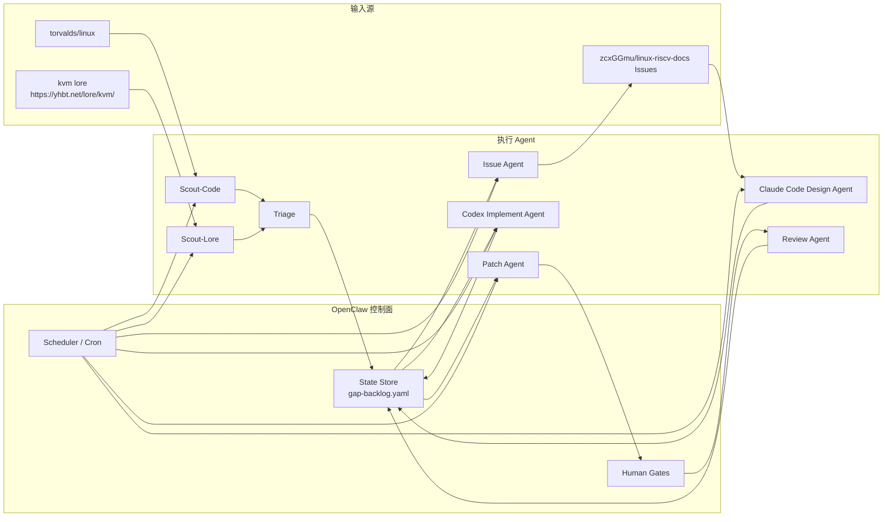
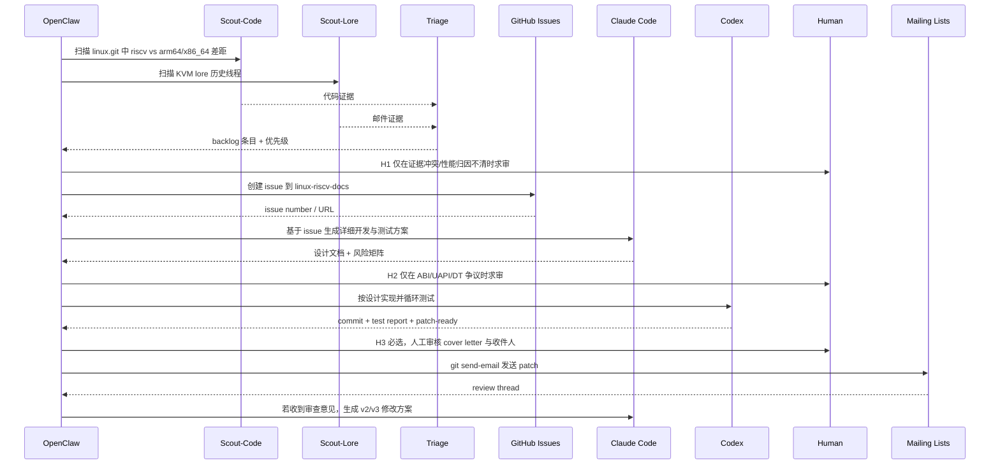
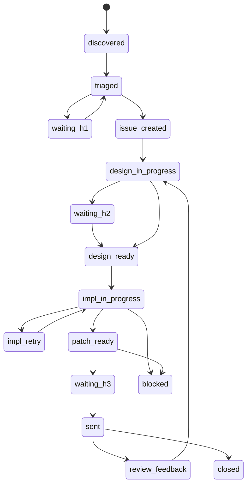

# RISC-V 与 ARM64/X86_64 Linux 内核差距闭环多 Agent 工作流

> 目标：用 `OpenClaw` 做控制面，编排 `Claude Code` 与 `Codex` 两类执行 Agent，把 “差距发现 -> issue 化 -> 方案设计 -> 编码验证 -> patch 投递” 跑成可复用流水线。

## 1. 范围与原则

- 对比对象默认限定为 `arch/riscv` 相对 `arch/arm64` 和 `arch/x86` 的内核支持差距。
- `ARM` 默认指 `arm64`，`x86` 默认指 `x86_64`；若后续要扩展到 32-bit，可在配置里单独加目标。
- `Step-2` 的 issue 目标仓库固定为 `git@github.com:zcxGGmu/linux-riscv-docs.git`。
- 代码实现与 patch 生成发生在 `git@github.com:torvalds/linux.git` 的工作树或你的 fork 中，不在 issue 仓库里直接改代码。
- 能自动化的步骤全部自动化；凡是涉及架构争议、证据不足、外部写操作或邮件礼仪风险的步骤，都显式设置人工闸门。

## 2. 总体架构



### 角色划分

| Agent | 主要职责 | 输入 | 输出 |
| --- | --- | --- | --- |
| `Scout-Code` | 比较 `riscv/arm64/x86` 能力矩阵、Kconfig、selftests、KVM 钩子、性能路径 | Linux 源码树 | `gap-candidates.yaml` 补充代码证据 |
| `Scout-Lore` | 搜索 KVM lore 中的 TODO、RFC、已知缺口、性能回归讨论 | `https://yhbt.net/lore/kvm/` | 每个 gap 的邮件证据与 thread 链接 |
| `Triage` | 去重、归类、打分、过滤“硬件差异伪问题” | 候选 gap | `gap-backlog.yaml` |
| `Issue Agent` | 在 `linux-riscv-docs` 上批量建 issue、回写链接 | backlog 中待建档条目 | issue URL / 编号 / assignee |
| `Claude Code Design Agent` | 针对每个 issue 生成开发与测试方案 | issue + 证据 bundle | `design/<gap-id>-plan.md` |
| `Codex Implement Agent` | 按设计编码、构建、测试、回归验证 | 设计文档 + Linux 工作树 | commits、测试报告、patch |
| `Patch Agent` | 生成 patch series、cover letter、发信前检查 | 通过闸门的实现结果 | `patches/`、发送清单 |
| `Review Agent` | 解析邮件回复、提取 review action items | 邮件线程 | v2/v3 任务回写 backlog |

## 3. 可配置控制面

推荐把控制面配置收敛为单文件，例如 `workflow.yaml`。下面是最小可运行样例：

```yaml
workflow:
  name: riscv-gap-closer
  compare_targets:
    - arm64
    - x86_64
  source_repos:
    linux_upstream: git@github.com:torvalds/linux.git
    issue_repo: git@github.com:zcxGGmu/linux-riscv-docs.git
  lore:
    base_url: https://yhbt.net/lore/kvm/
    query_terms:
      - "riscv missing"
      - "riscv parity"
      - "riscv TODO"
      - "riscv performance"
      - "riscv arm64"
      - "riscv x86"
    lookback_days: 3650
  discovery:
    scan_paths:
      - arch/riscv
      - arch/arm64
      - arch/x86
      - kernel
      - mm
      - drivers
      - tools/testing
      - virt
    evidence_threshold: 2
    require_evidence:
      - code
      - lore
  issue_tracker:
    owner_repo: zcxGGmu/linux-riscv-docs
    labels:
      - riscv-gap
      - auto-discovered
    create_batch_size: 5
  agents:
    design:
      runtime: claude-code
      parallelism: 2
    implement:
      runtime: codex
      parallelism: 2
      retry_limit: 2
  quality_gates:
    build:
      - "make ARCH=riscv defconfig"
      - "make -j$(nproc) ARCH=riscv"
    tests:
      - "kselftest relevant subset"
      - "kunit relevant subset"
    checkpatch: true
    get_maintainer: true
  human_gates:
    evidence_ambiguity: true
    risky_design: true
    send_email: true
  mail:
    primary_lists:
      - linux-riscv@lists.infradead.org
      - kvm@vger.kernel.org
      - linux-kernel@vger.kernel.org
    use_get_maintainer: true
```

### 推荐调节项

| 配置项 | 作用 | 默认建议 |
| --- | --- | --- |
| `discovery.evidence_threshold` | 一个 gap 至少需要几类证据才允许入 backlog | `2` |
| `issue_tracker.create_batch_size` | 每轮最多创建多少 issue | `5` |
| `agents.design.parallelism` | 同时设计多少个 issue | `2` |
| `agents.implement.parallelism` | 同时开发多少个 gap | `2` |
| `agents.implement.retry_limit` | 自动修复失败后最多自循环次数 | `2` |
| `human_gates.send_email` | 发信前是否强制人工确认 | `true`，建议不要关闭 |

## 4. 工件与状态模型

建议当前目录至少维护以下结构：

```text
codex/
  riscv-arm-x86-gap-multi-agent-workflow.md
  tasks/
    todo.md
  state/
    gap-candidates.yaml
    gap-backlog.yaml
  design/
    GAP-xxxx-plan.md
  reports/
    GAP-xxxx-test-report.md
  patches/
    GAP-xxxx/
  templates/
    issue.md
    design.md
    cover-letter.md
```

单个 gap 条目建议长这样：

```yaml
items:
  - id: GAP-2026-001
    title: "KVM: riscv missing feature X compared with arm64/x86"
    category: feature
    subsystem: kvm
    compare_against:
      - arm64
      - x86_64
    evidence:
      code_refs:
        - "arch/arm64/... has feature X"
        - "arch/riscv/... missing corresponding path"
      lore_refs:
        - "https://yhbt.net/lore/kvm/<message-id>/"
      perf_refs: []
    triage:
      priority: P1
      confidence: high
      needs_human_review: false
    github:
      repo: zcxGGmu/linux-riscv-docs
      issue_number: null
      issue_url: null
      assignee: null
    design_doc: null
    implementation:
      branch: null
      status: new
      retries: 0
      verification: []
    patch:
      series_dir: null
      sent: false
      message_id: null
```

## 5. 端到端工作流



### Step-0: 初始化

1. 准备三个工作区：
   - 控制面目录：当前目录，用来存放状态、设计、报告、patch 元数据。
   - `linux.git` 镜像或 fork：用于差距扫描与编码实现。
   - GitHub 凭据与 SMTP / `git send-email` 配置：用于外部写操作。
2. 安装或确认以下工具：
   - `git`, `gh`, `curl`/`wget`, `jq`/`yq`
   - Linux 内核构建链与相关 QEMU/板卡测试环境
   - `scripts/checkpatch.pl`, `scripts/get_maintainer.pl`
3. 在 OpenClaw 中注册两个执行 runtime：
   - `claude-code`: 只负责设计与测试计划。
   - `codex`: 只负责改代码与做验证闭环。

### Step-1: 探索 Linux 代码仓库和 KVM lore，发现 gap

`Scout-Code` 和 `Scout-Lore` 并行执行，这是整个流程必须启用的 multi-agent 节点。

#### `Scout-Code` 的发现策略

1. 建立能力矩阵：
   - `Kconfig`/`defconfig` 对比
   - `arch/riscv` 对 `arch/arm64`、`arch/x86` 的实现覆盖
   - `tools/testing`, `kselftest`, `kunit`, `perf`, `KVM` 自测覆盖差异
2. 识别候选 gap：
   - 某功能在 `arm64/x86` 存在，在 `riscv` 缺失
   - `riscv` 有 `TODO`、`FIXME`、`stub`，而对照架构已有正式实现
   - 同子系统下 `riscv` 缺少自测、基准、文档或维护脚本
3. 为性能 gap 单独标记：
   - 只接受“由内核支持差异导致”的性能问题
   - 如果更可能是 SoC/微架构差异，不自动立项，转人工判定

#### `Scout-Lore` 的发现策略

1. 搜索模式：
   - 关键词：`riscv missing`, `riscv parity`, `riscv TODO`, `riscv performance`
   - 对 KVM 方向加：`riscv kvm`, `stage2`, `timer`, `irqchip`, `gstage`, `nested`
2. 提取结果：
   - 缺失功能的讨论线程
   - 已有人提过但未落地的 patch/RFC
   - 维护者对实现方式或测试要求的偏好
3. 结构化输出：
   - 线程 URL
   - 关键结论一句话摘要
   - 是否已有人在做

#### `Triage` 的准入规则

- 至少满足“代码证据 + lore 证据”两类中的两类之一。
- 能直接转成工程任务，而不是泛泛而谈的“生态还不成熟”。
- 性能 gap 需要额外附上复现脚本或 benchmark 说明。

#### Human Gate `H1`

以下情况不建议全自动推进，必须人工确认：

- 性能差距可能由硬件平台差异引起，而不是 Linux 内核支持差异。
- lore 里已经有在途 patch，存在重复 issue 风险。
- 缺口本身是架构有意不支持，不应当机械追求 “和 x86 一样”。

### Step-2: 在 `linux-riscv-docs` 仓库创建 issue

`Issue Agent` 只消费 `triage.priority in {P0, P1}` 且未建档条目。

建议 issue 模板包含：

- 背景：`riscv` 当前状态 vs `arm64/x86_64` 当前状态
- 证据：代码位置、lore 链接、必要时附 benchmark
- 影响范围：子系统、用户面、是否影响 KVM/虚拟化场景
- 验收标准：功能、测试、性能或文档补齐条件

自动化要求：

1. 用 `gh issue create` 或 GitHub API 创建 issue。
2. 写回 `issue_number`、`issue_url`、`labels`、`created_at`。
3. 每轮最多建 `N=5` 个，避免噪音和重复。

### Step-3: 申领 issue，交给 Claude Code 产出详细方案

`Claude Code Design Agent` 的输入不是“一个标题”，而是完整证据包：

- backlog 条目
- 对应 issue 内容
- 代码引用与 lore 线程
- 建议复现脚本或测试入口

其输出必须至少覆盖：

1. 根因假设和反证点
2. 方案 A/B 与取舍
3. 是否涉及 UAPI / ABI / DT / Kconfig 行为变化
4. commit 切分建议
5. 测试矩阵：
   - `ARCH=riscv` 编译
   - 相关子系统 `kselftest` / `kunit`
   - 必要时 QEMU 与真实板卡
   - 若是 KVM，则至少补充 guest/host 组合
6. 回滚策略和审查风险点

#### Human Gate `H2`

只有以下几类情况需要人在设计阶段介入：

- 改动 UAPI、DT binding、ABI 或明显用户可见行为
- lore 已有维护者明确表态，方案选择存在争议
- 需要决定“追 arm64”还是“追 x86”哪个语义基线

### Step-4: 交给 Codex 执行开发、测试、验证闭环

`Codex Implement Agent` 按 issue 一条一分支运行，建议分支命名：

```text
feat/GAP-2026-001-riscv-kvm-feature-x
```

循环逻辑如下：

1. 读取 `design/<gap-id>-plan.md`
2. 写最小失败测试或选定现有失败用例
3. 实现最小修复
4. 执行构建与测试
5. 如失败，自动分析失败日志并重试
6. 连续通过所有质量闸门后停止

建议质量闸门：

- `make ARCH=riscv defconfig`
- `make -j$(nproc) ARCH=riscv`
- 相关 `kselftest` / `kunit` / 子系统测试
- 需要时运行 benchmark，确认无显著回退
- `scripts/checkpatch.pl --strict`
- `scripts/get_maintainer.pl` 产出收件人列表

自动修复循环的停止条件：

- 通过全部质量闸门
- 或达到 `retry_limit`

达到 `retry_limit` 后，条目转 `blocked`，并回写失败摘要，不再盲目重试。

### Step-5: 生成 patch 并发送邮件列表

`Patch Agent` 负责：

1. 生成 patch series：

```bash
git format-patch --cover-letter -o patches/GAP-2026-001 origin/master
```

2. 生成 cover letter，内容至少包括：
   - gap 背景
   - 为什么这不是硬件差异导致的问题
   - 测试环境和结果摘要
   - 相关 lore / issue 链接
3. 用 `scripts/get_maintainer.pl` 补收件人。
4. 准备 `git send-email` 命令，但默认不自动发送。

#### Human Gate `H3`，必须保留

发信前必须人工检查：

- 收件人列表是否正确
- 标题前缀是否符合子系统习惯
- cover letter 是否准确、礼貌且没有夸大测试结论
- 是否需要同步发往 `linux-riscv`, `kvm`, `linux-kernel` 或其它维护列表

只有 `H3` 放行后才执行发送。

## 6. 状态机



推荐状态字段：

- `discovered`
- `triaged`
- `waiting_h1`
- `issue_created`
- `design_in_progress`
- `waiting_h2`
- `design_ready`
- `impl_in_progress`
- `impl_retry`
- `patch_ready`
- `waiting_h3`
- `sent`
- `review_feedback`
- `blocked`
- `closed`

## 7. OpenClaw 调度建议

最小建议拆成四类作业：

| Job | 触发方式 | 使用的 Agent | 目的 |
| --- | --- | --- | --- |
| `nightly-discovery` | cron，每天 1 次 | `Scout-Code` + `Scout-Lore` + `Triage` | 发现新增 gap |
| `issue-sync` | cron，每小时 1 次 | `Issue Agent` | 把高优条目变成 issue |
| `design-queue` | 事件触发 | `Claude Code Design Agent` | 处理新建或被审查退回的 issue |
| `impl-queue` | 事件触发 | `Codex Implement Agent` | 编码、验证、产出 patch-ready 结果 |

如果你的 OpenClaw 控制面支持 YAML job 配置，可以按下面的方式映射：

```yaml
jobs:
  - id: nightly-discovery
    schedule: "30 1 * * *"
    steps:
      - agent: scout-code
      - agent: scout-lore
      - agent: triage

  - id: issue-sync
    schedule: "0 * * * *"
    steps:
      - agent: issue-agent

  - id: design-queue
    trigger: issue_created
    steps:
      - agent: claude-code

  - id: impl-queue
    trigger: design_ready
    steps:
      - agent: codex
```

## 8. 最小可运行 Playbook

1. 在当前目录建立 `state/`, `design/`, `reports/`, `patches/`, `templates/`。
2. 配好 `workflow.yaml`、GitHub token、`git send-email` 和 Linux 构建环境。
3. 跑 `nightly-discovery`，生成 `gap-backlog.yaml`。
4. 人工只处理 `H1` 冲突项，其余自动建 issue。
5. 每个 issue 自动触发 `Claude Code` 出方案。
6. `Codex` 消费 `design_ready` 条目，循环到 `patch_ready`。
7. 人工执行 `H3` 审核后发信。
8. `Review Agent` 持续跟踪回复，驱动 v2/v3。

## 9. 为什么这里必须保留人工节点

- 差距识别阶段最容易把“硬件差异”误判成“内核支持差异”。
- 设计阶段最容易踩 ABI/UAPI 与维护者偏好。
- 邮件发送阶段最容易因为收件人、标题、测试结论表述不准确而浪费评审资源。

所以这套流程的原则不是“百分百无人值守”，而是“除了必要的判断节点，其余全部自动推进”。

## 10. 建议的第一轮 MVP

不要一开始就覆盖整个内核；先限制在三个方向：

1. `arch/riscv` 与 `arm64/x86` 的功能缺口
2. `KVM/riscv` 与 `KVM/arm64/x86` 的功能缺口
3. 能用现有 QEMU 或板卡稳定复现的性能 gap

首轮目标建议：

- 发现并整理 6 个高置信度 gap
- 自动创建其中 3 到 5 个 issue
- 至少让 2 个 issue 跑到 `patch_ready`
- 完整经历一次邮件发出和 review 回流

## 11. 结论

这套方案把 `OpenClaw` 定位成调度器和状态机，把 `Claude Code` 定位成设计与测试方案引擎，把 `Codex` 定位成实现与验证引擎。真正的多 Agent 价值不在“多开几个模型”，而在于把发现、分诊、设计、实现、投递拆成彼此解耦的工作单元，并用状态文件和人工闸门把它们稳定串起来。

如果后续要把这份文档继续往“直接上线”推进，下一步建议是在当前目录再补两个配套文件：

- `workflow.yaml.example`
- `templates/issue.md`
