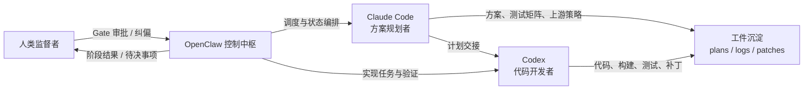
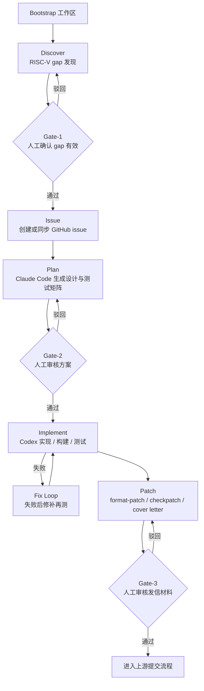
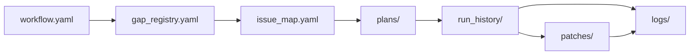

# OpenClaw 面向 Linux RISC-V 内核贡献能力调研报告

调研日期：2026-03-12

## 一、结论摘要

当前方案可以概括为：`OpenClaw 负责流程编排，Claude Code 负责方案规划，Codex 负责代码实现与验证，人类负责关键闸门审批`。这套组合已经具备“从问题发现到补丁准备”的基本闭环能力，但对 Linux 内核，尤其是 RISC-V、KVM、跨架构对比这类强依赖硬件语义与邮件列表上下文的工作，离“完全自主贡献”还有明显距离。

现阶段更准确的定位，不是“AI 已经能独立完成 Linux 内核贡献”，而是“OpenClaw 已经可以把内核贡献流程组织成一个可重复、可审计、带人工闸门的半自动流水线”。真正的瓶颈目前也不只是技术能力，而是成本与上下文消耗：根据用户实测，单次运行约 40 分钟左右就可能耗尽额度，导致完整样例尚未跑通。

## 二、方案形态与能力判断

### 1. 目标架构

| 角色 | 主要职责 | 当前价值 | 主要风险 |
| --- | --- | --- | --- |
| OpenClaw | 调度多 Agent、管理状态与工件、推动流程流转 | 把零散操作变成流水线 | 上下文和调度开销高 |
| Claude Code | 方案规划、文件级设计、测试矩阵、上游策略 | 适合处理歧义大、抽象层高的问题 | 成本高，长上下文代价明显 |
| Codex | 实现、构建、测试、修补、迭代收敛 | 适合 issue 驱动的代码执行 | 对硬件/架构隐含知识依赖仍高 |
| 人类 | 监督、筛选信息、审批关键步骤 | 降低误判和错误上游提交风险 | 仍需要投入较多时间 |

如果把这套方案从“表格描述”转换成“系统视角”，其协作关系大致如下：

**角色协作图**

### 2. 当前可做到的事情

- 把 `discover -> issue -> plan -> implement -> patch` 组织成一条显式流水线。
- 将 gap、issue、plan、run history、patch 等中间产物全部落盘，保证可追溯。
- 在规划和实现阶段引入不同模型分工，减少单模型全包的失真。
- 在补丁发信前保留人工审批，避免“自动把错误补丁发到上游”。

### 3. 当前做不到或不稳定的部分

- 对 RISC-V 与 ARM/x86 的差异、KVM 历史讨论、硬件语义细节，仍然需要人类参与判断。
- 无法保证模型自动筛出的信息都有效，尤其是“跨架构差异是否真是 gap”这一类问题。
- 尚未完成一个完整的端到端成功案例，原因不是单步能力完全不够，而是长流程的 token 消耗过快。

## 三、两个关键 Skill 的作用拆解

### 1. `create-agents-wizard`

根据 ClawHub 页面、公开 skill API 以及 skill 包内 `SKILL.md`，这个 skill 的核心作用不是“帮你写一个 agent”，而是“批量、标准化地创建一组 OpenClaw agent 及其工作区模板”。

它的实际价值体现在三个方面：

- 它把多 agent 初始化变成了一个向导式流程。用户先确认 agent 数量、`id`、workspace 路径，再选择 `Standard` 或 `Fast mode`。
- 它把 agent 人设与行为配置拆成标准文件集合。标准模式写入 6 个文件：`AGENTS.md`、`SOUL.md`、`IDENTITY.md`、`BOOTSTRAP.md`、`USER.md`、`STYLE.md`；快速模式只写 `AGENTS.md` 与 `SOUL.md`。
- 它强调逐个 agent、小步确认、确认后再写盘，避免一次性生成大量不可控模板。

这意味着它非常适合当前方案中的“基础设施搭建层”。如果要让 OpenClaw 同时调度“规划者”“开发者”“审阅者”“补丁整理者”几个角色，`create-agents-wizard` 可以先把这些角色的工作区、操作边界和风格文件统一脚手架化，减少手工配置成本。

从 2026-03-12 核验到的最新版本信息看，`create-agents-wizard` 当前版本为 `1.0.1`。该版本已加入 `Fast mode`、支持部分文件确认写入、并增强了冲突和失败处理。这说明它已经从“模板生成器”往“可交互的多 Agent 初始化工作流”演化。

### 2. `linux-riscv-contribute`

这个 skill 是当前方案里更关键的一块。它并不是简单的 prompt，而是一条明确规定了阶段、工件和人工闸门的 Linux RISC-V 贡献流水线。

其主流程是：

1. 先 bootstrap 工作区，创建 `workflow.yaml`、`gap_registry.yaml`、`issue_map.yaml`、`run_history/` 以及 `plans/`、`patches/`、`logs/`。
2. 再做 RISC-V gap 发现，证据来源明确限定为 Linux 源码树与 KVM lore。
3. 对通过 Gate-1 的 gap 创建/同步 GitHub issue。
4. 用 Claude Code 生成 file-level 设计、测试矩阵、回滚说明、上游合入策略，并在 Gate-2 审核。
5. 用 Codex 迭代执行“实现 -> 构建 -> 测试 -> 修补”，结果写入 run history。
6. 最后生成 `format-patch`、`checkpatch`、建议收件人列表和 cover letter 草案，并在 Gate-3 审核。

如果把上面 6 步压缩成一张流程图，可以更直观看到它为什么适合作为半自动贡献流水线：

**贡献流水线图**

这个 skill 的价值，不在于“让 AI 直接提交 Linux 内核补丁”，而在于它把最容易失控的地方强制制度化了：

- 人类只需要在 3 个闸门介入，而不是全程盯着每一步。
- 每个阶段都有明确工件输出，而不是只停留在聊天记录里。
- 规划与实现明确拆给不同 agent，减少“同一个模型既当裁判又当运动员”的问题。

它的另一个核心价值，是把聊天过程外置为文件工件，便于复盘、审计和跨阶段接力：

**工件流转图**

换句话说，`linux-riscv-contribute` 已经具备“把内核贡献变成运维化流水线”的雏形。它最适合当前阶段的用途不是全自动上游提交，而是先作为“问题发现、方案成文、实现收敛、补丁打包”的半自动系统。

## 四、为什么 Linux 内核场景仍需大量人工参与

Linux 内核与普通应用开发不同，特别是 RISC-V 场景至少有四类信息是模型很难纯靠文本稳定掌握的：

- 架构差异是否真构成缺口，而不是设计选择差异。
- 补丁是否会影响已有硬件平台、SoC、虚拟化路径或 KVM 语义。
- 邮件列表上已有历史讨论是否已经否定过类似方向。
- “能编过”与“能被上游接受”之间还有维护者偏好、拆补丁粒度、提交叙事等隐性要求。

因此，人类在这里不是“临时替补”，而是系统设计的一部分。当前更合理的目标是：让 AI 把人工从重复劳动里解放出来，而不是让 AI 取代架构级判断。

## 五、模型选型与 Token 消耗

### 1. 价格比较必须固定线路

2026-03-12 对 PackyAPI `pricing` 页的实际渲染结果表明，该站点存在 `token group` / 线路概念，同一模型会因线路不同而出现不同价格。也就是说，不固定线路直接比较模型价格，结论会失真。

结合用户给出的使用口径，可以将本次比较理解为“在用户实际选择的线路下”的成本对比：

| 模型 | 用户使用口径 | 输入价格 | 输出价格 | 说明 |
| --- | --- | --- | --- | --- |
| `claude-opus-4.6` | `claude-officially` 类高倍率线路 | `$30.0000 / 1M tokens` | `$150.0000 / 1M tokens` | 可由页面可见原价 `$5/$25` 与 `claude-officially x6` 分组推导 |
| `gpt-5.4-xhigh` | 低倍率 Codex 路线 | `$0.6250 / 1M tokens` | `$3.7500 / 1M tokens` | 已与页面渲染值对上 |

在这个口径下，`claude-opus-4.6` 的输入成本约为 `gpt-5.4-xhigh` 的 48 倍，输出成本约为 40 倍。对 OpenClaw 这种长流程、多阶段、多工件回灌的场景来说，这个差异足以直接决定“能不能把一条流水线完整跑完”。

### 2. 成本为什么会在 OpenClaw 里被放大

OpenClaw 的 token 消耗高，不只是因为模型贵，而是因为流水线天然会放大上下文成本：

- 控制中枢需要重复携带状态、计划、日志、工件路径。
- 多 Agent 协作会造成相同背景信息在不同会话中重复注入。
- 规划文档、测试日志、patch 草案都会持续拉长上下文。
- 一旦进入“失败 -> 修补 -> 再测”的循环，补全 token 会快速累积。

因此，“跑了 40 分钟左右额度耗尽”并不是偶然，而是当前架构与模型定价共同作用的结果。

### 3. 用户当前观察到的额外计费/性能现象

以下内容来自用户当前使用说明，应视为实测口径：

- `gpt-5.4` 输出速度偏慢。
- 上下文超过约 `272k` 时，按 `2 倍`计费。
- 开启 `fast` 模式后，按 `4 倍`计费。

这三条意味着，即便 `gpt-5.4-xhigh` 的单价远低于 `claude-opus-4.6`，一旦 OpenClaw 把上下文拉得过长，或者为了吞吐启用更激进模式，成本优势会被部分抵消。

## 六、现阶段的工程判断与建议

从调研结果看，这套方案已经具备继续投入的价值，但短期内更适合按“高价值小步快跑”推进，而不适合直接追求全自动大闭环。

建议优先采用以下策略：

- 把 issue 切小，让每次运行只解决一个可验证的窄问题。
- 让 Claude Code 只负责高歧义规划，不要长期背负完整运行日志。
- 把状态尽量外置到文件，让 agent 读工件而不是反复吃整段上下文。
- 严格保留 Gate-1 / Gate-2 / Gate-3，避免错误问题定义一路传导到发信阶段。
- 先用 `create-agents-wizard` 固化多 agent 配置，再跑 `linux-riscv-contribute`，降低每次实验的准备成本。

## 七、总体结论

OpenClaw 对 Linux 内核的“自主贡献能力”已经出现明确雏形，但当前应理解为“具备内核贡献流程自动化能力”，而不是“具备无需监督的内核贡献能力”。其真正优势，在于把复杂、易碎、依赖人工经验的工作组织成一条带工件、带闸门、可复盘的流水线。

如果后续要继续推进，最关键的不是再追求更复杂的 prompt，而是两件事：第一，控制 token 开销；第二，把人工介入点设计得更少但更有效。只有这样，这条流水线才有机会从“可演示”走向“可持续使用”。

## 参考来源

- ClawHub skill 页面：<https://clawhub.ai/zcxGGmu/create-agents-wizard>
- ClawHub skill 页面：<https://clawhub.ai/zcxGGmu/linux-riscv-contribute>
- ClawHub skill API：<https://wry-manatee-359.convex.site/api/v1/skills/create-agents-wizard>
- ClawHub skill API：<https://wry-manatee-359.convex.site/api/v1/skills/linux-riscv-contribute>
- PackyAPI 定价页：<https://www.packyapi.com/pricing>
