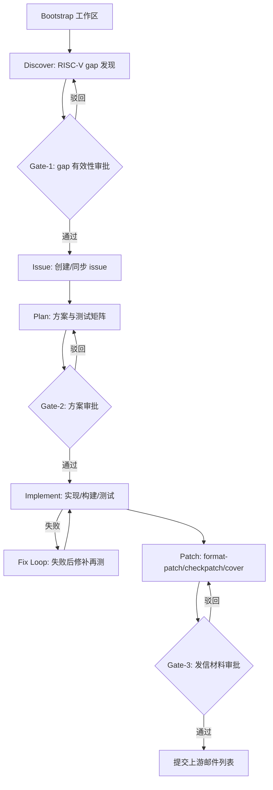

# OpenClaw Linux RISC-V 内核贡献方案

方案日期：2026-04-02  
参考文档：`openclaw-linux-riscv-contribution-report.md`

## 1. 方案定位

本方案将 OpenClaw 用于 Linux RISC-V 内核贡献的定位明确为：

- 目标：构建“可重复、可审计、带人工闸门”的半自动贡献流水线。
- 非目标：追求无人监督的全自动上游提交。
- 基本原则：小步快跑、工件先行、关键节点人工审批、成本可控。

## 2. 成功标准（90 天）

- 建立并稳定运行 `discover -> issue -> plan -> implement -> patch` 标准流水线。
- 每次运行都沉淀完整工件，满足复盘与审计。
- 至少完成 3 个小范围 RISC-V 内核议题的端到端演练。
- 至少 2 个补丁达到“可投递邮件列表”的质量门槛（通过 `checkpatch`，含 cover letter 草案和收件人建议）。
- 单次流水线成本可预测，并可通过 issue 切分与上下文外置控制在预算内。

## 3. 角色分工

| 角色 | 核心职责 | 产出 | 决策权限 |
| --- | --- | --- | --- |
| 人类维护者 | 审批 Gate、判断架构语义与上游可接受性 | Gate 结论、修订意见 | 最终批准/驳回 |
| OpenClaw 控制中枢 | 状态编排、任务调度、工件路由 | `workflow.yaml`、流程状态 | 仅流程控制 |
| Claude Code（规划） | 方案设计、测试矩阵、回滚策略、上游提交叙事 | `plans/*.md` | 方案建议 |
| Codex（实现） | 编码、构建、测试、修补、补丁打包 | `run_history/*`、`patches/*`、`logs/*` | 实现建议 |

## 4. 标准流程与 Gate 设计



### 4.1 Stage 定义（输入/输出/完成标准）

| Stage | 输入 | 输出 | 完成标准（DoD） |
| --- | --- | --- | --- |
| Bootstrap | 仓库路径、目标内核分支 | `workflow.yaml`、目录骨架 | 目录结构创建完成，元数据可追踪 |
| Discover | Linux 源码与 KVM lore 证据 | `gap_registry.yaml` | 每个 gap 都有证据链接与影响范围 |
| Issue | Gate-1 通过的 gap | `issue_map.yaml` | issue 与 gap 一一映射，优先级清晰 |
| Plan | issue、上下文约束 | `plans/<issue>.md` | 文件级改动、测试矩阵、回滚方案齐备 |
| Implement | 方案文档 | `run_history/<run>.md`、变更代码 | 编译/测试记录完整，失败闭环可追溯 |
| Patch | 通过实现验证的提交 | `patches/*.patch`、`cover-letter.md`、`checkpatch.log` | 发信材料完整且通过基础静态检查 |

### 4.2 Gate 判定标准

- Gate-1（问题定义）：
  - 是否是“真实缺口”而非架构设计差异。
  - 是否具备充分证据（代码与历史讨论）。
- Gate-2（方案质量）：
  - 是否包含最小改动路径与测试矩阵。
  - 是否评估了回滚方案与兼容性风险。
- Gate-3（上游就绪）：
  - `checkpatch` 是否通过。
  - patch 拆分、提交信息、cover letter 叙事是否符合上游习惯。

## 5. 工件规范

推荐目录（每个 issue 独立子目录，避免上下文串扰）：

```text
artifacts/
  <issue-id>/
    workflow.yaml
    gap_registry.yaml
    issue_map.yaml
    plans/
    run_history/
    patches/
    logs/
```

命名规范：

- `plans/2026-04-02-<issue-id>-design.md`
- `run_history/2026-04-02-run-<n>.md`
- `patches/0001-*.patch`
- `logs/checkpatch-2026-04-02.log`

所有工件至少包含：来源、时间、责任角色、输入版本、结论、待决事项。

## 6. 成本与上下文控制策略

### 6.1 预算策略

- 单次流水线以“一个窄问题”为上限，避免大而全任务。
- 每个 Stage 设置 token 预算，超预算必须触发人工确认。
- 长文本上下文全部外置到文件，Agent 通过摘要 + 路径回读。

### 6.2 执行策略

- 只让 Claude Code 处理高歧义规划，不承担长日志记忆。
- Codex 负责实现闭环，按“实现 -> 构建 -> 测试 -> 修补”迭代。
- 失败超过阈值（如连续 3 轮无实质收敛）自动触发人工介入。

## 7. 质量保障与风险控制

- 最小改动原则：每个 patch 只解决一个明确问题。
- 跨架构防回归：至少执行目标架构构建 + 一组对照架构编译检查。
- 上游一致性：提交前检查 patch 粒度、提交信息叙事、收件人列表合理性。
- 审计可追溯：任何结论都可回溯到对应工件与日志。

## 8. 90 天推进路线图

### Phase 1（第 1-2 周）：流水线固化

- 用 `create-agents-wizard` 固化角色与工作区模板。
- 完成目录、命名、Gate 模板标准化。
- 选定 3 个候选小问题并完成优先级排序。

### Phase 2（第 3-6 周）：小规模试运行

- 每周完成 1 个 issue 的端到端演练。
- 每次演练输出复盘：耗时、token、失败点、人工介入点。
- 根据复盘收敛 Prompt、工件模板和 Gate 判定阈值。

### Phase 3（第 7-12 周）：稳定化与上游化

- 将可复用步骤脚本化（模板生成、日志归档、检查清单）。
- 形成“可投递”补丁包生产标准。
- 输出季度总结：成功率、成本曲线、可扩展建议。

## 9. 首轮试点任务建议

优先选择低风险、高可验证议题：

- 文档/注释与代码行为不一致修复。
- `Kconfig`/`defconfig` 的小范围一致性修补。
- 边界条件检查、错误码处理、日志可观测性增强。

暂不建议首轮直接投入复杂 KVM 架构语义改造。

## 10. 执行清单（可直接落地）

1. 用 `create-agents-wizard` 生成并确认多 Agent 工作区模板。  
2. 初始化工件目录与 `workflow.yaml`。  
3. 选取 1 个窄 issue，完成 Discover 与 Gate-1。  
4. 生成 file-level 计划与测试矩阵，完成 Gate-2。  
5. 执行实现闭环并沉淀 `run_history`。  
6. 生成 patch + `checkpatch` + cover letter，完成 Gate-3。  
7. 输出复盘并更新下一轮预算与阈值。  

---

该方案重点不在“替代维护者”，而在于把高成本、高不确定性的内核贡献过程变成可分阶段验证、可持续优化的工程系统。
