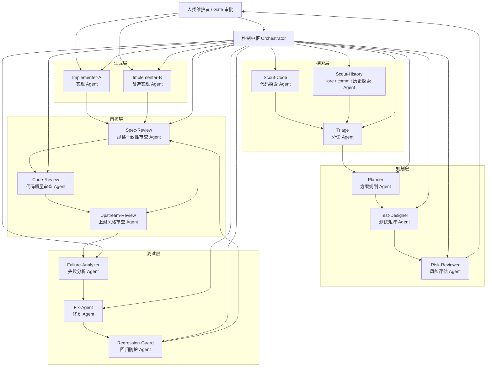
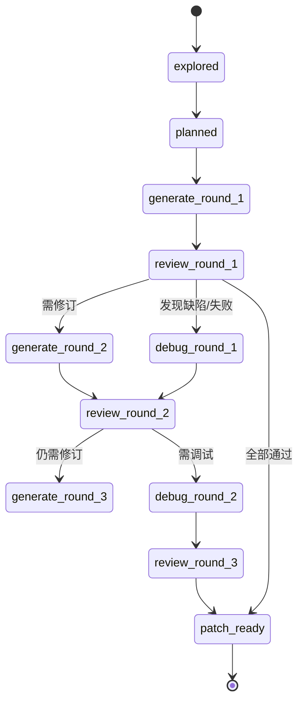
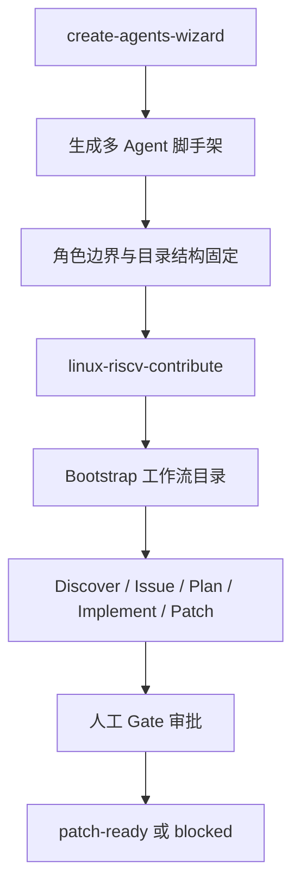

# AI 辅助内核开发多智能体工作流方案

方案日期：2026-04-14
参考文档：
- `openclaw-linux-riscv-contribution-plan.md`
- `openclaw-linux-riscv-contribution-report.md`
- `riscv-arm-x86-gap-multi-agent-workflow.md`

## 1. 方案目标

本方案面向 Linux 内核，尤其适用于 RISC-V / KVM / 跨架构差距收敛这类“高上下文、高验证成本、高审查门槛”的任务，目标是建立一条可复用的 AI 辅助研发流水线：

`探索 -> 规划 -> 生成 -> 审核 -> 调试 -> 补丁准备`

该流程采用多智能体协作架构，并强制引入以下原则：

- 多智能体分工，而不是单模型包办全流程。
- 所有关键阶段都产出文件工件，避免只存在于聊天上下文中。
- 生成与审核不是一次性动作，而是可回退、可重试、可审计的多轮迭代闭环。
- 调试阶段不是“失败后补救”，而是与生成/审核形成联动反馈回路。
- 人类维护者只在高风险决策点介入，不参与低价值重复劳动。

## 2. 核心定位

### 2.1 适用场景

- 内核子系统功能缺口收敛
- 跨架构实现对齐与差异分析
- Kconfig / defconfig / selftest / kunit / 文档一致性修复
- 小步、可验证、可回滚的内核改动
- patch-ready 级别的研发与交付准备

### 2.2 非目标

- 不追求完全无人监督地自动向上游发补丁
- 不把 AI 输出默认视为正确结论
- 不鼓励大而全任务一次跑通
- 不让单个 Agent 同时承担“方案制定 + 实现 + 自审 + 上游投递”全部职责

## 3. 总体架构



## 4. 角色设计

### 4.1 控制中枢

| 角色 | 职责 | 产出 |
| --- | --- | --- |
| Orchestrator | 维护状态机、分发任务、管理工件、控制预算与并发 | `workflow.yaml`、状态回写、任务队列 |

### 4.2 探索层

| Agent | 职责 | 输入 | 输出 |
| --- | --- | --- | --- |
| Scout-Code | 扫描内核源码、对比架构/子系统实现差距 | Linux 源码树 | `artifacts/<issue>/discover/code-evidence.md` |
| Scout-History | 搜索 lore、commit 历史、已知讨论和拒绝记录 | lore / git log / patch thread | `artifacts/<issue>/discover/history-evidence.md` |
| Triage | 去重、评分、识别伪问题、形成候选议题 | 探索证据 | `gap_registry.yaml`、`issue_map.yaml` |

### 4.3 规划层

| Agent | 职责 | 输入 | 输出 |
| --- | --- | --- | --- |
| Planner | 输出 file-level 设计方案和最小改动路径 | gap 条目、证据工件 | `plans/<issue>-design.md` |
| Test-Designer | 设计构建、kselftest、kunit、QEMU/板卡测试矩阵 | 设计方案 | `plans/<issue>-test-matrix.md` |
| Risk-Reviewer | 评估 ABI/UAPI/DT/Kconfig/回滚/兼容性风险 | 设计与测试矩阵 | `plans/<issue>-risk.md` |

### 4.4 生成层

| Agent | 职责 | 输入 | 输出 |
| --- | --- | --- | --- |
| Implementer-A | 按主方案生成代码、测试、提交草案 | 设计文档 | 代码变更、构建日志、测试日志 |
| Implementer-B | 在主方案阻塞时提供备选实现路径 | 相同输入 | 备选 patch / 备选实现说明 |

说明：生成层至少保留双实现通道，不要求每次都同时修改代码，但必须支持“主实现失败时快速切换备选方案”。

### 4.5 审核层

| Agent | 职责 | 关注点 | 输出 |
| --- | --- | --- | --- |
| Spec-Review | 审查是否满足 issue 与设计约束 | 是否偏离最小目标、是否遗漏需求 | `review/spec-round-<n>.md` |
| Code-Review | 审查实现质量 | 边界条件、命名、可维护性、并发/锁/错误路径 | `review/code-round-<n>.md` |
| Upstream-Review | 审查上游可接受性 | patch 粒度、commit message、checkpatch、maintainer 习惯 | `review/upstream-round-<n>.md` |

### 4.6 调试层

| Agent | 职责 | 输入 | 输出 |
| --- | --- | --- | --- |
| Failure-Analyzer | 解析构建/测试失败根因，区分真实 bug 与环境噪声 | 失败日志、二进制/测试产物 | `debug/failure-analysis-round-<n>.md` |
| Fix-Agent | 根据失败分析进行定向修复 | 根因报告、原代码 | 修复提交、重测结果 |
| Regression-Guard | 防止“修好一个、打坏一片” | 新旧日志与回归测试结果 | `debug/regression-round-<n>.md` |

## 5. 工作流主线


## 6. 分阶段设计

### 6.1 阶段一：探索 Explore

目标：确认“这是一个真实、可工程化、值得进入实现阶段的问题”。

输入：
- Linux 源码树
- 相关架构目录
- lore / 邮件列表讨论
- 历史提交与回退记录

动作：
- 代码探索 Agent 找差距、找 TODO/FIXME、找测试覆盖缺失
- 历史探索 Agent 搜索 lore / patch thread / 拒绝记录
- 分诊 Agent 合并证据、过滤误报、补优先级和置信度

输出工件：
- `artifacts/<issue>/discover/code-evidence.md`
- `artifacts/<issue>/discover/history-evidence.md`
- `artifacts/<issue>/gap_registry.yaml`

完成标准：
- 至少有代码证据 + 历史/讨论证据
- 能明确界定影响范围
- 能转化成一个窄问题，而不是泛化议题

人工 Gate：
- 如果是“硬件差异”而非“内核支持差距”，必须终止自动推进
- 如果已有在途 patch 或维护者明确否决历史，需要人工判断是否继续

### 6.2 阶段二：规划 Plan

目标：把问题定义转化成“可执行、可验证、可回滚”的方案。

规划内容必须覆盖：
- 根因假设与反证点
- 最小改动路径
- 文件级改动列表
- 测试矩阵
- 风险列表
- 回滚策略
- patch 切分建议

输出工件：
- `plans/<issue>-design.md`
- `plans/<issue>-test-matrix.md`
- `plans/<issue>-risk.md`

完成标准：
- 文件级修改路径清晰
- 测试矩阵可直接执行
- 风险点和不确定项被明确列出
- 允许生成 Agent 在低歧义条件下执行

人工 Gate：
- 涉及 ABI/UAPI/DT/Kconfig 用户可见行为变更时
- 语义基线不清楚，例如该追平 arm64 还是 x86_64

### 6.3 阶段三：生成 Generate

目标：根据规划产出可构建、可测试、可审查的代码与补丁草案。

生成任务要求：
- 每轮只围绕一个 issue、一条分支、一个最小目标运行
- 先补测试或明确现有失败用例，再做最小实现
- 每轮必须输出结构化运行记录

输出工件：
- `run_history/<issue>-round-<n>.md`
- `logs/build-round-<n>.log`
- `logs/test-round-<n>.log`
- `patches/<issue>/draft-round-<n>.patch`

完成标准：
- 至少通过目标架构构建
- 通过与问题相关的测试集合
- 变更可被 review agent 消费

### 6.4 阶段四：审核 Review

目标：让“规格一致性、代码质量、上游友好性”三类约束彼此独立地验证生成结果。

审核层不允许“实现者自审即通过”，必须独立运行。

审核内容：
- 是否符合最小目标而非过度设计
- 是否引入新的边界问题、竞态、错误路径缺陷
- 是否符合内核 patch 习惯与 commit 叙事要求
- 是否具备继续进入调试/补丁阶段的质量

输出工件：
- `review/spec-round-<n>.md`
- `review/code-round-<n>.md`
- `review/upstream-round-<n>.md`
- `review/decision-round-<n>.yaml`

审核判定：
- `PASS`
- `REVISE_GENERATION`
- `ENTER_DEBUG`
- `BLOCKED_REQUIRES_HUMAN`

### 6.5 阶段五：调试 Debug

目标：在“构建失败 / 测试失败 / 审核指出缺陷 / 回归出现”时形成定向修复闭环。

调试动作：
- Failure-Analyzer 先判根因，不允许直接盲修
- Fix-Agent 按根因做最小修复
- Regression-Guard 负责补回归测试与对照验证

输出工件：
- `debug/failure-analysis-round-<n>.md`
- `debug/fix-round-<n>.md`
- `debug/regression-round-<n>.md`

完成标准：
- 原失败已闭环
- 没有引入新的已知回归
- 可重新回到审核阶段

## 7. 生成-审核多轮迭代机制

这是本方案的核心。

### 7.1 迭代原则

生成不是一次成稿，审核也不是终点判决。两者之间必须允许多轮来回：

`生成 Round-N -> 审核 Round-N -> 修订生成 Round-(N+1) -> 再审核`

### 7.2 推荐状态机



### 7.3 每轮必须记录的字段

```yaml
round: 2
issue_id: GAP-2026-001
input_artifacts:
  - plans/GAP-2026-001-design.md
  - review/code-round-1.md
objective: fix null dereference in riscv kvm timer path
changes:
  - arch/riscv/kvm/timer.c
  - tools/testing/selftests/kvm/...
results:
  build: pass
  tests:
    - name: riscv-kvm-selftest
      result: fail
review_decision: ENTER_DEBUG
next_action: analyze failure log and produce minimal fix
```

### 7.4 停止条件

若满足以下任一条件，自动迭代应停止并转人工：
- 连续 3 轮生成/审核没有实质收敛
- 同一错误反复出现且根因不稳定
- 审核指出涉及架构语义争议
- 修复导致新回归数量持续增加

## 8. 审核-调试联动机制

审核与调试不能割裂。推荐规则如下：

1. 审核发现“规格偏差” -> 回到生成层修订实现。
2. 审核发现“代码质量问题但可局部修复” -> 进入调试层定向修复。
3. 审核发现“测试结论不足” -> 回到测试设计与生成层补测试。
4. 调试修复完成后，不直接通过，必须重新进入审核层。

这使得流程成为：

`生成 -> 审核 -> 调试 -> 再审核 -> 通过/再生成`

## 9. 工件目录建议

```text
artifacts/
  <issue-id>/
    workflow.yaml
    gap_registry.yaml
    issue_map.yaml
    discover/
      code-evidence.md
      history-evidence.md
    plans/
      <issue>-design.md
      <issue>-test-matrix.md
      <issue>-risk.md
    run_history/
      <issue>-round-1.md
      <issue>-round-2.md
    logs/
      build-round-1.log
      test-round-1.log
      checkpatch-round-1.log
    review/
      spec-round-1.md
      code-round-1.md
      upstream-round-1.md
      decision-round-1.yaml
    debug/
      failure-analysis-round-1.md
      fix-round-1.md
      regression-round-1.md
    patches/
      0001-*.patch
      cover-letter.md
```

要求：
- 每个 issue 独立目录，避免上下文串扰
- 所有 Agent 只读取必要摘要与路径，不重复吞整段历史上下文
- 每轮都必须落盘，便于审计和跨 Agent 接力

## 10. 质量闸门

### 10.1 自动闸门

- `make ARCH=<target> defconfig`
- `make -j$(nproc) ARCH=<target>`
- 相关 `kselftest`
- 相关 `kunit`
- 必要时 QEMU / 板卡验证
- `scripts/checkpatch.pl --strict`
- `scripts/get_maintainer.pl`

### 10.2 人工闸门

| Gate | 触发时机 | 人工关注点 |
| --- | --- | --- |
| Gate-1 | 探索结束后 | 这是不是一个真实 gap，而不是架构差异或历史已拒绝方向 |
| Gate-2 | 规划完成后 | 方案是否最小、可回滚、符合子系统语义 |
| Gate-3 | patch-ready 前 | patch 粒度、commit message、cover letter、收件人是否合规 |

## 11. 调度建议

### 11.1 推荐作业拆分

| Job | 触发方式 | Agent 组合 | 目的 |
| --- | --- | --- | --- |
| `discovery-job` | cron | Scout-Code + Scout-History + Triage | 发现新议题 |
| `planning-job` | issue_created | Planner + Test-Designer + Risk-Reviewer | 形成可执行方案 |
| `generation-job` | design_ready | Implementer-A / B | 生成代码与日志 |
| `review-job` | generation_done | Spec-Review + Code-Review + Upstream-Review | 形成审查结论 |
| `debug-job` | review_or_test_failed | Failure-Analyzer + Fix-Agent + Regression-Guard | 失败闭环 |
| `patch-job` | review_passed | Patch 相关 Agent | 生成 patch-ready 材料 |

### 11.2 并发建议

- 探索层可并行
- 规划层可并行，但同一 issue 最终要合并成单一方案基线
- 生成层对同一 issue 不建议多个 Agent 同时写同一分支；若做双实现，只能在隔离 worktree 中进行
- 审核层适合并行独立审查
- 调试层必须串行，以免多个修复相互覆盖

## 12. 落地执行细化

### 12.1 单个 issue 的标准执行节拍

建议把每个 issue 的推进固定成以下节拍，避免 agent 自由发挥过度：

1. `Explore-1`
   - 输出代码证据
   - 输出 lore / 历史证据
   - 分诊并决定是否立项
2. `Plan-1`
   - 输出 file-level 设计
   - 输出测试矩阵
   - 输出风险与回滚说明
3. `Generate-1`
   - 先补测试或选定失败用例
   - 再做最小代码改动
   - 输出构建与测试结果
4. `Review-1`
   - 规格审查
   - 代码审查
   - 上游风格审查
5. `Debug-1`
   - 仅在失败或被 review 指出缺陷时进入
6. `Generate-2 / Review-2 / Debug-2`
   - 直到进入 `patch_ready` 或 `blocked`

### 12.2 每个 Agent 的输入约束

为降低 token 消耗和上下文污染，建议每类 Agent 只读取最小必要输入：

| Agent | 允许读取 | 不应直接读取 |
| --- | --- | --- |
| Scout-Code | Linux 源码树、目标 issue 配置 | 历史全部运行日志 |
| Scout-History | lore / git 历史 / 既有 issue | 全量源码目录 |
| Planner | gap 条目、探索证据摘要 | 无关 issue 的设计文档 |
| Implementer | 当前方案、目标文件、测试矩阵、上一轮 review | 全项目全部 review 历史 |
| Reviewer | 变更 diff、方案摘要、测试结果 | 无限制原始上下文 |
| Failure-Analyzer | 失败日志、最近一轮 diff、测试矩阵 | 所有历史讨论全文 |

### 12.3 推荐的轮次预算

为了避免长流程失控，建议对单个 issue 设置轮次上限：

- 探索：最多 2 轮补证据
- 规划：最多 2 轮修订
- 生成 / 审核：默认最多 3 轮
- 调试：默认最多 2 轮
- 超限后转人工，不再让 agent 盲目迭代

### 12.4 推荐的状态字段补充

除前文状态机外，建议每个 issue 额外维护这些字段：

```yaml
issue_id: GAP-2026-001
owner_agent: implementer-a
current_stage: review
current_round: 2
confidence: high
risk_level: medium
human_gate_required: false
last_blocker: null
last_artifacts:
  design: plans/GAP-2026-001-design.md
  tests: plans/GAP-2026-001-test-matrix.md
  review: review/code-round-2.md
  debug: null
budget:
  max_generate_rounds: 3
  max_debug_rounds: 2
  max_tokens_budget: soft-limit
```

## 13. 两个关键 skill 的使用定位

根据原始材料，整个系统里有两个关键 skill：

1. `create-agents-wizard`
2. `linux-riscv-contribute`

两者不是同一层面的能力：

- `create-agents-wizard` 负责“把多 Agent 系统搭起来”。
- `linux-riscv-contribute` 负责“让搭好的多 Agent 系统去跑 Linux RISC-V 贡献流水线”。

可以把它们理解成：

- 前者偏基础设施脚手架
- 后者偏领域工作流编排

## 14. `create-agents-wizard` 的使用流程和方法

### 14.1 适用定位

该 skill 适合用在项目启动期，目标不是直接解决内核问题，而是快速生成一组角色边界清晰、目录结构统一、配置风格一致的 agents。

它最适合解决的问题：
- 需要同时建立多个角色型 agent
- 希望 agent 工作区结构标准化
- 希望后续多个 issue 都复用同一套 agent 角色定义
- 不想每次手工写大量初始化文件

### 14.2 建议创建的 agent 角色

如果目标是 Linux 内核贡献工作流，建议优先创建以下角色：

| agent id | 建议角色 | 主要职责 |
| --- | --- | --- |
| `scout-code` | 代码探索者 | 扫描源码差距、TODO/FIXME、测试缺口 |
| `scout-lore` | 历史探索者 | 搜索 lore、历史讨论、已有 patch 线索 |
| `triage` | 分诊者 | 去重、过滤伪问题、打优先级 |
| `planner` | 规划者 | 产出 file-level 方案、测试矩阵、风险说明 |
| `implementer` | 实现者 | 写代码、跑构建、执行测试 |
| `reviewer` | 审核者 | 审查规格、代码质量、上游友好性 |
| `debugger` | 调试者 | 失败分析、最小修复、回归控制 |
| `patcher` | 补丁整理者 | format-patch、cover letter、maintainer 列表 |

### 14.3 推荐使用顺序

推荐按下面顺序使用 `create-agents-wizard`：

1. 先确定 agent 数量和角色边界
2. 确定每个 agent 的 `id`
3. 为每个 agent 确定独立 workspace 或独立目录
4. 选择模式：
   - `Standard`：适合长期维护的多 agent 系统
   - `Fast mode`：适合快速试验和 MVP
5. 逐个确认要写入的文件
6. 完成后统一复查各 agent 的职责边界，避免重叠

### 14.4 Standard 与 Fast mode 的选择建议

#### Standard 模式

适用场景：
- 准备长期维护这套 agent 体系
- 角色边界需要清晰、可审计
- 需要多人协作或长期复用

标准模式通常写入以下文件：
- `AGENTS.md`
- `SOUL.md`
- `IDENTITY.md`
- `BOOTSTRAP.md`
- `USER.md`
- `STYLE.md`

建议用途：
- 正式的内核贡献自动化项目
- 多 issue 长周期演进
- 需要后续持续优化角色定义

#### Fast mode

适用场景：
- 快速验证工作流是否可跑通
- 先搭 MVP，不想一开始维护太多模板文件

快速模式通常只保留：
- `AGENTS.md`
- `SOUL.md`

建议用途：
- 第一次试跑
- 小规模 PoC
- 单一子系统实验

### 14.5 推荐的实际落地方法

建议先用 `create-agents-wizard` 只解决“角色脚手架”，不要在这个阶段塞入过多项目细节。

推荐方法：

1. 先定义抽象职责
   - 谁负责探索
   - 谁负责规划
   - 谁负责实现
   - 谁负责审核
   - 谁负责调试
2. 再定义输入/输出边界
   - 读什么文件
   - 写什么文件
   - 什么情况下交给下一个 agent
3. 最后再补领域约束
   - Linux 内核编码习惯
   - KVM / RISC-V 语义
   - patch 粒度与邮件礼仪

不要一开始就在 agent 初始化模板里写入太多具体 issue 内容，否则会让这些角色难以复用。

### 14.6 推荐的使用结果检查清单

完成 `create-agents-wizard` 后，至少检查：

- 是否每个角色都只有一个主职责
- 是否存在两个 agent 都能“拍板”的冲突设计
- 是否明确谁可以改代码、谁只能审查
- 是否所有 agent 都有明确输入/输出工件
- 是否已经为后续 `linux-riscv-contribute` 预留目录与状态文件位置

## 15. `linux-riscv-contribute` 的使用流程和方法

### 15.1 适用定位

该 skill 不是单纯的 prompt，而是一条面向 Linux RISC-V 贡献的阶段化流水线。它适合在 agent 脚手架已经搭好之后使用，用来驱动：

`bootstrap -> discover -> issue -> plan -> implement -> patch`

它的本质价值有三点：
- 定义阶段，而不是只定义一句任务目标
- 强制工件落盘，而不是依赖聊天上下文
- 保留人工闸门，而不是盲目自动发信

### 15.2 推荐前置条件

在运行该 skill 之前，建议先确认：

- 已有 Linux 源码工作树或 fork
- 已有 issue 仓库：`zcxGGmu/linux-riscv-docs`
- 已配置 `gh`、`git`、构建工具链、测试环境
- 已明确 lore 证据来源和扫描范围
- 已由 `create-agents-wizard` 或等价方法完成多 agent 角色初始化

### 15.3 推荐执行顺序

#### Step-0: Bootstrap

创建工作流目录和状态文件：
- `workflow.yaml`
- `gap_registry.yaml`
- `issue_map.yaml`
- `plans/`
- `patches/`
- `logs/`
- `run_history/`

目的：
- 先把状态与工件骨架搭好
- 让后续 agent 不必临时发明目录结构

#### Step-1: Discover

并行启动两个探索方向：
- 代码探索：对比 `arch/riscv` 与 `arch/arm64`、`arch/x86`
- 历史探索：扫描 KVM lore 与相关历史讨论

输出：
- gap 候选条目
- 证据摘要
- 优先级与置信度

这里建议必须保留 `H1 / Gate-1`：
- 判断这是不是“真 gap”
- 判断是否已有在途 patch
- 判断是否只是架构故意差异

#### Step-2: Issue 化

对通过 Gate-1 的条目：
- 在 `linux-riscv-docs` 建立 issue
- 回写 issue 编号、URL、标签、时间
- 将 issue 与 gap 条目绑定

这里的关键不是“建 issue”，而是把后续规划和实现都挂到一个稳定工件上。

#### Step-3: Plan

把 issue 连同证据包交给规划 agent，至少产出：
- file-level 设计
- 方案 A/B 与取舍
- 测试矩阵
- 风险说明
- 回滚策略
- patch 切分建议

这里建议保留 `H2 / Gate-2`：
- 涉及 ABI/UAPI/DT/Kconfig 变更时人工审核
- 方案基线不清时人工拍板

#### Step-4: Implement

实现 agent 按设计文档执行闭环：
- 选定失败测试或先补测试
- 做最小修复
- 编译
- 执行相关测试
- 失败则进入自动修复循环

必须记录：
- 修改了哪些文件
- 哪些测试通过 / 失败
- 当前 round 是否可进入 review

#### Step-5: Patch

在实现和验证通过后：
- 生成 patch series
- 运行 `checkpatch`
- 运行 `get_maintainer`
- 生成 cover letter 草案
- 准备 `git send-email` 命令

这里建议保留 `H3 / Gate-3`，且不要默认自动发送。

### 15.4 推荐的实际使用方法

推荐把 `linux-riscv-contribute` 当成“领域状态机”，而不是“万能执行器”。

更具体地说：
- 它负责规定阶段顺序
- 它负责规定必须产出的工件
- 它负责规定什么时候需要人工审批
- 它不应该替代每个 agent 的具体角色定义

也就是说，最好的用法不是：
- 直接把所有任务都丢给这个 skill

而是：
- 用它定义流程骨架
- 用具体 agent 去执行每个阶段
- 用状态文件把这些阶段串起来

### 15.5 推荐的工件检查清单

每次跑完 `linux-riscv-contribute` 的一个阶段，都应检查：

- 是否有新增工件落盘
- 是否状态字段已经回写
- 是否明确下一阶段输入是什么
- 是否记录了失败原因与阻塞条件
- 是否错误地把人工 Gate 跳过了

## 16. 两个 skill 的组合使用方法

最推荐的组合方式是：

### 第一层：先用 `create-agents-wizard` 固化多 agent 架构

目标：
- 把角色、目录、风格、边界搭好

产出：
- 多个 agent 的初始化文件
- 各角色的 workspace / 工作目录
- 统一的职责划分

### 第二层：再用 `linux-riscv-contribute` 驱动领域流程

目标：
- 把上面这些角色装配进一条内核贡献流水线

产出：
- gap backlog
- issue
- design 文档
- 实现日志
- patch-ready 工件

### 推荐顺序图



### 组合使用时的关键原则

- `create-agents-wizard` 解决“谁来做”
- `linux-riscv-contribute` 解决“按什么流程做”
- 两者之间靠工件目录和状态文件对接
- 不要让 skill 之间直接通过长聊天上下文耦合

## 17. 最小可落地版本（MVP）

第一阶段建议只支持一个窄问题闭环：

1. 用 `create-agents-wizard` 创建最少 4 个角色：探索、规划、实现、审核
2. 用 `linux-riscv-contribute` 初始化工作流目录
3. 探索：发现 1 个高置信度 gap
4. 规划：产出 1 套 file-level 方案 + 测试矩阵
5. 生成：完成至少 1 轮实现
6. 审核：完成规格审查 + 代码审查 + 上游审查
7. 调试：若失败，至少完成 1 次根因分析和修复
8. 输出：生成 patch-ready 材料，但仍保留人工最终发信

MVP 成功标准：
- 能完整经历至少 2 轮“生成-审核”迭代
- 至少经历 1 次“调试-再审核”闭环
- 两个 skill 的职责边界清晰，没有相互覆盖
- 所有关键结论都有文件工件
- 人工只在 3 个 Gate 处介入

## 18. 方案总结

这个工作流的重点不是“多开几个模型”，而是把内核开发里的核心认知活动拆成彼此制衡的职责链：

- 探索负责确认问题成立
- 规划负责把问题变成可执行任务
- 生成负责产出代码与测试结果
- 审核负责独立判断正确性与上游友好性
- 调试负责把失败转化为新的、可验证的修复动作
- `create-agents-wizard` 负责搭系统角色脚手架
- `linux-riscv-contribute` 负责驱动领域流水线

其中最关键的是：

1. 生成与审核必须多轮迭代，而不是一次通过。
2. 调试必须回流到审核，而不是修完就算结束。
3. 多 Agent 脚手架和领域工作流必须分层设计。
4. 人类只在高价值判断点介入，从而把成本集中在真正需要经验的位置。

因此，这是一条“半自动、强审计、可迭代”的 AI 辅助内核开发流水线，适合持续演进为面向内核贡献的工程系统。