# RISC-V vDSO + `clock_gettime` 相比 x86 过慢的原因分析与优化建议

> 场景：AI 算力卡运行时，RISC-V 平台的 `vDSO + clock_gettime` 明显慢于 x86，导致高频取时开销在业务侧（如 OpenMP/运行时）被放大。

## 1. 数据来源与说明

本分析基于仓库中已有的对比材料（`kernel/vdso/res/codex/high/`）：

- perf 数据：
  - `../high/perf_whisper_riscv_openmp_4.txt`
  - `../high/perf_whisper_x86_openmp_4.txt`
- 性能对比截图：
  - `../high/riscv-x86对比.jpg`
- 硬件平台配置文档：
  - `../high/硬件平台配置x86 vs risc-v.docx`

以及内核源码（用于对照 vDSO 实现）：

- `/home/zcxggmu/workspace/patch-work/linux`

## 2. 结论先行（最关键的 3 点）

1. **RISC-V 平台在 `perf` 中 `__vdso_clock_gettime` 占到了 13.27% CPU（另有 glibc 包装 `clock_gettime` 4.26%）**，说明业务侧存在高频取时，并且“每次取时”成本在 RISC-V 上明显更高。
2. **RISC-V vDSO 的硬件计数器读取路径是 `csr_read(CSR_TIME)`，并且代码注释明确指出该读操作会触发陷入到 M-mode 获取 TIME**（等价于每次取时都引入一次固件/特权态参与），这是“vDSO 仍然慢”的根因。
3. x86 的 vDSO 通常走 **TSC (`rdtsc/rdtscp`)** 快路径（纯用户态指令 + 少量标量计算），因此 `clock_gettime` 在 x86 上通常近似“免费”，在 perf 中几乎不可见。

## 3. 现象与量化对比

### 3.1 调用吞吐（calls/sec）与单次耗时估算

下图来自 `riscv-x86对比.jpg`：


将 calls/sec 换算为单次耗时（ns/call）：

| API | x86_64 calls/sec | x86_64 ns/call | RISC-V calls/sec | RISC-V ns/call | 慢多少（ns/call） |
|---|---:|---:|---:|---:|---:|
| `clock_gettime(CLOCK_MONOTONIC)` | 2,103,771 | ~475.3 | 328,056 | ~3048.3 | **~6.41x** |
| `time.time()` | 17,830,207 | ~56.1 | 4,539,203 | ~220.3 | ~3.93x |
| `time.perf_counter()` | 17,736,566 | ~56.4 | 4,249,661 | ~235.3 | ~4.17x |
| `time.monotonic()` | 17,736,566 | ~56.4 | 4,407,442 | ~226.9 | ~4.02x |

（注：这里的绝对 ns/call 受测试方法、CPU 频率、绑定核等影响；但**倍率差异**与 perf 结论一致。）

#### 图表：calls/sec 对比（来自上表）

```mermaid
xychart-beta
    title "取时 API 吞吐对比（calls/sec）"
    x-axis ["clock_gettime", "time.time", "perf_counter", "time.monotonic"]
    y-axis "calls/sec" 0 --> 20000000
    bar "x86_64" [2103771, 17830207, 17736566, 17736566]
    bar "RISC-V" [328056, 4539203, 4249661, 4407442]
```



### 3.2 平台差异（CPU/频率/内核版本）

硬件与内核版本来自 `../high/硬件平台配置x86 vs risc-v.docx`（其中 `lscpu` 与频率等信息在 docx 内以截图形式给出）。为便于阅读，这里将关键信息整理如下：

| 项目 | x86_64 | RISC-V |
|---|---|---|
| 内核版本 | `6.8.0-90-generic`（Ubuntu） | `6.12.56-0.0.0.0.riscv64`（openEuler） |
| CPU 数量 | 128 CPUs（2 sockets） | 64 CPUs |
| CPU 型号 | Intel Xeon Gold 6530 | 截图中未给出 |
| 当前频率（cpufreq） | 波动（DVFS） | 基本恒定 `2500000` kHz |

补充：docx 中还给出了 CoreMark（用于衡量“单核算力差异”量级）。按文档中的“实际运行配置”数据：

| 平台 | Single | Multi | 备注 |
|---|---:|---:|---|
| RISC-V（SG2044，64 核） | 2770.61 | 71989.72 | 文档给出的实测 |
| x86（128 核） | 5093.62 | 252003.29 | 文档给出的实测 |

由此可见 **x86 单核约 1.84×** 于该 RISC-V 平台；这解释了“部分慢”，但无法解释 `clock_gettime` **~6.4×** 的差距——说明还存在额外的“路径级别固定开销”（见第 5 节根因）。

## 4. perf 数据：热点证明“取时成本”在 RISC-V 上被放大

### 4.1 RISC-V：`__vdso_clock_gettime` 进入 Top 热点

从 `../high/perf_whisper_riscv_openmp_4.txt` 解析（cpu-clock，总样本 363K，event count 约 90,904,750,000）：

- `__vdso_clock_gettime`：**13.27%**
- `clock_gettime@@GLIBC_2.27`（glibc wrapper）：**4.26%**
- 合计（取时相关）：**17.53% CPU**

这意味着：在该 workload 中（OpenMP=4），**“取时”本身就消耗了接近 1/5 的 CPU**，并且该消耗是在用户态可见的（vDSO），对吞吐/延迟非常敏感。

### 4.2 x86：`clock_gettime` 在 perf 中几乎不可见

从 `../high/perf_whisper_x86_openmp_4.txt` 解析（cpu-clock，总样本 115K，event count 约 28,998,750,000）：

- `__vdso_clock_gettime`：0.00%（存在符号但占比为 0）
- `clock_gettime@@...`：未进入热点

#### 图表：perf 中 clock_gettime 相关 CPU 占比

```mermaid
xychart-beta
    title "perf 中 clock_gettime 相关开销占比（CPU%）"
    x-axis ["__vdso_clock_gettime", "glibc clock_gettime", "合计"]
    y-axis "CPU%" 0 --> 20
    bar "RISC-V" [13.27, 4.26, 17.53]
    bar "x86_64" [0, 0, 0]
```



## 5. 根因分析：RISC-V vDSO 读 TIME 触发 M-mode 参与（从“纯用户态”退化）

### 5.1 vDSO 的关键路径（通用逻辑）

`clock_gettime()` 走 vDSO 时，大致路径是：

1. glibc 进入 `__vdso_clock_gettime`（用户态）
2. vDSO 从 VVAR 页读取 `vdso_time_data`（seqlock/seqcount 保护）
3. **高精度时钟**还会读取硬件计数器（counter），用 `mult/shift` 换算 ns
4. 归一化得到 `(sec, nsec)` 返回

其中第 3 步的“硬件计数器读取”决定了 vDSO 的下限开销：  
**如果读取 counter 是一条用户态指令（如 x86 TSC），vDSO 就能极快；如果读取 counter 需要陷入/固件参与，vDSO 就会被拖慢。**

### 5.2 x86：TSC 快路径（无陷入）

x86 vDSO 的 counter 读取在 `/home/zcxggmu/workspace/patch-work/linux/arch/x86/include/asm/vdso/gettimeofday.h` 中：

```c
static inline u64 __arch_get_hw_counter(s32 clock_mode,
					const struct vdso_time_data *vd)
{
	if (likely(clock_mode == VDSO_CLOCKMODE_TSC))
		return (u64)rdtsc_ordered() & S64_MAX;
	...
}
```

这类 `rdtsc/rdtscp` 指令 **不需要进入内核/固件**，因此 vDSO 基本只剩下几次内存读与乘加移位，perf 中通常很难成为热点。

### 5.3 RISC-V：`csr_read(CSR_TIME)`（代码注释明确“会 trap 到 M-mode”）

RISC-V vDSO 的 counter 读取在 `/home/zcxggmu/workspace/patch-work/linux/arch/riscv/include/asm/vdso/gettimeofday.h`：

```c
static __always_inline u64 __arch_get_hw_counter(s32 clock_mode,
						 const struct vdso_time_data *vd)
{
	/*
	 * The purpose of csr_read(CSR_TIME) is to trap the system into
	 * M-mode to obtain the value of CSR_TIME. Hence, unlike other
	 * architecture, no fence instructions surround the csr_read()
	 */
	return csr_read(CSR_TIME);
}
```

这段注释非常关键：**在该实现假设下，每次 vDSO 取时都会触发一次进入 M-mode 的 trap**。  
这会带来：

- 额外的特权级切换/保存恢复开销
- 固件侧实现（OpenSBI/平台固件）如果通过慢 MMIO/序列化路径取 TIME，会进一步放大
- 在高频取时场景（OpenMP runtime、busy-wait、profiling、scheduler 等）会直接变成可见热点

因此，RISC-V “vDSO 仍然慢”并不是因为 vDSO 框架本身，而是因为 **硬件计数器读取并不是真正的“用户态快指令”**。

### 5.4 为什么会出现“TIME CSR 读需要陷入 M-mode”

在 RISC-V 特权架构中，计数器访问受 `mcounteren/scounteren/hcounteren` 等寄存器控制；另外不同平台/固件可能选择：

- 允许 S/U 直接读 `time` CSR（最佳：无 trap）
- 禁止直接读，改由 trap/模拟（常见于某些固件策略/虚拟化场景/安全隔离场景）

从 RISC-V 内核启动代码看，Linux 已在 S-mode 下对 U-mode 开启了 time 访问（`SCOUNTEREN`）：

- `/home/zcxggmu/workspace/patch-work/linux/arch/riscv/kernel/head.S` 中写入 `CSR_SCOUNTEREN = 0x2`（time bit）

因此，**如果仍然发生陷入，通常原因在于 M-mode（固件）没有放开对应能力或采用了 trap 模拟路径**——这也是为什么该问题往往需要固件/平台配合才能根治。

## 6. 针对本场景：RISC-V 内核 vDSO 的可优化点（按收益排序）

### 6.1 优先级 P0（强烈建议）：让 `CSR_TIME` 变成“真正的用户态快路径”

**目标：把 `csr_read(CSR_TIME)` 从“trap 到 M-mode”变成“单条 CSR 指令直接返回”。**

这通常需要 M-mode 固件/平台层配合（例如 OpenSBI/自研固件）：

- 确认 TIME 计数器实现方式（是否为 trap/emulation）
- 放开 S-mode/U-mode 对 time counter 的直接访问（与 `mcounteren`/delegation/虚拟化相关）
- 若处于虚拟化（H 扩展/KVM/Hypervisor），同时关注 `hcounteren` 配置

**预期收益**：对高频 `clock_gettime` 场景往往是数量级改善；至少应明显降低 `perf` 中 `__vdso_clock_gettime` 的热点占比。

> 经验判断：你当前测得 `clock_gettime(CLOCK_MONOTONIC)` 约 3.0µs/次（~3048ns），远高于“纯用户态读计数器 + 乘加移位”的正常水平；因此 P0 的收益很可能是最大的。

### 6.2 优先级 P1：用“coarse clock”规避硬件计数器读取（应用/运行时侧）

如果业务允许降低时间分辨率（例如只用于超时/退避/backoff，而非精确 profiling），可考虑：

- 使用 `CLOCK_MONOTONIC_COARSE` / `CLOCK_REALTIME_COARSE`

原因：vDSO 的 coarse 路径（见通用实现 `/home/zcxggmu/workspace/patch-work/linux/lib/vdso/gettimeofday.c`）通常**不读取硬件 counter**，只读 VVAR 基准时间即可返回，成本更低。

适用面：需要改业务/运行时（例如某些 OpenMP runtime 的等待策略、spin 次数/超时策略）。

### 6.3 优先级 P2：内核侧可考虑的“工程化兜底”方向（不如 P0，但可讨论）

> 这些属于“内核可做，但需要评估可行性/安全性/维护成本”的方向。

1. **RISC-V 引入类似 x86 pvclock 的 paravirt time（共享内存页）**  
   - 对虚拟化/固件强隔离场景尤其有效：用共享页给出稳定的 counter + mult/shift，用户态读内存即可  
   - 需要平台/固件/Hypervisor 协议支持
2. **映射一个只读的 TIME MMIO 页到用户空间（谨慎）**  
   - 若 TIME 来自 CLINT/ACLINT 的 `mtime`，理论上可以映射给用户态用 load 读取（比 trap 更便宜）  
   - 但映射 MMIO 到所有进程涉及安全模型/内存属性/缓存一致性/设备隔离，工程风险高
3. **探索使用 `rdcycle` 作为 clocksource/vDSO counter（条件苛刻）**  
   - 若该平台 `cycle` 频率恒定且跨 hart 同步，可将其作为 vDSO counter（类似 TSC）  
   - 需要严谨验证：跨核一致性、迁核时单调性、DVFS/节能影响、暂停/休眠语义等
4. **微优化（收益小）：vDSO 内部的除法/归一化路径**  
   - vDSO 内部使用 `include/vdso/math64.h` 的 `__iter_div_u64_rem()`（迭代减法）来避免引入 libgcc 除法符号  
   - 在正常情况下（ns < 1e9）循环次数为 0 或 1，影响很小  
   - 但可以作为“保险”与“极端值鲁棒性”优化点讨论（不解决本问题的主要矛盾）

## 7. 建议的验证/定位实验（用于确认根因与评估优化收益）

### 7.1 确认 `rdtime` 是否发生 trap（平台级）

在目标 RISC-V 机器上做两类验证（择一即可）：

1. **用最小化汇编循环测 `rdtime` 单次开销**（绑核、关中断影响、读周期统计）  
2. **统计异常/陷入次数**（如果 perf/PMU/trace 能统计 trap 事件最好；否则用固件日志/tracepoint 侧证）

如果 `rdtime` 触发 trap，那么它的开销通常会远高于几十纳秒量级，并与当前现象一致。

### 7.2 观察优化后 perf 的变化

对同一 workload 再跑一次 perf（尽量同参数/同绑核/同负载），观察：

- `__vdso_clock_gettime` 是否从 Top 热点显著下降
- OpenMP barrier/调度热点是否相应下降
- 总体端到端吞吐/延迟改善是否与 “17.5% CPU” 的理论上限相匹配

## 8. 附录：本次分析用到的关键文件路径

- perf：
  - `../high/perf_whisper_riscv_openmp_4.txt`
  - `../high/perf_whisper_x86_openmp_4.txt`
- 对比图：
  - `../high/riscv-x86对比.jpg`
- 平台配置：
  - `../high/硬件平台配置x86 vs risc-v.docx`
- 内核源码（vDSO 关键点）：
  - `/home/zcxggmu/workspace/patch-work/linux/arch/riscv/include/asm/vdso/gettimeofday.h`
  - `/home/zcxggmu/workspace/patch-work/linux/arch/x86/include/asm/vdso/gettimeofday.h`
  - `/home/zcxggmu/workspace/patch-work/linux/lib/vdso/gettimeofday.c`
  - `/home/zcxggmu/workspace/patch-work/linux/arch/riscv/kernel/head.S`
