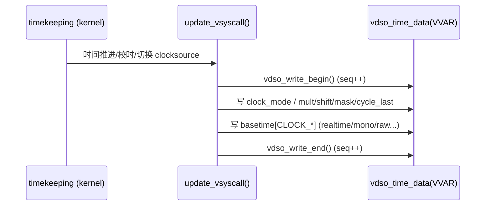

# RISC-V 内核 vDSO + `clock_gettime()` 相比 x86_64 过慢：原因分析与优化方向

> 生成时间：2026-01-11  
> 数据来源：`perf_whisper_riscv_openmp_4.txt`、`perf_whisper_x86_openmp_4.txt`、`riscv-x86对比.jpg`、`硬件平台配置x86 vs risc-v.docx`  
> 内核源码参考：`/home/zcxggmu/workspace/patch-work/linux`（kernelversion：`6.19.0-rc1`）

## 1. 现象与结论摘要

### 1.0 平台与内核信息（来自 `硬件平台配置x86 vs risc-v.docx`）

- x86_64 内核：`Linux sophgo-Rack-Server 6.8.0-90-generic #91~22.04.1-Ubuntu SMP PREEMPT_DYNAMIC Thu Nov 20 15:20:45 UTC 2 x86_64 ...`
- RISC-V 内核：`Linux openeuler-riscv64 6.12.56-0.0.0.0.riscv64 #1 SMP Fri Oct 31 03:04:33 CST 2025 riscv64 ...`
- 时间相关内核配置（docx 中 `grep -E "NO_HZ|HPET|TSC" /boot/config-$(uname -r)` 摘要）：
  - 两边都有：`CONFIG_NO_HZ_COMMON=y`、`CONFIG_NO_HZ_FULL=y`、`CONFIG_NO_HZ=y`
  - x86_64 侧显式启用：`CONFIG_X86_TSC=y`、`CONFIG_HPET_TIMER=y`、`CONFIG_HPET=y`、`CONFIG_HPET_MMAP=y` 等
  - RISC-V 侧无对应 TSC/HPET 项（与 `riscv-x86对比.jpg` 中“x86 有 TSC/HPET，RISC-V 无”一致）

### 1.1 现象（从对比图整理）

下表来自 `riscv-x86对比.jpg`（单位：calls/sec）：

| 接口 | x86_64 | RISC-V | 慢多少 |
|---|---:|---:|---:|
| `clock_gettime(CLOCK_MONOTONIC)` | 2,103,771 | 328,056 | **6.4×** |
| `time.time()` | 17,830,207 | 4,539,203 | 3.9× |
| `time.perf_counter()` | 17,736,566 | 4,249,661 | 4.2× |
| `time.monotonic()` | 17,736,566 | 4,407,442 | 4.1× |

对应的“单次调用平均耗时”（≈ `1e9 / calls_per_sec`）：

| 接口 | x86_64 (ns/call) | RISC-V (ns/call) |
|---|---:|---:|
| `clock_gettime(CLOCK_MONOTONIC)` | ~476 | ~3,048 |
| `time.time()` | ~56 | ~220 |
| `time.perf_counter()` | ~56 | ~235 |
| `time.monotonic()` | ~56 | ~227 |

图表（本目录生成）：


同时建议保留原始对比图（包含测试截图与配置摘要）：


### 1.2 perf 侧证（whisper + openmp 场景）

在 RISC-V 的 perf report 中，`__vdso_clock_gettime` 成为 Top 热点之一，而 x86_64 基本不可见：


从 `perf_whisper_riscv_openmp_4.txt` 的 Top15 可见（截取关键信息）：

- `13.27%  [vdso] __vdso_clock_gettime`
- `4.26%   libc.so.6 clock_gettime@@GLIBC_2.27`

而 `perf_whisper_x86_openmp_4.txt` 中：

- `__vdso_clock_gettime` 仅以 `0.00%` 出现（接近不可测）

这说明在你的业务（AI 卡运行 + openmp）里，**时间读取路径确实被高频调用，且在 RISC-V 上成本显著更高**。

perf 报告采样概况（来自两个文件头部）：

| 平台 | event | Samples | Event count (approx.) |
|---|---|---:|---:|
| RISC-V | `cpu-clock` | 363K | 90,904,750,000 |
| x86_64 | `cpu-clock` | 115K | 28,998,750,000 |

perf Top 开销条目对比（从两个 report 的 Top15 抽取前 8 项，便于快速定位热点）：

**RISC-V Top8（`perf_whisper_riscv_openmp_4.txt`）**

| Overhead | Shared Object | Symbol |
|---:|---|---|
| 13.27% | `[vdso]` | `__vdso_clock_gettime` |
| 11.90% | `libm.so.6` | `expf@@GLIBC_2.27` |
| 8.96% | `libgomp.so.1.0.0.xdd` | `gomp_barrier_wait_end` |
| 5.24% | `libtorch_cpu.so` | `...invoke_parallel... [clone ._omp_fn.0]` |
| 4.26% | `libc.so.6` | `clock_gettime@@GLIBC_2.27` |
| 3.97% | `libgomp.so.1.0.0.xdd` | `gomp_team_barrier_wait_end` |
| 3.92% | `libtorch_cpu.so` | `...serial_vec_log_softmax...` |
| 3.11% | `libtorch_cpu.so` | `...VectorizedLoop2d...` |

**x86_64 Top8（`perf_whisper_x86_openmp_4.txt`）**

| Overhead | Shared Object | Symbol |
|---:|---|---|
| 46.04% | `libgomp.so.1` | `0x000000000001de62` |
| 6.95% | `libgomp.so.1` | `0x000000000001de66` |
| 5.42% | `libgomp.so.1` | `0x000000000001de6d` |
| 3.13% | `libtorch_cpu.so` | `...AVX2::topk_impl_loop...` |
| 2.97% | `libgomp.so.1` | `0x000000000001e02a` |
| 1.60% | `_multiarray_umath...so` | `npy_floatbits_to_halfbits` |
| 1.39% | `[kernel.kallsyms]` | `do_user_addr_fault` |
| 1.29% | `libgomp.so.1` | `0x000000000001de60` |

> 解释：x86_64 的 Top 热点主要在 OpenMP 自旋/屏障与向量化算子上；RISC-V 则出现明显的 `__vdso_clock_gettime` 热点，符合“计时开销被放大并进入主路径”的观察。

### 1.3 最核心的根因（高置信度）

RISC-V 的 vDSO 高精度时间读取依赖读取 `CSR_TIME`（`rdtime`/`csrr time`）。在你给定内核源码里，vDSO 的实现明确写道：

- `arch/riscv/include/asm/vdso/gettimeofday.h`：`__arch_get_hw_counter()` 直接 `csr_read(CSR_TIME)`，并注明该读取的“目的”可能是 **触发陷入到 M-mode 获取 CSR_TIME**（即：硬件/固件/虚拟化环境可能对 `time` CSR 进行陷入仿真）。

一旦 `CSR_TIME` 的读取不是本地快速指令、而是陷入到 M-mode/Hypervisor 处理（SBI/HS 模式），那么 vDSO 里“看似用户态的函数”就会变成“**每次调用都要陷入固件/虚拟化层**”，其代价通常会达到微秒级，这与 `~3,048ns/call` 的量级非常吻合。

> 这也解释了一个容易困惑的现象：perf 报告里热点看起来仍在 `[vdso] __vdso_clock_gettime`，但实际上“消耗的时间可能发生在 M-mode/Hypervisor”，不一定以 Linux 内核函数符号呈现。

## 2. vDSO `clock_gettime()` 关键路径：RISC-V vs x86_64

### 2.0 原理图：vDSO 的“读 vvar + 读计数器 + 换算”模型（通用）

```mermaid
flowchart LR
  A[userspace: clock_gettime()] --> B[glibc: 解析 clockid / 走 vDSO]
  B --> C[[vDSO: __vdso_clock_gettime]]
  C --> D[读 VVAR: vdso_time_data / basetime / mult/shift]
  C --> E[__arch_get_hw_counter()<br/>读硬件计数器]
  D --> F[换算: delta*mult + base >> shift]
  E --> F
  F --> G[规范化: sec + ns -> timespec]
  G --> H[返回到 glibc / app]
  C -. fast path 不可用 .-> I[fall back: syscall/ecall]
  I --> J[kernel: timekeeping / clocksource]
  J --> H
```

### 2.1 Linux vDSO 读时间的通用算法（与架构无关的主体）

内核源码：`lib/vdso/gettimeofday.c`

核心逻辑（简化）：

1. 读取 vvar 页（`vdso_time_data`）中对应 clock 的 `seq`（类似 seqlock），保证一致性。
2. 调用 `__arch_get_hw_counter(clock_mode, vd)` 读取“硬件计数器”。
3. 用 `mult/shift` 将计数器增量换算为 ns，并与 `basetime` 合成最终的 `timespec`。
4. 若 `seq` 发生变化则重试。

因此，单次调用的成本主要来自：

- `__arch_get_hw_counter()` 的代价
- 内存屏障/一致性读（`smp_rmb()` 等）
- 换算数学（乘法 + 位移，少量分支）
- 少量重试（在 timekeeper 更新窗口撞上时）

### 2.2 RISC-V：`CSR_TIME` 读硬件计数器

内核源码：`arch/riscv/include/asm/vdso/gettimeofday.h`

- `__arch_get_hw_counter()`：`return csr_read(CSR_TIME);`

风险点：

- `CSR_TIME` 读取若由固件/虚拟化“陷入仿真”，则 **每次 vDSO 调用都要陷入**，成本从“几十纳秒”升级到“几微秒”。

### 2.3 x86_64：`RDTSC` / pvclock / hvclock 等

内核源码：`arch/x86/include/asm/vdso/gettimeofday.h`

典型情况（物理机）：

- `__arch_get_hw_counter()`：读取 `TSC`（`rdtsc_ordered()`），这是用户态可直接执行的指令，延迟通常为几十个 cycle。
- x86 还有 paravirt/hyperv 的 vclock（共享页方式），避免陷入。

此外，x86 的内存模型更强，vDSO 读 `seq` 的屏障成本更低：

- x86：`arch/x86/include/asm/barrier.h` 中 `__smp_rmb()` 退化为编译器屏障（`barrier()`）
- RISC-V：`arch/riscv/include/asm/barrier.h` 中 `__smp_rmb()` 是 `RISCV_FENCE(r, r)`（真实 `fence` 指令）

虽然 `fence` 本身未必造成“6×”，但在高频调用下会叠加放大差距。

## 3. 为什么 RISC-V 的 `__vdso_clock_gettime` 会在业务里变成热点

基于你的 perf 与对比图，可以把“慢”的成分拆为两类：

### 3.1 固件/虚拟化陷入（最可能、最致命）

证据链：

- `arch/riscv/include/asm/vdso/gettimeofday.h` 的注释直接提示 `csr_read(CSR_TIME)` 可能用于“trap 到 M-mode 获取 CSR_TIME”
- 微基准显示 `clock_gettime(CLOCK_MONOTONIC)` 达到 **微秒级**（~3.0us）而不是“几百 ns”
- perf 中热点集中在 vDSO 函数本身，而不是 Linux 内核 syscall 路径（`syscall` 总占比非常低）

典型触发场景：

- 机器没有原生实现可直接读取的 `time` CSR（或被设计为陷入仿真）
- 运行在虚拟化环境中，`time` CSR 被 hypervisor 捕获（HS 模式）
- SBI/固件对时间 CSR 的实现路径过长（锁、MMIO、IPI、串行化等）

### 3.2 架构内存模型差异带来的屏障与重试（次要，但可观）

即便不存在 M-mode/Hypervisor trap，RISC-V 相对 x86 仍会更慢：

- vDSO 读 seqlock 的 `smp_rmb()` 在 RISC-V 上是 `fence`，x86 上近似 0 成本
- `__vdso_clock_gettime` 中可能存在重试（与 timekeeper 更新频率、NO_HZ、tick 行为、CPU 迁移有关）

这部分通常体现为 **~1.x～2.x** 的差距，更难单独解释你图中 `6.4×` 的量级，但会在“trap 已经很贵”时进一步放大。

### 3.3 时钟源能力差异（“x86 有 TSC，RISC-V 没有同级替代品”）

`riscv-x86对比.jpg` 也指出：

- x86：TSC/HPET 等硬件计时资源完善
- RISC-V：对应项缺失（或至少在该平台上未启用）

严格讲，RISC-V 也有 `cycle/time/instret` 类 CSR，但是否“本地快速可读、跨核同步、频率稳定、可被 vDSO 安全使用”取决于 CPU/SoC/固件实现质量。

## 4. 针对当前场景：RISC-V 内核 vDSO 可能的优化点（按收益/风险排序）

> 重点说明：如果 `CSR_TIME` 的读取本身会陷入到 M-mode/Hypervisor，那么 **仅靠 Linux 内核里“改几行 vDSO 代码”无法达到 x86 的量级**。最大的收益来自“让用户态读计数器不再陷入”。

### 4.1（最大收益）让 `CSR_TIME` 成为“真·用户态快速可读”

目标：把 `csr_read(CSR_TIME)` 从“陷入仿真”变成“本地寄存器读”或“极短路径”。

落地检查清单（建议你在 RISC-V 机器上验证）：

1. 确认 `SCOUNTEREN` 是否已开启 `time` 位  
   - 内核源码 `arch/riscv/kernel/head.S` 会写 `CSR_SCOUNTEREN = 0x2`（time）  
   - 若实际系统被某层复位/限制，需要排查固件/bootloader
2. 确认 CPU 是否实现 `Zicntr`（或至少 `time` CSR 的原生实现）  
   - 可通过 `/proc/cpuinfo`、hwprobe（不同发行版工具不同）判断
3. 若在虚拟化环境：让 hypervisor “直通”或提供共享页计时（类似 x86 pvclock/hvclock）
4. 优化/替换 SBI 时间实现路径（减少锁/序列化/慢速 MMIO）

> 这一步属于“平台/固件/虚拟化栈”优化，但对 `vDSO clock_gettime` 的收益通常是数量级的。

### 4.2（中高收益）为 RISC-V 增加类似 x86 的“共享页 paravirt 时钟源”（避免陷入）

x86 在虚拟化场景能做到快，关键点是：**不靠陷入读时间**，而是 hypervisor 提供共享内存页（pvclock/hvclock）。

RISC-V 当前内核树里：

- `arch/riscv/kernel/paravirt.c` 只实现了 steal-time（SBI STA），不解决 `clock_gettime`

可行方向：

- 为 RISC-V/KVM 设计一页只读的 vclock 数据（类似 pvclock）
- 在 `drivers/clocksource/timer-riscv.c` 中注册一个新的 clocksource，设置 `vdso_clock_mode` 为新的 VDSO mode
- 在 `arch/riscv/include/asm/vdso/clocksource.h` 增加新的 `VDSO_CLOCKMODE_*`
- 在 `arch/riscv/include/asm/vdso/gettimeofday.h` 的 `__arch_get_hw_counter()` 中根据 `clock_mode` 选择“共享页读值”而不是 `CSR_TIME`

这类方案的优势是：**即使 `time` CSR 必须陷入，也能绕开陷入**；缺点是实现量更大，需要虚拟化/固件配合。

### 4.3（中等收益，高风险）尝试用 `CSR_CYCLE`（类似“RISC-V 的 TSC”）做 vDSO 计时

前提非常苛刻：

- `cycle` 在所有 hart 上同步/单调（跨核迁移不跳变）
- 频率稳定或可精确换算（无 DVFS 或有可靠频率源）
- 用户态可直接读取且不陷入

若上述前提成立，可考虑：

- 增加 `VDSO_CLOCKMODE_RISCV_CYCLE`，`__arch_get_hw_counter()` 读 `CSR_CYCLE`
- 增加/选择一个基于 cycle 的 clocksource（或为现有 clocksource 增加 cycle 作为 VDSO 读取源）

注意：这一步如果做错，会直接导致 `clock_gettime` **不单是慢，而是“不准/倒退”**，因此必须在硬件平台上充分验证。

### 4.4（中低收益）降低 vDSO 读路径的屏障/重试成本（细节优化）

在 `lib/vdso/gettimeofday.c` 的算法框架不变的情况下，能做的通常是微调：

- 减少不必要的重试：例如确保 timekeeper 更新窗口更短、更少写 vvar（会牵涉内核 timekeeping 更新策略）
- 若硬件支持更强内存序（例如某些扩展/模式），让 `smp_rmb()` 更便宜（依赖平台能力）

这类优化很难带来“6×”量级收益，更像是在“计数器读取已很快”的前提下，把 1.3× 打磨到 1.1×。

### 4.5（应用侧缓解，往往立竿见影）

如果你当前的业务里存在“高频计时”（profiling、busy-loop 轮询、OpenMP/线程池频繁打点），在 RISC-V 平台上建议优先：

- 将非必须的高精度计时改为 `CLOCK_MONOTONIC_COARSE` / `CLOCK_REALTIME_COARSE`
- 将“每次迭代取时间”改为“批量/采样取时间”
- 若仅用于耗时统计且允许小误差，可按线程缓存 timestamp

这并不替代内核优化，但能在短周期内显著降低 `__vdso_clock_gettime` 的热点占比。

## 5. 纯软件/内核层面还能怎么优化？（回答“能不能做时间戳缓存”等）

### 5.1 先回答：vDSO 能不能“做时间戳缓存”？

**结论：内核提供的 vDSO 本体通常不适合/几乎无法做“可写的跨调用缓存”。**

原因（偏 ABI/安全/实现约束，而不是“想不想”）：

1. **vDSO text 映射通常为 `r-x`**（可执行不可写）。vDSO 代码里很难安全地维护“全局可写状态”。
2. vVAR (`vdso_time_data`) 页是内核提供的 **只读共享数据页**，它是“内核写、用户读”，用户态不能拿它当缓存写回。
3. 即使引入“额外的可写页”作为缓存（需要内核修改 vDSO 映射布局/ABI），也会带来：
   - 更复杂的并发一致性（多线程、信号、fork、vfork、跨 CPU 迁移）
   - 潜在的信息泄露/攻击面扩大（尤其在 vDSO 这种所有进程都会映射的区域）
   - 需要 glibc/运行库适配，否则收益有限

**更现实的“缓存”位置：glibc / 运行时（TLS 级缓存）或应用侧缓存。**  
例如对“频繁打点但允许小误差”的场景，在 libc 里做“每线程缓存 + 过期阈值”通常更合适：不会改内核 ABI、不会影响其他进程、并且易于按场景选择精度。

### 5.2 vDSO 其实已经在“缓存”了：basetime + cycle_last

不要把 vDSO 想成“每次都从 0 算到现在”。它的模型是：

- 内核周期性更新 `vdso_time_data`：`cycle_last`、`mult/shift`、`basetime[clock_id]`
- 用户态只需读取当前 cycles，然后只计算**相对增量**并合成时间

这就是一种“只读缓存”：把昂贵且低频的更新放到内核，把高频读取变成“读计数器 + 少量算术”。

对应内核写入路径（见 `/home/zcxggmu/workspace/patch-work/linux/kernel/time/vsyscall.c`）：



### 5.3 “纯软件”可做但收益有限的优化点（不改硬件/固件的前提）

> 如果 `CSR_TIME` 读取会陷入到 M-mode/Hypervisor，那么任何只在 Linux 内核里做的“指令级微优化”都很难逼近 x86 的量级；但仍可以做一些“更聪明的选择/更少的栅栏/更少的重试”。

#### 5.3.1 基于 CPU 特性选择更便宜的屏障（`ZTSO` 条件化）

RISC-V 若支持 `ZTSO`（更强的内存序），理论上可以将 vDSO 读 seq 的某些 `fence` 降低为更轻量的屏障（甚至仅编译器屏障），从而减少每次 `clock_gettime` 的固定开销。

内核里已有 `hwprobe` 能暴露 `ZTSO`（见 `/home/zcxggmu/workspace/patch-work/linux/arch/riscv/kernel/sys_hwprobe.c` 与 vDSO 的 `__vdso_riscv_hwprobe`，见 `/home/zcxggmu/workspace/patch-work/linux/arch/riscv/kernel/vdso/hwprobe.c`）。

注意：这是“理论可行”的方向，真正落地要非常谨慎，因为：

- vDSO 的 seqlock 正确性依赖屏障语义，错误会导致时间回退/跳变（高风险）。
- 需要对 `ZTSO` 的实际语义与当前 vDSO 读写序（`vdso_write_begin/end` + `vdso_read_begin/retry`）做严格证明/测试。

#### 5.3.2 降低重试概率（减少读 seq 撞上写 seq 的窗口）

`lib/vdso/gettimeofday.c` 的 `do_hres()` 是“读 seq -> 读 cycles -> 计算 -> retry”的结构。只要碰上内核正在更新 vVAR（seq 为奇数或 seq 变化）就会重试。

可考虑从内核侧减少更新窗口或更新频率对齐（需要结合业务与 tick/nohz 行为评估），但通常属于边际收益。

`do_hres()`（简化）调用流程图：

```mermaid
flowchart TD
  A[__vdso_clock_gettime] --> B[__cvdso_clock_gettime_common]
  B --> C{clockid 属于 HRES?}
  C -- 是 --> D[do_hres]
  C -- 否 --> E[do_coarse / do_aux / fallback]
  D --> F[读取 vc->seq (等待偶数)]
  F --> G[__arch_get_hw_counter()<br/>读硬件计数器]
  G --> H[vdso_calc_ns / vdso_set_timespec]
  H --> I{seq 是否变化?}
  I -- 否 --> J[返回 0]
  I -- 是 --> F
```

#### 5.3.3 优化 vDSO 代码生成（尺寸/分支/指令序）

这类优化更像“磨指令”：

- 减少不必要的分支与函数层级（更多 `__always_inline`、消除不必要的间接）
- 确保 vDSO 关键路径的代码布局/对齐更利于 I-cache
- 针对 RISC-V `cpu_relax()`、分支预测提示等进行微调

但如果主要成本在 `CSR_TIME` 的 trap，这些优化总体只能带来 **小幅改善**。

### 5.4 “纯软件”但可能带来数量级收益的方向：改用不陷入的计数器/时钟源（仍然不改硬件）

这类方向仍然属于“软件改动”，但本质是：**绕开会陷入的 `time` CSR**。

#### 5.4.1 在满足严格前提下，用 `CSR_CYCLE` 做 vDSO 计时

如果你的平台满足以下条件（缺一不可）：

- 用户态读 `cycle` 不陷入，且非常快；
- `cycle` 在所有 hart 上同步或至少“跨核迁移不倒退”；
- 频率稳定或可由内核可靠换算；

那么可设计一个新的 `VDSO_CLOCKMODE_RISCV_CYCLE`：

- `drivers/clocksource/*` 注册对应 clocksource，设置 `.vdso_clock_mode`
- `arch/riscv/include/asm/vdso/gettimeofday.h` 里根据 `clock_mode` 选择读 `CSR_CYCLE`
- vVAR 的 `mult/shift` 按 cycle 频率配置

风险：如果 `cycle` 不满足跨核一致性或频率稳定性，时间可能倒退或漂移，这比“慢”更不可接受。

#### 5.4.2 虚拟化场景：做“共享页 vclock”（避免陷入）

这是 x86 的 pvclock/hvclock 路径在做的事情：把时间读变成“读共享内存页”，而不是每次陷入。

RISC-V 内核当前树里已有 vDSO `__vdso_riscv_hwprobe` 和 paravirt steal-time（SBI STA），但没有直接等价于 pvclock 的 vclock。  
如果你的 AI 算力卡环境存在虚拟化层（KVM/Hypervisor），这是最推荐的软件方向之一。

## 6. 建议的进一步验证（用于把“推断”变成“定论”）

在 RISC-V 机器上做 3 个小实验，基本能把根因锁死：

1. **测量单条 `rdtime` 的平均开销**  
   - 写一个 C microbench：循环执行 `csrr time`（或编译器内联读 time CSR），统计每次耗时  
   - 若出现微秒级，几乎可以确认存在 M-mode/Hypervisor trap
2. **对比 `rdcycle` vs `rdtime` 的开销**（如果 `rdcycle` 可用）  
   - 若 `rdcycle` 明显更快，说明“陷入/慢路径”集中在 `time` CSR
3. **确认是否运行在虚拟化环境、以及 SBI 版本/实现**  
   - `dmesg | grep -i sbi`、检查 hypervisor/firmware 信息  
   - 在 KVM 场景，考虑 paravirt vclock 方案

## 7. 附：与本报告直接相关的内核源码位置（便于你快速对照）

- RISC-V vDSO 读硬件计数器：`/home/zcxggmu/workspace/patch-work/linux/arch/riscv/include/asm/vdso/gettimeofday.h`
- RISC-V 计时 clocksource 与 vDSO mode：`/home/zcxggmu/workspace/patch-work/linux/drivers/clocksource/timer-riscv.c`
- 通用 vDSO gettimeofday/clock_gettime 实现：`/home/zcxggmu/workspace/patch-work/linux/lib/vdso/gettimeofday.c`
- x86 vDSO 读硬件计数器与 pvclock：`/home/zcxggmu/workspace/patch-work/linux/arch/x86/include/asm/vdso/gettimeofday.h`
- 内存屏障差异：  
  - x86：`/home/zcxggmu/workspace/patch-work/linux/arch/x86/include/asm/barrier.h`  
  - RISC-V：`/home/zcxggmu/workspace/patch-work/linux/arch/riscv/include/asm/barrier.h`
