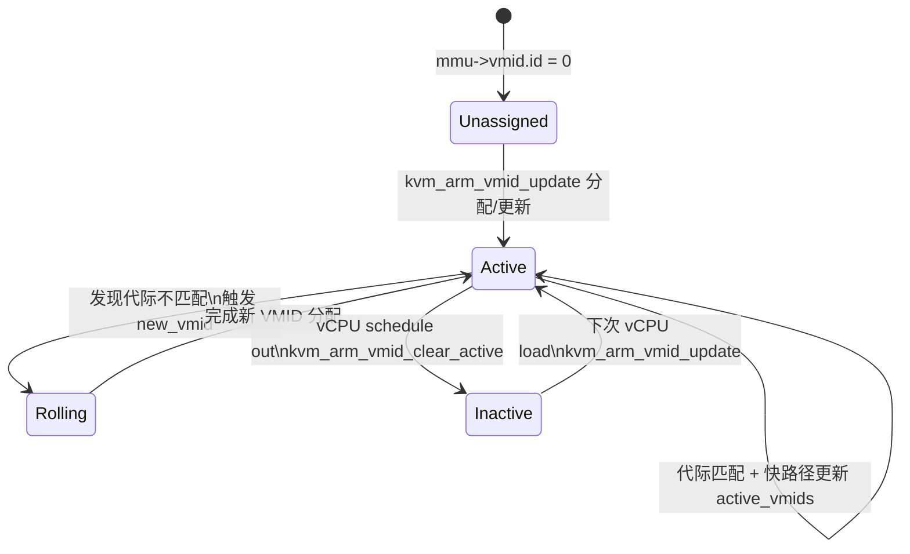
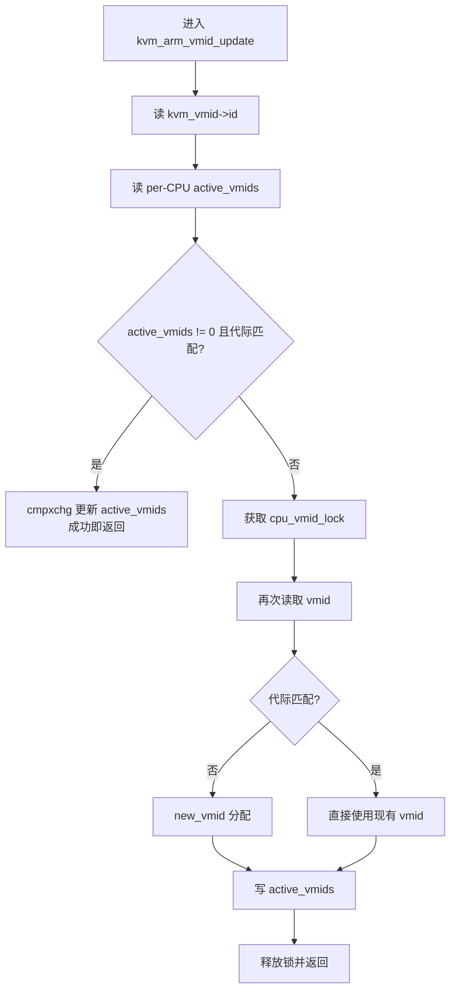
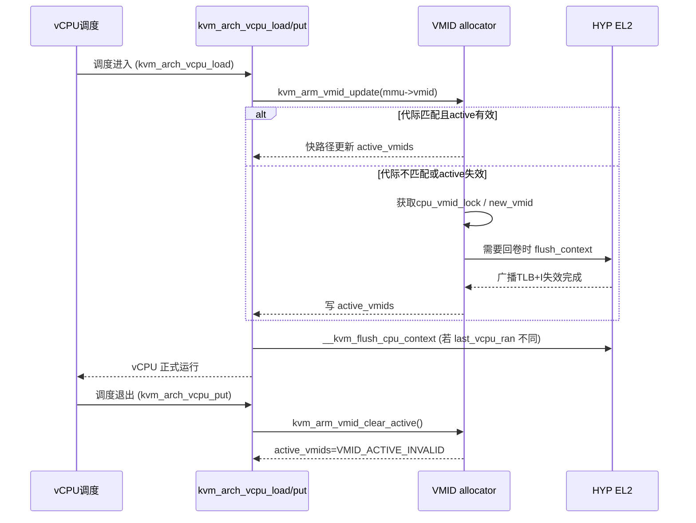

# KVM/arm64 VMID 分配器补丁系列分析（v4，2021-11-22）

> 分析对象：Shameerali Kolothum Thodi 的 VMID allocator 系列（v4，共 4 个补丁 + 封面信）。

## 1. 系列目标与背景动机

该系列引入 **基于 arm64 ASID 分配器算法的新 VMID allocator**，目标是在 VMID 代际回卷（rollover）时通过一次性全局 TLB + I-cache 广播失效，避免旧实现需要让所有 CPU 退出 guest、再逐 CPU 完成刷新与重新分配的开销。同时引入 **reserved VMID** 的概念，确保在回卷时不会因为 vCPU 尚未退出而阻塞 VMID 重新分配。整体思路是把 VMID 管理流程与 arm64 的 ASID 机制对齐，但根据 VMID 回卷更少发生的特性，选择“回卷时全局刷新”的策略。 citeturn4view0

## 2. 补丁概览（v4 0/4 ～ 4/4）

- **[0/4 Cover Letter]**：阐述新 VMID allocator 的设计动机、与 ASID allocator 的关系，以及采用全局 TLB + I-cache 广播失效替代逐 CPU 延迟刷新 / 强制退出的策略。 citeturn4view0
- **[1/4]**：新增 `arch/arm64/kvm/vmid.c`，实现完整的 VMID 分配器；增加初始化/释放与更新接口，并在 `Makefile` 中编译该文件。 citeturn5view0turn6view0turn7view0
- **[2/4]**：把 VMID 位宽暴露给 allocator 之外（`kvm_arm_vmid_bits`），以便 VTTBR 编码等路径复用；并在 `kvm_get_vttbr()` 中使用该位宽计算 VMID mask。 citeturn3view0turn8view0
- **[3/4]**：移除旧的 VMID allocator（原先分散在 `arch/arm64/kvm/arm.c`），改为使用新 allocator；在 vCPU 运行路径中调用 `kvm_arm_vmid_update()`；初始化路径把 VMID 置 0 以触发新分配。 citeturn2view0turn7view1turn8view0
- **[4/4]**：在 vCPU schedule out 时调用 `kvm_arm_vmid_clear_active()`，把当前 CPU 的 active VMID 标记为无效，避免回卷时不必要地保留无效 VMID。 citeturn2view0turn9view0

## 3. 新 VMID allocator 的核心数据结构与算法

### 3.1 数据结构与关键宏

新分配器集中在 `arch/arm64/kvm/vmid.c`，主要状态包括：

- `kvm_arm_vmid_bits`：VMID 位宽（来自硬件特征寄存器），在 init 时固定。 citeturn5view0
- `vmid_generation`：全局代际计数器（高位），用于区分回卷前后 VMID。 citeturn6view0
- `vmid_map`：位图，标记当前代际已分配的 VMID index。 citeturn6view0
- `active_vmids`（per-CPU）：当前 CPU 上活跃的 VMID，用于在回卷时保留仍在运行的 VM。 citeturn6view0
- `reserved_vmids`（per-CPU）：用于在回卷时“锁住”必要的 VMID（即便 vCPU 尚未退出）。 citeturn6view0

宏定义体现 VMID = generation + index 的编码方式，并把 VMID=0 视为保留值（不可分配）：

- `VMID_MASK` / `VMID_FIRST_VERSION`：用来分离/拼接 generation 与 index。 citeturn6view0
- `VMID_ACTIVE_INVALID`：schedule-out 时写入的无效值，避免保留不活跃 VMID。 citeturn6view0

### 3.2 flush_context：回卷时的全局刷新

`flush_context()` 在 VMID 回卷时执行：清空 `vmid_map`，遍历所有 CPU，收集 `active_vmids` 或 `reserved_vmids` 并重新置位，然后调用 `kvm_call_hyp(__kvm_flush_vm_context)` 进行 **内 shareable 域的 TLB + I-cache 广播失效**。该设计与 ASID allocator 不同，理由是 VMID 回卷相对少见，直接全局刷新更简单且避免“延迟刷新 + 强制退出”的复杂性。 citeturn6view0

### 3.3 new_vmid：分配流程（含回卷）

`new_vmid()` 的核心流程：

1. 若该 VM 以前已有 VMID：尝试把旧 index 迁移到当前 generation，并更新 `reserved_vmids`；若该 index 尚未被占用则直接复用。 citeturn6view0
2. 否则在 `vmid_map` 中分配一个新的空闲 index；如果没有空闲，触发 **generation 回卷 + flush_context()**，然后再分配。 citeturn6view0
3. 写回 `kvm_vmid->id`，并更新当前 index。 citeturn6view0

### 3.4 kvm_arm_vmid_update：快路径与同步策略

`kvm_arm_vmid_update()` 负责在 vCPU 进入 guest 之前确保 VMID 有效：

- 快路径：如果当前 CPU 的 `active_vmids` 不为 0，且 VMID 代际匹配，则尝试用 `cmpxchg` 快速更新，无需加锁。 citeturn7view0
- 慢路径：否则在 `cpu_vmid_lock` 下检查代际并可能调用 `new_vmid()`，随后更新当前 CPU 的 `active_vmids`。 citeturn7view0

该流程与 ASID allocator 的 `check_and_switch_context()` 类似，但结合了 **schedule-out 时主动清空 active_vmids** 的策略，避免在回卷时无谓保留 VMID。 citeturn7view0

### 3.5 schedule-out：清除 active VMID

新增 `kvm_arm_vmid_clear_active()`，在 vCPU 被调度退出时写入 `VMID_ACTIVE_INVALID`。这样在回卷发生时，只有仍然 active 的 VMID 才会被保留。 citeturn6view0turn9view0

## 4. 与旧实现的整合与替换（patch 3/4 + 4/4）

### 4.1 旧 allocator 移除与新接口接入

旧实现中分散在 `arch/arm64/kvm/arm.c` 的 VMID 分配逻辑被移除，vCPU 运行路径改为直接调用 `kvm_arm_vmid_update()`；该调用位于 vCPU 运行前，并在 preempt disable 保护下完成，以保证 per-CPU `active_vmids` 的一致性。 citeturn2view0turn7view1

### 4.2 VMID 初始化与 VTTBR 编码调整

- `mmu->vmid.id` 在相关初始化路径被清零，确保首次进入时走新分配流程。 citeturn7view1turn8view0
- `kvm_get_vttbr()` 不再动态读取 VMID bits，而是使用 `kvm_arm_vmid_bits` 计算 VTTBR 中 VMID mask。 citeturn3view0turn8view0

### 4.3 vCPU schedule-out 的 active VMID 处理

在 vCPU 退出时调用 `kvm_arm_vmid_clear_active()`，与新 allocator 的“只保留 active VMID”策略配套，避免 VMID 空间被长期占用。 citeturn2view0turn9view0

## 5. 行为影响与设计权衡

- **回卷开销**：回卷时通过一次性 TLB + I-cache 广播失效替代逐 CPU 延迟刷新与强制退出，代码更直接，但代价是一次全局刷新；该选择基于 VMID 回卷事件罕见。 citeturn4view0turn6view0
- **并发与一致性**：`active_vmids`/`reserved_vmids` + 代际号的组合减少了回卷时对 vCPU 退出的依赖，并通过自旋锁和原子操作保证一致性。 citeturn6view0turn7view0
- **与 ASID 算法对齐**：整体算法与 arm64 ASID allocator 结构一致，但在回卷策略上做了 VMID 特定的权衡。 citeturn4view0turn5view0

## 6. 关键流程图与状态机（完善版）

### 6.1 VMID 分配与回卷流程（new_vmid / flush_context）

```mermaid
flowchart TD
    A[进入 new_vmid] --> B{vmid != 0 ?}
    B -->|是| C[计算 newvmid = generation | old_idx]
    C --> D{reserved_vmids 中命中旧 vmid?}
    D -->|是| E[更新 reserved_vmids= newvmid 并返回]
    D -->|否| F{vmid_map 是否已占用旧 idx?}
    F -->|否| G[置位 vmid_map, 更新 kvm_vmid->id, 返回]
    F -->|是| H[寻找空闲 idx]
    B -->|否| H
    H --> I{找到空闲 idx?}
    I -->|是| J[置位 vmid_map, 更新 kvm_vmid->id, 返回]
    I -->|否| K[generation += VMID_FIRST_VERSION]
    K --> L[flush_context: 清空位图, 保留 active/reserved, 广播 TLB+I]
    L --> M[重新寻找空闲 idx (必成功)]
    M --> J
```

要点：回卷只在“位图无空闲”时触发；回卷后通过 `flush_context()` 一次性广播失效，并保留 active/reserved VMID。 citeturn6view0

### 6.2 vCPU 进入/退出与 VMID 生命周期



要点：schedule out 明确把 active_vmids 置为无效值，回卷时不会保留不再运行的 VMID。 citeturn6view0turn9view0

### 6.3 kvm_arm_vmid_update 快慢路径（并发视角）



要点：快路径避免加锁，慢路径才进入全局锁并可能触发回卷。 citeturn7view0

### 6.4 vCPU load/put 与 VMID 更新/清理时序（序列图）



要点：VMID 更新发生在 vCPU load 早期，schedule out 明确清理 active 标记；回卷只在分配不足时触发一次性广播刷新。 citeturn6view0turn7view1turn9view0

## 7. 与当前代码树的对应关系（本地代码路径）

在当前工作区中，这些变化对应到以下路径（仅列出关键文件）：

- `arch/arm64/kvm/vmid.c`：新 VMID allocator 的主体实现。
- `arch/arm64/include/asm/kvm_host.h`：对外暴露 `kvm_arm_vmid_bits`、allocator init/update/clear 接口。
- `arch/arm64/include/asm/kvm_mmu.h`：`kvm_get_vttbr()` 使用 `kvm_arm_vmid_bits` 生成 VTTBR VMID 字段。
- `arch/arm64/kvm/arm.c`：vCPU 运行与退出路径调用 `kvm_arm_vmid_update()` / `kvm_arm_vmid_clear_active()`。
- `arch/arm64/kvm/mmu.c`、`arch/arm64/kvm/hyp/nvhe/mem_protect.c`：相关初始化阶段把 `vmid.id` 置 0 以触发分配。

（以上文件对应的改动已在补丁中体现，可与补丁对照查看。）

## 8. 小结

该系列用“ASID 风格”的 VMID allocator 替换原有分配逻辑，通过代际 + bitmap + per-CPU active/reserved 的组合，实现了：

- 回卷时只需一次全局广播失效，不再依赖强制 vCPU 退出；
- 活跃 VMID 才会被保留，减少 VMID 空间占用；
- 分配流程更接近 arm64 ASID 的成熟做法，便于维护与理解。

整体上是一次 **VMID 管理策略的体系化重构**，兼顾性能与可维护性。
