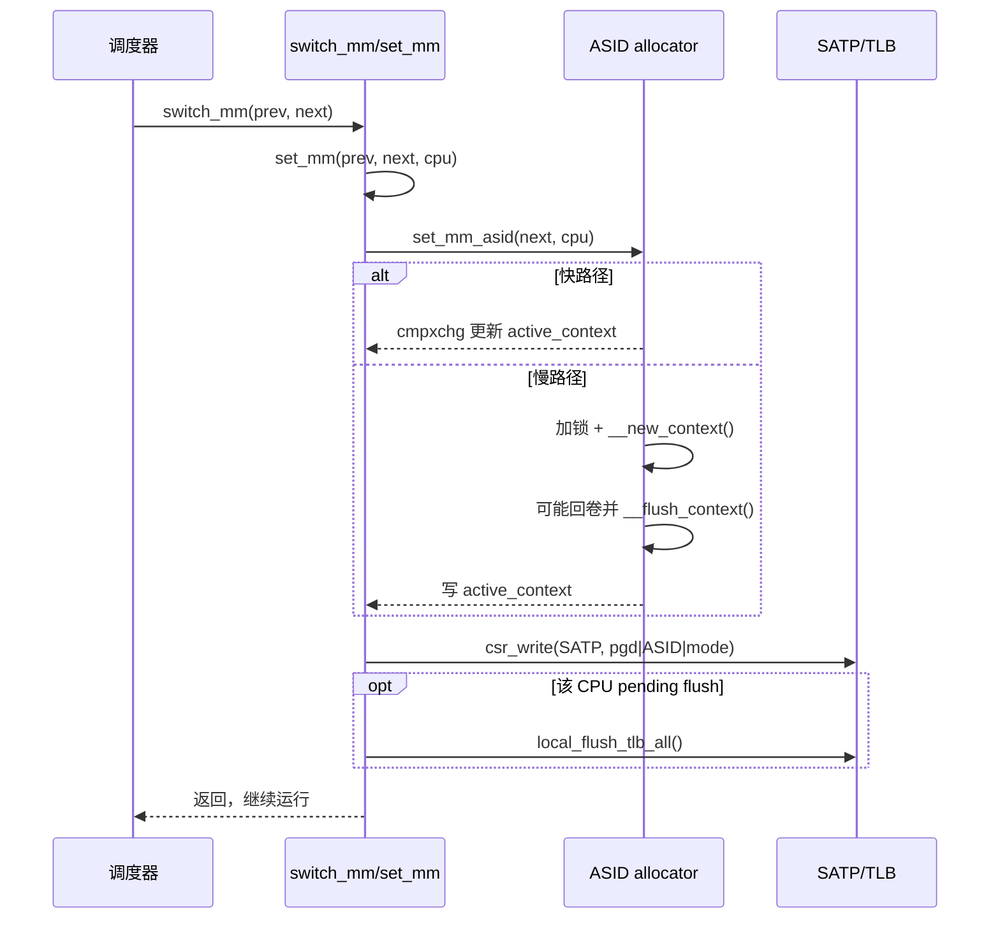
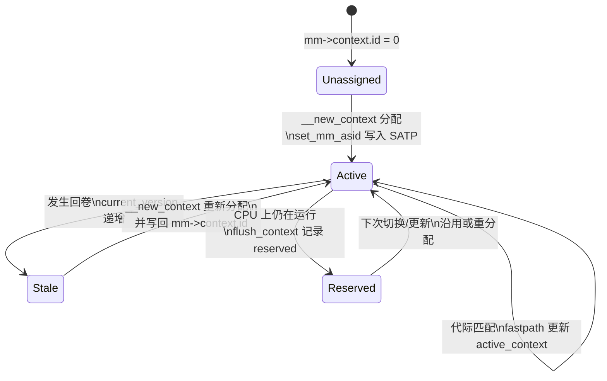

# RISC-V ASID 分配器代码逻辑分析

> 目标：分析 RISC-V Linux 的 ASID 分配器实现逻辑与关键路径（基于 2021-02-03 的补丁引入与当前代码树）。
> 参考补丁：Anup Patel《RISC-V: Implement ASID allocator》（v5）。

## 1. 背景与动机

在该补丁引入 ASID 分配器之前，RISC-V 内核在 **每次 `switch_mm()` 都进行本地 TLB 全量刷新**。这会导致频繁的页表重走，性能显著受损。补丁引入 ASID allocator，把硬件有限的 ASID 抽象成逻辑 **CONTEXTID = VERSION | ASID**，用版本号扩展可用空间，从而减少 TLB 刷新频率、提升性能。补丁说明中给出：ASID 位宽通过写 SATP 的 ASID 位并读回得到；ASID 用尽时提升版本并触发全局刷新。 

（说明：当前代码树中该逻辑已经落地，并在细节上有少量后续调整。）

## 2. 核心概念与数据结构

### 2.1 CONTEXTID 编码

- `mm->context.id` 保存 CONTEXTID。
- 低位：硬件 ASID；高位：版本号（version）。
- 相关宏在 `arch/riscv/include/asm/mmu.h`：
  - `cntx2asid(cntx)`：取 ASID
  - `cntx2version(cntx)`：取 version

### 2.2 全局与 per-CPU 状态

在 `arch/riscv/mm/context.c`：

- **静态开关**：`use_asid_allocator`（static key），用于按硬件能力决定是否启用 ASID allocator。
- **ASID 规模**：`num_asids`（可用 ASID 数），由硬件 ASID 位宽计算。
- **版本号**：`current_version`（`atomic_long_t`），version 递增的全局计数。
- **全局锁**：`context_lock`，保护分配与回卷。
- **ASID 位图**：`context_asid_map`，记录当前版本已占用的 ASID。
- **pending flush**：`context_tlb_flush_pending`，记录需要在下一次切换执行 TLB 刷新的 CPU。
- **per-CPU active/reserved**：
  - `active_context`：该 CPU 最近一次活跃的 CONTEXTID。
  - `reserved_context`：用于回卷后“保留”仍可能在该 CPU 上运行的 CONTEXTID。

## 3. 启动初始化流程（`asids_init()`）

`asids_init()` 在 early_initcall 阶段运行，主要流程如下：

1. **探测硬件 ASID 位宽**：
   - 把 SATP 的 ASID 位全部置 1，再读回；读回结果的最高位位置即 ASID 位数。
   - 由于写入过程会污染本 hart 的 TLB，因此会紧接一次 `local_flush_tlb_all()`。
2. **计算 `num_asids = 1 << asid_bits`**。
3. **是否启用 allocator**：若 `num_asids > 2 * num_possible_cpus()` 才启用。
4. **初始化版本与位图**：设置 `current_version`，分配 `context_asid_map`，并把 ASID #0 标记为已占用。
5. **启用 static key**：`static_branch_enable(&use_asid_allocator)`。

启用条件是“ASID 数量至少是 CPU 数的两倍”，避免 ASID 太少导致频繁回卷。 

## 4. 分配与回卷算法

### 4.1 `__new_context()`：分配新 CONTEXTID

伪代码逻辑：

```
if (mm->context.id != 0):
    newcntx = current_version | old_asid
    if (old_asid in reserved_context set):
        return newcntx
    if (old_asid not used in bitmap):
        mark used; return newcntx

asid = find_free_asid(bitmap)
if (asid not found):
    current_version += VERSION_STRIDE
    __flush_context()
    asid = find_free_asid(bitmap)   // 必然成功
mark used; return (asid | current_version)
```

关键点：
- 若旧 CONTEXT 在回卷时仍为 active/reserved，则直接保留其 ASID，避免不必要的重新分配。
- ASID 用尽时才触发版本回卷与全局刷新。

### 4.2 `__flush_context()`：版本回卷与延迟刷新

核心操作：

- 清空 ASID 位图。
- 遍历所有 CPU：
  - `active_context` 原子交换为 0；
  - 如果结果为 0，使用 `reserved_context`（说明 CPU 可能仍在运行旧 context）；
  - 将该 ASID 标记为已占用，并更新 `reserved_context`。
- 标记 ASID#0 已占用（启动使用）。
- `cpumask_setall(context_tlb_flush_pending)`：标记所有 CPU 需要在下一次切换时刷新 TLB。

这体现了 **延迟 TLB flush** 策略：回卷时不立即 IPI 远端刷 TLB，而是等每个 CPU 下次 `switch_mm` 时本地刷新。

## 5. 切换路径：`set_mm_asid()` / `set_mm_noasid()` / `switch_mm()`

### 5.1 `set_mm_asid()`（启用 ASID allocator）

逻辑分为快路径与慢路径：

- **快路径**：
  - 当前 CPU 的 `active_context` 非 0，且 `mm->context.id` 的 version 与 `current_version` 匹配。
  - 通过 `cmpxchg` 直接更新 `active_context`，避免获取全局锁。
- **慢路径**：
  - 获取 `context_lock`。
  - 若 `mm->context.id` 的 version 不匹配，调用 `__new_context()` 分配新 CONTEXTID。
  - 若该 CPU 在 `context_tlb_flush_pending` 中，则设置 `need_flush_tlb`。
  - 更新 `active_context`，释放锁。

随后写入 SATP：

```
SATP = pgd_pfn | (ASID << SATP_ASID_SHIFT) | satp_mode
if (need_flush_tlb) local_flush_tlb_all();
```

### 5.2 `set_mm_noasid()`（禁用 ASID allocator）

- 直接写入 SATP，不带 ASID。
- 每次切换都做 `local_flush_tlb_all_asid(0)`，相当于全局刷新。

### 5.3 `switch_mm()` 与 `set_mm()`

- `switch_mm()` 调用 `set_mm()` 选择 ASID / no-ASID 路径。
- 当前树的 `set_mm()` 还会：
  - 在启用 ASID 时 **保留 mm_cpumask 的 CPU 轨迹**，避免因清除足迹导致远端 TLB 不被刷新（这是后续 bugfix 的结果）。

## 6. 时序图与状态机（补充）

### 6.1 `switch_mm()` 时序（启用 ASID allocator）



### 6.2 CONTEXTID 状态机（单个 mm 的视角）



要点：回卷仅在 ASID 耗尽时触发；回卷后通过 `context_tlb_flush_pending` 延迟到下次切换再本地刷新。 

## 7. 与 arm64 ASID allocator 的对比分析

### 7.1 相同点

- **版本号扩展 + 位图分配**：两者都把 ASID 拆成“版本号 + index”，通过位图管理当前版本已占用的 ASID。  
- **per-CPU active/reserved**：两者都维护 per-CPU active/reserved 集合，在回卷时保留仍在运行的上下文。  
- **快路径 + 慢路径**：都采用 `cmpxchg` 快路径避免全局锁，回卷/不匹配时进入慢路径加锁分配。  
- **延迟 TLB flush**：回卷时并不立即远端 IPI 刷新，而是记录 pending 标记，等下次上下文切换执行本地刷新。  

### 7.2 关键差异

- **ASID 位宽探测方式不同**：RISC-V 通过写 SATP ASID 位并读回探测实际位宽；arm64 通过 ID_AA64MMFR0_EL1 的 ASIDBits 特性字段确定。  
- **启用策略不同**：RISC-V 只有在 `num_asids > 2 * CPUs` 时启用 allocator，否则退化为“每次切换刷新”；arm64 始终使用 ASID allocator（若硬件支持），并通过 `WARN_ON` 检查回卷安全性。  
- **保留/固定 ASID 机制不同**：arm64 存在 pinned ASID 与 KPTI 偶/奇 ASID 约束，需预留与成对分配；RISC-V 当前实现不包含 pinned ASID 或 KPTI 配对逻辑。  
- **写入寄存器路径差异**：RISC-V 只需写 SATP（含 ASID）；arm64 需要维护 TTBR0/TTBR1，并考虑 CNP/PAN 等特性。  
- **mm_cpumask 处理差异**：RISC-V 在启用 ASID 时保留 mm 的 CPU 足迹，用于避免遗漏 TLB 刷新；arm64 不使用该策略，而是依赖 ASID 代际和 pending flush 机制。  

## 8. 并发与正确性要点

1. **回卷并发**：
   - `set_mm_asid()` 快路径使用 `cmpxchg`，若遇到回卷导致 `active_context` 被清 0，会自然退化到慢路径，借助锁同步。
2. **reserved_context**：
   - 确保回卷后仍在 CPU 上运行的旧 context 不会丢失，避免 ASID 被错误重用。
3. **延迟刷新**：
   - 回卷时只标记 `context_tlb_flush_pending`，实际 TLB flush 发生在下次上下文切换。

## 9. 性能影响与取舍

- **收益**：避免每次 `switch_mm()` 全量 flush，降低页表重走，提升多进程场景性能。
- **代价**：回卷时需要版本递增与全 CPU 延迟刷新；在 ASID 数过小的硬件上收益有限，因此通过条件 `num_asids > 2 * CPUs` 控制启用。

## 10. 代码位置索引（当前树）

- `arch/riscv/mm/context.c`：ASID allocator 主体实现
- `arch/riscv/include/asm/mmu.h`：`mm_context_t`、`cntx2asid/cntx2version` 宏
- `arch/riscv/include/asm/mmu_context.h`：`init_new_context()` 清零 `mm->context.id`
- `arch/riscv/include/asm/csr.h`：SATP ASID 位定义（`SATP_ASID_BITS/SHIFT/MASK`）

---

如需补充：我可以继续补上 **回卷与并发边界条件的案例推演** 或 **与 KVM/VMID 分配器的对比**。
