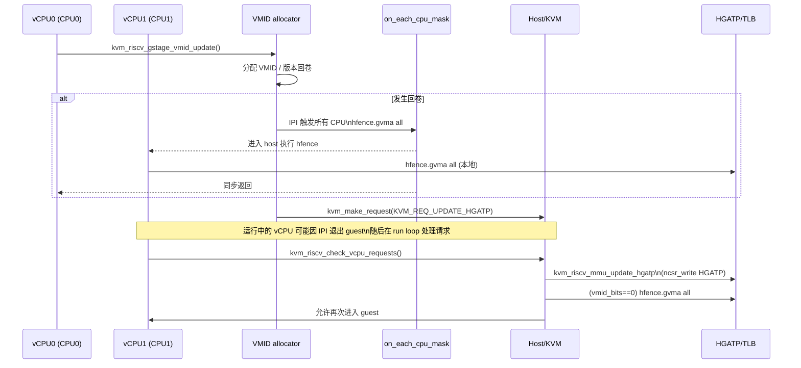

# RISC-V KVM VMID 实现代码分析

> 目标：分析 `arch/riscv/kvm/vmid.c` 的 VMID 分配与更新逻辑、并发语义与行为影响。

## 1. 总体设计概览

RISC-V KVM 的 G-stage VMID 管理是一个**全局递增版本号 + 线性分配索引**的简单分配器：

- 每个 Guest（`struct kvm`）只有 **一个 VMID**，由所有 vCPU 共享。
- VMID 空间耗尽时，通过 **版本号递增（`vmid_version`）** 触发全局重新分配。
- 分配/回卷时，会对所有 CPU 进行 **全量 G-stage TLB flush（`hfence.gvma`）**，保证旧 VMID 不再残留。
- VMID 不足或不支持时会退化到 **无 VMID（`vmid_bits=0`）** 的路径。

整体逻辑集中在 `arch/riscv/kvm/vmid.c`。

## 2. 关键全局状态

文件内的关键全局变量：

- `vmid_bits`（`__ro_after_init`）：硬件支持的 VMID 位宽。
- `vmid_version`：全局 VMID 版本号，回卷时递增。
- `vmid_next`：当前版本下的下一个 VMID 分配索引。
- `vmid_lock`：保护 VMID 分配与版本回卷的自旋锁。

这些变量用于跨所有 Guest/VM 的 VMID 分配与回卷管理。

## 3. VMID 位宽探测（`kvm_riscv_gstage_vmid_detect()`）

该函数在启动阶段探测硬件 VMID 位数：

1. 临时写入 `HGATP`，设置 `HGATP_VMID` 位段为全 1。
2. 读回 `HGATP` 并提取 VMID 位段有效位数（`fls_long`）。
3. 清零 `HGATP`。
4. 由于污染 TLB，进行一次 `kvm_riscv_local_hfence_gvma_all()`。
5. 若可用 VMID 数 `(1 << vmid_bits)` 小于 `num_possible_cpus()`，则 **禁用 VMID**（`vmid_bits=0`）。

**关键点**：VMID 支持不足时，直接退化到无 VMID 的运行模式。

## 4. VMID 初始化（`kvm_riscv_gstage_vmid_init()`）

每个 VM 在初始化时：

- `kvm->arch.vmid.vmid_version = 0`
- `kvm->arch.vmid.vmid = 0`

这意味着第一次进入运行路径时必定触发分配。

## 5. 版本检查（`kvm_riscv_gstage_vmid_ver_changed()`）

用于判断 VMID 是否失效：

- 若 `vmid_bits == 0`，则永远返回 `false`，表示不使用 VMID。
- 否则比较 `vmid->vmid_version` 与全局 `vmid_version` 是否一致。

该接口是 `kvm_riscv_gstage_vmid_update()` 的入口条件。

## 6. VMID 分配与回卷（`kvm_riscv_gstage_vmid_update()`）

这是 VMID 分配的核心逻辑：

1. **快路径**：若版本号未变化，直接返回。
2. **慢路径**：获取 `vmid_lock` 后再次检查版本号，避免并发下重复分配。
3. **回卷条件**：若 `vmid_next == 0`，说明已用尽一个版本的 VMID 空间。
   - `vmid_version++`
   - `vmid_next = 1`
   - 对所有在线 CPU 触发 `hfence.gvma` 全量刷新
4. **分配**：
   - `vmid->vmid = vmid_next`
   - `vmid_next++`
   - `vmid_next` 按 `(1 << vmid_bits) - 1` 掩码回绕
   - 更新 `vmid->vmid_version = vmid_version`
5. **解锁并通知所有 vCPU**：
   - 对所有 vCPU 发 `KVM_REQ_UPDATE_HGATP`，要求更新 HGATP（写入新 VMID）。

### 6.1 回卷触发后的全局动作

当 VMID 空间耗尽：

- 版本号递增导致所有 VM 的旧 VMID 失效；
- 通过 `on_each_cpu_mask(cpu_online_mask, ...)` 让所有 CPU 执行 `hfence.gvma`，清除旧 VMID 的 G-stage TLB；
- 运行中的 vCPU 会收到 `KVM_REQ_UPDATE_HGATP`，在下一次进入时更新 HGATP。

这种策略简单但代价是 **回卷时对所有 CPU 的全量 TLB flush**。

## 7. 迁核与本地 TLB 清理（`kvm_riscv_gstage_vmid_sanitize()`）

该函数处理“同一 VM 的不同 vCPU 在不同 CPU 上运行”的场景：

- 如果 VMID 不支持或 vCPU 没有迁移 CPU（`last_exit_cpu == cpu`），直接返回。
- 若迁移到新 CPU，则调用：
  - `kvm_riscv_local_hfence_gvma_vmid_all(vmid)`

**目的**：清除该 CPU 上可能残留的 **同 VMID 的旧 G-stage TLB**，保证一致性。

## 8. 并发与一致性要点

- `vmid_lock` 保护 `vmid_version`、`vmid_next` 与分配流程，避免并发竞争。
- 双重检查（进入前 + 拿锁后）避免重复分配。
- 回卷时强制全 CPU flush，简化跨 CPU 的一致性问题。

## 9. 设计取舍与影响

- **优点**：实现简单、逻辑清晰、回卷一致性容易保证。
- **代价**：
  - VMID 空间耗尽时，回卷代价大（全 CPU TLB flush）。
  - 没有 per-CPU active/reserved 机制，不能像 arm64 那样细粒度保留 VMID。
- **退化路径**：当 VMID 支持不足时，直接禁用 VMID，依赖更保守的 TLB 管理。

## 10. 关键路径索引

- `arch/riscv/kvm/vmid.c`
  - `kvm_riscv_gstage_vmid_detect()`：VMID 位宽探测
  - `kvm_riscv_gstage_vmid_init()`：VM 初始化
  - `kvm_riscv_gstage_vmid_update()`：VMID 分配/回卷
  - `kvm_riscv_gstage_vmid_sanitize()`：迁核时 VMID TLB 清理

## 11. 与 arm64 KVM VMID allocator 的对比

### 11.1 共同点

- **版本号 + 标识位组合**：都用“version + VMID index”的方式扩展可用空间。  
- **回卷触发**：当 VMID 空间耗尽时递增版本号并触发全局处理。  
- **进入 guest 前保证 VMID 有效**：均在 vCPU 进入前更新/校验 VMID。  

### 11.2 关键差异

- **分配器复杂度与数据结构**：  
  - RISC-V 使用全局 `vmid_next` 线性分配，不维护 bitmap，也没有 per-CPU active/reserved。  
  - arm64 使用 bitmap + per-CPU active/reserved + generation，减少回卷后无谓保留。  
- **回卷处理方式**：  
  - RISC-V 回卷时直接 `on_each_cpu_mask()` 触发全 CPU `hfence.gvma`。  
  - arm64 回卷时通过 `flush_context()` 保留 active/reserved，并广播 TLB/I-cache 失效。  
- **VMID 作用范围**：  
  - RISC-V 每 VM 一个 VMID，所有 vCPU 共享。  
  - arm64 VMID 绑定到 `kvm_s2_mmu`，在 vCPU load/put 维护活跃状态。  
- **VMID 支持不足的退化策略**：  
  - RISC-V：VMID 数量小于 CPU 数直接禁用 VMID。  
  - arm64：仍启用 allocator，并通过 warning 与回卷逻辑保证可用。  
- **更新路径**：  
  - RISC-V 通过 `KVM_REQ_UPDATE_HGATP` 请求机制更新 HGATP。  
  - arm64 在 vCPU load 更新 VMID，VTTBR 直接编码 VMID。  

## 12. 回卷/并发边界条件推演

### 12.1 VMID 空间不足（`vmid_bits == 0`）

- 探测阶段若 `(1 << vmid_bits) < num_possible_cpus()`，直接禁用 VMID。  
- 后续 `kvm_riscv_gstage_vmid_ver_changed()` 恒为 false，`kvm_riscv_gstage_vmid_update()` 早退出。  
- HGATP 更新时 `kvm_riscv_mmu_update_hgatp()` 会在写 HGATP 后执行 `hfence.gvma` 全量刷新，确保安全但代价更高。  

### 12.2 回卷发生时的并发场景

场景：VMID 空间耗尽，某 vCPU 触发回卷。  

- `vmid_lock` 保证只有一个 vCPU 执行回卷：  
  - `vmid_version++`  
  - `vmid_next = 1`  
  - `on_each_cpu_mask(cpu_online_mask, __local_hfence_gvma_all)`  
- 并发 vCPU 在二次检查时看到版本已更新并直接分配，不会重复回卷。  
- 正在 guest 中运行的 vCPU 会被 IPI 拉回 host 执行 `hfence`，随后处理 `KVM_REQ_UPDATE_HGATP`。  

### 12.3 vCPU 迁核导致的本地 TLB 残留

- VMID 在 VM 内共享，不同 vCPU 可能迁移到新 CPU。  
- `kvm_riscv_gstage_vmid_sanitize()` 通过 `last_exit_cpu` 判断迁核，仅在迁核时执行 `hfence.gvma.vmid` 全量清理，避免同 VMID 残留。  

### 12.4 高频 VM 创建/销毁引发的回卷频率

- VMID 分配为“全局线性 + 回卷”，没有回收策略。  
- 大量 VM churn 时 `vmid_next` 快速回绕，回卷频率上升，全 CPU flush 成本凸显。  

## 13. HGATP 更新与 KVM_REQ_UPDATE_HGATP 调用链追踪

### 13.1 触发点（VMID 更新）

- `kvm_riscv_gstage_vmid_update()` 在分配/更新 VMID 后：  
  - `kvm_make_request(KVM_REQ_UPDATE_HGATP, v)`（对所有 vCPU）  

### 13.2 处理点（vCPU 运行循环）

- `kvm_riscv_vcpu_run()` 循环中：  
  - 调用 `kvm_riscv_gstage_vmid_update(vcpu)`  
  - 进入 `kvm_riscv_check_vcpu_requests()`  
  - 若 `KVM_REQ_UPDATE_HGATP` 置位，则执行 `kvm_riscv_mmu_update_hgatp(vcpu)`  

### 13.3 实际写入 HGATP

- `kvm_riscv_mmu_update_hgatp()`：  
  - 组装 `hgatp = MODE | (VMID << SHIFT) | PPN`  
  - `ncsr_write(CSR_HGATP, hgatp)`  
  - 若 `vmid_bits == 0`，额外执行 `kvm_riscv_local_hfence_gvma_all()`  

### 13.4 进入 guest 前的兜底检查

- 在进入 guest 前的最终检查中，如果发现：  
  - `kvm_riscv_gstage_vmid_ver_changed()` 或  
  - 仍有 `kvm_request_pending()`  
  - 则退出 guest 并处理请求，确保 HGATP 更新完成。  

### 13.5 调用链简图

```
kvm_riscv_vcpu_run()
  -> kvm_riscv_gstage_vmid_update()
       -> kvm_make_request(KVM_REQ_UPDATE_HGATP)
  -> kvm_riscv_check_vcpu_requests()
       -> kvm_riscv_mmu_update_hgatp()
            -> ncsr_write(CSR_HGATP)
            -> (if no VMID) hfence.gvma all
```

## 14. HGATP/VMID 更新时序图（含 IPI 与 guest 退出）



要点：回卷触发的 IPI 先行清空 TLB；随后每个 vCPU 在 run loop 中处理 `KVM_REQ_UPDATE_HGATP`，完成 HGATP 更新后才会再次进入 guest。

补充说明：进入 guest 前的最终检查若发现 `kvm_riscv_gstage_vmid_ver_changed()` 或 `kvm_request_pending()`，会回到 host 处理请求，确保 HGATP/VMID 更新完成后再运行 guest。

## 15. `hfence.gvma` 语义与 KVM TLB 子系统交互

### 15.1 指令语义与使用场景

- `HFENCE.GVMA`：刷新 **G-stage（guest-physical → host-physical）** 相关的 TLB/缓存条目。  
- KVM 在 VMID 回卷、vCPU 迁核、以及无 VMID 模式下使用 `hfence.gvma` 来消除陈旧映射。  
- 在支持 **SVINVAL** 扩展的系统上，代码会用 `HINVAL_GVMA` + `SFENCE_W_INVAL/SFENCE_INVAL_IR` 来替代 `HFENCE_GVMA`，以获得更精细/高效的 invalidation。  

### 15.2 与 KVM TLB 子系统的交互路径

KVM 的 TLB 操作通过 **vCPU 请求队列** 统一调度：  

1. **发起者**（如内存映射变更、远端 TLB flush）：  
   - 通过 `kvm_riscv_hfence_gvma_vmid_gpa()` / `_all()` 等接口构造 `kvm_riscv_hfence` 数据。  
   - `make_xfence_request()` 将 hfence 任务入队到目标 vCPU，并发起 `KVM_REQ_HFENCE`。  
   - 队列满则降级为 `KVM_REQ_TLB_FLUSH`（更保守的全量刷新）。  

2. **处理者**（vCPU run loop）：  
   - `kvm_riscv_check_vcpu_requests()` 检测 `KVM_REQ_HFENCE` 或 `KVM_REQ_TLB_FLUSH`。  
   - `kvm_riscv_hfence_process()` 根据类型选择局部 `hfence`：  
     - `GVMA_*` 处理 G-stage TLB  
     - `VVMA_*` 处理 GVA/ASID 相关 TLB  
   - 若启用 NaCl，则改走 `nacl_hfence_*` 路径。  

### 15.3 与 VMID 代码的直接关联点

- **回卷**：`kvm_riscv_gstage_vmid_update()` 在版本回卷时直接 `on_each_cpu_mask()` + `hfence.gvma all`。  
- **迁核**：`kvm_riscv_gstage_vmid_sanitize()` 在 vCPU 迁核时执行 `hfence.gvma.vmid_all`。  
- **无 VMID 模式**：`kvm_riscv_mmu_update_hgatp()` 写 HGATP 后立即 `hfence.gvma all`，保证全局一致性。  

### 15.4 与 G-stage 页表操作的结合点

- `kvm_riscv_gstage_set_pte()` / `kvm_riscv_gstage_op_pte()` 修改 G-stage PTE 后触发 `gstage_tlb_flush()`。  
- `gstage_tlb_flush()` 根据 `KVM_GSTAGE_FLAGS_LOCAL` 选择：  
  - **本地**：`kvm_riscv_local_hfence_gvma_vmid_gpa()`  
  - **远端**：`kvm_riscv_hfence_gvma_vmid_gpa()` -> vCPU 请求队列 -> `KVM_REQ_HFENCE`  
- 若 vCPU hfence 队列满，fallback 为 `KVM_REQ_TLB_FLUSH`（更保守的全量刷新）。  

### 15.5 语义小结

- `hfence.gvma` 保证 G-stage 转换缓存与 VMID 绑定的条目被清理。  
- KVM 通过请求队列和 vCPU run loop 将 TLB 刷新与 vCPU 执行时序绑定，避免异步并发带来的一致性问题。  
