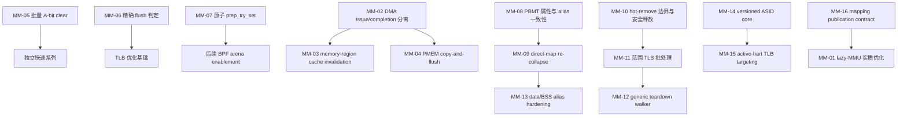

# RISC-V MMU / Memory / TLB 架构接口差距与贡献候选

## 1. 范围与结论

本文面向准备向 Linux 内核上游提交补丁的贡献者，集中分析 RISC-V 相对 arm64、x86 在 MMU、页表、TLB、缓存维护、内存属性和内存热插拔接口上的差距。结论固定在以下快照和检索窗口上：

- mainline：`d96fcfe1b7f94ac742984ae7986b94a116abff1b`，Linux 7.2-rc2，提交日期 2026-07-10。
- linux-next：`bee763d5f341b99cf472afeb508d4988f62a6ca1`，`next-20260710`。
- 邮件窗口：2025-01-01 至 2026-07-10。
- 状态口径：状态描述的是“RISC-V 对应工作”是否已经被认领。公共基础或 arm64/x86 实现已经合入，并不意味着 RISC-V 候选已经完成。

最终保留 **16 个高置信候选**，注册表 ID 为 `MM-01` 至 `MM-16`，没有改变合并关系或重新编号：

| 维度 | 分布 |
|---|---|
| 优先级 | P0 6 项，P1 9 项，P2 1 项 |
| 通用化分类 | G1 5 项，G2 3 项，G3 8 项 |
| 上游状态 | 16 项均为 `unclaimed` |
| 原始架构 | arm64 8 项，x86 1 项，x86+arm64 7 项 |

分类含义如下：

- **G1**：generic hook 已稳定，RISC-V 可以直接实现后端。
- **G2**：两个或更多架构存在重复实现，适合抽取公共 helper、walker 或状态机。
- **G3**：RISC-V 已有 fallback 或相近机制，但必须重新证明页表、TLB、缓存或内存模型语义。

总体判断：

1. **最适合立即开始的工作**是 `MM-02`、`MM-05`、`MM-06`、`MM-07` 和 `MM-10`。这些候选的调用点、对照实现和第一版边界最清晰。
2. **memory hot-remove 是一个完整补丁链**：先由 `MM-10` 修正叶子边界和释放顺序，再由 `MM-11` 合并 TLB invalidation，最后才适合推进 `MM-12` 的跨架构 walker 通用化。
3. **PBMT 工作必须作为一致性问题处理**。`MM-08` 不能只增加 `set_memory_uc()` 等符号，还必须覆盖 direct-map alias、cache maintenance 和 PFN-map 冲突跟踪。
4. **性能优化不能绕过架构证明**。`MM-06`、`MM-09`、`MM-15` 都可能减少 TLB 或页表成本，但错误实现会产生难以复现的 stale translation、属性别名或生命周期问题。
5. **G2 项应先转换 RISC-V，再推动跨架构收敛**。直接要求 arm64/x86 同时迁移，会扩大评审面并掩盖 RISC-V 自身语义问题。

## 2. 16 项候选总表

| ID | 候选 | 状态 | G | P | 总分 | 原始架构 | 第一版目标 |
|---|---|---|---:|---:|---:|---|---|
| MM-01 | RISC-V 接入 generic lazy-MMU 接口 | unclaimed | G3 | P1 | 20 | arm64 | no-op hooks、KUnit 和可延迟操作测量 |
| MM-02 | RISC-V 批量非一致 DMA 同步 | unclaimed | G1 | P0 | 26 | arm64 | CMO issue/completion 分离和 vendor callback 兼容 |
| MM-03 | 实现 `cpu_cache_invalidate_memregion()` | unclaimed | G1 | P1 | 23 | x86+arm64 | 可拒绝、可完成的物理区间 cache invalidation |
| MM-04 | 补齐 `ARCH_HAS_UACCESS_FLUSHCACHE` | unclaimed | G1 | P1 | 23 | x86+arm64 | 保守 C 实现的 copy-and-flush |
| MM-05 | 批量清除大 folio PTE accessed 位 | unclaimed | G1 | P0 | 26 | arm64 | RISC-V `test_and_clear_young_ptes()` |
| MM-06 | 实现 `pte_needs_flush()` 与 `huge_pmd_needs_flush()` | unclaimed | G3 | P0 | 25 | x86+arm64 | 按 RISC-V PTE 位定义精确 flush 判定 |
| MM-07 | 实现原子 `ptep_try_set()` | unclaimed | G3 | P0 | 25 | x86+arm64 | strict-zero cmpxchg 和最小 completion ordering |
| MM-08 | PBMT `set_memory_*` 与 PFN-map 缓存类型一致性 | unclaimed | G3 | P1 | 20 | x86+arm64 | PBMT 转换、alias 同步和最小冲突跟踪 |
| MM-09 | 重合并 pageattr 碎片化的 direct-map 大页 | unclaimed | G3 | P1 | 20 | x86 | 先实现 PMD 级安全 re-collapse |
| MM-10 | memory hot-remove 叶子边界与安全释放 | unclaimed | G3 | P0 | 25 | arm64 | preflight、detach、flush、free 三阶段 |
| MM-11 | memory hot-remove 范围 TLB 批处理 | unclaimed | G1 | P0 | 26 | arm64 | 每次 hot-remove 只执行一次范围 invalidation |
| MM-12 | 通用化 hotplug 页表 teardown walker | unclaimed | G2 | P1 | 23 | x86+arm64 | callback-driven generic teardown walker |
| MM-13 | 内核 data/BSS linear alias 只读化 | unclaimed | G3 | P2 | 15 | arm64 | 在 `mark_rodata_ro()` 阶段保护 linear alias |
| MM-14 | arm64/RISC-V versioned ASID allocator 公共核心 | unclaimed | G2 | P1 | 23 | arm64 | 先抽 allocator 核心并转换 RISC-V |
| MM-15 | 基于 active hart 的本地/远程 TLB 选择 | unclaimed | G3 | P1 | 20 | arm64 | 独立 active-hart 状态和 local-only fast path |
| MM-16 | 统一 kernel mapping synchronization 模型 | unclaimed | G2 | P1 | 23 | x86+arm64 | 先定义 publication contract，再接 RISC-V hook |

## 3. 完整候选卡片

### MM-01：RISC-V 接入 generic lazy-MMU 接口

- **状态**：`unclaimed`。generic lazy-MMU 基础和 arm64 接入已进入 mainline；RISC-V 固定基线中没有选择 `ARCH_HAS_LAZY_MMU_MODE`，也没有对应 arch hooks。
- **分类与优先级**：G3，P1。
- **六维评分**：impact 4，generality 3，readiness 3，validation 4，hardware-independence 3，acceptance 3；**总分 20**。
- **原始架构**：arm64。x86 的 paravirt lazy-MMU 机制可作补充参考，但不是直接复制对象。
- **精确路径与符号**：
  - generic：`include/linux/pgtable.h` 中的 `lazy_mmu_mode_enable()`、`lazy_mmu_mode_disable()`、`lazy_mmu_mode_pause()`、`lazy_mmu_mode_resume()`。
  - generic caller：`mm/pagewalk.c`、`walk_kernel_page_table_range()`。
  - arm64：`arch/arm64/Kconfig:ARCH_HAS_LAZY_MMU_MODE`，`arch/arm64/include/asm/pgtable.h` 中的 `arch_enter_lazy_mmu_mode()`、`arch_flush_lazy_mmu_mode()`、`arch_leave_lazy_mmu_mode()`。
  - x86：`arch/x86/Kconfig:PARAVIRT_XXL`，`arch/x86/include/asm/paravirt.h`。
  - RISC-V 落点：`arch/riscv/Kconfig`、`arch/riscv/include/asm/pgtable.h`、`arch/riscv/mm/pageattr.c`。
- **RISC-V 缺口**：RISC-V 的页表批量修改无法通过标准接口声明“架构 completion 可延后到批次结束”。现有 pageattr 路径会批量修改条目并在末尾执行 TLB flush，但尚未识别出可安全推迟的 RISC-V fence、invalid-entry-cache 处理或其他 completion 操作。
- **可移植/通用化方案**：
  1. 先接入 no-op arch hooks，证明 generic 嵌套、pause/resume 和中断边界在 RISC-V 上成立。
  2. 用 tracepoint、静态计数或 ftrace 测量 pageattr/pagewalk 中重复执行的 fence/flush。
  3. 只有确认存在真实可合并操作后，才增加 per-task pending 状态；不能照搬 arm64 的 `dsb/isb` 语义。
- **第一版系列边界**：
  1. RISC-V Kconfig 与 no-op lazy-MMU hooks。
  2. 启用并补足 `CONFIG_LAZY_MMU_MODE_KUNIT_TEST` 的 RISC-V 覆盖。
  3. 增加观测点或统计，提交结果说明当前是否存在可延迟操作。
  4. 第一版不改变所有 PTE 写入的 ordering，也不宣称性能收益。
- **阻塞**：RISC-V invalid-PTE caching；`mark_new_valid_map()` 的 publication 语义；pageattr 结束时的 flush 是否已经覆盖全部 required completion；架构层找不到可延迟操作时，该候选只能停留在接口与测试接入。
- **验证**：lazy-MMU KUnit；`debug_vm_pgtable`；模块、BPF 和 rodata/pageattr 权限切换；SMP 下反复 pause/resume；对比接入前后的 fence、TLB flush 和 page-fault 计数。
- **维护者与列表**：RISC-V MM：Paul Walmsley、Palmer Dabbelt、Albert Ou、Alexandre Ghiti，`linux-riscv@lists.infradead.org`；generic MM：Andrew Morton、David Hildenbrand、Lorenzo Stoakes，`linux-mm@kvack.org`。
- **来源**：[mainline generic lazy-MMU commit 7303ecbfe4f4](https://git.kernel.org/pub/scm/linux/kernel/git/torvalds/linux.git/commit/?id=7303ecbfe4f4)；[arm64 v6 原始系列](https://lore.kernel.org/linux-arm-kernel/20251215150323.2218608-8-kevin.brodsky@arm.com/)。

### MM-02：RISC-V 批量非一致 DMA 同步

- **状态**：`unclaimed`。issue/complete 分离接口和 arm64 后端已进入 mainline，RISC-V 没有选择 `ARCH_HAS_BATCHED_DMA_SYNC`。
- **分类与优先级**：G1，P0。
- **六维评分**：impact 5，generality 4，readiness 5，validation 4，hardware-independence 4，acceptance 4；**总分 26**。
- **原始架构**：arm64。
- **精确路径与符号**：
  - generic：`kernel/dma/direct.h`、`kernel/dma/direct.c`、`drivers/iommu/dma-iommu.c`、`kernel/dma/swiotlb.c`。
  - generic hook：`include/linux/dma-map-ops.h` 中的 `arch_sync_dma_flush()`；Kconfig `ARCH_HAS_BATCHED_DMA_SYNC`。
  - arm64：`arch/arm64/mm/dma-mapping.c`，`dcache_clean_poc_nosync()`、`dcache_inval_poc_nosync()`。
  - RISC-V：`arch/riscv/mm/dma-noncoherent.c`，`arch_dma_cache_wback()`、`arch_dma_cache_inv()`、`arch_dma_cache_wback_inv()`、`arch_sync_dma_for_cpu()`、`arch_sync_dma_for_device()`，以及 `riscv_nonstd_cache_ops`。
- **RISC-V 缺口**：scatter-gather 同步仍可能对每个 SG entry 执行带 completion 的 `ALT_CMO_OP()`。在 16、256 等多段 SG 列表上，重复 fence 会串行化整个同步过程。
- **可移植/通用化方案**：
  1. 将标准 Zicbom CBO 操作拆成 issue-only helper 和一次最终 completion。
  2. 给 `riscv_nonstd_cache_ops` 增加显式 completion callback。
  3. 旧 vendor provider 未实现 callback 时继续按同步操作处理，保证兼容而不是假定异步完成。
  4. 接入 generic `arch_sync_dma_flush()`，再选择 `ARCH_HAS_BATCHED_DMA_SYNC`。
- **第一版系列边界**：
  1. 重构标准 CMO helper，不改变单段 DMA 行为。
  2. 扩展 non-standard cache ops 并提供兼容 fallback。
  3. 接入 `arch_sync_dma_flush()` 和 Kconfig。
  4. 增加 SG 顺序测试及 fence/CBO 计数基准。
- **阻塞**：Zicbom completion 的精确定义；vendor cache provider 的同步约定；`DMA_FROM_DEVICE` 的 pre-clean/post-invalidate 顺序；SWIOTLB bounce buffer 和 IOMMU DMA 路径不能出现不同语义。
- **验证**：1、2、16、256 SG entry 的数据完整性压力；`dma_map_sg()` 和 `dma_sync_sg_for_{cpu,device}()`；SWIOTLB、direct DMA、IOMMU DMA；mock provider 检查调用顺序；真实 Zicbom/非一致 DMA 硬件统计 fence 和 CBO 数量。
- **维护者与列表**：RISC-V maintainers，`linux-riscv@lists.infradead.org`；DMA/IOMMU：Marek Szyprowski、Robin Murphy，`iommu@lists.linux.dev`。
- **来源**：[mainline commit d7eafe655b74](https://git.kernel.org/pub/scm/linux/kernel/git/torvalds/linux.git/commit/?id=d7eafe655b74)；[arm64 issue-only invalidate](https://lore.kernel.org/r/20260228221258.59918-1-21cnbao@gmail.com)；[arm64 issue-only clean](https://lore.kernel.org/r/20260228221239.59903-1-21cnbao@gmail.com)；[原始完整系列](https://lore.kernel.org/linux-arm-kernel/20260228221316.59934-1-21cnbao@gmail.com/)。

### MM-03：实现 `cpu_cache_invalidate_memregion()`

- **状态**：`unclaimed`。arm64、x86 已提供该接口，range-aware 公共接口已存在，RISC-V 固定基线无实现。
- **分类与优先级**：G1，P1。
- **六维评分**：impact 4，generality 4，readiness 4，validation 4，hardware-independence 4，acceptance 3；**总分 23**。
- **原始架构**：x86+arm64。
- **精确路径与符号**：
  - generic：`include/linux/memory_hotplug.h`，`ARCH_HAS_CPU_CACHE_INVALIDATE_MEMREGION`，`cpu_cache_invalidate_memregion()`。
  - arm64：`arch/arm64/mm/cache.S` 及 cache maintenance helpers。
  - x86：`arch/x86/mm/pat/set_memory.c:cpu_cache_invalidate_memregion()`。
  - RISC-V：`arch/riscv/mm/cache-ops.c`、`arch/riscv/include/asm/cacheflush.h`、`arch/riscv/mm/dma-noncoherent.c`、`phys_to_virt()`。
- **RISC-V 缺口**：RISC-V 已能为 DMA 执行区间 CBO，但内存区间状态切换前没有架构级 CPU cache invalidation 接口。对没有可靠 linear mapping、非系统级 coherent 或采用 vendor cache provider 的平台，不能用空实现代替。
- **可移植/通用化方案**：
  1. 定义物理区间到可维护 cache 区间的转换规则。
  2. 优先使用 Zicbom 或已注册的 non-standard cache provider 执行 clean-and-invalidate。
  3. 无法安全按物理区间维护时，返回明确错误或采用已证明的 whole-cache fallback。
  4. 跨 hart 平台必须定义发起、完成和 CPU 覆盖范围。
- **第一版系列边界**：
  1. 增加 capability 与函数声明。
  2. 实现 Zicbom 范围后端和 unaligned/overflow 检查。
  3. 接入 vendor callback，缺失能力时拒绝而非静默成功。
  4. 增加 memory offline/online 的 cache-dirty 回归。
- **阻塞**：`phys_to_virt()` 并非对所有待转换内存有效；异构 cache 层级；非标准 provider 的 completion；无 Zicbom 平台缺少可接受 fallback。
- **验证**：dirty cache line 后 offline/online 内存；DAX/CXL region transition；非页对齐和长度溢出 fault injection；多 hart 访问同一区间；验证所有必要 hart 完成 cache operation。
- **维护者与列表**：RISC-V maintainers；memory hotplug：David Hildenbrand、Oscar Salvador，`linux-mm@kvack.org`；涉及 CXL 时抄送 `linux-cxl@vger.kernel.org`。
- **来源**：[arm64 mainline enablement 4d873c5dc3ed](https://git.kernel.org/pub/scm/linux/kernel/git/torvalds/linux.git/commit/?id=4d873c5dc3ed)；[range-aware follow-up b43652d867cf](https://git.kernel.org/pub/scm/linux/kernel/git/next/linux-next.git/commit/?id=b43652d867cf2a5f31b14e3d9a320ad01fca0992)；[接口清理讨论](https://lore.kernel.org/linux-mm/686eedb25ed02_24471002e@dwillia2-xfh.jf.intel.com.notmuch/)。

### MM-04：补齐 `ARCH_HAS_UACCESS_FLUSHCACHE`

- **状态**：`unclaimed`。RISC-V 已选择 `ARCH_HAS_PMEM_API`，但没有实现 uaccess copy-and-flush contract。
- **分类与优先级**：G1，P1。
- **六维评分**：impact 4，generality 4，readiness 4，validation 4，hardware-independence 4，acceptance 3；**总分 23**。
- **原始架构**：x86+arm64。
- **精确路径与符号**：
  - generic：`_copy_from_iter_flushcache()`、`copy_mc_to_kernel()`。
  - 用户：`drivers/nvdimm/pmem.c`、`drivers/dax/super.c`、`drivers/md/dm-writecache.c`、`drivers/md/dm-pcache/`。
  - arm64：`arch/arm64/lib/uaccess_flushcache.c`。
  - x86：`arch/x86/lib/usercopy_64.c` 及 PMEM flush helpers。
  - RISC-V：`arch/riscv/lib/`、`arch/riscv/include/asm/cacheflush.h`、`arch/riscv/include/asm/uaccess.h`。
- **RISC-V 缺口**：PMEM 路径无法通过通用接口保证“从用户复制后，将目标 cache line 推进到平台持久化域所需的最小状态”。只具备 cache writeback primitive 不等于已经满足 copy-and-flush API。
- **可移植/通用化方案**：
  1. 先实现保守 C 版本，以有界 chunk 执行 copy。
  2. 对成功复制的目标范围调用现有 PMEM/Zicbom flush primitive。
  3. 明确 short copy、fault 和部分完成时的 flush 范围。
  4. 汇编或 vector 优化放到后续系列。
- **第一版系列边界**：
  1. 增加 RISC-V uaccess flushcache 实现和 Kconfig select。
  2. 接入 PMEM/DAX 调用者并保证错误传播。
  3. 增加短复制、跨页 fault 和部分 cache-line 测试。
  4. 不在该系列宣称 `copy_mc_to_kernel()` 的 machine-check recovery。
- **阻塞**：平台 persistence domain；cache clean 与持久化 ordering 的区别；真实 PMEM 硬件可用性；不能把普通 DMA cache maintenance 当成掉电持久化证明。
- **验证**：QEMU NVDIMM 功能测试；ndctl DAX tests；`dm-writecache`；短复制与 user fault；平台可支持时执行 power-fail/persistence 验证。
- **维护者与列表**：RISC-V maintainers；generic MM/DAX：Andrew Morton、David Hildenbrand，`linux-mm@kvack.org`；NVDIMM/DAX 对应维护者。
- **来源**：[RISC-V cacheflush 固定基线](https://git.kernel.org/pub/scm/linux/kernel/git/next/linux-next.git/tree/arch/riscv/include/asm/cacheflush.h?id=bee763d5f341b99cf472afeb508d4988f62a6ca1)；[arm64 uaccess flushcache 实现](https://git.kernel.org/pub/scm/linux/kernel/git/next/linux-next.git/tree/arch/arm64/lib/uaccess_flushcache.c?id=bee763d5f341b99cf472afeb508d4988f62a6ca1)。

### MM-05：批量清除大 folio PTE accessed 位

- **状态**：`unclaimed`。arm64 已实现 `test_and_clear_young_ptes()`，RISC-V 仍走 generic 单 PTE 循环。
- **分类与优先级**：G1，P0。
- **六维评分**：impact 5，generality 4，readiness 5，validation 4，hardware-independence 4，acceptance 4；**总分 26**。
- **原始架构**：arm64。
- **精确路径与符号**：
  - generic caller：`mm/vmscan.c`、`test_and_clear_young_ptes_notify()`。
  - generic fallback：`include/linux/pgtable.h:test_and_clear_young_ptes()`。
  - arm64：`arch/arm64/include/asm/pgtable.h`、`arch/arm64/mm/contpte.c`。
  - x86 对照：`arch/x86/mm/pgtable.c:ptep_test_and_clear_young()`。
  - RISC-V：`arch/riscv/include/asm/pgtable.h:ptep_test_and_clear_young()` 及 Svnapot helpers。
- **RISC-V 缺口**：MGLRU 和 large-folio reclaim 已按连续 PTE run 调用接口，但 RISC-V 每个条目都重新进入单 PTE helper，增加原子操作和函数路径成本。
- **可移植/通用化方案**：
  1. 提供 `nr == 1` fast path。
  2. 对连续 run 使用现有原子 A-bit clear primitive。
  3. 返回整个 run 是否观察到 young。
  4. 仅在当前 Svnapot 表示确实需要时增加展开或对齐处理。
  5. 此接口不负责 TLB flush。
- **第一版系列边界**：
  1. RISC-V `test_and_clear_young_ptes()`。
  2. RV32/RV64 原子性检查和 Svnapot guard。
  3. MM selftest 与原子操作计数。
- **阻塞**：software-managed A/D；Svnapot 一个语义映射由多个 PTE 表示时不能只清一部分；RV32 PTE 宽度和原子性。
- **验证**：MGLRU、`mm/page_idle.c`、large file-backed folio reclaim；Svnapot 开关组合；`debug_vm_pgtable`；比较 atomic operation 数、reclaim latency 和 refault rate。
- **维护者与列表**：RISC-V maintainers；MM reclaim：Andrew Morton、David Hildenbrand，`linux-mm@kvack.org`。
- **来源**：[arm64 linux-next 实现 9970a9a27ffc](https://git.kernel.org/pub/scm/linux/kernel/git/next/linux-next.git/commit/?id=9970a9a27ffca8b45c4a242f90adeb979fcaafb0)；[原始讨论与基准](https://lkml.kernel.org/r/7f891d42a720cc2e57862f3b79e4f774404f313c.1772778858.git.baolin.wang@linux.alibaba.com)。

### MM-06：实现 `pte_needs_flush()` 与 `huge_pmd_needs_flush()`

- **状态**：`unclaimed`。x86、arm64 有权限和 PFN 感知的实现；RISC-V 使用始终返回 true 的 generic fallback。
- **分类与优先级**：G3，P0。
- **六维评分**：impact 5，generality 4，readiness 4，validation 4，hardware-independence 4，acceptance 4；**总分 25**。
- **原始架构**：x86+arm64。
- **精确路径与符号**：
  - generic：`include/asm-generic/tlb.h` 中的 `pte_needs_flush()`、`huge_pmd_needs_flush()`。
  - caller：`mm/mprotect.c`、`mm/huge_memory.c`、`mprotect()`。
  - x86：`arch/x86/include/asm/tlbflush.h`。
  - arm64：`arch/arm64/include/asm/tlbflush.h`。
  - RISC-V：`arch/riscv/include/asm/tlbflush.h`、`arch/riscv/include/asm/pgtable-bits.h`。
- **RISC-V 缺口**：软件位变化、新映射安装到原 non-present entry 等场景仍触发 invalidation。需要根据 RISC-V 页表位和 `SFENCE.VMA` 规则区分真正影响翻译的变化。
- **可移植/通用化方案**：
  1. old entry non-present 时，在满足 invalid-entry-cache 约束后返回 false。
  2. PFN 变化必须 flush。
  3. 忽略已证明不影响硬件翻译的软件位。
  4. 对 R/W/X/U/G、PBMT、NAPOT 及 A/D 分别写明策略。
  5. PTE 与 huge PMD 使用独立决策，避免把 4K 语义直接套到大页。
- **第一版系列边界**：
  1. 增加 PTE bit 分类 helper 和注释化 truth table。
  2. 实现 `pte_needs_flush()`。
  3. 单独实现 `huge_pmd_needs_flush()`。
  4. 增加 mprotect/THP/HugeTLB 测试及 flush 计数。
- **阻塞**：Svnapot 改变映射范围；PBMT 改变同时涉及 TLB 和 cache alias；权限提升与降级的不同要求；Svinval 与传统 `SFENCE.VMA` 路径一致性。
- **验证**：4K、PMD THP、PUD THP、HugeTLB、Svnapot 的 `mprotect()`；userfaultfd write-protect；soft-dirty、NUMA balancing、迁移和 reclaim；Svinval 开关；stale translation 压力和 flush 次数比较。
- **维护者与列表**：RISC-V maintainers；generic MM，`linux-mm@kvack.org`。
- **来源**：[x86 实现](https://git.kernel.org/pub/scm/linux/kernel/git/next/linux-next.git/tree/arch/x86/include/asm/tlbflush.h?id=bee763d5f341b99cf472afeb508d4988f62a6ca1)；[arm64 实现](https://git.kernel.org/pub/scm/linux/kernel/git/next/linux-next.git/tree/arch/arm64/include/asm/tlbflush.h?id=bee763d5f341b99cf472afeb508d4988f62a6ca1)；[generic fallback](https://git.kernel.org/pub/scm/linux/kernel/git/next/linux-next.git/tree/include/asm-generic/tlb.h?id=bee763d5f341b99cf472afeb508d4988f62a6ca1)。

### MM-07：实现原子 `ptep_try_set()`

- **状态**：`unclaimed`。generic API 和 x86/arm64 backend 位于 linux-next；RISC-V 命中 false stub。
- **分类与优先级**：G3，P0。
- **六维评分**：impact 5，generality 4，readiness 4，validation 4，hardware-independence 4，acceptance 4；**总分 25**。
- **原始架构**：x86+arm64。
- **精确路径与符号**：
  - generic：`include/linux/pgtable.h:ptep_try_set()`。
  - caller：`kernel/bpf/arena.c`。
  - x86：`arch/x86/include/asm/pgtable.h`。
  - arm64：`arch/arm64/include/asm/pgtable.h`。
  - RISC-V：`arch/riscv/include/asm/pgtable.h`。
- **RISC-V 缺口**：RISC-V 无法通过该接口将 kernel PTE 原子安装到严格为空的 slot，因此 BPF arena 等 fault recovery 路径不能使用 lock-free installer。
- **可移植/通用化方案**：
  1. 对 native PTE value 执行 strict-zero `cmpxchg`。
  2. 成功后执行 RISC-V 所需的最小 publication/completion ordering。
  3. 失败时不修改旧条目并返回 false。
  4. 架构 primitive 与 BPF arena enablement 分两个系列。
- **第一版系列边界**：
  1. RISC-V 原子 primitive。
  2. KUnit 并发 installer 测试。
  3. invalid-entry-cache/refault 压力测试。
  4. 不在第一版开启完整 BPF arena fault recovery。
- **阻塞**：RV32/RV64 PTE 原子性；成功安装后是否需要本地 `SFENCE.VMA`；caller 的 refault 是否足以处理 cached invalid entry；BPF 架构 fault path 的独立前置。
- **验证**：并发线程竞争同一 empty PTE；中断关闭和 raw-spinlock 上下文；重复 invalid-entry refault；primitive 稳定后运行 BPF arena selftests。
- **维护者与列表**：RISC-V maintainers；generic MM；后续 BPF 接入抄送 BPF maintainers 和 `bpf@vger.kernel.org`。
- **来源**：[generic API 与 backend 258df8fce42f](https://git.kernel.org/pub/scm/linux/kernel/git/next/linux-next.git/commit/?id=258df8fce42fecc23cd04242de3d39f1fe836433)；[arm64 barrier 修正 71385b78dbc2](https://git.kernel.org/pub/scm/linux/kernel/git/next/linux-next.git/commit/?id=71385b78dbc290328e3b04ebd9b27786642afaca)。

### MM-08：PBMT `set_memory_*` 与 PFN-map 缓存类型一致性

- **状态**：`unclaimed`。linux-next 已有 RISC-V `ioremap_wc()` 和 `pgprot_dmacoherent()`，但 runtime pageattr 不支持 PBMT 转换，PFN-map tracking 仍为空实现。
- **分类与优先级**：G3，P1。
- **六维评分**：impact 4，generality 3，readiness 3，validation 4，hardware-independence 3，acceptance 3；**总分 20**。
- **原始架构**：x86+arm64。x86 PAT 是冲突跟踪主要参考；arm64 提供 pageattr 和内存属性转换参考。
- **精确路径与符号**：
  - RISC-V pageattr：`arch/riscv/mm/pageattr.c:__set_memory()`。
  - RISC-V API：`arch/riscv/include/asm/set_memory.h` 中待实现的 `set_memory_uc()`、`set_memory_wc()`、`set_memory_wb()`。
  - RISC-V protection：`arch/riscv/include/asm/pgtable.h` 中 `pgprot_noncached()`、`pgprot_writecombine()`、`pgprot_dmacoherent()`。
  - x86：`arch/x86/include/asm/set_memory.h`、`arch/x86/mm/pat/set_memory.c`、`arch/x86/mm/pat/memtype.c`。
  - generic PFN map：`include/linux/pgtable.h` 中 `pfnmap_setup_cachemode()`、`pfnmap_track()`、`pfnmap_untrack()`；caller 位于 `mm/memory.c`、`mm/memremap.c`、`mm/huge_memory.c`。
- **RISC-V 缺口**：已有 Svpbmt protection 只能在新建 mapping 时使用，generic caller 无法对现存 kernel mapping 请求 UC/WC/WB 转换；同一 PFN range 通过 direct map、vmalloc、`remap_pfn_range()` 或 `memremap()` 建立冲突 PBMT alias 时也没有统一拒绝机制。
- **可移植/通用化方案**：
  1. 以 Svpbmt 为明确能力前提实现 `set_memory_uc/wc/wb()`。
  2. 同步修改目标 mapping 和 direct-map alias。
  3. 为 WB->NC、NC->WB 定义转换前后 cache maintenance。
  4. 第一阶段只跟踪 RAM 和 ZONE_DEVICE 的规范化 PBMT 类型。
  5. 不复制 x86 PAT 的全部 firmware reservation 和 legacy MTRR 逻辑。
- **第一版系列边界**：
  1. API、Kconfig 和 PBMT mask。
  2. pageattr walker 的 PBMT 转换。
  3. direct-map alias 与 cache maintenance。
  4. RAM/ZONE_DEVICE PFN-map 最小冲突 tracking 和生命周期测试。
- **阻塞**：PBMT 与平台 PMA 冲突；WB/NC/WC alias 兼容矩阵；大页与 Svnapot；non-coherent DMA；memory hot-remove 时 tracking 状态释放；device MMIO 是否应由内核统一跟踪。
- **验证**：`debug_vm_pgtable` 和 pageattr tests；同一页通过 direct map/vmalloc/PFN map 建立同类型与冲突类型 alias；VMA split/fork/unmap；ZONE_DEVICE、`memremap_pages()`；DMA coherent/non-coherent；检查各级 PTE PBMT 位及 cache ordering。
- **维护者与列表**：RISC-V maintainers；MM/vmalloc：Andrew Morton、Uladzislau Rezki、David Hildenbrand、Lorenzo Stoakes，`linux-mm@kvack.org`；涉及 DMA 时抄送 DMA/IOMMU maintainers。
- **来源**：[RISC-V `ioremap_wc()`](https://lore.kernel.org/r/20250722091504.45974-2-cuiyunhui@bytedance.com)；[RISC-V `pgprot_dmacoherent()`](https://lore.kernel.org/r/20250820152316.1012757-1-apatel@ventanamicro.com)；[arm64 block pageattr 系列](https://lore.kernel.org/linux-arm-kernel/20250917190323.3828347-2-yang@os.amperecomputing.com/)；[generic PFN-map contract](https://git.kernel.org/pub/scm/linux/kernel/git/next/linux-next.git/tree/include/linux/pgtable.h?id=bee763d5f341b99cf472afeb508d4988f62a6ca1)；[x86 PAT tracker](https://git.kernel.org/pub/scm/linux/kernel/git/next/linux-next.git/tree/arch/x86/mm/pat/memtype.c?id=bee763d5f341b99cf472afeb508d4988f62a6ca1)。

### MM-09：重合并 pageattr 碎片化的 direct-map 大页

- **状态**：`unclaimed`。x86 在 linux-next 中具备选择性大页恢复；RISC-V 的 `split_linear_mapping()` 拆分后不会 re-collapse。
- **分类与优先级**：G3，P1。
- **六维评分**：impact 4，generality 3，readiness 3，validation 4，hardware-independence 3，acceptance 3；**总分 20**。
- **原始架构**：x86。
- **精确路径与符号**：
  - RISC-V：`arch/riscv/mm/pageattr.c`，`split_linear_mapping()`、`__split_linear_mapping_pmd()`、`__split_linear_mapping_pud()`、`__split_linear_mapping_p4d()`。
  - x86：`arch/x86/mm/pat/set_memory.c`，`collapse_large_pages()`、`collapse_pmd_page()`、`collapse_pud_page()`、`CPA_COLLAPSE`。
  - arm64 对照：`arch/arm64/mm/pageattr.c:change_memory_common()`。
  - 触发接口：`set_memory_ro()`、`set_memory_rw()`、`set_memory_x()`、`set_memory_nx()`。
- **RISC-V 缺口**：临时权限变化会永久留下 base-page 页表。长期运行、频繁加载模块/BPF 或执行 debug pageattr 的系统会增加页表内存和 TLB 压力。
- **可移植/通用化方案**：
  1. 第一阶段只实现 PMD collapse。
  2. 检查所有子 PTE present、物理连续、保护完全一致，且未被 KFENCE 等机制要求保留为 4K。
  3. 在 `init_mm` 对应锁和 exclusion 下原子替换 table entry 为 leaf。
  4. 完成全局 invalidation 后再释放旧页表页。
  5. PUD collapse 作为独立后续。
- **第一版系列边界**：
  1. PMD 可折叠性检查。
  2. table-to-leaf 替换与 TLB/free ordering。
  3. pageattr 结束时尝试 collapse。
  4. 页表页计数和功能回归。
- **阻塞**：table-to-leaf ordering；PBMT、NAPOT、A/D 和软件位保留；区分有意的 base-page mapping；debug-pagealloc/KFENCE；与 `MM-08` 新增属性转换的组合。
- **验证**：重复 ro/rw/x/nx 周期；模块/BPF load/unload；KFENCE、debug-pagealloc；页表页数量；TLB miss 和映射修改耗时；故意不满足条件时必须拒绝 collapse。
- **维护者与列表**：RISC-V maintainers；MM/vmalloc，`linux-mm@kvack.org`。
- **来源**：[x86 large-page restoration 41d88484c71c](https://git.kernel.org/pub/scm/linux/kernel/git/next/linux-next.git/commit/?id=41d88484c71cd4f659348da41b7b5b3dbd3be1f6)。

### MM-10：RISC-V memory hot-remove 叶子边界与安全释放

- **状态**：`unclaimed`。该注册项合并原始 `MM:11` 和 `MM:12`：arm64 已有叶子边界 guard；RISC-V 仍可能清除超出请求范围的 leaf，并在最终 TLB completion 前释放空页表页。
- **分类与优先级**：G3，P0。
- **六维评分**：impact 5，generality 4，readiness 4，validation 4，hardware-independence 4，acceptance 4；**总分 25**。
- **原始架构**：arm64。
- **精确路径与符号**：
  - RISC-V：`arch/riscv/mm/init.c`，`remove_pte_mapping()`、`remove_pmd_mapping()`、`remove_pud_mapping()`、`remove_p4d_mapping()`、`remove_pgd_mapping()`、`free_pte_table()`、`free_pmd_table()`、`free_pud_table()`、`arch_remove_memory()`。
  - arm64：`arch/arm64/mm/mmu.c:addr_splits_kernel_leaf()` 及 hotplug unmap/free phases。
  - x86：`arch/x86/mm/init_64.c:remove_pagetable()`。
  - generic：`mm/memory_hotplug.c`、`__remove_pages()`、`struct mmu_gather`、`pagetable_dtor()`、`pagetable_free()`。
- **RISC-V 缺口**：
  1. 请求区间落入 PMD/PUD/P4D leaf 内部时，当前 walker 可能清除整个 leaf，影响请求范围外映射。
  2. walker 内部释放页表页，最终才执行 `flush_tlb_all()`；硬件 page-table walker 或 stale translation 的 completion 顺序没有被结构化表达。
- **可移植/通用化方案**：
  1. 对 direct map 和 vmemmap 区间执行 preflight，若边界切开现有 leaf，则在 `__remove_pages()` 前拒绝。
  2. teardown 改成 detach/unmap、TLB completion、free 三阶段。
  3. 页表页和 vmemmap backing page 使用不同回收队列。
  4. flush callback 返回前不得复用任何 detached table page。
- **第一版系列边界**：
  1. leaf-boundary preflight 和拒绝路径。
  2. detached teardown walker 与待释放列表。
  3. 一次完成型 TLB invalidation 后执行 `pagetable_dtor()`/free。
  4. hot-remove 回归、fault injection 和释放顺序断言。
- **阻塞**：Sv39/Sv48/Sv57 folded levels；direct map 与 vmemmap 地址换算；caller-provided `pgprot`；SBI RFENCE 与 IPI fallback completion；altmap/HVO；热拔除期间不能依赖可能失败的内存分配。
- **验证**：PMD、PUD 和非 PUD 对齐的 synthetic hot-add/remove；拒绝后所有 PTE 和 memory block 保持不变；poison 待释放页表页；并发远端访问；KASAN、KCSAN、debug-pagealloc、HVO、ACPI/virtio-mem。
- **维护者与列表**：RISC-V maintainers；memory hotplug：David Hildenbrand、Oscar Salvador、Andrew Morton，`linux-mm@kvack.org`。
- **来源**：[arm64 leaf guard 95a58852b0e5](https://git.kernel.org/pub/scm/linux/kernel/git/next/linux-next.git/commit/?id=95a58852b0e5413b6ef4c93da60a80e89da9986a)；[原始 arm64 讨论](https://lore.kernel.org/all/aWZYXhrT6D2M-7-N@willie-the-truck/)；[generic page-table destructor lifecycle](https://lkml.kernel.org/r/b89d77c965507b1b102cbabe988e69365cb288b6.1736317725.git.zhengqi.arch@bytedance.com)；[arm64 hot-remove destructor fix](https://lore.kernel.org/20260521032730.2104017-1-apopple@nvidia.com)。

### MM-11：memory hot-remove 范围 TLB 批处理

- **状态**：`unclaimed`。arm64 range batching 已在 linux-next；RISC-V 的 hot-remove 路径仍有重复 full flush。
- **分类与优先级**：G1，P0。
- **六维评分**：impact 5，generality 4，readiness 5，validation 4，hardware-independence 4，acceptance 4；**总分 26**。
- **原始架构**：arm64。
- **精确路径与符号**：
  - RISC-V：`arch/riscv/mm/init.c:remove_pgd_mapping()`、`arch_remove_memory()`、`arch_add_memory()`。
  - RISC-V TLB：`arch/riscv/mm/tlbflush.c`、`flush_tlb_kernel_range()`、SBI RFENCE path、`flush_tlb_all()`。
  - arm64：`unmap_hotplug_range()`。
  - x86：`arch/x86/mm/init_64.c:remove_pagetable()`、`arch/x86/mm/tlb.c:flush_tlb_kernel_range()`。
  - generic：`mm/memory_hotplug.c:remove_memory()`、`include/linux/memory_hotplug.h:arch_remove_memory()`。
- **RISC-V 缺口**：当前 hot-remove 丢失已知虚拟区间，并在内部和外层执行全局 invalidation。系统 hart 数增加后，即使只移除一个有限 memory block，也承担全地址空间、全 hart 成本。
- **可移植/通用化方案**：
  1. 以 `MM-10` 的 deferred-free ordering 为前置。
  2. 去掉内部和重复的无条件 `flush_tlb_all()`。
  3. 传递准确 virtual range 和最大被移除 leaf stride。
  4. 由 `flush_tlb_kernel_range()` 或内部 helper 选择 SBI range RFENCE、IPI range flush 或 full flush。
  5. 保留基于范围大小/firmware 成本的 full-flush threshold。
- **第一版系列边界**：
  1. teardown result 记录起止地址和 leaf stride。
  2. 合并为一次 completion 型 range invalidation。
  3. 增加 threshold/fallback 和统计。
  4. 对比全量与范围路径的正确性和延迟。
- **阻塞**：SBI firmware 对 range RFENCE 的实现质量；table-walk cache 是否被范围操作覆盖；大 leaf stride；必须保证 completion 先于 `MM-10` 的 free 阶段。
- **验证**：1、2、多 hart；PMD/PUD 大小区间；统计 SBI RFENCE、IPI 和 full flush 次数；远端循环访问验证无 stale mapping；比较 hot-remove latency。
- **维护者与列表**：RISC-V maintainers；memory hotplug/MM maintainers，`linux-mm@kvack.org`。
- **来源**：[arm64 range batching ff4c5a0de1f2](https://git.kernel.org/pub/scm/linux/kernel/git/next/linux-next.git/commit/?id=ff4c5a0de1f2ef7737a8688a86e19301e567020d)；[原始 arm64 系列](https://lore.kernel.org/linux-arm-kernel/20260309025725.455004-2-anshuman.khandual@arm.com/)。

### MM-12：通用化 hotplug 页表 teardown walker

- **状态**：`unclaimed`。linux-next 已消除 arm64/RISC-V 一部分 vmemmap PMD helper 重复，但完整 unmap/free walker 仍由各架构维护。
- **分类与优先级**：G2，P1。
- **六维评分**：impact 3，generality 5，readiness 4，validation 4，hardware-independence 5，acceptance 2；**总分 23**。
- **原始架构**：x86+arm64。
- **精确路径与符号**：
  - RISC-V：`arch/riscv/mm/init.c` 中 hotplug teardown functions。
  - arm64：`arch/arm64/mm/mmu.c:unmap_hotplug_range()`、`free_empty_tables()`。
  - x86：`arch/x86/mm/init_64.c` 中 direct-map/vmemmap teardown。
  - generic：`mm/sparse-vmemmap.c`、`include/linux/mm.h`、`__tlb_remove_table()`。
- **RISC-V 缺口**：多个架构重复实现层级遍历、empty-table 检测、page-table destructor、vmemmap backing release、altmap 处理和 flush/free sequencing。重复使生命周期修复容易只进入一个架构。
- **可移植/通用化方案**：
  1. `MM-10`、`MM-11` 先在 RISC-V 上形成清晰 detach/flush/free contract。
  2. 抽取 callback-driven walker，generic 只负责层级与队列编排。
  3. callback 覆盖 clear leaf、queue table page、release backing storage、architecture completion。
  4. 先转换 RISC-V，再转换 arm64；x86 只在 API 能表达 PAT/direct-map accounting 时考虑接入。
- **第一版系列边界**：
  1. 定义不包含架构页表术语的 generic teardown ops。
  2. 添加 synthetic topology KUnit。
  3. 转换 RISC-V。
  4. 后续独立系列转换 arm64。
  5. 不通用化 initial mapping construction。
- **阻塞**：arm64 break-before-make 和 contiguous descriptors；RISC-V folded levels、Svnapot；x86 PAT/accounting；altmap/HVO；generic API 不能隐式决定架构 flush 时机。
- **验证**：RISC-V/arm64/x86 编译；synthetic folded/non-folded 页表；hotplug、partial range、altmap、HVO；页表统计对比；各架构 boot/hot-remove。
- **维护者与列表**：generic MM maintainers，`linux-mm@kvack.org`；RISC-V 和 arm64 架构维护者与邮件列表。
- **来源**：[RISC-V 删除重复 vmemmap helper](https://lore.kernel.org/20260601084845.3792171-4-songmuchun@bytedance.com)；[arm64 删除重复 helper](https://lore.kernel.org/20260601084845.3792171-3-songmuchun@bytedance.com)；[generic `__tlb_remove_table` 抽取](https://lkml.kernel.org/r/ea372633d94f4d3f9f56a7ec5994bf050bf77e39.1736317725.git.zhengqi.arch@bytedance.com)。

### MM-13：内核 data/BSS linear alias 只读化

- **状态**：`unclaimed`。arm64 方案已在 linux-next，并通过 follow-up 将转换时机推迟到 `mark_rodata_ro()`；RISC-V data/BSS 的 direct-map alias 仍可写。
- **分类与优先级**：G3，P2。
- **六维评分**：impact 3，generality 3，readiness 2，validation 3，hardware-independence 2，acceptance 2；**总分 15**。
- **原始架构**：arm64。
- **精确路径与符号**：
  - RISC-V：`arch/riscv/mm/init.c:create_linear_mapping_page_table()`、`create_kernel_page_table()`、`pgprot_from_va()`。
  - RISC-V alias：`arch/riscv/include/asm/page.h:lm_alias()`、`kernel_map`。
  - arm64：`arch/arm64/mm/mmu.c`、`mark_rodata_ro()`。
  - x86：`arch/x86/mm/init_64.c:mark_rodata_ro()`、`arch/x86/mm/pat/set_memory.c:set_memory_ro()`。
  - generic：`include/linux/init.h:mark_rodata_ro()`、`mm/rodata_test.c`。
- **RISC-V 缺口**：内核正常映射具有 section permission，但 data/BSS 对应物理页仍可通过 writable linear alias 访问，降低 W^X、只读数据保护和内存破坏隔离强度。
- **可移植/通用化方案**：
  1. 盘点 early/runtime 代码对 kernel image data 的 linear-alias 写入。
  2. 移走必须长期通过 writable alias 访问的静态页表或对象。
  3. 在 `mark_rodata_ro()` 阶段拆分相关 direct-map leaf，并将 data/BSS alias 设为只读。
  4. 完全 unmap 放到后续，不与第一版合并。
- **第一版系列边界**：
  1. alias writer 审计和调试断言。
  2. 必需对象/page-table relocation。
  3. `mark_rodata_ro()` 阶段只读转换。
  4. ptdump 与 fault-injection 测试。
- **阻塞**：early relocation、alternatives、KVM/hypervisor setup、kexec、hibernation；静态页表；direct-map 大页碎片化；可能需要 `MM-09` 降低长期碎片成本。
- **验证**：KASAN、KFENCE、KVM、kexec/crash kernel、modules、BPF、KASLR boot matrix；通过 linear alias 写入必须 fault；ptdump 验证权限；hibernate/resume。
- **维护者与列表**：RISC-V maintainers；hardening reviewers；generic MM，`linux-mm@kvack.org`。
- **来源**：[arm64 read-only alias f2ba877402e5](https://git.kernel.org/pub/scm/linux/kernel/git/next/linux-next.git/commit/?id=f2ba877402e5f74b27d9dbc2c8d059e7e9daf500)；[延迟到 `mark_rodata_ro()` 的 follow-up](https://git.kernel.org/pub/scm/linux/kernel/git/next/linux-next.git/commit/?id=36fa5ffa60344bcc59fb3f50b33af8187e6b8753)；[arm64 page-table placement 前置](https://git.kernel.org/pub/scm/linux/kernel/git/next/linux-next.git/commit/?id=382a03e12ebad387fad616da78b99720ea3ee683)。

### MM-14：arm64/RISC-V versioned ASID allocator 公共核心

- **状态**：`unclaimed`。arm64 与 RISC-V 继续维护高度相似的 generation/bitmap/reserved-ASID allocator。
- **分类与优先级**：G2，P1。
- **六维评分**：impact 3，generality 5，readiness 4，validation 4，hardware-independence 5，acceptance 2；**总分 23**。
- **原始架构**：arm64。x86 PCID/global-ASID 模型差异较大，不作为第一阶段转换对象。
- **精确路径与符号**：
  - RISC-V：`arch/riscv/mm/context.c`，`current_version`、`context_asid_map`、`active_context`、`reserved_context`、`__flush_context()`、`__new_context()`。
  - arm64：`arch/arm64/mm/context.c`，`asid_generation`、`asid_map`、`active_asids`、`reserved_asids`、`flush_context()`、`new_context()`。
  - generic contract：`include/linux/mm_types.h:struct mm_struct::context`、`kernel/fork.c:mm_init()`。
- **RISC-V 缺口**：两架构重复 generation rollover、active per-CPU identifier reservation、bitmap rebuild、delayed per-CPU TLB flush 和 previous-generation reuse。复杂 rollover 修复可能只落入一个架构。
- **可移植/通用化方案**：
  1. 定义 generic versioned-ID allocator object。
  2. 参数化 ID 位宽、reserved bitmap 初始化、context load/store、per-CPU flush、编码/解码。
  3. pinned ASID、KPTI paired ASID 保留为 arm64 policy callback。
  4. 先转换较简单的 RISC-V，稳定后再提交 arm64 转换。
- **第一版系列边界**：
  1. 独立 KUnit allocator model。
  2. 抽 generic core，不改变架构行为。
  3. 转换 RISC-V 并保留运行时 ASID-width probing。
  4. arm64 转换作为后续系列。
- **阻塞**：arm64 paired ASID/KPTI 和 pinned context；RISC-V ASID width 探测及 disable threshold；atomic/lock 类型；ASID 0 预留和 rollover flush 时机。
- **验证**：极小 ASID space 强制 rollover；CPU hotplug；并发 context switch；ASID 0；耗尽与 bitmap consistency；RISC-V allocator enabled/disabled；后续 arm64 KPTI/pinned ASID。
- **维护者与列表**：RISC-V maintainers；arm64 maintainers，`linux-arm-kernel@lists.infradead.org`；generic MM reviewers。
- **来源**：[RISC-V allocator](https://git.kernel.org/pub/scm/linux/kernel/git/next/linux-next.git/tree/arch/riscv/mm/context.c?id=bee763d5f341b99cf472afeb508d4988f62a6ca1)；[arm64 allocator](https://git.kernel.org/pub/scm/linux/kernel/git/next/linux-next.git/tree/arch/arm64/mm/context.c?id=bee763d5f341b99cf472afeb508d4988f62a6ca1)；[arm64 rollover defensive fix 讨论](https://lore.kernel.org/linux-arm-kernel/20260219113715.8001-1-redacherkaoui67@gmail.com/)。

### MM-15：基于 active hart 的本地/远程 TLB 选择

- **状态**：`unclaimed`。arm64 有 2026 年 active-CPU tracking 讨论，RISC-V 没有对应实现；该 arm64 邮件是设计先例，不代表 RISC-V 候选已被认领。
- **分类与优先级**：G3，P1。
- **六维评分**：impact 4，generality 3，readiness 3，validation 4，hardware-independence 3，acceptance 3；**总分 20**。
- **原始架构**：arm64。
- **精确路径与符号**：
  - RISC-V：`arch/riscv/mm/context.c:set_mm()`、`arch/riscv/mm/tlbflush.c:__flush_tlb_range()`。
  - generic：`include/linux/mm_types.h:mm_cpumask()`、`kernel/cpu.c:clear_tasks_mm_cpumask()`。
  - x86 对照：`arch/x86/mm/tlb.c` 中 `loaded_mm`、lazy-TLB 和 active CPU 判断。
  - 触发场景：`mprotect()`、unmap、migration。
- **RISC-V 缺口**：启用 ASID allocator 后，`mm_cpumask()` 更接近“曾经运行过该 mm”的历史集合。任务迁移经过多个 hart 后，后续 invalidation 可能对不再运行该 mm 的 hart 发起 SBI RFENCE 或 IPI。
- **可移植/通用化方案**：
  1. 新增独立 active-hart mask 或 generation-safe per-CPU state。
  2. 只有当前 hart 活跃时使用 local `sfence.vma` fast path。
  3. 多 hart 活跃时继续使用已有 remote path。
  4. 不直接重定义 `mm_cpumask()`，直到所有 generic 和 arch caller 完成审计。
- **第一版系列边界**：
  1. 增加 active state 和 context-switch 更新。
  2. 加入 local-only 判定，保持 remote path 不变。
  3. CPU hotplug/ASID rollover race 测试。
  4. 增加目标 mask 与 latency 统计。
- **阻塞**：context switch、lazy TLB、CPU hotplug、ASID rollover 的并发；SBI RFENCE 与 IPI 成本差异；secondary MMU notifier；`MM-14` 若改变 allocator 状态布局，需要协调顺序。
- **验证**：任务轮转所有 CPU 后反复 `mprotect()`/unmap；CPU hotplug 与 invalidation 并发；强制 ASID rollover；远端 reader stale-translation 压力；比较 RFENCE target mask 和延迟。
- **维护者与列表**：RISC-V maintainers；涉及 context switch 时抄送 scheduler/MM reviewers。
- **来源**：[arm64 active-CPU TLB proposal](https://lore.kernel.org/linux-arm-kernel/20260523134710.3827956-1-linu.cherian@arm.com/)。

### MM-16：统一 kernel mapping synchronization 模型

- **状态**：`unclaimed`。x86 在 linux-next 中定义 `ARCH_PAGE_TABLE_SYNC_MASK` 和 `arch_sync_kernel_mappings()`；RISC-V 依赖 upper-level preallocation、`new_valid_map_cpus` 和 fault-time local flush recovery。
- **分类与优先级**：G2，P1。
- **六维评分**：impact 3，generality 5，readiness 4，validation 4，hardware-independence 5，acceptance 2；**总分 23**。
- **原始架构**：x86+arm64。
- **精确路径与符号**：
  - generic caller：`mm/vmalloc.c`、`mm/memory.c`。
  - x86：`arch/x86/mm/init_64.c:arch_sync_kernel_mappings()`、`ARCH_PAGE_TABLE_SYNC_MASK`。
  - arm64 对照：`arch/arm64/mm/mmu.c`、`arch/arm64/include/asm/pgtable.h`。
  - RISC-V：`arch/riscv/mm/init.c:preallocate_pgd_pages_range()`、`vmemmap_populate_finalize()`；`arch/riscv/include/asm/cacheflush.h:mark_new_valid_map()`；`arch/riscv/mm/fault.c`。
  - 相关能力：`HAVE_ARCH_HUGE_VMAP`、`HAVE_ARCH_HUGE_VMALLOC`、`arch_vmap_pmd_supported()`、`arch_vmap_pud_supported()`。
- **RISC-V 缺口**：x86 需要把新 kernel upper-level entry 同步到各进程页表；RISC-V 共享/预分配 upper level，并允许 cached invalid translation 在后续 fault 中通过本地 flush 恢复。两种机制都解决 mapping publication，但 generic contract 没有表达页表结构可见性、invalid-entry cache、local/remote invalidation 和 fault-and-retry 的边界。
- **可移植/通用化方案**：
  1. 先写清 generic kernel mapping publication contract。
  2. contract 区分 page-table structure visibility、cached invalid translation 和 TLB completion。
  3. 为 RISC-V 增加 `arch_sync_kernel_mappings()` 或语义更准确的新 hook。
  4. 不把 x86 的 page-table-copy 实现强加给 RISC-V。
- **第一版系列边界**：
  1. 文档化 contract 和 generic caller 的调用条件。
  2. 添加 RISC-V publication hook，保留现有 fault recovery 作为 fallback。
  3. 增加跨 CPU 首次访问与 vmemmap hot-add 测试。
  4. 只有数据证明同步 flush 可接受后，才考虑替换 fault-driven recovery。
- **阻塞**：RISC-V invalid translation caching；与 x86 不同的进程页表共享方式；同步 flush 可能使 vmalloc 性能倒退；`mark_new_valid_map()` 并发和 CPU hotplug。
- **验证**：CPU A 创建 vmalloc/module/BPF mapping，所有其他 CPU 首次访问；memory hot-add vmemmap；KASAN vmalloc；并发 publication 与 CPU hotplug；比较 page fault、local flush、remote flush 和映射创建延迟。
- **维护者与列表**：RISC-V maintainers；vmalloc/MM：Andrew Morton、Uladzislau Rezki，`linux-mm@kvack.org`；涉及 x86/arm64 contract 时抄送对应架构维护者。
- **来源**：[x86 synchronization fix 6659d0279980](https://git.kernel.org/pub/scm/linux/kernel/git/next/linux-next.git/commit/?id=6659d027998083fbb6d42a165b0c90dc2e8ba989)；[x86 failure report](https://lore.kernel.org/linux-mm/20250311114420.240341-1-gwan-gyeong.mun@intel.com)；[RISC-V `mark_new_valid_map()` 固定基线](https://git.kernel.org/pub/scm/linux/kernel/git/next/linux-next.git/tree/arch/riscv/include/asm/cacheflush.h?id=bee763d5f341b99cf472afeb508d4988f62a6ca1)；[arm64 zero-page alias 相关讨论](https://lore.kernel.org/linux-arm-kernel/20260527035607.14919-3-xueyuan.chen21@gmail.com/)；[RISC-V mapping groundwork](https://lore.kernel.org/r/20250722091504.45974-2-cuiyunhui@bytedance.com)。

## 4. 依赖图与实施顺序

以下依赖表示“建议先完成”，不是强制编译依赖：

建议按五个阶段推进：

1. **低耦合、可快速评审**：`MM-05` -> `MM-06` -> `MM-07`。每项都有明确 generic caller 和小型 RISC-V backend。
2. **hot-remove 正确性优先**：`MM-10` -> `MM-11`。先证明页表生命周期，再减少 flush；不能颠倒。
3. **缓存与内存属性**：`MM-02` -> `MM-03`/`MM-04`，并行推进 `MM-08`。共同原则是 issue、completion、alias 和错误 fallback 必须显式。
4. **减少长期结构成本**：`MM-09` -> `MM-13`；`MM-14` -> `MM-15`。
5. **跨架构公共模型**：`MM-12`、`MM-16`，最后评估 `MM-01` 是否有可测量的 RISC-V deferred operation。

每个系列的提交拆分应遵循：

- generic contract、RISC-V backend、enablement 和 tests 分开提交。
- 正确性变化与性能优化分开。
- 新 capability 必须在无硬件支持时明确拒绝或保留旧同步路径。
- 性能候选必须给出 operation counter，不只给出 wall-clock 数据。

## 5. 已确认的伪差距与暂缓项

### 5.1 已确认不是当前缺口

以下方向在固定基线中已经由 RISC-V 或 generic code 覆盖，不应再以“补齐 RISC-V 能力”为题提交：

1. **Huge vmalloc/vmap**：RISC-V 已选择 `HAVE_ARCH_HUGE_VMAP`、`HAVE_ARCH_HUGE_VMALLOC`，并实现 `arch_vmap_pmd_supported()`、`arch_vmap_pud_supported()`。
2. **debug-pagealloc/direct-map invalidation**：已选择 `ARCH_SUPPORTS_DEBUG_PAGEALLOC`、`ARCH_HAS_SET_DIRECT_MAP`，并有 `set_direct_map_{invalid,default,valid}_noflush()`。
3. **memory hotplug 入口**：`arch_add_memory()`、`arch_remove_memory()`、`arch_get_mappable_range()`、`vmemmap_populate()`、`vmemmap_free()` 已存在；真实问题是边界和生命周期。
4. **HugeTLB vmemmap optimization**：已选择 `ARCH_WANT_OPTIMIZE_HUGETLB_VMEMMAP` 和 `ARCH_WANT_OPTIMIZE_DAX_VMEMMAP`。
5. **RCU page-table freeing 基础**：SMP+MMU 下已选择 `MMU_GATHER_RCU_TABLE_FREE`，并复用 `__tlb_remove_table()`。
6. **普通 unmap 的 range batching**：generic 与 RISC-V 的 `arch_tlbbatch_add_pending()` 已支持范围；`MM-11` 仅针对独立的 memory hot-remove 路径。
7. **typed `ioremap_prot()`**：generic `pgprot_t` 转换已覆盖 RISC-V。
8. **HugeTLB contiguous-PTE 公共 helper**：arm64/RISC-V 已在 generic HugeTLB 代码中共享主要逻辑。
9. **generic vmemmap PMD helper**：linux-next 已删除 arm64/RISC-V 的重复实现。
10. **page-table constructor 获取 `mm_struct`**：相关 RISC-V constructor 路径已经具备上下文。

### 5.2 暂缓观察

#### 只读 normal/huge zero-page direct-map alias

- arm64 在 2026 年已有 RFC，但 RISC-V 尚未证明 normal zero page 和 huge-zero folio 的最终初始化、复用与销毁时点。
- 在生命周期证明完成前，不纳入 16 项主候选。
- 参考：[arm64 RFC](https://lore.kernel.org/linux-arm-kernel/20260527035607.14919-3-xueyuan.chen21@gmail.com/)。

#### RISC-V `ioremap_np()` contract

- generic 接口和 arm64 `PROT_DEVICE_nGnRnE` 不能证明 Svpbmt 自然提供 non-posted completion。
- 必须先有跨 host bridge、平台无关的 accessor/mapping contract，不能只增加一个返回普通 NC mapping 的架构函数。
- 参考：[RISC-V PBMT/ioremap groundwork](https://lore.kernel.org/r/20250722091504.45974-2-cuiyunhui@bytedance.com)。

## 6. 测试矩阵

下表给出每项候选进入 RFC 前应达到的最小验证面。硬件不可获得时，可以先用 KUnit、mock provider 或 QEMU 验证状态机，但不能据此声称完成 cache、TLB 或 persistence 硬件语义验证。

| ID | 构建/静态验证 | 功能验证 | 并发与故障验证 | 硬件/性能验证 |
|---|---|---|---|---|
| MM-01 | RV32/RV64、SMP/UP、lazy-MMU KUnit | pagewalk/pageattr、模块/BPF 权限切换 | 嵌套、pause/resume、中断边界 | fence、flush、fault 计数前后对比 |
| MM-02 | Zicbom、non-standard provider、SWIOTLB/IOMMU 配置 | 1/2/16/256 SG 数据完整性 | DMA_FROM_DEVICE 顺序、provider fallback | 真实非一致 DMA，统计 CBO/fence 和吞吐 |
| MM-03 | Zicbom 与无 Zicbom 配置 | memory offline/online、DAX/CXL region | unaligned/overflow、跨 hart dirty data | 真实 cache provider 和 region transition |
| MM-04 | PMEM/DAX/DM 配置、RV32/RV64 | ndctl、DAX、dm-writecache、short copy | 用户 fault、部分复制、跨页 | NVDIMM/PMEM persistence 或平台模拟 |
| MM-05 | software/hardware A/D、Svnapot 开关 | MGLRU、page_idle、large-folio reclaim | 并发 reclaim/refault | atomic count、reclaim latency、refault rate |
| MM-06 | Sv39/Sv48/Sv57、Svinval 开关 | mprotect、THP、HugeTLB、userfaultfd | migration/reclaim/NUMA balancing | flush 数量与 stale-translation 压力 |
| MM-07 | RV32/RV64 原子 primitive | KUnit concurrent installer、BPF 后续自测 | interrupt-off、raw-spinlock、refault | cmpxchg 失败率和 fault latency |
| MM-08 | Svpbmt、ZONE_DEVICE、DMA 配置 | pageattr、PFN map、VMA split/fork/unmap | 冲突 alias、并发 map/unmap、hot-remove cleanup | cacheability、带宽、ordering、PTE PBMT 检查 |
| MM-09 | KFENCE、debug-pagealloc、模块/BPF | ro/rw/x/nx 后 PMD re-collapse | 不可折叠条件和并发 pageattr | 页表页、TLB miss、长期压力 |
| MM-10 | Sv39/Sv48/Sv57、KASAN/KCSAN/HVO | PMD/PUD/非对齐 hot-add/remove | poison table page、fault injection、远端访问 | ACPI/virtio-mem 或真实 hot-remove |
| MM-11 | SBI RFENCE 与 IPI fallback | PMD/PUD range removal | 多 hart stale mapping 压力 | RFENCE/IPI/full-flush 数量与延迟 |
| MM-12 | RISC-V/arm64/x86 allmodconfig 相关构建 | synthetic walker、altmap/HVO | folded level、partial range、释放失败路径 | 各架构 hotplug 和页表统计 |
| MM-13 | KASAN/KFENCE/KVM/kexec/hibernate | ptdump、rodata test、linear-alias write fault | alternatives、module/BPF、resume | 启动矩阵和 direct-map fragmentation |
| MM-14 | KUnit 极小 ID space、RISC-V/arm64 build | allocator enabled/disabled、ASID 0 | rollover、CPU hotplug、并发 switch | context-switch 与 rollover 开销 |
| MM-15 | SMP/UP、ASID on/off | migration 后 mprotect/unmap | hotplug、rollover、remote readers | RFENCE target mask、local/remote latency |
| MM-16 | huge-vmap、KASAN-vmalloc、SMP/UP | 跨 CPU vmalloc/module/BPF 首次访问 | publication 与 CPU hotplug 并发 | page fault、local/remote flush、mapping latency |

跨候选的公共回归要求：

- 页表模式至少覆盖 Sv39、Sv48；涉及对应层级时增加 Sv57。
- 同时构建 RV32 和 RV64，无法运行的配置也要完成编译与静态检查。
- 相关候选覆盖 Svinval、Svnapot、Svpbmt、software A/D 的启用和禁用组合。
- TLB/cache 优化必须包含错误注入或 stale-data/stale-translation 检测。
- memory hot-remove 必须证明 flush completion 发生在 table/backing page reuse 之前。
- 发送补丁前重新核验 mainline、linux-next 和邮件状态，并对最终修改路径运行 `scripts/get_maintainer.pl`。

## 7. 贡献者落地建议

如果目标是尽快形成可上游评审的第一组补丁，推荐从 `MM-05` 或 `MM-02` 开始：

- `MM-05` 的 generic caller、arm64 先例和 RISC-V 原子 A-bit helper 都已存在，系列短，硬件依赖较低。
- `MM-02` 的性能收益更高，公共接口已经 mainline，但必须取得真实 Zicbom 或 vendor provider 的顺序证据。
- `MM-10` 是最重要的正确性方向，但测试破坏性更强，应在具备可靠 memory hotplug 环境后启动。
- `MM-12`、`MM-14`、`MM-16` 属于公共基础重构，适合在至少一个 RISC-V 直接修复系列完成并获得评审反馈后推进。

无论选择哪一项，首封 cover letter 都应明确写出：固定基线、原始架构先例、RISC-V 不变量、第一版明确不处理的范围、可复现测试命令和 operation counter。
