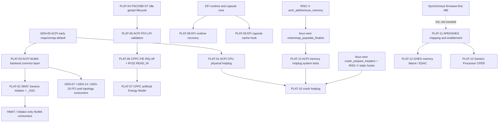

# RISC-V Platform / ACPI / NUMA / Power / RAS 架构接口差距

## 1. 范围、基线与结论

本文聚焦 RISC-V 相对 arm64/x86 在平台固件接口上的可执行贡献点，覆盖 ACPI、NUMA、CPU/memory hotplug、cpuidle、CPPC、EFI、kdump、APEI/GHES/CPER 和 RAS。候选数量、分类、优先级、状态、原始架构和评分严格以统一候选注册表为准。

- **mainline 基线**：`d96fcfe1b7f94ac742984ae7986b94a116abff1b`，Linux 7.2-rc2，日期 2026-07-10。
- **linux-next 基线**：`bee763d5f341b99cf472afeb508d4988f62a6ca1`，`next-20260710`。
- **邮件窗口**：2025-01-01 至 2026-07-10。
- **候选总数**：**13**。
- **优先级**：P0 **2** 项，P1 **8** 项，P2 **3** 项。
- **通用化分类**：G0 **1** 项，G1 **6** 项，G2 **5** 项，G3 **1** 项。
- **上游状态**：13 项均为 **unclaimed**。其中部分公共前置已经进入 linux-next，但没有一项完成了注册表定义的 RISC-V 最终工作。
- **原始架构**：arm64 **9** 项，x86+arm64 **4** 项。
- **本领域最短落地路径**：PLAT-06 CPPC 正确性、PLAT-01 ACPI CPU physical hotplug、PLAT-02 SRAT Generic Initiator。
- **平台功能闭环路径**：PLAT-11 APEI 基础 → PLAT-12 GHES/EDAC/CPER；PLAT-13 memory hotplug 测试 → PLAT-10 crash hotplug。
- **长期通用化路径**：PLAT-03 ACPI NUMA、PLAT-04 idle genpd、PLAT-05 ACPI LPI、PLAT-09 EFI capsule cache hook。

分类定义：

- **G0**：generic/mainline/next 已覆盖主体，只剩 RISC-V enablement、cleanup 或测试。
- **G1**：已有稳定 generic hook，可直接实现 RISC-V backend。
- **G2**：两个或更多架构存在重复实现，适合下沉公共 helper、能力条件或生命周期框架。
- **G3**：arm64/x86 机制可参考，但必须按 RISC-V trap、cache、firmware 或中断语义重新证明。
- **G4**：依赖尚未稳定的硬件、固件、UAPI 或基础设施；纯观察项不进入本领域 13 项统计。

## 2. 十三项总表

| ID | 候选 | 原始架构 | G/P | 状态 | 评分 | 已有基础 | RISC-V 残余工作 |
|---|---|---|---|---|---:|---|---|
| PLAT-01 | RISC-V ACPI CPU physical hotplug | arm64 | G1/P0 | unclaimed | 26 | ACPI processor core、UID/RINTC 启动映射、逻辑 CPUHP 已有 | `acpi_map_cpu()`/`acpi_unmap_cpu()`、动态 UID↔hartid↔cpuid 生命周期、物理 add/remove 测试 |
| PLAT-02 | SRAT Generic Initiator 与 `_OSC` 能力接线 | x86+arm64 | G1/P1 | unclaimed | 23 | SRAT GI parser、HMAT/NUMA core 已有 | 去架构名门控、补 `_OSC` capability、RISC-V initiator-only node 测试 |
| PLAT-03 | arm64/RISC-V ACPI NUMA 后端通用化 | arm64 | G2/P2 | unclaimed | 18 | 两架构功能均存在但实现平行 | 公共 affinity 中间层、PXM/early map 下沉、保持 MPIDR/hartid 差异 |
| PLAT-04 | PSCI/SBI DT idle genpd 生命周期通用化 | arm64 | G2/P1 | unclaimed | 23 | PSCI/SBI 两套可运行 backend | 抽公共 builder/provider/subdomain/CPUHP 生命周期，保留 firmware 动作 |
| PLAT-05 | arm64/RISC-V ACPI FFH LPI 验证框架 | arm64 | G2/P1 | unclaimed | 23 | ACPI processor idle core 与两架构 FFH backend 已有 | 公共化 LPI 遍历、probe 缓存和错误回滚 |
| PLAT-06 | CPPC FIE IRQ-off 读取与 RV32 `READ_HI` | arm64 | G1/P0 | unclaimed | 26 | RISC-V CPPC FFH backend 已有 | 修复 IRQ-disabled 本地读取契约，补 RV32 64 位一致性读取 |
| PLAT-07 | CPPC artificial Energy Model 通用化 | arm64 | G2/P2 | unclaimed | 18 | arm64 artificial EM 实现已存在 | 去 arm64 硬编码，定义可选 efficiency-class provider 和 RISC-V 安全启用条件 |
| PLAT-08 | EFI runtime exception recovery 与恢复栈 | arm64 | G3/P2 | unclaimed | 15 | arm64 独立栈与异常 fixup 可参考 | 设计 RISC-V runtime stack、trap fixup 和严格恢复判定 |
| PLAT-09 | EFI capsule cache-maintenance 通用 hook | x86+arm64 | G2/P1 | unclaimed | 23 | ARM/arm64 capsule cache clean 已有 | capability/空 hook 通用化，接入 RISC-V non-coherent/Zicbom 路径 |
| PLAT-10 | RISC-V crash hotplug 动态 `elfcorehdr` | arm64 | G1/P1 | unclaimed | 23 | linux-next 已有公共 crash header helper 和 RISC-V 静态接入 | `ARCH_SUPPORTS_CRASH_HOTPLUG`、动态事件 hook、容量和并发处理 |
| PLAT-11 | RISC-V APEI/GHES 基础与映射属性 | x86+arm64 | G1/P1 | unclaimed | 23 | APEI/GHES/ERST/EINJ generic core 已有 | `arch_apei_get_mem_attribute()`、`HAVE_ACPI_APEI`、异步通知验证 |
| PLAT-12 | GHES memory failure/EDAC 与 Generic Processor CPER | arm64 | G1/P1 | unclaimed | 23 | memory failure、GHES EDAC、CPER generic section 已有 | 架构启用、注入测试、Generic Processor 结构化 trace 与 hart 映射 |
| PLAT-13 | RISC-V ACPI memory hotplug 启用与系统测试 | x86+arm64 | G0/P1 | unclaimed | 24 | `arch_add_memory()`/`arch_remove_memory()` 已有，next 有 vmemmap TLB 收尾 | QEMU/firmware add-remove-readd 闭环、配置覆盖、残余 bug 修复 |

六维评分字段为 `impact`、`generality`、`readiness`、`validation`、`hardware-independence`、`acceptance`，每项 0-5；基础阈值为 P0=24-30、P1=18-23、P2=12-17。24 分候选若仍依赖测试基础设施可降为 P1，18 分候选若需要实质架构证明可降为 P2。

## 3. 依赖层次

### 3.1 ACPI CPU hotplug

1. ACPI processor core 已经提供 `acpi_processor_make_present()` 和 `acpi_processor_make_not_present()`。
2. RISC-V 启动阶段已经能解析 MADT RINTC，并有 ACPI CPU UID 基础。
3. PLAT-01 需要补齐运行时 `acpi_map_cpu()`/`acpi_unmap_cpu()`，把 firmware UID、RINTC hartid、logical CPU id 和 CPU device 生命周期连接起来。
4. CPU 必须先经过普通 CPUHP offline，再允许物理 eject；SBI HSM 只承担 hart 状态动作，不替代 ACPI device 生命周期。
5. NUMA、IMSIC、CPU topology 和 crash hotplug 都是下游消费者，首版不能同时重构这些子系统。

### 3.2 SRAT Generic Initiator 与 NUMA

1. ACPI early table map/unmap 的重复实现可由 GEN-05 先行收敛，但不是 PLAT-02/03 的硬依赖。
2. PLAT-03 把 arm64/RISC-V 共有的 PXM 校验、early CPU-node map 和最终 node assignment 下沉到 ACPI NUMA 通用层。
3. PLAT-02 在通用 NUMA 基础上启用 SRAT Generic Initiator，并同步 `drivers/acpi/bus.c` 中 `_OSC` Generic Initiator capability。
4. initiator-only node 不能被错误标记为包含 CPU 或内存；HMAT、PCI/CXL device handle 和距离消费者必须验证。
5. GEN-07、GEN-14、GEN-15 分别处理 PCI bus node、generic topology 和 PCI ACPI host 的能力表达，不能混入 PLAT-02 的首个系列。

### 3.3 Idle 与 CPPC

1. PLAT-04 处理 DT 描述的 PSCI/SBI CPU idle genpd 生命周期，不改变 PSCI/SBI state encoding。
2. PLAT-05 处理 ACPI `_LPI` FFH probe/遍历/错误回滚，不改变 PSCI/SBI enter 动作。
3. PLAT-06 是正确性缺口：scheduler tick 的 CPPC FIE 读取可能在 IRQ disabled 上下文调用 RISC-V FFH backend；RV32 还缺高 32 位读取。
4. PLAT-07 只有在 CPPC 能稳定工作、capacity/topology 数据可信时才能注册 artificial EM。

### 3.4 EFI

1. PLAT-09 只解决 capsule buffer 交给 firmware 前的 cache maintenance 能力表达。
2. PLAT-08 处理 EFI runtime service 自身发生同步异常时的恢复，涉及 trap entry、恢复栈和汇编 trampoline。
3. 两项都依赖 firmware/OS coherency contract，但没有实现依赖关系，应分成独立系列。

### 3.5 Crash hotplug

1. linux-next 已引入 `crash_prepare_headers()`、`arch_get_system_nr_ranges()` 和 `arch_crash_populate_cmem()`，并让 RISC-V 能用公共 helper 构造初始 crash headers。
2. 这些前置只解决静态 `elfcorehdr` 构造，不代表 crash hotplug 已完成。
3. PLAT-10 仍需实现 `ARCH_SUPPORTS_CRASH_HOTPLUG`、`arch_crash_hotplug_support()` 和 `arch_crash_handle_hotplug_event()`。
4. CPU hotplug 和 memory hotplug 的完整事件序列、预留 header 容量、并发锁和 crash kernel 地址更新均需验证。

### 3.6 APEI、GHES、CPER 与 memory failure

1. PLAT-11 是架构入口：正确映射 GHES error status block，并选择 `HAVE_ACPI_APEI`。
2. 首阶段只承诺 polled、SCI、GSIV、GPIO、external interrupt 等异步 GHES notification，以及 ERST/EINJ。
3. PLAT-12 第一阶段复用通用 `memory_failure()` 和 GHES EDAC；第二阶段为 `CPER_SEC_PROC_GENERIC` 增加结构化 trace 和 RISC-V processor-id/hart 映射。
4. 同步 firmware-first recovery 依赖 RISC-V 可恢复异常或 delegated event ABI，属于 G4 观察项，不计入 13 项。
5. `ARCH_SUPPORTS_MEMORY_FAILURE` 不能仅凭 Kconfig 差异启用；machine-check-safe access、同步通知和 poison 隔离语义需要单独证明。

### 3.7 Memory hotplug

1. RISC-V 已有 `arch_add_memory()`、`arch_remove_memory()`、`vmemmap_populate()` 和 `vmemmap_free()`。
2. linux-next 的 `vmemmap_populate_finalize()` 处理 non-present TLB entry 的架构收尾，说明 remove/re-add 路径存在真实的 RISC-V 特有验证要求。
3. PLAT-13 的交付标准不是“能够编译”或“只支持 add/online”，而是 add → online → offline → remove → re-add 的完整闭环。
4. PLAT-13 是 PLAT-10 memory crash-hotplug 验证的重要前置。

## 4. 已合并、linux-next 前置与残余工作

| 候选 | 已合并或已存在基础 | 基线状态 | 不能重复提交的内容 | RISC-V 残余工作 |
|---|---|---|---|---|
| PLAT-01 | ACPI processor core、逻辑 CPUHP、RINTC 启动解析、统一 CPU UID 前置 | mainline/next 均缺 physical hotplug backend | 不重写 CPUHP core，不把逻辑 offline/online 当作缺失 | 动态 map/unmap、stable ID、device add/remove、HSM 与拓扑回滚 |
| PLAT-02 | SRAT GI 通用 parser 和 `_OSC` bit 定义已存在 | RISC-V 仍被架构条件排除 | 不复制 parser，不只加第三个架构名 | 能力门控、`_OSC` 接线、initiator-only node/HMAT 测试 |
| PLAT-03 | arm64/RISC-V 各自 ACPI NUMA backend 已可工作 | mainline/next 仍为平行实现 | 不统一 MPIDR/hartid 校验 | 下沉 PXM、early map 和 node assignment 骨架 |
| PLAT-04 | PSCI/SBI genpd backend 均存在 | mainline/next 均重复 | 不统一 firmware state encoding 或错误码 | 公共 provider、subdomain、CPUHP attach/detach 生命周期 |
| PLAT-05 | ACPI processor idle core 和两架构 FFH backend 已存在 | mainline/next 均重复 | 不复制 arm64 address encoding | 公共 LPI probe/遍历/缓存/回滚框架 |
| PLAT-06 | RISC-V CPPC FFH 已进入 mainline；`SBI_CPPC_READ_HI` 常量已定义 | 正确性缺口仍存在 | 不重写 CPPC core，不放宽 write 路径 | local IRQ-off read、远端 IPI 保持、RV32 high-low-high 或规范一致性算法 |
| PLAT-07 | arm64 artificial EM 已存在 | 仍由 arm64 预处理条件独占 | 不伪造 RINTC efficiency class | 架构中立 EM 计算、可选 provider、RISC-V 安全 skip 条件 |
| PLAT-08 | arm64 runtime stack/fixup 可参考 | RISC-V 无等价实现 | 不机械复制 arm64 trap 状态 | RISC-V 专用恢复合同、汇编 trampoline、故障注入 |
| PLAT-09 | ARM/arm64 capsule cache clean 已存在 | RISC-V 无 hook | 不在 EFI core 判断 Zicbom/vendor cache | capability/空 hook、RISC-V range clean、coherent no-op |
| PLAT-10 | linux-next `5beabef0cffa` 公共 crash helper；`7b078a0aa275` RISC-V 静态接入 | 前置在 next，动态 hotplug 未完成 | 不再复制 ELF RAM walker | capability、事件更新、header 容量/并发、CPU和memory组合测试 |
| PLAT-11 | APEI/GHES/ERST/EINJ generic core 已存在 | RISC-V 未选择 `HAVE_ACPI_APEI` | 不新建 RISC-V 私有 APEI core | memory attribute hook、异步通知、non-coherent buffer 证明 |
| PLAT-12 | `memory_failure()`、GHES EDAC、Generic Processor CPER 打印已存在 | RISC-V 架构入口和结构化路由缺失 | 不新建 RISC-V memory decoder 或私有 CPER GUID | 配置接入、EINJ、EDAC、generic processor trace/hart 映射 |
| PLAT-13 | RISC-V memory add/remove 已存在；next `3dbfb3d2497f` 增加 vmemmap 收尾 | 功能基础存在，系统证据不足 | 不再把 memory hotplug 描述为完全缺失 | GED/firmware 测试、remove/re-add、defconfig 评估、残余修复 |

## 5. 与通用化清单的重叠

这些条目不是额外的 Platform 候选，不能增加本领域 13 项总数。

| Genericization ID | 与 Platform 的关系 | 最终边界 |
|---|---|---|
| GEN-05 | ACPI early table map/unmap 默认实现 | 为 ACPI 平台代码减重复；独立于 PLAT-01/02/03 发送，保留 x86 `phys == 0` 和极早期映射 override |
| GEN-06 | `raw_pci_read/write()` 通用 bus lookup | 服务 RISC-V/arm64 ACPI PCI；不混入 SRAT GI 系列 |
| GEN-07 | PCI topology opt-in `dev_to_node()` helper | PLAT-02/03 的 PCI NUMA 消费者；不能直接改变 `asm-generic/topology.h` 全局默认 |
| GEN-14 | 用已有 `GENERIC_ARCH_TOPOLOGY` 替换架构名判断 | 2025-09 v4 后 dormant；复盘 review 后再接手，不新增多余 Kconfig |
| GEN-15 | PCI ACPI host 使用现有能力组合门控 | 优先验证 `PCI_DOMAINS_GENERIC && PCI_ECAM && ACPI`，只有反例证明不足时才新增 capability |
| HC-19 → PLAT-02 | SRAT Generic Initiator capability | 已完全并入 PLAT-02，并补齐 `_OSC` capability 与 HMAT 测试 |
| HC-28 → PLAT-03 | ACPI NUMA CPU affinity 骨架 | 已完全并入 PLAT-03，最终注册表优先级为 P2，不再单独计数 |

## 6. 完整候选卡片

### PLAT-01：RISC-V ACPI CPU physical hotplug

- **注册表元数据**：Platform/ACPI/RAS；源报告 `PLAT:5.1 + IRQ:IST-13`；G1；P0；unclaimed；原始架构 arm64。
- **六维评分**：impact=5，generality=4，readiness=5，validation=4，hardware-independence=4，acceptance=4；**总分 26**。
- **基线校准**：mainline 与 linux-next 均未实现。RISC-V 已有逻辑 CPU offline/online、MADT RINTC 启动解析和统一 ACPI CPU UID 基础，但未选择 `ACPI_HOTPLUG_CPU`。
- **架构参照**：arm64 实现 `acpi_map_cpu()`/`acpi_unmap_cpu()`，使 ACPI processor device 的 physical add/remove 进入统一 CPU device 和 CPUHP 路径；x86 也启用同一 ACPI hotplug core。
- **关键路径与符号**：
  - `drivers/acpi/acpi_processor.c::acpi_processor_make_present()`
  - `drivers/acpi/acpi_processor.c::acpi_processor_make_not_present()`
  - `arch/arm64/kernel/acpi.c::acpi_map_cpu()`
  - `arch/arm64/kernel/acpi.c::acpi_unmap_cpu()`
  - `arch/riscv/kernel/acpi.c`
  - `arch/riscv/kernel/smpboot.c::{acpi_parse_rintc,acpi_parse_and_init_cpus,setup_smp}`
  - `arch_register_cpu()`、`arch_unregister_cpu()`、`acpi_get_cpu_uid()`
- **RISC-V 缺口**：启动时建立的 `cpuid_to_hartid_map` 是静态路径。运行时 ACPI processor notification 无法为新 RINTC/hart 建立 logical CPU，也无法在物理移除时对称撤销映射和 CPU device。
- **推荐方案**：
  1. 基于 ACPI UID、RINTC、hartid 建立稳定的 UID↔hartid↔cpuid 映射。
  2. 实现 `acpi_map_cpu()` 和 `acpi_unmap_cpu()`。
  3. 接入 `arch_register_cpu()`/`arch_unregister_cpu()`，维护 possible/present mask。
  4. 只在 `ACPI_PROCESSOR && HOTPLUG_CPU` 条件下选择 `ACPI_HOTPLUG_CPU`。
  5. eject 前要求 CPU 已 offline，并通过 SBI HSM 完成 hart 状态收敛。
- **第一版系列边界**：4-6 个补丁，依次完成 ID helper、map/unmap、Kconfig、CPU device 生命周期、QEMU/EDK2 测试。首版不处理厂商 hotplug controller、vCPU hot-remove policy、NUMA memory migration 或 IMSIC 动态重建。
- **阻塞与风险**：固件必须提供稳定 `_UID`、RINTC 和 `_STA`/device notification；hartid 不得在旧 CPU 生命周期未结束时复用；NUMA、topology、interrupt-controller 依赖必须能失败回滚。
- **验证**：QEMU ACPI GED CPU add/remove；重复通知；无效 UID；重复 hartid；online CPU eject；CPUHP callback 失败；NUMA node；多 IMSIC group；suspend 并发；possible/present/online mask 与 sysfs CPU device 一致性。
- **维护者路由**：RISC-V 架构、ACPI for RISC-V、ACPI core、CPU hotplug；列表为 `linux-riscv@lists.infradead.org`、`linux-acpi@vger.kernel.org`、`linux-kernel@vger.kernel.org`。
- **来源**：[arm64 ACPI CPU hotplug](https://lore.kernel.org/r/20240529133446.28446-18-Jonathan.Cameron@huawei.com)、[RISC-V UID 前置](https://patch.msgid.link/20260401081640.26875-4-fengchengwen@huawei.com)。

### PLAT-02：SRAT Generic Initiator 与 _OSC 能力接线

- **注册表元数据**：Platform/ACPI/RAS；源报告 `PLAT:5.2 + GEN:HC-19`；G1；P1；unclaimed；原始架构 x86+arm64。
- **六维评分**：impact=4，generality=4，readiness=4，validation=4，hardware-independence=4，acceptance=3；**总分 23**。
- **基线校准**：mainline 和 linux-next 均未覆盖 RISC-V。linux-next 的 SRAT node bookkeeping 变化没有扩大 Generic Initiator 的架构条件。
- **架构参照**：x86/arm64 可解析 Generic Initiator Affinity Structure，为 PCI/CXL 等 initiator 建立不含 CPU/内存的 proximity domain，并向 firmware 宣告 `_OSC` 支持。
- **关键路径与符号**：
  - `drivers/acpi/numa/srat.c::acpi_parse_gi_affinity()`
  - `drivers/acpi/numa/srat.c::acpi_parse_srat()`
  - `drivers/acpi/bus.c` 中 `OSC_SB_GENERIC_INITIATOR_SUPPORT`
  - `acpi_map_pxm_to_node()`
  - `/sys/devices/system/node/`
  - 当前 SRAT 条件 `CONFIG_X86 || CONFIG_ARM64`
- **RISC-V 缺口**：parser 在预处理阶段被排除；仅放开 parser 仍不完整，因为 `_OSC` feature mask 也必须同步声明 Generic Initiator 能力。
- **推荐方案**：
  1. 使用 ACPI NUMA 既有能力条件替换架构名判断，不增加第三个架构名。
  2. 将 `_OSC` Generic Initiator capability 与同一能力条件绑定。
  3. 验证 RISC-V PCI segment/device handle 能被通用 parser 解析。
  4. 添加 initiator-only node、非法 handle、重复 PXM 和 HMAT consumer 测试。
- **第一版系列边界**：SRAT parser 能力门控、`_OSC` capability、RISC-V enablement、ACPI table/KUnit 测试四层。PCI topology 和 ACPI host 的通用化留给 GEN-07/GEN-15。
- **阻塞与风险**：initiator-only node 不能被标记为 CPU 或 memory node；device handle 类型和 PCI segment 必须有效；HMAT 距离和内存放置 consumer 必须正确降级。
- **验证**：合法/非法 PCI device handle；PXM 映射；node state；HMAT initiator lookup；热插拔设备 node 归属；`/sys/devices/system/node/` 可见性。
- **维护者路由**：ACPI core、ACPI NUMA、ACPI for RISC-V、RISC-V、PCI/CXL/HMAT 评审者。
- **来源**：[Generic Initiator affinity 修复](https://patch.msgid.link/20250913023224.39281-1-xueshuai@linux.alibaba.com)。

### PLAT-03：arm64/RISC-V ACPI NUMA 后端通用化

- **注册表元数据**：Platform/ACPI/RAS；源报告 `PLAT:5.3 + GEN:HC-28`；G2；P2；unclaimed；原始架构 arm64。
- **六维评分**：impact=2，generality=4，readiness=3，validation=4，hardware-independence=4，acceptance=1；**总分 18**。
- **基线校准**：两棵基线均存在大段平行实现，没有公共 CPU-affinity helper。最终注册表将其从源报告 P1 校准为 P2。
- **架构参照**：arm64 与 RISC-V 都维护 early CPU-to-node map、PXM-to-node 转换、SRAT affinity 校验和启动后的 `set_cpu_numa_node()`。
- **关键路径与符号**：
  - `arch/arm64/kernel/acpi_numa.c::acpi_numa_gicc_affinity_init()`
  - `arch/riscv/kernel/acpi_numa.c::acpi_numa_rintc_affinity_init()`
  - 两端的 `acpi_map_cpus_to_nodes()`
  - `drivers/acpi/numa/srat.c`
  - `set_cpu_numa_node()`
- **RISC-V 缺口**：功能已经存在，但框架复制使 malformed SRAT、CPU hotplug、UID 解析和 Generic Initiator 相关修复容易在两架构间漂移。
- **推荐方案**：
  1. 在 `drivers/acpi/numa/` 增加架构中立的 processor-affinity 中间结构。
  2. 公共化 PXM 校验、node 分配、early map 存储、UID 查找和最终 node assignment。
  3. 架构 callback 只负责 GICC/RINTC entry 解码、MPIDR/hartid 到 logical CPU 转换和日志字段。
- **第一版系列边界**：下沉 early map/UID lookup；引入中间结构；迁移 arm64；迁移 RISC-V。首版不改变 MPIDR/hartid 合法性、disabled CPU 和错误降级语义。
- **阻塞与风险**：early boot 不能引入不必要动态分配；`NR_CPUS` 截断、disabled/possible CPU、重复 UID 和 malformed PXM 的现有行为必须保持；公共 API 形状需 ACPI 与两架构共同接受。
- **验证**：arm64/RISC-V 有效、缺失、重复、越界 PXM；`NR_CPUS` 小于 firmware CPU 数；CPU hotplug；比较重构前后 node map、启动日志和 fallback。
- **维护者路由**：ACPI core、ACPI for arm64、ACPI for RISC-V、arm64、RISC-V。
- **来源**：[RISC-V ACPI UID 前置](https://patch.msgid.link/20260401081640.26875-4-fengchengwen@huawei.com)。

### PLAT-04：PSCI/SBI DT idle genpd 生命周期通用化

- **注册表元数据**：Platform/ACPI/RAS；源报告 `PLAT:5.4`；G2；P1；unclaimed；原始架构 arm64。
- **六维评分**：impact=3，generality=5，readiness=4，validation=4，hardware-independence=5，acceptance=2；**总分 23**。
- **基线校准**：mainline/next 均保留两套高度相似的 PSCI/SBI provider、subdomain 和 CPUHP 生命周期。2025 年 genpd `sync_state` 变化需要成对修补。
- **关键路径与符号**：
  - `drivers/cpuidle/cpuidle-riscv-sbi.c::sbi_pd_init()`
  - `drivers/cpuidle/cpuidle-riscv-sbi.c::sbi_genpd_probe()`
  - `drivers/cpuidle/cpuidle-psci-domain.c::psci_pd_init()`
  - `drivers/cpuidle/cpuidle-psci-domain.c::psci_cpuidle_domain_probe()`
  - `drivers/cpuidle/dt_idle_genpd.c::dt_idle_pd_init_topology()`
  - `of_genpd_add_provider_simple()`、`pm_genpd_add_subdomain()`
- **RISC-V 缺口**：不是 idle 功能缺失，而是公共生命周期缺失。genpd core API 演进时，SBI backend 容易晚于 PSCI 获得修复。
- **推荐方案**：抽取 firmware CPU idle domain builder/lifecycle helper，负责 DT node 遍历、provider 注册、subdomain 连接、CPU attach/detach、失败回滚和 remove；架构 ops 负责 state decode、firmware suspend、有效性判断和名称。
- **第一版系列边界**：先建立无行为变化 helper 并迁移一个 backend，再迁移另一个。不得同时改变 PSCI OSI、SBI HSM suspend type 或 retentive 语义。
- **阻塞与风险**：PSCI/SBI 状态编码、错误码、OSI 和 power-off 动作不同；公共层不能隐藏 firmware-specific 失败；remove/sync_state 时序要与 genpd core 一致。
- **验证**：单层/多层 domain；缺失 parent；provider probe/remove；CPU online/offline；idle state failure；PSCI OSI 开关；SBI HSM 错误；genpd debugfs 对比。
- **维护者路由**：cpuidle、genpd、ARM PSCI、RISC-V/SBI；`linux-pm@vger.kernel.org` 和两架构列表。
- **来源**：[genpd sync_state 系列](https://lore.kernel.org/r/20250701114733.636510-25-ulf.hansson@linaro.org)。

### PLAT-05：arm64/RISC-V ACPI FFH LPI 验证框架

- **注册表元数据**：Platform/ACPI/RAS；源报告 `PLAT:5.5`；G2；P1；unclaimed；原始架构 arm64。
- **六维评分**：impact=3，generality=5，readiness=4，validation=4，hardware-independence=5，acceptance=2；**总分 23**。
- **基线校准**：两棵基线均有独立 arm64/RISC-V backend；通用 `drivers/acpi/processor_idle.c` 已存在，但 probe、state 遍历和错误路径仍重复。
- **关键路径与符号**：
  - `drivers/acpi/arm64/cpuidle.c::acpi_processor_ffh_lpi_probe()`
  - `drivers/acpi/arm64/cpuidle.c::acpi_processor_ffh_lpi_enter()`
  - `drivers/acpi/riscv/cpuidle.c::acpi_processor_ffh_lpi_probe()`
  - `drivers/acpi/riscv/cpuidle.c::acpi_processor_ffh_lpi_enter()`
  - `drivers/acpi/processor_idle.c`
- **RISC-V 缺口**：RISC-V 已支持 ACPI `_LPI`，真正问题是敏感 idle path 的公共修复需要重复落到两个 backend；2026 年 `__cpuidle` 修复已证明这种同步维护成本。
- **推荐方案**：公共化 LPI descriptor presence、state 遍历、probe 结果缓存、统一错误回滚和 instrumentation contract；PSCI/SBI callback 保留 address/state validation 和 enter 动作。
- **第一版系列边界**：只抽 probe/validation 骨架，不合并 `enter()` 实现，不改变 FFH address encoding，不重写 processor idle core。
- **阻塞与风险**：arm64 FFH address 与 RISC-V SBI suspend type 语义不同；`__cpuidle`、RCU、ftrace、Kprobes 和 noinstr 属性不能因 helper 下沉而改变。
- **验证**：多状态 `_LPI`；非法 FFH；retentive/non-retentive；probe 失败回滚；CPU hotplug 重探测；ftrace/Kprobes 开启；arm64/RISC-V 启动与 idle residency。
- **维护者路由**：ACPI core、ACPI for arm64、ACPI for RISC-V、cpuidle。
- **来源**：[LPI enter 标记为 `__cpuidle`](https://patch.msgid.link/20260616072617.2272-1-lirongqing@baidu.com)。

### PLAT-06：CPPC FIE IRQ-off 读取与 RV32 READ_HI

- **注册表元数据**：Platform/ACPI/RAS；源报告 `PLAT:5.6 + PLAT:5.7`；G1；P0；unclaimed；原始架构 arm64。
- **六维评分**：impact=5，generality=4，readiness=5，validation=4，hardware-independence=4，acceptance=4；**总分 26**。
- **基线校准**：mainline/next 均存在上下文不匹配；`SBI_CPPC_READ_HI` 已定义但没有调用路径。两个源候选在最终注册表合并为一个 FFH 正确性系列。
- **关键路径与符号**：
  - `drivers/acpi/riscv/cppc.c::cpc_read_ffh()`
  - `drivers/acpi/riscv/cppc.c::cpc_write_ffh()`
  - `drivers/acpi/riscv/cppc.c::SBI_CPPC_READ`
  - `drivers/acpi/riscv/cppc.c::SBI_CPPC_READ_HI`
  - `drivers/cpufreq/cppc_cpufreq.c::cppc_scale_freq_tick()`
  - `drivers/acpi/cppc_acpi.c::cppc_get_perf_ctrs()`
- **RISC-V 缺口**：
  1. CPPC FIE 在 scheduler tick 中读取 non-PCC counter，调用上下文可能 IRQ-disabled；RISC-V backend 当前拒绝该上下文并返回 `-EPERM`。
  2. RV32 的 SBI 返回寄存器不足以承载 64 位 counter；高 32 位命令没有被使用，可能截断 reference/performance counter。
- **推荐方案**：
  1. 本 CPU FFH read 在 IRQ-disabled 上下文走可证明 atomic 的 CSR/SBI 路径。
  2. 远端 CPU 保持 IPI/SMP call，避免改变深 idle 处理。
  3. RV32 对宽于 XLEN 的 register 执行 LOW/HIGH 一致性读取；根据 SBI 规范采用 low/high、high-low-high 重试或明确的 snapshot contract。
  4. read 修复不自动放宽 write 路径。
- **第一版系列边界**：local IRQ-off read；RV32 64 位读取；CPPC FIE/NO_HZ/CPUHP 自测或 mock 测试。首版不重构 CPPC core。
- **阻塞与风险**：SBI CPPC 在 trap/IRQ-off 上下文是否可调用必须由规范和 firmware 实现确认；counter rollover 不能产生撕裂值；不支持 `READ_HI` 时必须有明确错误。
- **验证**：CPPC FIE、NO_HZ、深 idle、CPU hotplug；CSR/SBI、本地/远端；lockdep 与 IRQ trace；RV32 rollover、`READ_HI` 不支持、低半失败、32 位 register。
- **维护者路由**：ACPI for RISC-V、cpufreq、RISC-V、SBI；`linux-acpi`、`linux-pm`、`linux-riscv`。
- **来源**：[RISC-V CPPC FFH 活跃修复](https://lore.kernel.org/r/20250818143600.894385-2-apatel@ventanamicro.com)。

### PLAT-07：CPPC artificial Energy Model 通用化

- **注册表元数据**：Platform/ACPI/RAS；源报告 `PLAT:5.8`；G2；P2；unclaimed；原始架构 arm64。
- **六维评分**：impact=2，generality=4，readiness=3，validation=4，hardware-independence=4，acceptance=1；**总分 18**。
- **基线校准**：mainline/next 的 `cppc_cpufreq_register_em()` 仍由 arm64 预处理条件独占。
- **关键路径与符号**：
  - `drivers/cpufreq/cppc_cpufreq.c::cppc_cpufreq_register_em()`
  - `drivers/cpufreq/cppc_cpufreq.c`
  - `struct acpi_processor::efficiency_class`
- **RISC-V 缺口**：CPPC driver 可运行，但 EM 注册被架构名排除；RINTC 没有与 GICC efficiency class 完全等价的标准字段，不能直接复制 arm64 数据来源。
- **推荐方案**：
  1. 把 CPPC perf/capacity 到 artificial EM performance state 的计算变成架构中立代码。
  2. 增加可选的 architecture efficiency-class provider，而不是假定所有架构都有 GICC 字段。
  3. RISC-V 仅在 CPPC capability、CPU capacity 和 topology 一致性可证明时注册。
  4. 缺少可靠异构效率信息时明确跳过，不制造虚假 power hierarchy。
- **第一版系列边界**：先做 arm64 无行为变化重构，再提供 provider 接口；RISC-V enablement 单独提交。不得在同一系列定义新的 firmware ABI。
- **阻塞与风险**：artificial power 不是测量功耗；RISC-V heterogeneous CPU capacity/efficiency 来源尚需共识；错误 EM 会影响 EAS placement。
- **验证**：对称/异构 CPPC 表；缺失 nominal/highest perf；不同 efficiency class；EM debugfs；EAS capacity 单调性；cpufreq policy 更新和 CPU hotplug。
- **维护者路由**：cpufreq、Energy Model、scheduler/topology、ACPI core、ACPI for RISC-V、RISC-V。
- **来源**：[mainline `cppc_cpufreq.c`](https://git.kernel.org/pub/scm/linux/kernel/git/torvalds/linux.git/tree/drivers/cpufreq/cppc_cpufreq.c?id=d96fcfe1b7f94ac742984ae7986b94a116abff1b)。

### PLAT-08：EFI runtime exception recovery 与恢复栈

- **注册表元数据**：Platform/ACPI/RAS；源报告 `PLAT:5.9`；G3；P2；unclaimed；原始架构 arm64。
- **六维评分**：impact=3，generality=3，readiness=2，validation=3，hardware-independence=2，acceptance=2；**总分 15**。
- **基线校准**：arm64 已实现独立 runtime stack 和异常 fixup；RISC-V mainline/next 均无等价机制。
- **关键路径与符号**：
  - `arch/arm64/kernel/efi.c::efi_runtime_fixup_exception()`
  - `arch/arm64/kernel/efi.c::efi_rt_stack_top`
  - `arch/arm64/kernel/efi-rt-wrapper.S::__efi_rt_asm_recover`
  - `arch/arm64/mm/fault.c`
  - `arch/riscv/kernel/efi.c`
  - `drivers/firmware/efi/riscv-runtime.c`
- **RISC-V 缺口**：runtime firmware 发生 load/store/page fault 或 illegal instruction 时，RISC-V 没有受控恢复路径，异常会进入普通内核 trap 处理并可能终止系统。
- **推荐方案**：
  1. 第一阶段引入 per-CPU 或受控 EFI runtime stack 和汇编 wrapper。
  2. 第二阶段在 trap path 中只识别“当前 CPU 正在 EFI runtime service”且 PC/stack 位于受控区域的异常。
  3. 改写返回路径到恢复 trampoline，返回 `EFI_ABORTED`，记录错误并禁用相应 runtime service。
  4. 非 EFI 异常保持原有 fatal 行为。
- **第一版系列边界**：建议先发 RFC，包含 trap state contract、恢复寄存器集合和故障注入实现。runtime stack 与 trap fixup 可分两个系列。
- **阻塞与风险**：必须证明 `satp`、`sscratch`、SIE、中断嵌套、per-CPU、SCS/CFI 和栈状态可恢复；错误判定不能吞掉真实内核异常。
- **验证**：可控 firmware 注入 page fault、访问错误、illegal instruction、嵌套中断和栈越界；确认错误返回、runtime 禁用、后续内核执行和非 EFI 异常不被拦截。
- **维护者路由**：EFI、RISC-V、RISC-V trap/entry 维护者；`linux-efi@vger.kernel.org`、`linux-riscv@lists.infradead.org`。
- **来源**：[arm64 EFI runtime recovery 实现](https://git.kernel.org/pub/scm/linux/kernel/git/torvalds/linux.git/tree/arch/arm64/kernel/efi.c?id=d96fcfe1b7f94ac742984ae7986b94a116abff1b)。

### PLAT-09：EFI capsule cache-maintenance 通用 hook

- **注册表元数据**：Platform/ACPI/RAS；源报告 `PLAT:5.10`；G2；P1；unclaimed；原始架构 x86+arm64。
- **六维评分**：impact=3，generality=5，readiness=4，validation=4，hardware-independence=5，acceptance=2；**总分 23**。
- **基线校准**：mainline/next 仍以 ARM/arm64 架构条件调用 cache flush；RISC-V 无 capsule hook。
- **关键路径与符号**：
  - `drivers/firmware/efi/capsule.c::efi_capsule_update_locked()`
  - `arch/arm64/include/asm/efi.h::efi_capsule_flush_cache_range()`
  - `arch/riscv/include/asm/efi.h`
- **RISC-V 缺口**：RISC-V non-coherent 或 Zicbom 平台可能需要在 capsule scatter-gather buffer 交给 firmware 前 clean cache，但通用代码不会调用 RISC-V 动作。
- **推荐方案**：
  1. 将架构名条件替换为 capability 或统一空 hook。
  2. coherent 架构使用 no-op default。
  3. RISC-V hook 调用已存在的架构 cache-maintenance provider，对给定虚拟地址范围 clean。
  4. EFI core 不直接判断 Zicbom、cache block size 或 vendor controller。
- **第一版系列边界**：generic hook；ARM/arm64 迁移；RISC-V implementation；non-coherent 测试。不能同时重构 DMA cache API。
- **阻塞与风险**：EFI runtime 与 OS coherency contract 必须明确；cache block 对齐、地址 alias、跨页 scatterlist 和不可缓存映射需要正确处理；coherent 系统不能做昂贵全缓存 flush。
- **验证**：coherent/no-op 与 non-coherent 两类平台；跨页 scatterlist；firmware pattern 校验；block alignment；高地址映射；capsule 失败回滚。
- **维护者路由**：EFI、RISC-V、RISC-V cache maintenance/DMA non-coherent。
- **来源**：[mainline EFI capsule core](https://git.kernel.org/pub/scm/linux/kernel/git/torvalds/linux.git/tree/drivers/firmware/efi/capsule.c?id=d96fcfe1b7f94ac742984ae7986b94a116abff1b)。

### PLAT-10：RISC-V crash hotplug 动态 elfcorehdr

- **注册表元数据**：Platform/ACPI/RAS；源报告 `PLAT:5.11`；G1；P1；unclaimed；原始架构 arm64。
- **六维评分**：impact=4，generality=4，readiness=4，validation=4，hardware-independence=4，acceptance=3；**总分 23**。
- **基线校准**：mainline 缺失；linux-next 已合入公共 crash header helper 和 RISC-V 静态接入，但没有动态 hotplug capability 与 event hook。
- **linux-next 前置**：
  - `kernel/crash_core.c::crash_prepare_headers()`
  - `arch/riscv/kernel/machine_kexec_file.c::arch_get_system_nr_ranges()`
  - `arch/riscv/kernel/machine_kexec_file.c::arch_crash_populate_cmem()`
  - 公共 helper 提交 `5beabef0cffa`
  - RISC-V 静态接入提交 `7b078a0aa275`
- **RISC-V 缺口**：加载 crash kernel 后，CPU/memory layout 发生变化时 `elfcorehdr` 不更新，vmcore 可能缺失新内存、包含已移除内存或使用过期 CPU notes。
- **推荐方案**：
  1. 选择 `ARCH_SUPPORTS_CRASH_HOTPLUG`。
  2. 实现 `arch_crash_hotplug_support()`，明确 kexec_file/kexec_load 和 image 类型。
  3. 实现 `arch_crash_handle_hotplug_event()`，复用 crash core 的 range 收集和排除。
  4. 只更新 `elfcorehdr` 与必要 RISC-V boot metadata，不复制 arm64/x86 私有 builder。
- **第一版系列边界**：基于 linux-next 前置开发；先支持 memory event，再支持 CPU event，或按 core 接口共同完成；包含预留空间不足和并发事件回滚。
- **阻塞与风险**：crash kernel 如何获得更新 header 地址；header 预留容量；image lock；CPU/memory hotplug 并发；事件失败后的旧 header 可用性。
- **验证**：加载 crash kernel；CPU online/offline；memory add/online/offline/remove/re-add；触发 crash；比较 vmcore `PT_LOAD`、CPU notes、`/proc/iomem`；覆盖容量不足和并发。
- **维护者路由**：KEXEC/KDUMP、RISC-V、CPU hotplug、MM/memory hotplug。
- **来源**：[公共 crash helper](https://patch.msgid.link/20260629094746.191843-4-ruanjinjie@huawei.com)、[RISC-V 静态接入](https://patch.msgid.link/20260629094746.191843-7-ruanjinjie@huawei.com)。

### PLAT-11：RISC-V APEI/GHES 基础与映射属性

- **注册表元数据**：Platform/ACPI/RAS；源报告 `PLAT:5.12`；G1；P1；unclaimed；原始架构 x86+arm64。
- **六维评分**：impact=4，generality=4，readiness=4，validation=4，hardware-independence=4，acceptance=3；**总分 23**。
- **基线校准**：mainline/next 均未选择 `HAVE_ACPI_APEI`；RISC-V 缺少 GHES error status block 映射所需的架构 memory attribute hook。
- **关键路径与符号**：
  - `drivers/acpi/apei/Kconfig::HAVE_ACPI_APEI`
  - `drivers/acpi/apei/ghes.c::ghes_map()`
  - `arch/arm64/include/asm/acpi.h::arch_apei_get_mem_attribute()`
  - `arch/riscv/include/asm/acpi.h`
  - `__acpi_get_mem_attribute()`
- **RISC-V 缺口**：APEI、ERST、EINJ、GHES 整体不可配置；直接选择 Kconfig 仍不足，因为 firmware error buffer 的 cacheability 和映射属性没有架构实现保证。
- **推荐方案**：
  1. 实现 `arch_apei_get_mem_attribute()`，优先复用 `__acpi_get_mem_attribute()`。
  2. 在 `ACPI && EFI` 条件下选择 `HAVE_ACPI_APEI`。
  3. 首阶段支持 polled、SCI、GSIV、GPIO、external interrupt 等异步 notification，以及 ERST/EINJ。
  4. 对 non-coherent error buffer 明确 cache maintenance 和 ownership。
- **第一版系列边界**：memory attribute hook、Kconfig enablement、APEI parser/ERST/EINJ、异步 GHES 测试。同步 firmware-first trap recovery 不进入同一系列。
- **阻塞与风险**：firmware memory attribute 必须正确；跨页 error block、并发 notification 和 non-coherent buffer 需要证明；错误映射可能读取旧错误记录或破坏 firmware ownership。
- **验证**：APEI table parser；ERST 读写；EINJ；GHES polled/SCI/GSIV；不同 memory attributes；跨页 block；并发 notification；关机/卸载路径。
- **维护者路由**：ACPI APEI、ACPI for RISC-V、RISC-V、EFI、RAS。
- **来源**：[arm64 APEI Kconfig 与实现基线](https://git.kernel.org/pub/scm/linux/kernel/git/torvalds/linux.git/tree/arch/arm64/Kconfig?id=d96fcfe1b7f94ac742984ae7986b94a116abff1b)。

### PLAT-12：GHES memory failure/EDAC 与 Generic Processor CPER

- **注册表元数据**：Platform/ACPI/RAS；源报告 `PLAT:5.13 + PLAT:5.14`；G1；P1；unclaimed；原始架构 arm64。
- **六维评分**：impact=4，generality=4，readiness=4，validation=4，hardware-independence=4，acceptance=3；**总分 23**。
- **基线校准**：通用 memory failure、GHES EDAC 和 CPER parser 已存在；受 PLAT-11 的 APEI 架构入口阻塞。CPER core 能识别 Generic Processor section，但没有适合 RISC-V 的结构化 GHES processor 路由。
- **关键路径与符号**：
  - `drivers/acpi/apei/ghes.c::ghes_handle_memory_failure()`
  - `drivers/acpi/apei/ghes.c::ghes_do_proc()`
  - `drivers/edac/ghes_edac.c::ghes_edac_register()`
  - `drivers/acpi/apei/Kconfig::ACPI_APEI_MEMORY_FAILURE`
  - `drivers/firmware/efi/cper.c::cper_estatus_print_section()`
  - `CPER_SEC_PROC_GENERIC`
  - `include/ras/ras_event.h`
- **RISC-V 缺口**：
  1. GHES memory error 尚未在 RISC-V 平台完成配置、注入和 EDAC 验证。
  2. 没有标准 RISC-V 私有 CPER GUID 时，应使用 Generic Processor section；当前主要停留在打印路径，缺少稳定 trace/rasdaemon 数据和 hart 映射。
- **推荐方案**：
  1. 第一阶段接通 GHES memory section → `memory_failure()`/soft offline → GHES EDAC。
  2. 第二阶段为 `CPER_SEC_PROC_GENERIC` 增加架构中立 trace event、严格长度校验和 `ghes_do_proc()` 路由。
  3. RISC-V 只实现 firmware processor ID 到 logical CPU/hart 的适配。
  4. 不发明 RISC-V 私有 CPER GUID，不实现微架构错误解码。
- **第一版系列边界**：GHES memory failure/EDAC 与 Generic Processor CPER 分成两个可独立评审的阶段，但在本注册表中作为同一 RAS consumer 候选。
- **阻塞与风险**：需要 GHES/EINJ firmware 或虚拟平台；fatal memory error 是否可恢复取决于 page type；Generic Processor 表达能力有限；processor ID 类型必须显式区分。
- **验证**：corrected/recoverable/fatal memory error；anonymous/file-backed/hugetlb/kernel page；EDAC 计数、poison、panic 策略；合法/截断 CPER、未知 validation bits、多 error-info；tracefs/rasdaemon。
- **维护者路由**：ACPI APEI、RAS、EDAC、memory failure/MM、EFI CPER、RISC-V。
- **来源**：[mainline GHES core](https://git.kernel.org/pub/scm/linux/kernel/git/torvalds/linux.git/tree/drivers/acpi/apei/ghes.c?id=d96fcfe1b7f94ac742984ae7986b94a116abff1b)。

### PLAT-13：RISC-V ACPI memory hotplug 启用与系统测试

- **注册表元数据**：Platform/ACPI/RAS；源报告 `PLAT:5.15`；G0；P1；unclaimed；原始架构 x86+arm64。
- **六维评分**：impact=3，generality=4，readiness=4，validation=5，hardware-independence=5，acceptance=3；**总分 24**。
- **基线校准**：RISC-V 架构基础已在 mainline；mainline defconfig 未启用完整 memory hotplug/ACPI hotplug 组合；linux-next 增加 `vmemmap_populate_finalize()`，处理 RISC-V non-present TLB entry。
- **关键路径与符号**：
  - `arch/riscv/mm/init.c::arch_add_memory()`
  - `arch/riscv/mm/init.c::arch_remove_memory()`
  - `arch/riscv/mm/init.c::vmemmap_populate()`
  - `arch/riscv/mm/init.c::vmemmap_free()`
  - linux-next `arch/riscv/mm/init.c::vmemmap_populate_finalize()`
  - `CONFIG_MEMORY_HOTPLUG`
  - `CONFIG_MEMORY_HOTREMOVE`
  - `CONFIG_ACPI_HOTPLUG_MEMORY`
- **RISC-V 缺口**：不是缺少 arch hooks，而是 ACPI GED 场景、默认配置和 remove/re-add 路径缺少可重复的上游证据。
- **推荐方案**：
  1. 先建立 QEMU/firmware ACPI memory device 测试环境。
  2. 覆盖 add、online、offline、remove、re-add 和 NUMA node 归属。
  3. 在测试暴露问题后提交最小 bug fix。
  4. 只有闭环稳定后才讨论 defconfig enablement。
- **第一版系列边界**：测试说明、自测或 CI 配置；必要的 vmemmap/TLB 修复；最后单独评估 defconfig。仅支持 add/online 不算完成。
- **阻塞与风险**：QEMU RISC-V ACPI GED 和 firmware table generation；memory block size；direct-map 上限；vmemmap non-present TLB；hugetlb、kdump reserve 和 NUMA 组合。
- **验证**：`CONFIG_DEBUG_VM`、page poisoning、sparse vmemmap；循环 add/remove/re-add；压力分配；NUMA；hugetlb；crash kernel；与 PLAT-10 组合。
- **维护者路由**：RISC-V、MM/memory hotplug、ACPI core、QEMU/firmware 测试维护者。
- **来源**：[RISC-V vmemmap finalize v4](https://lore.kernel.org/20260630-mark-after-vmemmap-populate-v4-1-febbc15da028@iscas.ac.cn)。

## 7. 伪差距与不应独立推进的方向

1. **“RISC-V 缺 CPPC”是伪差距。**
   `drivers/acpi/riscv/cppc.c` 已支持 SBI/CSR FFH。真实缺口是 PLAT-06 的 IRQ-disabled 读取契约和 RV32 高 32 位读取。

2. **“RISC-V 缺 ACPI `_LPI`”是伪差距。**
   `drivers/acpi/riscv/cpuidle.c` 已存在。贡献点是 PLAT-05 的公共 probe/validation 框架。

3. **“RISC-V 缺 CPU hotplug”表述过宽。**
   逻辑 CPU offline/online 和 SBI HSM 路径已存在。PLAT-01 只处理 ACPI physical CPU device add/remove。

4. **“RISC-V 缺 memory hotplug”是伪差距。**
   `arch_add_memory()`、`arch_remove_memory()` 和 vmemmap 生命周期已存在。PLAT-13 处理测试、配置和 remove/re-add 的残余问题。

5. **“RISC-V 缺 suspend/hibernate”是伪差距。**
   RISC-V 已有 `ARCH_SUSPEND_POSSIBLE`、`ARCH_HIBERNATION_POSSIBLE`、hibernation header 与 SBI system suspend，不应复制 arm64 early setup。

6. **“RISC-V 缺 NUMA”表述过宽。**
   ACPI RINTC affinity、CPU-to-node map 和 NUMA 基础已经存在。真实差距是 PLAT-02 的 Generic Initiator 和 PLAT-03 的后端通用化。

7. **linux-next crash header helper 不等于 crash hotplug 完成。**
   `crash_prepare_headers()` 和 RISC-V 静态 hooks 只构造初始 header；动态 event hooks 仍是 PLAT-10 的核心。

8. **仅选择 `HAVE_ACPI_APEI` 不等于 RAS 完成。**
   必须先实现 mapping attribute、异步 notification 和注入验证；同步 firmware-first recovery 属于另一个受 ABI 阻塞的方向。

9. **`ARCH_SUPPORTS_MEMORY_FAILURE` 不能作为一行 Kconfig 贡献。**
   该能力涉及 machine-check-safe access、同步错误上下文和 poison 页面恢复语义。PLAT-12 首先复用异步 GHES memory failure，不对更强能力作空承诺。

10. **EFI runtime recovery 不能机械移植 arm64。**
    arm64 的异常 frame、栈切换和 fixup trampoline 只能作为设计参照；RISC-V 必须证明自身 trap entry/return contract。

11. **同步 firmware-first notification 暂不进入主清单。**
    在 SBI SSE、AIA 或平台 firmware-first ABI 稳定前，直接照搬 ARM SEA/SDEI 会错误假设异常可恢复性和通知优先级。

## 8. 推荐贡献顺序

### 8.1 第一批：正确性和小边界

1. **PLAT-06**：RV32 `SBI_CPPC_READ_HI` 与 local IRQ-off read，可拆成两个先后清晰的小系列。
2. **PLAT-01**：先提交 UID/RINTC/hartid/cpuid 映射 helper，再接 physical hotplug。
3. **PLAT-02**：SRAT Generic Initiator 能力门控、`_OSC` 和 parser 测试。

### 8.2 第二批：平台功能闭环

1. **PLAT-11**：APEI memory attribute + 异步 GHES 基础。
2. **PLAT-12**：GHES memory failure/EDAC 注入，再做 Generic Processor CPER。
3. **PLAT-13**：ACPI memory hotplug add/remove/re-add 测试。
4. **PLAT-10**：基于 linux-next crash helper 完成动态 hotplug。

### 8.3 第三批：跨架构通用化

1. **PLAT-04**：PSCI/SBI idle genpd lifecycle。
2. **PLAT-05**：ACPI FFH LPI validation。
3. **PLAT-03**：ACPI NUMA processor-affinity 中间层。
4. **PLAT-09**：EFI capsule cache capability hook。

### 8.4 第四批：需架构与 firmware 论证

1. **PLAT-07**：CPPC artificial EM 与 RISC-V efficiency/capacity 来源。
2. **PLAT-08**：EFI runtime stack、trap fixup 和故障恢复 RFC。

## 9. 验证矩阵

### 9.1 构建验证

| 配置 | 覆盖候选 |
|---|---|
| RISC-V rv64 defconfig + ACPI + NUMA + HOTPLUG_CPU | PLAT-01/02/03 |
| RISC-V rv32 + ACPI + CPPC | PLAT-06 |
| RISC-V rv64 + CPU_IDLE + PM_GENERIC_DOMAINS | PLAT-04/05 |
| RISC-V rv64 + CPU_FREQ + ENERGY_MODEL | PLAT-06/07 |
| RISC-V rv64 + EFI | PLAT-08/09 |
| RISC-V rv64 + KEXEC_FILE + CRASH_DUMP | PLAT-10 |
| RISC-V rv64 + ACPI_APEI + MEMORY_FAILURE + EDAC | PLAT-11/12 |
| RISC-V rv64 + MEMORY_HOTPLUG + MEMORY_HOTREMOVE + ACPI_HOTPLUG_MEMORY | PLAT-10/13 |
| arm64 defconfig/allmodconfig + ACPI | PLAT-02/03/04/05/07/09 回归 |
| x86_64 defconfig + ACPI + NUMA + EFI + APEI | PLAT-02/09/11/12 回归 |

至少使用 GCC 和 Clang 各完成一轮；对 early ACPI、EFI wrapper 和 trap 代码检查 section mismatch、objdump 和 CFI/LTO 配置。

### 9.2 运行验证

- **ACPI CPU hotplug**：QEMU/EDK2 GED add/remove、重复通知、失败回滚、NUMA 和 IMSIC 组合。
- **SRAT/NUMA**：有效/非法 GI、PXM、device handle、HMAT、initiator-only node、`NR_CPUS` 截断。
- **Idle/CPPC**：PSCI/SBI 多层 domain、ACPI `_LPI`、FIE、NO_HZ、深 idle、CPU hotplug、RV32 rollover。
- **EFI**：capsule scatter-gather coherency；runtime fault/illegal instruction 注入；coherent/no-op 与 non-coherent 路径。
- **Crash hotplug**：加载 crash kernel 后进行 CPU/memory hotplug，再核对 vmcore `PT_LOAD`、CPU notes 和 `/proc/iomem`。
- **APEI/RAS**：ERST、EINJ、GHES polled/SCI/GSIV、memory failure、EDAC、Generic Processor CPER、rasdaemon。
- **Memory hotplug**：add → online → offline → remove → re-add 循环，结合 DEBUG_VM、page poisoning、NUMA、hugetlb 和 kdump。

### 9.3 完成判定

- 不能留下只在 Kconfig 中“可选择”但缺少运行证据的能力。
- 不能把 arm64/x86 的 architecture contract 作为 RISC-V 的默认假设。
- 公共化补丁必须先证明 arm64/x86/RISC-V 行为不变，再单独增加 RISC-V enablement。
- hotplug 系列必须验证失败回滚和重复事件，不以单次 add 成功作为完成。
- APEI、EFI、cache-maintenance 系列必须覆盖 non-coherent 或错误 firmware 的负向场景。

## 10. 维护者路由

| 子系统 | 主要维护者/评审方向 | 列表 | 涉及候选 |
|---|---|---|---|
| RISC-V | Paul Walmsley、Palmer Dabbelt、Albert Ou、Alexandre Ghiti | `linux-riscv@lists.infradead.org` | 全部 |
| ACPI for RISC-V | Sunil V L | `linux-acpi@vger.kernel.org`、`linux-riscv@lists.infradead.org` | PLAT-01/02/03/05/06/07/11/12/13 |
| ACPI core | Rafael J. Wysocki、Len Brown | `linux-acpi@vger.kernel.org` | PLAT-01/02/03/05/06/07/11/12/13 |
| CPU hotplug | Thomas Gleixner、Peter Zijlstra | `linux-kernel@vger.kernel.org` | PLAT-01/10 |
| cpuidle | Rafael J. Wysocki、Daniel Lezcano、Christian Loehle | `linux-pm@vger.kernel.org` | PLAT-04/05 |
| genpd | Ulf Hansson | `linux-pm@vger.kernel.org` | PLAT-04 |
| cpufreq / Energy Model | Rafael J. Wysocki、Viresh Kumar、EM/scheduler 评审者 | `linux-pm@vger.kernel.org` | PLAT-06/07 |
| EFI | Ard Biesheuvel、Ilias Apalodimas | `linux-efi@vger.kernel.org` | PLAT-08/09/11/12 |
| APEI / CPER / RAS | Rafael J. Wysocki、Tony Luck、Borislav Petkov、Hanjun Guo、Mauro Carvalho Chehab、Shuai Xue | `linux-acpi@vger.kernel.org`、`linux-edac@vger.kernel.org` | PLAT-11/12 |
| KEXEC/KDUMP | Andrew Morton、Baoquan He、Mike Rapoport、Pasha Tatashin、Pratyush Yadav | `kexec@lists.infradead.org` | PLAT-10 |
| MM / memory hotplug | MM、memory-hotplug、memory-failure 维护者 | `linux-mm@kvack.org`、`linux-kernel@vger.kernel.org` | PLAT-10/12/13 |
| PCI / NUMA / HMAT | PCI、ACPI NUMA、CXL/HMAT 维护者 | `linux-pci@vger.kernel.org`、`linux-acpi@vger.kernel.org` | PLAT-02/03 |

实际投稿前必须针对每个补丁运行 `scripts/get_maintainer.pl`。上表用于系列拆分和早期抄送设计，不替代提交时的动态维护者解析。

## 11. 来源索引

- [mainline 基线](https://git.kernel.org/pub/scm/linux/kernel/git/torvalds/linux.git/commit/?id=d96fcfe1b7f94ac742984ae7986b94a116abff1b)
- [linux-next 基线](https://git.kernel.org/pub/scm/linux/kernel/git/next/linux-next.git/commit/?id=bee763d5f341b99cf472afeb508d4988f62a6ca1)
- [ACPI CPU hotplug arm64 参考](https://lore.kernel.org/r/20240529133446.28446-18-Jonathan.Cameron@huawei.com)
- [RISC-V ACPI CPU UID 前置](https://patch.msgid.link/20260401081640.26875-4-fengchengwen@huawei.com)
- [SRAT Generic Initiator affinity 修复](https://patch.msgid.link/20250913023224.39281-1-xueshuai@linux.alibaba.com)
- [PSCI/SBI genpd 邻近系列](https://lore.kernel.org/r/20250701114733.636510-25-ulf.hansson@linaro.org)
- [ACPI LPI `__cpuidle` 修复](https://patch.msgid.link/20260616072617.2272-1-lirongqing@baidu.com)
- [RISC-V CPPC FFH 修复](https://lore.kernel.org/r/20250818143600.894385-2-apatel@ventanamicro.com)
- [crash header 公共 helper](https://patch.msgid.link/20260629094746.191843-4-ruanjinjie@huawei.com)
- [RISC-V crash header 静态接入](https://patch.msgid.link/20260629094746.191843-7-ruanjinjie@huawei.com)
- [RISC-V vmemmap populate finalize](https://lore.kernel.org/20260630-mark-after-vmemmap-populate-v4-1-febbc15da028@iscas.ac.cn)
- [dormant topology v4](https://lore.kernel.org/linux-arm-kernel/20250923015409.15983-2-cuiyunhui@bytedance.com/)

## 12. 限制

1. 状态判断固定在 2026-07-10 的 mainline/linux-next 快照；之后的新系列不在本文范围。
2. 本文完成了源码路径、符号、基线和邮件谱系审计，但没有替代真实 RISC-V ACPI server、EFI firmware、GHES/EINJ 或 non-coherent 硬件验证。
3. EFI coherency、EFI runtime trap recovery、同步 firmware-first notification 和 heterogeneous Energy Model 均需要先证明架构/firmware contract，不适合只凭 arm64 实现直接移植。
4. 本文只统计统一注册表中的 13 个 Platform/ACPI/RAS 主候选；GEN-05/06/07/14/15 和同步 firmware-first 观察项不重复计数。
