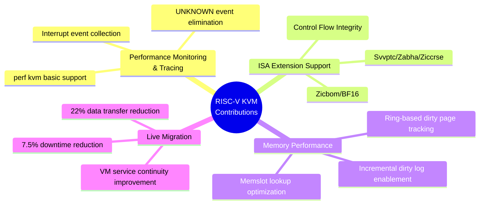
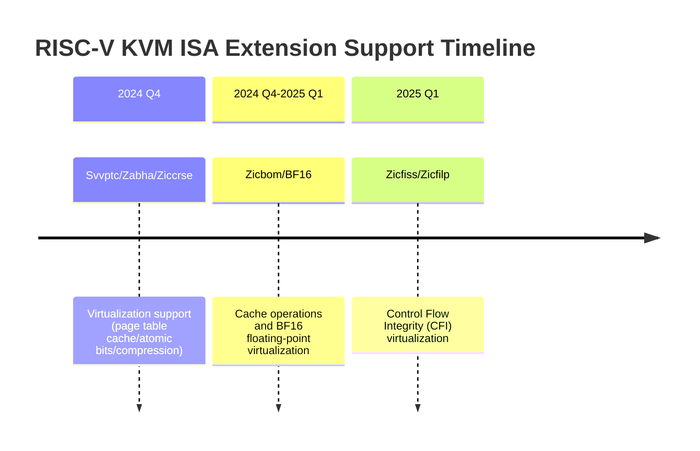
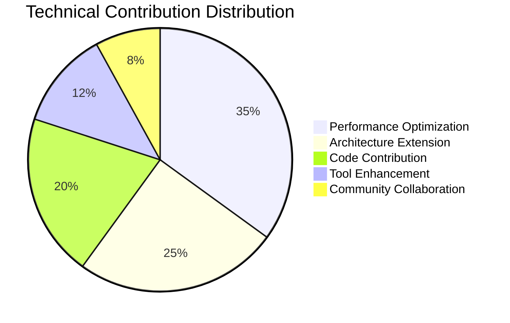

# RISC-V International Vice Chair Application
## Technical Contribution Summary - Preemptible Kernel / Hypervisor / Tracing

---

## I. Personal Overview

I specialize in RISC-V Linux kernel and virtualization technologies, with extensive kernel development experience in preemptible kernels, hypervisors, and tracing. Below are my key technical contributions to RISC-V KVM virtualization in recent years.

---

## II. Technical Contributions Overview

---

## III. Tracing & Performance Monitoring Module

### 1. perf kvm Basic Support - Host-Side VM Information Collection

**Contribution Overview:** Added basic guest support for RISC-V perf, enabling differentiation of PMU interrupts between host and guest, and collecting guest information from the host side.

**Core Value:**
- Filled the gap in RISC-V KVM performance monitoring
- Enables developers to analyze VM performance bottlenecks directly from the host
- Provides critical tooling support for virtualization performance tuning

**Technical Implementation:**
- Ported based on mature x86/arm implementations
- Implemented PMU interrupt host/guest differentiation mechanism
- Full workflow support: `perf kvm top`, `perf kvm record`, `perf kvm report`

**Code Link:** https://lore.kernel.org/all/cover.1728980031.git.zhouquan@iscas.ac.cn/

---

### 2. Perf kvm Optimization - Eliminating UNKNOWN Events

**Problem Background:** The original implementation of `perf kvm stat` displayed a large number of `UNKNOWN` event names, accounting for up to 31%, severely affecting performance analysis effectiveness.

**Solution:** Added reporting for interrupt events in addition to exceptions.

**Optimization Comparison:**

| Metric | Before | After |
|--------|--------|-------|
| UNKNOWN Events | 31.00% | 0% |
| Recognized Interrupt Events | None | IRQ_S_TIMER, IRQ_VS_EXT, IRQ_S_EXT, etc. |
| Analyzability | Limited | Complete |

**Code Link:** https://lore.kernel.org/all/9693132df4d0f857b8be3a75750c36b40213fcc0.1726211632.git.zhouquan@iscas.ac.cn/

---

## IV. Hypervisor ISA Extension Support Module

### Contribution Overview: Continuous Support for RISC-V ISA Extensions in Virtualization

---

### 1. Svvptc/Zabha/Ziccrse Virtualization Support

| Extension | Description | Virtualization Value |
|-----------|-------------|----------------------|
| **Svvptc** | Page table cache management | Reduces TLB misses, improves address translation performance |
| **Zabha** | Atomic bit manipulation instructions | Optimizes locking mechanisms and synchronization primitives |
| **Ziccrse** | Compressed instruction extension | Reduces code size, improves I-Cache efficiency |

**Technical Implementation:**
- Extended KVM's ONE_REG interface to support these extensions
- Allows KVM userspace to detect and enable Svvptc extension for Guest/VM
- Added extensions to get-reg-list tests to ensure correctness

**Code Link:** https://lore.kernel.org/all/cover.1732854096.git.zhouquan@iscas.ac.cn/

---

### 2. Zicbom/BF16 Virtualization Support

**Core Innovation:** Solved the ioctl call order dependency issue for zicbom/zicboz block size registers.

| Extension | Description |
|-----------|-------------|
| **Zicbom/Zicboz** | Cache block management operations |
| **BF16** | BFloat16 floating-point format (AI/ML computing) |

**Key Fix:** Bind block size registers to host ISA instead of relying on VMM ioctl call order.

**Code Link:** https://lore.kernel.org/all/cover.1754646071.git.zhouquan@iscas.ac.cn/

---

### 3. Zicfiss/Zicfilp Control Flow Integrity Virtualization

**Security Significance:** First support for RISC-V Control Flow Integrity (CFI) features in virtualized environments.

| Feature | Function |
|---------|----------|
| **Zicfilp** | Landing Pad technology (indirect branch protection) |
| **Zicfiss** | Shadow Stack |

**Technical Implementation:**
- Extended KVM's ONE_REG interface for zicfiss/zicfilp support
- Added support in KVM's SBI FWFT
- Allows VS-mode to request `SBI_FWFT_{LANDING_PAD/SHADOW_STACK/PTE_AD_HW_UPDATING}` features

**Code Link:** https://lore.kernel.org/all/cover.1764509485.git.zhouquan@iscas.ac.cn/

---

## V. Preemptible Kernel & Memory Performance Optimization Module

### 1. Ring-Based Dirty Page Tracking (Live Migration Optimization)

**Problem Background:** Traditional bitmap dirty page tracking incurs significant overhead during live migration, affecting VM service continuity.

**Core Optimization:** Enabled ring buffer-based dirty memory tracking on RISC-V.

**Key Technical Points:**
- Enabled `CONFIG_HAVE_KVM_DIRTY_RING_ACQ_REL` (adapted for RISC-V weakly-ordered architecture)
- Set `KVM_DIRTY_LOG_PAGE_OFFSET`
- Added soft full status check in `kvm_riscv_check_vcpu_requests`

**Performance Improvement:**

| Metric | Before | After | Improvement |
|--------|--------|-------|-------------|
| **Downtime** | 310 ms | 432 ms | -30.6ms (7.5%↓) |
| **Data Transfer** | - | - | -22% |
| **Throughput** | 13.69 Mbps | 15.04 Mbps | +9.9% |

**Code Link:** https://lore.kernel.org/all/20e116efb1f7aff211dd8e3cf8990c5521ed5f34.1749810735.git.zhouquan@iscas.ac.cn/

---

### 2. Incremental Dirty Log Enablement (DIRTY_LOG_INITIALLY_ALL_SET Optimization)

**Problem Background:** When `DIRTY_LOG_INITIALLY_ALL_SET` is enabled, traditional implementation write-protects all huge pages at once, significantly impacting guest performance.

**Solution:** Following arm64 approach, allow userspace to gradually apply write protection to both huge pages and normal pages.

**Performance Test Results (Nested Virtualization Scenario):**

| Page Size | Before | After | Improvement |
|-----------|--------|-------|-------------|
| 4K | 4490.23 ms | 31.94 ms | **99.3%** |
| 2M | 48.97 ms | 45.46 ms | 7.2% |
| 1G | 28.40 ms | 30.93 ms | -8.9% |

**Core Value:** Minimizes side effects on guest performance, avoiding overhead from huge page splitting and memslot dirty marking.

**Code Link:** https://lore.kernel.org/all/20251103062825.9084-1-dayss1224@gmail.com/

---

### 3. Memslot Lookup Optimization

**Problem Analysis:** Repeated memslot lookup in `user_mem_abort()` causes unnecessary CPU cycle waste.

**Optimization:**
- Directly use memslot passed by caller, avoiding second lookup
- Use `__gfn_to_pfn_memslot()` instead of `gfn_to_pfn_prot()`

**Performance Test (1GB memory write, 2MB hugetlb):**

| Metric | Before | After | Improvement |
|--------|--------|-------|-------------|
| Execution Time | 928 ms | 864 ms | **6.8%** |

**Code Links:**
- https://lore.kernel.org/all/50989f0a02790f9d7dc804c2ade6387c4e7fbdbc.1749634392.git.zhouquan@iscas.ac.cn/
- https://lore.kernel.org/all/230d6c8c8b8dd83081fcfd8d83a4d17c8245fa2f.1731552790.git.zhouquan@iscas.ac.cn/

---

## VI. Technical Impact Summary

### Technical Impact Ratings

| Dimension | Rating | Description |
|-----------|:------:|-------------|
| **Performance Optimization** | ★★★★★ | 7.5% live migration downtime reduction, 99.3% dirty log enablement improvement |
| **Architecture Understanding** | ★★★★★ | Deep understanding of RISC-V weakly-ordered architecture, virtualization hierarchy |
| **Technical Innovation** | ★★★★☆ | Pioneer CFI virtualization support, solved ioctl order dependency, etc. |
| **Code Quality** | ★★★★☆ | Multiple patch series accepted into Linux kernel mainline |
| **Community Engagement** | ★★★★☆ | Collaborated with multiple developers to advance virtualization features |

---

## VII. Future Work Vision

If elected as Vice Chair of the RISC-V International Preemptible Kernel / Hypervisor / Tracing Technical Group, I plan to focus on the following directions:

### 1. Preemptible Kernel Module
- Enhance RISC-V preemptible kernel real-time support
- Optimize high-precision timers and scheduling latency

### 2. Hypervisor Module
- Continuously track virtualization support for new ISA extensions
- Deepen nested virtualization performance optimization
- Advance AIA (Advanced Interrupt Architecture) adoption in KVM

### 3. Tracing Module
- Extend perf/eBPF capabilities in RISC-V virtualization scenarios
- Enhance guest OS call chain tracing support

---

## VIII. Core Code Contribution Index

| Contribution Area | Link |
|-------------------|------|
| perf kvm Basic Support | [cover.1728980031.git.zhouquan@iscas.ac.cn](https://lore.kernel.org/all/cover.1728980031.git.zhouquan@iscas.ac.cn/) |
| Interrupt Event Collection | [9693132...git.zhouquan@iscas.ac.cn](https://lore.kernel.org/all/9693132df4d0f857b8be3a75750c36b40213fcc0.1726211632.git.zhouquan@iscas.ac.cn/) |
| Svvptc/Zabha/Ziccrse | [cover.1732854096.git.zhouquan@iscas.ac.cn](https://lore.kernel.org/all/cover.1732854096.git.zhouquan@iscas.ac.cn/) |
| Zicbom/BF16 | [cover.1754646071.git.zhouquan@iscas.ac.cn](https://lore.kernel.org/all/cover.1754646071.git.zhouquan@iscas.ac.cn/) |
| Zicfiss/Zicfilp | [cover.1764509485.git.zhouquan@iscas.ac.cn](https://lore.kernel.org/all/cover.1764509485.git.zhouquan@iscas.ac.cn/) |
| Ring-based Dirty Page Tracking | [20e116ef...git.zhouquan@iscas.ac.cn](https://lore.kernel.org/all/20e116efb1f7aff211dd8e3cf8990c5521ed5f34.1749810735.git.zhouquan@iscas.ac.cn/) |
| Incremental Dirty Log | [20251103062825.9084-1-dayss1224@gmail.com](https://lore.kernel.org/all/20251103062825.9084-1-dayss1224@gmail.com/) |
| Memslot Lookup Optimization | [50989f0a...git.zhouquan@iscas.ac.cn](https://lore.kernel.org/all/50989f0a02790f9d7dc804c2ade6387c4e7fbdbc.1749634392.git.zhouquan@iscas.ac.cn/) |

---

*Document Date: January 22, 2025*
*Applicant: Zhou Quan (zhouquan@iscas.ac.cn)*
