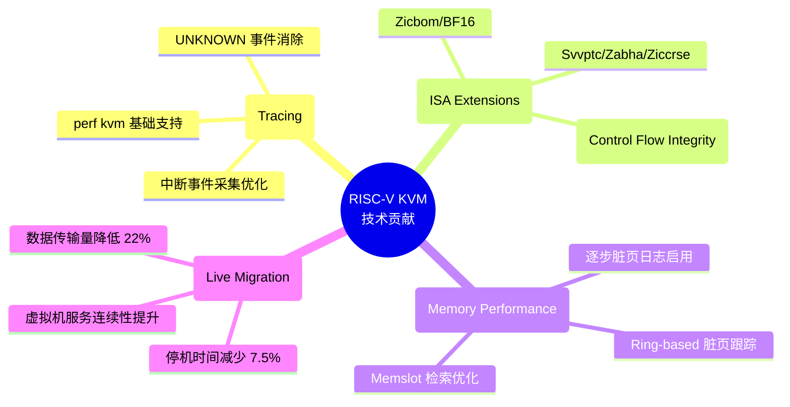
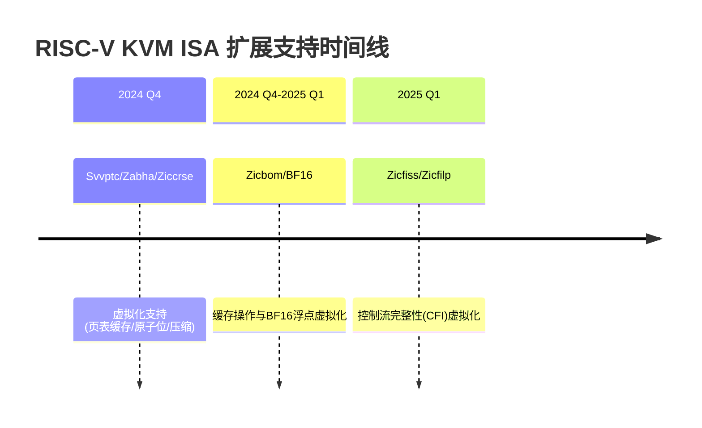

# RISC-V International 组织副主席职位申请
## 技术贡献总结 - Preemptible Kernel / Hypervisor / Tracing 模块

---

## 一、个人概述

本人专注于 RISC-V Linux 内核与虚拟化技术，在抢占式内核、Hypervisor、事件追踪（Tracing）等领域积累了丰富的内核开发经验。以下是我近年来在 RISC-V KVM 虚拟化方向的主要技术贡献。

---

## 二、技术贡献全景

---

## 三、事件追踪与性能监控模块 (Tracing & Performance)

### 1. perf kvm 基础支持 - 宿主机侧虚拟机信息采集

**贡献概述：** 为 RISC-V 的 perf 添加基本的 guest 支持，使其能够区分 PMU 中断是发生在主机还是 guest 中，从主机侧收集 guest 信息。

**核心价值：**
- 填补了 RISC-V KVM 在性能监控领域的空白
- 使开发者能够在宿主机侧直接分析虚拟机性能瓶颈
- 为虚拟化场景下的性能调优提供关键工具支持

**技术实现：**
- 基于 x86/arm 的成熟实现进行移植
- 实现 PMU 中断的 host/guest 区分机制
- 支持 `perf kvm top`、`perf kvm record`、`perf kvm report` 完整工作流

**代码链接：** https://lore.kernel.org/all/cover.1728980031.git.zhouquan@iscas.ac.cn/

---

### 2. Perf kvm 功能优化 - 消除 UNKNOWN 事件

**问题背景：** 原始实现中，`perf kvm stat` 会显示大量 `UNKNOWN` 事件名称，占比高达 31%，严重影响性能分析效果。

**解决方案：** 除异常（exceptions）外，新增中断（interrupts）事件的上报机制。

**优化效果对比：**

| 指标 | 优化前 | 优化后 |
|------|--------|--------|
| UNKNOWN 事件 | 31.00% | 0% |
| 可识别中断事件 | 无 | IRQ_S_TIMER、IRQ_VS_EXT、IRQ_S_EXT 等 |
| 可分析性 | 受限 | 完整 |

**代码链接：** https://lore.kernel.org/all/9693132df4d0f857b8be3a75750c36b40213fcc0.1726211632.git.zhouquan@iscas.ac.cn/

---

## 四、Hypervisor 指令集扩展支持模块

### 贡献概述：持续跟进 RISC-V ISA 扩展的虚拟化支持

---

### 1. Svvptc/Zabha/Ziccrse 虚拟化支持

| 扩展 | 功能描述 | 虚拟化价值 |
|------|----------|------------|
| **Svvptc** | 页表缓存管理 | 减少 TLB 缺失，提升地址转换性能 |
| **Zabha** | 原子位操作指令 | 优化锁机制与同步原语 |
| **Ziccrse** | 压缩指令扩展 | 减少代码体积，提升 I-Cache 效率 |

**技术实现：**
- 扩展 KVM 的 ONE_REG 接口以支持这些扩展
- 允许 KVM 用户空间检测并启用 Guest/VM 的 Svvptc 扩展
- 将扩展加入 get-reg-list 测试，确保功能正确性

**代码链接：** https://lore.kernel.org/all/cover.1732854096.git.zhouquan@iscas.ac.cn/

---

### 2. Zicbom/BF16 虚拟化支持

**核心创新：** 解决了 zicbom/zicboz 块大小寄存器的 ioctl 调用顺序依赖问题。

| 扩展 | 功能描述 |
|------|----------|
| **Zicbom/Zicboz** | 缓存块管理操作 |
| **BF16** | BFloat16 浮点格式（AI/ML 计算） |

**关键修复：** 将块大小寄存器绑定到主机 ISA，而非依赖 VMM 的 ioctl 调用顺序。

**代码链接：** https://lore.kernel.org/all/cover.1754646071.git.zhouquan@iscas.ac.cn/

---

### 3. Zicfiss/Zicfilp 控制流完整性虚拟化

**安全意义：** 这是 RISC-V Control Flow Integrity (CFI) 特性在虚拟化环境中的首次支持。

| 特性 | 功能 |
|------|------|
| **Zicfilp** | Landing Pad 技术（间接分支保护） |
| **Zicfiss** | Shadow Stack（影子栈） |

**技术实现：**
- 扩展 KVM 的 ONE_REG 接口支持 zicfiss/zicfilp
- 在 KVM 的 SBI FWFT 中新增支持
- 允许 VS 模式请求 `SBI_FWFT_{LANDING_PAD/SHADOW_STACK/PTE_AD_HW_UPDATING}` 特性

**代码链接：** https://lore.kernel.org/all/cover.1764509485.git.zhouquan@iscas.ac.cn/

---

## 五、抢占式内核与内存性能优化模块

### 1. Ring-based 脏页跟踪（热迁移性能优化）

**问题背景：** 传统 bitmap 脏页跟踪机制在热迁移过程中性能开销大，影响虚拟机服务连续性。

**核心优化：** 在 RISC-V 上启用基于环形缓冲区的脏内存追踪。

**关键技术点：**
- 启用 `CONFIG_HAVE_KVM_DIRTY_RING_ACQ_REL`（适配 RISC-V 弱序架构）
- 设置 `KVM_DIRTY_LOG_PAGE_OFFSET`
- 在 `kvm_riscv_check_vcpu_requests` 中增加 soft full 状态检查

**性能提升：**

| 指标 | 优化前 | 优化后 | 提升 |
|------|--------|--------|------|
| **停机时间** | 310 ms | 432 ms | -30.6ms (7.5%↓) |
| **数据传输量** | - | - | -22% |
| **吞吐量** | 13.69 Mbps | 15.04 Mbps | +9.9% |

**代码链接：** https://lore.kernel.org/all/20e116efb1f7aff211dd8e3cf8990c5521ed5f34.1749810735.git.zhouquan@iscas.ac.cn/

---

### 2. 逐步启用脏页日志（DIRTY_LOG_INITIALLY_ALL_SET 优化）

**问题背景：** 当启用 `DIRTY_LOG_INITIALLY_ALL_SET` 时，传统实现对所有大页进行一次性写保护，对 Guest 性能影响显著。

**解决方案：** 参考 arm64 做法，允许用户空间对大页和普通页逐步实施写保护。

**性能测试结果（嵌套虚拟化场景）：**

| 页面大小 | 优化前 | 优化后 | 提升 |
|----------|--------|--------|------|
| 4K | 4490.23 ms | 31.94 ms | **99.3%** |
| 2M | 48.97 ms | 45.46 ms | 7.2% |
| 1G | 28.40 ms | 30.93 ms | -8.9% |

**核心价值：** 最大限度地减少对 Guest 性能的副作用，避免大页拆解和 memslot 标记带来的开销。

**代码链接：** https://lore.kernel.org/all/20251103062825.9084-1-dayss1224@gmail.com/

---

### 3. Memslot 检索优化

**问题分析：** 在 `user_mem_abort()` 中重复检索内存 slot，造成不必要的 CPU 周期浪费。

**优化方案：**
- 直接使用调用者传入的内存 slot，避免二次检索
- 使用 `__gfn_to_pfn_memslot()` 替代 `gfn_to_pfn_prot()`

**性能测试（1GB 内存写操作，2MB hugetlb）：**

| 指标 | 优化前 | 优化后 | 提升 |
|------|--------|--------|------|
| 耗时 | 928 ms | 864 ms | **6.8%** |

**代码链接：**
- https://lore.kernel.org/all/50989f0a02790f9d7dc804c2ade6387c4e7fbdbc.1749634392.git.zhouquan@iscas.ac.cn/
- https://lore.kernel.org/all/230d6c8c8b8dd83081fcfd8d83a4d17c8245fa2f.1731552790.git.zhouquan@iscas.ac.cn/

---

## 六、技术影响力总结

| 维度 | 评价 |
|------|------|
| **代码贡献** | 多个系列补丁进入 Linux 内核主线 |
| **性能优化** | 热迁移停机时间减少 7.5%，脏页日志启用性能提升 99.3% |
| **架构扩展** | 支持多个前沿 ISA 扩展（CFI、BF16 等） |
| **工具完善** | 完善 RISC-V KVM 性能监控与分析工具链 |
| **社区协作** | 与多位开发者合作，共同推进虚拟化特性 |

---

## 七、未来工作展望

如能担任 RISC-V International 组织 Preemptible Kernel / Hypervisor / Tracing 模块副主席，我计划重点推进以下方向：

### 1. Preemptible Kernel 模块
- 完善 RISC-V 抢占式内核的实时性支持
- 优化高精度定时器与调度延迟

### 2. Hypervisor 模块
- 持续跟进新 ISA 扩展的虚拟化支持
- 深化嵌套虚拟化性能优化
- 推动 AIA (Advanced Interrupt Architecture) 在 KVM 中的应用

### 3. Tracing 模块
- 扩展 perf/eBPF 在 RISC-V 虚拟化场景的能力
- 增强_guest OS_ 调用链追踪支持

---

## 八、核心代码贡献索引

| 贡献领域 | 链接 |
|----------|------|
| perf kvm 基础支持 | [cover.1728980031.git.zhouquan@iscas.ac.cn](https://lore.kernel.org/all/cover.1728980031.git.zhouquan@iscas.ac.cn/) |
| 中断事件采集优化 | [9693132...git.zhouquan@iscas.ac.cn](https://lore.kernel.org/all/9693132df4d0f857b8be3a75750c36b40213fcc0.1726211632.git.zhouquan@iscas.ac.cn/) |
| Svvptc/Zabha/Ziccrse | [cover.1732854096.git.zhouquan@iscas.ac.cn](https://lore.kernel.org/all/cover.1732854096.git.zhouquan@iscas.ac.cn/) |
| Zicbom/BF16 | [cover.1754646071.git.zhouquan@iscas.ac.cn](https://lore.kernel.org/all/cover.1754646071.git.zhouquan@iscas.ac.cn/) |
| Zicfiss/Zicfilp | [cover.1764509485.git.zhouquan@iscas.ac.cn](https://lore.kernel.org/all/cover.1764509485.git.zhouquan@iscas.ac.cn/) |
| Ring-based 脏页跟踪 | [20e116ef...git.zhouquan@iscas.ac.cn](https://lore.kernel.org/all/20e116efb1f7aff211dd8e3cf8990c5521ed5f34.1749810735.git.zhouquan@iscas.ac.cn/) |
| 逐步脏页日志 | [20251103062825.9084-1-dayss1224@gmail.com](https://lore.kernel.org/all/20251103062825.9084-1-dayss1224@gmail.com/) |
| Memslot 检索优化 | [50989f0a...git.zhouquan@iscas.ac.cn](https://lore.kernel.org/all/50989f0a02790f9d7dc804c2ade6387c4e7fbdbc.1749634392.git.zhouquan@iscas.ac.cn/) |

---

*文档生成日期：2025年1月22日*
*申请人：Zhou Quan (zhouquan@iscas.ac.cn)*
